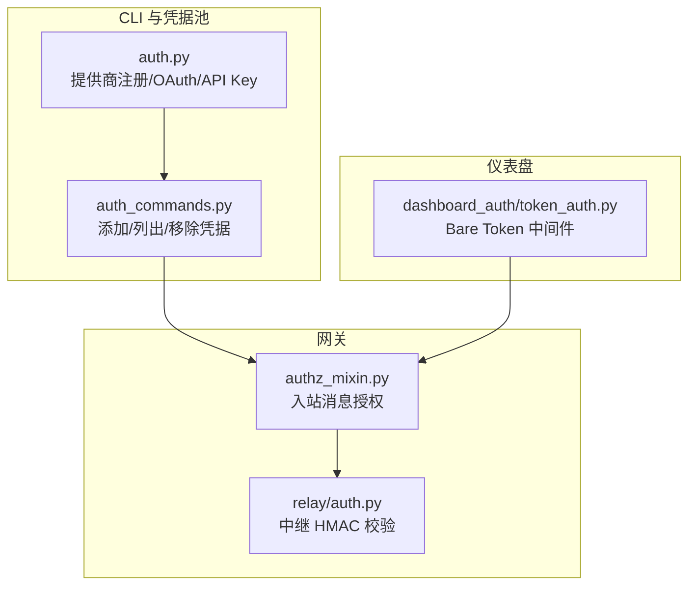
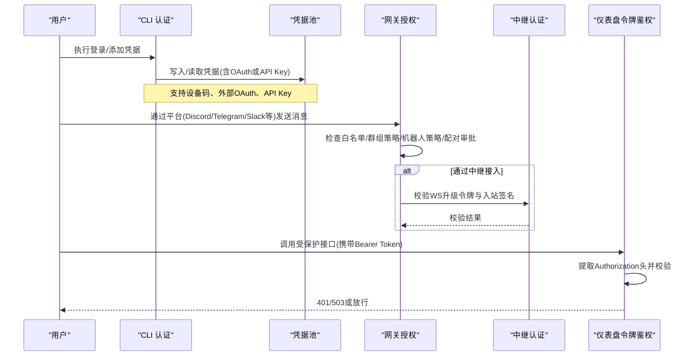
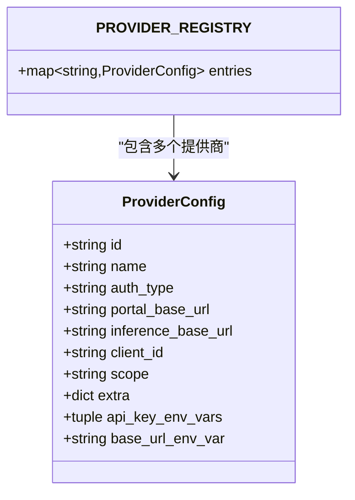
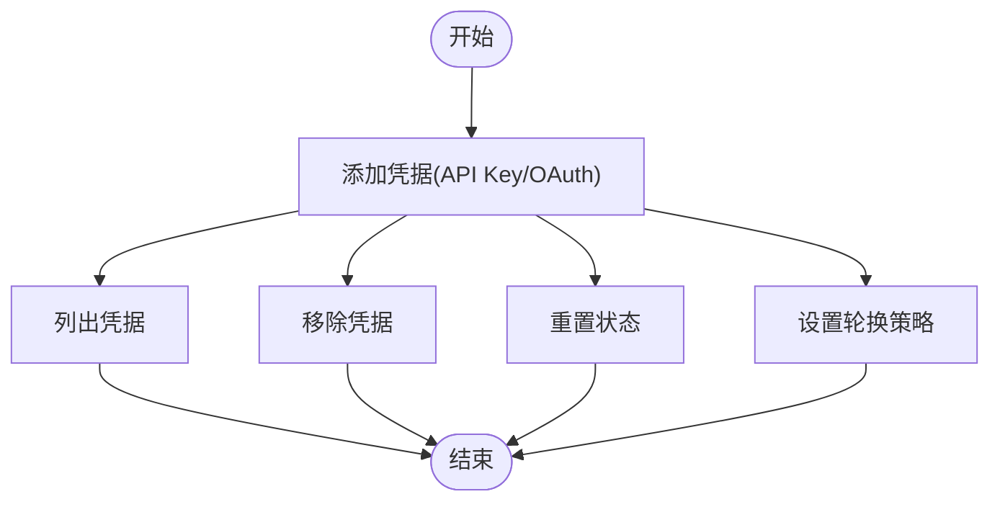
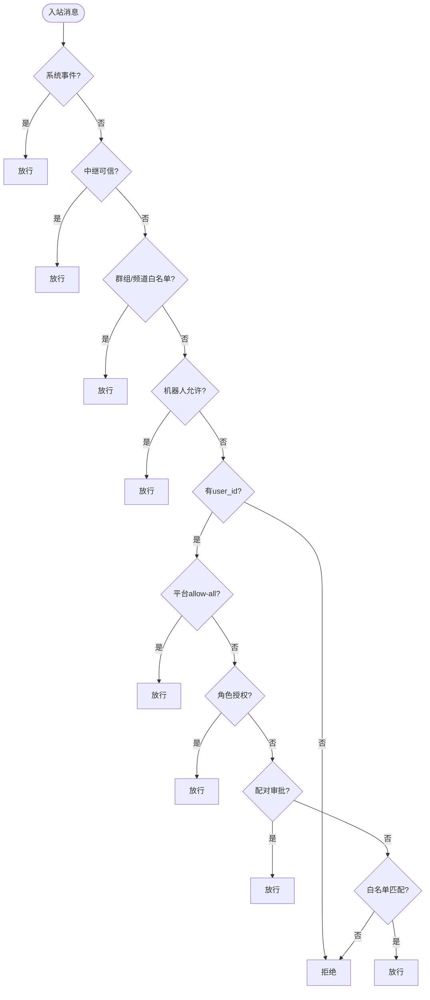
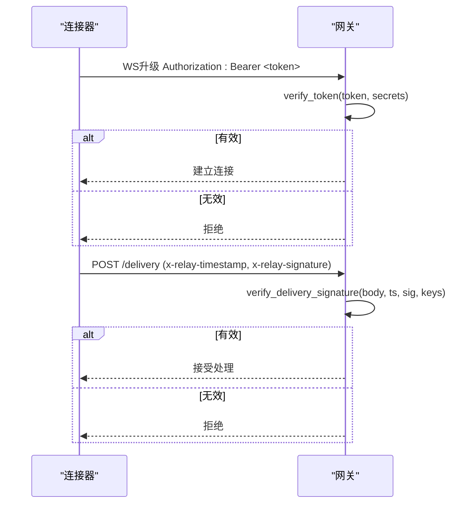
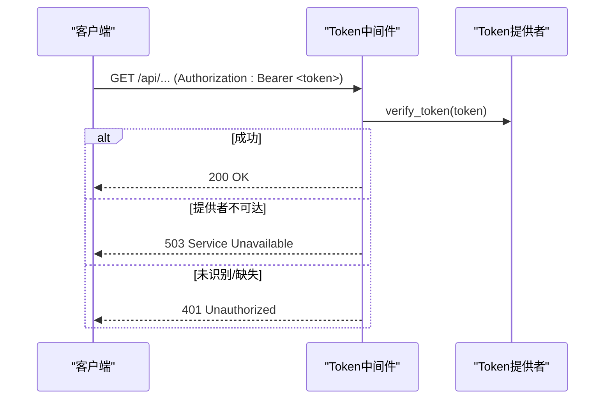
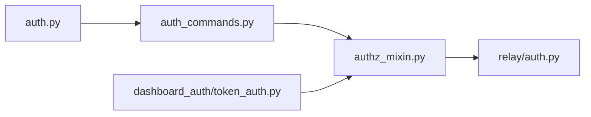

# 身份验证

<cite>
**本文引用的文件**
- [hermes_cli/auth.py](file://hermes_cli/auth.py)
- [hermes_cli/auth_commands.py](file://hermes_cli/auth_commands.py)
- [gateway/authz_mixin.py](file://gateway/authz_mixin.py)
- [gateway/relay/auth.py](file://gateway/relay/auth.py)
- [hermes_cli/dashboard_auth/token_auth.py](file://hermes_cli/dashboard_auth/token_auth.py)
</cite>

## 目录
1. [简介](#简介)
2. [项目结构](#项目结构)
3. [核心组件](#核心组件)
4. [架构总览](#架构总览)
5. [详细组件分析](#详细组件分析)
6. [依赖关系分析](#依赖关系分析)
7. [性能与安全考量](#性能与安全考量)
8. [故障排查指南](#故障排查指南)
9. [结论](#结论)
10. [附录：生产基线与合规要求](#附录生产基线与合规要求)

## 简介
本文件系统性说明 Hermes Agent 的身份验证机制，覆盖用户登录流程、令牌管理与会话认证；详解 OAuth 设备码流程、API 密钥验证、多平台接入（Discord、Telegram、Slack 等）与权限范围控制；并提供令牌刷新策略、会话状态管理、安全最佳实践、常见问题排查方法以及生产环境基线配置建议。

## 项目结构
Hermes 的认证体系由 CLI 层、网关授权层、中继认证与仪表盘令牌鉴权共同组成：
- CLI 认证与凭据池：负责多提供商注册、OAuth 设备码登录、API Key 解析与持久化、令牌刷新与轮换策略。
- 网关授权：对来自各平台的入站消息进行访问控制（白名单、群组策略、机器人策略、配对审批）。
- 中继认证：连接器与网关之间的双向 HMAC 签名校验，保障通道安全。
- 仪表盘令牌鉴权：面向服务间调用的非交互式 Bearer Token 中间件，按路由注册并逐提供者校验。

图表来源
- [hermes_cli/auth.py:190-507](file://hermes_cli/auth.py#L190-L507)
- [hermes_cli/auth_commands.py:164-434](file://hermes_cli/auth_commands.py#L164-L434)
- [gateway/authz_mixin.py:386-783](file://gateway/authz_mixin.py#L386-L783)
- [gateway/relay/auth.py:51-169](file://gateway/relay/auth.py#L51-L169)
- [hermes_cli/dashboard_auth/token_auth.py:60-195](file://hermes_cli/dashboard_auth/token_auth.py#L60-L195)

章节来源
- [hermes_cli/auth.py:190-507](file://hermes_cli/auth.py#L190-L507)
- [hermes_cli/auth_commands.py:164-434](file://hermes_cli/auth_commands.py#L164-L434)
- [gateway/authz_mixin.py:386-783](file://gateway/authz_mixin.py#L386-L783)
- [gateway/relay/auth.py:51-169](file://gateway/relay/auth.py#L51-L169)
- [hermes_cli/dashboard_auth/token_auth.py:60-195](file://hermes_cli/dashboard_auth/token_auth.py#L60-L195)

## 核心组件
- 提供商注册表与解析：集中声明支持的提供商、认证类型、基础 URL、环境变量键与作用域，支持动态扩展自定义 API Key 提供商。
- 凭据池与命令：提供添加、列出、移除、重置、状态查询等能力，支持 OAuth 与 API Key 两类凭据，支持轮换策略与耗尽状态展示。
- 网关授权：基于环境变量、平台策略、配对审批与上游中继信任链，决定入站消息是否允许。
- 中继认证：使用 HMAC-SHA256 对 WebSocket 升级令牌与入站交付签名进行校验，支持密钥轮换窗口。
- 仪表盘令牌鉴权：为已注册的路由提供 Bearer Token 校验，失败返回 401，后端不可用返回 503。

章节来源
- [hermes_cli/auth.py:190-507](file://hermes_cli/auth.py#L190-L507)
- [hermes_cli/auth_commands.py:164-434](file://hermes_cli/auth_commands.py#L164-L434)
- [gateway/authz_mixin.py:386-783](file://gateway/authz_mixin.py#L386-L783)
- [gateway/relay/auth.py:51-169](file://gateway/relay/auth.py#L51-L169)
- [hermes_cli/dashboard_auth/token_auth.py:60-195](file://hermes_cli/dashboard_auth/token_auth.py#L60-L195)

## 架构总览
下图展示了从用户登录到消息处理的端到端认证路径：

图表来源
- [hermes_cli/auth_commands.py:164-434](file://hermes_cli/auth_commands.py#L164-L434)
- [gateway/authz_mixin.py:386-783](file://gateway/authz_mixin.py#L386-L783)
- [gateway/relay/auth.py:51-169](file://gateway/relay/auth.py#L51-L169)
- [hermes_cli/dashboard_auth/token_auth.py:60-195](file://hermes_cli/dashboard_auth/token_auth.py#L60-L195)

## 详细组件分析

### 提供商注册与认证类型
- 支持多种认证类型：设备码 OAuth、外部 OAuth、API Key、AWS SDK、Vertex、外部进程等。
- 每个提供商包含 ID、名称、认证类型、门户/推理基础 URL、客户端 ID、作用域、环境变量键等元信息。
- 支持动态扩展：自动发现 providers/ 下的 API Key 提供商并注入注册表。

图表来源
- [hermes_cli/auth.py:190-507](file://hermes_cli/auth.py#L190-L507)

章节来源
- [hermes_cli/auth.py:190-507](file://hermes_cli/auth.py#L190-L507)

### 凭据池与命令行操作
- 支持添加 API Key 与 OAuth 凭据，支持标签、优先级、来源标记。
- 支持列出、移除、重置状态、设置轮换策略（填充优先、轮询、最少使用、随机）。
- 针对特定提供商（如 Nous、OpenAI Codex、xAI、Qwen、MiniMax）提供专用登录流程。

图表来源
- [hermes_cli/auth_commands.py:164-434](file://hermes_cli/auth_commands.py#L164-L434)
- [hermes_cli/auth_commands.py:437-507](file://hermes_cli/auth_commands.py#L437-L507)
- [hermes_cli/auth_commands.py:509-544](file://hermes_cli/auth_commands.py#L509-L544)
- [hermes_cli/auth_commands.py:655-775](file://hermes_cli/auth_commands.py#L655-L775)

章节来源
- [hermes_cli/auth_commands.py:164-434](file://hermes_cli/auth_commands.py#L164-L434)
- [hermes_cli/auth_commands.py:437-507](file://hermes_cli/auth_commands.py#L437-L507)
- [hermes_cli/auth_commands.py:509-544](file://hermes_cli/auth_commands.py#L509-L544)
- [hermes_cli/auth_commands.py:655-775](file://hermes_cli/auth_commands.py#L655-L775)

### 网关授权与多平台接入
- 授权决策顺序：
  - 系统事件（Home Assistant、Webhook）直接放行。
  - 若经中继且上游已认证则放行。
  - 群组/频道按聊天 ID 白名单放行。
  - 机器人消息按平台开关放行。
  - 无 user_id 时拒绝。
  - 平台级 allow-all 开关放行。
  - 角色授权（如 Discord 角色）放行。
  - 配对审批通过放行。
  - 平台/全局白名单匹配放行。
  - 否则默认拒绝。
- 支持多平台环境变量映射（Telegram、Discord、WhatsApp、Slack、Signal、Email、SMS、Mattermost、Matrix、DingTalk、Feishu、WeCom、Weixin、BlueBubbles、QQBot、Yuanbao 等）。
- 适配器可声明“自身执行访问策略”，在 allowlist 模式下信任其入站过滤结果。

图表来源
- [gateway/authz_mixin.py:386-783](file://gateway/authz_mixin.py#L386-L783)

章节来源
- [gateway/authz_mixin.py:386-783](file://gateway/authz_mixin.py#L386-L783)

### 中继认证（连接器 ↔ 网关）
- WS 升级令牌：网关生成带过期时间的令牌，连接器以 Authorization: Bearer 形式提交，网关校验 payload 与签名。
- 入站交付签名：连接器对请求体与时间戳计算 HMAC，网关校验时间戳偏差与签名，支持密钥轮换列表。
- 常量时间比较防止时序攻击。

图表来源
- [gateway/relay/auth.py:51-169](file://gateway/relay/auth.py#L51-L169)

章节来源
- [gateway/relay/auth.py:51-169](file://gateway/relay/auth.py#L51-L169)

### 仪表盘令牌鉴权（服务间调用）
- 路由注册：仅对显式注册的路径启用 Bearer Token 校验。
- 中间件行为：提取 Authorization 头，尝试所有注册的 token 提供者；任一成功即放行并附加主体；全部不可达返回 503；其他情况返回 401。
- 审计：记录失败原因与来源 IP。

图表来源
- [hermes_cli/dashboard_auth/token_auth.py:60-195](file://hermes_cli/dashboard_auth/token_auth.py#L60-L195)

章节来源
- [hermes_cli/dashboard_auth/token_auth.py:60-195](file://hermes_cli/dashboard_auth/token_auth.py#L60-L195)

## 依赖关系分析
- CLI 认证模块依赖提供商注册表与环境变量解析，支撑 OAuth 设备码与 API Key 两种模式。
- 网关授权依赖平台适配器暴露的策略标志与配置，结合环境变量与配对存储进行综合判断。
- 中继认证依赖共享密钥与时间戳，确保通道安全与防重放。
- 仪表盘令牌鉴权依赖路由注册与提供者栈，保证最小权限与可插拔性。

图表来源
- [hermes_cli/auth.py:190-507](file://hermes_cli/auth.py#L190-L507)
- [hermes_cli/auth_commands.py:164-434](file://hermes_cli/auth_commands.py#L164-L434)
- [gateway/authz_mixin.py:386-783](file://gateway/authz_mixin.py#L386-L783)
- [gateway/relay/auth.py:51-169](file://gateway/relay/auth.py#L51-L169)
- [hermes_cli/dashboard_auth/token_auth.py:60-195](file://hermes_cli/dashboard_auth/token_auth.py#L60-L195)

章节来源
- [hermes_cli/auth.py:190-507](file://hermes_cli/auth.py#L190-L507)
- [hermes_cli/auth_commands.py:164-434](file://hermes_cli/auth_commands.py#L164-L434)
- [gateway/authz_mixin.py:386-783](file://gateway/authz_mixin.py#L386-L783)
- [gateway/relay/auth.py:51-169](file://gateway/relay/auth.py#L51-L169)
- [hermes_cli/dashboard_auth/token_auth.py:60-195](file://hermes_cli/dashboard_auth/token_auth.py#L60-L195)

## 性能与安全考量
- 令牌刷新策略：不同提供商定义了不同的提前刷新偏移（例如 120 秒、60 秒、3600 秒），避免运行时出现短暂失效导致的抖动。
- 并发探测：Z.AI 等提供商支持并行探测可用端点，减少启动延迟。
- 常量时间比较：中继签名校验使用常量时间比较，抵御时序侧信道。
- 最小权限：仪表盘令牌鉴权仅对注册路由生效，避免扩大认证面。
- 默认拒绝：网关授权在无白名单时默认拒绝，遵循安全基线。

[本节为通用指导，不直接分析具体文件]

## 故障排查指南
- 令牌无效或过期：检查提供商的令牌有效期与刷新偏移；确认凭据池中的条目状态与错误码；必要时重新登录或刷新。
- 中继签名失败：核对时间戳是否在允许偏差内；确认密钥轮换列表包含当前密钥；检查请求体字节一致性。
- 仪表盘 401/503：确认路由已注册；检查 Authorization 头格式；查看提供者是否可达；关注审计日志。
- 平台消息被拒：检查对应平台的环境变量白名单、群组白名单、机器人策略、配对审批；确认适配器策略是否为 allowlist。

章节来源
- [gateway/relay/auth.py:51-169](file://gateway/relay/auth.py#L51-L169)
- [hermes_cli/dashboard_auth/token_auth.py:60-195](file://hermes_cli/dashboard_auth/token_auth.py#L60-L195)
- [gateway/authz_mixin.py:386-783](file://gateway/authz_mixin.py#L386-L783)

## 结论
Hermes Agent 的身份验证体系以 CLI 凭据池为核心，结合网关授权、中继认证与仪表盘令牌鉴权，形成覆盖用户登录、令牌管理、会话认证与多平台接入的完整方案。通过严格的默认拒绝、白名单与配对审批机制，以及 HMAC 通道安全与令牌刷新策略，满足生产环境的可用性与安全性要求。

[本节为总结，不直接分析具体文件]

## 附录：生产基线与合规要求
- 强制白名单：为所有网络暴露的平台适配器配置明确的 allowlist 或禁用开放策略，避免 fail-open。
- 中继密钥轮换：维护主备密钥列表，确保轮换期间令牌与签名持续有效。
- 令牌生命周期：合理设置刷新偏移，避免运行期抖动；定期审查凭据池条目与状态。
- 仪表盘最小权限：仅注册必要路由，使用强随机 Bearer Token，限制来源 IP（如有条件）。
- 审计与监控：记录认证失败、提供者不可达与异常事件，便于快速定位问题。
- 合规性：遵循最小权限原则、默认拒绝、密钥轮换、审计追踪与敏感信息脱敏输出。

[本节为通用指导，不直接分析具体文件]