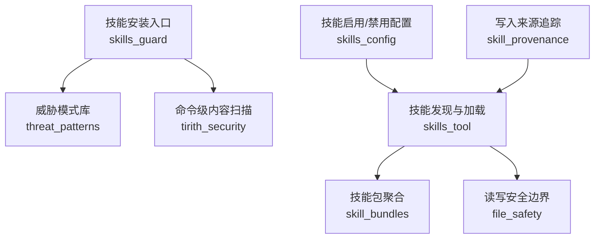
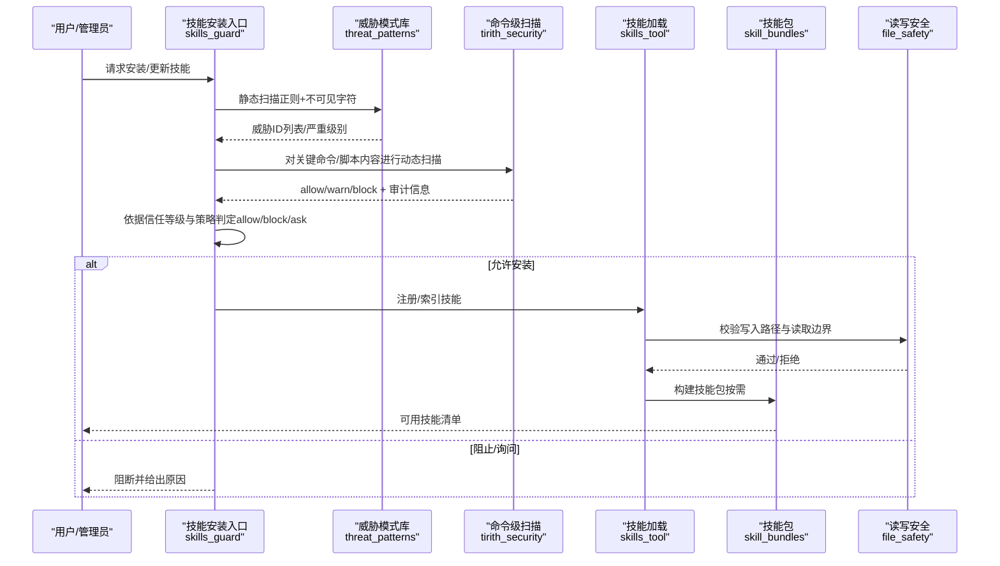
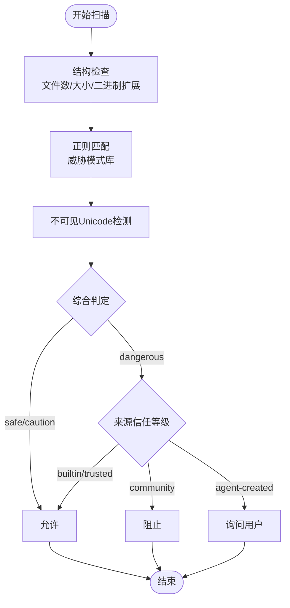
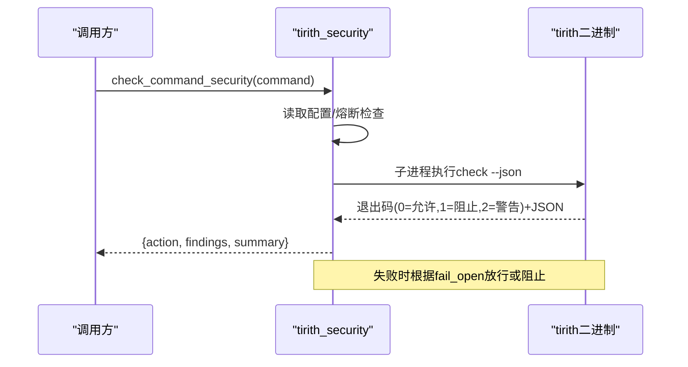
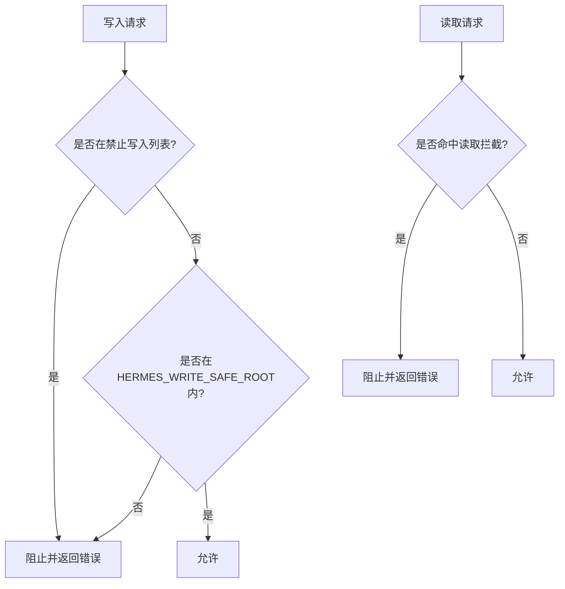
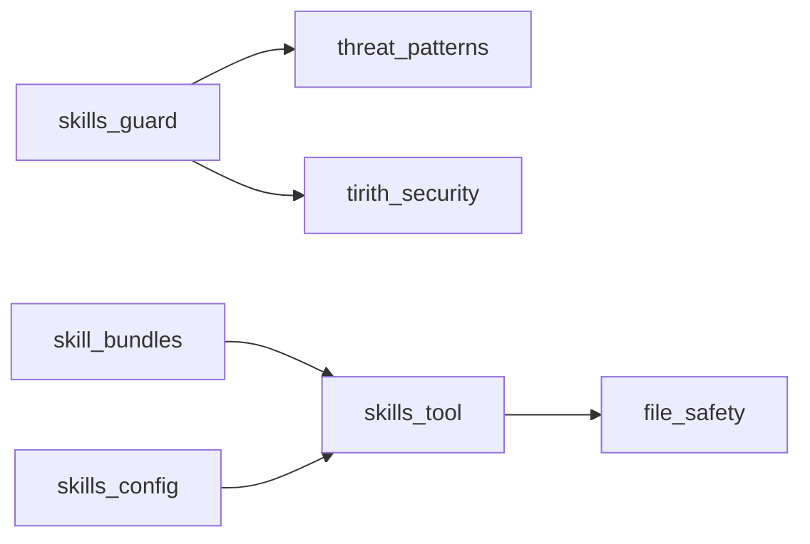

# 技能执行保护

<cite>
**本文引用的文件**
- [tools/skills_guard.py](file://tools/skills_guard.py)
- [tools/threat_patterns.py](file://tools/threat_patterns.py)
- [tools/tirith_security.py](file://tools/tirith_security.py)
- [agent/file_safety.py](file://agent/file_safety.py)
- [hermes_cli/skills_config.py](file://hermes_cli/skills_config.py)
- [tools/skills_tool.py](file://tools/skills_tool.py)
- [agent/skill_bundles.py](file://agent/skill_bundles.py)
- [tools/skill_provenance.py](file://tools/skill_provenance.py)
</cite>

## 目录
1. [简介](#简介)
2. [项目结构](#项目结构)
3. [核心组件](#核心组件)
4. [架构总览](#架构总览)
5. [详细组件分析](#详细组件分析)
6. [依赖关系分析](#依赖关系分析)
7. [性能考量](#性能考量)
8. [故障排查指南](#故障排查指南)
9. [结论](#结论)
10. [附录](#附录)

## 简介
本文件面向“技能执行保护”，系统性说明技能在加载与执行过程中的安全检查机制，覆盖以下主题：
- 技能文件完整性验证与来源可信度策略
- 依赖关系检查、权限控制与沙箱隔离
- 恶意技能检测算法（静态扫描、模式匹配、二进制工具校验）
- 签名验证与版本兼容性检查
- 运行时行为监控与资源限制
- 安全配置参数与安全策略定制方法
- 常见攻击模式识别与防御措施
- 面向开发者的安全开发指南与测试验证流程

## 项目结构
围绕技能安全的核心代码分布在如下模块：
- 技能静态扫描与安装策略：tools/skills_guard.py
- 上下文/内存/工具结果威胁模式库：tools/threat_patterns.py
- 命令级内容安全扫描（外部二进制）：tools/tirith_security.py
- 读写路径与敏感文件访问控制：agent/file_safety.py
- 技能启用/禁用配置：hermes_cli/skills_config.py
- 技能发现与加载入口：tools/skills_tool.py
- 技能包（bundle）聚合加载：agent/skill_bundles.py
- 技能写入来源追踪（区分后台自改进与前台用户指令）：tools/skill_provenance.py

**图示来源**
- [tools/skills_guard.py:1-120](file://tools/skills_guard.py#L1-L120)
- [tools/threat_patterns.py:1-120](file://tools/threat_patterns.py#L1-L120)
- [tools/tirith_security.py:1-120](file://tools/tirith_security.py#L1-L120)
- [agent/file_safety.py:1-120](file://agent/file_safety.py#L1-L120)
- [hermes_cli/skills_config.py:1-80](file://hermes_cli/skills_config.py#L1-L80)
- [tools/skills_tool.py:140-210](file://tools/skills_tool.py#L140-L210)
- [agent/skill_bundles.py:1-60](file://agent/skill_bundles.py#L1-L60)
- [tools/skill_provenance.py:1-40](file://tools/skill_provenance.py#L1-L40)

**章节来源**
- [tools/skills_guard.py:1-120](file://tools/skills_guard.py#L1-L120)
- [tools/threat_patterns.py:1-120](file://tools/threat_patterns.py#L1-L120)
- [tools/tirith_security.py:1-120](file://tools/tirith_security.py#L1-L120)
- [agent/file_safety.py:1-120](file://agent/file_safety.py#L1-L120)
- [hermes_cli/skills_config.py:1-80](file://hermes_cli/skills_config.py#L1-L80)
- [tools/skills_tool.py:140-210](file://tools/skills_tool.py#L140-L210)
- [agent/skill_bundles.py:1-60](file://agent/skill_bundles.py#L1-L60)
- [tools/skill_provenance.py:1-40](file://tools/skill_provenance.py#L1-L40)

## 核心组件
- 技能静态扫描器（skills_guard）
  - 基于正则的模式匹配，覆盖数据外泄、提示注入、破坏性操作、持久化、网络反向Shell、混淆、供应链风险、提权等。
  - 信任等级与安装策略：内置/可信/社区/代理创建，按严重级别决定允许、阻止或询问。
  - 结构限制：文件数量、总大小、单文件大小、可疑二进制扩展名。
  - 内容摘要与可缓存的扫描证明（含哈希、规则集、时间戳）。
- 威胁模式库（threat_patterns）
  - 统一的多作用域模式集合（all/context/strict），用于上下文、记忆写入与技能安装等路径。
  - 包含不可见Unicode字符检测与NFKC规范化，降低同形异义绕过。
- 命令级内容扫描（tirith_security）
  - 通过外部二进制进行更深层的内容级威胁检测（如管道到解释器、终端注入、同构URL等）。
  - 自动下载与校验（SHA-256，可选cosign溯源），失败熔断与fail-open/fail-closed策略。
- 读写安全边界（file_safety）
  - 禁止写入敏感路径（SSH密钥、认证存储、系统文件等）。
  - 读取拦截（Hermes内部缓存、凭证存储、项目.env等）。
  - 跨配置文件写保护与沙箱镜像写保护提示。
- 技能启用/禁用配置（skills_config）
  - 全局与平台维度的技能禁用列表管理。
- 技能发现与加载（skills_tool）
  - 技能清单扫描、平台与环境匹配、前置条件收集与缺失处理。
  - 名称合法性校验（防路径穿越）。
- 技能包聚合（skill_bundles）
  - 将多个技能合并为一次调用，支持跳过缺失/禁用的成员。
- 写入来源追踪（skill_provenance）
  - 区分后台自改进与前台用户指令，影响后续治理策略。

**章节来源**
- [tools/skills_guard.py:1-120](file://tools/skills_guard.py#L1-L120)
- [tools/threat_patterns.py:1-120](file://tools/threat_patterns.py#L1-L120)
- [tools/tirith_security.py:1-120](file://tools/tirith_security.py#L1-L120)
- [agent/file_safety.py:1-120](file://agent/file_safety.py#L1-L120)
- [hermes_cli/skills_config.py:1-80](file://hermes_cli/skills_config.py#L1-L80)
- [tools/skills_tool.py:140-210](file://tools/skills_tool.py#L140-L210)
- [agent/skill_bundles.py:1-60](file://agent/skill_bundles.py#L1-L60)
- [tools/skill_provenance.py:1-40](file://tools/skill_provenance.py#L1-L40)

## 架构总览
技能从下载到执行的完整安全链路如下：

**图示来源**
- [tools/skills_guard.py:640-796](file://tools/skills_guard.py#L640-L796)
- [tools/threat_patterns.py:207-255](file://tools/threat_patterns.py#L207-L255)
- [tools/tirith_security.py:731-800](file://tools/tirith_security.py#L731-L800)
- [tools/skills_tool.py:670-778](file://tools/skills_tool.py#L670-L778)
- [agent/skill_bundles.py:253-368](file://agent/skill_bundles.py#L253-L368)
- [agent/file_safety.py:161-177](file://agent/file_safety.py#L161-L177)

## 详细组件分析

### 技能静态扫描与安装策略（skills_guard）
- 扫描范围
  - 结构检查：文件数、总大小、单文件大小上限、可疑二进制扩展名。
  - 文本扫描：正则匹配多类威胁（外泄、注入、破坏、持久化、网络、混淆、供应链、提权、硬编码密钥等）。
  - 不可见Unicode字符检测，防止隐藏指令。
- 信任等级与策略
  - 内置/可信/社区/代理创建四类来源；不同严重级别对应允许/阻止/询问。
  - 支持强制安装开关，但高危来源仍受限制。
- 可缓存的证明
  - 生成内容哈希、扫描时间、规则集、来源标识，便于审计与重复利用。

**图示来源**
- [tools/skills_guard.py:531-568](file://tools/skills_guard.py#L531-L568)
- [tools/skills_guard.py:575-637](file://tools/skills_guard.py#L575-L637)
- [tools/skills_guard.py:640-696](file://tools/skills_guard.py#L640-L696)
- [tools/skills_guard.py:774-800](file://tools/skills_guard.py#L774-L800)

**章节来源**
- [tools/skills_guard.py:531-568](file://tools/skills_guard.py#L531-L568)
- [tools/skills_guard.py:575-637](file://tools/skills_guard.py#L575-L637)
- [tools/skills_guard.py:640-696](file://tools/skills_guard.py#L640-L696)
- [tools/skills_guard.py:774-800](file://tools/skills_guard.py#L774-L800)

### 威胁模式库（threat_patterns）
- 多作用域模式集合
  - all：通用注入/外泄检测
  - context：上下文/记忆/工具结果（更广的检测面）
  - strict：用户介入路径（记忆写入、技能安装）采用更严格规则
- 不可见Unicode与NFKC规范化
  - 避免全角/兼容变体绕过关键词检测
- 便捷接口
  - scan_for_threats(content, scope) 返回匹配的pattern_id
  - first_threat_message(content, scope) 返回首个威胁的人类可读消息

**章节来源**
- [tools/threat_patterns.py:1-120](file://tools/threat_patterns.py#L1-L120)
- [tools/threat_patterns.py:207-255](file://tools/threat_patterns.py#L207-L255)
- [tools/threat_patterns.py:258-276](file://tools/threat_patterns.py#L258-L276)

### 命令级内容扫描（tirith_security）
- 功能
  - 通过外部二进制进行内容级威胁检测（管道到解释器、终端注入、同构URL等）。
  - 自动下载与校验（SHA-256，可选cosign溯源），失败熔断与fail-open/fail-closed策略。
- 配置项
  - tirith_enabled：是否启用
  - tirith_path：二进制路径（默认tirith）
  - tirith_timeout：超时秒数
  - tirith_fail_open：扫描不可用时是否放行
- 运行特性
  - 平台支持检测（Windows无预编译则静默降级）
  - 崩溃计数达到阈值后熔断，避免卡死
  - 日志去重，避免刷屏

**图示来源**
- [tools/tirith_security.py:68-87](file://tools/tirith_security.py#L68-L87)
- [tools/tirith_security.py:731-800](file://tools/tirith_security.py#L731-L800)

**章节来源**
- [tools/tirith_security.py:68-87](file://tools/tirith_security.py#L68-L87)
- [tools/tirith_security.py:273-280](file://tools/tirith_security.py#L273-L280)
- [tools/tirith_security.py:731-800](file://tools/tirith_security.py#L731-L800)

### 读写安全边界（file_safety）
- 禁止写入
  - SSH私钥、认证存储、系统文件（/etc/sudoers、/etc/passwd、/etc/shadow）等
  - 敏感目录前缀（.ssh、.aws、.gnupg、.kube、systemd等）
- 读取拦截
  - Hermes内部缓存（skills/.hub）、凭证存储（auth.json、.env等）、MCP令牌目录
  - 项目本地.env系列文件（防凭据泄露）
- 跨配置文件与沙箱镜像写保护
  - 跨profile写保护提示（软边界）
  - 沙箱镜像写保护提示（容器/非本地后端场景）

**图示来源**
- [agent/file_safety.py:28-80](file://agent/file_safety.py#L28-L80)
- [agent/file_safety.py:101-177](file://agent/file_safety.py#L101-L177)
- [agent/file_safety.py:194-337](file://agent/file_safety.py#L194-L337)

**章节来源**
- [agent/file_safety.py:28-80](file://agent/file_safety.py#L28-L80)
- [agent/file_safety.py:101-177](file://agent/file_safety.py#L101-L177)
- [agent/file_safety.py:194-337](file://agent/file_safety.py#L194-L337)

### 技能启用/禁用配置（skills_config）
- 支持全局与平台维度禁用技能
- 提供交互式CLI以批量切换类别或单个技能
- 与技能发现模块联动，过滤禁用项

**章节来源**
- [hermes_cli/skills_config.py:1-80](file://hermes_cli/skills_config.py#L1-L80)
- [hermes_cli/skills_config.py:150-203](file://hermes_cli/skills_config.py#L150-L203)

### 技能发现与加载（skills_tool）
- 技能清单扫描与缓存（按目录mtime与TTL）
- 平台与环境匹配（frontmatter中的platforms字段）
- 前置条件收集与缺失处理（环境变量、命令检查）
- 名称合法性校验（防路径穿越）

**章节来源**
- [tools/skills_tool.py:140-210](file://tools/skills_tool.py#L140-L210)
- [tools/skills_tool.py:670-778](file://tools/skills_tool.py#L670-L778)

### 技能包聚合（skill_bundles）
- 将多个技能合并为一次调用，提升效率
- 支持跳过缺失/禁用的成员，并输出报告
- 与平台禁用列表联动

**章节来源**
- [agent/skill_bundles.py:1-60](file://agent/skill_bundles.py#L1-L60)
- [agent/skill_bundles.py:253-368](file://agent/skill_bundles.py#L253-L368)

### 写入来源追踪（skill_provenance）
- 使用ContextVar标记当前写入来源（前台/后台自改进）
- 用于后续治理策略（例如仅对后台自改进的技能进行自动整理/修剪）

**章节来源**
- [tools/skill_provenance.py:1-79](file://tools/skill_provenance.py#L1-L79)

## 依赖关系分析
- skills_guard 依赖 threat_patterns 提供的模式集合与不可见字符检测
- skills_guard 在关键路径上调用 tirith_security 进行命令级内容扫描
- skills_tool 负责技能发现与加载，并与 file_safety 交互确保读写安全
- skill_bundles 复用 skills_tool 的加载能力，并应用禁用列表
- skills_config 提供启用/禁用配置，影响 skills_tool 的可见性与加载

**图示来源**
- [tools/skills_guard.py:640-696](file://tools/skills_guard.py#L640-L696)
- [tools/threat_patterns.py:207-255](file://tools/threat_patterns.py#L207-L255)
- [tools/tirith_security.py:731-800](file://tools/tirith_security.py#L731-L800)
- [tools/skills_tool.py:670-778](file://tools/skills_tool.py#L670-L778)
- [agent/skill_bundles.py:253-368](file://agent/skill_bundles.py#L253-L368)
- [hermes_cli/skills_config.py:1-80](file://hermes_cli/skills_config.py#L1-L80)

**章节来源**
- [tools/skills_guard.py:640-696](file://tools/skills_guard.py#L640-L696)
- [tools/threat_patterns.py:207-255](file://tools/threat_patterns.py#L207-L255)
- [tools/tirith_security.py:731-800](file://tools/tirith_security.py#L731-L800)
- [tools/skills_tool.py:670-778](file://tools/skills_tool.py#L670-L778)
- [agent/skill_bundles.py:253-368](file://agent/skill_bundles.py#L253-L368)
- [hermes_cli/skills_config.py:1-80](file://hermes_cli/skills_config.py#L1-L80)

## 性能考量
- 扫描缓存与TTL
  - 技能清单扫描使用目录mtime与短TTL减少重复IO
  - 技能扫描结果可缓存（含内容哈希、规则集、时间戳）
- 正则与Unicode处理
  - 限定最大扫描长度，避免长文本导致的回溯开销
  - NFKC规范化减少同形异义绕过带来的误报/漏报
- 外部二进制调用
  - 自动下载与校验，失败熔断与日志去重，避免阻塞与刷屏
  - 平台不支持时静默降级，不影响主流程

[本节为通用性能讨论，不直接分析具体文件]

## 故障排查指南
- 技能被阻止安装
  - 查看扫描结果中的严重级别与来源信任等级，确认是否命中危险模式
  - 若为社区来源且结果为dangerous，需调整策略或修复技能内容
- 命令级扫描失败
  - 检查tirith二进制是否存在、路径是否正确、是否被防火墙拦截
  - 关注熔断状态与日志去重键，必要时清理失败标记或重装
- 读写被拒绝
  - 确认目标路径是否命中禁止写入列表或读取拦截
  - 如需写入受限区域，请评估安全风险并显式授权
- 技能未显示/未加载
  - 检查技能是否被禁用（全局或平台维度）
  - 检查frontmatter中的platforms与环境匹配

**章节来源**
- [tools/skills_guard.py:774-800](file://tools/skills_guard.py#L774-L800)
- [tools/tirith_security.py:731-800](file://tools/tirith_security.py#L731-L800)
- [agent/file_safety.py:161-177](file://agent/file_safety.py#L161-L177)
- [hermes_cli/skills_config.py:150-203](file://hermes_cli/skills_config.py#L150-L203)

## 结论
本方案通过多层防护保障技能的安全加载与执行：
- 静态扫描与模式匹配覆盖常见恶意模式
- 命令级内容扫描增强对复杂注入与供应链风险的检测
- 读写安全边界与沙箱镜像提示降低误写与越权风险
- 信任等级与策略控制实现来源差异化治理
- 配置化与可观测性支持灵活定制与问题定位

[本节为总结性内容，不直接分析具体文件]

## 附录

### 安全配置参数说明
- 技能扫描与安装
  - 信任等级与策略：内置/可信/社区/代理创建，按严重级别决定允许/阻止/询问
  - 结构限制：文件数量、总大小、单文件大小上限、可疑二进制扩展名
- 命令级内容扫描
  - tirith_enabled：是否启用
  - tirith_path：二进制路径（默认tirith）
  - tirith_timeout：超时秒数
  - tirith_fail_open：扫描不可用时是否放行
- 读写安全
  - HERMES_WRITE_SAFE_ROOT：允许的写入根目录（多路径用分隔符拼接）
  - 禁止写入/读取路径由内置规则维护，建议定期审查

**章节来源**
- [tools/skills_guard.py:55-67](file://tools/skills_guard.py#L55-L67)
- [tools/skills_guard.py:531-568](file://tools/skills_guard.py#L531-L568)
- [tools/tirith_security.py:68-87](file://tools/tirith_security.py#L68-L87)
- [agent/file_safety.py:83-98](file://agent/file_safety.py#L83-L98)

### 安全策略定制方法
- 调整信任等级策略：针对特定来源放宽或收紧允许/阻止/询问决策
- 自定义威胁模式：在威胁模式库中新增/调整正则与作用域
- 配置读写边界：设置HERMES_WRITE_SAFE_ROOT，审查禁止写入/读取规则
- 启用/禁用技能：通过CLI或配置文件管理全局与平台维度的启用状态

**章节来源**
- [tools/skills_guard.py:55-67](file://tools/skills_guard.py#L55-L67)
- [tools/threat_patterns.py:1-120](file://tools/threat_patterns.py#L1-L120)
- [agent/file_safety.py:83-98](file://agent/file_safety.py#L83-L98)
- [hermes_cli/skills_config.py:1-80](file://hermes_cli/skills_config.py#L1-L80)

### 常见攻击模式与防御
- 数据外泄：curl/wget/requests携带密钥、读取.env/credentials、dump环境
  - 防御：静态扫描正则匹配、读取拦截、输出脱敏
- 提示注入：忽略先前指令、角色劫持、隐藏HTML/注释
  - 防御：多作用域模式匹配、不可见Unicode检测、NFKC规范化
- 破坏性操作：rm -rf /、格式化磁盘、覆盖系统文件
  - 防御：静态扫描、命令级内容扫描、写入禁止列表
- 持久化：修改cron/systemd/authorized_keys、写入其他Agent配置
  - 防御：静态扫描、写入禁止列表、跨profile写保护提示
- 网络风险：反向Shell、隧道服务、绑定所有接口
  - 防御：静态扫描、命令级内容扫描
- 供应链风险：未固定依赖、运行时拉取远程资源、git clone/docker pull
  - 防御：静态扫描、命令级内容扫描、策略控制
- 提权：sudo、setuid/setgid、NOPASSWD
  - 防御：静态扫描、写入禁止列表

**章节来源**
- [tools/skills_guard.py:101-524](file://tools/skills_guard.py#L101-L524)
- [tools/threat_patterns.py:63-135](file://tools/threat_patterns.py#L63-L135)
- [tools/tirith_security.py:731-800](file://tools/tirith_security.py#L731-L800)
- [agent/file_safety.py:28-80](file://agent/file_safety.py#L28-L80)

### 开发者安全指南与测试验证流程
- 安全开发指南
  - 避免在技能中硬编码密钥或引用敏感路径
  - 不使用危险命令（rm -rf、格式化、反向Shell等）
  - 不尝试绕过系统提示或注入隐藏指令
  - 明确声明所需环境与变量，遵循最小权限原则
- 测试验证流程
  - 使用静态扫描器对技能目录进行扫描，确认无高危发现
  - 对关键命令进行命令级内容扫描，确保不被阻止
  - 验证读写边界：尝试写入/读取敏感路径，确认被正确拦截
  - 检查技能启用/禁用配置是否符合预期
  - 模拟异常场景（二进制不可用、网络失败）验证熔断与降级

**章节来源**
- [tools/skills_guard.py:640-696](file://tools/skills_guard.py#L640-L696)
- [tools/tirith_security.py:731-800](file://tools/tirith_security.py#L731-L800)
- [agent/file_safety.py:161-177](file://agent/file_safety.py#L161-L177)
- [hermes_cli/skills_config.py:150-203](file://hermes_cli/skills_config.py#L150-L203)