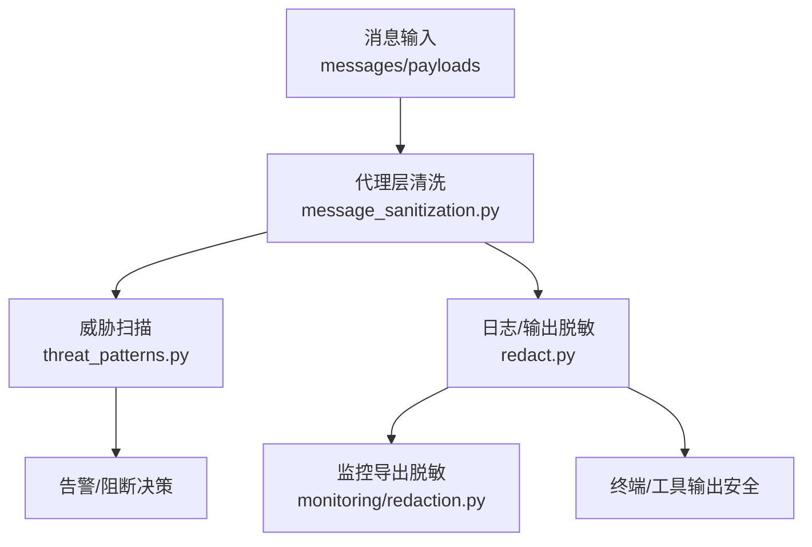
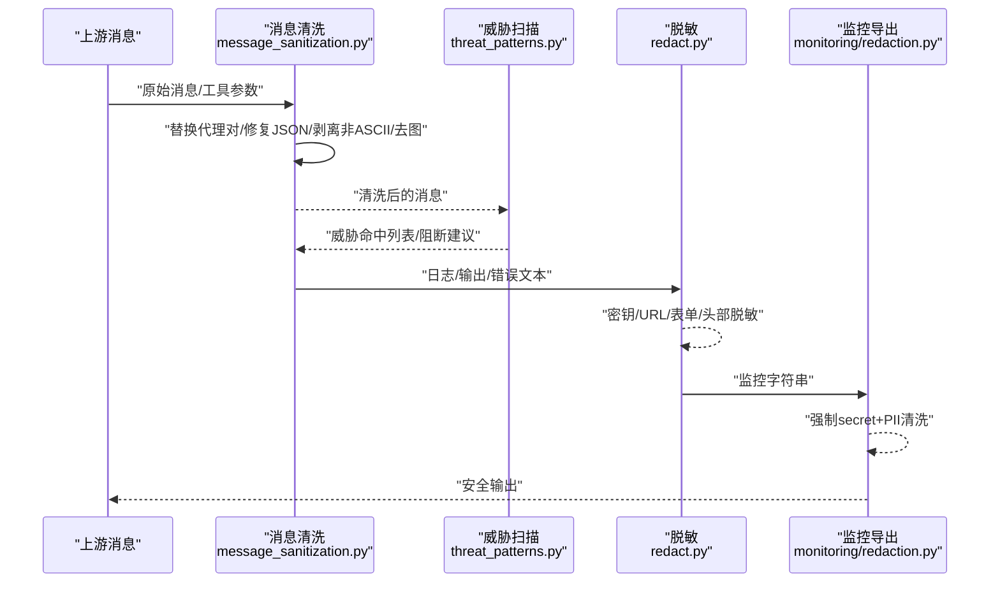
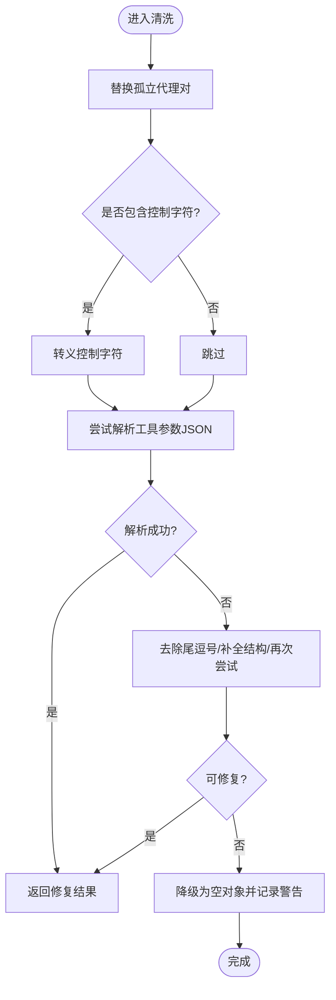
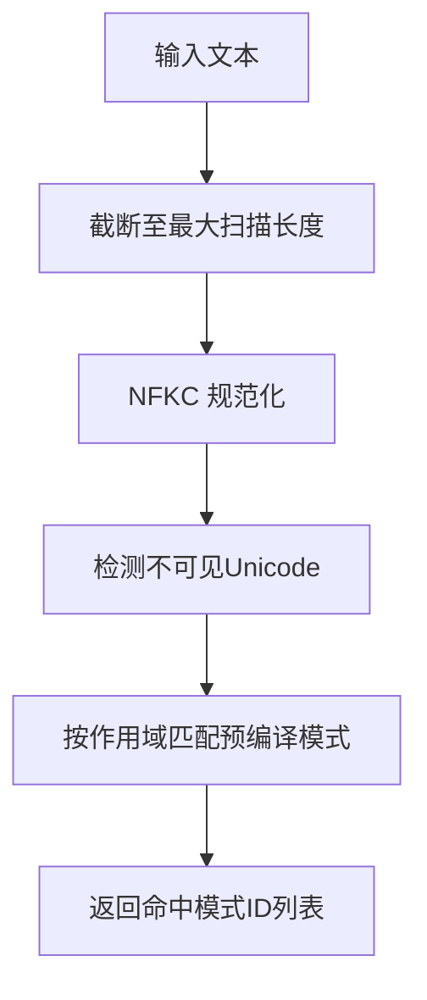
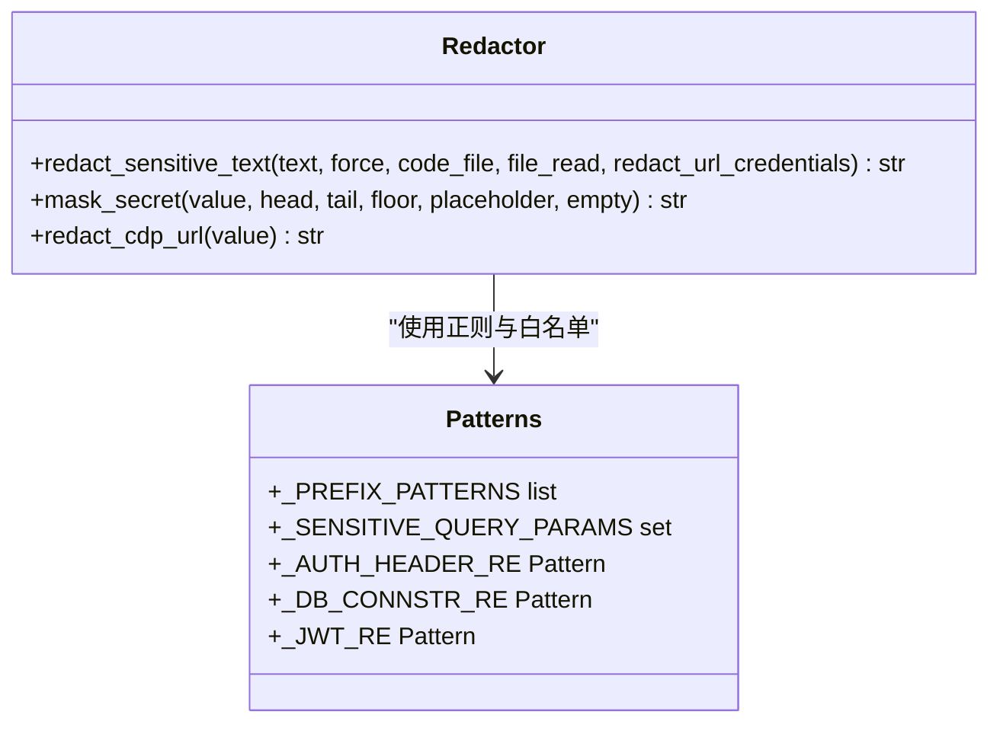
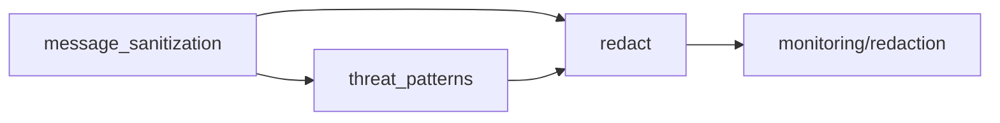

# 消息内容清理

<cite>
**本文引用的文件**
- [agent/message_sanitization.py](file://agent/message_sanitization.py)
- [agent/redact.py](file://agent/redact.py)
- [tools/threat_patterns.py](file://tools/threat_patterns.py)
- [agent/monitoring/redaction.py](file://agent/monitoring/redaction.py)
- [tests/agent/test_message_sanitization_policy.py](file://tests/agent/test_message_sanitization_policy.py)
- [tests/tools/test_threat_patterns.py](file://tests/tools/test_threat_patterns.py)
- [tests/tools/test_terminal_error_redaction.py](file://tests/tools/test_terminal_error_redaction.py)
</cite>

## 目录
1. [简介](#简介)
2. [项目结构](#项目结构)
3. [核心组件](#核心组件)
4. [架构总览](#架构总览)
5. [详细组件分析](#详细组件分析)
6. [依赖关系分析](#依赖关系分析)
7. [性能考量](#性能考量)
8. [故障排查指南](#故障排查指南)
9. [结论](#结论)
10. [附录](#附录)

## 简介
本文件系统性说明 Hermes Agent 的消息内容清理与安全过滤机制，覆盖恶意内容检测、敏感信息识别、危险字符过滤、XSS/脚本注入防护、HTML 标签清理策略、Unicode 编码处理、特殊字符转义与格式标准化。同时给出配置选项、扩展自定义规则的方法，并提供常见恶意消息示例与防护效果演示，以及开发者集成与性能优化建议。

## 项目结构
围绕“消息内容清理”的核心代码分布在以下模块：
- 消息结构与协议级清洗：agent/message_sanitization.py
- 日志与输出脱敏（密钥、URL、表单、头部等）：agent/redact.py
- 威胁模式扫描（提示词注入、C2、越权指令等）：tools/threat_patterns.py
- 监控导出前强制脱敏：agent/monitoring/redaction.py
- 测试用例验证行为与边界：tests/agent/test_message_sanitization_policy.py、tests/tools/test_threat_patterns.py、tests/tools/test_terminal_error_redaction.py

图表来源
- [agent/message_sanitization.py:1-120](file://agent/message_sanitization.py#L1-L120)
- [tools/threat_patterns.py:1-120](file://tools/threat_patterns.py#L1-L120)
- [agent/redact.py:1-120](file://agent/redact.py#L1-L120)
- [agent/monitoring/redaction.py:1-72](file://agent/monitoring/redaction.py#L1-L72)

章节来源
- [agent/message_sanitization.py:1-120](file://agent/message_sanitization.py#L1-L120)
- [tools/threat_patterns.py:1-120](file://tools/threat_patterns.py#L1-L120)
- [agent/redact.py:1-120](file://agent/redact.py#L1-L120)
- [agent/monitoring/redaction.py:1-72](file://agent/monitoring/redaction.py#L1-L72)

## 核心组件
- 消息清洗与修复
  - 替换孤立代理对（surrogate）字符，避免 JSON 序列化崩溃
  - 修复工具调用参数 JSON（尾逗号、未闭合括号、控制字符转义等）
  - 非 ASCII 字符兜底剥离（ASCII-only 环境）
  - 移除图片内容以适配仅文本服务端
  - 统一 call_id 生成/合并/去重策略，保证缓存稳定
  - reasoning_content 回显策略（按提供商方向决定保留或剥离）
- 威胁模式扫描
  - 基于正则的提示词注入、角色劫持、C2/Brainworm、数据外泄、持久化等模式
  - 不可见 Unicode 字符检测与 NFKC 规范化防混淆
  - 多作用域（all/context/strict）分级检测
- 敏感信息脱敏
  - API Key/Token/私钥/数据库连接串/JWT/授权头/URL 查询参数/表单体等
  - 控制字符分割令牌检测与掩码
  - 严格 URL 凭据脱敏（非导航出口场景）
- 监控导出强制脱敏
  - 无条件 secret + PII 清洗，失败即关闭导出

章节来源
- [agent/message_sanitization.py:25-141](file://agent/message_sanitization.py#L25-L141)
- [agent/message_sanitization.py:144-293](file://agent/message_sanitization.py#L144-L293)
- [agent/message_sanitization.py:328-475](file://agent/message_sanitization.py#L328-L475)
- [agent/message_sanitization.py:525-625](file://agent/message_sanitization.py#L525-L625)
- [agent/message_sanitization.py:653-800](file://agent/message_sanitization.py#L653-L800)
- [tools/threat_patterns.py:43-135](file://tools/threat_patterns.py#L43-L135)
- [tools/threat_patterns.py:137-255](file://tools/threat_patterns.py#L137-L255)
- [agent/redact.py:25-138](file://agent/redact.py#L25-L138)
- [agent/redact.py:140-227](file://agent/redact.py#L140-L227)
- [agent/redact.py:316-459](file://agent/redact.py#L316-L459)
- [agent/redact.py:488-769](file://agent/redact.py#L488-L769)
- [agent/monitoring/redaction.py:1-72](file://agent/monitoring/redaction.py#L1-L72)

## 架构总览
消息从入口进入后，先进行结构化清洗（JSON/Unicode/控制字符），再经威胁扫描与敏感信息脱敏，最终在监控/日志/工具输出等出口处再次强制脱敏。

图表来源
- [agent/message_sanitization.py:25-141](file://agent/message_sanitization.py#L25-L141)
- [tools/threat_patterns.py:207-255](file://tools/threat_patterns.py#L207-L255)
- [agent/redact.py:772-800](file://agent/redact.py#L772-L800)
- [agent/monitoring/redaction.py:43-66](file://agent/monitoring/redaction.py#L43-L66)

## 详细组件分析

### 组件A：消息清洗与修复（message_sanitization）
- 代理对与非法控制字符
  - 使用正则匹配并替换孤立代理对为替换字符，避免 json.dumps 崩溃
  - 对嵌套结构（reasoning_details 等）递归修复
  - 对 JSON 字符串中的控制字符进行转义，提升解析成功率
- 工具调用参数修复
  - 尝试 strict=False 解析、去除尾逗号、补全未闭合结构、控制字符转义
  - 若仍不可修复，降级为空对象并记录警告日志（含原始内容上限）
- 非 ASCII 兜底
  - 在 ASCII-only 环境中剥离非 ASCII 字符，确保兼容
- 图片内容剥离
  - 当服务端不支持图片时，移除 image_url/image/input_image 片段，保持 tool_call_id 配对不变
- call_id 策略
  - 确定性 ID 生成（哈希）保障缓存稳定
  - 合并 call_id/id 字段，去重重复 ID（追加 _dN 后缀）
- reasoning_content 策略
  - 根据提供商家族（kimi/deepseek/mimo）决定是否保留/填充/剥离 reasoning_content
  - 跨提供商历史污染时的安全回填（单空格占位）

图表来源
- [agent/message_sanitization.py:144-293](file://agent/message_sanitization.py#L144-L293)

章节来源
- [agent/message_sanitization.py:25-141](file://agent/message_sanitization.py#L25-L141)
- [agent/message_sanitization.py:144-293](file://agent/message_sanitization.py#L144-L293)
- [agent/message_sanitization.py:328-475](file://agent/message_sanitization.py#L328-L475)
- [agent/message_sanitization.py:525-625](file://agent/message_sanitization.py#L525-L625)
- [agent/message_sanitization.py:653-800](file://agent/message_sanitization.py#L653-L800)

### 组件B：威胁模式扫描（threat_patterns）
- 模式分类与作用域
  - all：经典注入、外泄命令等
  - context：上下文/记忆/工具结果中更广泛的 promptware/C2/角色劫持
  - strict：用户可干预写入路径（如记忆写入、技能安装）的强检查
- 不可见 Unicode 与 NFKC 规范化
  - 检测零宽/双向/隔离符等，防止混淆绕过
  - 将全角/兼容变体折叠为 ASCII 后再匹配，降低绕过风险
- 扫描流程
  - 限制最大扫描长度，避免长文本导致的性能问题
  - 编译一次的模式集合，按作用域快速匹配

图表来源
- [tools/threat_patterns.py:43-135](file://tools/threat_patterns.py#L43-L135)
- [tools/threat_patterns.py:162-255](file://tools/threat_patterns.py#L162-L255)

章节来源
- [tools/threat_patterns.py:43-135](file://tools/threat_patterns.py#L43-L135)
- [tools/threat_patterns.py:162-255](file://tools/threat_patterns.py#L162-L255)
- [tests/tools/test_threat_patterns.py:1-263](file://tests/tools/test_threat_patterns.py#L1-L263)

### 组件C：敏感信息脱敏（redact）
- 密钥与令牌
  - 已知厂商前缀匹配（OpenAI、GitHub、AWS、Stripe、SendGrid 等）
  - 控制字符分割令牌检测与掩码
- 配置与环境变量
  - ENV 赋值、YAML/点号键值、行首锚定键名等场景的精准匹配
  - 区分代码/配置文件/正文上下文，减少误伤
- 网络与请求
  - Authorization 头、x-api-key 等头部
  - URL 查询参数、userinfo、HTTP 访问日志目标
  - 严格 URL 凭据脱敏（非导航出口）
- 其他
  - JWT、数据库连接串、私钥块、Telegram Bot Token
  - 显示用掩码函数（保留前后若干字符用于调试）

图表来源
- [agent/redact.py:25-138](file://agent/redact.py#L25-L138)
- [agent/redact.py:140-227](file://agent/redact.py#L140-L227)
- [agent/redact.py:316-459](file://agent/redact.py#L316-L459)
- [agent/redact.py:488-769](file://agent/redact.py#L488-L769)

章节来源
- [agent/redact.py:25-138](file://agent/redact.py#L25-L138)
- [agent/redact.py:140-227](file://agent/redact.py#L140-L227)
- [agent/redact.py:316-459](file://agent/redact.py#L316-L459)
- [agent/redact.py:488-769](file://agent/redact.py#L488-L769)
- [tests/tools/test_terminal_error_redaction.py:1-154](file://tests/tools/test_terminal_error_redaction.py#L1-L154)

### 组件D：监控导出强制脱敏（monitoring/redaction）
- 无条件 secret 清洗（force=True），失败则关闭导出
- 附加 Bearer/Token 形状与 PII（邮箱、电话、UUID）清洗
- 作为最后一道防线，确保任何离开进程的字符串均安全

章节来源
- [agent/monitoring/redaction.py:1-72](file://agent/monitoring/redaction.py#L1-L72)

## 依赖关系分析
- message_sanitization 负责消息结构的健壮性（JSON/Unicode/控制字符）与 provider 特定字段策略
- threat_patterns 提供统一的威胁模式库，被上下文组装与工具结果处理器复用
- redact 提供通用脱敏能力，被日志、工具输出、错误信息等广泛使用
- monitoring/redaction 在监控出口强制二次脱敏，形成纵深防御

图表来源
- [agent/message_sanitization.py:1-120](file://agent/message_sanitization.py#L1-L120)
- [tools/threat_patterns.py:1-120](file://tools/threat_patterns.py#L1-L120)
- [agent/redact.py:1-120](file://agent/redact.py#L1-L120)
- [agent/monitoring/redaction.py:1-72](file://agent/monitoring/redaction.py#L1-L72)

章节来源
- [agent/message_sanitization.py:1-120](file://agent/message_sanitization.py#L1-L120)
- [tools/threat_patterns.py:1-120](file://tools/threat_patterns.py#L1-L120)
- [agent/redact.py:1-120](file://agent/redact.py#L1-L120)
- [agent/monitoring/redaction.py:1-72](file://agent/monitoring/redaction.py#L1-L72)

## 性能考量
- 正则与扫描
  - 威胁扫描限定最大扫描长度，避免长文本导致的高开销
  - 预编译模式集合，按作用域复用，减少重复构建
  - 使用占有量词与有限填充词数，降低回溯风险
- JSON 修复
  - 优先 fast-path（strict=False 解析后重新序列化），仅在必要时执行复杂修补
- 脱敏
  - 控制字符分割令牌检测仅在存在控制字符时触发
  - 显示掩码剥离控制字符，避免输出污染
- 建议
  - 对超大 payload 分片处理
  - 结合业务阈值启用/禁用某些扫描范围
  - 监控日志中关注“不可修复参数”的告警频率

[本节为通用指导，不直接分析具体文件]

## 故障排查指南
- 常见问题定位
  - JSON 解析失败：查看工具参数修复日志，确认是否为尾逗号/控制字符/未闭合结构导致
  - 代理对崩溃：检查消息 content/text/name/tool_calls 等字段是否存在孤立代理对
  - 提供商拒绝 reasoning_content：确认当前提供商家族策略，是否需要剥离或填充
  - 密钥泄露：核查日志/工具输出是否经过 redact_sensitive_text；必要时开启 force=True
  - 监控导出异常：确认 redact_for_export 是否可用，失败会返回占位符
- 参考测试
  - 终端错误脱敏：确保 error/traceback 字段不包含真实密钥
  - 威胁模式：验证 Brainworm 等典型载荷能命中预期模式
  - call_id 策略：验证确定性 ID 与去重逻辑符合预期

章节来源
- [tests/tools/test_terminal_error_redaction.py:1-154](file://tests/tools/test_terminal_error_redaction.py#L1-L154)
- [tests/tools/test_threat_patterns.py:1-263](file://tests/tools/test_threat_patterns.py#L1-L263)
- [tests/agent/test_message_sanitization_policy.py:1-297](file://tests/agent/test_message_sanitization_policy.py#L1-L297)

## 结论
Hermes Agent 通过“消息清洗—威胁扫描—敏感脱敏—监控强制脱敏”的分层体系，全面覆盖恶意内容检测、敏感信息识别、危险字符过滤、XSS/脚本注入防护与 HTML 标签清理策略。其设计兼顾兼容性（ASCII-only、provider 差异）、安全性（多作用域扫描、强制脱敏）与性能（预编译、限长扫描、fast-path）。开发者可按需扩展威胁模式与脱敏规则，并在关键出口处应用强制脱敏。

[本节为总结，不直接分析具体文件]

## 附录

### 配置与扩展要点
- 全局开关
  - 环境变量 HERMES_REDACT_SECRETS 控制脱敏开关（默认开启）
  - 监控导出强制脱敏不可关闭
- 作用域选择
  - 威胁扫描支持 all/context/strict，按场景选择合适范围
- 自定义扩展
  - 新增威胁模式：在 threat_patterns 中添加 (regex, pattern_id, scope) 元组
  - 新增脱敏规则：在 redact 中添加正则与替换逻辑，并在需要处调用
  - 自定义消息清洗：在 message_sanitization 中增加字段遍历与修复逻辑

章节来源
- [agent/redact.py:67-76](file://agent/redact.py#L67-L76)
- [tools/threat_patterns.py:61-135](file://tools/threat_patterns.py#L61-L135)
- [agent/message_sanitization.py:25-141](file://agent/message_sanitization.py#L25-L141)

### 常见恶意消息类型与防护效果示例
- 提示词注入
  - 示例：忽略先前指令、系统提示覆盖、隐藏注释注入
  - 防护：threat_patterns 的 all/context 作用域匹配，返回模式 ID 供上层处置
- C2/Brainworm
  - 示例：注册节点、心跳上报、拉取任务、连接网络
  - 防护：context/strict 作用域匹配，结合不可见 Unicode 检测
- 数据外泄
  - 示例：curl/wget/cat 读取 .env/credentials；发送/上传到 https
  - 防护：exfil_* 模式命中，strict 作用域可阻断
- 密钥泄露
  - 示例：API Key、JWT、Authorization 头、数据库连接串
  - 防护：redact 系列规则自动掩码；监控导出强制脱敏
- XSS/脚本注入
  - 示例：隐藏 div、translate...and execute、HTML 注释注入
  - 防护：threat_patterns 匹配；如需进一步清理 HTML，可在输出渲染前叠加 HTML 标签白名单过滤（由上层 UI/渲染器实现）

章节来源
- [tools/threat_patterns.py:61-135](file://tools/threat_patterns.py#L61-L135)
- [agent/redact.py:316-459](file://agent/redact.py#L316-L459)
- [agent/monitoring/redaction.py:43-66](file://agent/monitoring/redaction.py#L43-L66)

### 开发者集成指南
- 在消息入站路径
  - 调用 message_sanitization 的代理对与控制字符修复、工具参数修复、非 ASCII 剥离、图片剥离
  - 调用 threat_patterns 的 scan_for_threats 获取命中列表，按策略告警或阻断
- 在日志/工具输出路径
  - 调用 redact_sensitive_text 进行脱敏；对 CDP URL 使用 redact_cdp_url
- 在监控导出路径
  - 调用 redact_for_export 进行强制脱敏
- 在 provider 适配路径
  - 依据 reasoning_echo_family 与 needs_reasoning_echo 决定是否保留/填充 reasoning_content

章节来源
- [agent/message_sanitization.py:25-141](file://agent/message_sanitization.py#L25-L141)
- [tools/threat_patterns.py:207-255](file://tools/threat_patterns.py#L207-L255)
- [agent/redact.py:772-800](file://agent/redact.py#L772-L800)
- [agent/monitoring/redaction.py:43-66](file://agent/monitoring/redaction.py#L43-L66)
- [agent/message_sanitization.py:653-800](file://agent/message_sanitization.py#L653-L800)