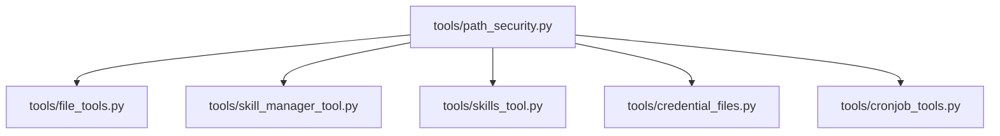
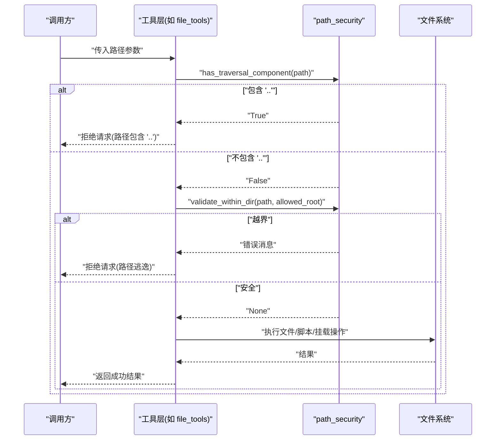
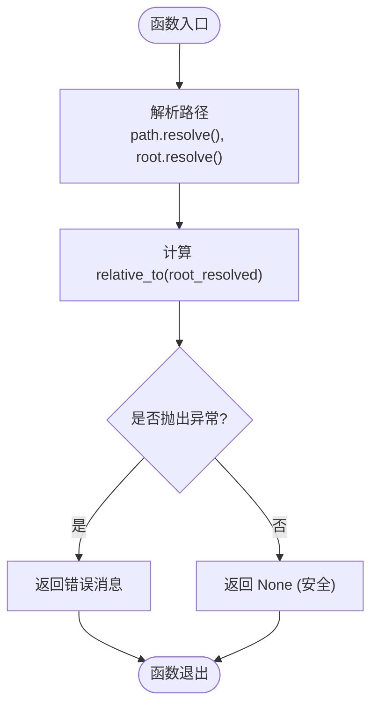
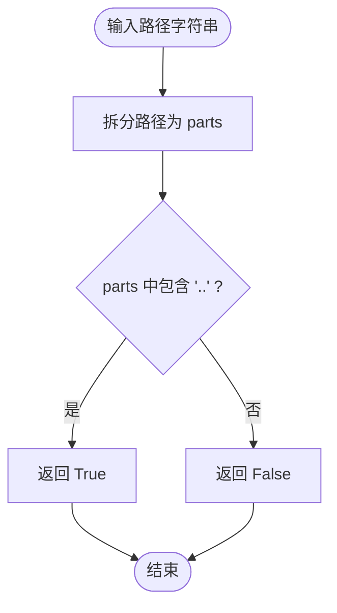
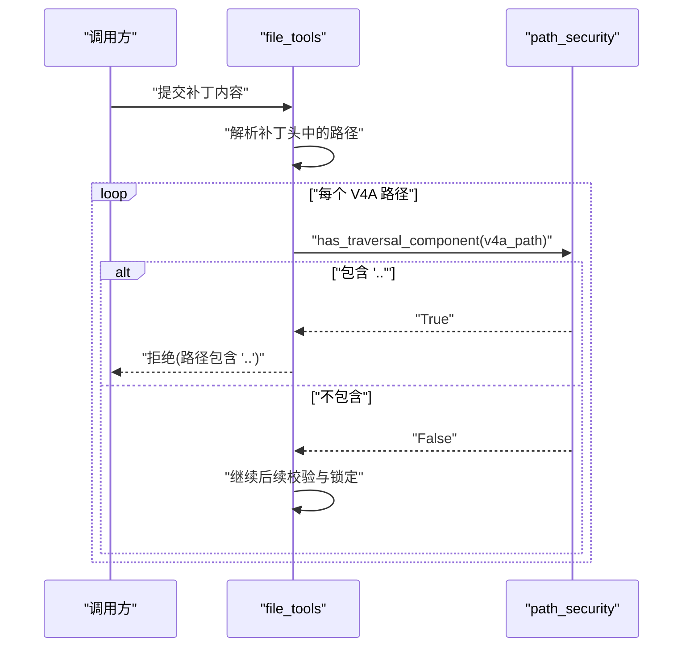
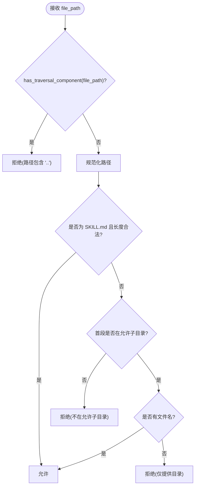
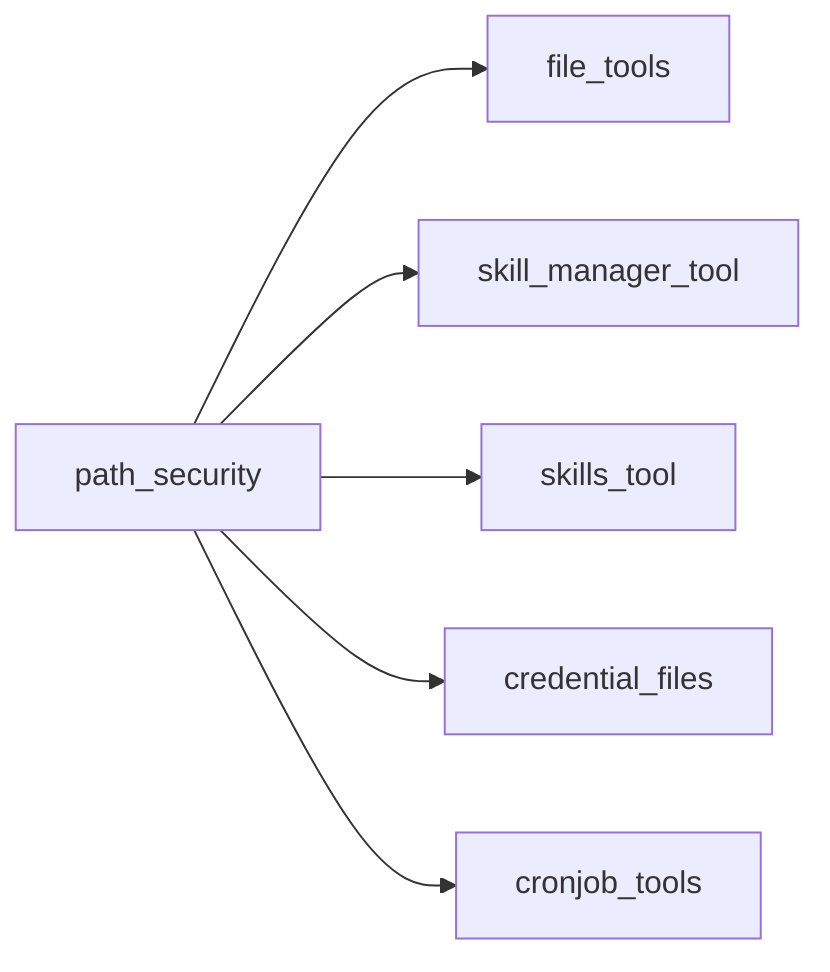

# 路径安全验证

<cite>
**本文引用的文件**
- [tools/path_security.py](file://tools/path_security.py)
- [tools/file_tools.py](file://tools/file_tools.py)
- [tools/skill_manager_tool.py](file://tools/skill_manager_tool.py)
- [tools/skills_tool.py](file://tools/skills_tool.py)
- [tools/credential_files.py](file://tools/credential_files.py)
- [tools/cronjob_tools.py](file://tools/cronjob_tools.py)
</cite>

## 目录
1. [简介](#简介)
2. [项目结构](#项目结构)
3. [核心组件](#核心组件)
4. [架构总览](#架构总览)
5. [详细组件分析](#详细组件分析)
6. [依赖关系分析](#依赖关系分析)
7. [性能考虑](#性能考虑)
8. [故障排查指南](#故障排查指南)
9. [结论](#结论)
10. [附录](#附录)

## 简介
本文件聚焦于路径遍历攻击防护机制，系统性说明路径安全工具函数的设计、实现与使用方式。重点包括：
- validate_within_dir 的实现原理：基于 Path.resolve() 的符号链接处理与相对路径规范化，确保目标路径始终位于允许的根目录下。
- has_traversal_component 的快速检测：通过检查路径片段是否包含 ".." 组件，提前拦截明显的路径逃逸尝试。
- 在多个工具模块中的实际用法与最佳实践，覆盖技能管理、文件操作、凭据挂载与定时任务脚本等场景。
- 常见路径攻击场景识别方法与防护措施，以及测试用例设计建议。

## 项目结构
路径安全能力集中在 tools/path_security.py，被多个工具模块复用，形成“统一校验 + 多场景接入”的结构：
- 核心库：tools/path_security.py（提供 validate_within_dir、has_traversal_component）
- 调用方：
  - 文件操作：tools/file_tools.py（补丁头与敏感路径检查）
  - 技能管理：tools/skill_manager_tool.py、tools/skills_tool.py（写权限与子目录白名单）
  - 凭据挂载：tools/credential_files.py（限制在 HERMES_HOME 内）
  - 定时任务：tools/cronjob_tools.py（脚本路径限制在 scripts 目录）

**图表来源**
- [tools/path_security.py:15-44](file://tools/path_security.py#L15-L44)
- [tools/file_tools.py:2150-2190](file://tools/file_tools.py#L2150-L2190)
- [tools/skill_manager_tool.py:845-889](file://tools/skill_manager_tool.py#L845-L889)
- [tools/skills_tool.py:190-204](file://tools/skills_tool.py#L190-L204)
- [tools/credential_files.py:95-110](file://tools/credential_files.py#L95-L110)
- [tools/cronjob_tools.py:540-553](file://tools/cronjob_tools.py#L540-L553)

**章节来源**
- [tools/path_security.py:1-44](file://tools/path_security.py#L1-L44)

## 核心组件
- validate_within_dir(path, root)
  - 作用：确保 path 解析后位于 root 之下；若越界返回错误信息字符串，否则返回 None。
  - 关键点：使用 Path.resolve() 跟随符号链接并规范化 .. 组件，再调用 relative_to(root_resolved) 进行包含性校验。
- has_traversal_component(path_str)
  - 作用：快速判断路径字符串是否包含 ".." 组件，用于早期拒绝明显的路径逃逸。
  - 关键点：将路径拆分为 parts 并检查是否存在 ".."，开销极低，适合前置过滤。

**章节来源**
- [tools/path_security.py:15-44](file://tools/path_security.py#L15-L44)

## 架构总览
下图展示了路径安全校验在工具链中的位置与数据流：用户输入或外部内容进入工具层后，先进行快速遍历检测（has_traversal_component），再进行严格包含性校验（validate_within_dir），最终才允许执行文件/脚本/挂载等操作。

**图表来源**
- [tools/file_tools.py:2150-2190](file://tools/file_tools.py#L2150-L2190)
- [tools/path_security.py:15-44](file://tools/path_security.py#L15-L44)

## 详细组件分析

### validate_within_dir 实现原理
- 符号链接处理：Path.resolve() 会解析所有符号链接，避免通过软链接绕过目录限制。
- 相对路径规范化：resolve() 会将 ..、. 等相对组件规范化为绝对路径，消除歧义。
- 包含性校验：relative_to(root_resolved) 抛出异常即表示越界，捕获后返回错误消息。

**图表来源**
- [tools/path_security.py:15-34](file://tools/path_security.py#L15-L34)

**章节来源**
- [tools/path_security.py:15-34](file://tools/path_security.py#L15-L34)

### has_traversal_component 快速检测
- 工作原理：将路径按分隔符拆分为 parts，检查是否存在 ".." 组件。
- 适用场景：对来自不可信来源的路径（如补丁头、技能名、配置项）进行前置快速拒绝，减少后续解析成本。
- 局限性：仅做字符串级检查，不解析符号链接；因此仍需配合 validate_within_dir 进行最终校验。

**图表来源**
- [tools/path_security.py:37-44](file://tools/path_security.py#L37-L44)

**章节来源**
- [tools/path_security.py:37-44](file://tools/path_security.py#L37-L44)

### 典型使用场景与代码示例路径

#### 文件补丁头中的路径校验（V4A 补丁）
- 行为：从补丁内容中提取 "*** Update File:" / "*** Add File:" / "*** Delete File:" / "*** Move File:" 后的路径，使用 has_traversal_component 快速拒绝包含 ".." 的路径，防止通过补丁内容逃逸工作区。
- 参考路径：[tools/file_tools.py:2150-2190](file://tools/file_tools.py#L2150-L2190)

**图表来源**
- [tools/file_tools.py:2150-2190](file://tools/file_tools.py#L2150-L2190)
- [tools/path_security.py:37-44](file://tools/path_security.py#L37-L44)

**章节来源**
- [tools/file_tools.py:2150-2190](file://tools/file_tools.py#L2150-L2190)

#### 技能管理写入路径校验
- 行为：在 write_file/remove_file 前，先检查路径是否包含 ".."，再限定必须位于允许的子目录中；SKILL.md 作为特例允许在技能根目录。
- 参考路径：[tools/skill_manager_tool.py:845-889](file://tools/skill_manager_tool.py#L845-L889)

**图表来源**
- [tools/skill_manager_tool.py:845-889](file://tools/skill_manager_tool.py#L845-L889)
- [tools/path_security.py:37-44](file://tools/path_security.py#L37-L44)

**章节来源**
- [tools/skill_manager_tool.py:845-889](file://tools/skill_manager_tool.py#L845-L889)

#### 技能名称与路径校验
- 行为：技能名必须为相对路径，不能包含 ".."，也不能是绝对路径。
- 参考路径：[tools/skills_tool.py:190-204](file://tools/skills_tool.py#L190-L204)

**章节来源**
- [tools/skills_tool.py:190-204](file://tools/skills_tool.py#L190-L204)

#### 凭据文件挂载限制
- 行为：在注册凭据文件时，将相对路径拼接至 HERMES_HOME，并使用 validate_within_dir 确保不会逃逸到家目录之外；随后再次 resolve 并检查存在性与访问策略。
- 参考路径：[tools/credential_files.py:95-110](file://tools/credential_files.py#L95-L110)、[tools/credential_files.py:189-210](file://tools/credential_files.py#L189-L210)

**章节来源**
- [tools/credential_files.py:95-110](file://tools/credential_files.py#L95-L110)
- [tools/credential_files.py:189-210](file://tools/credential_files.py#L189-L210)

#### 定时任务脚本路径限制
- 行为：在执行定时任务前，将 raw 路径拼接至 scripts 目录，并使用 validate_within_dir 确保不会逃逸出脚本目录。
- 参考路径：[tools/cronjob_tools.py:540-553](file://tools/cronjob_tools.py#L540-L553)

**章节来源**
- [tools/cronjob_tools.py:540-553](file://tools/cronjob_tools.py#L540-L553)

## 依赖关系分析
- 松耦合：path_security 仅依赖标准库 pathlib，无外部依赖，便于在各模块中复用。
- 高内聚：各工具模块仅在入口处进行路径校验，业务逻辑与安全检查解耦。
- 潜在循环：当前未发现循环导入；各调用方按需 import path_security。

**图表来源**
- [tools/path_security.py:1-44](file://tools/path_security.py#L1-L44)
- [tools/file_tools.py:2150-2190](file://tools/file_tools.py#L2150-L2190)
- [tools/skill_manager_tool.py:845-889](file://tools/skill_manager_tool.py#L845-L889)
- [tools/skills_tool.py:190-204](file://tools/skills_tool.py#L190-L204)
- [tools/credential_files.py:95-110](file://tools/credential_files.py#L95-L110)
- [tools/cronjob_tools.py:540-553](file://tools/cronjob_tools.py#L540-L553)

**章节来源**
- [tools/path_security.py:1-44](file://tools/path_security.py#L1-L44)

## 性能考虑
- has_traversal_component 时间复杂度 O(n)，n 为路径片段数，开销极低，适合作为前置快速拒绝。
- validate_within_dir 涉及两次 resolve 与一次 relative_to，整体开销仍较低；但在高频路径校验场景中可结合缓存或批量校验优化。
- 建议在批量处理（如补丁多文件）时，先快速过滤再统一解析，减少不必要的系统调用。

## 故障排查指南
- 常见错误：relative_to 抛出 ValueError/OSError，通常由路径越界或符号链接导致。
- 日志定位：在 credential_files 等模块中记录拒绝原因与原始路径，便于审计与调试。
- 建议步骤：
  - 确认输入路径是否经过 normalize（strip、去重分隔符）。
  - 检查是否存在符号链接指向受限目录。
  - 在关键路径处打印 resolved 值，对比 root_resolved 以确认包含性。

**章节来源**
- [tools/path_security.py:15-34](file://tools/path_security.py#L15-L34)
- [tools/credential_files.py:95-110](file://tools/credential_files.py#L95-L110)

## 结论
通过 has_traversal_component 的快速过滤与 validate_within_dir 的严格包含性校验，项目在多处工具层实现了稳健的路径安全保护。该模式兼顾了安全性与性能，适用于文件操作、技能管理、凭据挂载与定时任务等多种场景。开发者应遵循“先快检、后严检”的原则，并在边界输入处统一接入这两项校验。

## 附录

### 常见路径攻击场景与防护要点
- 路径穿越：../etc/passwd → 使用 has_traversal_component 快速拒绝，再用 validate_within_dir 最终校验。
- 符号链接逃逸：通过软链接绕过目录限制 → validate_within_dir 使用 resolve() 解析链接，确保真实路径仍在允许范围内。
- 相对路径混淆：./foo/../bar → resolve() 规范化后，relative_to 能正确判定是否越界。
- 平台差异：Windows 盘符与 UNC 路径 → 使用 pathlib 抽象处理，避免手动拼接。

### 正确使用示例（以路径引用代替代码）
- 文件补丁头校验：[tools/file_tools.py:2150-2190](file://tools/file_tools.py#L2150-L2190)
- 技能写入路径校验：[tools/skill_manager_tool.py:845-889](file://tools/skill_manager_tool.py#L845-L889)
- 技能名称校验：[tools/skills_tool.py:190-204](file://tools/skills_tool.py#L190-L204)
- 凭据挂载限制：[tools/credential_files.py:95-110](file://tools/credential_files.py#L95-L110)、[tools/credential_files.py:189-210](file://tools/credential_files.py#L189-L210)
- 定时任务脚本限制：[tools/cronjob_tools.py:540-553](file://tools/cronjob_tools.py#L540-L553)

### 测试用例设计指南
- 正向用例：
  - 正常相对路径、绝对路径均在允许目录下。
  - 包含 . 与多级嵌套目录。
  - 符号链接指向允许目录内部。
- 反向用例：
  - 包含 .. 的路径（如 ../secret、a/../../b）。
  - 符号链接指向允许目录外部。
  - 空路径、重复分隔符、平台相关特殊字符。
- 断言要点：
  - has_traversal_component 对含 ".." 的路径返回 True。
  - validate_within_dir 对越界路径返回非 None 的错误消息。
  - 日志中应记录拒绝原因与原始路径，便于审计。