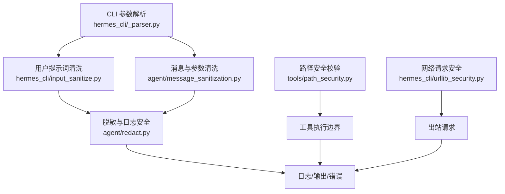
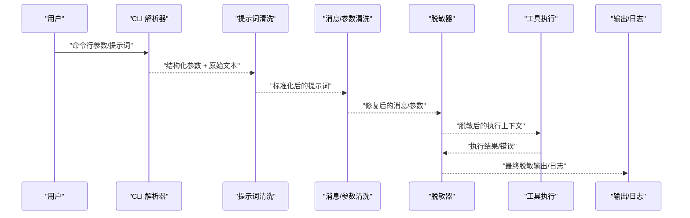
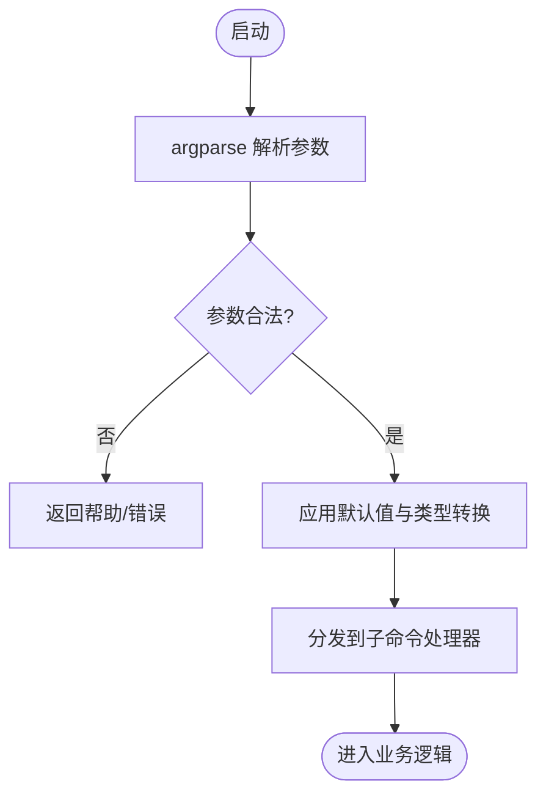
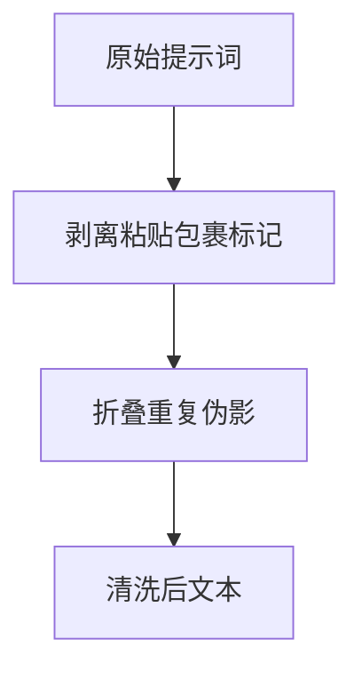
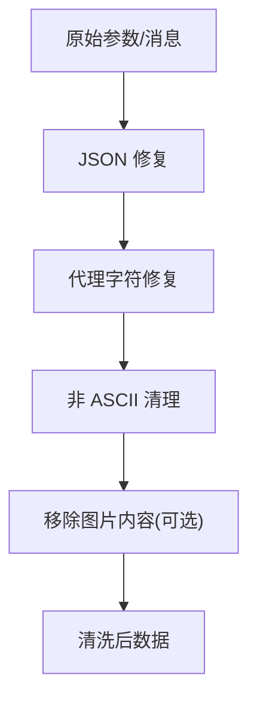
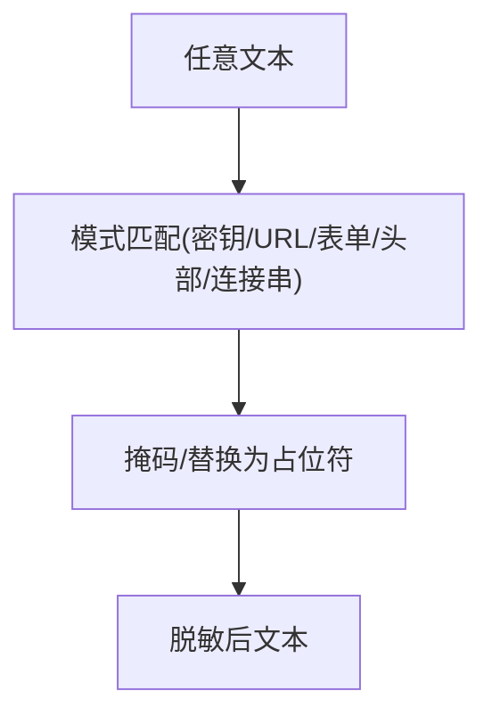
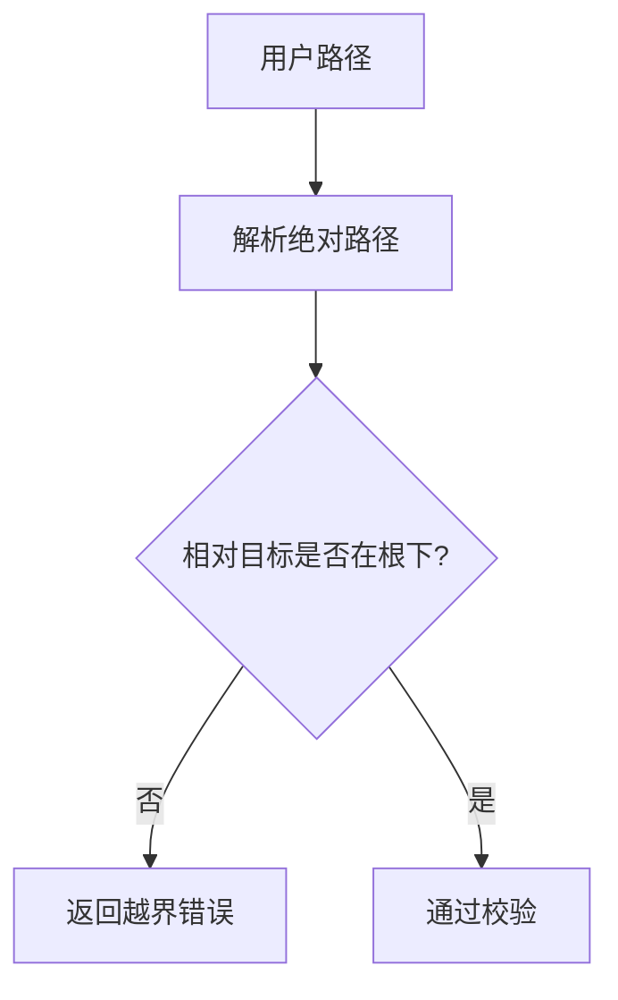
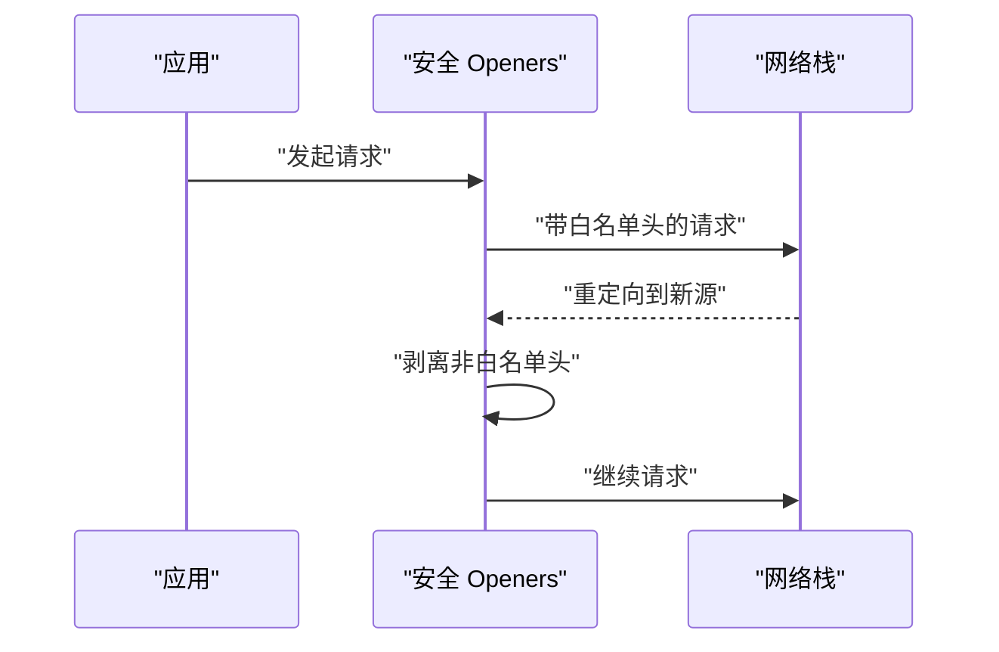
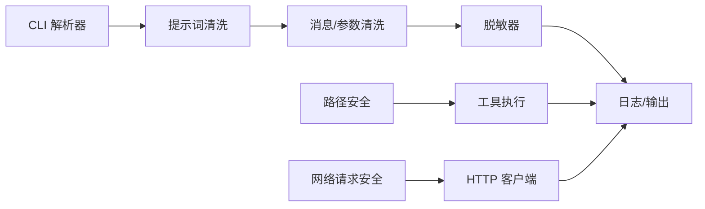

# 输入数据清洗

<cite>
**本文引用的文件**
- [hermes_cli/input_sanitize.py](file://hermes_cli/input_sanitize.py)
- [agent/message_sanitization.py](file://agent/message_sanitization.py)
- [agent/redact.py](file://agent/redact.py)
- [hermes_cli/_parser.py](file://hermes_cli/_parser.py)
- [tools/path_security.py](file://tools/path_security.py)
- [hermes_cli/urllib_security.py](file://hermes_cli/urllib_security.py)
- [tests/hermes_cli/test_input_sanitize.py](file://tests/hermes_cli/test_input_sanitize.py)
- [tests/tools/test_terminal_error_redaction.py](file://tests/tools/test_terminal_error_redaction.py)
</cite>

## 目录
1. [简介](#简介)
2. [项目结构](#项目结构)
3. [核心组件](#核心组件)
4. [架构总览](#架构总览)
5. [详细组件分析](#详细组件分析)
6. [依赖关系分析](#依赖关系分析)
7. [性能考量](#性能考量)
8. [故障排查指南](#故障排查指南)
9. [结论](#结论)
10. [附录](#附录)

## 简介
本文件系统性梳理 Hermes Agent 的“输入数据清洗”能力，覆盖从命令行参数解析、用户文本与消息体清洗、敏感信息脱敏、路径安全校验到网络请求跨域安全等关键环节。文档面向开发者与运维人员，提供可操作的配置项说明、扩展点建议、常见攻击场景防护示例与测试方法，以及性能优化建议。

## 项目结构
围绕输入清洗的关键模块分布在 CLI、Agent、工具与安全策略层：
- CLI 层：负责命令行参数解析与入口控制（如一次性模式、会话恢复、工具集开关等），为后续清洗流程提供结构化输入。
- Agent 层：对消息与工具调用参数进行健壮性修复（如 JSON 修复、代理字符处理、非 ASCII 清理），并维护推理字段策略。
- 脱敏层：统一对日志、输出、错误信息进行敏感信息识别与掩码，覆盖密钥、URL、表单、头部、连接串等。
- 工具层：提供路径安全校验、网络请求跨域安全策略等通用能力。
- 测试层：覆盖终端错误脱敏、输入清洗等关键行为回归。

图表来源
- [hermes_cli/_parser.py:87-503](file://hermes_cli/_parser.py#L87-L503)
- [hermes_cli/input_sanitize.py:16-70](file://hermes_cli/input_sanitize.py#L16-L70)
- [agent/message_sanitization.py:195-293](file://agent/message_sanitization.py#L195-L293)
- [agent/redact.py:772-800](file://agent/redact.py#L772-L800)
- [tools/path_security.py:15-44](file://tools/path_security.py#L15-L44)
- [hermes_cli/urllib_security.py:31-132](file://hermes_cli/urllib_security.py#L31-L132)

章节来源
- [hermes_cli/_parser.py:87-503](file://hermes_cli/_parser.py#L87-L503)
- [hermes_cli/input_sanitize.py:16-70](file://hermes_cli/input_sanitize.py#L16-L70)
- [agent/message_sanitization.py:195-293](file://agent/message_sanitization.py#L195-L293)
- [agent/redact.py:772-800](file://agent/redact.py#L772-L800)
- [tools/path_security.py:15-44](file://tools/path_security.py#L15-L44)
- [hermes_cli/urllib_security.py:31-132](file://hermes_cli/urllib_security.py#L31-L132)

## 核心组件
- 命令行参数解析与类型转换
  - 顶层与子命令参数定义集中管理，支持模型、工具集、推理强度、会话恢复、工作树隔离、TUI/REPL 切换等；通过 argparse 完成类型转换与默认值注入。
- 用户提示词清洗
  - 剥离终端粘贴包裹标记、折叠桌面端粘贴残留伪影，保证持久化与模型输入整洁。
- 消息与工具参数清洗
  - 修复非法 JSON（尾逗号、未闭合括号、控制字符转义）、替换代理字符、清理非 ASCII、移除图片内容以适配不支持图像的后端。
- 敏感信息脱敏
  - 基于正则的模式匹配，覆盖 API Key、JWT、数据库连接串、URL 查询参数、表单体、Authorization 头、私有密钥块等；支持强制脱敏与代码/文件读取上下文差异化策略。
- 路径安全校验
  - 规范化路径并校验是否越界，快速检测路径穿越片段。
- 网络请求跨域安全
  - 重定向时仅保留白名单头，跨源请求剥离敏感头，防止凭据泄露。

章节来源
- [hermes_cli/_parser.py:87-503](file://hermes_cli/_parser.py#L87-L503)
- [hermes_cli/input_sanitize.py:16-70](file://hermes_cli/input_sanitize.py#L16-L70)
- [agent/message_sanitization.py:195-293](file://agent/message_sanitization.py#L195-L293)
- [agent/redact.py:772-800](file://agent/redact.py#L772-L800)
- [tools/path_security.py:15-44](file://tools/path_security.py#L15-L44)
- [hermes_cli/urllib_security.py:31-132](file://hermes_cli/urllib_security.py#L31-L132)

## 架构总览
输入清洗贯穿“解析—清洗—脱敏—执行—输出”全链路，形成多层防御：
- 解析阶段：将原始字符串转换为强类型参数，减少下游歧义。
- 清洗阶段：对用户输入与消息体进行规范化与修复，避免崩溃或上游拒绝。
- 脱敏阶段：在日志、错误、输出等出口处统一屏蔽敏感信息。
- 执行阶段：路径与网络请求的安全策略限制越权与凭据泄露。
- 输出阶段：最终结果再次脱敏，确保不泄漏敏感内容。

图表来源
- [hermes_cli/_parser.py:87-503](file://hermes_cli/_parser.py#L87-L503)
- [hermes_cli/input_sanitize.py:16-70](file://hermes_cli/input_sanitize.py#L16-L70)
- [agent/message_sanitization.py:195-293](file://agent/message_sanitization.py#L195-L293)
- [agent/redact.py:772-800](file://agent/redact.py#L772-L800)

## 详细组件分析

### 命令行参数解析与类型转换
- 顶层与 chat 子命令参数集中定义，包含模型、提供者、推理级别、工具集、会话恢复、工作树、TUI/REPL 等。
- 使用 argparse 的类型转换与默认值机制，保证参数合法性与一致性。
- 通过继承标志表实现重启/重入时参数透传，便于自动化与脚本集成。

图表来源
- [hermes_cli/_parser.py:87-503](file://hermes_cli/_parser.py#L87-L503)

章节来源
- [hermes_cli/_parser.py:87-503](file://hermes_cli/_parser.py#L87-L503)

### 用户提示词清洗
- 去除终端粘贴包裹标记（包括退化可见形式），避免污染持久化与模型输入。
- 折叠桌面端粘贴残留伪影，消除重复噪声。
- 提供统一的入口函数用于持久化前或模型输入前的清洗。

图表来源
- [hermes_cli/input_sanitize.py:16-70](file://hermes_cli/input_sanitize.py#L16-L70)

章节来源
- [hermes_cli/input_sanitize.py:16-70](file://hermes_cli/input_sanitize.py#L16-L70)

### 消息与工具参数清洗
- JSON 参数修复：处理尾逗号、未闭合结构、控制字符转义、Python None 等，失败时降级为空对象以保证请求成功。
- 代理字符修复：替换无效代理对，避免 json.dumps 崩溃。
- 非 ASCII 清理：作为最后手段，兼容 ASCII-only 环境。
- 图像内容剥离：在不支持图像的后端中移除图片部分，保持消息交替不变。

图表来源
- [agent/message_sanitization.py:195-293](file://agent/message_sanitization.py#L195-L293)
- [agent/message_sanitization.py:328-475](file://agent/message_sanitization.py#L328-L475)
- [agent/message_sanitization.py:401-446](file://agent/message_sanitization.py#L401-L446)

章节来源
- [agent/message_sanitization.py:195-293](file://agent/message_sanitization.py#L195-L293)
- [agent/message_sanitization.py:328-475](file://agent/message_sanitization.py#L328-L475)
- [agent/message_sanitization.py:401-446](file://agent/message_sanitization.py#L401-L446)

### 敏感信息脱敏
- 覆盖范围：API Key、JWT、数据库连接串、URL 查询参数、表单体、Authorization 头、私有密钥块、环境变量赋值、配置文件键值等。
- 策略：
  - 默认开启，可通过配置关闭（启动时记录告警）。
  - 支持强制脱敏模式，确保安全边界不被绕过。
  - 针对代码/文件读取上下文差异化处理，避免误伤常量或测试数据。
- URL 与表单：
  - 对查询参数按敏感键名替换为占位符。
  - 对表单体整体匹配 k=v&k=v 模式进行逐对脱敏。
- 显示与日志：
  - 短令牌完全掩码，长令牌保留首尾若干字符以便调试。
  - 控制字符与零宽字符干扰的令牌拆分场景有专门处理。

图表来源
- [agent/redact.py:772-800](file://agent/redact.py#L772-L800)
- [agent/redact.py:610-743](file://agent/redact.py#L610-L743)
- [agent/redact.py:549-608](file://agent/redact.py#L549-L608)

章节来源
- [agent/redact.py:549-608](file://agent/redact.py#L549-L608)
- [agent/redact.py:610-743](file://agent/redact.py#L610-L743)
- [agent/redact.py:772-800](file://agent/redact.py#L772-L800)

### 路径安全校验
- 规范化路径并检查是否在允许根目录下，防止路径穿越。
- 快速检测包含 “..” 的路径片段，提前拦截可疑输入。

图表来源
- [tools/path_security.py:15-44](file://tools/path_security.py#L15-L44)

章节来源
- [tools/path_security.py:15-44](file://tools/path_security.py#L15-L44)

### 网络请求跨域安全
- 重定向时仅保留白名单头（如 accept、user-agent），其他自定义头可能携带凭据将被剥离。
- 跨源请求在处理器末尾统一剥离敏感头，防止被后续处理器重新添加。
- 提供封装函数以最小侵入方式保护现有 opener 策略。

图表来源
- [hermes_cli/urllib_security.py:31-132](file://hermes_cli/urllib_security.py#L31-L132)

章节来源
- [hermes_cli/urllib_security.py:31-132](file://hermes_cli/urllib_security.py#L31-L132)

## 依赖关系分析
- CLI 解析器为上层提供稳定参数契约，降低下游解析复杂度。
- 提示词清洗与消息清洗相互独立但顺序协作，前者聚焦用户输入，后者关注消息结构与协议兼容性。
- 脱敏器作为公共能力被多处复用，确保一致性与可维护性。
- 路径与网络安全策略作为横切关注点，嵌入工具执行与出站请求边界。

图表来源
- [hermes_cli/_parser.py:87-503](file://hermes_cli/_parser.py#L87-L503)
- [hermes_cli/input_sanitize.py:16-70](file://hermes_cli/input_sanitize.py#L16-L70)
- [agent/message_sanitization.py:195-293](file://agent/message_sanitization.py#L195-L293)
- [agent/redact.py:772-800](file://agent/redact.py#L772-L800)
- [tools/path_security.py:15-44](file://tools/path_security.py#L15-L44)
- [hermes_cli/urllib_security.py:31-132](file://hermes_cli/urllib_security.py#L31-L132)

章节来源
- [hermes_cli/_parser.py:87-503](file://hermes_cli/_parser.py#L87-L503)
- [hermes_cli/input_sanitize.py:16-70](file://hermes_cli/input_sanitize.py#L16-L70)
- [agent/message_sanitization.py:195-293](file://agent/message_sanitization.py#L195-L293)
- [agent/redact.py:772-800](file://agent/redact.py#L772-L800)
- [tools/path_security.py:15-44](file://tools/path_security.py#L15-L44)
- [hermes_cli/urllib_security.py:31-132](file://hermes_cli/urllib_security.py#L31-L132)

## 性能考量
- 提示词清洗使用正则与字符串操作，时间复杂度近似线性，适合高频调用。
- 消息 JSON 修复采用多阶段策略，优先尝试宽松解析再逐步增强，减少回溯开销。
- 脱敏器通过预编译正则与快速前置判断（如关键词扫描）避免不必要的深度匹配。
- 路径校验与网络头剥离均为轻量操作，建议在热路径中尽早执行以减少后续成本。

[本节为通用指导，无需特定文件来源]

## 故障排查指南
- 终端错误输出中的敏感信息泄露
  - 现象：错误信息或回溯中包含密钥片段。
  - 处理：确认脱敏器已启用并在错误输出路径调用；必要时使用强制脱敏模式。
  - 参考测试：验证终端错误脱敏行为。
- 提示词清洗异常
  - 现象：粘贴残留或包裹标记出现在持久化文本中。
  - 处理：检查清洗入口是否被跳过；确认输入是否为空或非字符串。
  - 参考测试：覆盖粘贴标记剥离与伪影折叠。
- JSON 参数修复失败
  - 现象：上游 API 报 400 无效参数。
  - 处理：查看警告日志定位原始参数；确认修复策略是否覆盖当前畸形模式。
  - 参考位置：JSON 修复与日志边界。
- 路径越界
  - 现象：工具报错路径逃逸。
  - 处理：检查传入路径是否包含 “..” 或符号链接导致越界；调整根目录或过滤规则。
- 跨域请求凭据泄露
  - 现象：重定向到其他域名后仍发送了敏感头。
  - 处理：确认使用了安全 opener 封装；检查白名单头是否符合预期。

章节来源
- [tests/tools/test_terminal_error_redaction.py:1-154](file://tests/tools/test_terminal_error_redaction.py#L1-L154)
- [tests/hermes_cli/test_input_sanitize.py](file://tests/hermes_cli/test_input_sanitize.py)
- [agent/message_sanitization.py:195-293](file://agent/message_sanitization.py#L195-L293)
- [tools/path_security.py:15-44](file://tools/path_security.py#L15-L44)
- [hermes_cli/urllib_security.py:31-132](file://hermes_cli/urllib_security.py#L31-L132)

## 结论
Hermes Agent 的输入数据清洗体系以“解析—清洗—脱敏—执行—输出”为主线，结合路径与网络安全策略，形成多层次防护。通过统一的脱敏接口、健壮的 JSON 修复与提示词清洗、严格的跨域头策略，有效降低 SQL 注入、命令注入、脚本执行与凭据泄露风险。建议在生产环境中保持脱敏器默认开启，并结合测试用例持续验证关键路径。

[本节为总结性内容，无需特定文件来源]

## 附录

### 配置选项与扩展接口
- 脱敏器开关
  - 通过配置项或环境变量控制是否启用脱敏；默认开启，关闭时会在启动时记录告警。
  - 支持强制脱敏模式，确保安全边界不可被绕过。
- 代码/文件读取上下文
  - 在已知为源码或文件内容的上下文中，可跳过某些 ENV/JSON 字段匹配，避免误伤常量或测试数据。
- 自定义验证规则
  - 可在提示词清洗与消息清洗链路上插入自定义步骤，例如增加业务特定的白名单/黑名单校验。
  - 路径安全与网络请求安全可作为横切策略被工具与 HTTP 客户端复用。

章节来源
- [agent/redact.py:772-800](file://agent/redact.py#L772-L800)
- [hermes_cli/input_sanitize.py:16-70](file://hermes_cli/input_sanitize.py#L16-L70)
- [agent/message_sanitization.py:195-293](file://agent/message_sanitization.py#L195-L293)
- [tools/path_security.py:15-44](file://tools/path_security.py#L15-L44)
- [hermes_cli/urllib_security.py:31-132](file://hermes_cli/urllib_security.py#L31-L132)

### 常见攻击场景与防护示例
- SQL 注入
  - 防护要点：参数化查询、严格类型转换、输入白名单校验；在消息与参数清洗阶段剔除危险字符。
  - 实践建议：对来自 CLI 与工具的参数进行强类型转换与边界检查。
- 命令注入
  - 防护要点：禁止直接拼接用户输入到系统命令；使用沙箱与受限执行环境；路径校验防止越界。
  - 实践建议：在执行前进行路径穿越检测与命令白名单校验。
- 脚本执行限制
  - 防护要点：禁用危险内置函数与模块；限制文件系统访问范围；网络请求跨域安全。
  - 实践建议：结合路径安全与网络请求安全策略，限制执行面。
- 凭据泄露
  - 防护要点：统一脱敏；URL 查询参数与表单体敏感键替换；Authorization 头掩码。
  - 实践建议：在所有输出与日志出口调用脱敏器，必要时使用强制模式。

[本节为概念性指导，无需特定文件来源]

### 测试方法
- 终端错误脱敏
  - 验证错误信息与回溯中不包含真实密钥；确认可配置关闭脱敏时的行为。
- 提示词清洗
  - 验证粘贴包裹标记与伪影被正确剥离与折叠；空输入与非字符串输入保持不变。
- JSON 修复
  - 构造畸形 JSON（尾逗号、未闭合、控制字符）并验证修复结果；失败时降级为空对象。
- 路径安全
  - 构造包含 “..” 或符号链接的路径，验证越界拦截。
- 跨域请求
  - 模拟重定向到不同源，验证非白名单头被剥离。

章节来源
- [tests/tools/test_terminal_error_redaction.py:1-154](file://tests/tools/test_terminal_error_redaction.py#L1-L154)
- [tests/hermes_cli/test_input_sanitize.py](file://tests/hermes_cli/test_input_sanitize.py)
- [agent/message_sanitization.py:195-293](file://agent/message_sanitization.py#L195-L293)
- [tools/path_security.py:15-44](file://tools/path_security.py#L15-L44)
- [hermes_cli/urllib_security.py:31-132](file://hermes_cli/urllib_security.py#L31-L132)