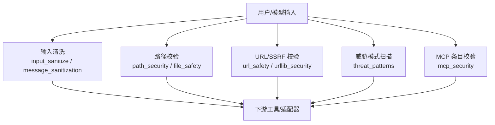
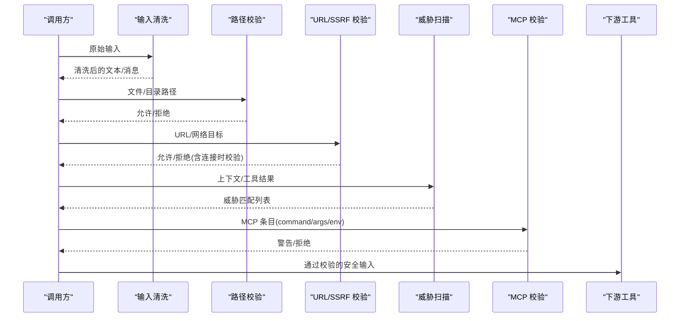
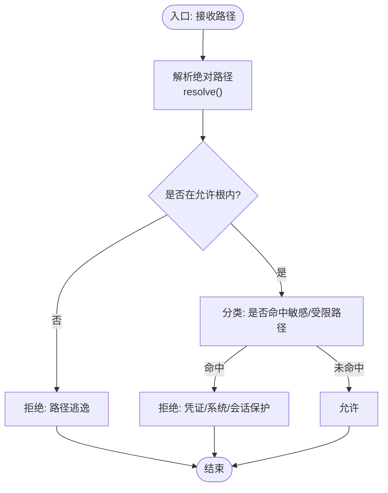
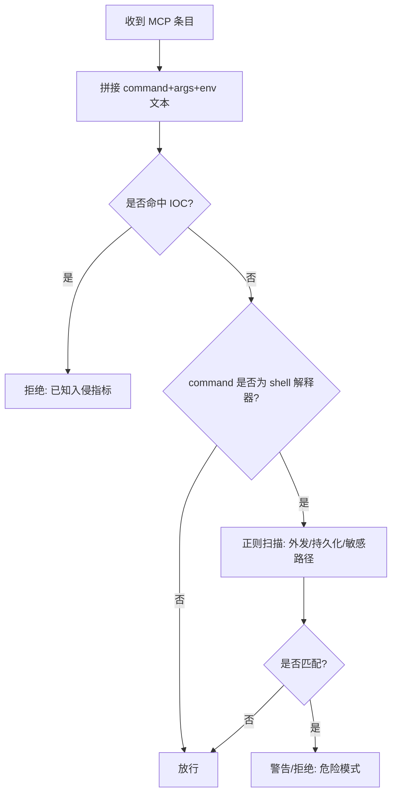
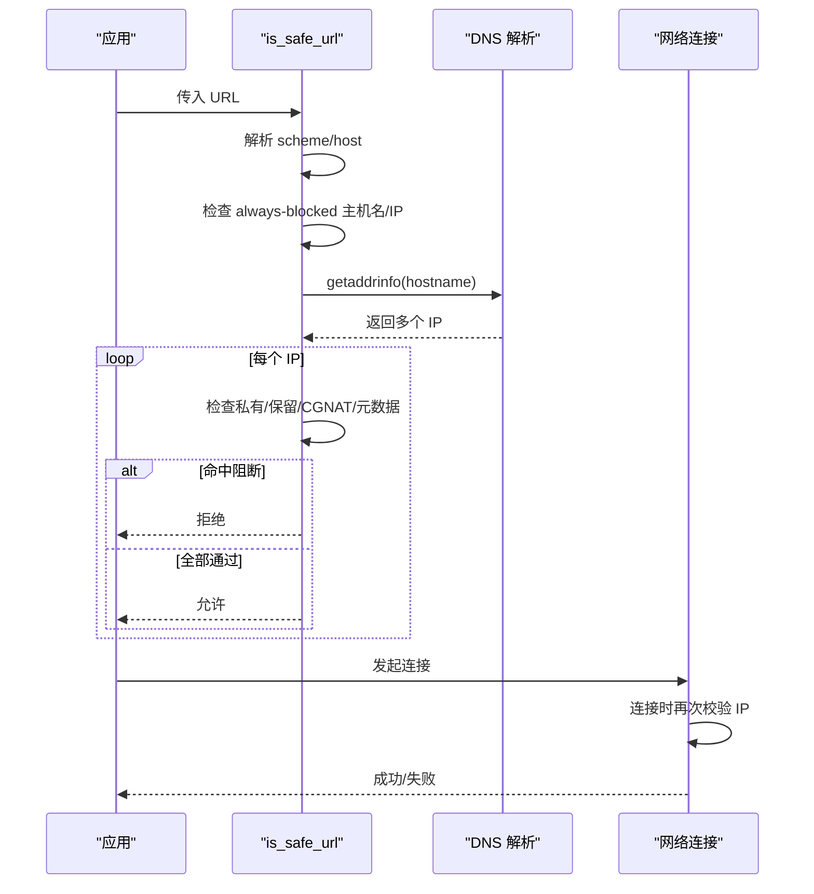
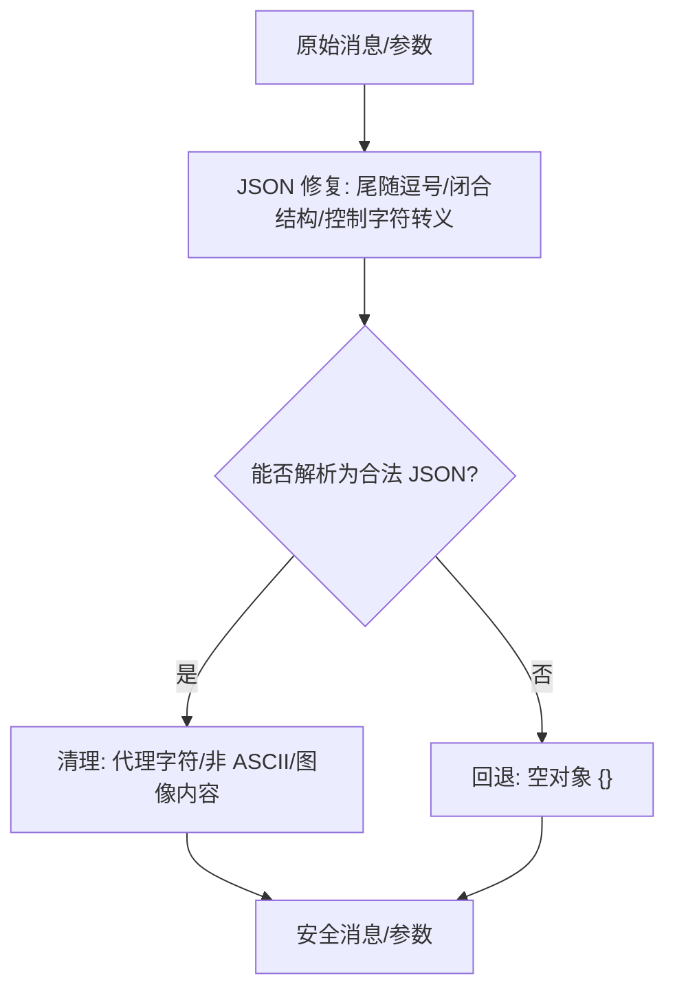
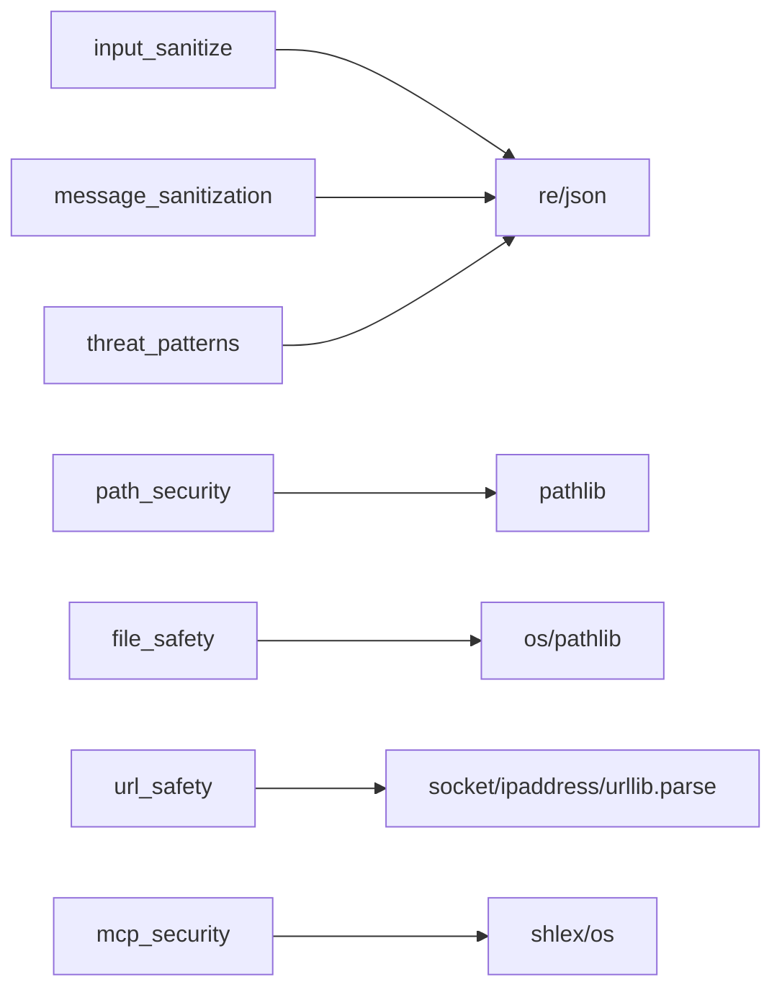

# 输入验证

<cite>
**本文引用的文件**
- [tools/path_security.py](file://tools/path_security.py)
- [tools/url_safety.py](file://tools/url_safety.py)
- [hermes_cli/input_sanitize.py](file://hermes_cli/input_sanitize.py)
- [agent/message_sanitization.py](file://agent/message_sanitization.py)
- [hermes_cli/mcp_security.py](file://hermes_cli/mcp_security.py)
- [agent/file_safety.py](file://agent/file_safety.py)
- [hermes_cli/urllib_security.py](file://hermes_cli/urllib_security.py)
- [tools/threat_patterns.py](file://tools/threat_patterns.py)
- [tests/tools/test_terminal_error_redaction.py](file://tests/tools/test_terminal_error_redaction.py)
</cite>

## 目录
1. [简介](#简介)
2. [项目结构](#项目结构)
3. [核心组件](#核心组件)
4. [架构总览](#架构总览)
5. [详细组件分析](#详细组件分析)
6. [依赖关系分析](#依赖关系分析)
7. [性能考量](#性能考量)
8. [故障排查指南](#故障排查指南)
9. [结论](#结论)
10. [附录](#附录)

## 简介
本文件系统性梳理 Hermes Agent 在“输入验证”方面的实现与最佳实践，覆盖输入清理、路径安全检查、恶意输入防护、命令注入检测、脚本执行限制、URL/SSRF 防护、消息与工具参数清洗、敏感信息脱敏、以及面向配置与扩展的自定义验证规则。文档同时提供常见攻击识别方法与防护措施，并给出可操作的测试建议，帮助开发者构建健壮的输入安全边界。

## 项目结构
围绕输入安全的关键模块分布在以下位置：
- 路径与文件系统安全：tools/path_security.py、agent/file_safety.py
- URL 与网络请求安全：tools/url_safety.py、hermes_cli/urllib_security.py
- 文本与消息清洗：hermes_cli/input_sanitize.py、agent/message_sanitization.py
- 威胁模式扫描与提示注入防护：tools/threat_patterns.py
- MCP 服务器条目安全校验：hermes_cli/mcp_security.py
- 终端输出与错误信息中的敏感信息脱敏：tests/tools/test_terminal_error_redaction.py（测试驱动行为）

**图表来源**
- [hermes_cli/input_sanitize.py:16-71](file://hermes_cli/input_sanitize.py#L16-L71)
- [agent/message_sanitization.py:32-141](file://agent/message_sanitization.py#L32-L141)
- [tools/path_security.py:15-44](file://tools/path_security.py#L15-L44)
- [agent/file_safety.py:28-177](file://agent/file_safety.py#L28-L177)
- [tools/url_safety.py:415-528](file://tools/url_safety.py#L415-L528)
- [hermes_cli/urllib_security.py:31-132](file://hermes_cli/urllib_security.py#L31-L132)
- [tools/threat_patterns.py:207-255](file://tools/threat_patterns.py#L207-L255)
- [hermes_cli/mcp_security.py:121-182](file://hermes_cli/mcp_security.py#L121-L182)

**章节来源**
- [tools/path_security.py:1-44](file://tools/path_security.py#L1-L44)
- [tools/url_safety.py:1-800](file://tools/url_safety.py#L1-L800)
- [hermes_cli/input_sanitize.py:1-71](file://hermes_cli/input_sanitize.py#L1-L71)
- [agent/message_sanitization.py:1-800](file://agent/message_sanitization.py#L1-L800)
- [hermes_cli/mcp_security.py:1-182](file://hermes_cli/mcp_security.py#L1-L182)
- [agent/file_safety.py:1-694](file://agent/file_safety.py#L1-L694)
- [hermes_cli/urllib_security.py:1-140](file://hermes_cli/urllib_security.py#L1-L140)
- [tools/threat_patterns.py:1-285](file://tools/threat_patterns.py#L1-L285)
- [tests/tools/test_terminal_error_redaction.py:1-154](file://tests/tools/test_terminal_error_redaction.py#L1-L154)

## 核心组件
- 路径安全与遍历防护：统一解析路径、拒绝越界访问、快速检测“..”穿越片段。
- 文件读写白名单/黑名单：保护凭证文件、系统关键路径、跨配置文件写入与沙箱镜像误写。
- URL/SSRF 防护：域名/IP 白名单/黑名单、DNS 重绑定缓解、连接时二次校验、代理环境兼容。
- 文本与消息清洗：去除控制字符、修复 JSON、处理代理字符与非 ASCII 兼容。
- 威胁模式扫描：提示注入、C2/Brainworm 特征、硬编码密钥、不可见 Unicode 等。
- MCP 条目安全：阻止 shell 解释器外发数据与持久化写入、IOC 阻断。
- 敏感信息脱敏：终端错误与输出中自动隐藏凭据形状字符串。

**章节来源**
- [tools/path_security.py:15-44](file://tools/path_security.py#L15-L44)
- [agent/file_safety.py:28-177](file://agent/file_safety.py#L28-L177)
- [tools/url_safety.py:415-528](file://tools/url_safety.py#L415-L528)
- [agent/message_sanitization.py:195-293](file://agent/message_sanitization.py#L195-L293)
- [tools/threat_patterns.py:207-255](file://tools/threat_patterns.py#L207-L255)
- [hermes_cli/mcp_security.py:121-182](file://hermes_cli/mcp_security.py#L121-L182)
- [tests/tools/test_terminal_error_redaction.py:41-154](file://tests/tools/test_terminal_error_redaction.py#L41-L154)

## 架构总览
输入进入系统后，会依次经过多层清洗与校验：
- 文本层：清理粘贴标记、修复 JSON、处理代理字符与非 ASCII 兼容。
- 路径层：规范化路径、检查穿越、限定写入范围、拦截敏感文件。
- 网络层：URL 归一化、禁止私有/内部地址、连接时再次校验 IP、跨源头清理。
- 语义层：威胁模式扫描，识别提示注入、C2、硬编码密钥等。
- 配置层：MCP 条目安全校验，阻止危险命令与 IOC。

**图表来源**
- [hermes_cli/input_sanitize.py:16-71](file://hermes_cli/input_sanitize.py#L16-L71)
- [agent/message_sanitization.py:32-141](file://agent/message_sanitization.py#L32-L141)
- [tools/path_security.py:15-44](file://tools/path_security.py#L15-L44)
- [agent/file_safety.py:101-177](file://agent/file_safety.py#L101-L177)
- [tools/url_safety.py:415-528](file://tools/url_safety.py#L415-L528)
- [tools/threat_patterns.py:207-255](file://tools/threat_patterns.py#L207-L255)
- [hermes_cli/mcp_security.py:121-182](file://hermes_cli/mcp_security.py#L121-L182)

## 详细组件分析

### 路径遍历攻击防护与路径安全
- 路径规范化与越界检测：使用 resolve() + relative_to() 确保目标位于允许根目录下；对包含“..”的路径进行快速检测。
- 写入保护：维护受保护文件与目录前缀清单，限制写入到敏感区域；支持 HERMES_WRITE_SAFE_ROOT 白名单。
- 跨配置/沙箱镜像写入软保护：识别跨 profile 写入与容器/沙箱镜像路径，返回告警或拒绝，避免误写权威状态。

**图表来源**
- [tools/path_security.py:15-44](file://tools/path_security.py#L15-L44)
- [agent/file_safety.py:28-177](file://agent/file_safety.py#L28-L177)

**章节来源**
- [tools/path_security.py:15-44](file://tools/path_security.py#L15-L44)
- [agent/file_safety.py:28-177](file://agent/file_safety.py#L28-L177)
- [agent/file_safety.py:417-506](file://agent/file_safety.py#L417-L506)
- [agent/file_safety.py:551-616](file://agent/file_safety.py#L551-L616)

### 命令注入检测与脚本执行限制
- MCP 条目安全：当 command 为 shell 解释器时，检测 args 中是否存在网络外发指令（curl/wget/nc 等）或系统持久化写入（SSH/PAM/sudoers/cron/rc），并阻断已知 IOC。
- 威胁模式扫描：在上下文/工具结果中检测提示注入、C2 通信、硬编码密钥、不可见 Unicode 等，按作用域（all/context/strict）应用不同严格度。

**图表来源**
- [hermes_cli/mcp_security.py:121-182](file://hermes_cli/mcp_security.py#L121-L182)
- [tools/threat_patterns.py:207-255](file://tools/threat_patterns.py#L207-L255)

**章节来源**
- [hermes_cli/mcp_security.py:33-88](file://hermes_cli/mcp_security.py#L33-L88)
- [hermes_cli/mcp_security.py:121-182](file://hermes_cli/mcp_security.py#L121-L182)
- [tools/threat_patterns.py:63-135](file://tools/threat_patterns.py#L63-L135)
- [tools/threat_patterns.py:207-255](file://tools/threat_patterns.py#L207-L255)

### URL 安全与 SSRF 防护
- URL 归一化：将 IRI 转为 ASCII 安全的 HTTP(S) URL，保留百分号编码。
- 域名/IP 策略：始终阻止云元数据主机名与链接本地/私有/保留/CGNAT 地址；支持全局开关允许私有 IP（默认关闭）。
- DNS 重绑定缓解：在连接时再次解析并校验 IP，仅允许白名单集合；异常失败时关闭。
- 代理环境兼容：当配置了代理且 DNS 解析失败时，允许交由代理侧解析，但元数据主机名仍被阻止。
- 跨源头清理：对 urllib 请求在跨源跳转时剥离非白名单头，防止凭据泄露。

**图表来源**
- [tools/url_safety.py:58-103](file://tools/url_safety.py#L58-L103)
- [tools/url_safety.py:311-528](file://tools/url_safety.py#L311-L528)
- [hermes_cli/urllib_security.py:31-132](file://hermes_cli/urllib_security.py#L31-L132)

**章节来源**
- [tools/url_safety.py:1-800](file://tools/url_safety.py#L1-L800)
- [hermes_cli/urllib_security.py:1-140](file://hermes_cli/urllib_security.py#L1-L140)

### 输入格式验证、数据类型检查与边界值处理
- 消息清洗：替换代理字符、修复非法控制字符、补全/闭合 JSON 结构、移除非 ASCII 字符以兼容 ASCII-only 环境。
- 工具调用参数修复：对截断/尾随逗号/Python None 等常见畸形 JSON 进行多轮修复，最终回退为空对象以避免崩溃。
- 图像内容剥离：在服务不支持图片时，从消息中移除 image_url/image 部分，保持角色交替不变。
- 边界值：扫描最大字符数限制（MAX_SCAN_CHARS），避免超长输入导致性能问题。

**图表来源**
- [agent/message_sanitization.py:195-293](file://agent/message_sanitization.py#L195-L293)
- [agent/message_sanitization.py:327-475](file://agent/message_sanitization.py#L327-L475)
- [tools/threat_patterns.py:49-53](file://tools/threat_patterns.py#L49-L53)

**章节来源**
- [agent/message_sanitization.py:32-141](file://agent/message_sanitization.py#L32-L141)
- [agent/message_sanitization.py:195-293](file://agent/message_sanitization.py#L195-L293)
- [agent/message_sanitization.py:327-475](file://agent/message_sanitization.py#L327-L475)
- [tools/threat_patterns.py:49-53](file://tools/threat_patterns.py#L49-L53)

### SQL 注入防护、XSS 攻击防护与文件上传安全检查
- SQL 注入防护：当前仓库未发现直接数据库查询入口；若未来引入 SQL，应使用参数化查询与强类型校验，避免字符串拼接。
- XSS 防护：前端/模板渲染需对输出进行 HTML 转义；对用户输入进行白名单过滤与长度限制。
- 文件上传安全：结合路径安全与文件安全策略，限制可写入目录、禁止写入敏感文件、校验文件类型与大小、扫描恶意内容。

[本节为通用指导，不直接分析具体文件]

### 输入验证配置指南与自定义验证规则开发
- 全局开关：允许私有 URL 可通过环境变量或配置文件开启（默认关闭），但云元数据主机名/IP 永远阻止。
- 白名单目录：通过 HERMES_WRITE_SAFE_ROOT 指定允许写入的安全根目录。
- 自定义规则：基于 threat_patterns 的作用域机制，可扩展新的正则模式；基于 mcp_security 可扩展 IOC 与危险命令模式；基于 path_security 可扩展路径穿越检测逻辑。

**章节来源**
- [tools/url_safety.py:220-279](file://tools/url_safety.py#L220-L279)
- [agent/file_safety.py:83-98](file://agent/file_safety.py#L83-L98)
- [tools/threat_patterns.py:167-204](file://tools/threat_patterns.py#L167-L204)
- [hermes_cli/mcp_security.py:121-182](file://hermes_cli/mcp_security.py#L121-L182)

### 常见输入攻击识别方法与防护措施
- 路径遍历：使用 resolve() 与 relative_to() 校验；快速检测“..”片段。
- 命令注入：检测 shell 解释器与危险命令组合；阻断 IOC。
- SSRF：阻止私有/内部/元数据地址；连接时再次校验 IP；代理环境下谨慎放行。
- 提示注入/C2：扫描忽略指令、角色劫持、C2 词汇、硬编码密钥、不可见 Unicode。
- 敏感信息泄露：终端错误与输出中自动脱敏凭据形状字符串。

**章节来源**
- [tools/path_security.py:15-44](file://tools/path_security.py#L15-L44)
- [hermes_cli/mcp_security.py:33-88](file://hermes_cli/mcp_security.py#L33-L88)
- [tools/url_safety.py:311-528](file://tools/url_safety.py#L311-L528)
- [tools/threat_patterns.py:63-135](file://tools/threat_patterns.py#L63-L135)
- [tests/tools/test_terminal_error_redaction.py:41-154](file://tests/tools/test_terminal_error_redaction.py#L41-L154)

### 最佳实践与测试方法
- 输入最小权限：只允许必要的协议（http/https）、域名与端口；默认拒绝私有/内部地址。
- 分层校验：文本清洗 → 路径校验 → URL/SSRF → 威胁扫描 → 配置校验。
- 失败关闭：解析失败或异常一律拒绝，避免开放绕过。
- 测试建议：
  - 路径穿越：构造包含“..”与符号链接的目标路径，验证拒绝。
  - SSRF：测试私有 IP、CGNAT、元数据主机名与链接本地地址，验证阻断。
  - 提示注入：注入忽略指令、角色劫持、C2 词汇，验证匹配与告警。
  - 敏感信息：模拟终端错误输出包含凭据形状字符串，验证脱敏。
  - JSON 修复：构造截断/尾随逗号/控制字符的参数，验证修复与回退。

**章节来源**
- [tools/path_security.py:15-44](file://tools/path_security.py#L15-L44)
- [tools/url_safety.py:415-528](file://tools/url_safety.py#L415-L528)
- [tools/threat_patterns.py:207-255](file://tools/threat_patterns.py#L207-L255)
- [tests/tools/test_terminal_error_redaction.py:41-154](file://tests/tools/test_terminal_error_redaction.py#L41-L154)
- [agent/message_sanitization.py:195-293](file://agent/message_sanitization.py#L195-L293)

## 依赖关系分析
- 输入清洗模块依赖正则与 JSON 库，用于修复与标准化。
- 路径安全模块依赖 pathlib，用于路径解析与相对路径校验。
- URL 安全模块依赖 socket/ipaddress/urllib.parse，用于域名解析与 IP 分类。
- 威胁模式模块依赖 re/unicodedata，用于模式匹配与 Unicode 规范化。
- MCP 安全模块依赖 shlex/os，用于命令解析与平台差异处理。
- 文件安全模块依赖 os/pathlib，用于路径分类与敏感目录识别。

**图表来源**
- [hermes_cli/input_sanitize.py:1-71](file://hermes_cli/input_sanitize.py#L1-L71)
- [agent/message_sanitization.py:1-800](file://agent/message_sanitization.py#L1-L800)
- [tools/path_security.py:1-44](file://tools/path_security.py#L1-L44)
- [agent/file_safety.py:1-694](file://agent/file_safety.py#L1-L694)
- [tools/url_safety.py:1-800](file://tools/url_safety.py#L1-L800)
- [tools/threat_patterns.py:1-285](file://tools/threat_patterns.py#L1-L285)
- [hermes_cli/mcp_security.py:1-182](file://hermes_cli/mcp_security.py#L1-L182)

**章节来源**
- [hermes_cli/input_sanitize.py:1-71](file://hermes_cli/input_sanitize.py#L1-L71)
- [agent/message_sanitization.py:1-800](file://agent/message_sanitization.py#L1-L800)
- [tools/path_security.py:1-44](file://tools/path_security.py#L1-L44)
- [agent/file_safety.py:1-694](file://agent/file_safety.py#L1-L694)
- [tools/url_safety.py:1-800](file://tools/url_safety.py#L1-L800)
- [tools/threat_patterns.py:1-285](file://tools/threat_patterns.py#L1-L285)
- [hermes_cli/mcp_security.py:1-182](file://hermes_cli/mcp_security.py#L1-L182)

## 性能考量
- 扫描上限：威胁模式扫描限制最大字符数，避免长文本导致的正则回溯开销。
- 缓存策略：URL 安全的全局开关结果进程级缓存，减少重复配置读取。
- 批量校验：路径与文件安全采用集合与前缀匹配，提升判定效率。
- 异步支持：URL 安全提供异步版本，避免阻塞事件循环。

**章节来源**
- [tools/threat_patterns.py:49-53](file://tools/threat_patterns.py#L49-L53)
- [tools/url_safety.py:220-279](file://tools/url_safety.py#L220-L279)
- [tools/url_safety.py:522-528](file://tools/url_safety.py#L522-L528)

## 故障排查指南
- 终端错误泄露：确认错误输出与 traceback 中的敏感信息已被脱敏；参考测试用例验证行为。
- URL 被阻断：检查是否命中 always-blocked 主机名/IP；确认代理配置与 DNS 解析情况。
- 路径写入失败：确认目标是否在 HERMES_WRITE_SAFE_ROOT 白名单；检查是否命中敏感文件/目录前缀。
- 威胁模式误报：调整 scope（all/context/strict）或扩展模式；审查不可见 Unicode 与 NFKC 规范化影响。
- MCP 条目被拒：检查 command/args/env 是否包含 shell 解释器与危险模式；移除 IOC 字符串。

**章节来源**
- [tests/tools/test_terminal_error_redaction.py:41-154](file://tests/tools/test_terminal_error_redaction.py#L41-L154)
- [tools/url_safety.py:311-528](file://tools/url_safety.py#L311-L528)
- [agent/file_safety.py:28-177](file://agent/file_safety.py#L28-L177)
- [tools/threat_patterns.py:207-255](file://tools/threat_patterns.py#L207-L255)
- [hermes_cli/mcp_security.py:121-182](file://hermes_cli/mcp_security.py#L121-L182)

## 结论
Hermes Agent 在输入验证方面构建了多层次、纵深防御体系：文本清洗、路径安全、URL/SSRF 防护、威胁模式扫描与 MCP 条目校验共同构成完整的安全边界。通过严格的失败关闭策略、连接时二次校验与敏感信息脱敏，有效降低路径遍历、命令注入、SSRF、提示注入与凭据泄露风险。开发者应遵循最小权限原则、分层校验与失败关闭的最佳实践，并结合测试用例持续验证安全策略的有效性。

## 附录
- 配置项参考：
  - 允许私有 URL：环境变量或配置文件开关（默认关闭）。
  - 安全写入根：HERMES_WRITE_SAFE_ROOT 环境变量。
- 扩展点：
  - 威胁模式：在 threat_patterns 中添加新正则与作用域。
  - MCP 安全：在 mcp_security 中扩展 IOC 与危险命令模式。
  - 路径安全：在 path_security 与 file_safety 中扩展穿越检测与敏感路径。

[本节为通用指导，不直接分析具体文件]