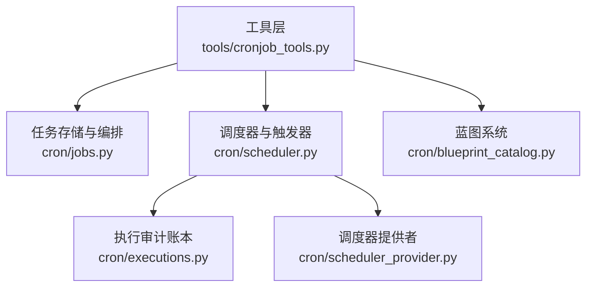
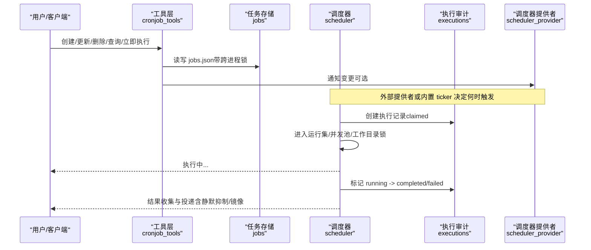
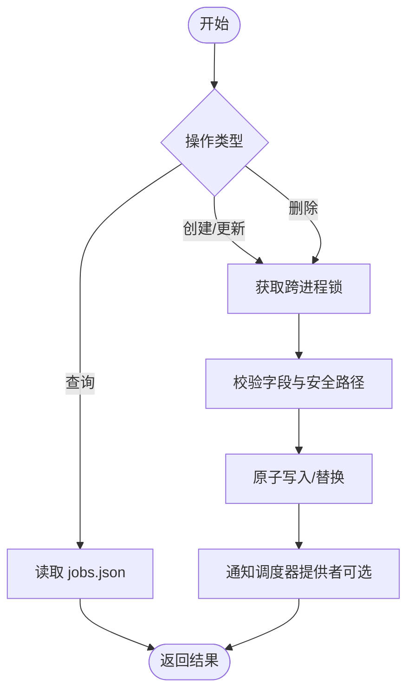
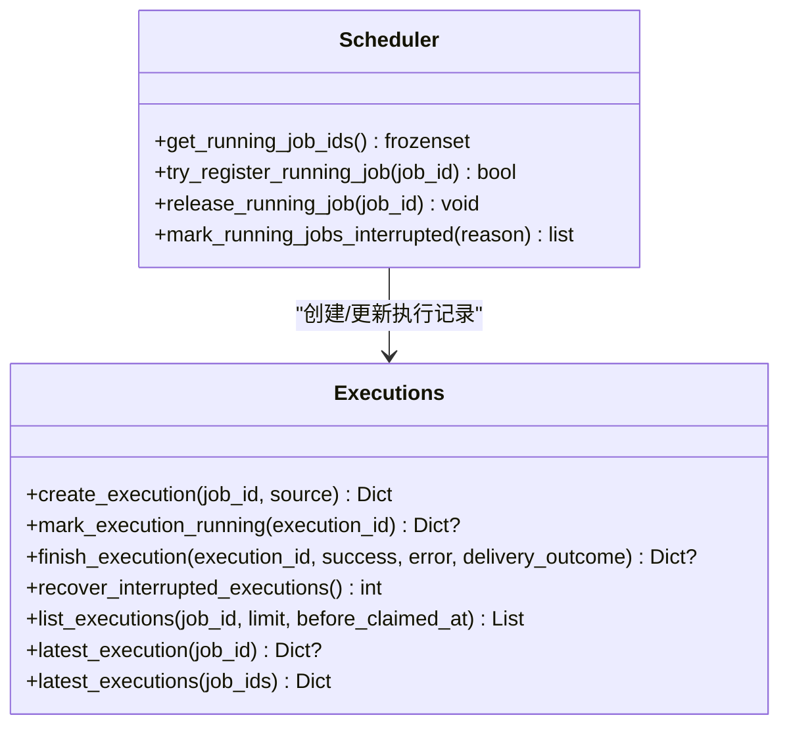
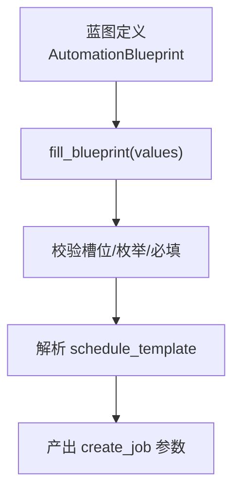
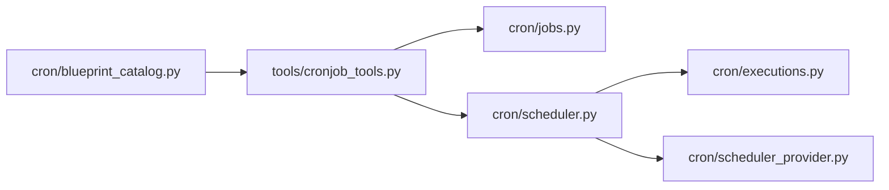

# 任务管理

<cite>
**本文引用的文件**
- [cron/scheduler.py](file://cron/scheduler.py)
- [cron/jobs.py](file://cron/jobs.py)
- [cron/executions.py](file://cron/executions.py)
- [cron/scheduler_provider.py](file://cron/scheduler_provider.py)
- [tools/cronjob_tools.py](file://tools/cronjob_tools.py)
- [cron/blueprint_catalog.py](file://cron/blueprint_catalog.py)
</cite>

## 目录
1. [简介](#简介)
2. [项目结构](#项目结构)
3. [核心组件](#核心组件)
4. [架构总览](#架构总览)
5. [详细组件分析](#详细组件分析)
6. [依赖关系分析](#依赖关系分析)
7. [性能与可靠性](#性能与可靠性)
8. [故障排查指南](#故障排查指南)
9. [结论](#结论)
10. [附录：任务定义、参数与环境配置](#附录：任务定义参数与环境配置)

## 简介
本文件面向“任务（Cron/定时）管理”的完整生命周期，覆盖任务的创建、修改、删除、查询、执行、历史记录、状态跟踪、结果收集、优先级与依赖、批量操作、模板与蓝图、版本控制与回滚、审计日志、导入导出与备份恢复等主题。文档基于仓库中 cron 子系统与工具层实现进行说明，并提供可视化图示帮助理解。

## 项目结构
任务管理由以下模块协同完成：
- 调度器与触发器：负责周期轮询、并发控制、运行集管理与中断处理
- 任务存储与编排：负责任务持久化、调度表达式解析、输出落盘、并发安全
- 执行审计账本：记录每次尝试的状态流转、进程归属、失败原因与清理策略
- 工具层接口：对外暴露创建/更新/删除/查询/立即执行/暂停/恢复等操作
- 蓝图系统：提供可复用的任务模板，将用户友好的槽位转换为最终任务定义
- 调度器提供者：抽象触发时机，内置为进程内 60s 轮询，支持外部提供者扩展

**图表来源**
- [cron/scheduler.py:1-120](file://cron/scheduler.py#L1-L120)
- [cron/jobs.py:1-120](file://cron/jobs.py#L1-L120)
- [cron/executions.py:1-60](file://cron/executions.py#L1-L60)
- [cron/scheduler_provider.py:1-130](file://cron/scheduler_provider.py#L1-L130)
- [tools/cronjob_tools.py:1-80](file://tools/cronjob_tools.py#L1-L80)
- [cron/blueprint_catalog.py:1-120](file://cron/blueprint_catalog.py#L1-L120)

**章节来源**
- [cron/scheduler.py:1-120](file://cron/scheduler.py#L1-L120)
- [cron/jobs.py:1-120](file://cron/jobs.py#L1-L120)
- [cron/executions.py:1-60](file://cron/executions.py#L1-L60)
- [cron/scheduler_provider.py:1-130](file://cron/scheduler_provider.py#L1-L130)
- [tools/cronjob_tools.py:1-80](file://tools/cronjob_tools.py#L1-L80)
- [cron/blueprint_catalog.py:1-120](file://cron/blueprint_catalog.py#L1-L120)

## 核心组件
- 调度器（scheduler）：维护运行中的任务集合、并发池、工作目录锁、中断标记、静默响应识别、投递镜像开关、使用审计日志写入等
- 任务存储（jobs）：任务 JSON 存储、跨进程文件锁、调度表达式解析、显示状态计算、输出目录安全校验、一次性任务 TTL 推导
- 执行审计（executions）：SQLite 持久化的执行尝试记录，包含 claimed/running/completed/failed/unknown 状态机，自动回收未知状态
- 工具层（cronjob_tools）：统一的 CRUD、立即执行、安全扫描、交付目标提示、重复次数展示、心跳保活等
- 蓝图（blueprint_catalog）：槽位类型、表单 schema、斜杠命令生成、深度链接、填充校验并产出 create_job 参数
- 调度器提供者（scheduler_provider）：统一触发接口，内置 InProcessCronScheduler 多 profile 复用与心跳/错误记录

**章节来源**
- [cron/scheduler.py:330-470](file://cron/scheduler.py#L330-L470)
- [cron/jobs.py:100-120](file://cron/jobs.py#L100-L120)
- [cron/executions.py:20-60](file://cron/executions.py#L20-L60)
- [tools/cronjob_tools.py:40-80](file://tools/cronjob_tools.py#L40-L80)
- [cron/blueprint_catalog.py:60-120](file://cron/blueprint_catalog.py#L60-L120)
- [cron/scheduler_provider.py:27-130](file://cron/scheduler_provider.py#L27-L130)

## 架构总览
下图展示了从工具调用到任务执行、结果收集与投递的端到端流程，以及执行审计与调度器提供的协作关系。

**图表来源**
- [tools/cronjob_tools.py:600-797](file://tools/cronjob_tools.py#L600-L797)
- [cron/jobs.py:270-373](file://cron/jobs.py#L270-L373)
- [cron/scheduler.py:330-470](file://cron/scheduler.py#L330-L470)
- [cron/executions.py:135-196](file://cron/executions.py#L135-L196)
- [cron/scheduler_provider.py:101-124](file://cron/scheduler_provider.py#L101-L124)

## 详细组件分析

### 任务创建、修改、删除、查询
- 创建/更新/删除/查询通过工具层统一入口，内部委托到任务存储模块；所有写操作受跨进程文件锁保护，避免并发破坏
- 任务状态显示采用“有效状态”计算，确保 enabled=true 时不会误报 paused
- 输出目录路径严格校验，防止路径穿越导致越权写入

**图表来源**
- [cron/jobs.py:270-373](file://cron/jobs.py#L270-L373)
- [cron/jobs.py:489-520](file://cron/jobs.py#L489-L520)
- [cron/jobs.py:381-395](file://cron/jobs.py#L381-L395)
- [tools/cronjob_tools.py:556-597](file://tools/cronjob_tools.py#L556-L597)

**章节来源**
- [cron/jobs.py:270-373](file://cron/jobs.py#L270-L373)
- [cron/jobs.py:489-520](file://cron/jobs.py#L489-L520)
- [cron/jobs.py:381-395](file://cron/jobs.py#L381-L395)
- [tools/cronjob_tools.py:556-597](file://tools/cronjob_tools.py#L556-L597)

### 任务执行与历史记录
- 每次执行在审计库中创建一条记录，状态机：claimed → running → completed/failed；异常情况下可标记 unknown 并清理
- 调度器在 tick 循环中提交任务到并行/顺序线程池，维护运行中任务集合，支持中断标记与优雅关闭
- 执行完成后，结果保存至输出目录，并可按作业维度分页查询历史

**图表来源**
- [cron/executions.py:135-196](file://cron/executions.py#L135-L196)
- [cron/executions.py:199-281](file://cron/executions.py#L199-L281)
- [cron/scheduler.py:349-461](file://cron/scheduler.py#L349-L461)

**章节来源**
- [cron/executions.py:135-196](file://cron/executions.py#L135-L196)
- [cron/executions.py:199-281](file://cron/executions.py#L199-L281)
- [cron/scheduler.py:349-461](file://cron/scheduler.py#L349-L461)

### 任务优先级、依赖与批量操作
- 优先级：通过调度表达式与间隔控制相对优先级（如更短的 interval 更频繁），或通过“enabled_toolsets”限制能力范围间接影响执行效率
- 依赖：当前未提供显式 DAG 依赖；可通过脚本或上游任务输出作为下游输入实现隐式依赖
- 批量操作：工具层支持对多个作业的列表/更新/暂停/恢复等批量动作（通过多次调用底层 API），并在必要时通知调度器提供者

**章节来源**
- [cron/jobs.py:612-709](file://cron/jobs.py#L612-L709)
- [cron/scheduler.py:223-253](file://cron/scheduler.py#L223-L253)
- [tools/cronjob_tools.py:40-80](file://tools/cronjob_tools.py#L40-L80)

### 任务模板与蓝图系统
- 蓝图定义包含槽位类型（time/enum/text/weekdays）、默认值、选项、是否必填、帮助文本
- 支持生成表单 schema、斜杠命令、深度链接，并将槽位填充后转为 create_job 参数
- 内置多种常用自动化蓝图（早报、邮件监控、周报、提醒、学习滴灌等）

**图表来源**
- [cron/blueprint_catalog.py:60-120](file://cron/blueprint_catalog.py#L60-L120)
- [cron/blueprint_catalog.py:661-714](file://cron/blueprint_catalog.py#L661-L714)

**章节来源**
- [cron/blueprint_catalog.py:60-120](file://cron/blueprint_catalog.py#L60-L120)
- [cron/blueprint_catalog.py:661-714](file://cron/blueprint_catalog.py#L661-L714)

### 版本控制、回滚机制与审计日志
- 版本控制：任务以 JSON 形式持久化，建议结合外部版本系统（如 Git）管理 jobs.json 变更；系统本身不内置版本表
- 回滚机制：可通过恢复历史版本的 jobs.json 实现回滚；注意跨进程锁与权限问题
- 审计日志：执行审计库记录每次尝试的完整状态与错误信息；另有 usage_audit.jsonl 用于用量审计

**章节来源**
- [cron/executions.py:20-60](file://cron/executions.py#L20-L60)
- [cron/scheduler.py:651-678](file://cron/scheduler.py#L651-L678)
- [cron/jobs.py:270-373](file://cron/jobs.py#L270-L373)

### 导入导出与备份恢复
- 导入导出：可直接读写 jobs.json 与输出目录；建议配合 CLI 或脚本进行结构化导出/导入
- 备份恢复：对 cron 目录（jobs.json、output、executions.db）进行备份；恢复时注意文件权限与跨进程锁

**章节来源**
- [cron/jobs.py:80-116](file://cron/jobs.py#L80-L116)
- [cron/executions.py:20-60](file://cron/executions.py#L20-L60)

## 依赖关系分析
- 工具层依赖任务存储与调度器，提供统一 API
- 调度器依赖执行审计与任务存储，负责并发与生命周期
- 调度器提供者抽象触发时机，内置为进程内 ticker，支持外部提供者
- 蓝图系统独立于运行时，仅产出任务定义参数

**图表来源**
- [tools/cronjob_tools.py:40-80](file://tools/cronjob_tools.py#L40-L80)
- [cron/scheduler.py:293-330](file://cron/scheduler.py#L293-L330)
- [cron/executions.py:135-196](file://cron/executions.py#L135-L196)
- [cron/scheduler_provider.py:132-170](file://cron/scheduler_provider.py#L132-L170)
- [cron/blueprint_catalog.py:661-714](file://cron/blueprint_catalog.py#L661-L714)

**章节来源**
- [tools/cronjob_tools.py:40-80](file://tools/cronjob_tools.py#L40-L80)
- [cron/scheduler.py:293-330](file://cron/scheduler.py#L293-L330)
- [cron/executions.py:135-196](file://cron/executions.py#L135-L196)
- [cron/scheduler_provider.py:132-170](file://cron/scheduler_provider.py#L132-L170)
- [cron/blueprint_catalog.py:661-714](file://cron/blueprint_catalog.py#L661-L714)

## 性能与可靠性
- 并发模型：并行线程池执行无副作用任务，顺序池串行执行会修改环境变量的任务，避免共享状态竞争
- 锁机制：跨进程文件锁保护 jobs.json 关键区，超时降级为进程内锁，保证调度器存活
- 中断与关闭：支持强制中断运行中任务，避免成功状态被覆盖；解释器关闭时跳过投递，避免崩溃
- 健康检查：心跳文件与成功标记区分“存活但失败”的情况，便于诊断

**章节来源**
- [cron/scheduler.py:607-648](file://cron/scheduler.py#L607-L648)
- [cron/jobs.py:300-373](file://cron/jobs.py#L300-L373)
- [cron/scheduler.py:680-710](file://cron/scheduler.py#L680-L710)
- [cron/scheduler_provider.py:235-271](file://cron/scheduler_provider.py#L235-L271)

## 故障排查指南
- 任务未触发：检查调度表达式解析、enabled 标志、暂停标记、ticker 心跳与错误记录
- 执行卡住：查看运行中任务集合、工作目录锁等待时间、TERMINAL_CWD 冲突、进程存活判断
- 投递失败：确认 deliver 目标、平台通道配置、静默抑制标记、镜像投递开关
- 权限问题：确认 cron 目录与 jobs.json 权限、root 重写后的所有权恢复

**章节来源**
- [cron/scheduler.py:578-605](file://cron/scheduler.py#L578-L605)
- [cron/scheduler.py:330-470](file://cron/scheduler.py#L330-L470)
- [cron/scheduler_provider.py:235-271](file://cron/scheduler_provider.py#L235-L271)
- [cron/jobs.py:540-576](file://cron/jobs.py#L540-L576)

## 结论
该任务管理系统以稳健的并发与锁机制、完整的执行审计、灵活的调度表达式与蓝图模板为核心，提供了从创建到执行、从结果收集到投递的全链路能力。通过调度器提供者抽象，系统既支持内置高效 ticker，也兼容外部触发源。建议在工程实践中结合外部版本系统与备份策略，确保任务定义的演进与可恢复性。

## 附录：任务定义、参数与环境配置
- 任务定义关键字段（来自工具层格式化输出）：
  - job_id、name、skill(s)、prompt_preview、model、provider、base_url
  - schedule、repeat、deliver、next_run_at、last_run_at、last_status、last_delivery_error
  - enabled、state、paused_at、paused_reason、script、monitor_script、monitor_url、monitor_state
  - no_agent、enabled_toolsets、workdir
- 调度表达式支持：
  - 一次性：时长（如 30m/2h/1d）或 ISO 时间戳
  - 周期性：every X 间隔或标准 cron 表达式
- 环境设置要点：
  - 工作目录隔离：TERMINAL_CWD 在顺序池中串行访问，避免污染
  - 工具集白名单：per-job enabled_toolsets 与全局平台工具集合并，MCP 服务器按需叠加
  - 投递镜像：attach_to_session 或全局 mirror_delivery 控制是否追加到会话转录

**章节来源**
- [tools/cronjob_tools.py:556-597](file://tools/cronjob_tools.py#L556-L597)
- [cron/jobs.py:612-709](file://cron/jobs.py#L612-L709)
- [cron/scheduler.py:167-253](file://cron/scheduler.py#L167-L253)
- [cron/scheduler.py:757-800](file://cron/scheduler.py#L757-L800)