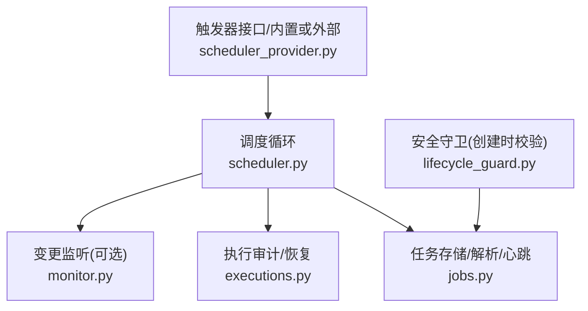
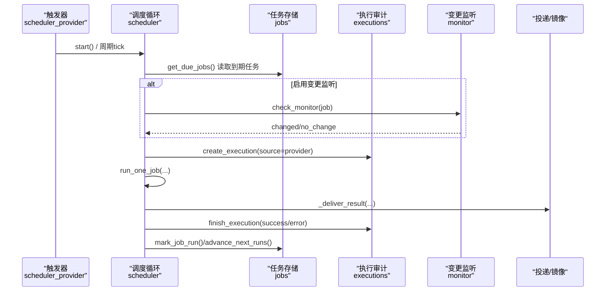
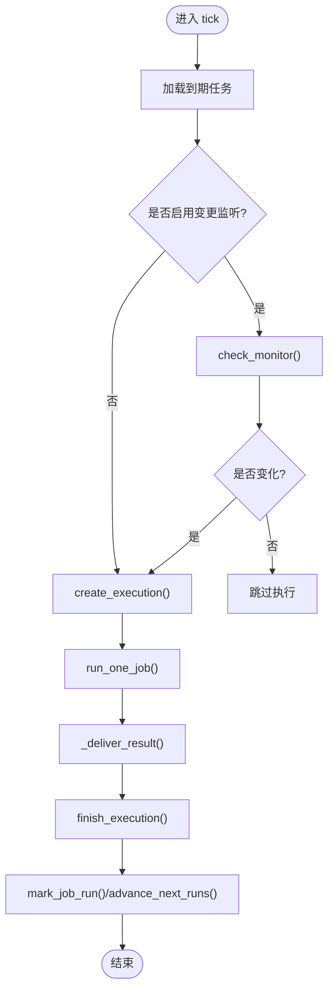
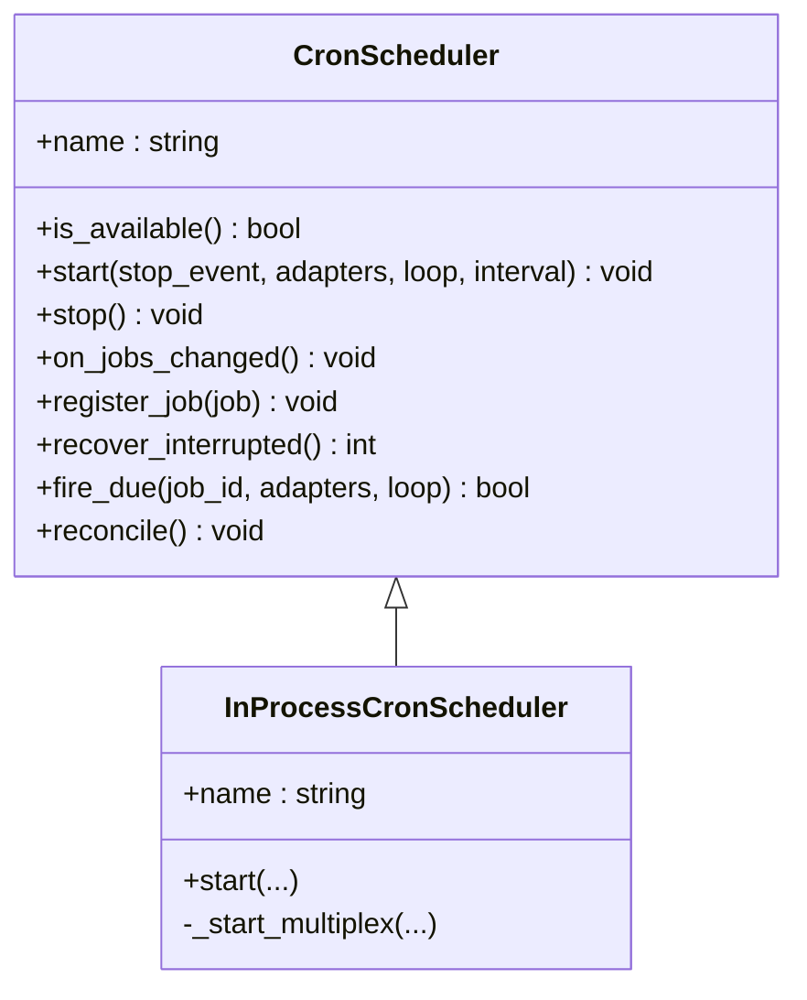
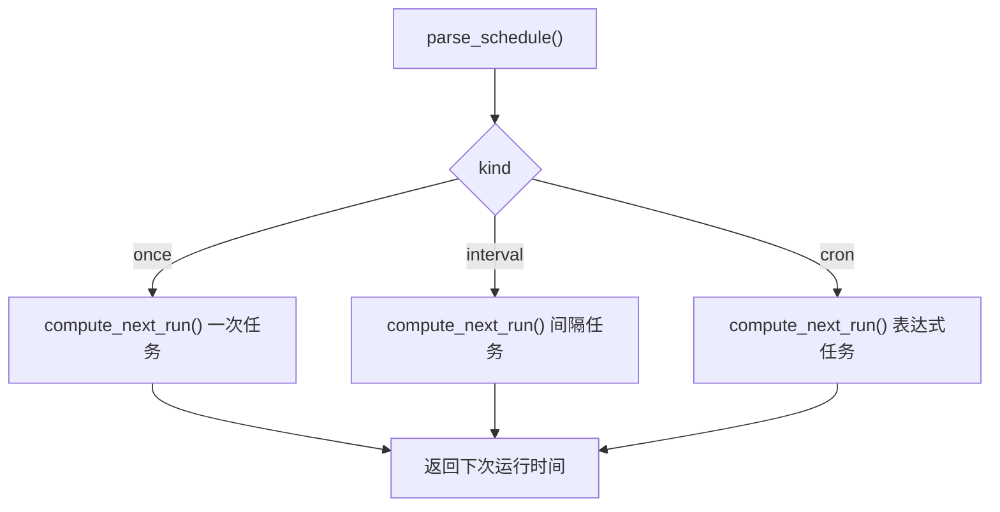
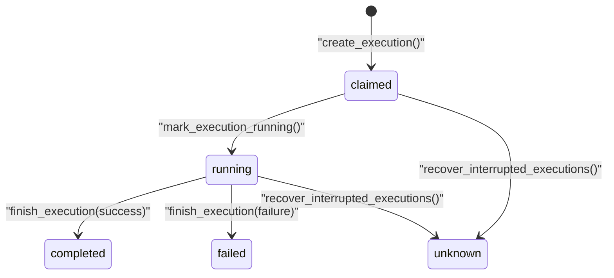
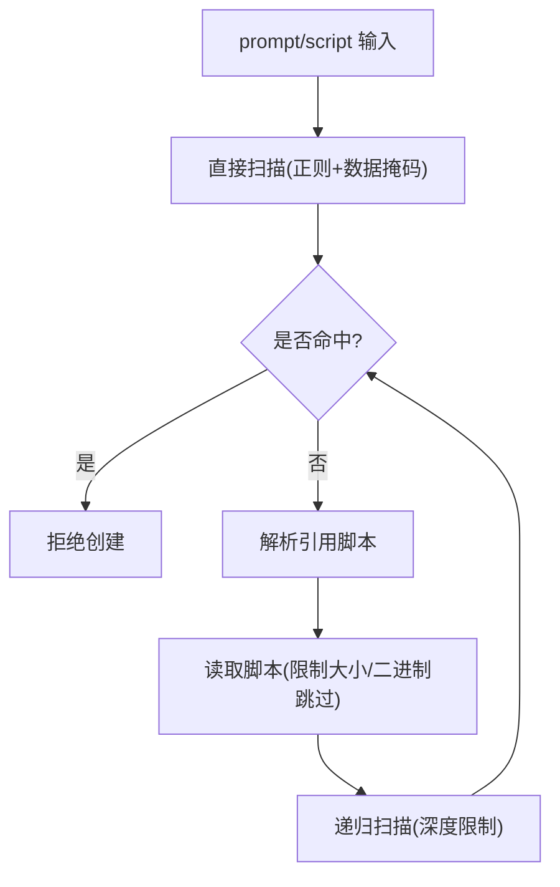
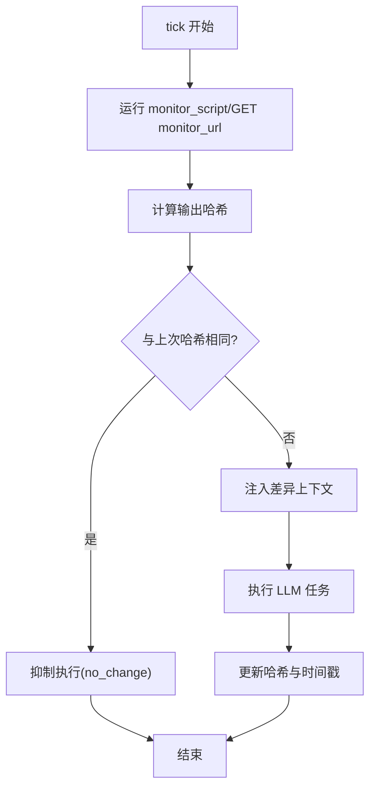
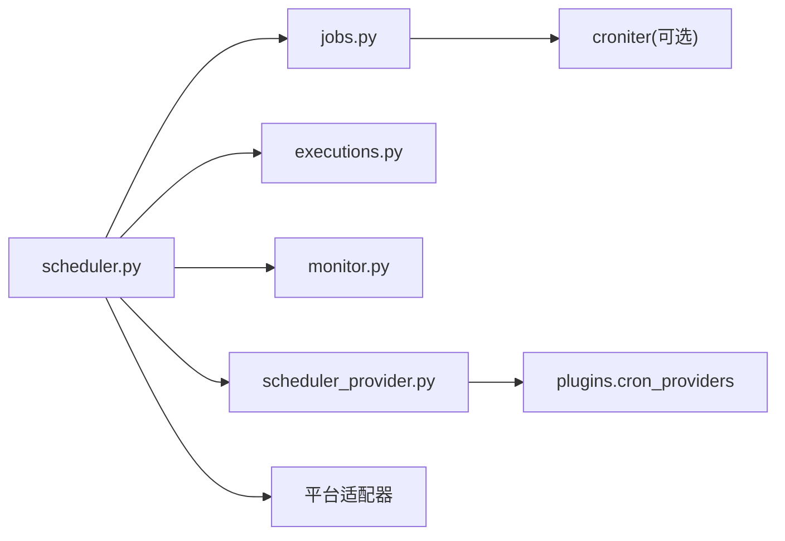

# 任务调度器

<cite>
**本文引用的文件**
- [cron/scheduler.py](file://cron/scheduler.py)
- [cron/scheduler_provider.py](file://cron/scheduler_provider.py)
- [cron/jobs.py](file://cron/jobs.py)
- [cron/executions.py](file://cron/executions.py)
- [cron/lifecycle_guard.py](file://cron/lifecycle_guard.py)
- [cron/monitor.py](file://cron/monitor.py)
</cite>

## 目录
1. [简介](#简介)
2. [项目结构](#项目结构)
3. [核心组件](#核心组件)
4. [架构总览](#架构总览)
5. [详细组件分析](#详细组件分析)
6. [依赖关系分析](#依赖关系分析)
7. [性能考量](#性能考量)
8. [故障排查指南](#故障排查指南)
9. [结论](#结论)
10. [附录](#附录)

## 简介
本文件面向 Hermes Agent 中的“任务调度器（Cron）”，系统性说明其核心架构、任务发现与调度、生命周期管理、并发执行策略、配置项、监控指标以及与外部调度系统的集成方式。文档以代码为依据，提供可视化图示与可操作的排障建议，帮助读者从入门到深入理解调度器的设计与实现。

## 项目结构
调度器由一组职责清晰的模块组成：
- 调度循环与执行编排：cron/scheduler.py
- 触发器抽象与内置/外部提供者：cron/scheduler_provider.py
- 任务存储、解析与心跳：cron/jobs.py
- 执行审计与恢复：cron/executions.py
- 安全守卫（阻止危险生命周期命令）：cron/lifecycle_guard.py
- 变更监听与增量触发：cron/monitor.py

图表来源
- [cron/scheduler.py:1-120](file://cron/scheduler.py#L1-L120)
- [cron/scheduler_provider.py:1-170](file://cron/scheduler_provider.py#L1-L170)
- [cron/jobs.py:60-120](file://cron/jobs.py#L60-L120)
- [cron/executions.py:1-60](file://cron/executions.py#L1-L60)
- [cron/lifecycle_guard.py:1-35](file://cron/lifecycle_guard.py#L1-L35)
- [cron/monitor.py:1-30](file://cron/monitor.py#L1-L30)

章节来源
- [cron/scheduler.py:1-120](file://cron/scheduler.py#L1-L120)
- [cron/scheduler_provider.py:1-170](file://cron/scheduler_provider.py#L1-L170)
- [cron/jobs.py:60-120](file://cron/jobs.py#L60-L120)
- [cron/executions.py:1-60](file://cron/executions.py#L1-L60)
- [cron/lifecycle_guard.py:1-35](file://cron/lifecycle_guard.py#L1-L35)
- [cron/monitor.py:1-30](file://cron/monitor.py#L1-L30)

## 核心组件
- 调度循环与执行编排（scheduler.py）
  - 周期性 tick：每 60 秒检查到期任务并分发执行；支持并行与顺序池隔离，避免阻塞 ticker 线程。
  - 运行集与中断保护：维护当前运行 job 集合，支持在网关关闭时标记中断，防止错误覆盖状态。
  - 工作目录隔离：通过读写锁保护进程级工作目录环境变量，避免跨任务污染。
  - 投递路由：支持本地、origin、home channel、all 等目标，自动扩展平台与线程 ID。
  - 静默输出识别：统一识别“静默”标记，避免无意义投递。
  - 使用审计：记录每次执行的 token 消耗日志。
- 触发器抽象（scheduler_provider.py）
  - 定义 CronScheduler 抽象：name、start、stop、is_available、on_jobs_changed、register_job、fire_due、reconcile。
  - 内置 InProcessCronScheduler：60s 轮询的守护线程模式，支持多 profile 复用。
  - 外部提供者：通过 cron.provider 配置加载插件，失败回退到内置。
- 任务存储与解析（jobs.py）
  - jobs.json 持久化与原子写入，跨进程文件锁保护。
  - 计划解析：once、interval、cron 表达式；时间带与时区处理；下次运行时间计算。
  - 心跳与存活信号：ticker_heartbeat、ticker_last_success、ticker_last_error。
  - 任务状态规范化与可用性判断。
- 执行审计与恢复（executions.py）
  - SQLite 执行账本：claimed → running → completed/failed/unknown。
  - 重启恢复：将不可恢复的执行标记为 unknown，避免重复重试。
  - 清理策略：限制终态记录数量，索引优化查询。
- 安全守卫（lifecycle_guard.py）
  - 创建时扫描 prompt/script，阻止直接/间接调用 gateway 生命周期命令（restart/stop/launchctl submit/bootstrap/systemctl/pkill）。
  - 对数据 sink 参数做掩码豁免，降低误报。
- 变更监听（monitor.py）
  - 基于 monitor_script/monitor_url 的输出哈希比较，仅当内容变化时才触发 LLM 执行。
  - 持久化上次输出与差异上下文，减少无效调用。

章节来源
- [cron/scheduler.py:330-470](file://cron/scheduler.py#L330-L470)
- [cron/scheduler_provider.py:27-170](file://cron/scheduler_provider.py#L27-L170)
- [cron/jobs.py:60-120](file://cron/jobs.py#L60-L120)
- [cron/executions.py:1-60](file://cron/executions.py#L1-L60)
- [cron/lifecycle_guard.py:1-35](file://cron/lifecycle_guard.py#L1-L35)
- [cron/monitor.py:1-30](file://cron/monitor.py#L1-L30)

## 架构总览
调度器采用“触发器 + 执行编排 + 存储 + 审计”的分层设计。触发器决定何时触发，执行编排负责构建任务上下文、并发执行、结果投递与镜像；存储负责任务定义与计划解析；审计提供可观测性与恢复能力；安全守卫在创建阶段阻断危险操作；变更监听按需触发以减少浪费。

图表来源
- [cron/scheduler_provider.py:172-271](file://cron/scheduler_provider.py#L172-L271)
- [cron/scheduler.py:330-470](file://cron/scheduler.py#L330-L470)
- [cron/jobs.py:820-880](file://cron/jobs.py#L820-L880)
- [cron/executions.py:135-196](file://cron/executions.py#L135-L196)
- [cron/monitor.py:147-194](file://cron/monitor.py#L147-L194)

## 详细组件分析

### 调度循环与执行编排（scheduler.py）
- 并发模型
  - 并行池：用于独立任务并行执行，避免长任务阻塞 ticker。
  - 顺序池：用于会修改进程全局环境的工作目录任务，保证串行执行。
  - 读写锁：保护 TERMINAL_CWD 环境变量，避免跨任务污染。
- 运行集与中断
  - 维护当前运行 job 集合，支持在网关关闭时批量标记中断，防止后续成功覆盖。
- 投递与镜像
  - 支持 deliver 字段的多目标解析与 all 路由扩展。
  - 可选将结果镜像到 origin 会话或 home channel，保持对话连续性。
- 静默与审计
  - 识别静默响应，避免无意义投递。
  - 记录每次执行的 token 审计日志。

图表来源
- [cron/scheduler.py:330-470](file://cron/scheduler.py#L330-L470)
- [cron/jobs.py:820-880](file://cron/jobs.py#L820-L880)
- [cron/executions.py:135-196](file://cron/executions.py#L135-L196)
- [cron/monitor.py:147-194](file://cron/monitor.py#L147-L194)

章节来源
- [cron/scheduler.py:330-470](file://cron/scheduler.py#L330-L470)
- [cron/scheduler.py:1200-1600](file://cron/scheduler.py#L1200-L1600)

### 触发器抽象与提供者（scheduler_provider.py）
- 抽象接口
  - name：标识提供者名称。
  - is_available：检测当前环境可用性。
  - start：启动触发循环或注册外部回调。
  - stop：优雅停止。
  - on_jobs_changed/register_job/reconcile/fire_due：外部调度系统钩子。
- 内置提供者
  - InProcessCronScheduler：60s 轮询，支持多 profile 复用，心跳与错误记录。
- 外部提供者
  - 通过 cron.provider 配置加载插件，失败回退到内置，确保调度不中断。

图表来源
- [cron/scheduler_provider.py:27-170](file://cron/scheduler_provider.py#L27-L170)
- [cron/scheduler_provider.py:172-368](file://cron/scheduler_provider.py#L172-L368)

章节来源
- [cron/scheduler_provider.py:27-170](file://cron/scheduler_provider.py#L27-L170)
- [cron/scheduler_provider.py:172-368](file://cron/scheduler_provider.py#L172-L368)

### 任务存储与计划解析（jobs.py）
- 存储与并发
  - jobs.json 原子写入，跨进程文件锁保护，超时降级为进程内锁。
  - 心跳文件：ticker_heartbeat、ticker_last_success、ticker_last_error。
- 计划解析
  - once：一次性任务，支持宽限窗口。
  - interval：固定间隔。
  - cron：表达式解析，依赖 croniter。
  - 时间带与时区：统一转换为 Hermes 配置时区。
- 状态与可用性
  - effective_job_state：根据 enabled 与暂停标记推导显示状态。
  - is_job_runnable：调度器是否允许触发。

图表来源
- [cron/jobs.py:591-710](file://cron/jobs.py#L591-L710)
- [cron/jobs.py:820-880](file://cron/jobs.py#L820-L880)
- [cron/jobs.py:886-1055](file://cron/jobs.py#L886-L1055)

章节来源
- [cron/jobs.py:60-120](file://cron/jobs.py#L60-L120)
- [cron/jobs.py:591-710](file://cron/jobs.py#L591-L710)
- [cron/jobs.py:820-880](file://cron/jobs.py#L820-L880)
- [cron/jobs.py:886-1055](file://cron/jobs.py#L886-L1055)

### 执行审计与恢复（executions.py）
- 执行账本
  - 表结构：id、job_id、source、process_id、pid、status、claimed_at、started_at、finished_at、error。
  - 事务封装：连接、提交/回滚、关闭。
- 状态转换
  - create_execution：记录 claimed。
  - mark_execution_running：转为 running。
  - finish_execution：完成或失败，清理旧记录。
- 恢复策略
  - recover_interrupted_executions：将 owner 进程已退出且无法证明完成的执行标记为 unknown。

图表来源
- [cron/executions.py:27-63](file://cron/executions.py#L27-L63)
- [cron/executions.py:135-196](file://cron/executions.py#L135-L196)
- [cron/executions.py:199-233](file://cron/executions.py#L199-L233)

章节来源
- [cron/executions.py:27-63](file://cron/executions.py#L27-L63)
- [cron/executions.py:135-196](file://cron/executions.py#L135-L196)
- [cron/executions.py:199-233](file://cron/executions.py#L199-L233)

### 安全守卫（lifecycle_guard.py）
- 创建时扫描
  - 阻止 prompt/script 中直接/间接调用 gateway 生命周期命令（restart/stop/launchctl submit/bootstrap/systemctl/pkill）。
  - 对数据 sink 参数进行掩码豁免，降低误报。
- 脚本引用递归扫描
  - 解析 shell 命令片段，递归读取引用的脚本，限制深度与大小，二进制文件跳过。
- 异常安全
  - 扫描过程任何异常均被捕获，回退到纯字符串匹配，确保守卫不会崩溃。

图表来源
- [cron/lifecycle_guard.py:49-104](file://cron/lifecycle_guard.py#L49-L104)
- [cron/lifecycle_guard.py:154-210](file://cron/lifecycle_guard.py#L154-L210)
- [cron/lifecycle_guard.py:301-363](file://cron/lifecycle_guard.py#L301-L363)
- [cron/lifecycle_guard.py:504-564](file://cron/lifecycle_guard.py#L504-L564)
- [cron/lifecycle_guard.py:665-715](file://cron/lifecycle_guard.py#L665-L715)

章节来源
- [cron/lifecycle_guard.py:49-104](file://cron/lifecycle_guard.py#L49-L104)
- [cron/lifecycle_guard.py:154-210](file://cron/lifecycle_guard.py#L154-L210)
- [cron/lifecycle_guard.py:301-363](file://cron/lifecycle_guard.py#L301-L363)
- [cron/lifecycle_guard.py:504-564](file://cron/lifecycle_guard.py#L504-L564)
- [cron/lifecycle_guard.py:665-715](file://cron/lifecycle_guard.py#L665-L715)

### 变更监听（monitor.py）
- 机制
  - 每次 tick 先运行 monitor_script 或 GET monitor_url，计算输出哈希并与上次比较。
  - 未变化则抑制 LLM 执行，记录 silent no_change。
  - 变化则注入差异上下文与当前输出，触发正常执行。
- 持久化
  - 保存 last_output_hash 与 last_changed_at 到 jobs.json。
  - 保存上次输出文本用于生成差异。

图表来源
- [cron/monitor.py:1-30](file://cron/monitor.py#L1-L30)
- [cron/monitor.py:147-194](file://cron/monitor.py#L147-L194)
- [cron/monitor.py:197-213](file://cron/monitor.py#L197-L213)

章节来源
- [cron/monitor.py:1-30](file://cron/monitor.py#L1-L30)
- [cron/monitor.py:147-194](file://cron/monitor.py#L147-L194)
- [cron/monitor.py:197-213](file://cron/monitor.py#L197-L213)

## 依赖关系分析
- 模块耦合
  - scheduler 依赖 jobs（任务存储）、executions（执行审计）、monitor（变更监听）、scheduler_provider（触发器）。
  - lifecycle_guard 在任务创建路径上拦截危险命令，保障安全边界。
- 外部依赖
  - croniter：用于 cron 表达式解析。
  - 平台适配器：用于消息投递与镜像。
  - 插件系统：用于外部调度提供者加载。

图表来源
- [cron/scheduler.py:1-120](file://cron/scheduler.py#L1-L120)
- [cron/scheduler_provider.py:132-170](file://cron/scheduler_provider.py#L132-L170)
- [cron/jobs.py:44-63](file://cron/jobs.py#L44-L63)

章节来源
- [cron/scheduler.py:1-120](file://cron/scheduler.py#L1-L120)
- [cron/scheduler_provider.py:132-170](file://cron/scheduler_provider.py#L132-L170)
- [cron/jobs.py:44-63](file://cron/jobs.py#L44-L63)

## 性能考量
- 并发与隔离
  - 并行池提高吞吐，顺序池保证环境一致性；读写锁避免工作目录污染。
- I/O 与锁
  - 跨进程文件锁带超时，避免死锁；原子写入减少竞争。
- 资源控制
  - 变更监听减少不必要的 LLM 调用；最大深度与大小限制防止脚本扫描开销。
- 监控与可观测性
  - 心跳与成功/错误文件便于快速定位问题；执行账本提供历史追踪。

[本节为通用指导，无需特定文件来源]

## 故障排查指南
- 心跳与错误
  - 检查 ticker_heartbeat、ticker_last_success、ticker_last_error 文件，确认调度器是否存活与最近一次成功时间。
- 锁争用
  - 若 jobs.json 写入频繁，关注跨进程锁超时日志，必要时调整负载或检查其他进程占用。
- 执行中断
  - 查看 executions.db 中 claimed/running/unknown 状态，结合进程 PID 与启动时间判断是否恢复。
- 安全拦截
  - 若任务创建被拒绝，检查 prompt/script 是否包含受保护的生命周期命令或引用了危险脚本。
- 变更监听失效
  - 确认 monitor_script/monitor_url 输出稳定；检查 last_output_hash 与 last_changed_at 是否更新。

章节来源
- [cron/jobs.py:886-1055](file://cron/jobs.py#L886-L1055)
- [cron/executions.py:199-233](file://cron/executions.py#L199-L233)
- [cron/lifecycle_guard.py:665-715](file://cron/lifecycle_guard.py#L665-L715)
- [cron/monitor.py:147-194](file://cron/monitor.py#L147-L194)

## 结论
Hermes 的任务调度器通过清晰的模块化设计实现了高可靠、可扩展的定时任务执行体系。内置触发器满足大多数场景，外部提供者支持规模化与零实例部署；变更监听与安全守卫进一步提升了效率与安全性。配合心跳与执行账本，运维人员可以快速定位问题并进行恢复。

[本节为总结，无需特定文件来源]

## 附录
- 配置选项
  - cron.provider：选择触发器提供者（空或 builtin/in-process/inprocess 使用内置）。
  - cron.mirror_delivery：是否将投递结果镜像到 origin 会话。
  - HERMES_CRON_TIMEOUT：任务不活跃超时，影响工作目录锁等待上限与 one-shot 恢复 TTL。
- 监控指标
  - ticker_heartbeat：调度器心跳。
  - ticker_last_success：最近一次成功 tick。
  - ticker_last_error：最近一次 tick 错误信息。
  - catch_up_occurrences：错过计划的追赶次数。
  - executions.db：执行历史与状态。
- 扩展点
  - 外部调度提供者：实现 CronScheduler 接口，注册到 plugins/cron_providers/<name>/。
  - 平台投递：通过 deliver 字段与 all 路由扩展目标。
  - 变更监听：通过 monitor_script/monitor_url 接入自定义源。

[本节为补充信息，无需特定文件来源]