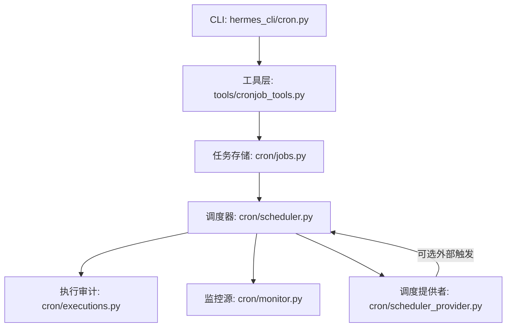
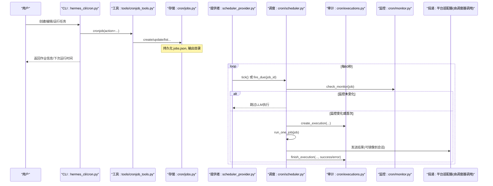
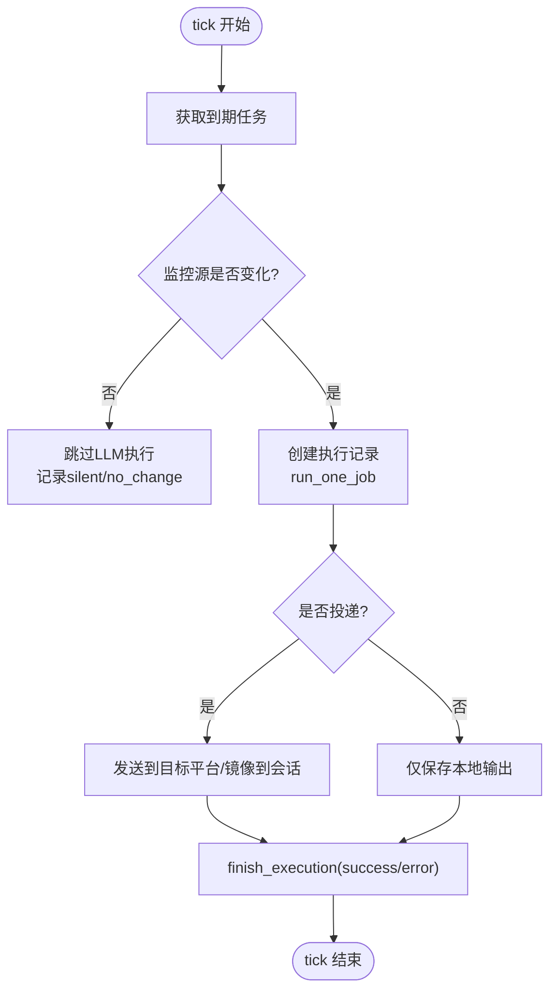
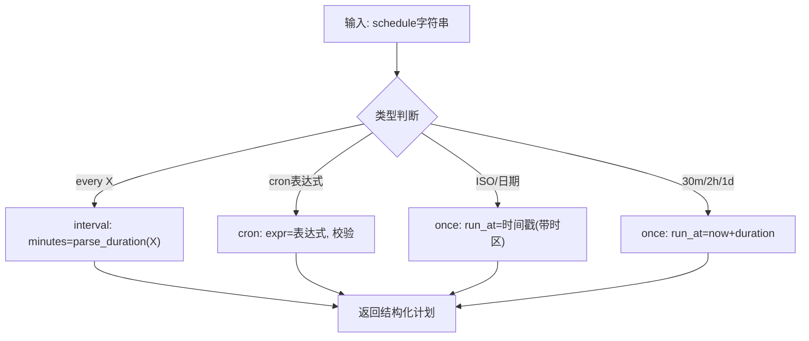
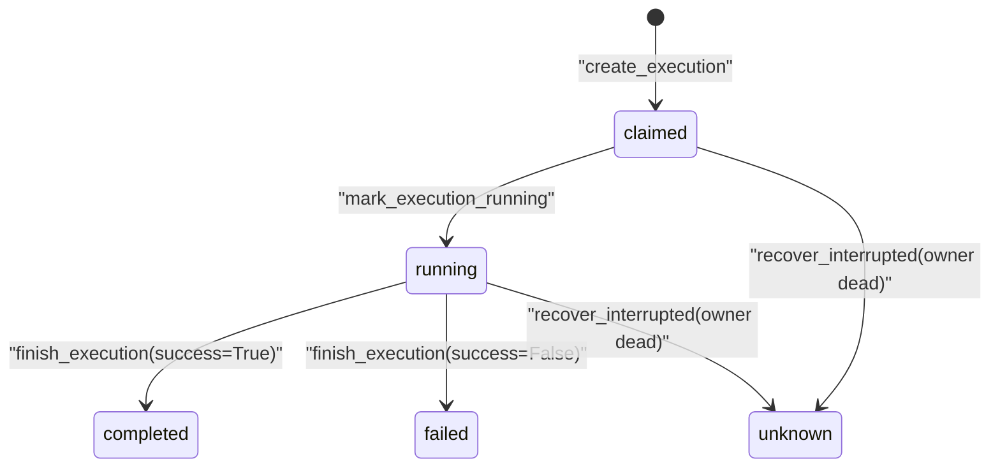
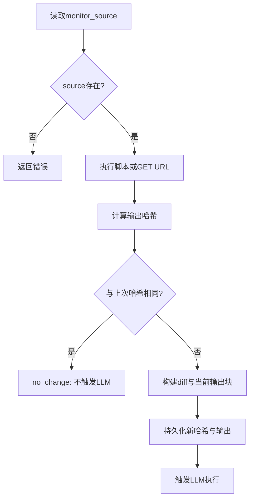
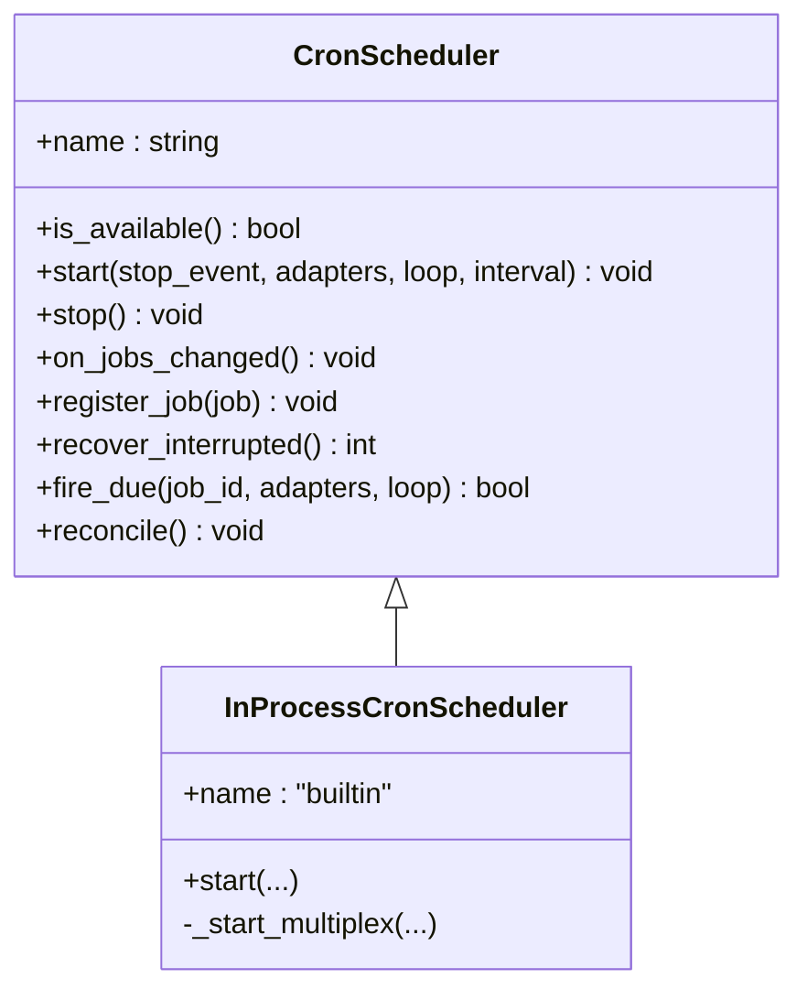
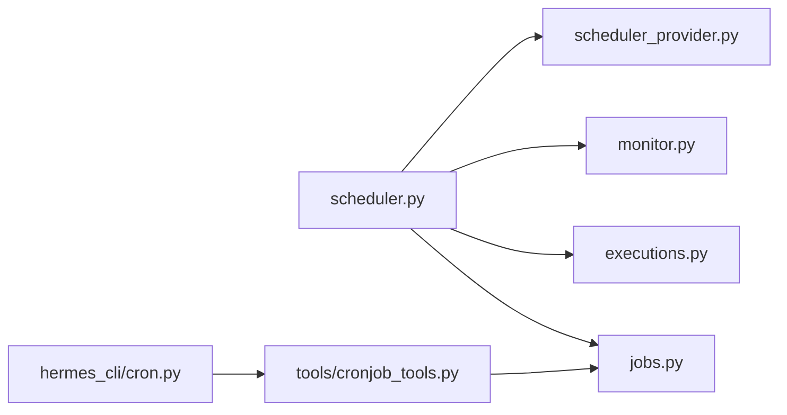

# 定时任务调度

<cite>
**本文引用的文件**
- [scheduler.py](file://cron/scheduler.py)
- [jobs.py](file://cron/jobs.py)
- [executions.py](file://cron/executions.py)
- [monitor.py](file://cron/monitor.py)
- [scheduler_provider.py](file://cron/scheduler_provider.py)
- [cron.py](file://hermes_cli/cron.py)
- [cronjob_tools.py](file://tools/cronjob_tools.py)
</cite>

## 目录
1. [简介](#简介)
2. [项目结构](#项目结构)
3. [核心组件](#核心组件)
4. [架构总览](#架构总览)
5. [详细组件分析](#详细组件分析)
6. [依赖关系分析](#依赖关系分析)
7. [性能与并发特性](#性能与并发特性)
8. [故障诊断与排错](#故障诊断与排错)
9. [结论](#结论)
10. [附录：配置示例与最佳实践](#附录配置示例与最佳实践)

## 简介
本系统提供“定时任务调度”的完整能力，支持将日常任务（如日报、备份、审计）以自然语言描述的方式定义并自动执行；通过平台投递机制将结果发送到聊天或消息平台；并提供监控仪表板与日志记录、失败重试、优先级管理、环境隔离与安全限制等生产级保障。调度器内置 60 秒轮询 tick 循环，也可通过外部调度提供者（如 Chronos）触发；所有执行尝试均持久化到 SQLite 审计账本，便于追踪与恢复。

## 项目结构
围绕 cron 子系统的核心代码分布在以下模块中：
- 调度与执行编排：cron/scheduler.py
- 任务存储与解析：cron/jobs.py
- 执行审计账本：cron/executions.py
- 变更监控源：cron/monitor.py
- 调度提供者抽象与内置实现：cron/scheduler_provider.py
- CLI 命令入口：hermes_cli/cron.py
- 模型工具与即时运行：tools/cronjob_tools.py

图表来源
- [scheduler.py:1-120](file://cron/scheduler.py#L1-L120)
- [jobs.py:1-120](file://cron/jobs.py#L1-L120)
- [executions.py:1-120](file://cron/executions.py#L1-L120)
- [monitor.py:1-120](file://cron/monitor.py#L1-L120)
- [scheduler_provider.py:1-120](file://cron/scheduler_provider.py#L1-L120)
- [cron.py:1-120](file://hermes_cli/cron.py#L1-L120)
- [cronjob_tools.py:1-120](file://tools/cronjob_tools.py#L1-L120)

章节来源
- [scheduler.py:1-120](file://cron/scheduler.py#L1-L120)
- [jobs.py:1-120](file://cron/jobs.py#L1-L120)
- [executions.py:1-120](file://cron/executions.py#L1-L120)
- [monitor.py:1-120](file://cron/monitor.py#L1-L120)
- [scheduler_provider.py:1-120](file://cron/scheduler_provider.py#L1-L120)
- [cron.py:1-120](file://hermes_cli/cron.py#L1-L120)
- [cronjob_tools.py:1-120](file://tools/cronjob_tools.py#L1-L120)

## 核心组件
- 调度器（scheduler.py）
  - 负责每 60 秒 tick 检查到期任务、并行/串行执行、输出保存、投递、静默标记处理、中断保护、工作目录隔离、工具集白名单合并、使用审计日志写入等。
- 任务存储（jobs.py）
  - 维护 jobs.json 与输出目录，提供任务创建、更新、暂停/恢复、删除、查询、计划解析（一次性/间隔/cron/时间戳）、状态推导、跨进程锁、安全路径校验等。
- 执行审计（executions.py）
  - 基于 SQLite 的记录表，记录每次执行的生命周期（claimed→running→completed/failed/unknown），支持中断恢复、最近执行查询与裁剪。
- 监控源（monitor.py）
  - 对脚本或 URL 的输出进行哈希对比，仅在变化时注入上下文块并触发 LLM 执行，减少无效调用。
- 调度提供者（scheduler_provider.py）
  - 抽象 CronScheduler 接口，内置 InProcessCronScheduler 提供 60s 轮询；支持外部 provider 通过 fire_due/reconcile 钩子接入。
- CLI（hermes_cli/cron.py）
  - 提供 list/status/tick/run/pause/resume/create/edit/remove/notepad 等命令，集成健康提示与作业摘要。
- 工具层（tools/cronjob_tools.py）
  - 暴露统一 cronjob 工具，封装创建/更新/立即运行/历史查看等；包含严格的提示词扫描与安全校验。

章节来源
- [scheduler.py:1-200](file://cron/scheduler.py#L1-L200)
- [jobs.py:1-200](file://cron/jobs.py#L1-L200)
- [executions.py:1-200](file://cron/executions.py#L1-L200)
- [monitor.py:1-200](file://cron/monitor.py#L1-L200)
- [scheduler_provider.py:1-200](file://cron/scheduler_provider.py#L1-L200)
- [cron.py:1-200](file://hermes_cli/cron.py#L1-L200)
- [cronjob_tools.py:1-200](file://tools/cronjob_tools.py#L1-L200)

## 架构总览
下图展示从 CLI/工具到调度、执行、投递与监控的整体流程。

图表来源
- [scheduler_provider.py:172-270](file://cron/scheduler_provider.py#L172-L270)
- [scheduler.py:1-200](file://cron/scheduler.py#L1-L200)
- [jobs.py:1-200](file://cron/jobs.py#L1-L200)
- [executions.py:135-196](file://cron/executions.py#L135-L196)
- [monitor.py:147-194](file://cron/monitor.py#L147-L194)

## 详细组件分析

### 调度器（scheduler.py）
- 职责
  - 每 60 秒 tick，查找到期任务，提交到线程池并行执行；对会修改进程全局状态的任务走单线程队列保证顺序。
  - 构建任务提示词并进行注入扫描；根据 deliver 策略投递结果；支持 [SILENT] 静默输出抑制。
  - 工作目录隔离：通过读写锁保护 TERMINAL_CWD 覆盖，避免多任务互相污染。
  - 工具集白名单：按 job 级别与平台配置合并 MCP 服务器，禁用敏感工具集。
  - 失败摘要：为投递生成简洁错误消息，避免泄露冗长堆栈。
  - 中断保护：在网关关闭时标记进行中任务为 interrupted，防止误报成功。
- 关键流程
  - 获取到期任务 → 监控源检测 → 创建执行记录 → 执行任务 → 保存输出 → 投递结果 → 更新 last_status/last_run_at。

图表来源
- [scheduler.py:1-200](file://cron/scheduler.py#L1-L200)
- [monitor.py:147-194](file://cron/monitor.py#L147-L194)
- [executions.py:135-196](file://cron/executions.py#L135-L196)

章节来源
- [scheduler.py:1-200](file://cron/scheduler.py#L1-L200)

### 任务存储与计划解析（jobs.py）
- 存储与并发
  - jobs.json 作为任务清单，配合 .jobs.lock 文件锁与进程内 RLock，确保跨进程安全。
  - 输出目录按 job_id 隔离，并对非法 ID 做路径逃逸防护。
- 计划解析
  - 支持四种形式：一次性（duration/ISO timestamp）、间隔（every X）、cron 表达式、时间戳。
  - 对 cron 表达式使用 croniter 校验；对 naive 时间戳按 Hermes 配置时区规范化。
- 状态推导
  - effective_job_state 综合 enabled、paused_at、terminal states 推导显示状态，避免“半暂停”误导。

图表来源
- [jobs.py:591-709](file://cron/jobs.py#L591-L709)

章节来源
- [jobs.py:1-200](file://cron/jobs.py#L1-L200)
- [jobs.py:591-709](file://cron/jobs.py#L591-L709)

### 执行审计（executions.py）
- 设计要点
  - 使用 SQLite 表 executions 记录每次尝试的状态机流转（claimed→running→completed/failed/unknown）。
  - 支持中断恢复：当所有者进程已退出且无法证明存活，则标记 unknown。
  - 限制终端状态条目数量，定期裁剪。
- 查询接口
  - list_executions、latest_execution、latest_executions 用于仪表盘与 CLI 展示。

图表来源
- [executions.py:32-63](file://cron/executions.py#L32-L63)
- [executions.py:135-196](file://cron/executions.py#L135-L196)
- [executions.py:199-233](file://cron/executions.py#L199-L233)

章节来源
- [executions.py:1-233](file://cron/executions.py#L1-L233)

### 监控源（monitor.py）
- 功能
  - 支持 monitor_script 或 monitor_url 两种来源；对输出进行精确字节哈希比较。
  - 若未变化则跳过 LLM 执行；若变化则注入“差异块 + 当前输出”到提示词。
  - 持久化上次输出文本与哈希，失败不改变状态。
- 约束
  - URL 请求有超时与大小限制；diff 与输出长度有上限，避免过大上下文。

图表来源
- [monitor.py:111-140](file://cron/monitor.py#L111-L140)
- [monitor.py:147-194](file://cron/monitor.py#L147-L194)

章节来源
- [monitor.py:1-213](file://cron/monitor.py#L1-L213)

### 调度提供者（scheduler_provider.py）
- 抽象与内置
  - CronScheduler 抽象 name/start/stop/is_available；内置 InProcessCronScheduler 启动 60s 循环 tick。
  - 支持 multiplex_profiles：为多个 profile 分别 tick 并独立心跳/错误记录。
- 外部提供者
  - 通过 fire_due 接收外部触发，claim_job_for_fire 保证最多一次执行；reconcile 同步远端注册表。

图表来源
- [scheduler_provider.py:27-130](file://cron/scheduler_provider.py#L27-L130)
- [scheduler_provider.py:172-368](file://cron/scheduler_provider.py#L172-L368)

章节来源
- [scheduler_provider.py:1-368](file://cron/scheduler_provider.py#L1-L368)

### CLI 与工具层（hermes_cli/cron.py, tools/cronjob_tools.py）
- CLI
  - 提供 list/status/tick/run/pause/resume/create/edit/remove/notepad 等命令；status 会检测 ticker 心跳与最后成功时间，给出健康提示。
- 工具层
  - 统一 cronjob 工具封装创建/更新/立即运行；包含严格的安全扫描（提示词注入、不可见字符、外泄模式）与脚本路径校验。
  - 支持 origin 捕获以便投递回原会话；支持 deliver="origin"/"local"/平台名组合。

章节来源
- [cron.py:1-200](file://hermes_cli/cron.py#L1-L200)
- [cronjob_tools.py:1-200](file://tools/cronjob_tools.py#L1-L200)

## 依赖关系分析
- 模块耦合
  - scheduler 依赖 jobs（任务列表/状态）、executions（执行记录）、monitor（变更检测）、scheduler_provider（触发方式）。
  - jobs 提供跨进程锁与路径安全；executions 提供持久化审计；monitor 提供轻量前置过滤。
- 外部依赖
  - croniter（可选，解析 cron 表达式）；SQLite（执行审计）；平台适配器（投递）。
- 潜在风险
  - 跨进程锁不可用时降级为进程内锁；需关注长时间阻塞场景（已设置超时与告警）。

图表来源
- [scheduler.py:1-200](file://cron/scheduler.py#L1-L200)
- [jobs.py:1-200](file://cron/jobs.py#L1-L200)
- [executions.py:1-200](file://cron/executions.py#L1-L200)
- [monitor.py:1-200](file://cron/monitor.py#L1-L200)
- [scheduler_provider.py:1-200](file://cron/scheduler_provider.py#L1-L200)
- [cron.py:1-200](file://hermes_cli/cron.py#L1-L200)
- [cronjob_tools.py:1-200](file://tools/cronjob_tools.py#L1-L200)

章节来源
- [scheduler.py:1-200](file://cron/scheduler.py#L1-L200)
- [jobs.py:1-200](file://cron/jobs.py#L1-L200)
- [executions.py:1-200](file://cron/executions.py#L1-L200)
- [monitor.py:1-200](file://cron/monitor.py#L1-L200)
- [scheduler_provider.py:1-200](file://cron/scheduler_provider.py#L1-L200)
- [cron.py:1-200](file://hermes_cli/cron.py#L1-L200)
- [cronjob_tools.py:1-200](file://tools/cronjob_tools.py#L1-L200)

## 性能与并发特性
- 并发模型
  - 并行线程池执行普通任务；单线程队列执行可能修改进程全局状态的任务，避免环境变量污染。
  - 读写锁保护工作目录覆盖，写者优先，避免读者饥饿。
- 超时与限流
  - 默认 HERMES_CRON_TIMEOUT 控制任务不活跃超时；CWD 锁等待有下界与余量，避免无限等待。
  - 监控 URL 请求有限时与大小限制；diff 与输出截断控制上下文大小。
- 资源与隔离
  - 每个 profile 拥有独立的 cron 存储与执行环境；通过 use_cron_store 与 set_hermes_home_override 实现多 profile 复用同一进程。
  - 工具集白名单与禁用集合，防止敏感工具被滥用。

[本节为通用性能讨论，无需具体文件引用]

## 故障诊断与排错
- 常见症状与定位
  - 任务不触发：检查 gateway 是否运行、ticker 心跳与最后成功时间；CLI status 会给出明确提示。
  - 任务失败：查看 executions 记录与 last_error；delivery 失败会有 last_delivery_error。
  - 权限问题：jobs.json 被 root 重写导致权限丢失，CLI status 会提示修复建议。
- 诊断步骤
  - 使用 hermes cron status 查看提供者、心跳、错误原因与活动作业摘要。
  - 使用 hermes cron runs 查看最近执行历史与错误详情。
  - 检查 cron output 目录下的任务输出与监控快照。
  - 对于外部 provider，确认 fire_due 回调与 reconcile 是否正常。

章节来源
- [cron.py:227-342](file://hermes_cli/cron.py#L227-L342)
- [executions.py:199-233](file://cron/executions.py#L199-L233)
- [scheduler.py:397-461](file://cron/scheduler.py#L397-L461)

## 结论
该定时任务调度系统提供了从任务定义、计划解析、执行编排、监控前置、投递通知到审计记录的完整闭环。通过内置 60s tick 与外部 provider 双模式，满足单机与规模化部署需求；通过严格的提示词扫描、脚本路径校验、工具集白名单与工作目录隔离，保障安全性；通过执行审计与 CLI 诊断能力，提升可观测性与可维护性。结合监控源与静默标记，可在高频场景中显著降低无效 LLM 调用成本。

[本节为总结，无需具体文件引用]

## 附录：配置示例与最佳实践

- 任务定义语法
  - 一次性：duration（如 30m/2h/1d）或 ISO 时间戳（如 2026-02-03T14:00:00）
  - 间隔：every 30m / every 2h
  - cron 表达式：0 9 * * *（需要 croniter）
  - 参考解析逻辑与错误提示
    - 章节来源
      - [jobs.py:591-709](file://cron/jobs.py#L591-L709)

- 自然语言任务描述与自动执行
  - 使用 CLI 或 chat 中的 cronjob 工具创建任务，prompt 字段用自然语言描述任务意图；系统会在 tick 时构建提示词并执行。
  - 可通过 skills 增强能力；注意技能内容在安装时已扫描，运行时会对组装后的提示词进行宽松扫描。
  - 章节来源
    - [cronjob_tools.py:260-313](file://tools/cronjob_tools.py#L260-L313)

- 平台投递与通知
  - deliver 支持 local、origin 或具体平台名（如 telegram/slack/discord 等），可逗号分隔组合。
  - 支持 attach_to_session 将结果镜像到原会话；mirror_delivery 全局开关可开启。
  - 章节来源
    - [scheduler.py:255-300](file://cron/scheduler.py#L255-L300)
    - [scheduler.py:757-800](file://cron/scheduler.py#L757-L800)

- 任务优先级与重复次数
  - repeat.times 控制最大执行次数；repeat.completed 跟踪已完成次数。
  - 通过 schedule 控制频率；高优先级任务可使用更短间隔或 cron 表达式。
  - 章节来源
    - [cron.py:127-133](file://hermes_cli/cron.py#L127-L133)

- 失败重试与审计
  - 执行记录进入 executions 表，支持 recover_interrupted 将未知状态标记为 unknown。
  - 失败时 finish_execution 写入 error；CLI runs 可查看最近失败详情。
  - 章节来源
    - [executions.py:135-196](file://cron/executions.py#L135-L196)
    - [executions.py:199-233](file://cron/executions.py#L199-L233)

- 日志记录与监控仪表板
  - 输出保存在 ~/.hermes/cron/output/{job_id}/{timestamp}.md；usage_audit.jsonl 记录 token 消耗。
  - CLI status 与 runs 提供健康与历史视图；可对接外部监控导出（如 OTLP）。
  - 章节来源
    - [scheduler.py:651-678](file://cron/scheduler.py#L651-L678)
    - [cron.py:227-342](file://hermes_cli/cron.py#L227-L342)

- 环境隔离与安全
  - 工作目录隔离：TERMINAL_CWD 通过读写锁保护，避免多任务互相污染。
  - 脚本路径限制：必须位于 ~/.hermes/scripts/ 相对路径，拒绝绝对路径与 ~ 展开。
  - 提示词扫描：严格阻止注入与外泄模式；组装后提示词进行宽松扫描并清理不可见字符。
  - 工具集白名单：禁用 cronjob/messaging/clarify/memory 等敏感工具集，并按平台配置合并 MCP。
  - 章节来源
    - [scheduler.py:167-253](file://cron/scheduler.py#L167-L253)
    - [scheduler.py:471-575](file://cron/scheduler.py#L471-L575)
    - [cronjob_tools.py:517-553](file://tools/cronjob_tools.py#L517-L553)
    - [cronjob_tools.py:260-313](file://tools/cronjob_tools.py#L260-L313)

- 完整配置示例（概念性说明）
  - 创建每日 9:00 的日报任务：schedule="0 9 * * *"，prompt 描述日报要求，deliver="telegram"，skills=["reporting"]。
  - 每小时备份数据库：schedule="every 1h"，script="backup.sh"，workdir="/path/to/app"，deliver="email"。
  - 审计变更监控：monitor_script="audit_check.sh"，prompt 描述审计规则，deliver="slack"。
  - 章节来源
    - [jobs.py:591-709](file://cron/jobs.py#L591-L709)
    - [monitor.py:111-140](file://cron/monitor.py#L111-L140)
    - [cronjob_tools.py:344-389](file://tools/cronjob_tools.py#L344-L389)

- 最佳实践
  - 使用 monitor 源减少无效 LLM 调用；保持输出稳定（排序、去除时间戳）。
  - 合理设置 HERMES_CRON_TIMEOUT 与 repeat.times，避免无限运行。
  - 使用 deliver="origin" 将结果回送到创建任务的会话；必要时开启 mirror_delivery。
  - 将脚本放入 ~/.hermes/scripts/ 并使用相对路径；避免绝对路径与 ~ 展开。
  - 定期检查 hermes cron status 与 runs，及时处理失败与权限问题。
  - 章节来源
    - [monitor.py:1-120](file://cron/monitor.py#L1-L120)
    - [cron.py:227-342](file://hermes_cli/cron.py#L227-L342)
    - [cronjob_tools.py:517-553](file://tools/cronjob_tools.py#L517-L553)