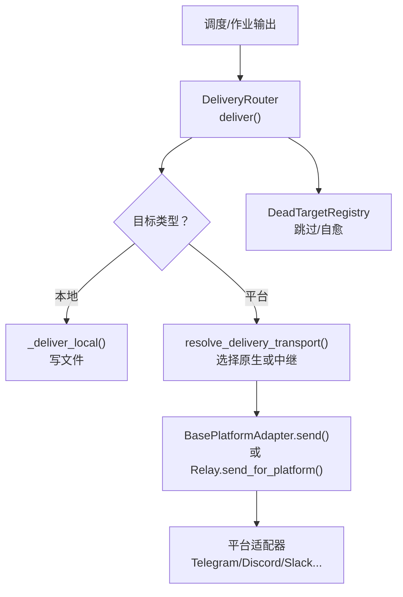
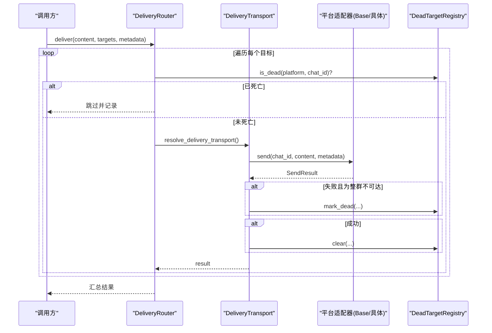
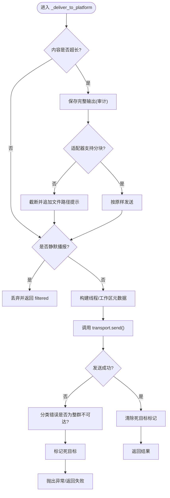
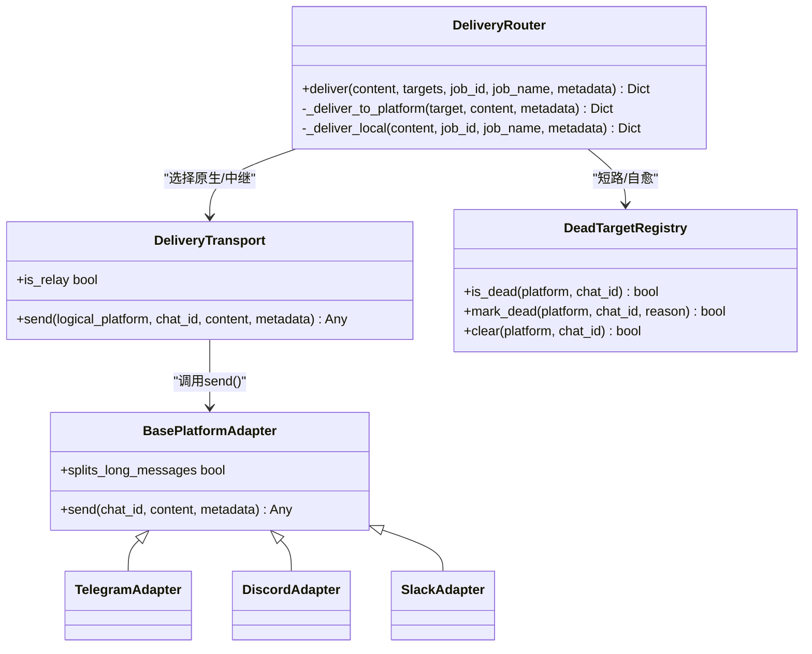

# 平台投递

<cite>
**本文引用的文件**
- [delivery.py](file://gateway/delivery.py)
- [base.py](file://gateway/platforms/base.py)
- [config.py](file://gateway/config.py)
- [dead_targets.py](file://gateway/dead_targets.py)
- [telegram_adapter.py](file://plugins/platforms/telegram/adapter.py)
- [discord_adapter.py](file://plugins/platforms/discord/adapter.py)
- [slack_adapter.py](file://plugins/platforms/slack/adapter.py)
- [test_adapter_connect_is_reconnect_contract.py](file://tests/gateway/test_adapter_connect_is_reconnect_contract.py)
</cite>

## 目录
1. [简介](#简介)
2. [项目结构](#项目结构)
3. [核心组件](#核心组件)
4. [架构总览](#架构总览)
5. [详细组件分析](#详细组件分析)
6. [依赖关系分析](#依赖关系分析)
7. [性能与容量特性](#性能与容量特性)
8. [故障排查指南](#故障排查指南)
9. [结论](#结论)
10. [附录：平台配置与差异](#附录：平台配置与差异)

## 简介
本文件面向“平台投递系统”，系统性说明任务执行结果如何被投递到多种消息平台（Telegram、Discord、Slack 等）。文档覆盖适配器架构、消息格式转换、投递策略、多平台同步与差异化处理、重试与失败处理、通知策略，以及各平台的特定格式化选项与高级能力。目标是帮助读者在不深入源码的情况下理解并正确使用该子系统。

## 项目结构
平台投递由网关层的路由与适配层共同实现：
- 路由与投递编排：位于 gateway/delivery.py，负责解析目标、裁剪超长输出、过滤静默播报、写入本地审计、调用具体平台适配器。
- 平台适配器基类与通用工具：位于 gateway/platforms/base.py，提供统一的发送接口、媒体类型判定、代理与网络安全、长度限制、TTS 辅助等。
- 平台实现：位于 plugins/platforms/*，如 Telegram、Discord、Slack 等各自实现 send()、连接、线程/话题路由、富文本渲染等。
- 配置与枚举：位于 gateway/config.py，定义 Platform 枚举、平台配置项、Home Channel 等。
- 死目标注册表：位于 gateway/dead_targets.py，记录已确认不可达的目标，避免重复投递浪费与日志噪音。

图示来源
- [delivery.py:318-391](file://gateway/delivery.py#L318-L391)
- [delivery.py:460-642](file://gateway/delivery.py#L460-L642)
- [base.py:153-173](file://gateway/platforms/base.py#L153-L173)
- [dead_targets.py:48-144](file://gateway/dead_targets.py#L48-L144)

章节来源
- [delivery.py:1-647](file://gateway/delivery.py#L1-L647)
- [base.py:1-800](file://gateway/platforms/base.py#L1-L800)
- [config.py:1-200](file://gateway/config.py#L1-L200)
- [dead_targets.py:1-144](file://gateway/dead_targets.py#L1-L144)

## 核心组件
- DeliveryRouter：统一入口，解析目标、裁剪超长内容、过滤静默播报、写入本地审计、调用平台适配器；维护死目标状态并在成功时自愈。
- DeliveryTransport：封装“原生适配器”或“中继适配器”的发送路径，保留逻辑平台上下文。
- BasePlatformAdapter：所有平台适配器的抽象基类，定义 send() 契约、媒体类型判定、代理与安全、长度限制、TTS 辅助等通用能力。
- DeadTargetRegistry：持久化记录“整群/整会话”不可达目标，避免重复投递；成功发送后自动清除标记。
- 平台适配器（Telegram/Discord/Slack）：实现平台特定的消息构造、富文本/块级 UI、线程/话题路由、附件/音视频投递、速率限制与错误分类。

章节来源
- [delivery.py:62-131](file://gateway/delivery.py#L62-L131)
- [delivery.py:294-391](file://gateway/delivery.py#L294-L391)
- [base.py:153-173](file://gateway/platforms/base.py#L153-L173)
- [dead_targets.py:48-144](file://gateway/dead_targets.py#L48-L144)

## 架构总览
平台投递采用“路由 + 适配器”的分层架构：
- 路由层（DeliveryRouter）负责跨平台通用的投递策略：目标解析、内容裁剪、静默播报过滤、本地审计保存、死目标短路、元数据注入（如 thread_id、scope_id）。
- 传输层（DeliveryTransport）根据配置选择原生适配器或中继适配器，保持逻辑平台语义。
- 适配层（BasePlatformAdapter 及各平台实现）负责将通用消息转换为平台协议，处理媒体、富文本、线程/话题、速率限制与错误分类。

图示来源
- [delivery.py:318-391](file://gateway/delivery.py#L318-L391)
- [delivery.py:460-642](file://gateway/delivery.py#L460-L642)
- [dead_targets.py:48-144](file://gateway/dead_targets.py#L48-L144)

## 详细组件分析

### 投递路由与策略（DeliveryRouter）
- 目标解析：支持 origin/local、platform、platform:chat_id、platform:chat_id:thread_id 等格式。
- 超长输出处理：超过阈值时先保存完整输出作为审计轨迹；对不支持分块的适配器进行截断并追加指向完整文件的提示。
- 静默播报过滤：识别无实质内容的“静音”文案，避免在机器人间形成回环。
- 线程/话题路由：为 Telegram 私聊主题、Slack 工作区范围等注入必要元数据；必要时创建或刷新私聊主题。
- 死目标短路：对已确认不可达的目标直接跳过，减少无效请求与日志噪音；成功后自愈。

图示来源
- [delivery.py:460-642](file://gateway/delivery.py#L460-L642)
- [delivery.py:43-55](file://gateway/delivery.py#L43-L55)
- [dead_targets.py:48-144](file://gateway/dead_targets.py#L48-L144)

章节来源
- [delivery.py:213-292](file://gateway/delivery.py#L213-L292)
- [delivery.py:318-391](file://gateway/delivery.py#L318-L391)
- [delivery.py:460-642](file://gateway/delivery.py#L460-L642)

### 平台适配器基类（BasePlatformAdapter）
- 发送契约：send(chat_id, content, metadata) 是所有平台必须实现的接口；通过 DeliveryTransport 统一调用。
- 媒体类型判定：should_send_media_as_audio 决定音频走“语音/音频”通道还是“文档”通道；针对 Telegram 做更严格的扩展名限制。
- 长度限制：utf16_len / _prefix_within_utf16_limit 用于满足平台字符限制（如 Telegram 的 UTF-16 计数）。
- 代理与安全：resolve_proxy_url、proxy_kwargs_*、_ssrf_redirect_guard 等确保网络访问安全与合规。
- TTS 辅助：build_auto_tts_output_path 为不同平台生成合适的音频容器后缀（ogg/mp3），配合流式 TTS 使用。

章节来源
- [base.py:153-173](file://gateway/platforms/base.py#L153-L173)
- [base.py:202-252](file://gateway/platforms/base.py#L202-L252)
- [base.py:417-516](file://gateway/platforms/base.py#L417-L516)
- [base.py:176-199](file://gateway/platforms/base.py#L176-L199)

### Telegram 适配器
- 特点：
  - 私聊主题（DM Topic）：支持命名主题创建与刷新，结合 reply anchor 保证回复可见性。
  - 音频/语音：严格区分 .mp3/.m4a 与 .ogg/.opus，分别走 sendAudio/sendVoice。
  - 初始化与超时保护：具备线程级超时与阻塞诊断，避免事件循环卡死导致重试停滞。
- 配置要点：
  - Home Channel、Bot Token、Proxy、Rate Limit、Thread/Topic 行为等通过配置文件与平台环境变量控制。
  - 可通过元数据注入 thread_id、direct_messages_topic_id、reply_to_message_id 等。

章节来源
- [telegram_adapter.py:1-200](file://plugins/platforms/telegram/adapter.py#L1-L200)
- [delivery.py:554-606](file://gateway/delivery.py#L554-L606)
- [base.py:153-173](file://gateway/platforms/base.py#L153-L173)

### Discord 适配器
- 特点：
  - 频道与线程：基于 discord.py 管理频道、线程与引用上下文。
  - Markdown 链接：对 URL 标签进行转义与包裹，避免预览冲突。
  - 图片下载与重定向防护：逐跳校验重定向目标，防止 SSRF。
- 配置要点：
  - Bot Token、Intents、Command Sync Policy、非对话消息标记等。
  - 可配置代理与速率限制策略。

章节来源
- [discord_adapter.py:1-200](file://plugins/platforms/discord/adapter.py#L1-L200)
- [base.py:417-516](file://gateway/platforms/base.py#L417-L516)

### Slack 适配器
- 特点：
  - Socket Mode：通过 slack-bolt 的异步 Socket Mode 接收与发送消息。
  - Block Kit：支持富交互块（按钮、选择器等），并提供渲染与清洗。
  - 表格对齐：对 GFM 表格进行列宽对齐与显示宽度计算，提升可读性。
  - 工作区范围：通过 scope_id 在多工作区环境下稳定路由。
- 配置要点：
  - Socket Mode Token、App Token、Channel/Thread、Block Kit 模板等。
  - 可配置代理、User-Agent 前缀、错误体大小限制等。

章节来源
- [slack_adapter.py:1-200](file://plugins/platforms/slack/adapter.py#L1-L200)
- [base.py:417-516](file://gateway/platforms/base.py#L417-L516)

### 连接与重连契约（is_reconnect）
- 所有平台适配器的 connect() 方法必须接受 is_reconnect 关键字参数，以便网关在重连时正确传递信号。测试通过 AST 静态检查确保契约一致性。

章节来源
- [test_adapter_connect_is_reconnect_contract.py:1-145](file://tests/gateway/test_adapter_connect_is_reconnect_contract.py#L1-L145)

## 依赖关系分析
- DeliveryRouter 依赖：
  - config.Platform 与 PlatformConfig：用于平台枚举与配置读取。
  - DeadTargetRegistry：用于死目标短路和自愈。
  - BasePlatformAdapter 及具体平台适配器：通过 DeliveryTransport 解耦。
- BasePlatformAdapter 依赖：
  - 网络与安全工具：代理解析、SSRF 防护、入站媒体大小限制。
  - 平台特定规则：音频/语音格式、UTF-16 长度限制、TTS 容器后缀。
- 平台适配器依赖：
  - 第三方 SDK（python-telegram-bot、discord.py、slack-bolt 等）。
  - 平台 API 约束（消息长度、附件大小、速率限制、线程/话题模型）。

图示来源
- [delivery.py:62-131](file://gateway/delivery.py#L62-L131)
- [delivery.py:294-391](file://gateway/delivery.py#L294-L391)
- [base.py:153-173](file://gateway/platforms/base.py#L153-L173)
- [dead_targets.py:48-144](file://gateway/dead_targets.py#L48-L144)

章节来源
- [delivery.py:62-131](file://gateway/delivery.py#L62-L131)
- [base.py:153-173](file://gateway/platforms/base.py#L153-L173)
- [dead_targets.py:48-144](file://gateway/dead_targets.py#L48-L144)

## 性能与容量特性
- 超长输出裁剪：对不支持分块的适配器进行截断，同时始终保存完整输出以供审计与回溯。
- 静默播报过滤：避免无意义消息在机器人之间形成回环，降低无效流量。
- 入站媒体大小限制：默认上限（可配置）防止恶意或超大上传导致内存溢出。
- 代理与网络优化：支持 SOCKS/HTTP 代理、NO_PROXY 匹配、macOS 系统代理检测，提高连通性与安全性。
- 线程/话题路由：精确注入 thread_id/scope_id，减少误路由与重试。

章节来源
- [delivery.py:23-29](file://gateway/delivery.py#L23-L29)
- [delivery.py:43-55](file://gateway/delivery.py#L43-L55)
- [base.py:722-800](file://gateway/platforms/base.py#L722-L800)
- [base.py:417-516](file://gateway/platforms/base.py#L417-L516)

## 故障排查指南
- 目标不可达：查看 DeadTargetRegistry 中记录的 platform:chat_id 条目，确认是否为整群/整会话不可达；若用户重新添加机器人或恢复群组，后续成功发送会自动清除标记。
- 发送失败：检查适配器返回的 error/error_kind，区分“整群不可达”与“线程/话题不存在”；后者通常由适配器自行修复（例如移除 reply_to）。
- 静默播报被过滤：若期望消息未送达，检查是否命中静默播报过滤；可在配置中关闭或调整过滤策略。
- 超长输出未完整送达：确认适配器是否支持分块；否则会在网关层截断并附带完整文件路径提示。
- 连接问题：验证代理配置与 NO_PROXY 匹配；检查平台 Token、权限与速率限制；关注 reconnection 契约是否满足（is_reconnect）。

章节来源
- [dead_targets.py:48-144](file://gateway/dead_targets.py#L48-L144)
- [delivery.py:460-642](file://gateway/delivery.py#L460-L642)
- [test_adapter_connect_is_reconnect_contract.py:1-145](file://tests/gateway/test_adapter_connect_is_reconnect_contract.py#L1-L145)

## 结论
平台投递系统通过清晰的分层与契约，实现了跨平台的一致投递体验：路由层负责通用策略与健壮性保障，适配层专注平台差异与协议细节。借助死目标短路、超长输出审计、静默播报过滤、代理与安全机制，系统在可靠性、可观测性与安全性方面具备良好表现。对于新增平台，遵循 BasePlatformAdapter 的 send() 契约与 is_reconnect 重连要求即可无缝接入。

## 附录：平台配置与差异
- Telegram
  - 私聊主题：支持命名主题创建与刷新，需配合 reply anchor 保证可见性。
  - 音频/语音：严格区分扩展名，.mp3/.m4a 走音频，.ogg/.opus 走语音。
  - 长度限制：按 UTF-16 单位计算，避免截断多字节字符。
- Discord
  - 频道/线程：基于 discord.py 管理；注意命令同步数量限制与速率限制。
  - 图片与重定向：逐跳校验，防止 SSRF。
- Slack
  - Socket Mode：推荐用于高并发与多工作区场景。
  - Block Kit：富交互块渲染与清洗；表格对齐提升可读性。
  - 工作区范围：通过 scope_id 稳定路由。

章节来源
- [delivery.py:554-606](file://gateway/delivery.py#L554-L606)
- [base.py:153-173](file://gateway/platforms/base.py#L153-L173)
- [base.py:202-252](file://gateway/platforms/base.py#L202-L252)
- [slack_adapter.py:1-200](file://plugins/platforms/slack/adapter.py#L1-L200)
- [discord_adapter.py:1-200](file://plugins/platforms/discord/adapter.py#L1-L200)
- [telegram_adapter.py:1-200](file://plugins/platforms/telegram/adapter.py#L1-L200)