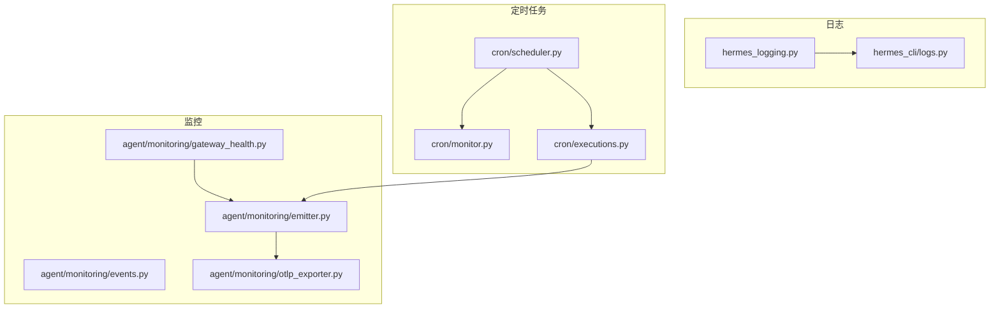
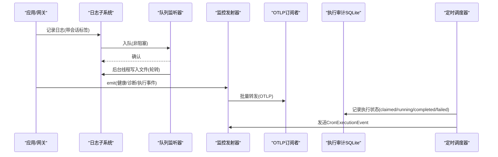
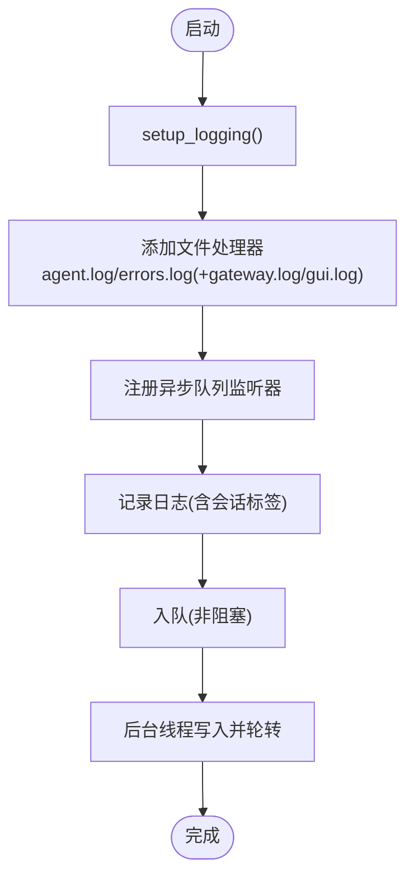
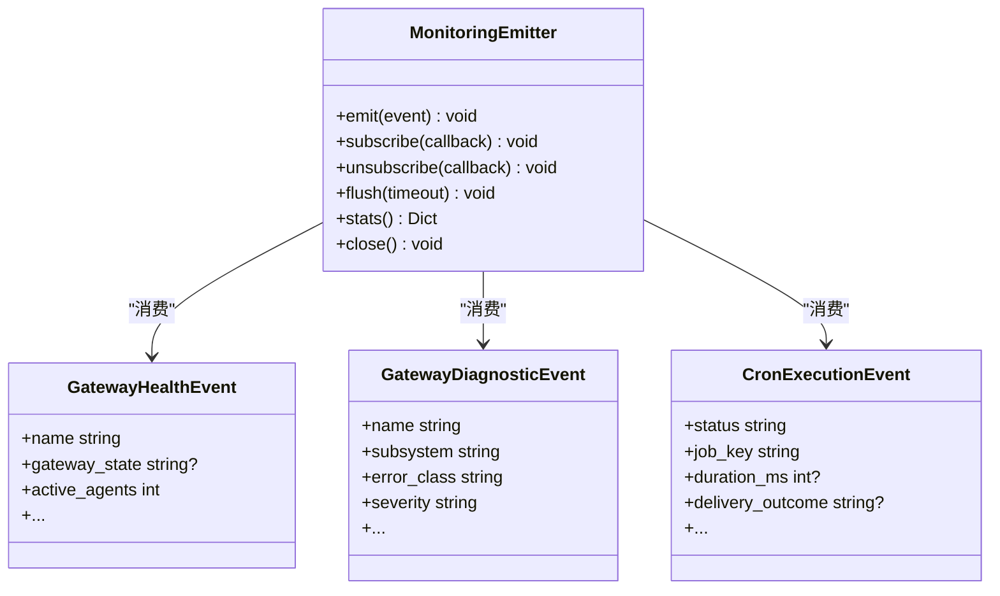
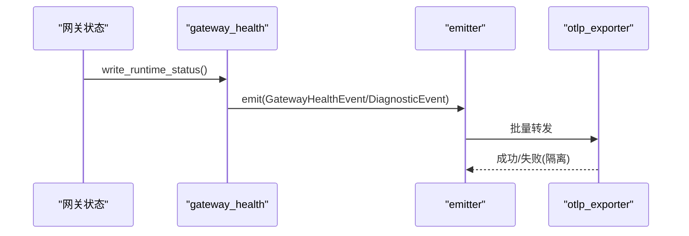
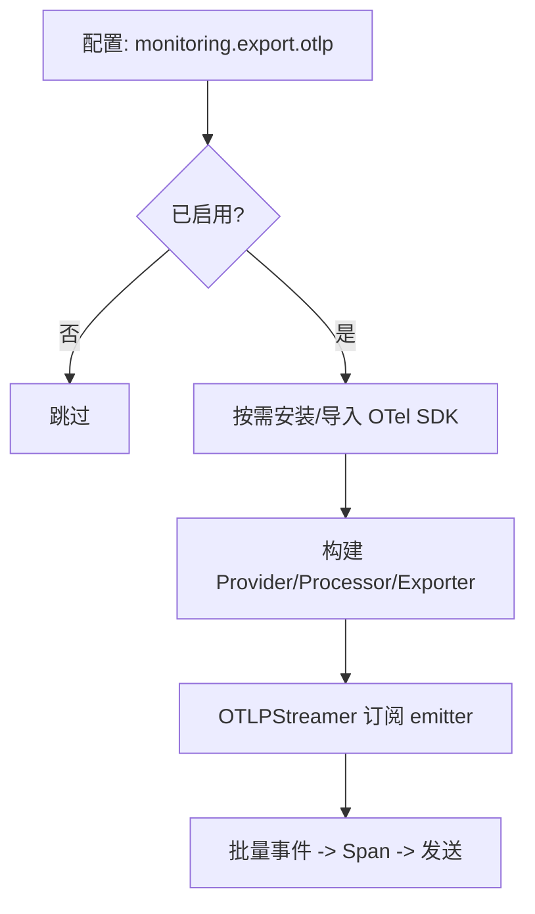
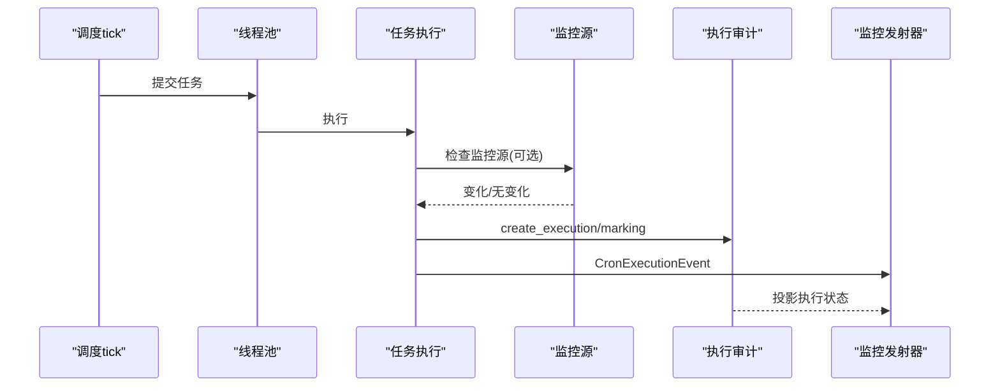
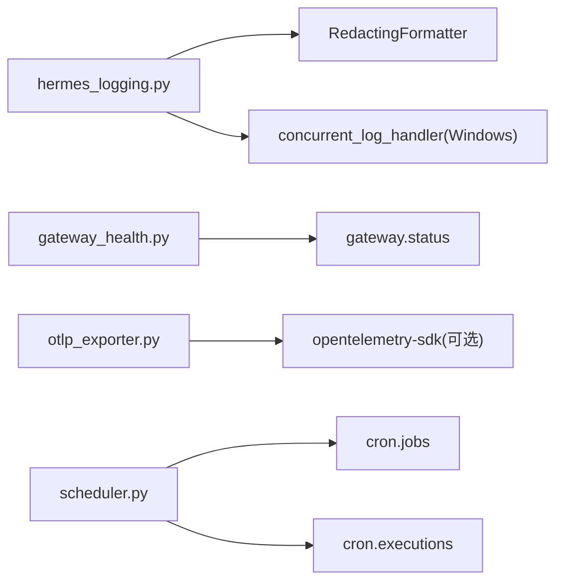

# 监控和日志

<cite>
**本文引用的文件**
- [hermes_logging.py](file://hermes_logging.py)
- [logs.py](file://hermes_cli/logs.py)
- [emitter.py](file://agent/monitoring/emitter.py)
- [events.py](file://agent/monitoring/events.py)
- [gateway_health.py](file://agent/monitoring/gateway_health.py)
- [otlp_exporter.py](file://agent/monitoring/otlp_exporter.py)
- [scheduler.py](file://cron/scheduler.py)
- [monitor.py](file://cron/monitor.py)
- [executions.py](file://cron/executions.py)
</cite>

## 目录
1. [简介](#简介)
2. [项目结构](#项目结构)
3. [核心组件](#核心组件)
4. [架构总览](#架构总览)
5. [详细组件分析](#详细组件分析)
6. [依赖关系分析](#依赖关系分析)
7. [性能考量](#性能考量)
8. [故障诊断指南](#故障诊断指南)
9. [结论](#结论)
10. [附录](#附录)

## 简介
本文件面向“定时任务监控与日志系统”，覆盖以下目标：
- 任务执行状态的实时监控与性能分析
- 监控指标的收集、存储与展示方法
- 日志记录策略、级别配置与轮转机制
- 告警规则配置、异常检测与自动恢复
- 监控仪表板使用与自定义面板创建
- 性能瓶颈分析与优化建议
- 故障诊断工具与调试技巧

该系统的核心由三部分构成：
- 日志子系统：集中式日志输出、按组件分流、异步落盘与轮转，支持会话上下文注入与敏感信息脱敏。
- 监控事件总线：进程内无阻塞的事件发射器，将网关健康、诊断与定时任务执行事件导出到外部可观测性后端（如 OTLP）。
- 定时任务调度与监控：基于文件锁的调度器、执行审计账本、监控源变更检测与失败收敛。

## 项目结构
与监控和日志相关的代码主要分布在以下模块：
- 日志：hermes_logging.py（统一初始化、轮转、异步队列）、hermes_cli/logs.py（命令行查看与过滤）
- 监控：agent/monitoring/*（emitter、events、gateway_health、otlp_exporter）
- 定时任务：cron/scheduler.py、cron/monitor.py、cron/executions.py

图表来源
- [hermes_logging.py:259-376](file://hermes_logging.py#L259-L376)
- [logs.py:1-20](file://hermes_cli/logs.py#L1-L20)
- [emitter.py:1-20](file://agent/monitoring/emitter.py#L1-L20)
- [events.py:1-87](file://agent/monitoring/events.py#L1-L87)
- [gateway_health.py:1-40](file://agent/monitoring/gateway_health.py#L1-L40)
- [otlp_exporter.py:1-22](file://agent/monitoring/otlp_exporter.py#L1-L22)
- [scheduler.py:1-10](file://cron/scheduler.py#L1-L10)
- [monitor.py:1-30](file://cron/monitor.py#L1-L30)
- [executions.py:1-25](file://cron/executions.py#L1-L25)

章节来源
- [hermes_logging.py:259-376](file://hermes_logging.py#L259-L376)
- [logs.py:1-20](file://hermes_cli/logs.py#L1-L20)
- [emitter.py:1-20](file://agent/monitoring/emitter.py#L1-L20)
- [events.py:1-87](file://agent/monitoring/events.py#L1-L87)
- [gateway_health.py:1-40](file://agent/monitoring/gateway_health.py#L1-L40)
- [otlp_exporter.py:1-22](file://agent/monitoring/otlp_exporter.py#L1-L22)
- [scheduler.py:1-10](file://cron/scheduler.py#L1-L10)
- [monitor.py:1-30](file://cron/monitor.py#L1-L30)
- [executions.py:1-25](file://cron/executions.py#L1-L25)

## 核心组件
- 日志子系统
  - 统一入口：setup_logging() 负责创建 agent.log、errors.log，并在 gateway/gui 模式下创建对应组件日志；所有文件通过 RotatingFileHandler 实现轮转。
  - 异步落盘：通过 QueueListener + QueueHandler 将文件写入从热路径剥离，避免跨进程旋转锁阻塞事件循环。
  - 会话上下文：set_session_context/clear_session_context 为每条日志注入 session_tag，便于关联会话。
  - 组件分流：_ComponentFilter 将 gateway/gui 等组件日志路由到独立文件。
  - Windows 兼容：在 Windows 上替换为并发安全的 RotatingFileHandler，并抑制锁超时导致的 traceback。
- 监控事件总线
  - 发射器：MonitoringEmitter 提供 O(微秒) 的 emit()，内部维护有界队列与后台分发线程，批量投递给订阅者（如 OTLP 流）。
  - 事件模型：GatewayHealthEvent、GatewayDiagnosticEvent、CronExecutionEvent 等类型化事件，仅包含操作指标与脱敏后的诊断信息。
  - 健康快照：build_gateway_health_snapshot() 聚合网关状态、平台状态、忙碌/可排空标志等指标。
  - OTLP 导出：OTLPStreamer 将事件映射为 OTel Span 并发送到配置的 Collector。
- 定时任务监控
  - 调度器：cron/scheduler.py 提供 tick() 周期检查到期任务，使用文件锁保证单实例运行，并通过线程池并行或串行执行。
  - 执行审计：cron/executions.py 以 SQLite 持久化每次尝试的状态机（claimed/running/completed/failed/unknown），并支持中断恢复。
  - 监控源：cron/monitor.py 对脚本或 URL 的输出进行哈希比较，仅在变化时触发 LLM 任务，减少无效调用。

章节来源
- [hermes_logging.py:259-376](file://hermes_logging.py#L259-L376)
- [hermes_logging.py:550-760](file://hermes_logging.py#L550-L760)
- [emitter.py:36-118](file://agent/monitoring/emitter.py#L36-L118)
- [events.py:19-87](file://agent/monitoring/events.py#L19-L87)
- [gateway_health.py:210-291](file://agent/monitoring/gateway_health.py#L210-L291)
- [otlp_exporter.py:183-261](file://agent/monitoring/otlp_exporter.py#L183-L261)
- [scheduler.py:329-468](file://cron/scheduler.py#L329-L468)
- [executions.py:135-196](file://cron/executions.py#L135-L196)
- [monitor.py:147-213](file://cron/monitor.py#L147-L213)

## 架构总览
下图展示了监控与日志的整体数据流：日志通过异步队列落盘；监控事件经发射器汇聚后导出至 OTLP；定时任务的执行状态既持久化到本地数据库，又投影到监控事件总线。

图表来源
- [hermes_logging.py:550-760](file://hermes_logging.py#L550-L760)
- [emitter.py:53-118](file://agent/monitoring/emitter.py#L53-L118)
- [otlp_exporter.py:183-261](file://agent/monitoring/otlp_exporter.py#L183-L261)
- [executions.py:135-196](file://cron/executions.py#L135-L196)
- [scheduler.py:329-468](file://cron/scheduler.py#L329-L468)

## 详细组件分析

### 日志子系统（hermes_logging.py）
- 关键职责
  - 统一初始化：setup_logging() 设置根日志级别、添加文件处理器、抑制第三方噪音日志。
  - 组件分流：通过 _ComponentFilter 将 gateway/gui 等组件日志路由到独立文件。
  - 会话上下文：全局 LogRecord 工厂注入 session_tag，确保跨进程/子日志器可用。
  - 异步落盘：QueueListener + QueueHandler 将文件 I/O 移出热路径，避免跨进程旋转锁阻塞。
  - 轮转与权限：_ManagedRotatingFileHandler 处理外部轮转重连与受管模式下的权限修正。
- 配置项
  - log_level：最小日志级别（默认 INFO）
  - max_size_mb：单文件大小阈值（默认 5MB）
  - backup_count：保留备份数（默认 3）
  - mode：cli/gateway/gui/cron，影响是否创建 gateway.log/gui.log
- 错误处理
  - Windows 并发锁超时被静默抑制，避免干扰桌面聊天输出。
  - 外部轮转导致 inode 不一致时自动重新打开文件句柄。

图表来源
- [hermes_logging.py:259-376](file://hermes_logging.py#L259-L376)
- [hermes_logging.py:550-760](file://hermes_logging.py#L550-L760)

章节来源
- [hermes_logging.py:259-376](file://hermes_logging.py#L259-L376)
- [hermes_logging.py:550-760](file://hermes_logging.py#L550-L760)

### 监控事件总线（emitter.py / events.py）
- 关键职责
  - 发射器：MonitoringEmitter 提供无阻塞 emit()，内部有界队列 + 后台分发线程，批量投递给订阅者。
  - 事件模型：GatewayHealthEvent、GatewayDiagnosticEvent、CronExecutionEvent 等，仅包含操作指标与脱敏信息。
  - 生命周期：start/stop、flush、stats 用于测试与运维。
- 设计要点
  - 热路径不变式：emit() 必须 O(微秒)、不阻塞、不抛出异常。
  - 订阅者隔离：任一订阅者失败不影响其他订阅者与热路径。
  - 无本地持久化：监控是出口通道，不是存储。

图表来源
- [emitter.py:36-118](file://agent/monitoring/emitter.py#L36-L118)
- [events.py:19-87](file://agent/monitoring/events.py#L19-L87)

章节来源
- [emitter.py:36-118](file://agent/monitoring/emitter.py#L36-L118)
- [events.py:19-87](file://agent/monitoring/events.py#L19-L87)

### 网关健康与诊断（gateway_health.py）
- 关键职责
  - 构建健康快照：聚合网关状态、平台状态、忙碌/可排空标志、活跃代理数量等指标。
  - 诊断桥接：GatewayDiagnosticLogHandler 将 gateway.* 警告/错误转换为诊断事件。
  - 分类与脱敏：classify_gateway_error() 将自由文本归一化为 error_class；redact_gateway_message() 脱敏。
- 指标示例
  - hermes.gateway.up、hermes.gateway.active_agents、hermes.platform.up、hermes.platform.degraded 等。

图表来源
- [gateway_health.py:210-291](file://agent/monitoring/gateway_health.py#L210-L291)
- [gateway_health.py:427-459](file://agent/monitoring/gateway_health.py#L427-L459)
- [otlp_exporter.py:183-261](file://agent/monitoring/otlp_exporter.py#L183-L261)

章节来源
- [gateway_health.py:210-291](file://agent/monitoring/gateway_health.py#L210-L291)
- [gateway_health.py:427-459](file://agent/monitoring/gateway_health.py#L427-L459)

### OTLP 导出（otlp_exporter.py）
- 关键职责
  - 可选依赖：仅在启用且安装 OTel SDK 时工作；否则返回不可用提示。
  - 事件映射：将监控事件映射为 OTel Span，属性经过脱敏与长度限制。
  - 持续流：OTLPStreamer 作为 emitter 的订阅者，持续推送批次。
- 配置要点
  - monitoring.export.otlp.endpoint 必填
  - headers_env 映射环境变量名到 HTTP 头，值在运行时读取且不记录

图表来源
- [otlp_exporter.py:107-135](file://agent/monitoring/otlp_exporter.py#L107-L135)
- [otlp_exporter.py:183-261](file://agent/monitoring/otlp_exporter.py#L183-L261)

章节来源
- [otlp_exporter.py:107-135](file://agent/monitoring/otlp_exporter.py#L107-L135)
- [otlp_exporter.py:183-261](file://agent/monitoring/otlp_exporter.py#L183-L261)

### 定时任务调度与监控（scheduler.py / monitor.py / executions.py）
- 调度器（scheduler.py）
  - tick() 周期检查到期任务，使用文件锁避免多实例竞争。
  - 线程池并行执行，同时维护 running job IDs，支持关闭时标记中断。
  - 工具集解析：合并 per-job 与平台级 enabled_toolsets，并层叠 MCP 服务器。
- 监控源（monitor.py）
  - 对 monitor_script 或 monitor_url 的输出计算哈希，与上次快照对比，仅在变化时触发 LLM 任务。
  - 首次运行注入基线上下文，后续注入差异块（统一 diff）。
- 执行审计（executions.py）
  - SQLite 持久化执行状态机（claimed/running/completed/failed/unknown），支持中断恢复与清理。
  - 将执行状态投影到监控事件（CronExecutionEvent）。

图表来源
- [scheduler.py:329-468](file://cron/scheduler.py#L329-L468)
- [monitor.py:147-213](file://cron/monitor.py#L147-L213)
- [executions.py:135-196](file://cron/executions.py#L135-L196)

章节来源
- [scheduler.py:329-468](file://cron/scheduler.py#L329-L468)
- [monitor.py:147-213](file://cron/monitor.py#L147-L213)
- [executions.py:135-196](file://cron/executions.py#L135-L196)

## 依赖关系分析
- 日志子系统依赖
  - 依赖 hermes_constants 获取 home 路径
  - 依赖 agent.redact.RedactingFormatter 进行敏感信息脱敏
  - 在 Windows 上依赖 concurrent_log_handler 解决跨进程旋转锁问题
- 监控子系统依赖
  - 依赖 gateway.status 获取运行时状态（活跃代理、忙碌/可排空推导）
  - 依赖 OTel SDK（可选）进行 OTLP 导出
- 定时任务依赖
  - 依赖 hermes_time 获取时间戳
  - 依赖 cron.jobs/cron.executions 进行任务持久化与执行审计

图表来源
- [hermes_logging.py:259-376](file://hermes_logging.py#L259-L376)
- [gateway_health.py:210-291](file://agent/monitoring/gateway_health.py#L210-L291)
- [otlp_exporter.py:107-135](file://agent/monitoring/otlp_exporter.py#L107-L135)
- [scheduler.py:293-295](file://cron/scheduler.py#L293-L295)

章节来源
- [hermes_logging.py:259-376](file://hermes_logging.py#L259-L376)
- [gateway_health.py:210-291](file://agent/monitoring/gateway_health.py#L210-L291)
- [otlp_exporter.py:107-135](file://agent/monitoring/otlp_exporter.py#L107-L135)
- [scheduler.py:293-295](file://cron/scheduler.py#L293-L295)

## 性能考量
- 日志
  - 异步队列：避免跨进程旋转锁阻塞事件循环，降低 WebSocket 客户端掉线风险。
  - 外部轮转检测：每写前 stat baseFilename，inode 不一致时重新打开，防止日志丢失。
  - 噪音抑制：对常见第三方库设置 WARNING 级别，减少无关日志。
- 监控
  - 发射器：有界队列 + 批量分发，丢弃最旧事件以保护内存；订阅者失败隔离。
  - OTLP：BatchSpanProcessor 批量发送，降低网络开销。
- 定时任务
  - 线程池并行执行长任务，ticker 线程不被阻塞。
  - 监控源哈希比较避免重复 LLM 调用，节省成本与延迟。
  - 执行审计限长清理，控制数据库大小。

[本节为通用性能指导，无需特定文件引用]

## 故障诊断指南
- 日志查看与过滤
  - 使用 hermes logs 命令查看最近日志、实时跟随、按级别/会话/组件/时间范围过滤。
  - 支持组件过滤：gateway、tools、cli、cron、gui 等。
- 常见问题定位
  - 日志未生成：确认已运行过 chat/gateway/dashboard 等产生日志的流程。
  - 权限错误：检查 ~/.hermes/logs/ 目录权限。
  - Windows 旋转锁超时：已被静默抑制，若仍出现，检查磁盘与进程占用。
- 监控与导出
  - OTLP 不可用：检查是否安装可选依赖并配置 endpoint；可通过 is_available()/is_enabled() 检查。
  - 事件未到达：确认 emitter 已订阅 OTLPStreamer；检查 stats() 中的 dropped/dispatched。
- 定时任务
  - 任务未执行：检查 cron 锁文件与 tick 间隔；查看 executions.db 中状态。
  - 监控源失败：monitor.py 将失败视为 ERROR，不会误判为变化；检查脚本/URL 可达性与输出稳定性。

章节来源
- [logs.py:145-254](file://hermes_cli/logs.py#L145-L254)
- [otlp_exporter.py:220-261](file://agent/monitoring/otlp_exporter.py#L220-L261)
- [executions.py:199-233](file://cron/executions.py#L199-L233)
- [monitor.py:128-141](file://cron/monitor.py#L128-L141)

## 结论
本系统通过“异步日志 + 事件总线 + 执行审计”的组合，实现了：
- 高吞吐、低侵入的日志记录与轮转
- 内容安全、可扩展的监控事件采集与导出
- 可靠、可恢复的定时任务执行追踪
结合命令行日志工具与 OTLP 导出能力，可快速搭建监控仪表板与告警规则，支撑生产环境的可观测性与稳定性保障。

[本节为总结性内容，无需特定文件引用]

## 附录

### 监控指标与存储
- 指标来源
  - 网关健康：gateway_health.py 构建快照，包含 up/active_agents/busy/drainable 等
  - 平台健康：按平台维度 up/degraded，附带 error_code/error_class
  - 定时任务：CronExecutionEvent 包含 status/job_key/source/duration_ms/delivery_outcome
- 存储方式
  - 日志：~/.hermes/logs/*.log，按大小轮转，保留若干备份
  - 执行审计：~/.hermes/cron/executions.db（SQLite）
  - 外部导出：OTLP 到配置的 Collector（DataDog、Prometheus 等）

章节来源
- [gateway_health.py:210-291](file://agent/monitoring/gateway_health.py#L210-L291)
- [events.py:66-87](file://agent/monitoring/events.py#L66-L87)
- [executions.py:27-63](file://cron/executions.py#L27-L63)
- [hermes_logging.py:259-376](file://hermes_logging.py#L259-L376)

### 告警规则与异常检测
- 异常分类
  - classify_gateway_error() 将错误归一化为 auth_failed/rate_limited/timeout/network_error/invalid_config/startup_failed/platform_fatal/unknown
- 告警建议
  - 平台 degraded/fatal 计数 > 0 时触发告警
  - gateway.busy=1 持续超过阈值时触发容量告警
  - CronExecutionEvent 中 failed/unknown 比例上升时触发质量告警
- 自动恢复
  - 执行审计 recover_interrupted_executions() 将已终止但状态未终态的记录标记为 unknown，避免悬挂
  - 监控源失败不改变上次哈希，服务恢复后自动回归抑制

章节来源
- [gateway_health.py:70-99](file://agent/monitoring/gateway_health.py#L70-L99)
- [executions.py:199-233](file://cron/executions.py#L199-L233)
- [monitor.py:147-213](file://cron/monitor.py#L147-L213)

### 仪表板使用与自定义面板
- 使用现有数据
  - 通过 OTLP 将事件导出到 Collector，再接入可视化后端（如 Grafana/Prometheus）
  - 利用 hermes.platform.up/degraded、hermes.gateway.state 等指标绘制健康视图
- 自定义面板
  - 新增事件类型：在 events.py 扩展 dataclass，并在 OTLP 映射中纳入字段
  - 调整采样：通过 emitter 的 stats() 监控 dropped，必要时增大队列或调整批大小
  - 过滤：OTLPStreamer 支持 event_filter，可按平面筛选事件

章节来源
- [events.py:19-87](file://agent/monitoring/events.py#L19-L87)
- [otlp_exporter.py:138-180](file://agent/monitoring/otlp_exporter.py#L138-L180)
- [emitter.py:152-158](file://agent/monitoring/emitter.py#L152-L158)

### 性能瓶颈分析与优化建议
- 瓶颈识别
  - 日志：观察 dropped 计数与 dispatch 速率，评估队列深度与批大小
  - OTLP：检查网络延迟与导出失败率，必要时调整 BatchSize
  - 定时任务：监控 running_job_ids 与 duration_ms，识别长尾任务
- 优化建议
  - 日志：适当增大 max_size_mb/backup_count，减少频繁轮转
  - 监控：启用 OTLP 批量导出，合理设置端点与重试策略
  - 任务：拆分长任务、增加监控源抑制、调整工作线程数

章节来源
- [emitter.py:32-34](file://agent/monitoring/emitter.py#L32-L34)
- [otlp_exporter.py:129-135](file://agent/monitoring/otlp_exporter.py#L129-L135)
- [scheduler.py:607-635](file://cron/scheduler.py#L607-L635)

### 调试技巧
- 日志
  - 使用 hermes logs --level/--session/--component/--since 精准定位
  - 开启 verbose 模式获取 DEBUG 控制台输出
- 监控
  - 使用 emitter.stats() 检查 queued/dispatched/dropped/subscribers
  - 通过 OTLP exporter 的 is_available()/is_enabled() 检查环境
- 定时任务
  - 查看 executions.db 最新执行记录，确认状态机流转
  - 检查 monitor_last_output.txt 与 jobs.json 中的 monitor_state

章节来源
- [logs.py:145-254](file://hermes_cli/logs.py#L145-L254)
- [emitter.py:152-158](file://agent/monitoring/emitter.py#L152-L158)
- [otlp_exporter.py:220-233](file://agent/monitoring/otlp_exporter.py#L220-L233)
- [executions.py:236-281](file://cron/executions.py#L236-L281)
- [monitor.py:86-109](file://cron/monitor.py#L86-L109)