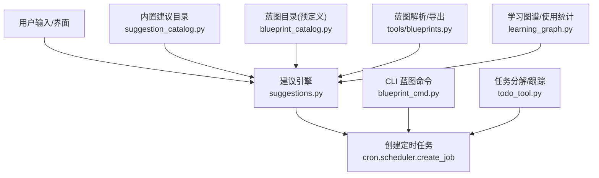
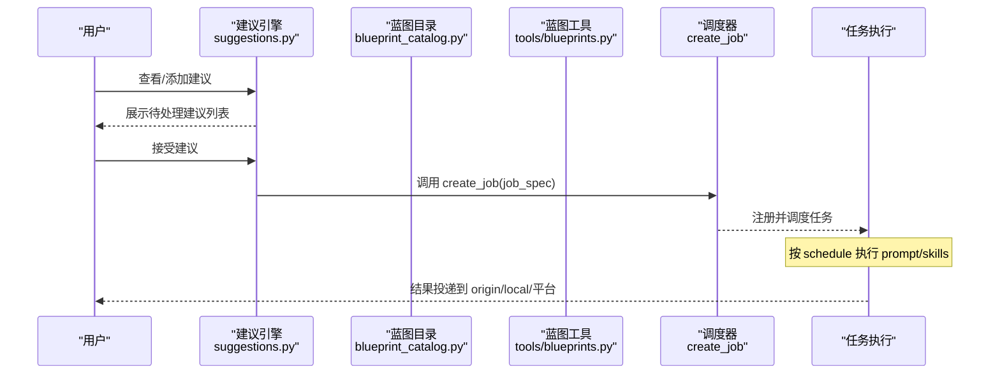
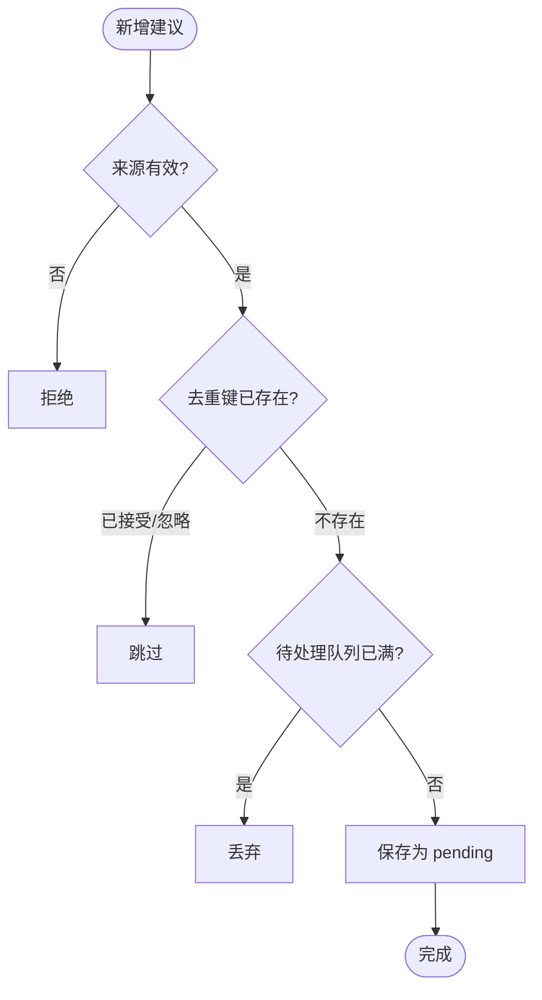
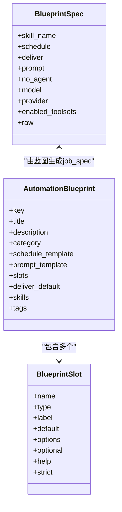
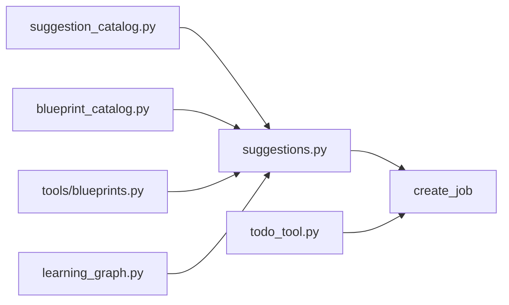

# 自然语言任务

<cite>
**本文引用的文件**
- [cron/suggestions.py](file://cron/suggestions.py)
- [cron/blueprint_catalog.py](file://cron/blueprint_catalog.py)
- [tools/blueprints.py](file://tools/blueprints.py)
- [cron/suggestion_catalog.py](file://cron/suggestion_catalog.py)
- [hermes_cli/blueprint_cmd.py](file://hermes_cli/blueprint_cmd.py)
- [agent/learning_graph.py](file://agent/learning_graph.py)
- [tools/todo_tool.py](file://tools/todo_tool.py)
</cite>

## 目录
1. [简介](#简介)
2. [项目结构](#项目结构)
3. [核心组件](#核心组件)
4. [架构总览](#架构总览)
5. [详细组件分析](#详细组件分析)
6. [依赖关系分析](#依赖关系分析)
7. [性能考量](#性能考量)
8. [故障排查指南](#故障排查指南)
9. [结论](#结论)
10. [附录](#附录)

## 简介
本系统提供“将日常任务转换为自然语言描述并自动执行”的能力。其核心思想是：
- 用蓝图（Blueprint）把重复性任务固化为可参数化的自动化模板；
- 通过建议引擎（Suggestions）向用户呈现“一键采纳”的待办自动化，确保“同意优先”；
- 借助内置与自定义蓝图、技能（Skills）和定时调度（Cron），让自然语言意图落地为可执行的计划任务；
- 结合学习图谱与使用统计，形成“反馈—改进”的闭环，持续优化推荐与执行质量。

## 项目结构
围绕自然语言任务的关键代码集中在以下模块：
- 建议存储与生命周期管理：cron/suggestions.py
- 预定义蓝图目录与表单渲染：cron/blueprint_catalog.py
- 蓝图解析与导出（基于 SKILL.md frontmatter）：tools/blueprints.py
- 内置建议目录（开箱即用的自动化建议）：cron/suggestion_catalog.py
- CLI 蓝图命令入口：hermes_cli/blueprint_cmd.py
- 学习图谱与使用统计：agent/learning_graph.py
- 会话内任务分解与进度跟踪：tools/todo_tool.py

图表来源
- [cron/suggestions.py:1-270](file://cron/suggestions.py#L1-L270)
- [cron/suggestion_catalog.py:1-155](file://cron/suggestion_catalog.py#L1-L155)
- [cron/blueprint_catalog.py:1-714](file://cron/blueprint_catalog.py#L1-L714)
- [tools/blueprints.py:1-325](file://tools/blueprints.py#L1-L325)
- [hermes_cli/blueprint_cmd.py:1-200](file://hermes_cli/blueprint_cmd.py#L1-L200)
- [agent/learning_graph.py:1-200](file://agent/learning_graph.py#L1-L200)
- [tools/todo_tool.py:1-200](file://tools/todo_tool.py#L1-L200)

章节来源
- [cron/suggestions.py:1-270](file://cron/suggestions.py#L1-L270)
- [cron/suggestion_catalog.py:1-155](file://cron/suggestion_catalog.py#L1-L155)
- [cron/blueprint_catalog.py:1-714](file://cron/blueprint_catalog.py#L1-L714)
- [tools/blueprints.py:1-325](file://tools/blueprints.py#L1-L325)
- [hermes_cli/blueprint_cmd.py:1-200](file://hermes_cli/blueprint_cmd.py#L1-L200)
- [agent/learning_graph.py:1-200](file://agent/learning_graph.py#L1-L200)
- [tools/todo_tool.py:1-200](file://tools/todo_tool.py#L1-L200)

## 核心组件
- 建议引擎（Suggestion Store）
  - 统一入口：所有自动化提议（内置目录、蓝图安装、集成连接、使用洞察）都汇聚到建议列表，用户显式接受或忽略。
  - 防打扰：限制待处理建议数量，去重键避免重复提示。
  - 安全持久化：原子写入、进程锁、权限控制。
- 蓝图系统（Blueprint Catalog & Tools）
  - 预定义蓝图：带槽位（时间、周期、投递渠道等）的模板，支持表单渲染、斜杠命令生成、深链跳转。
  - 自定义蓝图：以 SKILL.md 的 frontmatter 声明 schedule/deliver/prompt 等，复用技能生态进行分享与发布。
  - 填充与校验：将用户填写的槽位值转为 cron job 的 kwargs，保证无二义性与安全性。
- 内置建议目录（Catalog）
  - 开箱即用：每日简报、重要邮件监控、每周回顾、工作日提醒等，直接作为建议呈现。
- 学习图谱与使用统计
  - 从技能使用记录、记忆片段构建“学习可视化”图，帮助理解哪些能力被频繁使用、如何关联。
- 任务分解与跟踪
  - 会话内维护任务清单，跨上下文压缩保持进度，辅助复杂任务的拆解与推进。

章节来源
- [cron/suggestions.py:1-270](file://cron/suggestions.py#L1-L270)
- [cron/blueprint_catalog.py:1-714](file://cron/blueprint_catalog.py#L1-L714)
- [tools/blueprints.py:1-325](file://tools/blueprints.py#L1-L325)
- [cron/suggestion_catalog.py:1-155](file://cron/suggestion_catalog.py#L1-L155)
- [agent/learning_graph.py:1-200](file://agent/learning_graph.py#L1-L200)
- [tools/todo_tool.py:1-200](file://tools/todo_tool.py#L1-L200)

## 架构总览
下图展示了从“自然语言意图”到“自动执行”的端到端流程：

图表来源
- [cron/suggestions.py:125-252](file://cron/suggestions.py#L125-L252)
- [cron/blueprint_catalog.py:661-714](file://cron/blueprint_catalog.py#L661-L714)
- [tools/blueprints.py:172-214](file://tools/blueprints.py#L172-L214)

## 详细组件分析

### 建议引擎（Suggestion Store）
- 职责
  - 聚合多来源建议（catalog、blueprint、usage、integration）。
  - 维护建议状态（pending/accepted/dismissed）、去重键、最大挂起数。
  - 接受建议后直接调用调度器创建真实任务，不引入第二套执行引擎。
- 关键流程
  - 新增建议：校验来源、标题与去重键，检查是否已存在相同状态，若待处理队列已满则丢弃。
  - 接受建议：合并 origin 信息，调用调度器创建任务，更新状态为 accepted。
  - 忽略建议：标记 dismissed，后续不再重复提示。
- 数据与并发
  - 单文件 JSON 存储，原子替换写入，进程级锁保护读写。
  - 独立于 profile 的 cron 目录，避免多配置冲突。

图表来源
- [cron/suggestions.py:125-177](file://cron/suggestions.py#L125-L177)

章节来源
- [cron/suggestions.py:1-270](file://cron/suggestions.py#L1-L270)

### 蓝图系统（预定义与自定义）
- 预定义蓝图（blueprint_catalog.py）
  - 数据结构：AutomationBlueprint 包含 key/title/description/category/schedule_template/prompt_template/slots/tags 等。
  - 槽位类型：time、enum、text、weekdays，支持默认值、选项、可选与严格模式。
  - 渲染能力：生成表单 schema、斜杠命令、深链 URL、人类可读调度说明。
  - 填充逻辑：将槽位值解析为 cron 表达式与 prompt，再产出 create_job 所需 kwargs。
- 自定义蓝图（tools/blueprints.py）
  - 基于 SKILL.md 的 frontmatter 声明 hermes.blueprint（schedule、deliver、prompt、no_agent、model/provider/toolsets）。
  - 解析与验证：提取元数据并构造 BlueprintSpec；缺失必填字段会抛出错误。
  - 转换与创建：将 BlueprintSpec 转为 create_job 的 kwargs，或直接创建任务。
  - 导出分享：将已有任务反序列化为可分享的 SKILL.md，便于发布与复用。

图表来源
- [cron/blueprint_catalog.py:60-100](file://cron/blueprint_catalog.py#L60-L100)
- [tools/blueprints.py:57-69](file://tools/blueprints.py#L57-L69)

章节来源
- [cron/blueprint_catalog.py:1-714](file://cron/blueprint_catalog.py#L1-L714)
- [tools/blueprints.py:1-325](file://tools/blueprints.py#L1-L325)

### 内置建议目录（Catalog）
- 作用：为新用户提供开箱即用的自动化建议（如每日简报、重要邮件监控、每周回顾、工作日提醒）。
- 特点：每个条目都是可直接接受的 job_spec，接受后直接创建定时任务；强调“同意优先”，不会自动调度。
- 扩展：可通过追加 CatalogEntry 增加新建议，保持 prompt 自包含且 schedule 合理。

章节来源
- [cron/suggestion_catalog.py:1-155](file://cron/suggestion_catalog.py#L1-L155)

### CLI 蓝图命令
- 功能：提供 /blueprint 斜杠命令，用于快速创建或预览蓝图任务；支持从表单或文档复制粘贴命令。
- 与蓝图目录联动：读取 blueprint_catalog 中的槽位与默认值，生成可执行的命令行字符串。

章节来源
- [hermes_cli/blueprint_cmd.py:1-200](file://hermes_cli/blueprint_cmd.py#L1-L200)

### 学习机制与反馈循环
- 学习图谱（learning_graph.py）
  - 从技能使用统计与记忆片段构建节点与边，展示“学到的技能”与“记住的内容”之间的关系。
  - 指标：节点数、边密度、孤立比例、类别分布、代理创建的技能数量、被使用的技能等。
- 反馈循环
  - 使用频率高的技能/任务更容易被推荐或复用；
  - 通过图谱发现关联能力，指导下一步自动化设计；
  - 结合建议系统的“忽略/接受”行为，逐步收敛到更贴合用户偏好的建议。

章节来源
- [agent/learning_graph.py:1-200](file://agent/learning_graph.py#L1-L200)

### 任务分解与跟踪（Todo Tool）
- 作用：在会话中维护任务清单，支持写入、读取、合并更新；跨上下文压缩时注入当前任务状态，保持连续性。
- 约束：内容长度与条目数量上限，防止注入块膨胀；仅注入未完成的任务项，避免重复工作。
- 适用场景：复杂任务的多步执行、长对话中的进度追踪、压缩后的恢复与继续。

章节来源
- [tools/todo_tool.py:1-200](file://tools/todo_tool.py#L1-L200)

## 依赖关系分析
- 建议引擎依赖
  - 读取/写入 suggestions.json（本地文件），受进程锁保护；
  - 接受建议时调用调度器创建任务；
  - 与内置建议目录、蓝图工具协作，统一输出 job_spec。
- 蓝图系统依赖
  - 预定义蓝图通过槽位与模板生成 schedule 与 prompt；
  - 自定义蓝图通过 SKILL.md frontmatter 解析，复用技能生态；
  - 两者最终都转化为 create_job 的参数，确保单一执行路径。
- 学习图谱依赖
  - 读取技能使用统计与记忆文件，构建可视化图谱；
  - 为建议与个性化提供数据基础。

图表来源
- [cron/suggestions.py:125-252](file://cron/suggestions.py#L125-L252)
- [cron/suggestion_catalog.py:124-155](file://cron/suggestion_catalog.py#L124-L155)
- [cron/blueprint_catalog.py:661-714](file://cron/blueprint_catalog.py#L661-L714)
- [tools/blueprints.py:172-214](file://tools/blueprints.py#L172-L214)
- [agent/learning_graph.py:125-200](file://agent/learning_graph.py#L125-L200)
- [tools/todo_tool.py:59-106](file://tools/todo_tool.py#L59-L106)

章节来源
- [cron/suggestions.py:1-270](file://cron/suggestions.py#L1-L270)
- [cron/suggestion_catalog.py:1-155](file://cron/suggestion_catalog.py#L1-L155)
- [cron/blueprint_catalog.py:1-714](file://cron/blueprint_catalog.py#L1-L714)
- [tools/blueprints.py:1-325](file://tools/blueprints.py#L1-L325)
- [agent/learning_graph.py:1-200](file://agent/learning_graph.py#L1-L200)
- [tools/todo_tool.py:1-200](file://tools/todo_tool.py#L1-L200)

## 性能考量
- 建议队列上限：限制待处理建议数量，避免“通知墙”影响体验。
- 原子写入与权限：使用临时文件原子替换与 0600 权限，降低并发与安全风险。
- 蓝图填充校验：提前校验槽位值，减少无效任务创建与重试开销。
- 任务注入裁剪：Todo 工具对内容与条目数量进行上限控制，避免上下文压缩后注入块过大。
- 学习图谱统计：按需加载使用统计，避免全量扫描带来的性能压力。

[本节为通用性能建议，无需特定文件引用]

## 故障排查指南
- 建议未出现
  - 检查来源是否为已知类型；
  - 确认去重键未被忽略或已接受；
  - 查看待处理队列是否已满。
- 接受建议失败
  - 调度器注册异常时，建议状态可能已更新为 accepted，需检查任务是否已存在；
  - 检查 job_spec 是否完整（prompt、schedule、deliver 等）。
- 蓝图填充错误
  - 槽位缺失或类型不符会抛出错误，根据错误信息补齐或修正槽位；
  - 枚举值需在允许范围内，文本槽位注意引号与空格。
- 自定义蓝图无法解析
  - 确认 SKILL.md 的 frontmatter 格式正确；
  - 必填字段（如 schedule）必须存在且非空。
- 学习图谱为空或不准确
  - 检查技能使用统计文件是否存在与可读；
  - 确认记忆文件分隔符与内容格式符合预期。

章节来源
- [cron/suggestions.py:125-252](file://cron/suggestions.py#L125-L252)
- [cron/blueprint_catalog.py:661-714](file://cron/blueprint_catalog.py#L661-L714)
- [tools/blueprints.py:95-141](file://tools/blueprints.py#L95-L141)
- [agent/learning_graph.py:125-200](file://agent/learning_graph.py#L125-L200)

## 结论
本系统通过“建议引擎 + 蓝图系统 + 学习图谱”的组合，实现了从自然语言意图到自动化执行的闭环：
- 建议引擎确保“同意优先”，统一入口管理自动化提议；
- 蓝图系统提供标准化、可参数化的任务模板，既支持内置也支持自定义；
- 学习图谱与使用统计驱动个性化推荐与持续改进；
- 任务分解与跟踪保障复杂任务的可控执行与恢复。

通过合理的校验、原子写入与并发保护，系统在易用性与可靠性之间取得平衡，适合日常任务的自动化与长期演进。

[本节为总结性内容，无需特定文件引用]

## 附录
- 常见任务场景的自然语言描述示例（基于蓝图槽位与提示模板）
  - 每日简报：每天早上 8 点，汇总日历、天气与紧急事项。
  - 重要邮件监控：每 30 分钟检查收件箱，仅推送需要关注的重要邮件。
  - 每周回顾：周日傍晚总结本周完成事项、待办与下周安排。
  - 工作日提醒：工作日早间推送当日议程与优先级。
  - 习惯打卡：晚间提醒并完成习惯打卡，给予鼓励。
  - 健康提醒：工作时段每小时提醒喝水、起身活动。
  - 学习计划：每天推送一个知识点，循序渐进并提问检验理解。
  - 感恩日记：晚间引导反思当天收获与感谢之事。
  - 今日趣闻：每日推送历史事件、词汇或科学事实等趣味内容。
- 优化技巧
  - 明确槽位：尽量使用 enum 与 time 槽位，减少歧义；
  - 精简 prompt：聚焦目标，避免冗长指令；
  - 利用 deliver：选择合适投递渠道（origin/local/平台）；
  - 定期清理：清除已接受的建议记录，保持建议列表整洁；
  - 结合学习图谱：观察高频技能与关联关系，迭代自动化设计。

[本节为概念性内容，无需特定文件引用]