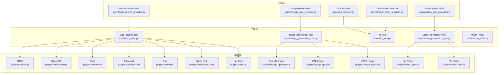
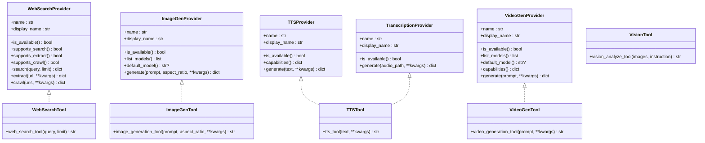
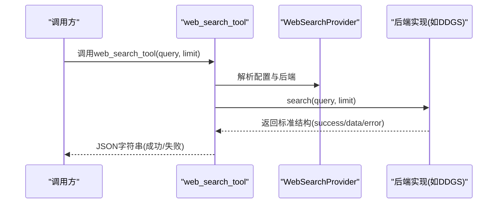
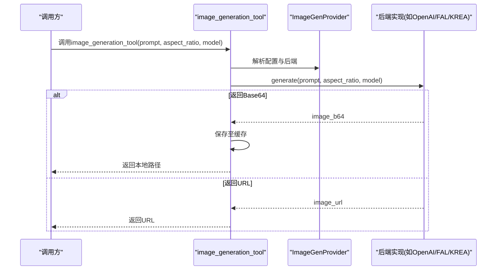
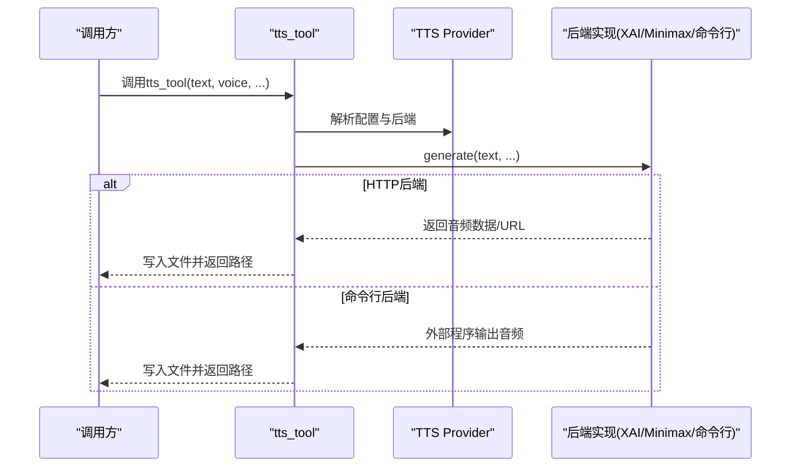
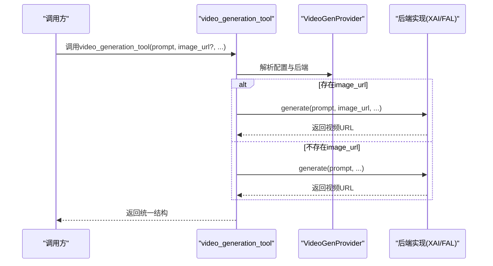
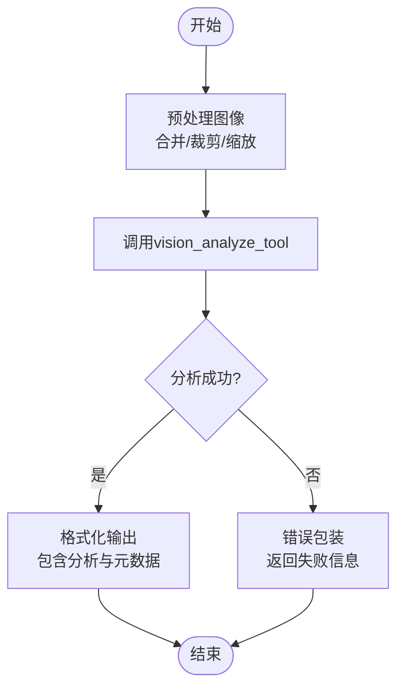
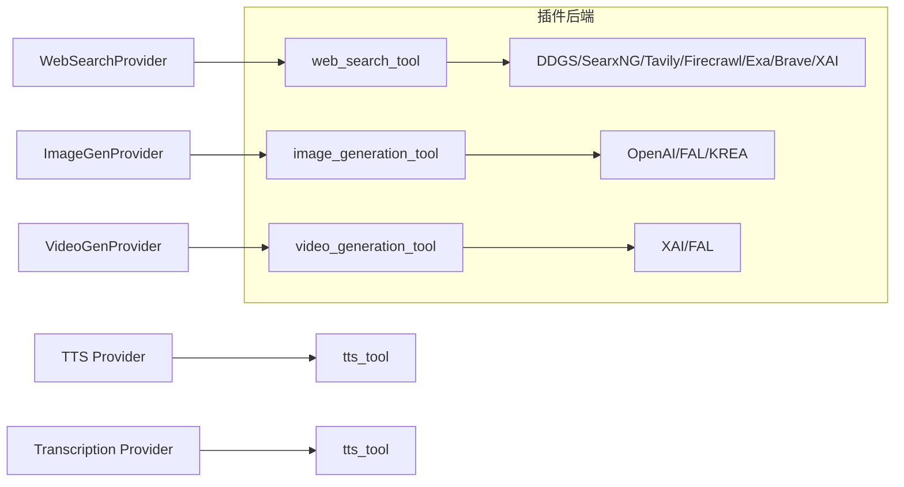

# 专用工具

<cite>
**本文引用的文件**
- [agent/image_gen_provider.py](file://agent/image_gen_provider.py)
- [agent/tts_provider.py](file://agent/tts_provider.py)
- [agent/video_gen_provider.py](file://agent/video_gen_provider.py)
- [agent/web_search_provider.py](file://agent/web_search_provider.py)
- [agent/transcription_provider.py](file://agent/transcription_provider.py)
- [tools/image_generation_tool.py](file://tools/image_generation_tool.py)
- [tools/tts_tool.py](file://tools/tts_tool.py)
- [tools/video_generation_tool.py](file://tools/video_generation_tool.py)
- [tools/vision_tools.py](file://tools/vision_tools.py)
- [tools/web_tools.py](file://tools/web_tools.py)
- [plugins/image_gen/openai/__init__.py](file://plugins/image_gen/openai/__init__.py)
- [plugins/image_gen/fal/__init__.py](file://plugins/image_gen/fal/__init__.py)
- [plugins/image_gen/krea/__init__.py](file://plugins/image_gen/krea/__init__.py)
- [plugins/video_gen/xai/__init__.py](file://plugins/video_gen/xai/__init__.py)
- [plugins/video_gen/fal/__init__.py](file://plugins/video_gen/fal/__init__.py)
- [plugins/web/ddgs/__init__.py](file://plugins/web/ddgs/__init__.py)
- [plugins/web/searxng/__init__.py](file://plugins/web/searxng/__init__.py)
- [plugins/web/tavily/__init__.py](file://plugins/web/tavily/__init__.py)
- [plugins/web/firecrawl/__init__.py](file://plugins/web/firecrawl/__init__.py)
- [plugins/web/exa/__init__.py](file://plugins/web/exa/__init__.py)
- [plugins/web/brave_free/__init__.py](file://plugins/web/brave_free/__init__.py)
- [plugins/web/xai/__init__.py](file://plugins/web/xai/__init__.py)
- [plugins/spotify/client.py](file://plugins/spotify/client.py)
- [plugins/spotify/tools.py](file://plugins/spotify/tools.py)
- [plugins/spotify/plugin.yaml](file://plugins/spotify/plugin.yaml)
- [website/docs/developer-guide/image-gen-provider-plugin.md](file://website/docs/developer-guide/image-gen-provider-plugin.md)
- [website/docs/developer-guide/video-gen-provider-plugin.md](file://website/docs/developer-guide/video-gen-provider-plugin.md)
- [website/docs/developer-guide/web-search-provider-plugin.md](file://website/docs/developer-guide/web-search-provider-plugin.md)
- [tests/tools/test_tts_command_providers.py](file://tests/tools/test_tts_command_providers.py)
- [tests/tools/test_tts_dotenv_fallback.py](file://tests/tools/test_tts_dotenv_fallback.py)
- [tests/tools/test_video_generation_dispatch.py](file://tests/tools/test_video_generation_dispatch.py)
- [tests/integration/test_web_tools.py](file://tests/integration/test_web_tools.py)
- [tests/hermes_cli/test_image_gen_picker.py](file://tests/hermes_cli/test_image_gen_picker.py)
- [tests/tools/test_clipboard.py](file://tests/tools/test_clipboard.py)
</cite>

## 目录
1. [简介](#简介)
2. [项目结构](#项目结构)
3. [核心组件](#核心组件)
4. [架构总览](#架构总览)
5. [详细组件分析](#详细组件分析)
6. [依赖关系分析](#依赖关系分析)
7. [性能考虑](#性能考虑)
8. [故障排查指南](#故障排查指南)
9. [结论](#结论)
10. [附录](#附录)

## 简介
本文件面向Hermes Agent的专用工具体系，聚焦以下五类专业能力：
- 搜索引擎工具：基于统一的WebSearchProvider抽象，支持多后端搜索、抽取与爬取。
- 图像生成工具：基于ImageGenProvider抽象，支持多后端文生图、参数化与缓存。
- 语音合成工具：基于TTS Provider抽象，支持命令行与HTTP后端，含认证与回退策略。
- 视频生成工具：基于VideoGenProvider抽象，统一参数模式，支持文生视频与图生视频。
- 视觉处理工具：提供通用视觉分析与预处理能力，支撑多模态输入路由。

文档将从架构、实现细节、API集成、第三方服务对接、配置参数、认证机制、使用限制、调用示例、错误处理、性能优化、扩展性设计、插件集成、监控与日志、故障排查到高级定制等维度展开，帮助开发者快速理解并高效使用与扩展这些专用工具。

## 项目结构
专用工具围绕“Provider抽象 + 工具封装 + 插件后端”的分层组织：
- 抽象层：在agent目录下定义各专用领域的Provider接口（如WebSearchProvider、ImageGenProvider、TTS Provider、VideoGenProvider、Transcription Provider）。
- 工具层：在tools目录下封装具体可调用的工具函数（如web_search_tool、image_generation_tool、tts_tool、video_generation_tool、vision_tools）。
- 插件层：在plugins目录下提供多种第三方后端实现（如OpenAI、FAL、KREA、XAI、DDGS、SearxNG、Tavily、Firecrawl、Exa、Brave等），通过register注册到系统。

图表来源
- [agent/web_search_provider.py](file://agent/web_search_provider.py)
- [agent/image_gen_provider.py](file://agent/image_gen_provider.py)
- [agent/tts_provider.py](file://agent/tts_provider.py)
- [agent/video_gen_provider.py](file://agent/video_gen_provider.py)
- [agent/transcription_provider.py](file://agent/transcription_provider.py)
- [tools/web_tools.py](file://tools/web_tools.py)
- [tools/image_generation_tool.py](file://tools/image_generation_tool.py)
- [tools/tts_tool.py](file://tools/tts_tool.py)
- [tools/video_generation_tool.py](file://tools/video_generation_tool.py)
- [tools/vision_tools.py](file://tools/vision_tools.py)
- [plugins/web/ddgs/__init__.py](file://plugins/web/ddgs/__init__.py)
- [plugins/web/searxng/__init__.py](file://plugins/web/searxng/__init__.py)
- [plugins/web/tavily/__init__.py](file://plugins/web/tavily/__init__.py)
- [plugins/web/firecrawl/__init__.py](file://plugins/web/firecrawl/__init__.py)
- [plugins/web/exa/__init__.py](file://plugins/web/exa/__init__.py)
- [plugins/web/brave_free/__init__.py](file://plugins/web/brave_free/__init__.py)
- [plugins/web/xai/__init__.py](file://plugins/web/xai/__init__.py)
- [plugins/image_gen/openai/__init__.py](file://plugins/image_gen/openai/__init__.py)
- [plugins/image_gen/fal/__init__.py](file://plugins/image_gen/fal/__init__.py)
- [plugins/image_gen/krea/__init__.py](file://plugins/image_gen/krea/__init__.py)
- [plugins/video_gen/xai/__init__.py](file://plugins/video_gen/xai/__init__.py)
- [plugins/video_gen/fal/__init__.py](file://plugins/video_gen/fal/__init__.py)

章节来源
- [agent/web_search_provider.py](file://agent/web_search_provider.py)
- [agent/image_gen_provider.py](file://agent/image_gen_provider.py)
- [agent/tts_provider.py](file://agent/tts_provider.py)
- [agent/video_gen_provider.py](file://agent/video_gen_provider.py)
- [agent/transcription_provider.py](file://agent/transcription_provider.py)
- [tools/web_tools.py](file://tools/web_tools.py)
- [tools/image_generation_tool.py](file://tools/image_generation_tool.py)
- [tools/tts_tool.py](file://tools/tts_tool.py)
- [tools/video_generation_tool.py](file://tools/video_generation_tool.py)
- [tools/vision_tools.py](file://tools/vision_tools.py)

## 核心组件
本节概述五类专用工具的职责边界与关键接口：
- 搜索引擎工具：统一WebSearchProvider接口，支持search/extract/crawl三种能力，通过插件后端实现不同算法与数据源。
- 图像生成工具：统一ImageGenProvider接口，支持generate、list_models、default_model、capabilities等，兼容URL与Base64两种输出。
- 语音合成工具：统一TTS Provider接口，支持命令行与HTTP后端，具备认证头注入与环境变量回退。
- 视频生成工具：统一VideoGenProvider接口，统一参数模式（prompt、image_url、reference_image_urls、duration、aspect_ratio、resolution、negative_prompt、audio、seed、model），自动路由文生视频与图生视频。
- 视觉处理工具：提供通用视觉分析与预处理，支持多图合并、文本增强与结果格式化。

章节来源
- [agent/web_search_provider.py](file://agent/web_search_provider.py)
- [agent/image_gen_provider.py](file://agent/image_gen_provider.py)
- [agent/tts_provider.py](file://agent/tts_provider.py)
- [agent/video_gen_provider.py](file://agent/video_gen_provider.py)
- [agent/transcription_provider.py](file://agent/transcription_provider.py)
- [tools/web_tools.py](file://tools/web_tools.py)
- [tools/image_generation_tool.py](file://tools/image_generation_tool.py)
- [tools/tts_tool.py](file://tools/tts_tool.py)
- [tools/video_generation_tool.py](file://tools/video_generation_tool.py)
- [tools/vision_tools.py](file://tools/vision_tools.py)

## 架构总览
专用工具采用“抽象接口 + 工具封装 + 插件后端”的三层架构：
- 抽象接口：定义稳定的Provider协议，确保工具层无需关心具体实现差异。
- 工具封装：提供统一的调用入口与参数校验，负责错误包装与返回格式标准化。
- 插件后端：按需实现Provider接口，注册到系统，支持动态切换与能力声明。

图表来源
- [agent/web_search_provider.py](file://agent/web_search_provider.py)
- [agent/image_gen_provider.py](file://agent/image_gen_provider.py)
- [agent/tts_provider.py](file://agent/tts_provider.py)
- [agent/video_gen_provider.py](file://agent/video_gen_provider.py)
- [agent/transcription_provider.py](file://agent/transcription_provider.py)
- [tools/web_tools.py](file://tools/web_tools.py)
- [tools/image_generation_tool.py](file://tools/image_generation_tool.py)
- [tools/tts_tool.py](file://tools/tts_tool.py)
- [tools/video_generation_tool.py](file://tools/video_generation_tool.py)
- [tools/vision_tools.py](file://tools/vision_tools.py)

## 详细组件分析

### 搜索引擎工具
- 技术实现
  - 抽象接口：WebSearchProvider定义统一能力开关与方法签名，支持search/extract/crawl三类能力。
  - 工具封装：web_search_tool负责参数校验、调用后端、错误包装与JSON返回。
  - 插件后端：DDGS、SearxNG、Tavily、Firecrawl、Exa、Brave Free、XAI等，均实现is_available与对应方法。
- API集成与第三方服务
  - 各后端通过HTTP客户端调用第三方API，遵循统一响应结构，便于工具层无差别处理。
  - 认证机制：多数后端通过环境变量注入API Key或Token，部分后端支持OAuth流程。
- 配置参数与使用限制
  - 通用参数：query、limit（受后端限制）、timeout等。
  - 使用限制：不同后端对请求频率、结果数量、语言区域等有限制，需在插件capabilities中声明。
- 错误处理与性能优化
  - 统一错误包装，包含error_type与provider标识，便于定位问题。
  - 建议：合理设置超时、重试与并发度，避免触发第三方限流。
- 扩展性与插件集成
  - 新增后端：实现WebSearchProvider子类，注册到系统即可被工具层发现与选择。
  - 能力声明：通过capabilities与setup_schema向用户展示可用能力与配置项。

图表来源
- [tools/web_tools.py](file://tools/web_tools.py)
- [agent/web_search_provider.py](file://agent/web_search_provider.py)
- [plugins/web/ddgs/__init__.py](file://plugins/web/ddgs/__init__.py)
- [plugins/web/searxng/__init__.py](file://plugins/web/searxng/__init__.py)
- [plugins/web/tavily/__init__.py](file://plugins/web/tavily/__init__.py)
- [plugins/web/firecrawl/__init__.py](file://plugins/web/firecrawl/__init__.py)
- [plugins/web/exa/__init__.py](file://plugins/web/exa/__init__.py)
- [plugins/web/brave_free/__init__.py](file://plugins/web/brave_free/__init__.py)
- [plugins/web/xai/__init__.py](file://plugins/web/xai/__init__.py)

章节来源
- [agent/web_search_provider.py](file://agent/web_search_provider.py)
- [tools/web_tools.py](file://tools/web_tools.py)
- [plugins/web/ddgs/__init__.py](file://plugins/web/ddgs/__init__.py)
- [plugins/web/searxng/__init__.py](file://plugins/web/searxng/__init__.py)
- [plugins/web/tavily/__init__.py](file://plugins/web/tavily/__init__.py)
- [plugins/web/firecrawl/__init__.py](file://plugins/web/firecrawl/__init__.py)
- [plugins/web/exa/__init__.py](file://plugins/web/exa/__init__.py)
- [plugins/web/brave_free/__init__.py](file://plugins/web/brave_free/__init__.py)
- [plugins/web/xai/__init__.py](file://plugins/web/xai/__init__.py)
- [website/docs/developer-guide/web-search-provider-plugin.md](file://website/docs/developer-guide/web-search-provider-plugin.md)
- [tests/integration/test_web_tools.py](file://tests/integration/test_web_tools.py)

### 图像生成工具
- 技术实现
  - 抽象接口：ImageGenProvider定义name、display_name、is_available、list_models、default_model、generate等。
  - 工具封装：image_generation_tool负责参数解析、调用后端、保存Base64图片至缓存、返回统一结构。
  - 插件后端：OpenAI、FAL、KREA等，均实现generate并支持aspect_ratio与model选择。
- API集成与第三方服务
  - 支持返回URL或Base64，工具层自动处理保存与路径返回。
  - 认证机制：通过环境变量注入API Key，部分后端支持代理与网关模式。
- 配置参数与使用限制
  - 关键参数：prompt、aspect_ratio、model、style等（由后端决定支持度）。
  - 使用限制：不同后端对分辨率、风格、并发、额度有不同限制。
- 错误处理与性能优化
  - 统一错误包装，包含provider、model、prompt、aspect_ratio等上下文。
  - 性能优化：缓存图片、批量请求、合理选择模型与分辨率。
- 扩展性与插件集成
  - 新增后端：实现ImageGenProvider子类，注册后可在hermes tools中选择。

图表来源
- [tools/image_generation_tool.py](file://tools/image_generation_tool.py)
- [agent/image_gen_provider.py](file://agent/image_gen_provider.py)
- [plugins/image_gen/openai/__init__.py](file://plugins/image_gen/openai/__init__.py)
- [plugins/image_gen/fal/__init__.py](file://plugins/image_gen/fal/__init__.py)
- [plugins/image_gen/krea/__init__.py](file://plugins/image_gen/krea/__init__.py)

章节来源
- [agent/image_gen_provider.py](file://agent/image_gen_provider.py)
- [tools/image_generation_tool.py](file://tools/image_generation_tool.py)
- [plugins/image_gen/openai/__init__.py](file://plugins/image_gen/openai/__init__.py)
- [plugins/image_gen/fal/__init__.py](file://plugins/image_gen/fal/__init__.py)
- [plugins/image_gen/krea/__init__.py](file://plugins/image_gen/krea/__init__.py)
- [website/docs/developer-guide/image-gen-provider-plugin.md](file://website/docs/developer-guide/image-gen-provider-plugin.md)
- [tests/hermes_cli/test_image_gen_picker.py](file://tests/hermes_cli/test_image_gen_picker.py)

### 语音合成工具
- 技术实现
  - 抽象接口：TTS Provider定义name、display_name、is_available、capabilities、generate等。
  - 工具封装：tts_tool支持命令行与HTTP后端，自动注入认证头，支持环境变量回退。
  - 插件后端：XAI、Minimax、Py-Copy等，均实现generate并返回音频文件路径。
- API集成与第三方服务
  - HTTP后端：通过请求头Authorization注入Bearer Token，支持dotenv回退。
  - 命令行后端：通过配置command执行外部程序，输出格式可指定。
- 配置参数与使用限制
  - 关键参数：text、voice、speed、format等（由后端决定支持度）。
  - 使用限制：不同后端对音色、语速、并发、时长有不同限制。
- 错误处理与性能优化
  - 统一错误包装，包含provider与error_type。
  - 性能优化：缓存音频、批量合成、选择合适音色与格式。
- 扩展性与插件集成
  - 新增后端：实现TTS Provider子类，注册后可在hermes tools中选择。

图表来源
- [tools/tts_tool.py](file://tools/tts_tool.py)
- [agent/tts_provider.py](file://agent/tts_provider.py)
- [tests/tools/test_tts_command_providers.py](file://tests/tools/test_tts_command_providers.py)
- [tests/tools/test_tts_dotenv_fallback.py](file://tests/tools/test_tts_dotenv_fallback.py)

章节来源
- [agent/tts_provider.py](file://agent/tts_provider.py)
- [tools/tts_tool.py](file://tools/tts_tool.py)
- [tests/tools/test_tts_command_providers.py](file://tests/tools/test_tts_command_providers.py)
- [tests/tools/test_tts_dotenv_fallback.py](file://tests/tools/test_tts_dotenv_fallback.py)

### 视频生成工具
- 技术实现
  - 抽象接口：VideoGenProvider定义name、display_name、is_available、list_models、default_model、capabilities、generate等。
  - 工具封装：video_generation_tool统一参数模式，自动路由文生视频与图生视频，返回统一结构。
  - 插件后端：XAI、FAL等，均实现generate并支持duration、aspect_ratio、resolution、negative_prompt等。
- API集成与第三方服务
  - 统一参数模式：image_url存在则走图生视频，否则走文生视频。
  - 认证机制：通过环境变量注入API Key，部分后端支持代理与网关模式。
- 配置参数与使用限制
  - 关键参数：prompt、image_url、reference_image_urls、duration、aspect_ratio、resolution、negative_prompt、audio、seed、model。
  - 使用限制：不同后端对时长、分辨率、比例、参考图数量、是否支持音频等有不同限制。
- 错误处理与性能优化
  - 统一错误包装，包含provider与error_type。
  - 性能优化：合理设置时长与分辨率、减少参考图数量、选择合适模型。
- 扩展性与插件集成
  - 新增后端：实现VideoGenProvider子类，注册后可在hermes tools中选择。

图表来源
- [tools/video_generation_tool.py](file://tools/video_generation_tool.py)
- [agent/video_gen_provider.py](file://agent/video_gen_provider.py)
- [plugins/video_gen/xai/__init__.py](file://plugins/video_gen/xai/__init__.py)
- [plugins/video_gen/fal/__init__.py](file://plugins/video_gen/fal/__init__.py)

章节来源
- [agent/video_gen_provider.py](file://agent/video_gen_provider.py)
- [tools/video_generation_tool.py](file://tools/video_generation_tool.py)
- [plugins/video_gen/xai/__init__.py](file://plugins/video_gen/xai/__init__.py)
- [plugins/video_gen/fal/__init__.py](file://plugins/video_gen/fal/__init__.py)
- [website/docs/developer-guide/video-gen-provider-plugin.md](file://website/docs/developer-guide/video-gen-provider-plugin.md)
- [tests/tools/test_video_generation_dispatch.py](file://tests/tools/test_video_generation_dispatch.py)

### 视觉处理工具
- 技术实现
  - 提供vision_analyze_tool用于通用视觉分析，支持多图合并与文本增强。
  - 与计算机使用场景结合，支持将截图路由到辅助视觉分析模块。
- 数据流与处理逻辑
  - 输入：图像列表或单张图像，instruction（分析指令）。
  - 输出：结构化分析结果，支持错误包装与失败回退。
- 错误处理与性能优化
  - 统一错误包装，包含analysis字段与错误信息。
  - 性能优化：避免传输原始base64内容，优先使用路径；合理控制图像数量与尺寸。

图表来源
- [tools/vision_tools.py](file://tools/vision_tools.py)
- [tests/tools/test_clipboard.py](file://tests/tools/test_clipboard.py)

章节来源
- [tools/vision_tools.py](file://tools/vision_tools.py)
- [tests/tools/test_clipboard.py](file://tests/tools/test_clipboard.py)

## 依赖关系分析
- 组件耦合
  - 工具层仅依赖抽象接口，与具体后端解耦，提升可替换性与可测试性。
  - 插件后端通过注册机制接入系统，避免硬编码依赖。
- 外部依赖
  - HTTP客户端库（如httpx/requests）用于第三方API调用。
  - 命令行后端依赖外部可执行程序与输出格式约定。
- 循环依赖
  - 抽象接口与工具层之间无循环依赖；插件后端通过上下文注册，避免直接导入工具层。

图表来源
- [agent/web_search_provider.py](file://agent/web_search_provider.py)
- [agent/image_gen_provider.py](file://agent/image_gen_provider.py)
- [agent/tts_provider.py](file://agent/tts_provider.py)
- [agent/video_gen_provider.py](file://agent/video_gen_provider.py)
- [agent/transcription_provider.py](file://agent/transcription_provider.py)
- [tools/web_tools.py](file://tools/web_tools.py)
- [tools/image_generation_tool.py](file://tools/image_generation_tool.py)
- [tools/tts_tool.py](file://tools/tts_tool.py)
- [tools/video_generation_tool.py](file://tools/video_generation_tool.py)
- [plugins/web/ddgs/__init__.py](file://plugins/web/ddgs/__init__.py)
- [plugins/image_gen/openai/__init__.py](file://plugins/image_gen/openai/__init__.py)
- [plugins/video_gen/xai/__init__.py](file://plugins/video_gen/xai/__init__.py)

章节来源
- [agent/web_search_provider.py](file://agent/web_search_provider.py)
- [agent/image_gen_provider.py](file://agent/image_gen_provider.py)
- [agent/tts_provider.py](file://agent/tts_provider.py)
- [agent/video_gen_provider.py](file://agent/video_gen_provider.py)
- [agent/transcription_provider.py](file://agent/transcription_provider.py)
- [tools/web_tools.py](file://tools/web_tools.py)
- [tools/image_generation_tool.py](file://tools/image_generation_tool.py)
- [tools/tts_tool.py](file://tools/tts_tool.py)
- [tools/video_generation_tool.py](file://tools/video_generation_tool.py)

## 性能考虑
- 缓存策略
  - 图像生成：将Base64图片保存至缓存目录，避免重复下载与转换。
  - 音频合成：缓存生成的音频文件，减少重复合成成本。
- 并发与限流
  - 合理设置并发度与超时时间，避免触发第三方限流。
  - 对高频调用场景，建议引入本地队列与重试机制。
- 资源控制
  - 控制图像分辨率与视频时长，降低带宽与存储压力。
  - 选择合适模型与风格，平衡质量与速度。
- 监控与观测
  - 记录调用耗时、成功率、错误类型与后端响应码，便于性能分析与告警。

## 故障排查指南
- 常见问题
  - 认证失败：检查环境变量是否正确注入，确认API Key有效。
  - 请求超时：调整超时参数，检查网络连通性与第三方服务状态。
  - 参数不支持：核对capabilities声明，避免传递不受支持的参数。
  - 结果为空：检查输入prompt与图像URL有效性，确认后端可用性。
- 日志与诊断
  - 工具层统一返回JSON，包含success与data/error字段，便于前端与自动化脚本解析。
  - 建议开启详细日志，记录请求参数、响应状态与异常堆栈。
- 回滚与降级
  - 当某后端不可用时，切换到备用后端或使用本地命令行工具作为降级方案。

章节来源
- [tests/tools/test_tts_command_providers.py](file://tests/tools/test_tts_command_providers.py)
- [tests/tools/test_tts_dotenv_fallback.py](file://tests/tools/test_tts_dotenv_fallback.py)
- [tests/tools/test_video_generation_dispatch.py](file://tests/tools/test_video_generation_dispatch.py)
- [tests/integration/test_web_tools.py](file://tests/integration/test_web_tools.py)

## 结论
Hermes Agent的专用工具体系通过Provider抽象实现了高度解耦与可扩展的设计。搜索引擎、图像生成、语音合成、视频生成与视觉处理五大领域均具备统一的接口、一致的调用体验与完善的插件生态。开发者可通过实现Provider接口快速接入新后端，或基于现有工具进行二次开发与定制，满足复杂业务场景下的多样化需求。

## 附录
- 开发者指南
  - 搜索引擎Provider插件开发：参见[WebSearchProvider插件指南](file://website/docs/developer-guide/web-search-provider-plugin.md)
  - 图像生成Provider插件开发：参见[ImageGenProvider插件指南](file://website/docs/developer-guide/image-gen-provider-plugin.md)
  - 视频生成Provider插件开发：参见[VideoGenProvider插件指南](file://website/docs/developer-guide/video-gen-provider-plugin.md)
- 插件清单示例
  - 语音合成插件示例：[plugins/spotify/plugin.yaml](file://plugins/spotify/plugin.yaml)
- 测试参考
  - 搜索引擎工具集成测试：[tests/integration/test_web_tools.py](file://tests/integration/test_web_tools.py)
  - 图像生成工具切换测试：[tests/hermes_cli/test_image_gen_picker.py](file://tests/hermes_cli/test_image_gen_picker.py)
  - 视频生成工具调度测试：[tests/tools/test_video_generation_dispatch.py](file://tests/tools/test_video_generation_dispatch.py)
  - 语音合成命令行与dotenv回退测试：[tests/tools/test_tts_command_providers.py](file://tests/tools/test_tts_command_providers.py), [tests/tools/test_tts_dotenv_fallback.py](file://tests/tools/test_tts_dotenv_fallback.py)
  - 视觉分析工具测试：[tests/tools/test_clipboard.py](file://tests/tools/test_clipboard.py)