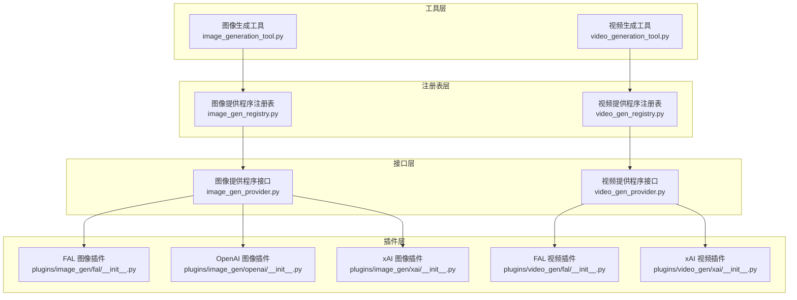
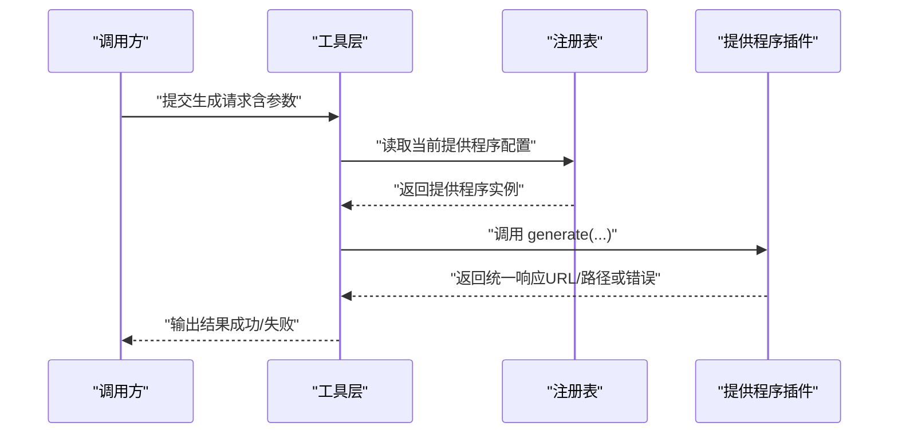
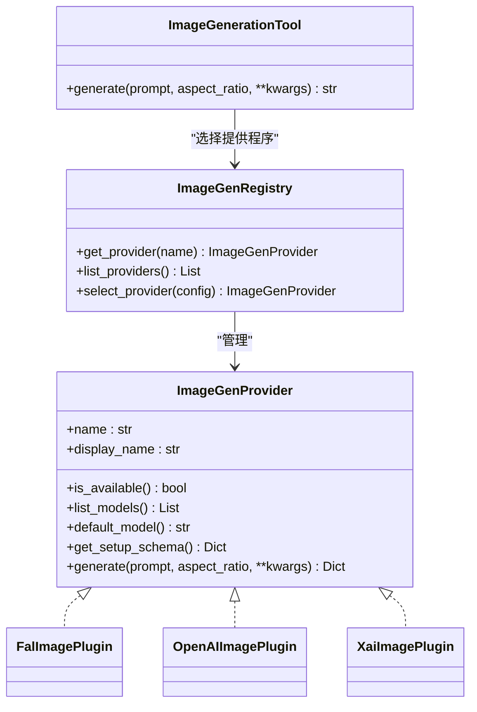
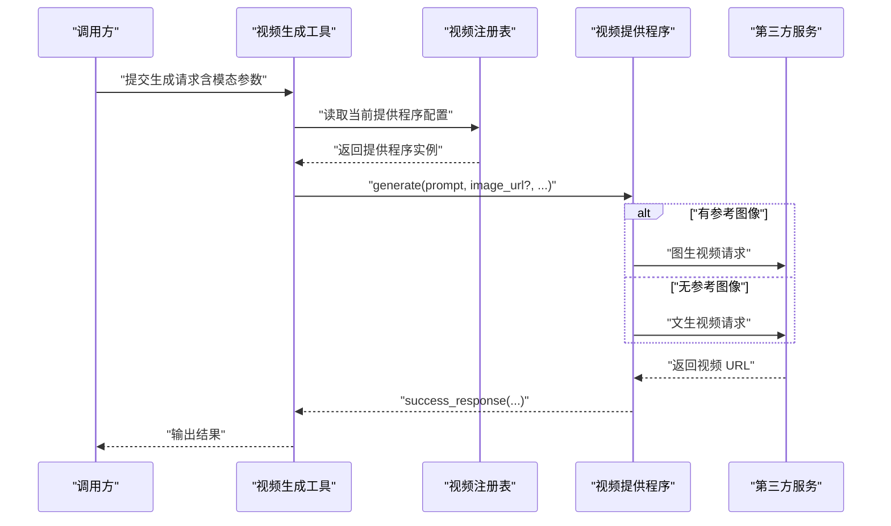
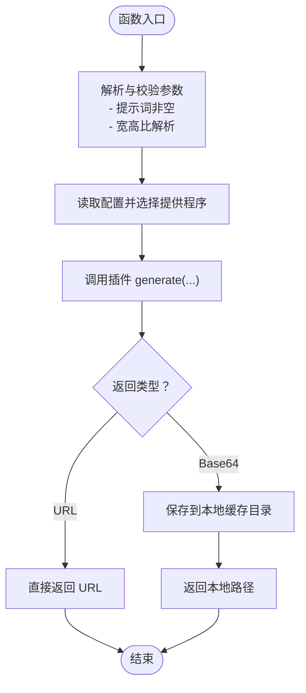
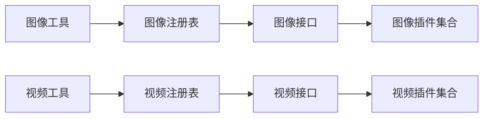

# 媒体生成工具

<cite>
**本文引用的文件**
- [image_gen_provider.py](file://agent/image_gen_provider.py)
- [image_gen_registry.py](file://agent/image_gen_registry.py)
- [video_gen_provider.py](file://agent/video_gen_provider.py)
- [video_gen_registry.py](file://agent/video_gen_registry.py)
- [image_generation_tool.py](file://tools/image_generation_tool.py)
- [video_generation_tool.py](file://tools/video_generation_tool.py)
- [fal 插件（图像）](file://plugins/image_gen/fal/__init__.py)
- [openai 插件（图像）](file://plugins/image_gen/openai/__init__.py)
- [xai 插件（图像）](file://plugins/image_gen/xai/__init__.py)
- [fal 插件（视频）](file://plugins/video_gen/fal/__init__.py)
- [xai 插件（视频）](file://plugins/video_gen/xai/__init__.py)
- [开发者指南：图像生成提供程序插件](file://website/docs/developer-guide/image-gen-provider-plugin.md)
- [开发者指南：视频生成提供程序插件](file://website/docs/developer-guide/video-gen-provider-plugin.md)
- [测试：图像生成插件分发](file://tests/tools/test_image_generation_plugin_dispatch.py)
- [测试：视频生成分发](file://tests/tools/test_video_generation_dispatch.py)
</cite>

## 目录
1. [简介](#简介)
2. [项目结构](#项目结构)
3. [核心组件](#核心组件)
4. [架构总览](#架构总览)
5. [详细组件分析](#详细组件分析)
6. [依赖关系分析](#依赖关系分析)
7. [性能考虑](#性能考虑)
8. [故障排查指南](#故障排查指南)
9. [结论](#结论)
10. [附录](#附录)

## 简介
本技术文档面向“媒体生成工具”，系统性阐述图像生成与视频生成两大能力的实现原理、API 集成方式、生成流程与质量控制策略；覆盖认证机制、配额管理与成本控制建议；提供调用示例路径、结果处理与存储策略；并给出性能优化、批量处理与异步执行的实践建议。同时，文档详述第三方生成服务插件的接入与自定义开发方法，帮助用户高效、安全地使用与扩展媒体生成功能。

## 项目结构
媒体生成工具由“工具层”“注册表层”“提供程序接口层”“插件层”四部分组成：
- 工具层：对外暴露统一的调用入口与参数校验，负责路由到已配置的提供程序。
- 注册表层：维护可用提供程序的索引与选择逻辑，支持动态发现与切换。
- 提供程序接口层：定义图像与视频生成的抽象接口，约束插件实现。
- 插件层：具体对接第三方服务（如 FAL、OpenAI、xAI），封装认证、请求与响应。

图表来源
- [image_generation_tool.py](file://tools/image_generation_tool.py)
- [video_generation_tool.py](file://tools/video_generation_tool.py)
- [image_gen_registry.py](file://agent/image_gen_registry.py)
- [video_gen_registry.py](file://agent/video_gen_registry.py)
- [image_gen_provider.py](file://agent/image_gen_provider.py)
- [video_gen_provider.py](file://agent/video_gen_provider.py)
- [fal 插件（图像）](file://plugins/image_gen/fal/__init__.py)
- [openai 插件（图像）](file://plugins/image_gen/openai/__init__.py)
- [xai 插件（图像）](file://plugins/image_gen/xai/__init__.py)
- [fal 插件（视频）](file://plugins/video_gen/fal/__init__.py)
- [xai 插件（视频）](file://plugins/video_gen/xai/__init__.py)

章节来源
- [image_gen_provider.py](file://agent/image_gen_provider.py)
- [image_gen_registry.py](file://agent/image_gen_registry.py)
- [video_gen_provider.py](file://agent/video_gen_provider.py)
- [video_gen_registry.py](file://agent/video_gen_registry.py)
- [image_generation_tool.py](file://tools/image_generation_tool.py)
- [video_generation_tool.py](file://tools/video_generation_tool.py)

## 核心组件
- 图像生成接口与注册表
  - 接口定义了名称、可用性检查、模型列表、默认模型、设置模式等约定，确保插件一致性。
  - 注册表负责提供程序的发现、选择与路由，支持从配置读取当前提供程序。
- 视频生成接口与注册表
  - 接口定义了名称、可用性检查、模型列表、默认模型、能力声明与设置模式等。
  - 注册表负责在文本/图像两种模态下进行路由，并对异常进行捕获与标准化返回。
- 工具层
  - 图像工具：接收提示词、宽高比等参数，调用注册表解析提供程序并执行生成，最终返回统一的成功/错误响应。
  - 视频工具：接收提示词、时长、分辨率、负向提示等参数，按模态路由到对应插件，返回统一响应。
- 插件层
  - 图像插件：FAL、OpenAI、xAI 等，均通过实现接口完成认证、请求与结果处理（URL 或 Base64）。
  - 视频插件：FAL、xAI 等，按是否传入参考图像决定文本到视频或图生视频路由。

章节来源
- [image_gen_provider.py](file://agent/image_gen_provider.py)
- [image_gen_registry.py](file://agent/image_gen_registry.py)
- [video_gen_provider.py](file://agent/video_gen_provider.py)
- [video_gen_registry.py](file://agent/video_gen_registry.py)
- [image_generation_tool.py](file://tools/image_generation_tool.py)
- [video_generation_tool.py](file://tools/video_generation_tool.py)

## 架构总览
媒体生成工具采用“接口 + 注册表 + 插件”的分层架构，确保可插拔与可扩展性。工具层仅依赖注册表，注册表再依赖接口，插件实现接口并与第三方服务交互。

图表来源
- [image_generation_tool.py](file://tools/image_generation_tool.py)
- [video_generation_tool.py](file://tools/video_generation_tool.py)
- [image_gen_registry.py](file://agent/image_gen_registry.py)
- [video_gen_registry.py](file://agent/video_gen_registry.py)
- [image_gen_provider.py](file://agent/image_gen_provider.py)
- [video_gen_provider.py](file://agent/video_gen_provider.py)

## 详细组件分析

### 图像生成组件分析
- 接口与注册表
  - 接口要求实现名称、可用性检查、模型列表、默认模型、设置模式等，便于统一展示与配置。
  - 注册表负责从配置中读取当前提供程序，并在工具层调用前完成解析与校验。
- 工具层流程
  - 参数校验：宽高比解析、必填项检查。
  - 路由与执行：根据配置选择插件，调用其 generate 并处理返回（URL 或本地缓存路径）。
  - 统一响应：成功/失败格式一致，便于上层消费。
- 插件实现要点
  - 认证：通过环境变量或配置注入密钥。
  - 结果处理：支持返回图片 URL 或 Base64，Base64 将保存至本地缓存目录并返回路径。
  - 错误处理：捕获异常并返回标准化错误响应。

图表来源
- [image_gen_provider.py](file://agent/image_gen_provider.py)
- [image_gen_registry.py](file://agent/image_gen_registry.py)
- [image_generation_tool.py](file://tools/image_generation_tool.py)
- [fal 插件（图像）](file://plugins/image_gen/fal/__init__.py)
- [openai 插件（图像）](file://plugins/image_gen/openai/__init__.py)
- [xai 插件（图像）](file://plugins/image_gen/xai/__init__.py)

章节来源
- [image_gen_provider.py](file://agent/image_gen_provider.py)
- [image_gen_registry.py](file://agent/image_gen_registry.py)
- [image_generation_tool.py](file://tools/image_generation_tool.py)
- [fal 插件（图像）](file://plugins/image_gen/fal/__init__.py)
- [openai 插件（图像）](file://plugins/image_gen/openai/__init__.py)
- [xai 插件（图像）](file://plugins/image_gen/xai/__init__.py)

### 视频生成组件分析
- 接口与注册表
  - 接口要求实现名称、可用性检查、模型列表、默认模型、能力声明与设置模式等。
  - 注册表负责在文本到视频与图生视频之间进行路由，并对异常进行捕获与标准化返回。
- 工具层流程
  - 参数校验：提示词必填、时长/分辨率/宽高比等参数解析。
  - 路由与执行：若提供参考图像则走图生视频，否则走文本到视频。
  - 统一响应：返回视频 URL、模态、时长、分辨率等信息。
- 插件实现要点
  - 模态路由：依据是否传入图像 URL 决定 endpoint。
  - 能力声明：通过 capabilities 返回支持的模态、宽高比、分辨率、时长范围等。
  - 错误处理：捕获异常并返回标准化错误响应。

图表来源
- [video_generation_tool.py](file://tools/video_generation_tool.py)
- [video_gen_registry.py](file://agent/video_gen_registry.py)
- [video_gen_provider.py](file://agent/video_gen_provider.py)
- [fal 插件（视频）](file://plugins/video_gen/fal/__init__.py)
- [xai 插件（视频）](file://plugins/video_gen/xai/__init__.py)

章节来源
- [video_gen_provider.py](file://agent/video_gen_provider.py)
- [video_gen_registry.py](file://agent/video_gen_registry.py)
- [video_generation_tool.py](file://tools/video_generation_tool.py)
- [fal 插件（视频）](file://plugins/video_gen/fal/__init__.py)
- [xai 插件（视频）](file://plugins/video_gen/xai/__init__.py)

### 复杂逻辑流程（以图像生成为例）

图表来源
- [image_generation_tool.py](file://tools/image_generation_tool.py)
- [image_gen_provider.py](file://agent/image_gen_provider.py)

章节来源
- [image_generation_tool.py](file://tools/image_generation_tool.py)
- [image_gen_provider.py](file://agent/image_gen_provider.py)

## 依赖关系分析
- 组件耦合
  - 工具层仅依赖注册表，注册表依赖接口，插件实现接口，形成清晰的单向依赖。
  - 提供程序与第三方服务解耦，便于替换与扩展。
- 外部依赖
  - 插件通过环境变量或配置注入密钥，调用第三方服务 API。
  - 结果可能返回 URL 或 Base64，Base64 会写入本地缓存目录，便于后续复用与审计。

图表来源
- [image_generation_tool.py](file://tools/image_generation_tool.py)
- [video_generation_tool.py](file://tools/video_generation_tool.py)
- [image_gen_registry.py](file://agent/image_gen_registry.py)
- [video_gen_registry.py](file://agent/video_gen_registry.py)
- [image_gen_provider.py](file://agent/image_gen_provider.py)
- [video_gen_provider.py](file://agent/video_gen_provider.py)

章节来源
- [image_gen_registry.py](file://agent/image_gen_registry.py)
- [video_gen_registry.py](file://agent/video_gen_registry.py)

## 性能考虑
- 批量处理
  - 工具层支持多轮生成请求，可在应用侧聚合请求后逐个调用，减少重复初始化开销。
- 异步执行
  - 可在应用层对多个生成任务并发调度，结合插件端的限流与重试策略，提升吞吐。
- 缓存与复用
  - 对于 Base64 结果，插件会将其保存到本地缓存目录，便于后续复用与审计。
- 参数优化
  - 合理选择模型与分辨率，避免不必要的高成本与高时延。
- 路由与降级
  - 在注册表层可实现多提供程序的负载均衡与故障转移，提升稳定性。

## 故障排查指南
- 常见问题与定位
  - 提示词为空：工具层会返回明确的错误信息，需检查输入参数。
  - 提供程序不可用：检查环境变量与依赖库是否满足插件的可用性条件。
  - 插件异常：工具层会捕获异常并返回标准化错误，查看错误类型与消息定位问题。
- 测试验证
  - 图像生成插件分发测试覆盖了正确路由与缺失提供程序的错误场景。
  - 视频生成分发测试覆盖了模态路由、必填参数校验与异常捕获。

章节来源
- [测试：图像生成插件分发](file://tests/tools/test_image_generation_plugin_dispatch.py)
- [测试：视频生成分发](file://tests/tools/test_video_generation_dispatch.py)

## 结论
媒体生成工具通过接口与注册表实现了对多种第三方服务的统一接入，工具层提供一致的调用体验与结果格式。借助插件化设计，用户可以快速集成新服务、定制参数与质量策略，并在应用层实现批量与异步处理。配合完善的错误处理与测试覆盖，系统具备良好的可维护性与可扩展性。

## 附录

### 支持的生成服务与参数配置
- 图像生成
  - 支持的服务：FAL、OpenAI、xAI 等（以插件形式接入）。
  - 关键参数：提示词、宽高比、模型选择、环境变量注入等。
  - 结果形态：URL 或本地缓存路径（Base64）。
- 视频生成
  - 支持的服务：FAL、xAI 等（以插件形式接入）。
  - 关键参数：提示词、时长、分辨率、宽高比、负向提示、参考图像等。
  - 路由规则：存在参考图像时走图生视频，否则走文生视频。

章节来源
- [fal 插件（图像）](file://plugins/image_gen/fal/__init__.py)
- [openai 插件（图像）](file://plugins/image_gen/openai/__init__.py)
- [xai 插件（图像）](file://plugins/image_gen/xai/__init__.py)
- [fal 插件（视频）](file://plugins/video_gen/fal/__init__.py)
- [xai 插件（视频）](file://plugins/video_gen/xai/__init__.py)

### 认证机制与配额管理
- 认证机制
  - 插件通过环境变量或配置注入密钥，接口层提供可用性检查，确保凭据完整。
- 配额与成本控制
  - 插件在接口层提供模型价格信息，便于在应用层进行成本估算与预算控制。
  - 建议在应用层引入速率限制与重试策略，避免触发第三方服务限流。

章节来源
- [image_gen_provider.py](file://agent/image_gen_provider.py)
- [video_gen_provider.py](file://agent/video_gen_provider.py)

### 调用示例与结果处理
- 示例路径
  - 图像生成：参见工具层生成流程与插件返回处理。
  - 视频生成：参见工具层路由与插件返回处理。
- 结果处理与存储
  - URL：直接使用第三方 CDN 地址。
  - Base64：保存到本地缓存目录，返回本地路径以便复用与审计。

章节来源
- [image_generation_tool.py](file://tools/image_generation_tool.py)
- [video_generation_tool.py](file://tools/video_generation_tool.py)

### 第三方生成服务插件的集成与自定义
- 开发步骤
  - 实现接口类，提供名称、可用性检查、模型列表、默认模型、设置模式与生成方法。
  - 在插件入口注册提供程序实例。
- 文档参考
  - 图像生成提供程序插件开发指南。
  - 视频生成提供程序插件开发指南。

章节来源
- [开发者指南：图像生成提供程序插件](file://website/docs/developer-guide/image-gen-provider-plugin.md)
- [开发者指南：视频生成提供程序插件](file://website/docs/developer-guide/video-gen-provider-plugin.md)