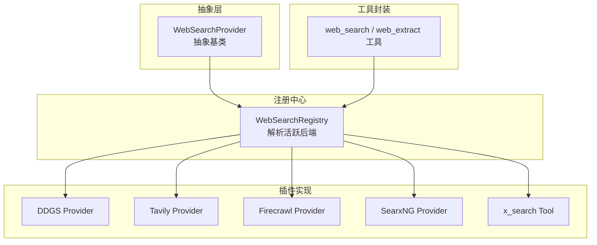
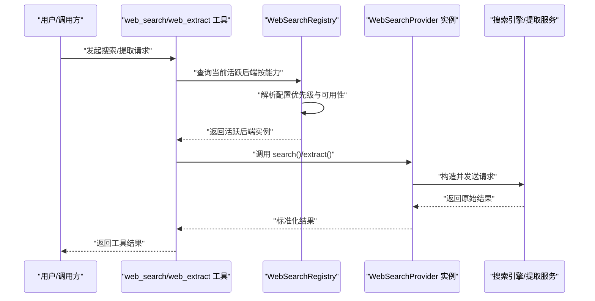
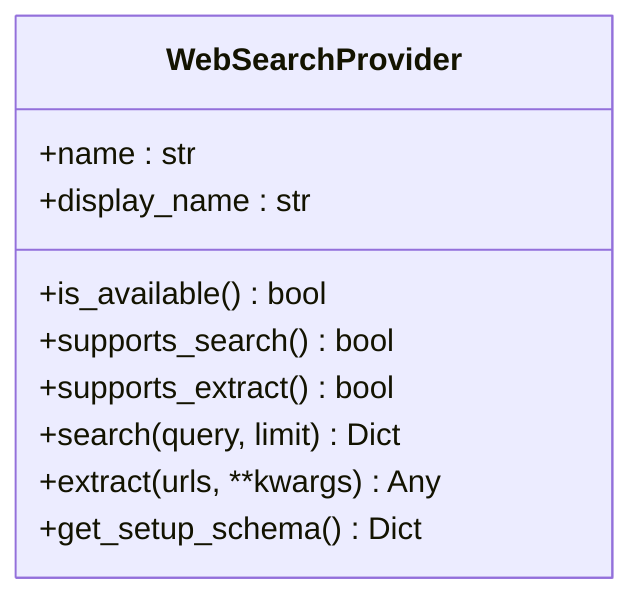
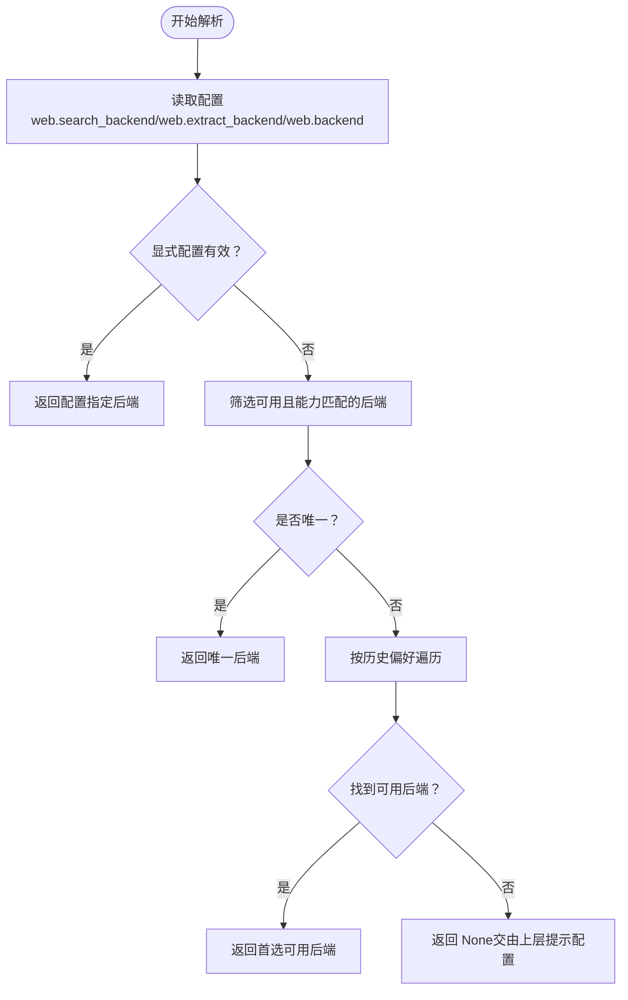
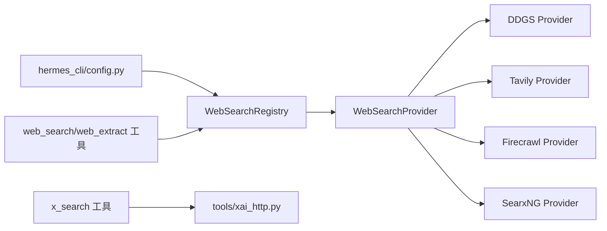

# 网络搜索工具

<cite>
**本文引用的文件**
- [agent/web_search_provider.py](file://agent/web_search_provider.py)
- [agent/web_search_registry.py](file://agent/web_search_registry.py)
- [tools/x_search_tool.py](file://tools/x_search_tool.py)
- [plugins/web/ddgs/provider.py](file://plugins/web/ddgs/provider.py)
- [plugins/web/tavily/provider.py](file://plugins/web/tavily/provider.py)
- [plugins/web/firecrawl/provider.py](file://plugins/web/firecrawl/provider.py)
- [plugins/web/searxng/provider.py](file://plugins/web/searxng/provider.py)
- [website/docs/developer-guide/web-search-provider-plugin.md](file://website/docs/developer-guide/web-search-provider-plugin.md)
- [tests/tools/test_x_search_tool.py](file://tests/tools/test_x_search_tool.py)
- [tests/tools/test_web_tools_tavily.py](file://tests/tools/test_web_tools_tavily.py)
- [tests/tools/test_web_providers_ddgs.py](file://tests/tools/test_web_providers_ddgs.py)
- [tests/tools/test_web_providers_searxng.py](file://tests/tools/test_web_providers_searxng.py)
- [hermes_cli/config.py](file://hermes_cli/config.py)
- [tools/xai_http.py](file://tools/xai_http.py)
</cite>

## 目录
1. [简介](#简介)
2. [项目结构](#项目结构)
3. [核心组件](#核心组件)
4. [架构总览](#架构总览)
5. [详细组件分析](#详细组件分析)
6. [依赖关系分析](#依赖关系分析)
7. [性能考虑](#性能考虑)
8. [故障排查指南](#故障排查指南)
9. [结论](#结论)
10. [附录](#附录)

## 简介
本技术文档面向“网络搜索工具”的使用者与开发者，系统性阐述其架构设计、API 集成与查询处理机制。文档覆盖以下要点：
- 支持的搜索引擎与内容提取后端（内置插件：DDGS、Tavily、Firecrawl、SearxNG；以及 xAI 的专用搜索工具）。
- 查询参数与结果格式规范，包括搜索与提取两类能力的响应契约。
- 工具的配置项、认证设置与使用限制。
- 调用示例、结果解析与错误处理流程。
- 性能优化、缓存策略与并发控制建议。
- 第三方搜索引擎插件的集成方式与自定义开发指引。
- 最佳实践与常见问题排查。

## 项目结构
网络搜索工具由“抽象后端接口 + 注册中心 + 具体插件 + 工具封装”四部分构成：
- 抽象后端接口：定义统一的搜索/提取能力与能力声明。
- 注册中心：负责在运行时解析并选择当前活跃后端，支持按能力维度独立配置。
- 插件实现：各搜索引擎或服务的具体适配器，遵循统一接口。
- 工具封装：面向用户的工具入口，负责参数校验、重试与错误包装。

图表来源
- [agent/web_search_provider.py:63-186](file://agent/web_search_provider.py#L63-L186)
- [agent/web_search_registry.py:44-246](file://agent/web_search_registry.py#L44-L246)
- [tools/x_search_tool.py:274-526](file://tools/x_search_tool.py#L274-L526)

章节来源
- [agent/web_search_provider.py:1-186](file://agent/web_search_provider.py#L1-L186)
- [agent/web_search_registry.py:1-246](file://agent/web_search_registry.py#L1-L246)
- [tools/x_search_tool.py:1-526](file://tools/x_search_tool.py#L1-L526)

## 核心组件
- WebSearchProvider 抽象基类：定义名称、可用性检查、能力声明（搜索/提取）、具体实现方法与配置提示等。
- WebSearchRegistry 注册中心：集中管理已注册的后端，依据配置优先级与可用性解析当前活跃后端，并提供查询/提取的路由。
- 具体插件：如 DDGS、Tavily、Firecrawl、SearxNG 等，均实现 WebSearchProvider 并通过插件机制注册到注册中心。
- x_search 工具：基于 xAI 的 responses API，提供专用的 X（原 Twitter）搜索能力，具备参数校验、降级检测与重试逻辑。

章节来源
- [agent/web_search_provider.py:63-186](file://agent/web_search_provider.py#L63-L186)
- [agent/web_search_registry.py:44-246](file://agent/web_search_registry.py#L44-L246)
- [tools/x_search_tool.py:274-526](file://tools/x_search_tool.py#L274-L526)

## 架构总览
下图展示从工具调用到后端执行的整体流程，以及注册中心的解析规则。

图表来源
- [agent/web_search_registry.py:133-219](file://agent/web_search_registry.py#L133-L219)
- [agent/web_search_provider.py:116-158](file://agent/web_search_provider.py#L116-L158)

章节来源
- [agent/web_search_registry.py:98-219](file://agent/web_search_registry.py#L98-L219)
- [agent/web_search_provider.py:63-186](file://agent/web_search_provider.py#L63-L186)

## 详细组件分析

### 抽象后端接口：WebSearchProvider
- 角色定位：所有搜索引擎/提取服务的统一适配面，确保工具层无需关心具体实现差异。
- 关键属性与方法：
  - name/display_name：稳定标识与显示名。
  - is_available()：快速可用性检查（不进行网络调用）。
  - supports_search()/supports_extract()：声明能力，支持异步实现。
  - search(query, limit)/extract(urls, **kwargs)：标准输入输出契约。
  - get_setup_schema()：向工具界面提供配置提示（如环境变量、标签等）。
- 响应契约：
  - 搜索结果：包含 success 与 data.web 列表，每条包含 title/url/description/position。
  - 提取结果：包含 success 与 data 列表，每条包含 url/title/content/raw_content/metadata 及可选 error。
  - 失败：返回 success=false 与 error 字段。

图表来源
- [agent/web_search_provider.py:63-186](file://agent/web_search_provider.py#L63-L186)

章节来源
- [agent/web_search_provider.py:22-50](file://agent/web_search_provider.py#L22-L50)
- [agent/web_search_provider.py:116-186](file://agent/web_search_provider.py#L116-L186)

### 注册中心：WebSearchRegistry
- 职责：集中注册与解析活跃后端，支持按能力维度独立配置。
- 解析规则（优先级）：
  1) 显式配置（web.search_backend 或 web.extract_backend）优先，即使不可用也保持显式意图。
  2) 若仅有一个能力匹配且可用，直接采用。
  3) 否则按历史偏好顺序遍历（受 is_available 安全包裹），选择首个满足条件者。
- 线程安全：内部使用锁保护注册表访问。
- 配置读取：通过配置加载器读取 web.backend / web.search_backend / web.extract_backend。

图表来源
- [agent/web_search_registry.py:133-219](file://agent/web_search_registry.py#L133-L219)

章节来源
- [agent/web_search_registry.py:98-219](file://agent/web_search_registry.py#L98-L219)

### 具体插件实现概览
- DDGS（DuckDuckGo Instant Answer API）
  - 能力：搜索
  - 关键点：遵循搜索响应契约，参数校验与限流处理。
  - 参考路径：[plugins/web/ddgs/provider.py](file://plugins/web/ddgs/provider.py)
  - 测试参考：[tests/tools/test_web_providers_ddgs.py](file://tests/tools/test_web_providers_ddgs.py)

- Tavily
  - 能力：搜索、提取
  - 关键点：多能力后端，支持异步提取；响应标准化。
  - 参考路径：[plugins/web/tavily/provider.py](file://plugins/web/tavily/provider.py)
  - 测试参考：[tests/tools/test_web_tools_tavily.py](file://tests/tools/test_web_tools_tavily.py)

- Firecrawl
  - 能力：搜索、提取、爬取
  - 关键点：功能最全的多能力后端之一，适合复杂内容提取场景。
  - 参考路径：[plugins/web/firecrawl/provider.py](file://plugins/web/firecrawl/provider.py)

- SearxNG
  - 能力：搜索
  - 关键点：开源自建搜索引擎聚合，适合隐私与合规要求较高的场景。
  - 参考路径：[plugins/web/searxng/provider.py](file://plugins/web/searxng/provider.py)
  - 测试参考：[tests/tools/test_web_providers_searxng.py](file://tests/tools/test_web_providers_searxng.py)

- x_search 工具（xAI）
  - 能力：专用 X（原 Twitter）搜索
  - 关键点：参数校验（日期范围、句柄列表上限）、降级检测（无引用时标记 degraded）、重试与错误包装。
  - 参考路径：[tools/x_search_tool.py:274-526](file://tools/x_search_tool.py#L274-L526)

章节来源
- [plugins/web/ddgs/provider.py](file://plugins/web/ddgs/provider.py)
- [plugins/web/tavily/provider.py](file://plugins/web/tavily/provider.py)
- [plugins/web/firecrawl/provider.py](file://plugins/web/firecrawl/provider.py)
- [plugins/web/searxng/provider.py](file://plugins/web/searxng/provider.py)
- [tools/x_search_tool.py:274-526](file://tools/x_search_tool.py#L274-L526)

### 开发者插件指南
- 继承 WebSearchProvider，实现 name/is_available/supported_* 与 search/extract。
- 响应必须严格遵循“搜索/提取”契约，以保证工具层无需二次转换。
- 通过插件机制注册，遵循插件目录结构与清单文件约定。
- 可参考官方开发文档中的最小实现示例与契约说明。

章节来源
- [website/docs/developer-guide/web-search-provider-plugin.md:44-114](file://website/docs/developer-guide/web-search-provider-plugin.md#L44-L114)
- [agent/web_search_provider.py:22-50](file://agent/web_search_provider.py#L22-L50)

## 依赖关系分析
- 工具层依赖注册中心进行后端选择；注册中心依赖配置模块读取用户配置。
- 具体插件实现依赖各自供应商的 SDK 或 HTTP 接口。
- x_search 工具依赖 xAI 的 responses API 与认证模块。

图表来源
- [agent/web_search_registry.py:98-113](file://agent/web_search_registry.py#L98-L113)
- [hermes_cli/config.py](file://hermes_cli/config.py)
- [tools/xai_http.py](file://tools/xai_http.py)

章节来源
- [agent/web_search_registry.py:98-113](file://agent/web_search_registry.py#L98-L113)
- [hermes_cli/config.py](file://hermes_cli/config.py)
- [tools/xai_http.py](file://tools/xai_http.py)

## 性能考虑
- 连接与超时
  - 合理设置请求超时与重试次数，避免长时间阻塞影响用户体验。
  - 对上游不稳定的服务启用指数回退与最大等待时间，降低抖动影响。
- 并发控制
  - 在工具层对并发请求进行节流，避免触发下游限流或自身资源耗尽。
  - 对于提取类任务，建议批量处理并分批提交，结合异步实现提升吞吐。
- 结果缓存
  - 对高频、低变化的查询结果进行短期缓存，减少重复请求。
  - 缓存键建议包含查询文本、时间范围与后端标识，避免误命中。
- 输出裁剪
  - 对提取内容进行长度与格式限制，避免过大数据影响后续处理链路。
- 日志与可观测性
  - 记录关键指标（成功率、延迟、重试次数、降级比例），便于性能评估与优化。

## 故障排查指南
- 无法解析活跃后端
  - 检查配置项 web.backend / web.search_backend / web.extract_backend 是否正确设置。
  - 确认 is_available 返回为真，否则会进入回退逻辑。
  - 参考：[agent/web_search_registry.py:133-219](file://agent/web_search_registry.py#L133-L219)
- 搜索结果为空或降级
  - x_search 在使用过滤条件（句柄、日期）时若无引用，会标记 degraded，需放宽条件或移除过滤。
  - 参考：[tools/x_search_tool.py:376-400](file://tools/x_search_tool.py#L376-L400)
- 认证失败
  - 确认 xAI 凭据来源（OAuth 或 API Key）有效且未过期。
  - 参考：[tools/x_search_tool.py:105-140](file://tools/x_search_tool.py#L105-L140)
- 参数错误
  - 日期格式必须为 YYYY-MM-DD，且起始日期不能晚于今日 UTC；句柄列表上限为 10。
  - 参考：[tools/x_search_tool.py:157-206](file://tools/x_search_tool.py#L157-L206)
- 上游错误
  - 对 HTTP 5xx 错误进行重试；对超时与连接错误进行退避重试。
  - 参考：[tools/x_search_tool.py:330-366](file://tools/x_search_tool.py#L330-L366)

章节来源
- [agent/web_search_registry.py:133-219](file://agent/web_search_registry.py#L133-L219)
- [tools/x_search_tool.py:105-206](file://tools/x_search_tool.py#L105-L206)
- [tools/x_search_tool.py:330-452](file://tools/x_search_tool.py#L330-L452)

## 结论
该网络搜索工具体系通过统一的抽象接口与注册中心，实现了对多种搜索引擎与提取服务的无缝集成。借助明确的响应契约、完善的配置与认证机制，以及针对 xAI 的专用工具，系统在易用性、扩展性与稳定性方面达到良好平衡。建议在生产环境中结合缓存、限流与监控，持续优化性能与可靠性。

## 附录

### 配置与认证
- 配置项
  - web.backend：共享回退后端。
  - web.search_backend：搜索能力专属后端。
  - web.extract_backend：提取能力专属后端。
  - x_search.*：模型、超时、重试等工具级配置。
- 认证
  - x_search：支持 xAI OAuth（SuperGrok）与 XAI_API_KEY。
  - 各插件：通常通过环境变量或插件配置提供凭据。

章节来源
- [agent/web_search_registry.py:10-31](file://agent/web_search_registry.py#L10-L31)
- [tools/x_search_tool.py:69-99](file://tools/x_search_tool.py#L69-L99)
- [tools/x_search_tool.py:105-140](file://tools/x_search_tool.py#L105-L140)

### 查询参数与结果处理
- 搜索参数
  - query：查询词。
  - limit：结果数量上限（不同后端可能有不同限制）。
- 提取参数
  - urls：待提取的 URL 列表。
  - kwargs：未来兼容字段（如 format/include_raw/max_chars）。
- 结果格式
  - 成功：success=true，数据结构见“响应契约”。
  - 失败：success=false，error 字段描述错误原因。

章节来源
- [agent/web_search_provider.py:22-50](file://agent/web_search_provider.py#L22-L50)
- [agent/web_search_provider.py:116-158](file://agent/web_search_provider.py#L116-L158)

### 使用示例与最佳实践
- 示例
  - 使用 hermes tools 选择并配置后端，随后在对话中调用 web_search/web_extract。
  - x_search：传入 query 与可选的句柄/日期过滤，解析返回的 answer 与 citations。
- 最佳实践
  - 明确区分“搜索”与“提取”，根据场景选择合适能力。
  - 对高价值查询开启缓存，对不稳定上游启用重试。
  - 在工具层对结果进行二次清洗与裁剪，确保下游稳定消费。

章节来源
- [tools/x_search_tool.py:274-526](file://tools/x_search_tool.py#L274-L526)
- [tests/tools/test_x_search_tool.py](file://tests/tools/test_x_search_tool.py)