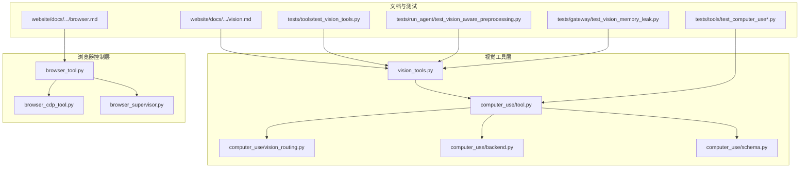
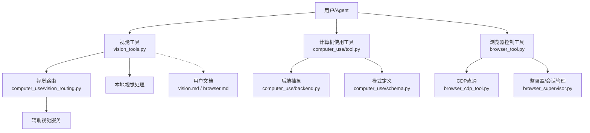
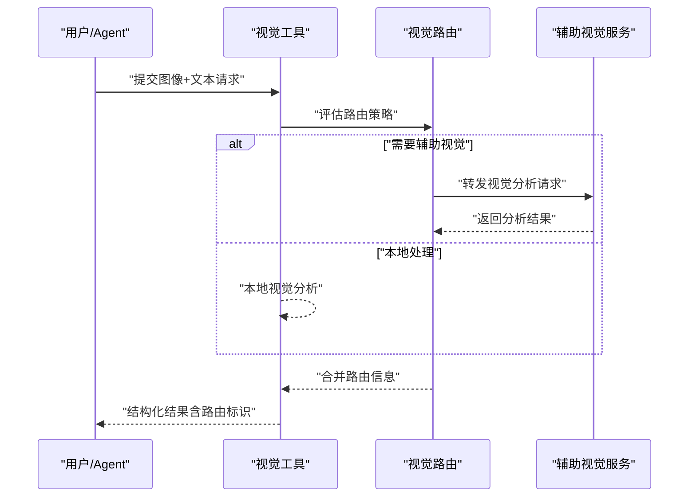
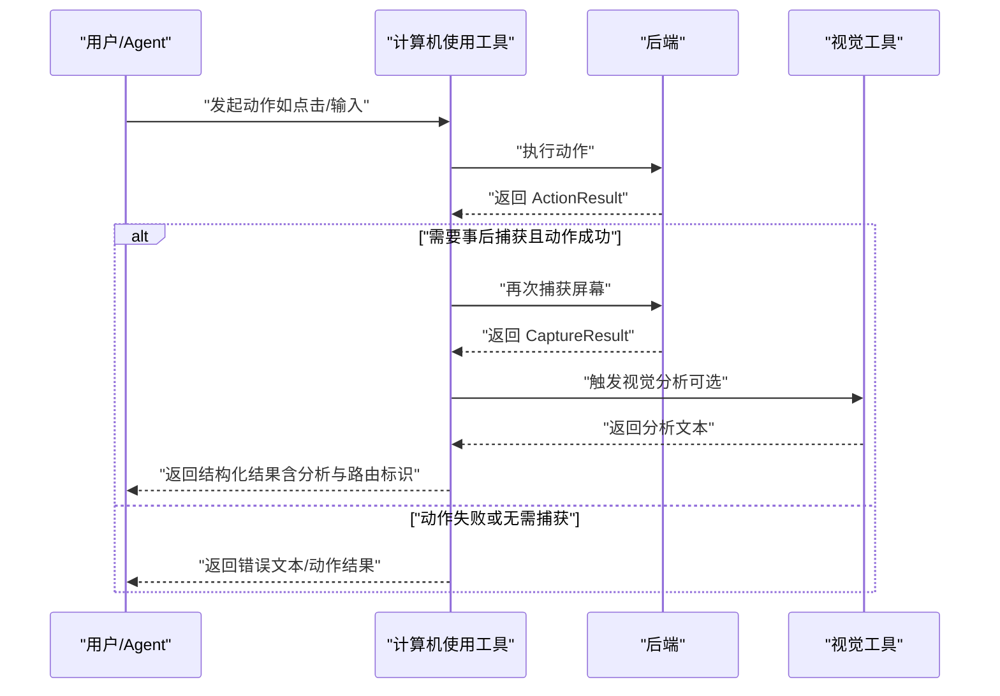
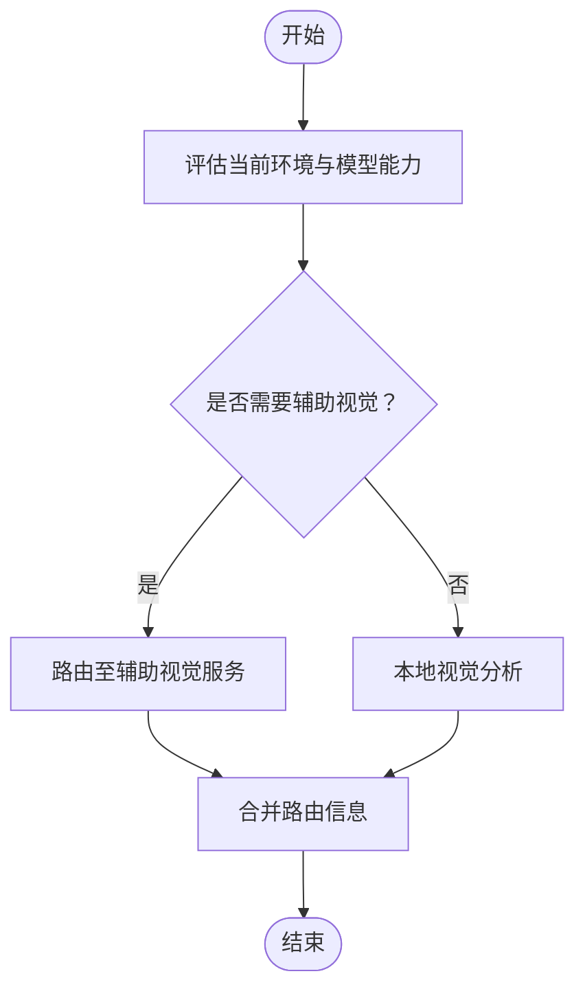
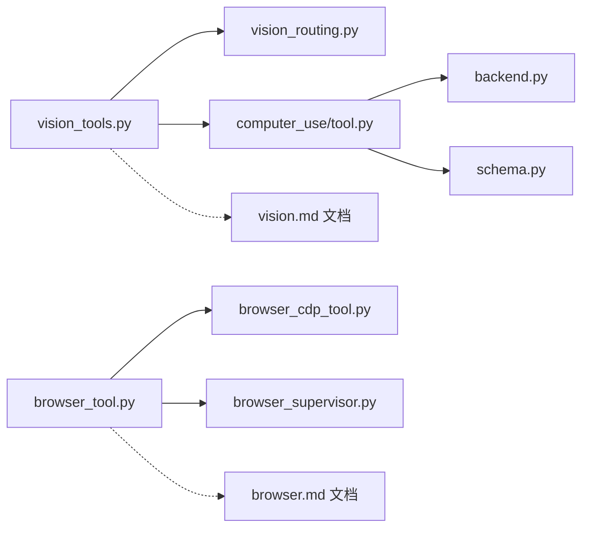

# 视觉工具

<cite>
**本文引用的文件**
- [tools/vision_tools.py](file://tools/vision_tools.py)
- [tools/computer_use/tool.py](file://tools/computer_use/tool.py)
- [tools/computer_use/vision_routing.py](file://tools/computer_use/vision_routing.py)
- [tools/computer_use/backend.py](file://tools/computer_use/backend.py)
- [tools/computer_use/schema.py](file://tools/computer_use/schema.py)
- [tools/browser_tool.py](file://tools/browser_tool.py)
- [tools/browser_cdp_tool.py](file://tools/browser_cdp_tool.py)
- [tools/browser_supervisor.py](file://tools/browser_supervisor.py)
- [website/docs/user-guide/features/vision.md](file://website/docs/user-guide/features/vision.md)
- [website/i18n/zh-Hans/docusaurus-plugin-content-docs/current/user-guide/features/vision.md](file://website/i18n/zh-Hans/docusaurus-plugin-content-docs/current/user-guide/features/vision.md)
- [website/docs/user-guide/features/browser.md](file://website/docs/user-guide/features/browser.md)
- [website/i18n/zh-Hans/docusaurus-plugin-content-docs/current/user-guide/features/browser.md](file://website/i18n/zh-Hans/docusaurus-plugin-content-docs/current/user-guide/features/browser.md)
- [tests/tools/test_vision_tools.py](file://tests/tools/test_vision_tools.py)
- [tests/tools/test_computer_use.py](file://tests/tools/test_computer_use.py)
- [tests/tools/test_computer_use_vision_routing.py](file://tests/tools/test_computer_use_vision_routing.py)
- [tests/tools/test_computer_use_capture_routing.py](file://tests/tools/test_computer_use_capture_routing.py)
- [tests/run_agent/test_vision_aware_preprocessing.py](file://tests/run_agent/test_vision_aware_preprocessing.py)
- [tests/gateway/test_vision_memory_leak.py](file://tests/gateway/test_vision_memory_leak.py)
</cite>

## 目录
1. [简介](#简介)
2. [项目结构](#项目结构)
3. [核心组件](#核心组件)
4. [架构总览](#架构总览)
5. [详细组件分析](#详细组件分析)
6. [依赖关系分析](#依赖关系分析)
7. [性能考量](#性能考量)
8. [故障排查指南](#故障排查指南)
9. [结论](#结论)
10. [附录](#附录)

## 简介
本技术文档围绕“视觉工具”展开，系统性阐述计算机视觉工具、浏览器控制工具以及视觉处理工具的实现原理、数据流与控制流，并结合测试与用户文档，给出配置参数、权限与安全注意事项、调用示例、结果分析、错误处理策略、性能优化建议、并发与资源管理、扩展开发与自定义集成方法，以及面向用户的使用指南与最佳实践。

## 项目结构
视觉工具相关代码主要分布在以下模块：
- 计算机视觉与屏幕捕获：tools/computer_use/*（工具入口、路由、后端、模式定义）
- 通用视觉工具：tools/vision_tools.py（多模态输入封装、视觉分析路由）
- 浏览器控制工具：tools/browser_tool.py、tools/browser_cdp_tool.py、tools/browser_supervisor.py（导航、CDP直通、控制台、对话框等）
- 用户文档与国际化文档：website/docs/user-guide/features/vision.md、website/docs/user-guide/features/browser.md 及其中文版本
- 测试用例：tests/tools/test_vision_tools.py、tests/tools/test_computer_use*.py、tests/run_agent/test_vision_aware_preprocessing.py、tests/gateway/test_vision_memory_leak.py

图表来源
- [tools/vision_tools.py](file://tools/vision_tools.py)
- [tools/computer_use/tool.py](file://tools/computer_use/tool.py)
- [tools/computer_use/vision_routing.py](file://tools/computer_use/vision_routing.py)
- [tools/computer_use/backend.py](file://tools/computer_use/backend.py)
- [tools/computer_use/schema.py](file://tools/computer_use/schema.py)
- [tools/browser_tool.py](file://tools/browser_tool.py)
- [tools/browser_cdp_tool.py](file://tools/browser_cdp_tool.py)
- [tools/browser_supervisor.py](file://tools/browser_supervisor.py)
- [website/docs/user-guide/features/vision.md](file://website/docs/user-guide/features/vision.md)
- [website/docs/user-guide/features/browser.md](file://website/docs/user-guide/features/browser.md)
- [tests/tools/test_vision_tools.py](file://tests/tools/test_vision_tools.py)
- [tests/tools/test_computer_use.py](file://tests/tools/test_computer_use.py)
- [tests/run_agent/test_vision_aware_preprocessing.py](file://tests/run_agent/test_vision_aware_preprocessing.py)
- [tests/gateway/test_vision_memory_leak.py](file://tests/gateway/test_vision_memory_leak.py)

章节来源
- [tools/vision_tools.py](file://tools/vision_tools.py)
- [tools/computer_use/tool.py](file://tools/computer_use/tool.py)
- [tools/computer_use/vision_routing.py](file://tools/computer_use/vision_routing.py)
- [tools/computer_use/backend.py](file://tools/computer_use/backend.py)
- [tools/computer_use/schema.py](file://tools/computer_use/schema.py)
- [tools/browser_tool.py](file://tools/browser_tool.py)
- [tools/browser_cdp_tool.py](file://tools/browser_cdp_tool.py)
- [tools/browser_supervisor.py](file://tools/browser_supervisor.py)
- [website/docs/user-guide/features/vision.md](file://website/docs/user-guide/features/vision.md)
- [website/docs/user-guide/features/browser.md](file://website/docs/user-guide/features/browser.md)

## 核心组件
- 视觉工具入口与多模态封装：封装图像与文本输入，支持将视觉分析路由至辅助视觉服务，生成结构化结果。
- 计算机视觉与屏幕捕获：统一的计算机使用工具，支持多种动作（点击、拖拽、滚动、输入、聚焦应用等），并可进行“事后捕获”以验证操作结果。
- 视觉路由：根据后端能力与模型支持情况，决定是否将视觉分析经由辅助视觉服务处理。
- 后端抽象：定义捕获、动作执行等接口，便于替换不同平台的实现。
- 浏览器控制：提供导航、控制台读取、CDP直通、对话框处理等能力，支持与视觉分析联动。

章节来源
- [tools/vision_tools.py](file://tools/vision_tools.py)
- [tools/computer_use/tool.py](file://tools/computer_use/tool.py)
- [tools/computer_use/vision_routing.py](file://tools/computer_use/vision_routing.py)
- [tools/computer_use/backend.py](file://tools/computer_use/backend.py)
- [tools/computer_use/schema.py](file://tools/computer_use/schema.py)
- [tools/browser_tool.py](file://tools/browser_tool.py)
- [tools/browser_cdp_tool.py](file://tools/browser_cdp_tool.py)
- [tools/browser_supervisor.py](file://tools/browser_supervisor.py)

## 架构总览
视觉工具的整体架构围绕“输入多模态（图像+文本）—路由决策（本地/辅助视觉）—处理与结果封装”的主线展开。计算机视觉与浏览器控制工具分别承担“屏幕捕获/自动化操作”和“网页内容与交互”的职责，二者均可与视觉分析流程协同工作。

图表来源
- [tools/vision_tools.py](file://tools/vision_tools.py)
- [tools/computer_use/vision_routing.py](file://tools/computer_use/vision_routing.py)
- [tools/computer_use/tool.py](file://tools/computer_use/tool.py)
- [tools/computer_use/backend.py](file://tools/computer_use/backend.py)
- [tools/computer_use/schema.py](file://tools/computer_use/schema.py)
- [tools/browser_tool.py](file://tools/browser_tool.py)
- [tools/browser_cdp_tool.py](file://tools/browser_cdp_tool.py)
- [tools/browser_supervisor.py](file://tools/browser_supervisor.py)
- [website/docs/user-guide/features/vision.md](file://website/docs/user-guide/features/vision.md)
- [website/docs/user-guide/features/browser.md](file://website/docs/user-guide/features/browser.md)

## 详细组件分析

### 视觉工具（vision_tools.py）
- 多模态输入封装：将图像与文本输入统一为工具调用参数，确保下游视觉分析组件可稳定接收。
- 视觉分析路由：根据当前环境与模型能力，选择本地处理或经由辅助视觉服务处理，提升兼容性与准确性。
- 结果封装：输出结构化结果，包含模式、尺寸、元素信息、摘要、视觉分析文本及路由标识，便于上层消费与展示。

图表来源
- [tools/vision_tools.py](file://tools/vision_tools.py)
- [tools/computer_use/vision_routing.py](file://tools/computer_use/vision_routing.py)

章节来源
- [tools/vision_tools.py](file://tools/vision_tools.py)
- [website/docs/user-guide/features/vision.md](file://website/docs/user-guide/features/vision.md)
- [website/i18n/zh-Hans/docusaurus-plugin-content-docs/current/user-guide/features/vision.md](file://website/i18n/zh-Hans/docusaurus-plugin-content-docs/current/user-guide/features/vision.md)

### 计算机使用工具（computer_use/tool.py）
- 统一动作接口：提供点击、拖拽、滚动、输入、按键、聚焦应用、设置值等动作，所有动作均通过后端执行。
- 捕获与验证：支持“事后捕获”（capture_after），在动作成功后重新捕获屏幕，比较前后状态以确认操作效果；若动作失败则跳过捕获，避免误导。
- 结果封装：将动作结果与捕获元数据（模式、尺寸、应用、窗口标题、元素列表、摘要、视觉分析文本、路由标识）合并为统一响应。

图表来源
- [tools/computer_use/tool.py](file://tools/computer_use/tool.py)
- [tools/computer_use/backend.py](file://tools/computer_use/backend.py)
- [tools/vision_tools.py](file://tools/vision_tools.py)

章节来源
- [tools/computer_use/tool.py](file://tools/computer_use/tool.py)
- [tools/computer_use/backend.py](file://tools/computer_use/backend.py)
- [tests/tools/test_computer_use.py](file://tests/tools/test_computer_use.py)
- [tests/tools/test_computer_use_capture_routing.py](file://tests/tools/test_computer_use_capture_routing.py)

### 视觉路由（computer_use/vision_routing.py）
- 路由策略：提供“是否应将捕获路由至辅助视觉”的判断逻辑，内部辅助函数可被测试替换，保证可测试性与可维护性。
- 导出与可达性：关键路由函数与内部辅助函数均导出，便于外部测试与调试。

图表来源
- [tools/computer_use/vision_routing.py](file://tools/computer_use/vision_routing.py)
- [tests/tools/test_computer_use_vision_routing.py](file://tests/tools/test_computer_use_vision_routing.py)

章节来源
- [tools/computer_use/vision_routing.py](file://tools/computer_use/vision_routing.py)
- [tests/tools/test_computer_use_vision_routing.py](file://tests/tools/test_computer_use_vision_routing.py)

### 后端抽象（computer_use/backend.py）
- 接口契约：定义捕获、动作执行、可用性检查等接口，便于替换不同平台（macOS/Windows/Linux）的具体实现。
- 扩展点：新增后端时只需遵循该接口，即可无缝接入现有工具链。

章节来源
- [tools/computer_use/backend.py](file://tools/computer_use/backend.py)

### 模式定义（computer_use/schema.py）
- 统一模式：定义计算机使用工具的参数模式（如 action、element、coordinate 等），确保与通用 OpenAI 函数格式兼容，避免特定厂商类型污染。
- 兼容性：不使用特定厂商的原生类型，保证跨平台与跨模型的可移植性。

章节来源
- [tools/computer_use/schema.py](file://tools/computer_use/schema.py)
- [tests/tools/test_computer_use.py](file://tests/tools/test_computer_use.py)

### 浏览器控制工具（browser_tool.py、browser_cdp_tool.py、browser_supervisor.py）
- 导航与控制台：提供页面导航、读取控制台日志（含未捕获异常）、执行表达式等能力，支持清理控制台以避免历史消息干扰。
- CDP 直通：提供 Chrome DevTools Protocol 的直通通道，用于处理原生对话框、iframe 内执行、Cookie/网络控制等高级场景。
- 会话管理：通过监督器维持持久连接，减少子进程启动开销，提升延迟表现。

章节来源
- [tools/browser_tool.py](file://tools/browser_tool.py)
- [tools/browser_cdp_tool.py](file://tools/browser_cdp_tool.py)
- [tools/browser_supervisor.py](file://tools/browser_supervisor.py)
- [website/docs/user-guide/features/browser.md](file://website/docs/user-guide/features/browser.md)
- [website/i18n/zh-Hans/docusaurus-plugin-content-docs/current/user-guide/features/browser.md](file://website/i18n/zh-Hans/docusaurus-plugin-content-docs/current/user-guide/features/browser.md)

## 依赖关系分析
- 视觉工具依赖于计算机使用工具的捕获与视觉路由能力，形成“动作—捕获—分析—反馈”的闭环。
- 计算机使用工具依赖后端抽象以适配不同平台，同时通过模式定义保证参数一致性。
- 浏览器控制工具与视觉工具可独立使用，亦可与计算机使用工具配合，共同完成“网页内容理解+自动化操作”的任务。

图表来源
- [tools/vision_tools.py](file://tools/vision_tools.py)
- [tools/computer_use/vision_routing.py](file://tools/computer_use/vision_routing.py)
- [tools/computer_use/tool.py](file://tools/computer_use/tool.py)
- [tools/computer_use/backend.py](file://tools/computer_use/backend.py)
- [tools/computer_use/schema.py](file://tools/computer_use/schema.py)
- [tools/browser_tool.py](file://tools/browser_tool.py)
- [tools/browser_cdp_tool.py](file://tools/browser_cdp_tool.py)
- [tools/browser_supervisor.py](file://tools/browser_supervisor.py)
- [website/docs/user-guide/features/vision.md](file://website/docs/user-guide/features/vision.md)
- [website/docs/user-guide/features/browser.md](file://website/docs/user-guide/features/browser.md)

## 性能考量
- 路由优化：通过视觉路由策略减少不必要的辅助视觉调用，优先本地处理，降低延迟与带宽消耗。
- 事后捕获条件：仅在动作成功时进行“事后捕获”，避免无效截图与重复分析。
- CDP 会话复用：浏览器监督器维持持久连接，减少子进程启动开销，提高连续操作的响应速度。
- 内存与缓存：测试覆盖了视觉相关内存泄漏问题，建议在生产环境中定期监控内存占用并清理缓存。

章节来源
- [tests/gateway/test_vision_memory_leak.py](file://tests/gateway/test_vision_memory_leak.py)
- [website/docs/user-guide/features/browser.md](file://website/docs/user-guide/features/browser.md)

## 故障排查指南
- 动作失败不捕获：若动作返回失败，工具不会进行“事后捕获”，以避免误导模型。请检查动作参数与目标元素是否存在。
- 控制台清理：使用浏览器控制台工具时，可通过清理选项仅读取新消息，避免历史消息干扰。
- CDP 回退：若当前会话不存在活跃的 CDP 监督器，工具将回退到标准路径，行为一致但延迟略有差异。
- 视觉路由可达性：内部辅助函数可被测试替换，便于定位路由问题。

章节来源
- [tests/tools/test_computer_use.py](file://tests/tools/test_computer_use.py)
- [tests/tools/test_computer_use_capture_routing.py](file://tests/tools/test_computer_use_capture_routing.py)
- [website/docs/user-guide/features/browser.md](file://website/docs/user-guide/features/browser.md)
- [tests/tools/test_computer_use_vision_routing.py](file://tests/tools/test_computer_use_vision_routing.py)

## 结论
视觉工具通过“多模态输入—智能路由—统一封装”的设计，实现了计算机视觉与浏览器控制的高效协同。借助清晰的后端抽象、严格的参数模式与完善的测试覆盖，系统在兼容性、性能与可维护性方面具备良好基础。建议在实际部署中结合业务场景优化路由策略、加强缓存与内存管理，并持续关注视觉预处理与内存泄漏相关测试结果。

## 附录

### 使用指南与最佳实践
- 视觉分析：优先本地处理，必要时启用辅助视觉服务；在复杂界面中结合“事后捕获”验证操作效果。
- 浏览器操作：使用控制台工具排查静默错误；在高频操作场景下启用 CDP 监督器以降低延迟。
- 参数与模式：遵循通用 OpenAI 函数格式，避免引入特定厂商类型；合理使用 element 与 coordinate 进行精准定位。

章节来源
- [website/docs/user-guide/features/vision.md](file://website/docs/user-guide/features/vision.md)
- [website/i18n/zh-Hans/docusaurus-plugin-content-docs/current/user-guide/features/vision.md](file://website/i18n/zh-Hans/docusaurus-plugin-content-docs/current/user-guide/features/vision.md)
- [website/docs/user-guide/features/browser.md](file://website/docs/user-guide/features/browser.md)
- [website/i18n/zh-Hans/docusaurus-plugin-content-docs/current/user-guide/features/browser.md](file://website/i18n/zh-Hans/docusaurus-plugin-content-docs/current/user-guide/features/browser.md)