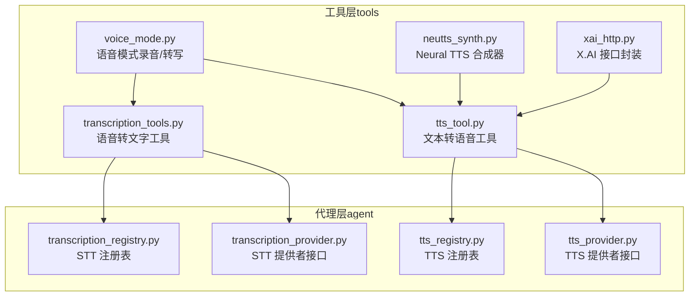
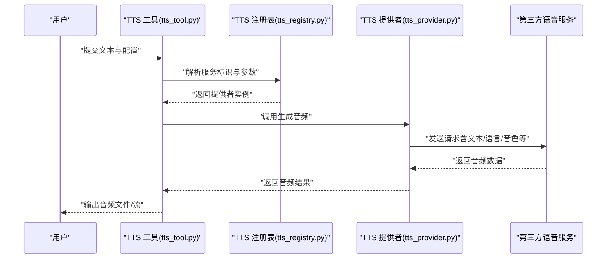
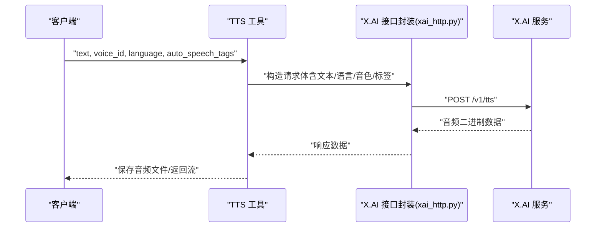
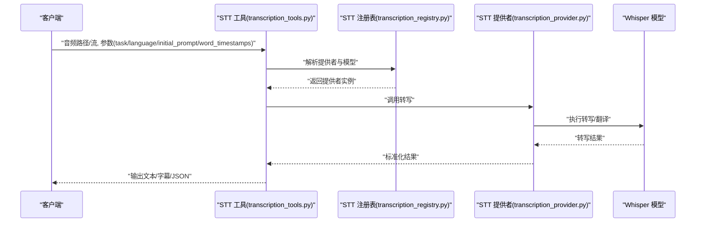
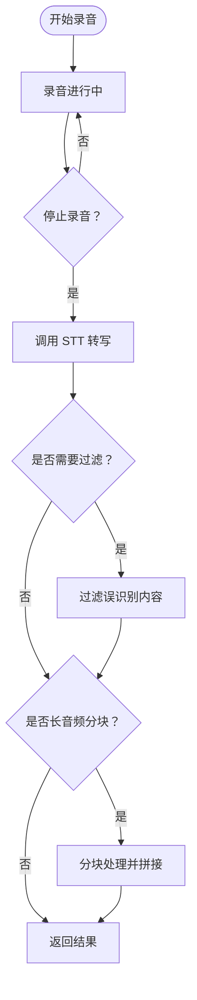
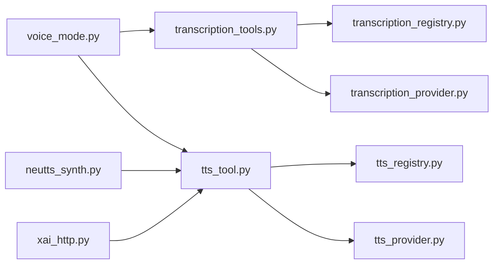

# 语音工具

<cite>
**本文引用的文件**
- [tts_tool.py](file://tools/tts_tool.py)
- [transcription_tools.py](file://tools/transcription_tools.py)
- [voice_mode.py](file://tools/voice_mode.py)
- [tts_provider.py](file://agent/tts_provider.py)
- [tts_registry.py](file://agent/tts_registry.py)
- [transcription_provider.py](file://agent/transcription_provider.py)
- [transcription_registry.py](file://agent/transcription_registry.py)
- [neutts_synth.py](file://tools/neutts_synth.py)
- [xai_http.py](file://tools/xai_http.py)
- [test_voice_mode.py](file://tests/tools/test_voice_mode.py)
- [test_tts_xai_speech_tags.py](file://tests/tools/test_tts_xai_speech_tags.py)
- [test_transcription.py](file://tests/tools/test_transcription.py)
- [mlops-whisper.md](file://website/docs/user-guide/skills/optional/mlops/mlops-whisper.md)
- [mlops-whisper-zh.md](file://website/i18n/zh-Hans/docusaurus-plugin-content-docs/current/user-guide/skills/optional/mlops/mlops-whisper.md)
</cite>

## 目录
1. [简介](#简介)
2. [项目结构](#项目结构)
3. [核心组件](#核心组件)
4. [架构总览](#架构总览)
5. [详细组件分析](#详细组件分析)
6. [依赖关系分析](#依赖关系分析)
7. [性能考虑](#性能考虑)
8. [故障排查指南](#故障排查指南)
9. [结论](#结论)
10. [附录](#附录)

## 简介
本技术文档围绕语音工具展开，系统性介绍文本转语音（TTS）与语音转文字（STT/ASR）两大能力在本仓库中的实现机制、音频处理流程与质量优化策略。文档覆盖以下主题：
- TTS/STT 的服务注册与分发机制
- 音频编码、格式转换与质量控制
- 支持的语音服务、音色选择与语言配置
- 实时录音与转写、批量转换与性能优化
- 第三方语音服务插件的集成方式与自定义开发
- 调用示例、参数设置与输出处理
- 配置指南与常见问题排查

## 项目结构
语音相关功能主要分布在 tools 与 agent 两个层次：
- tools：提供具体的语音工具实现与运行时能力（如 TTS、STT、录音与播放、Neural TTS 合成器等）
- agent：提供服务注册表与提供者接口，用于统一管理与调度第三方语音服务

**图表来源**
- [tts_tool.py](file://tools/tts_tool.py)
- [transcription_tools.py](file://tools/transcription_tools.py)
- [voice_mode.py](file://tools/voice_mode.py)
- [neutts_synth.py](file://tools/neutts_synth.py)
- [xai_http.py](file://tools/xai_http.py)
- [tts_registry.py](file://agent/tts_registry.py)
- [tts_provider.py](file://agent/tts_provider.py)
- [transcription_registry.py](file://agent/transcription_registry.py)
- [transcription_provider.py](file://agent/transcription_provider.py)

**章节来源**
- [tts_tool.py](file://tools/tts_tool.py)
- [transcription_tools.py](file://tools/transcription_tools.py)
- [voice_mode.py](file://tools/voice_mode.py)
- [neutts_synth.py](file://tools/neutts_synth.py)
- [xai_http.py](file://tools/xai_http.py)
- [tts_registry.py](file://agent/tts_registry.py)
- [tts_provider.py](file://agent/tts_provider.py)
- [transcription_registry.py](file://agent/transcription_registry.py)
- [transcription_provider.py](file://agent/transcription_provider.py)

## 核心组件
- 文本转语音工具（TTS）
  - 统一入口：负责接收文本、解析配置、路由到具体服务提供者，并处理输出（音频文件或流）
  - 支持的服务：包括但不限于本地合成器（如 Neural TTS）、第三方服务（如 X.AI 等）
  - 关键特性：文本长度限制、自动语音标签（speech tags）注入、语言与音色配置、编码与格式控制
- 语音转文字工具（STT）
  - 统一入口：负责接收音频文件或流，调用注册表中的提供者执行转写或翻译
  - 支持的服务：Whisper 等模型提供者
  - 关键特性：任务类型（转写/翻译）、初始提示词、词级时间戳、温度回退策略
- 语音模式（Voice Mode）
  - 集成录音、实时转写、播放与过滤逻辑，支持长音频分块拼接与误识别过滤
- 注册表与提供者接口
  - 通过注册表集中管理不同语音服务的实现，便于扩展与切换
  - 提供者接口定义统一的调用契约，确保第三方服务可插拔接入

**章节来源**
- [tts_tool.py](file://tools/tts_tool.py)
- [transcription_tools.py](file://tools/transcription_tools.py)
- [voice_mode.py](file://tools/voice_mode.py)
- [tts_registry.py](file://agent/tts_registry.py)
- [transcription_registry.py](file://agent/transcription_registry.py)

## 架构总览
语音工具的整体架构采用“工具层 + 代理层”的分层设计。工具层聚焦于具体实现与运行时行为，代理层负责服务发现与调度。

**图表来源**
- [tts_tool.py](file://tools/tts_tool.py)
- [tts_registry.py](file://agent/tts_registry.py)
- [tts_provider.py](file://agent/tts_provider.py)

**章节来源**
- [tts_tool.py](file://tools/tts_tool.py)
- [tts_registry.py](file://agent/tts_registry.py)
- [tts_provider.py](file://agent/tts_provider.py)

## 详细组件分析

### 文本转语音（TTS）组件
- 功能职责
  - 解析输入文本与配置（语言、音色、速度、自动语音标签等）
  - 路由到指定提供者（本地合成器或第三方服务）
  - 执行音频编码与格式控制（如 MP3/WAV/Opus 等）
  - 输出音频文件或流，并进行错误处理与日志记录
- 关键实现点
  - 文本长度限制与截断策略，避免超过服务端上限
  - 自动语音标签注入（如暂停标记），提升自然度
  - 语言与音色参数映射到具体服务的对应字段
  - 编解码与格式转换（MP3/WAV/Opus）以适配不同播放环境
- 典型调用序列

**图表来源**
- [tts_tool.py](file://tools/tts_tool.py)
- [xai_http.py](file://tools/xai_http.py)

**章节来源**
- [tts_tool.py](file://tools/tts_tool.py)
- [xai_http.py](file://tools/xai_http.py)
- [test_tts_xai_speech_tags.py](file://tests/tools/test_tts_xai_speech_tags.py)

### 语音转文字（STT）组件
- 功能职责
  - 接收音频输入，调用注册表中的提供者执行转写或翻译
  - 支持任务类型（转写/翻译）、初始提示词、词级时间戳、温度回退策略
  - 对长音频进行分块处理与结果拼接
- 关键实现点
  - Whisper 模型的命令行与 Python 接口使用
  - 输出格式支持（txt/srt/vtt/json）
  - 误识别过滤与空结果处理
- 典型调用序列

**图表来源**
- [transcription_tools.py](file://tools/transcription_tools.py)
- [transcription_registry.py](file://agent/transcription_registry.py)
- [transcription_provider.py](file://agent/transcription_provider.py)

**章节来源**
- [transcription_tools.py](file://tools/transcription_tools.py)
- [transcription_registry.py](file://agent/transcription_registry.py)
- [transcription_provider.py](file://agent/transcription_provider.py)
- [mlops-whisper.md](file://website/docs/user-guide/skills/optional/mlops/mlops-whisper.md)
- [mlops-whisper-zh.md](file://website/i18n/zh-Hans/docusaurus-plugin-content-docs/current/user-guide/skills/optional/mlops/mlops-whisper.md)

### 语音模式（Voice Mode）组件
- 功能职责
  - 录音（基于音频库，支持跨平台）
  - 实时转写（调用 STT 工具）
  - 播放音频（支持多种格式）
  - 长音频分块与结果拼接
  - 误识别过滤（如过滤特定短语）
- 关键实现点
  - 录音器状态管理与计时
  - 转写结果过滤与空结果处理
  - 长音频阈值判断与分块策略
- 流程图

**图表来源**
- [voice_mode.py](file://tools/voice_mode.py)
- [transcription_tools.py](file://tools/transcription_tools.py)

**章节来源**
- [voice_mode.py](file://tools/voice_mode.py)
- [test_voice_mode.py](file://tests/tools/test_voice_mode.py)

### Neural TTS 合成器组件
- 功能职责
  - 本地化语音合成，减少对外部服务依赖
  - 支持音色选择、语速调节与基础质量控制
- 关键实现点
  - 与 TTS 工具的集成方式（作为本地提供者）
  - 输出格式与编码策略

**章节来源**
- [neutts_synth.py](file://tools/neutts_synth.py)
- [tts_tool.py](file://tools/tts_tool.py)

## 依赖关系分析
- 组件耦合与内聚
  - 工具层内部模块相对独立，通过统一接口与注册表交互
  - 代理层提供稳定的服务契约，降低对具体实现的耦合
- 直接与间接依赖
  - TTS/STT 工具依赖注册表与提供者接口
  - Voice Mode 同时依赖 STT 与 TTS 工具
  - 第三方服务通过 HTTP 客户端与网络接口访问
- 循环依赖
  - 当前结构未见循环依赖迹象
- 外部依赖与集成点
  - Whisper 模型、Neural TTS 合成器、X.AI API 等

**图表来源**
- [tts_tool.py](file://tools/tts_tool.py)
- [transcription_tools.py](file://tools/transcription_tools.py)
- [voice_mode.py](file://tools/voice_mode.py)
- [neutts_synth.py](file://tools/neutts_synth.py)
- [xai_http.py](file://tools/xai_http.py)
- [tts_registry.py](file://agent/tts_registry.py)
- [transcription_registry.py](file://agent/transcription_registry.py)

**章节来源**
- [tts_tool.py](file://tools/tts_tool.py)
- [transcription_tools.py](file://tools/transcription_tools.py)
- [voice_mode.py](file://tools/voice_mode.py)
- [neutts_synth.py](file://tools/neutts_synth.py)
- [xai_http.py](file://tools/xai_http.py)
- [tts_registry.py](file://agent/tts_registry.py)
- [transcription_registry.py](file://agent/transcription_registry.py)

## 性能考虑
- 实时处理
  - 录音与转写采用异步/非阻塞策略，避免 UI 卡顿
  - 长音频分块处理，降低单次处理压力
- 批量转换
  - 通过批处理队列与并发控制，提升吞吐量
  - 合理设置文本长度与分块阈值，平衡质量与性能
- 质量控制
  - 使用词级时间戳与温度回退策略提升识别准确率
  - 自动语音标签增强自然度与节奏感
- 编码与格式
  - 根据目标播放设备选择合适编码（如 MP3/Opus），兼顾体积与兼容性
  - 本地合成器优先，减少网络往返延迟

## 故障排查指南
- 常见问题与定位
  - 无法录音/无音频输入：检查音频库安装与权限，确认设备可用性
  - 转写结果为空或误识别：启用初始提示词、开启词级时间戳、调整温度参数
  - 第三方服务调用失败：检查 API 密钥、网络连通性与超时设置
  - 音频播放异常：确认输出格式与播放器兼容性
- 调试建议
  - 启用详细日志，观察请求与响应
  - 使用测试用例验证关键路径（如语音标签注入、长音频分块）
- 参考测试用例
  - 语音模式单元测试覆盖录音器状态、转写过滤与长音频分块
  - TTS 语音标签测试验证文本注入与请求参数
  - STT 工具测试覆盖基本转写流程与参数传递

**章节来源**
- [test_voice_mode.py](file://tests/tools/test_voice_mode.py)
- [test_tts_xai_speech_tags.py](file://tests/tools/test_tts_xai_speech_tags.py)
- [test_transcription.py](file://tests/tools/test_transcription.py)

## 结论
本语音工具体系通过清晰的分层设计与注册表机制，实现了 TTS/STT 的统一接入与灵活扩展。工具层提供了丰富的音频处理与质量优化能力，代理层保证了服务的可插拔性与可维护性。结合本地合成器与第三方服务，既能满足离线场景需求，也能获得更高质量的语音效果。建议在生产环境中结合业务特点，合理配置语言、音色与编码策略，并建立完善的监控与日志体系以保障稳定性。

## 附录

### 支持的语音服务与配置要点
- 第三方服务
  - X.AI：支持语音 ID、语言、自动语音标签等参数；适合高质量 TTS 输出
- 本地服务
  - Neural TTS：适合离线与低延迟场景；支持音色与语速调节
- 模型服务
  - Whisper：支持转写/翻译、初始提示词、词级时间戳、温度回退

**章节来源**
- [xai_http.py](file://tools/xai_http.py)
- [neutts_synth.py](file://tools/neutts_synth.py)
- [mlops-whisper.md](file://website/docs/user-guide/skills/optional/mlops/mlops-whisper.md)
- [mlops-whisper-zh.md](file://website/i18n/zh-Hans/docusaurus-plugin-content-docs/current/user-guide/skills/optional/mlops/mlops-whisper.md)

### 调用示例与参数设置（路径指引）
- TTS 示例
  - 文本转语音工具入口与参数解析：[tts_tool.py](file://tools/tts_tool.py)
  - X.AI 请求构造与响应处理：[xai_http.py](file://tools/xai_http.py)
  - 语音标签注入测试参考：[test_tts_xai_speech_tags.py](file://tests/tools/test_tts_xai_speech_tags.py)
- STT 示例
  - 语音转文字工具入口与参数传递：[transcription_tools.py](file://tools/transcription_tools.py)
  - Whisper 使用示例与参数：[mlops-whisper.md](file://website/docs/user-guide/skills/optional/mlops/mlops-whisper.md)
  - 中文文档示例：[mlops-whisper-zh.md](file://website/i18n/zh-Hans/docusaurus-plugin-content-docs/current/user-guide/skills/optional/mlops/mlops-whisper.md)
- 语音模式示例
  - 录音、转写与播放流程：[voice_mode.py](file://tools/voice_mode.py)
  - 单元测试覆盖的关键路径：[test_voice_mode.py](file://tests/tools/test_voice_mode.py)

**章节来源**
- [tts_tool.py](file://tools/tts_tool.py)
- [transcription_tools.py](file://tools/transcription_tools.py)
- [voice_mode.py](file://tools/voice_mode.py)
- [xai_http.py](file://tools/xai_http.py)
- [test_tts_xai_speech_tags.py](file://tests/tools/test_tts_xai_speech_tags.py)
- [test_voice_mode.py](file://tests/tools/test_voice_mode.py)
- [mlops-whisper.md](file://website/docs/user-guide/skills/optional/mlops/mlops-whisper.md)
- [mlops-whisper-zh.md](file://website/i18n/zh-Hans/docusaurus-plugin-content-docs/current/user-guide/skills/optional/mlops/mlops-whisper.md)