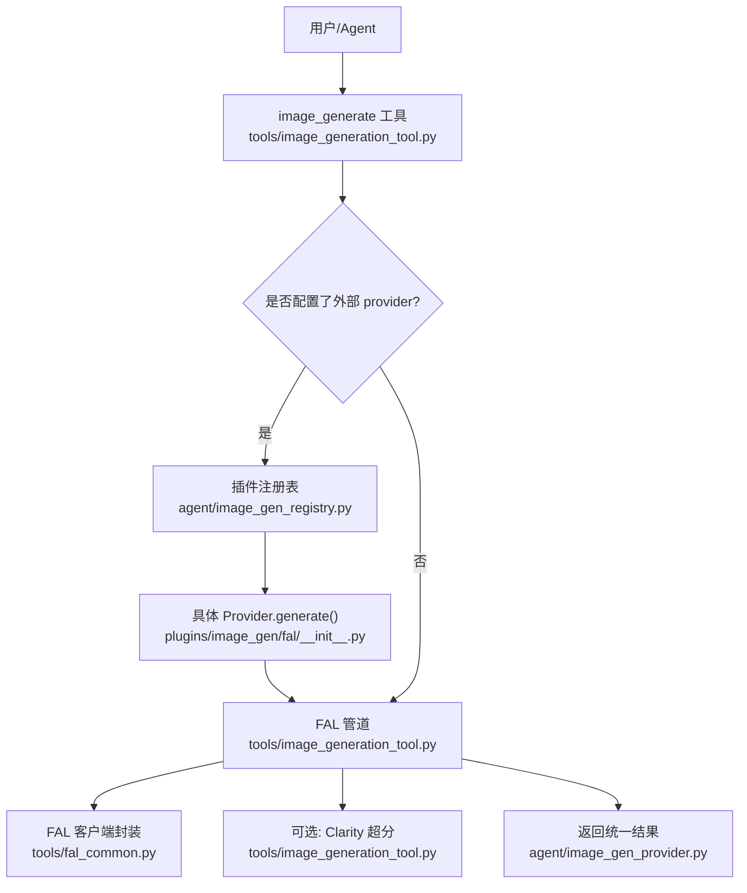
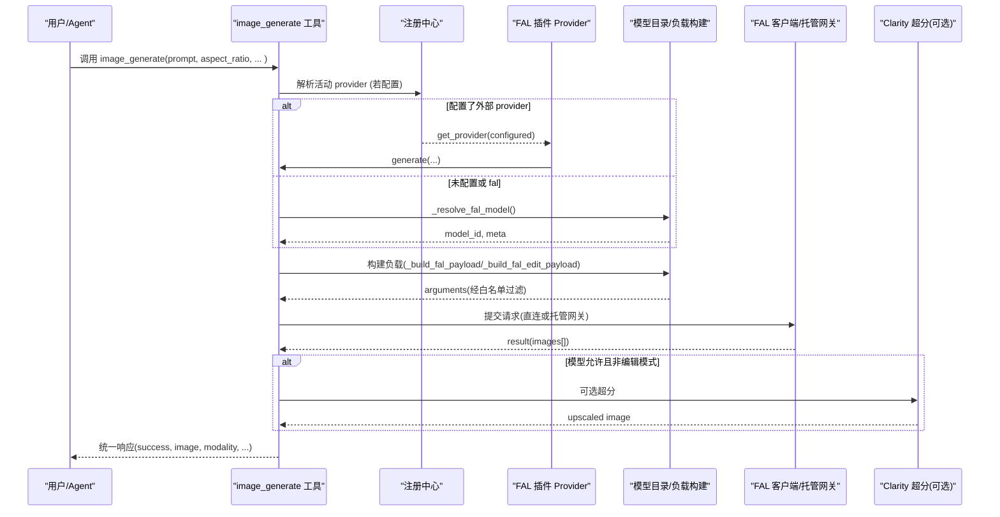
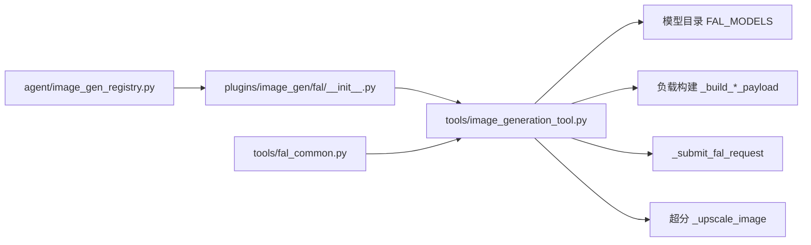

# 图像生成工具

<cite>
**本文引用的文件**
- [tools/image_generation_tool.py](file://tools/image_generation_tool.py)
- [agent/image_gen_provider.py](file://agent/image_gen_provider.py)
- [agent/image_gen_registry.py](file://agent/image_gen_registry.py)
- [plugins/image_gen/fal/__init__.py](file://plugins/image_gen/fal/__init__.py)
- [plugins/image_gen/fal/plugin.yaml](file://plugins/image_gen/fal/plugin.yaml)
- [tools/fal_common.py](file://tools/fal_common.py)
</cite>

## 目录
1. [简介](#简介)
2. [项目结构](#项目结构)
3. [核心组件](#核心组件)
4. [架构总览](#架构总览)
5. [详细组件分析](#详细组件分析)
6. [依赖关系分析](#依赖关系分析)
7. [性能与质量优化](#性能与质量优化)
8. [故障排查指南](#故障排查指南)
9. [结论](#结论)
10. [附录：使用示例与最佳实践](#附录使用示例与最佳实践)

## 简介
本文件面向 Hermes Agent 的图像生成功能，系统性说明其支持的多种 AI 图像生成模型与编辑能力，重点覆盖 FAL.ai 集成、模型选择策略、参数配置、质量与成本优化、文本到图像生成、图像编辑（含风格参考）、批量生成、错误处理、重试机制与资源管理。文档同时给出不同模型的特点、价格对比与适用场景，并提供可操作的提示词工程、尺寸设置、安全检查与性能调优建议。

## 项目结构
图像生成在 Hermes Agent 中采用“插件化后端 + 统一抽象”的设计：
- 统一抽象层：定义 ImageGenProvider 接口与通用响应格式，屏蔽后端差异。
- 注册中心：集中管理已注册的图像生成后端，并解析当前激活的后端。
- FAL 插件：将内置的 FAL 多模型实现包装为统一 Provider，便于通过配置切换。
- 工具入口：对外暴露 image_generate 工具，自动路由到文本生成或图像编辑模式。

图表来源
- [tools/image_generation_tool.py:1072-1271](file://tools/image_generation_tool.py#L1072-L1271)
- [agent/image_gen_registry.py:75-139](file://agent/image_gen_registry.py#L75-L139)
- [plugins/image_gen/fal/__init__.py:40-212](file://plugins/image_gen/fal/__init__.py#L40-L212)
- [tools/fal_common.py:80-164](file://tools/fal_common.py#L80-L164)
- [agent/image_gen_provider.py:64-194](file://agent/image_gen_provider.py#L64-L194)

章节来源
- [tools/image_generation_tool.py:1-21](file://tools/image_generation_tool.py#L1-L21)
- [agent/image_gen_provider.py:1-40](file://agent/image_gen_provider.py#L1-L40)
- [agent/image_gen_registry.py:1-19](file://agent/image_gen_registry.py#L1-L19)
- [plugins/image_gen/fal/__init__.py:1-22](file://plugins/image_gen/fal/__init__.py#L1-L22)
- [tools/fal_common.py:1-25](file://tools/fal_common.py#L1-L25)

## 核心组件
- 统一 Provider 抽象与响应格式
  - 定义 generate() 方法、capabilities()、list_models()、get_setup_schema() 等扩展点。
  - 提供 success_response/error_response 统一返回结构，包含 success、image、model、prompt、aspect_ratio、modality、provider、error、error_type 等键。
- 注册中心
  - 维护已注册 Provider 列表，支持按名称获取与活动后端解析；当未显式配置时，优先回退到单提供者或 legacy “fal”。
- FAL 插件
  - 将 tools.image_generation_tool 的多模型实现包装为 Provider，暴露模型清单、默认模型、能力探测与 generate 转发。
- FAL 管道与模型目录
  - 集中维护 FAL_MODELS 目录，描述每个模型的显示名、速度、优势、价格、尺寸风格、默认参数、支持字段白名单、是否启用超分、编辑端点与参考图上限等。
  - 构建请求负载：根据 size_style 将 aspect_ratio 映射为 image_size/aspect_ratio/gpt_literal，合并默认值与调用方覆盖，并按 supports/edit_supports 白名单过滤。
  - 提交请求：支持直接凭据或 Nous 托管队列网关；对 4xx 进行友好错误提示。
  - 可选超分：基于 Clarity Upscaler，按模型元数据决定是否启用。
- 工具入口
  - image_generate_tool 接收 prompt、aspect_ratio、可选 image_url/reference_image_urls 等，自动判定文本生成或图像编辑模式，构造负载并提交请求，返回统一 JSON。

章节来源
- [agent/image_gen_provider.py:64-194](file://agent/image_gen_provider.py#L64-L194)
- [agent/image_gen_registry.py:36-139](file://agent/image_gen_registry.py#L36-L139)
- [plugins/image_gen/fal/__init__.py:40-212](file://plugins/image_gen/fal/__init__.py#L40-L212)
- [tools/image_generation_tool.py:97-657](file://tools/image_generation_tool.py#L97-L657)
- [tools/image_generation_tool.py:799-903](file://tools/image_generation_tool.py#L799-L903)
- [tools/image_generation_tool.py:908-951](file://tools/image_generation_tool.py#L908-L951)
- [tools/image_generation_tool.py:1072-1271](file://tools/image_generation_tool.py#L1072-L1271)

## 架构总览
下图展示从工具调用到后端提交的完整流程，包括模型解析、负载构建、编辑/生成路由、托管网关选择与可选超分。

图表来源
- [tools/image_generation_tool.py:1072-1271](file://tools/image_generation_tool.py#L1072-L1271)
- [tools/image_generation_tool.py:799-903](file://tools/image_generation_tool.py#L97-L903)
- [tools/image_generation_tool.py:908-951](file://tools/image_generation_tool.py#L908-L951)
- [plugins/image_gen/fal/__init__.py:118-201](file://plugins/image_gen/fal/__init__.py#L118-L201)
- [agent/image_gen_registry.py:75-139](file://agent/image_gen_registry.py#L75-L139)

## 详细组件分析

### 模型目录与选择策略
- 模型目录 FAL_MODELS 集中声明各模型的元数据：
  - 显示名、速度、优势、价格、尺寸风格（image_size_preset / aspect_ratio / gpt_literal）、尺寸映射、默认参数、支持字段白名单、是否启用超分、编辑端点与参考图上限。
- 活动模型解析优先级：
  1) config.yaml 中的 image_gen.model；2) 环境变量 FAL_IMAGE_MODEL；3) 默认模型 DEFAULT_MODEL。
  未知模型会记录警告并回退到默认模型。
- 负载构建：
  - 文本生成：根据 size_style 将 aspect_ratio 映射为 image_size/aspect_ratio/gpt_literal，合并默认值与覆盖参数，按 supports 白名单过滤。
  - 图像编辑：仅当模型声明 edit_endpoint 时启用；负载包含 prompt、image_urls、可选 image_size/aspect_ratio（取决于 edit_supports），以及 seed、覆盖参数等。
- 能力探测：
  - 插件 capabilities() 根据当前模型是否声明 edit_endpoint 动态返回 modalities 与 max_reference_images，用于动态工具描述与前端提示。

章节来源
- [tools/image_generation_tool.py:97-657](file://tools/image_generation_tool.py#L97-L657)
- [tools/image_generation_tool.py:764-796](file://tools/image_generation_tool.py#L764-L796)
- [tools/image_generation_tool.py:799-903](file://tools/image_generation_tool.py#L799-L903)
- [plugins/image_gen/fal/__init__.py:69-116](file://plugins/image_gen/fal/__init__.py#L69-L116)

### FAL 集成与托管网关
- 懒加载 fal_client：避免冷启动开销，首次使用时才导入。
- 托管网关选择：
  - 若存在 FAL_KEY 且未偏好网关，则直连 FAL；否则尝试 Nous 托管 fal-queue 网关。
  - 托管模式下，使用 _ManagedFalSyncClient 包装 SyncClient，注入 queue_run_origin、鉴权头、重试与超时控制。
- 错误处理：
  - 托管网关 4xx 错误会被转换为更友好的 ValueError，提示模型可能未在当前门户代理中启用，并给出替代方案（设置 FAL_KEY 或切换模型）。

章节来源
- [tools/image_generation_tool.py:44-64](file://tools/image_generation_tool.py#L44-L64)
- [tools/image_generation_tool.py:686-758](file://tools/image_generation_tool.py#L686-L758)
- [tools/fal_common.py:33-52](file://tools/fal_common.py#L33-L52)
- [tools/fal_common.py:80-164](file://tools/fal_common.py#L80-L164)

### 文本到图像与图像编辑
- 文本到图像：
  - 输入：prompt、aspect_ratio、seed、覆盖参数（如 num_inference_steps、guidance_scale、num_images、output_format）。
  - 输出：images[]，每项包含 url、width、height；可按模型元数据决定是否执行超分。
- 图像编辑：
  - 触发条件：提供 image_url 或 reference_image_urls，且当前模型声明 edit_endpoint。
  - 输入：prompt、image_urls（主图+参考图，数量受 max_reference_images 限制）、可选 image_size/aspect_ratio（取决于 edit_supports）、seed、覆盖参数。
  - 输出：同文本生成，但通常不再执行超分（编辑端点已产出最终合成）。

章节来源
- [tools/image_generation_tool.py:1072-1271](file://tools/image_generation_tool.py#L1072-L1271)
- [tools/image_generation_tool.py:848-903](file://tools/image_generation_tool.py#L848-L903)

### 超分（Clarity Upscaler）
- 仅在模型元数据 upscale=True 且非编辑模式时启用。
- 使用固定参数（放大倍数、负向提示、创造力、相似度、引导尺度、推理步数、安全检测开关）调用 FAL 超分端点。
- 失败时回退到原图，并记录日志。

章节来源
- [tools/image_generation_tool.py:663-674](file://tools/image_generation_tool.py#L663-L674)
- [tools/image_generation_tool.py:908-951](file://tools/image_generation_tool.py#L908-L951)
- [tools/image_generation_tool.py:1206-1228](file://tools/image_generation_tool.py#L1206-L1228)

### 插件与注册中心
- 插件 FalImageGenProvider：
  - 暴露 name/display_name/is_available/list_models/default_model/get_setup_schema/capabilities/generate。
  - generate() 转发到 tools.image_generation_tool.image_generate_tool，并将 JSON 字符串响应转为统一字典。
- 注册中心：
  - 支持按名称注册/获取 Provider；活动后端解析遵循“显式配置 > 唯一可用 > 回退 fal”的策略。

章节来源
- [plugins/image_gen/fal/__init__.py:40-212](file://plugins/image_gen/fal/__init__.py#L40-L212)
- [agent/image_gen_registry.py:36-139](file://agent/image_gen_registry.py#L36-L139)

## 依赖关系分析
- 模块耦合：
  - 工具入口依赖模型目录与负载构建函数；负载构建依赖模型元数据与白名单。
  - 插件依赖工具入口的 FAL 管道；注册中心解耦插件与工具。
  - 托管网关封装依赖 fal_client 内部 API，保持最小侵入。
- 外部依赖：
  - fal_client（可选，懒加载）；requests（下载图片缓存时使用）。
- 潜在循环：
  - 插件通过 call-time import 避免循环导入；注册中心与工具之间无直接循环。

图表来源
- [tools/image_generation_tool.py:97-657](file://tools/image_generation_tool.py#L97-L657)
- [tools/image_generation_tool.py:799-903](file://tools/image_generation_tool.py#L799-L903)
- [tools/image_generation_tool.py:908-951](file://tools/image_generation_tool.py#L908-L951)
- [plugins/image_gen/fal/__init__.py:40-212](file://plugins/image_gen/fal/__init__.py#L40-L212)
- [agent/image_gen_registry.py:36-139](file://agent/image_gen_registry.py#L36-L139)
- [tools/fal_common.py:80-164](file://tools/fal_common.py#L80-L164)

章节来源
- [tools/image_generation_tool.py:1072-1271](file://tools/image_generation_tool.py#L1072-L1271)
- [plugins/image_gen/fal/__init__.py:40-212](file://plugins/image_gen/fal/__init__.py#L40-L212)
- [agent/image_gen_registry.py:36-139](file://agent/image_gen_registry.py#L36-L139)
- [tools/fal_common.py:80-164](file://tools/fal_common.py#L80-L164)

## 性能与质量优化
- 模型选择策略
  - 速度与质量权衡：例如 FLUX 2 Klein 9B 速度快、适合快速迭代；FLUX 2 Pro 偏向摄影级真实感；GPT Image 系列强调提示词遵从与文字渲染；Ideogram 擅长排版；Recraft 面向设计与品牌系统；Nano Banana 系列侧重推理深度与多语言文本。
  - 价格对比：各模型在目录中提供每 MP 或每张的价格信息，便于在预算约束下选择合适模型。
- 尺寸与分辨率
  - 不同模型对尺寸有不同要求：部分使用预设枚举（landscape/square/portrait），部分使用宽高比，部分使用字面量尺寸（如 GPT Image 1.5）。
  - 编辑模式通常由输入图像推断输出尺寸，除非模型明确支持 image_size/aspect_ratio。
- 参数调优
  - num_inference_steps：影响质量与耗时，需结合模型默认值与目标质量调整。
  - guidance_scale：控制提示词引导强度，过高可能导致过拟合或失真。
  - num_images：批量生成数量，注意成本与延迟。
  - output_format：png/jpg/webp 等，考虑体积与兼容性。
  - enable_safety_checker：按需开启安全检测，平衡内容合规与生成成功率。
  - resolution（特定模型）：如 Nano Banana 的 1K/4K 档位，影响成本与清晰度。
- 超分策略
  - 仅在模型元数据允许且非编辑模式时启用，避免不必要的额外成本与延迟。
- 批处理
  - 通过 num_images 一次生成多张；对于需要更多样化的场景，可在上层循环多次调用，合理设置 seed 以获得可控多样性。
- 提示词工程
  - 清晰描述主体、风格、构图、光照、材质、文字内容等；必要时加入负向提示（部分模型支持 negative_prompt）。
  - 对复杂文本渲染，优先选择擅长文字的模型（如 Ideogram、GPT Image、Qwen Image）。
- 安全检查
  - 根据业务需求开启 enable_safety_checker；某些模型支持 safety_tolerance 调节严格程度。
- 资源管理
  - 懒加载 fal_client，减少冷启动开销。
  - 托管网关复用 httpx.Client，避免连接泄漏。
  - 本地图片缓存限制大小，防止异常大文件占用磁盘。

章节来源
- [tools/image_generation_tool.py:97-657](file://tools/image_generation_tool.py#L97-L657)
- [tools/image_generation_tool.py:799-903](file://tools/image_generation_tool.py#L799-L903)
- [tools/image_generation_tool.py:908-951](file://tools/image_generation_tool.py#L908-L951)
- [tools/image_generation_tool.py:1072-1271](file://tools/image_generation_tool.py#L1072-L1271)
- [agent/image_gen_provider.py:239-338](file://agent/image_gen_provider.py#L239-L338)

## 故障排查指南
- 无后端可用
  - 现象：提示缺少 FAL_KEY 或托管网关不可达。
  - 解决：设置 FAL_KEY 或通过 hermes setup 启用托管网关；或切换到其他 provider。
- 模型不支持编辑
  - 现象：传入 image_url/reference_image_urls 时报错。
  - 解决：改用支持编辑的模型，或仅传 prompt 进行文本生成。
- 托管网关 4xx 错误
  - 现象：Nous 托管网关拒绝模型（未启用/计费门控）。
  - 解决：设置 FAL_KEY 直连，或更换模型；查看门户状态。
- 响应无效
  - 现象：API 未返回 images 或返回空数组。
  - 解决：检查提示词、尺寸、模型能力与安全检测设置；降低复杂度或更换模型。
- 超分失败
  - 现象：超分报错或返回无效结果。
  - 解决：回退到原图；检查网络与模型可用性；必要时关闭超分。
- 本地路径不可读（远程环境）
  - 现象：SSH/Docker 环境下无法读取源图。
  - 解决：使用 data: URL 或确保路径可通过沙箱解析；工具会自动转换路径为 data: URL。

章节来源
- [tools/image_generation_tool.py:1274-1317](file://tools/image_generation_tool.py#L1274-L1317)
- [tools/image_generation_tool.py:1134-1150](file://tools/image_generation_tool.py#L1134-L1150)
- [tools/image_generation_tool.py:1200-1231](file://tools/image_generation_tool.py#L1200-L1231)
- [tools/image_generation_tool.py:1735-1774](file://tools/image_generation_tool.py#L1735-L1774)

## 结论
Hermes Agent 的图像生成功能以统一的 Provider 抽象为核心，通过 FAL 插件接入多模型生态，支持文本到图像与图像编辑，具备灵活的模型选择、参数配置、质量与成本优化能力。借助托管网关与懒加载机制，系统在易用性与性能之间取得良好平衡。推荐根据任务需求选择合适的模型与参数，并结合提示词工程与安全检测获得稳定高质量的输出。

## 附录：使用示例与最佳实践
- 文本到图像
  - 基本用法：提供 prompt 与 aspect_ratio，其余参数可选；适合快速原型与日常配图。
  - 批量生成：设置 num_images > 1，配合 seed 控制多样性。
  - 尺寸设置：根据模型 size_style 选择 landscape/square/portrait；注意部分模型的最小像素要求。
  - 安全检查：开启 enable_safety_checker 或调整 safety_tolerance 以满足合规要求。
- 图像编辑
  - 触发方式：提供 image_url 与/或 reference_image_urls；确保所选模型声明 edit_endpoint。
  - 参考图数量：受 max_reference_images 限制，超出将被截断。
  - 尺寸推断：多数编辑端点自动推断输出尺寸；如需强制，请确认 edit_supports 支持 image_size/aspect_ratio。
- 提示词工程
  - 明确主体、风格、构图、光照、材质、文字内容与排版要求；对复杂文字优先选择擅长文本的模型。
  - 合理使用负向提示（negative_prompt）排除不期望元素。
- 质量与成本平衡
  - 快速迭代：选择速度快的模型（如 FLUX 2 Klein 9B、Nano Banana 2 Lite）。
  - 高质量输出：选择摄影级或设计导向模型（如 FLUX 2 Pro、Recraft、GPT Image 2）。
  - 成本控制：关注每 MP 或每张价格，合理设置 num_images、resolution、quality。
- 性能调优
  - 调整 num_inference_steps 与 guidance_scale 以平衡质量与耗时。
  - 谨慎启用超分，仅在模型允许且收益明显时使用。
  - 利用托管网关复用连接，减少网络开销。
- 错误处理与重试
  - 捕获 4xx/5xx 错误，区分认证、计费、模型不可用等情况。
  - 对临时性错误实施有限重试，避免无限重试导致资源耗尽。
- 资源管理
  - 懒加载 fal_client，避免冷启动开销。
  - 本地图片缓存限制大小，防止异常大文件占用磁盘。
  - 在远程环境中使用 data: URL 传递源图，确保沙箱可读。

章节来源
- [tools/image_generation_tool.py:97-657](file://tools/image_generation_tool.py#L97-L657)
- [tools/image_generation_tool.py:799-903](file://tools/image_generation_tool.py#L799-L903)
- [tools/image_generation_tool.py:1072-1271](file://tools/image_generation_tool.py#L1072-L1271)
- [agent/image_gen_provider.py:239-338](file://agent/image_gen_provider.py#L239-L338)
- [plugins/image_gen/fal/__init__.py:69-116](file://plugins/image_gen/fal/__init__.py#L69-L116)