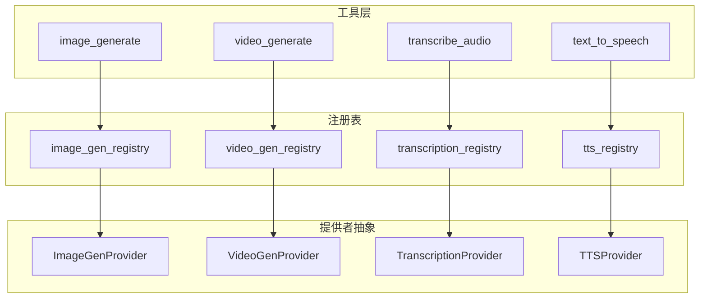
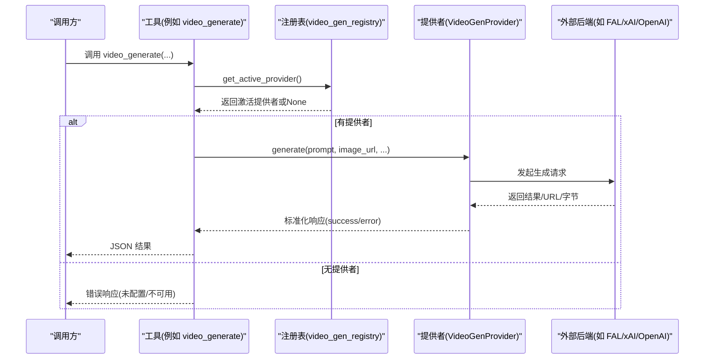
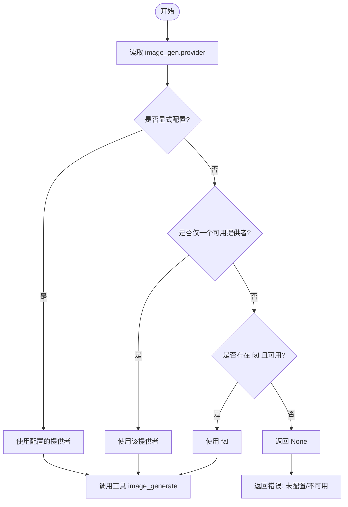
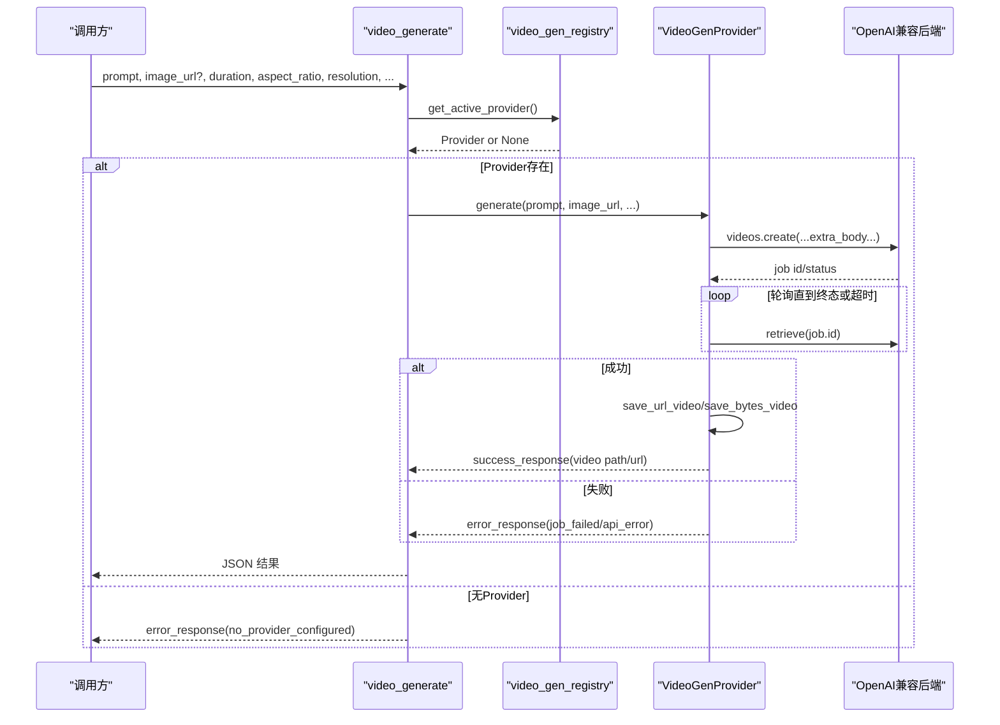
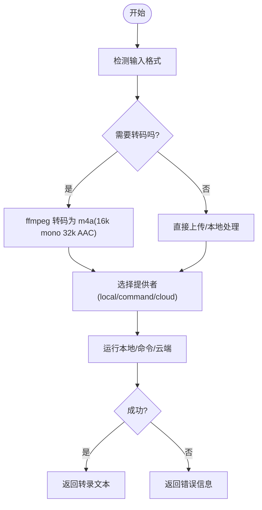
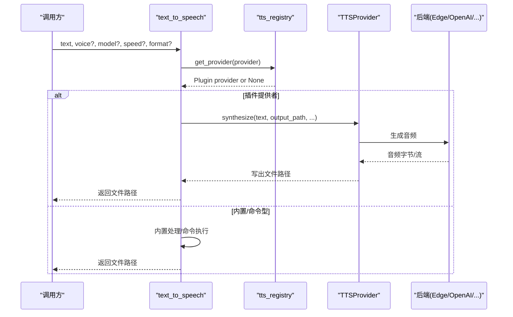
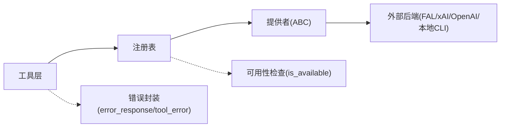

# 媒体处理工具

<cite>
**本文引用的文件**
- [agent/image_gen_provider.py](file://agent/image_gen_provider.py)
- [agent/video_gen_provider.py](file://agent/video_gen_provider.py)
- [agent/transcription_provider.py](file://agent/transcription_provider.py)
- [agent/tts_provider.py](file://agent/tts_provider.py)
- [agent/image_gen_registry.py](file://agent/image_gen_registry.py)
- [agent/video_gen_registry.py](file://agent/video_gen_registry.py)
- [agent/transcription_registry.py](file://agent/transcription_registry.py)
- [agent/tts_registry.py](file://agent/tts_registry.py)
- [tools/image_generation_tool.py](file://tools/image_generation_tool.py)
- [tools/video_generation_tool.py](file://tools/video_generation_tool.py)
- [tools/transcription_tools.py](file://tools/transcription_tools.py)
- [tools/tts_tool.py](file://tools/tts_tool.py)
</cite>

## 目录
1. [简介](#简介)
2. [项目结构](#项目结构)
3. [核心组件](#核心组件)
4. [架构总览](#架构总览)
5. [详细组件分析](#详细组件分析)
6. [依赖关系分析](#依赖关系分析)
7. [性能考虑](#性能考虑)
8. [故障排查指南](#故障排查指南)
9. [结论](#结论)
10. [附录](#附录)

## 简介
本文件面向 Hermes Agent 的媒体处理能力，覆盖图像生成、视频制作、语音转文字（STT）与文字转语音（TTS）四大能力。文档从系统架构、组件职责、数据流、错误处理、性能调优与资源管理等方面展开，并提供可操作的使用示例与最佳实践，帮助读者在 AI 驱动的媒体创作、实时流处理与批处理任务中高效使用 Hermes 的媒体工具。

## 项目结构
Hermes 将媒体能力抽象为“提供者（Provider）+ 注册表（Registry）+ 工具（Tool）”三层：
- 提供者：定义统一的接口（如 ImageGenProvider、VideoGenProvider、TranscriptionProvider、TTSProvider），屏蔽后端差异。
- 注册表：集中管理已注册的提供者，并解析当前激活的提供者。
- 工具：对外暴露统一工具调用（如 image_generate、video_generate、transcribe_audio、text_to_speech），负责参数校验、路由与结果封装。

图表来源
- [tools/image_generation_tool.py:1-120](file://tools/image_generation_tool.py#L1-L120)
- [tools/video_generation_tool.py:1-120](file://tools/video_generation_tool.py#L1-L120)
- [tools/transcription_tools.py:1-120](file://tools/transcription_tools.py#L1-L120)
- [tools/tts_tool.py:1-120](file://tools/tts_tool.py#L1-L120)
- [agent/image_gen_provider.py:64-188](file://agent/image_gen_provider.py#L64-L188)
- [agent/video_gen_provider.py:75-196](file://agent/video_gen_provider.py#L75-L196)
- [agent/transcription_provider.py:61-193](file://agent/transcription_provider.py#L61-L193)
- [agent/tts_provider.py:64-255](file://agent/tts_provider.py#L64-L255)

章节来源
- [tools/image_generation_tool.py:1-120](file://tools/image_generation_tool.py#L1-L120)
- [tools/video_generation_tool.py:1-120](file://tools/video_generation_tool.py#L1-L120)
- [tools/transcription_tools.py:1-120](file://tools/transcription_tools.py#L1-L120)
- [tools/tts_tool.py:1-120](file://tools/tts_tool.py#L1-L120)
- [agent/image_gen_provider.py:64-188](file://agent/image_gen_provider.py#L64-L188)
- [agent/video_gen_provider.py:75-196](file://agent/video_gen_provider.py#L75-L196)
- [agent/transcription_provider.py:61-193](file://agent/transcription_provider.py#L61-L193)
- [agent/tts_provider.py:64-255](file://agent/tts_provider.py#L64-L255)

## 核心组件
- 图像生成提供者（ImageGenProvider）
  - 统一入口：generate(prompt, aspect_ratio, image_url, reference_image_urls, ...)
  - 能力声明：capabilities() 返回支持的模态（text/image）、参考图上限等
  - 响应封装：success_response/error_response 提供统一返回结构
  - 缓存与保存：save_b64_image/save_url_image 将结果持久化到本地缓存目录
- 视频生成提供者（VideoGenProvider）
  - 统一入口：generate(prompt, model, image_url, duration, aspect_ratio, resolution, negative_prompt, audio, seed, ...)
  - 通用分辨率/比例常量与默认值
  - 响应封装：success_response/error_response
  - 缓存与保存：save_b64_video/save_bytes_video/save_url_video
  - 通用 OpenAI 兼容实现：OpenAICompatibleVideoGenProvider 提供 create/poll/download 流程
- 语音转文字提供者（TranscriptionProvider）
  - 统一入口：transcribe(file_path, model, language, ...)
  - 模型目录与默认模型选择
  - 响应封装：标准 success/transcript/provider/error
- 文字转语音提供者（TTSProvider）
  - 统一入口：synthesize(text, output_path, voice, model, speed, format, ...)
  - 可选流式合成：stream(text, voice, model, format, ...)
  - 输出格式约束与默认值
  - 语音气泡兼容性：voice_compatible 标记

章节来源
- [agent/image_gen_provider.py:64-188](file://agent/image_gen_provider.py#L64-L188)
- [agent/video_gen_provider.py:75-196](file://agent/video_gen_provider.py#L75-L196)
- [agent/transcription_provider.py:61-193](file://agent/transcription_provider.py#L61-L193)
- [agent/tts_provider.py:64-255](file://agent/tts_provider.py#L64-L255)

## 架构总览
Hermes 通过“工具 → 注册表 → 提供者”的分发机制，将用户请求路由到具体后端。注册表负责读取配置、发现插件、选择激活提供者；工具负责参数归一化、安全限制与错误封装；提供者实现具体后端逻辑。

图表来源
- [tools/video_generation_tool.py:310-410](file://tools/video_generation_tool.py#L310-L410)
- [agent/video_gen_registry.py:79-127](file://agent/video_gen_registry.py#L79-L127)
- [agent/video_gen_provider.py:168-196](file://agent/video_gen_provider.py#L168-L196)

章节来源
- [tools/video_generation_tool.py:310-410](file://tools/video_generation_tool.py#L310-L410)
- [agent/video_gen_registry.py:79-127](file://agent/video_gen_registry.py#L79-L127)
- [agent/video_gen_provider.py:168-196](file://agent/video_gen_provider.py#L168-L196)

## 详细组件分析

### 图像生成（Image Generation）
- 统一工具：image_generate
  - 支持文本到图像与图像编辑（image-to-image/edit），通过 presence of image_url/reference_image_urls 路由
  - 模型目录：FAL_MODELS 维护各模型的尺寸风格、默认参数、是否启用超分、编辑端点与参考图上限
  - 托管网关：优先使用 Nous 托管 FAL 队列，失败时回退直连
  - 缓存：save_b64_image/save_url_image 将结果写入 $HERMES_HOME/cache/images/
- 提供者抽象：ImageGenProvider
  - capabilities() 声明支持的模态与参考图上限
  - success_response/error_response 统一返回结构
- 注册表：image_gen_registry
  - 按配置 image_gen.provider 选择激活提供者；未配置时单提供者或 legacy fal 回退
  - is_available() 过滤不可用提供者

图表来源
- [agent/image_gen_registry.py:75-139](file://agent/image_gen_registry.py#L75-L139)
- [tools/image_generation_tool.py:764-796](file://tools/image_generation_tool.py#L764-L796)

章节来源
- [tools/image_generation_tool.py:764-796](file://tools/image_generation_tool.py#L764-L796)
- [agent/image_gen_registry.py:75-139](file://agent/image_gen_registry.py#L75-L139)
- [agent/image_gen_provider.py:143-188](file://agent/image_gen_provider.py#L143-L188)

### 视频生成（Video Generation）
- 统一工具：video_generate
  - 支持文本到视频与图像到视频（presence of image_url 决定路由）
  - 动态 Schema：根据激活后端的 capabilities() 与模型目录生成描述，提示支持的模态、分辨率、时长范围、音频开关、负向提示、参考图上限等
  - 参数归一化：duration/resolution/negative_prompt/audio/seed 等类型转换与空值清理
  - 错误封装：provider_contract/provider_exception/no_provider_configured 等
- 提供者抽象：VideoGenProvider
  - capabilities() 声明 aspect_ratios/resolutions/min/max_duration/supports_audio 等
  - OpenAICompatibleVideoGenProvider：封装 create_and_poll 流程，带超时与状态收敛，下载内容并保存到本地缓存
- 注册表：video_gen_registry
  - 按配置 video_gen.provider 选择激活提供者；未配置时仅当唯一可用提供者才自动选择

图表来源
- [tools/video_generation_tool.py:310-410](file://tools/video_generation_tool.py#L310-L410)
- [agent/video_gen_provider.py:379-591](file://agent/video_gen_provider.py#L379-L591)
- [agent/video_gen_registry.py:79-127](file://agent/video_gen_registry.py#L79-L127)

章节来源
- [tools/video_generation_tool.py:310-410](file://tools/video_generation_tool.py#L310-L410)
- [agent/video_gen_provider.py:379-591](file://agent/video_gen_provider.py#L379-L591)
- [agent/video_gen_registry.py:79-127](file://agent/video_gen_registry.py#L79-L127)

### 语音转文字（Transcription / STT）
- 内置提供者：local/local_command/groq/openai/mistral/xai/elevenlabs/deepinfra
  - local：faster-whisper 本地推理，首次自动下载模型；支持空闲卸载释放内存
  - local_command：通过 shell 模板执行任意 ASR CLI，支持占位符替换与环境透传
  - 云端：Groq/OpenAI/Mistral/xAI/ElevenLabs/DeepInfra，支持多语言与不同模型
- 输入格式：mp3/mp4/mpeg/mpga/m4a/wav/webm/ogg/aac/flac/caf
- 转码与优化：统一 m4a 编码（16kHz 单声道 AAC 32kbps），必要时 ffmpeg 转码与静音裁剪
- 命令型提供者：支持超时、进程树终止、环境变量清洗与安全注入
- 注册表：transcription_registry
  - 禁止插件名称与内置冲突（built-ins-always-win）
  - 提供 list/get/reset 等管理方法

图表来源
- [tools/transcription_tools.py:235-287](file://tools/transcription_tools.py#L235-L287)
- [tools/transcription_tools.py:373-414](file://tools/transcription_tools.py#L373-L414)
- [tools/transcription_tools.py:710-800](file://tools/transcription_tools.py#L710-L800)
- [agent/transcription_registry.py:31-49](file://agent/transcription_registry.py#L31-L49)

章节来源
- [tools/transcription_tools.py:235-287](file://tools/transcription_tools.py#L235-L287)
- [tools/transcription_tools.py:373-414](file://tools/transcription_tools.py#L373-L414)
- [tools/transcription_tools.py:710-800](file://tools/transcription_tools.py#L710-L800)
- [agent/transcription_registry.py:31-49](file://agent/transcription_registry.py#L31-L49)

### 文字转语音（Text-to-Speech / TTS）
- 内置提供者：edge/openai/elevenlabs/minimax/mistral/gemini/xai/neutts/kittentts/piper/deepinfra
  - 支持多种输出格式（mp3/wav/ogg/opus/flac），Telegram 等平台需 Opus
  - 文本长度限制：按提供者与模型动态计算，避免超限
  - 命令型提供者：通过 tts.providers.<name>: type: command 接入任意本地 CLI
  - 流式合成：TTSProvider.stream 支持低延迟语音气泡
- 注册表：tts_registry
  - 禁止插件名称与内置冲突（built-ins-always-win）
  - 命令型优先于插件（config > plugin）

图表来源
- [tools/tts_tool.py:709-797](file://tools/tts_tool.py#L709-L797)
- [agent/tts_registry.py:67-128](file://agent/tts_registry.py#L67-L128)
- [agent/tts_provider.py:180-255](file://agent/tts_provider.py#L180-L255)

章节来源
- [tools/tts_tool.py:709-797](file://tools/tts_tool.py#L709-L797)
- [agent/tts_registry.py:67-128](file://agent/tts_registry.py#L67-L128)
- [agent/tts_provider.py:180-255](file://agent/tts_provider.py#L180-L255)

## 依赖关系分析
- 工具与注册表的耦合
  - 工具通过注册表获取激活提供者，降低对具体后端的硬依赖
  - 注册表读取配置（config.yaml）与插件发现，保证运行时灵活性
- 提供者与后端的解耦
  - 通过 ABC 抽象，新增后端只需实现 generate/synthesize/transcribe 等接口
  - 通用能力（如 OpenAI 兼容视频生成）复用，减少重复代码
- 错误处理与健壮性
  - 工具层统一错误封装（error_type 区分 missing_credentials/no_model/job_failed 等）
  - 注册表对 is_available() 异常进行保护，避免崩溃
  - 命令型提供者具备进程树终止与环境清洗，防止僵尸进程与敏感信息泄露

图表来源
- [tools/video_generation_tool.py:310-410](file://tools/video_generation_tool.py#L310-L410)
- [agent/video_gen_registry.py:79-127](file://agent/video_gen_registry.py#L79-L127)
- [agent/video_gen_provider.py:168-196](file://agent/video_gen_provider.py#L168-L196)

章节来源
- [tools/video_generation_tool.py:310-410](file://tools/video_generation_tool.py#L310-L410)
- [agent/video_gen_registry.py:79-127](file://agent/video_gen_registry.py#L79-L127)
- [agent/video_gen_provider.py:168-196](file://agent/video_gen_provider.py#L168-L196)

## 性能考虑
- 图像生成
  - 模型选择：优先快速模型（如 FLUX Klein 9B）以降低延迟；按需启用超分
  - 托管网关：优先使用 Nous 托管 FAL 队列，提升稳定性与计费可控性
  - 缓存：本地缓存图片，避免重复下载与临时 URL 失效问题
- 视频生成
  - 轮询策略：自定义间隔与截止时间，避免无限轮询导致线程占用
  - 下载策略：优先下载短生命周期 URL 到本地，确保下游消费稳定
  - 分辨率/时长：合理设置 resolution/duration，平衡质量与成本
- 语音转文字
  - 本地模型：首次加载较慢但后续复用；支持空闲卸载释放内存
  - 转码优化：统一 m4a 编码，减少上传体积与兼容性问题
  - 命令型提供者：超时控制与进程树终止，避免长时间阻塞
- 文字转语音
  - 文本长度限制：按提供者与模型动态限制，避免超限失败
  - 流式合成：优先 stream 模式，降低首包延迟，适合语音气泡
  - 输出格式：平台要求（如 Telegram 需 Opus），必要时进行格式转换

[本节为通用指导，不直接分析具体文件]

## 故障排查指南
- 未配置或不可用提供者
  - 现象：返回 no_provider_configured 或 provider_not_registered
  - 处理：通过 hermes tools 选择并启用对应后端；检查 API Key 与网络
- 模型不可用或受限
  - 现象：no_model 或 managed gateway 4xx
  - 处理：切换模型或改用直连 FAL；查看托管网关可用模型列表
- 生成失败或超时
  - 现象：job_failed/api_error/TimeoutError
  - 处理：检查后端状态、重试；调整 duration/resolution；查看日志中的错误类型
- 本地命令执行异常
  - 现象：子进程挂起或超时
  - 处理：检查命令模板与占位符；确认 env_passthrough 配置；观察进程树终止
- 音频转码失败
  - 现象：ffmpeg 未找到或转码失败
  - 处理：安装 ffmpeg；检查输入格式与权限；查看转码错误详情

章节来源
- [tools/video_generation_tool.py:247-265](file://tools/video_generation_tool.py#L247-L265)
- [agent/video_gen_provider.py:419-441](file://agent/video_gen_provider.py#L419-L441)
- [tools/transcription_tools.py:235-287](file://tools/transcription_tools.py#L235-L287)
- [tools/transcription_tools.py:710-800](file://tools/transcription_tools.py#L710-L800)

## 结论
Hermes Agent 通过统一的提供者抽象与注册表机制，将图像、视频、语音转文字与文字转语音能力模块化、可扩展地集成到工具层。该设计既保证了跨后端的兼容性，又提供了丰富的配置与优化选项，适用于 AI 驱动的媒体创作、实时流处理与批处理任务。建议在生产环境中结合托管网关、本地缓存与流式合成，以获得更稳定的性能与更好的用户体验。

[本节为总结，不直接分析具体文件]

## 附录
- 使用示例（以路径引用代替具体代码）
  - 图像生成：参考 [tools/image_generation_tool.py:764-796](file://tools/image_generation_tool.py#L764-L796) 了解模型解析与负载构建
  - 视频生成：参考 [tools/video_generation_tool.py:310-410](file://tools/video_generation_tool.py#L310-L410) 了解参数归一化与分发
  - 语音转文字：参考 [tools/transcription_tools.py:235-287](file://tools/transcription_tools.py#L235-L287) 了解转码与上传流程
  - 文字转语音：参考 [tools/tts_tool.py:709-797](file://tools/tts_tool.py#L709-L797) 了解插件分发与命令型提供者
- 文件格式支持
  - 图像：PNG/JPEG/WebP/GIF（由 save_url_image 的内容类型推断）
  - 视频：MP4/WebM/MOV/MKV（由 save_url_video 的内容类型推断）
  - 音频：MP3/MP4/MPEG/MPGA/M4A/WAV/WebM/OGG/AAC/FLAC/CAF（STT 支持）
- 质量与优化
  - 图像：按模型选择合适尺寸与步数；必要时启用超分
  - 视频：合理设置分辨率与时长；注意音频开关对定价的影响
  - 语音：优先流式合成；按平台选择输出格式（如 Telegram 用 Opus）

[本节为补充说明，不直接分析具体文件]