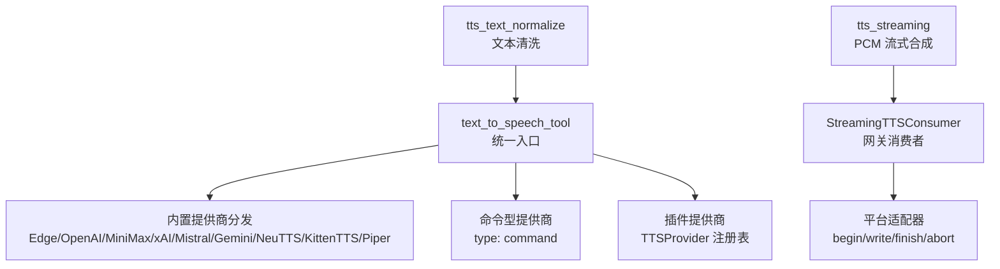
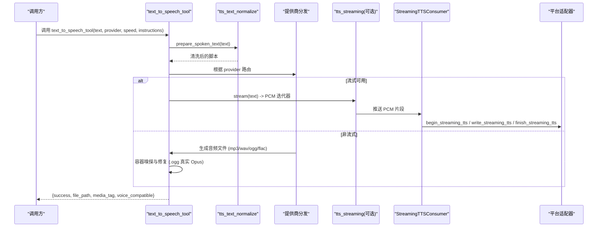
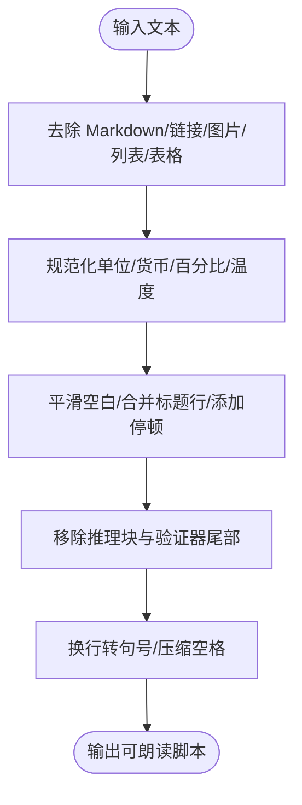
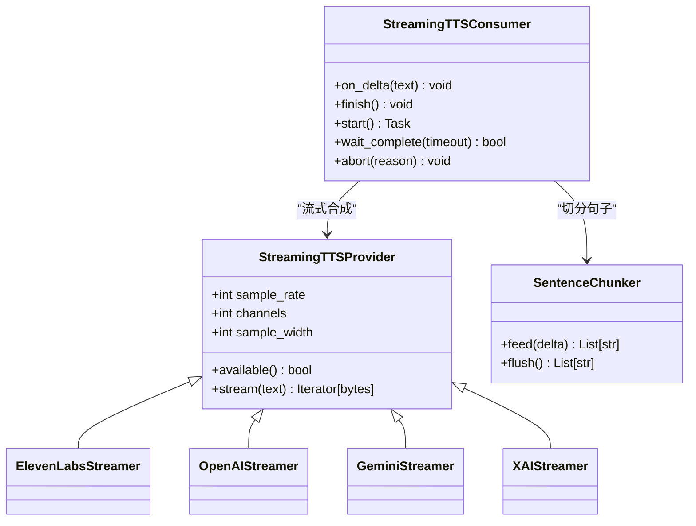
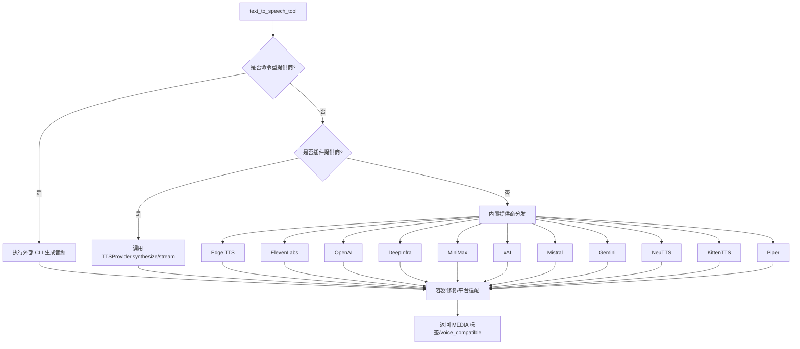
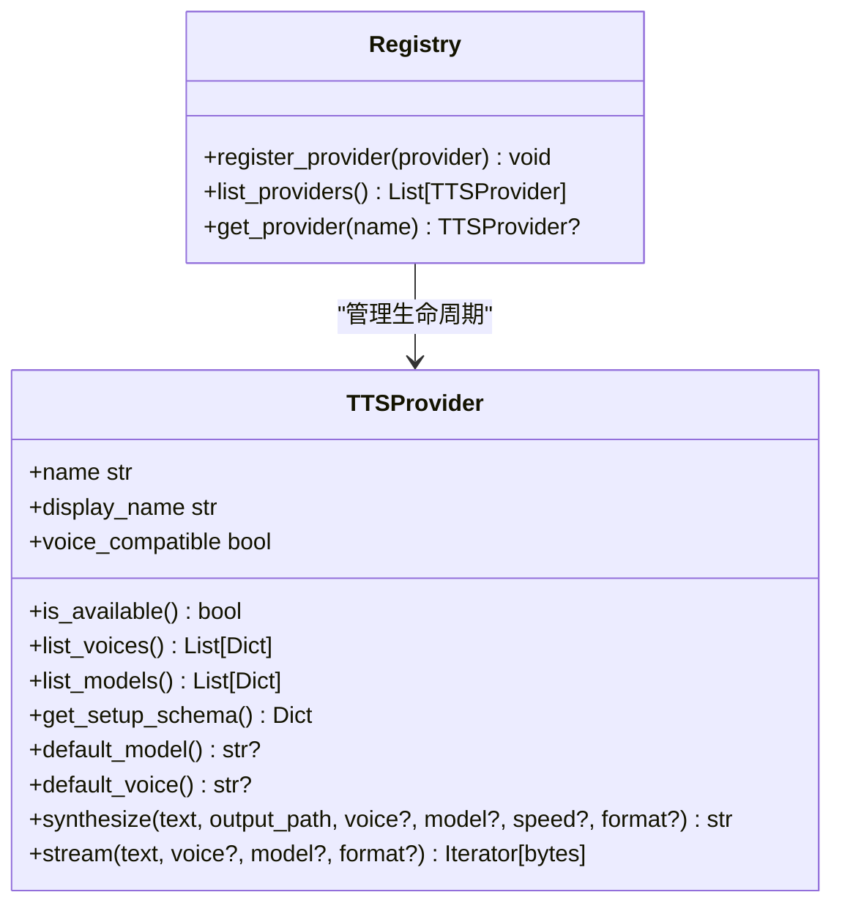
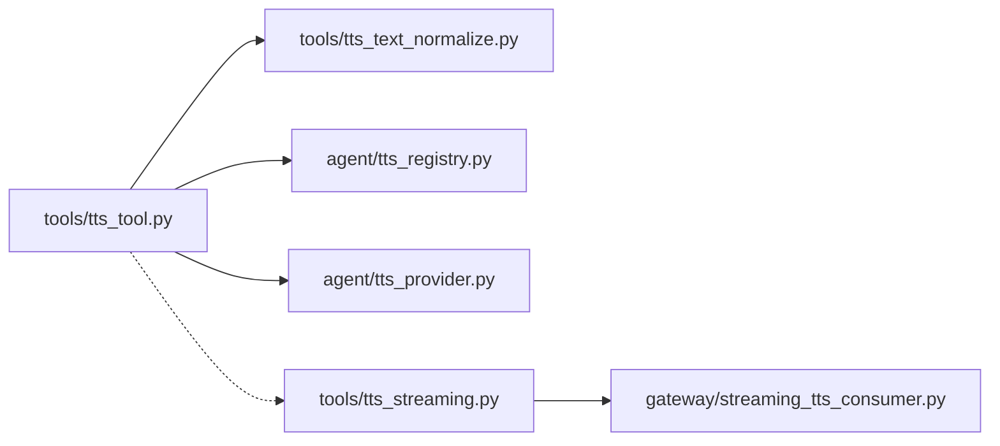

# 文字转语音工具

<cite>
**本文引用的文件**
- [tools/tts_tool.py](file://tools/tts_tool.py)
- [agent/tts_provider.py](file://agent/tts_provider.py)
- [agent/tts_registry.py](file://agent/tts_registry.py)
- [tools/tts_streaming.py](file://tools/tts_streaming.py)
- [gateway/streaming_tts_consumer.py](file://gateway/streaming_tts_consumer.py)
- [tools/tts_text_normalize.py](file://tools/tts_text_normalize.py)
</cite>

## 目录
1. [简介](#简介)
2. [项目结构](#项目结构)
3. [核心组件](#核心组件)
4. [架构总览](#架构总览)
5. [详细组件分析](#详细组件分析)
6. [依赖关系分析](#依赖关系分析)
7. [性能考量](#性能考量)
8. [故障排查指南](#故障排查指南)
9. [结论](#结论)
10. [附录：使用示例与最佳实践](#附录使用示例与最佳实践)

## 简介
本文件面向 Hermes Agent 的文字转语音（TTS）能力，系统性说明其支持的语音模型、音色选择、语言覆盖范围，以及实时流式合成、批量文本处理、音频格式转换等关键能力。文档同时对比不同 TTS 引擎的特点、音质与延迟表现，并提供文本预处理、参数调节、情感控制与音频后处理的实践建议，涵盖流式处理、缓存机制与错误处理的优化策略。

## 项目结构
Hermes 的 TTS 子系统由“工具层”“提供者抽象层”“流式通道”“网关消费者”和“文本预处理”五部分组成：
- 工具层：统一入口与调度，内置多种提供商实现，负责输出格式、平台适配与容器修复。
- 提供者抽象层：定义插件化 TTSProvider 接口与注册表，支持第三方扩展。
- 流式通道：提供 Provider 无关的 PCM 流式合成，对接 ElevenLabs、OpenAI、Gemini、xAI 等。
- 网关消费者：将 LLM 增量文本切分为句子并驱动流式合成，写入平台适配器。
- 文本预处理：清理 Markdown、符号、表情、推理块等，生成适合朗读的脚本。

**图示来源**
- [tools/tts_tool.py:2782-3157](file://tools/tts_tool.py#L2782-L3157)
- [tools/tts_text_normalize.py:261-278](file://tools/tts_text_normalize.py#L261-L278)
- [tools/tts_streaming.py:131-214](file://tools/tts_streaming.py#L131-L214)
- [gateway/streaming_tts_consumer.py:55-116](file://gateway/streaming_tts_consumer.py#L55-L116)

**章节来源**
- [tools/tts_tool.py:2782-3157](file://tools/tts_tool.py#L2782-L3157)
- [tools/tts_text_normalize.py:261-278](file://tools/tts_text_normalize.py#L261-L278)
- [tools/tts_streaming.py:131-214](file://tools/tts_streaming.py#L131-L214)
- [gateway/streaming_tts_consumer.py:55-116](file://gateway/streaming_tts_consumer.py#L55-L116)

## 核心组件
- 文本到语音工具（tools/tts_tool.py）
  - 统一入口 text_to_speech_tool，负责配置加载、文本长度限制、输出路径安全校验、提供商路由、音频容器修复与平台适配。
  - 内置提供商：Edge、ElevenLabs、OpenAI、DeepInfra、MiniMax、xAI、Mistral、Gemini、NeuTTS、KittenTTS、Piper。
  - 命令型提供商：通过 tts.providers.<name>: type: command 声明外部 CLI，支持占位符替换与环境透传。
  - 插件提供商：通过 agent.tts_registry 注册 TTSProvider，支持 list_voices/list_models/synthesize/stream。
- 文本预处理（tools/tts_text_normalize.py）
  - strip_markdown_for_tts、normalize_symbols_for_tts、smooth_whitespace_for_tts、strip_nonspoken_blocks、flatten_newlines_for_payload。
  - prepare_spoken_text 串联上述步骤，输出适合朗读的脚本。
- 流式合成（tools/tts_streaming.py）
  - StreamingTTSProvider 抽象 + 注册表；当前实现：ElevenLabs、OpenAI、Gemini、xAI。
  - SentenceChunker 按句切分增量文本，保证首包低延迟。
- 网关消费者（gateway/streaming_tts_consumer.py）
  - 将 LLM 增量文本送入 SentenceChunker，队列驱动异步任务消费，调用平台适配器 begin/write/finish/abort。
  - 维护 per-turn 状态，支持中断、完成、部分播放与抑制回退。

**章节来源**
- [tools/tts_tool.py:2782-3157](file://tools/tts_tool.py#L2782-L3157)
- [tools/tts_text_normalize.py:57-278](file://tools/tts_text_normalize.py#L57-L278)
- [tools/tts_streaming.py:89-214](file://tools/tts_streaming.py#L89-L214)
- [gateway/streaming_tts_consumer.py:55-116](file://gateway/streaming_tts_consumer.py#L55-L116)

## 架构总览
TTS 系统采用“工具层 + 提供商抽象 + 流式通道 + 网关消费者”的分层架构。工具层负责编排与兜底，流式通道提供低延迟 PCM 流，网关消费者桥接 LLM 增量与平台播放器。

**图示来源**
- [tools/tts_tool.py:2782-3157](file://tools/tts_tool.py#L2782-L3157)
- [tools/tts_streaming.py:131-214](file://tools/tts_streaming.py#L131-L214)
- [gateway/streaming_tts_consumer.py:218-339](file://gateway/streaming_tts_consumer.py#L218-L339)

## 详细组件分析

### 文本预处理模块
- 功能要点
  - 去除 Markdown、代码块、链接、图片、列表、表格管道符等视觉标记。
  - 规范化单位、货币、百分比、温度区间等符号，提升可读性。
  - 合并标题行与后续内容，避免断句突兀。
  - 移除 <think> 推理块与文件变更验证器尾部信息。
  - 将换行转换为单行或句号分隔，兼容对换行敏感的提供商。
- 复杂度与性能
  - 正则替换为主，线性时间 O(n)，适合长文本快速清洗。
- 错误处理
  - 空输入直接返回空串；异常时上层捕获并降级为 strip。

**图示来源**
- [tools/tts_text_normalize.py:57-278](file://tools/tts_text_normalize.py#L57-L278)

**章节来源**
- [tools/tts_text_normalize.py:57-278](file://tools/tts_text_normalize.py#L57-L278)

### 流式合成与网关消费者
- 流式提供者抽象
  - StreamingTTSProvider 定义 sample_rate/channels/sample_width 与 stream(text) 契约。
  - 已实现：ElevenLabs（pcm_24000）、OpenAI（pcm）、Gemini（SSE base64 PCM）、xAI（WebSocket PCM）。
  - 每句字节上限保护（16 MiB），防止上游失控。
- 网关消费者
  - on_delta 接收 LLM 增量文本，SentenceChunker 切分完整句子入队。
  - 异步任务从队列取句子，调用流式提供者获取 PCM 并写入平台适配器。
  - 支持 abort/finish/wait_complete，维护 partial/completed/suppress_whole_file 状态。

**图示来源**
- [tools/tts_streaming.py:131-214](file://tools/tts_streaming.py#L131-L214)
- [gateway/streaming_tts_consumer.py:55-116](file://gateway/streaming_tts_consumer.py#L55-L116)

**章节来源**
- [tools/tts_streaming.py:89-214](file://tools/tts_streaming.py#L89-L214)
- [gateway/streaming_tts_consumer.py:156-339](file://gateway/streaming_tts_consumer.py#L156-L339)

### 提供商分发与内置实现
- 分发逻辑
  - 优先命令型提供商（type: command），再尝试插件提供商，最后内置提供商链。
  - 内置名称白名单确保不会被同名插件覆盖。
  - 文本长度限制按提供商差异化（如 OpenAI 4096、xAI 15k、MiniMax 10k、ElevenLabs 模型感知等）。
- 内置提供商概览
  - Edge：免费、无需密钥，默认输出 MP3，必要时 ffmpeg 转 Opus。
  - ElevenLabs：高质量，支持流式 pcm_24000，需 ELEVENLABS_API_KEY。
  - OpenAI：gpt-4o-mini-tts 等，支持指令与速度控制，可走托管网关或直接直连。
  - DeepInfra：复用 OpenAI 接口，动态模型发现。
  - MiniMax：v1/text_to_speech 与 v1/t2a_v2 双端，支持音量/音高/情感/采样率/比特率。
  - xAI：独立 /v1/tts 端点，支持语速、流式延迟优化、文本归一化与自动情感标签。
  - Mistral：Voxtral TTS，原生 Opus 支持。
  - Gemini：generateContent 返回 PCM/L16，封装 WAV 后可转 MP3/Opus，支持音频标签重写。
  - NeuTTS/KittenTTS/Piper：本地离线方案，无需云端密钥。

**图示来源**
- [tools/tts_tool.py:2782-3157](file://tools/tts_tool.py#L2782-L3157)

**章节来源**
- [tools/tts_tool.py:2782-3157](file://tools/tts_tool.py#L2782-L3157)

### 插件化 TTSProvider 与注册表
- 抽象接口
  - name/display_name/is_available/list_voices/list_models/get_setup_schema/default_model/default_voice/synthesize/stream/voice_compatible。
- 注册表
  - 线程安全的 providers 字典，拒绝与内置名冲突的插件名，支持重注册与测试重置。
- 分发防御
  - 在工具层与插件层双重检查，确保内置 > 命令型 > 插件的优先级不变。

**图示来源**
- [agent/tts_provider.py:64-255](file://agent/tts_provider.py#L64-L255)
- [agent/tts_registry.py:67-128](file://agent/tts_registry.py#L67-L128)

**章节来源**
- [agent/tts_provider.py:64-255](file://agent/tts_provider.py#L64-L255)
- [agent/tts_registry.py:67-128](file://agent/tts_registry.py#L67-L128)

## 依赖关系分析
- 内部依赖
  - tools/tts_tool.py 依赖 tools/tts_text_normalize.py 进行文本清洗。
  - gateway/streaming_tts_consumer.py 依赖 tools/tts_streaming.py 的 SentenceChunker 与流式提供者解析。
  - tools/tts_streaming.py 依赖各提供商 SDK（openai、websockets、requests 等）并通过统一 PCM 契约输出。
- 外部依赖
  - 各提供商 API Key 与 SDK：ElevenLabs、OpenAI、Mistral、xAI、Gemini、DeepInfra、MiniMax。
  - 本地依赖：edge-tts、neutts、kittentts、piper-tts、ffmpeg（用于 Opus 转换与容器修复）。
- 潜在循环与解耦
  - 工具层与流式层通过 PCM 契约解耦；注册表与工具层通过名称匹配解耦；命令型提供商通过模板与占位符解耦。

**图示来源**
- [tools/tts_tool.py:2782-3157](file://tools/tts_tool.py#L2782-L3157)
- [tools/tts_streaming.py:131-214](file://tools/tts_streaming.py#L131-L214)
- [gateway/streaming_tts_consumer.py:55-116](file://gateway/streaming_tts_consumer.py#L55-L116)

**章节来源**
- [tools/tts_tool.py:2782-3157](file://tools/tts_tool.py#L2782-L3157)
- [tools/tts_streaming.py:131-214](file://tools/tts_streaming.py#L131-L214)
- [gateway/streaming_tts_consumer.py:55-116](file://gateway/streaming_tts_consumer.py#L55-L116)

## 性能考量
- 首包延迟
  - 流式提供者（ElevenLabs/OpenAI/Gemini/xAI）可在句子级首包到达，显著降低端到端延迟。
  - 非流式路径（Edge/NeuTTS/KittenTTS/Piper）以整句为单位，但可通过命令型提供商接入本地低延迟引擎。
- 吞吐与并发
  - 工具层对 Edge 使用线程池执行异步调用，避免阻塞主流程。
  - 网关消费者使用有界队列（maxsize=256）与异步任务，防止背压导致内存膨胀。
- 带宽与体积
  - 每句 PCM 字节上限 16 MiB，防止上游失控。
  - 输出格式按需选择：Telegram/Matrix/Feishu/WhatsApp/Signal 需要 Ogg/Opus；其他场景默认 MP3。
- 缓存机制
  - 输出目录默认 ~/voice-memos 或 ~/.hermes/cache/audio；文件名带时间戳，避免重复。
  - 命令型提供商可自定义输出路径与格式，便于外部缓存集成。
- 平台适配
  - 自动嗅探容器类型并在 .ogg 路径下修正为真实 Opus，避免平台渲染失败。

[本节为通用性能讨论，不直接分析具体文件]

## 故障排查指南
- 常见错误与定位
  - 缺少 API Key：ElevenLabs/OpenAI/Mistral/xAI/Gemini/DeepInfra/MiniMax 会抛出明确错误，检查对应环境变量或托管密钥。
  - 依赖缺失：未安装 edge-tts/openai/mistralai/kittentts/piper-tts/neutts 会导致导入失败，按提示安装。
  - 文本过长：超过提供商限制会被截断并记录警告，调整文本或提高限制。
  - 容器不匹配：.ogg 文件实际为 MP3/WAV/FLAC，系统会自动转码或重命名为真实扩展。
  - 命令型提供商超时/退出：捕获子进程输出与错误，检查命令模板与 env_passthrough。
- 调试建议
  - 启用日志查看提供商选择、文本长度截断、容器修复与转换过程。
  - 使用 check_tts_requirements 预检当前提供商可用性。
  - 对于流式路径，关注 SentenceChunker 输出与队列丢弃标志 dropped。

**章节来源**
- [tools/tts_tool.py:2782-3157](file://tools/tts_tool.py#L2782-L3157)
- [tools/tts_tool.py:1236-1366](file://tools/tts_tool.py#L1236-L1366)
- [gateway/streaming_tts_consumer.py:156-339](file://gateway/streaming_tts_consumer.py#L156-L339)

## 结论
Hermes 的 TTS 子系统通过统一的工具层、灵活的提供商抽象与高效的流式通道，实现了多后端、多格式、多平台的语音合成能力。内置提供商覆盖云端与本地场景，流式通道保障低延迟对话体验，网关消费者确保增量文本到音频的无缝衔接。结合文本预处理、容器修复与平台适配，系统在易用性与鲁棒性之间取得良好平衡。

[本节为总结性内容，不直接分析具体文件]

## 附录：使用示例与最佳实践
- 文本预处理
  - 使用 prepare_spoken_text 清理 Markdown、符号与推理块，得到适合朗读的脚本。
  - 对换行敏感的后端，使用 flatten_newlines_for_payload 将换行转为句号分隔。
- 语音参数调节
  - 全局 speed：在 tts.speed 或 per-call speed 中设置，范围 0.25–4.0。
  - 提供商特定参数：
    - OpenAI：instructions 控制语气/情感/节奏；model/voice/base_url 可配置。
    - xAI：speed、optimize_streaming_latency、text_normalization、auto_speech_tags。
    - MiniMax：vol、pitch、emotion、sample_rate、bitrate。
    - Gemini：persona_prompt_file、audio_tags 控制情感标签。
- 情感控制
  - xAI：自动插入 [pause]/[whisper]/[loud] 等标签，或通过辅助模型重写增强表达。
  - Gemini：启用 audio_tags 并使用辅助模型注入 [whispers]/[excitedly] 等标签。
- 音频后处理
  - 容器修复：自动检测 .ogg 是否为真实 Opus，否则转码或重命名。
  - 平台适配：Telegram/Matrix/Feishu/WhatsApp/Signal 需要 Ogg/Opus；其他场景默认 MP3。
- 流式处理
  - 使用 tts.streaming.provider 指定或 auto 选择最佳流式提供商。
  - 网关消费者自动切分句子并写入平台适配器，支持中断与完成回调。
- 缓存机制
  - 输出文件默认保存在 ~/.hermes/cache/audio 或 ~/voice-memos，文件名带时间戳。
  - 命令型提供商可自定义输出路径，便于外部缓存与归档。
- 错误处理
  - 统一捕获配置错误、依赖缺失与运行时异常，返回标准 JSON 错误信封。
  - 命令型提供商超时/退出时保留 stdout/stderr 以便诊断。

**章节来源**
- [tools/tts_text_normalize.py:261-278](file://tools/tts_text_normalize.py#L261-L278)
- [tools/tts_tool.py:2782-3157](file://tools/tts_tool.py#L2782-L3157)
- [tools/tts_streaming.py:175-214](file://tools/tts_streaming.py#L175-L214)
- [gateway/streaming_tts_consumer.py:218-339](file://gateway/streaming_tts_consumer.py#L218-L339)