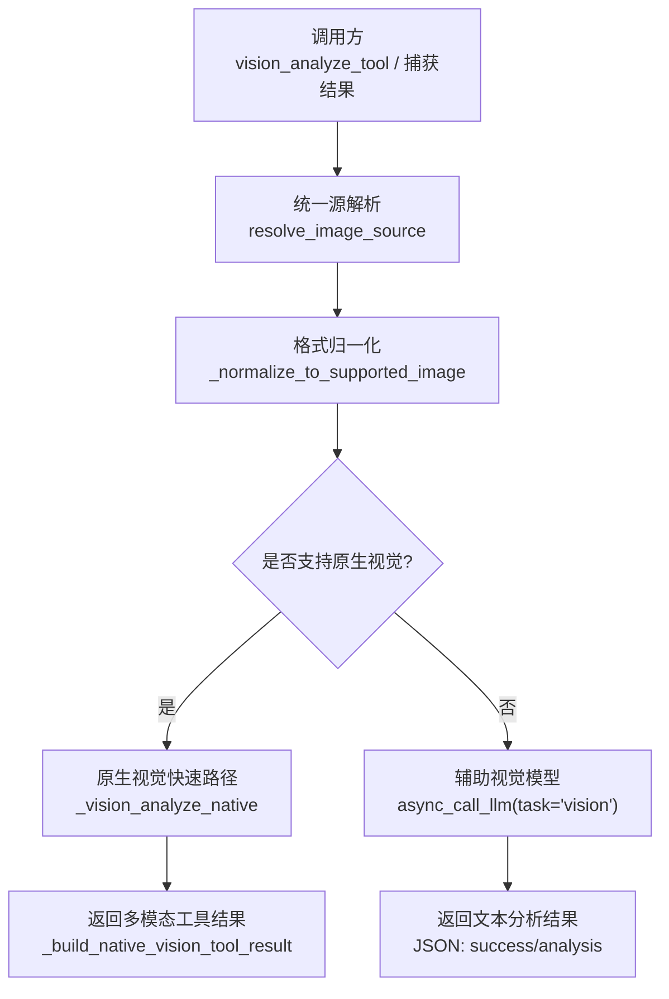
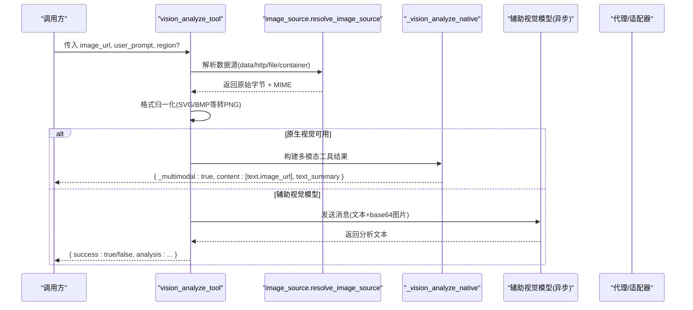
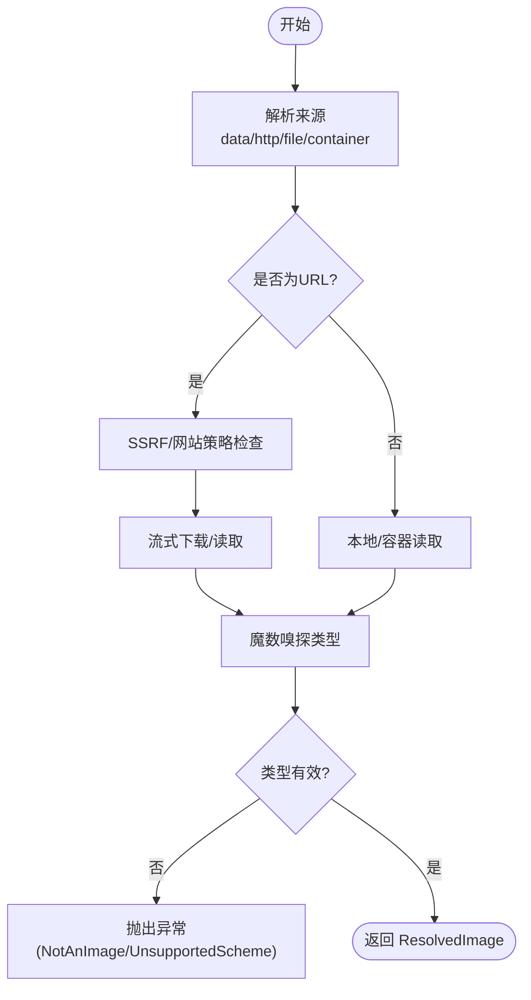
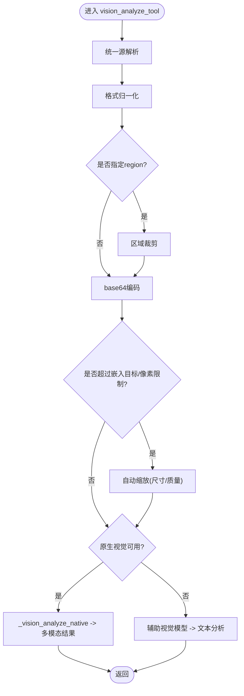
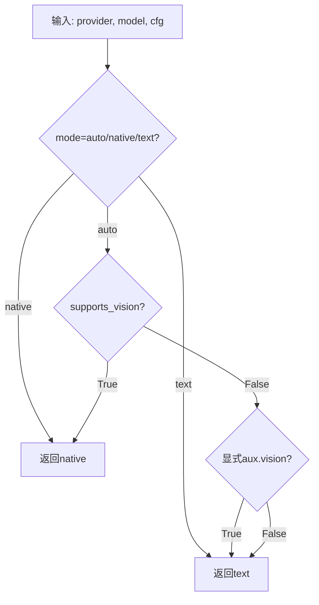
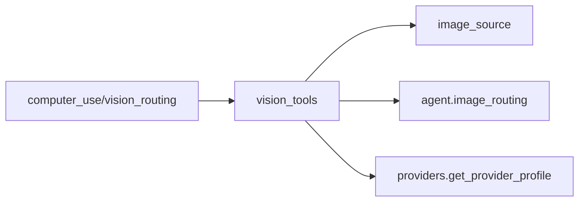

# 视觉处理工具

<cite>
**本文引用的文件**
- [tools/vision_tools.py](file://tools/vision_tools.py)
- [tools/image_source.py](file://tools/image_source.py)
- [agent/image_routing.py](file://agent/image_routing.py)
- [tools/computer_use/vision_routing.py](file://tools/computer_use/vision_routing.py)
- [tests/tools/test_vision_tools.py](file://tests/tools/test_vision_tools.py)
</cite>

## 目录
1. [简介](#简介)
2. [项目结构](#项目结构)
3. [核心组件](#核心组件)
4. [架构总览](#架构总览)
5. [详细组件分析](#详细组件分析)
6. [依赖关系分析](#依赖关系分析)
7. [性能与内存优化](#性能与内存优化)
8. [故障排查指南](#故障排查指南)
9. [结论](#结论)
10. [附录：使用示例与最佳实践](#附录使用示例与最佳实践)

## 简介
本文件面向 Hermes Agent 的视觉处理能力，系统性说明图像理解与分析的实现方式、模型集成路径、输入预处理、格式规范、错误恢复与性能优化。内容覆盖：
- 图像描述生成（通过辅助视觉模型或主模型的“原生视觉”快速路径）
- OCR 文字识别（由多模态视觉模型在提示词中驱动完成）
- 对象检测与图像分类（由多模态视觉模型结合用户提示完成）
- 支持的图像格式、尺寸与大小限制
- 批量处理、参数配置、结果格式化与调试
- 图像处理优化、内存管理与错误恢复的最佳实践

## 项目结构
Hermes Agent 的视觉处理由多个模块协作完成：
- 统一源解析：将 data:/http(s):/本地路径/容器路径等来源统一为原始字节并做安全校验与类型检查
- 视觉工具：封装下载、格式归一化、区域裁剪、自动缩放、base64 编码、调用辅助视觉模型或走原生视觉快速路径
- 路由决策：根据当前主模型能力与配置决定“原生视觉”还是“文本模式”（先由辅助模型生成文本描述再交给主模型）
- 计算机用图捕获路由：对截图类捕获结果进行同样的路由判断，避免向不支持多模态的工具结果注入图片导致失败

图表来源
- [tools/vision_tools.py:1226-1529](file://tools/vision_tools.py#L1226-L1529)
- [tools/image_source.py:95-157](file://tools/image_source.py#L95-L157)
- [agent/image_routing.py:461-506](file://agent/image_routing.py#L461-L506)
- [tools/computer_use/vision_routing.py:164-199](file://tools/computer_use/vision_routing.py#L164-L199)

章节来源
- [tools/vision_tools.py:1-120](file://tools/vision_tools.py#L1-L120)
- [tools/image_source.py:1-32](file://tools/image_source.py#L1-L32)
- [agent/image_routing.py:1-37](file://agent/image_routing.py#L1-L37)
- [tools/computer_use/vision_routing.py:1-46](file://tools/computer_use/vision_routing.py#L1-L46)

## 核心组件
- 统一源解析器（image_source）
  - 支持 data URL、HTTP(S) URL、本地路径、容器内路径读取
  - 严格的安全策略：SSRF 防护、网站访问策略、凭据文件保护、非本地后端下的沙箱边界读取
  - 统一的 MIME 嗅探与类型检查（图像/视频），以及最大摄入字节限制
- 视觉工具（vision_tools）
  - 下载与流式写入、重定向 SSRF 防护、网站策略检查
  - 格式归一化（SVG 光栅化为 PNG；其他非通用格式转 PNG）
  - 区域裁剪（region=[x1,y1,x2,y2]）
  - base64 编码与自动缩放（按字节与像素维度双重限制）
  - 原生视觉快速路径：当主模型支持且 provider 允许在 tool result 中携带图片时，直接返回多模态结果
  - 辅助视觉模型路径：通过 centralized router 调用 vision 任务，返回 JSON 文本分析
- 路由决策（image_routing, computer_use/vision_routing）
  - 依据配置与模型能力选择 native/text 模式
  - 对 capture 结果决定是否预分析为文本再交给主模型

章节来源
- [tools/image_source.py:95-157](file://tools/image_source.py#L95-L157)
- [tools/vision_tools.py:245-379](file://tools/vision_tools.py#L245-L379)
- [tools/vision_tools.py:745-889](file://tools/vision_tools.py#L745-L889)
- [tools/vision_tools.py:904-1003](file://tools/vision_tools.py#L904-L1003)
- [agent/image_routing.py:461-506](file://agent/image_routing.py#L461-L506)
- [tools/computer_use/vision_routing.py:164-199](file://tools/computer_use/vision_routing.py#L164-L199)

## 架构总览
下图展示一次典型的视觉分析请求从入口到最终结果的完整流程，包括两种路径：原生视觉快速路径与辅助视觉模型路径。

图表来源
- [tools/vision_tools.py:1226-1529](file://tools/vision_tools.py#L1226-L1529)
- [tools/image_source.py:95-157](file://tools/image_source.py#L95-L157)
- [tools/vision_tools.py:1076-1215](file://tools/vision_tools.py#L1076-L1215)

## 详细组件分析

### 统一源解析器（image_source）
- 功能要点
  - 支持多种来源：data URL、HTTP(S)、本地路径、容器路径
  - 安全策略：SSRF 防护、网站策略拦截、凭据文件保护
  - 类型检查：基于魔数嗅探图像/视频类型，拒绝非法输入
  - 容量限制：摄入上限 50MB，防止内存溢出
- 关键流程
  - 解析 URL/路径 -> 安全检查 -> 下载/读取 -> 类型验证 -> 返回 ResolvedImage(bytes, mime, origin)

图表来源
- [tools/image_source.py:95-157](file://tools/image_source.py#L95-L157)
- [tools/image_source.py:159-172](file://tools/image_source.py#L159-L172)
- [tools/image_source.py:195-210](file://tools/image_source.py#L195-L210)
- [tools/image_source.py:384-424](file://tools/image_source.py#L384-L424)

章节来源
- [tools/image_source.py:95-157](file://tools/image_source.py#L95-L157)
- [tools/image_source.py:159-172](file://tools/image_source.py#L159-L172)
- [tools/image_source.py:195-210](file://tools/image_source.py#L195-L210)
- [tools/image_source.py:384-424](file://tools/image_source.py#L384-L424)

### 视觉工具（vision_tools）
- 功能要点
  - 下载与重试：带超时、SSRF 重定向防护、网站策略检查、可重试错误分类
  - 格式归一化：仅保留主流视觉提供商接受的媒体类型（JPEG/PNG/GIF/WebP），SVG 光栅化为 PNG
  - 区域裁剪：支持 region=[x1,y1,x2,y2] 精确聚焦细节
  - 自动缩放：按 base64 字节长度与最长边像素限制双重控制，必要时降低质量或尺寸
  - 原生视觉快速路径：当主模型支持且 provider 允许在 tool result 中携带图片时，直接返回多模态结果
  - 辅助视觉模型路径：通过 centralized router 调用 vision 任务，返回 JSON 文本分析
- 关键流程
  - 解析来源 -> 归一化 -> 可选裁剪 -> base64 编码 -> 尺寸/像素检查 -> 快速路径或辅助模型 -> 返回结果

图表来源
- [tools/vision_tools.py:1226-1529](file://tools/vision_tools.py#L1226-L1529)
- [tools/vision_tools.py:745-889](file://tools/vision_tools.py#L745-L889)
- [tools/vision_tools.py:1076-1215](file://tools/vision_tools.py#L1076-L1215)

章节来源
- [tools/vision_tools.py:245-379](file://tools/vision_tools.py#L245-L379)
- [tools/vision_tools.py:406-572](file://tools/vision_tools.py#L406-L572)
- [tools/vision_tools.py:745-889](file://tools/vision_tools.py#L745-L889)
- [tools/vision_tools.py:904-1003](file://tools/vision_tools.py#L904-L1003)
- [tools/vision_tools.py:1076-1215](file://tools/vision_tools.py#L1076-L1215)
- [tools/vision_tools.py:1226-1529](file://tools/vision_tools.py#L1226-L1529)

### 路由决策（image_routing, computer_use/vision_routing）
- 功能要点
  - 根据配置与模型能力决定“原生视觉”或“文本模式”
  - 对计算机用图的捕获结果进行同样路由判断，避免向不支持多模态的工具结果注入图片导致失败
- 关键逻辑
  - 若用户显式配置了辅助视觉后端，则优先走文本模式（除非主模型明确支持原生视觉）
  - 若主模型声明 supports_vision=True，则走原生视觉
  - 否则回退到文本模式（先由辅助模型生成描述）

图表来源
- [agent/image_routing.py:461-506](file://agent/image_routing.py#L461-L506)
- [tools/computer_use/vision_routing.py:164-199](file://tools/computer_use/vision_routing.py#L164-L199)

章节来源
- [agent/image_routing.py:461-506](file://agent/image_routing.py#L461-L506)
- [tools/computer_use/vision_routing.py:164-199](file://tools/computer_use/vision_routing.py#L164-L199)

## 依赖关系分析
- 模块耦合
  - vision_tools 依赖 image_source 进行统一源解析
  - vision_tools 依赖 agent.image_routing 与 providers 能力判定以启用原生视觉快速路径
  - computer_use/vision_routing 复用 vision_tools 的多模态工具结果支持判断
- 外部依赖
  - Pillow（软依赖）用于格式转换与缩放
  - httpx 用于网络下载与流式写入
  - 辅助视觉客户端（centralized router）用于调用多模态模型

图表来源
- [tools/vision_tools.py:904-1003](file://tools/vision_tools.py#L904-L1003)
- [tools/image_source.py:95-157](file://tools/image_source.py#L95-L157)
- [tools/computer_use/vision_routing.py:164-199](file://tools/computer_use/vision_routing.py#L164-L199)

章节来源
- [tools/vision_tools.py:904-1003](file://tools/vision_tools.py#L904-L1003)
- [tools/image_source.py:95-157](file://tools/image_source.py#L95-L157)
- [tools/computer_use/vision_routing.py:164-199](file://tools/computer_use/vision_routing.py#L164-L199)

## 性能与内存优化
- CPU 并发控制
  - 针对 encode/resize 的 CPU 密集型操作，使用有界线程池限制并发度，避免事件循环饥饿
  - 并发度来源于主机可用核心数或配置项，确保 LLM 调用保持全并发
- 内存与大小限制
  - 下载流式写入临时文件，限制最大下载字节数
  - 嵌入前主动限制 base64 长度与像素维度，避免会话被不可变历史中的超大图片永久卡住
  - 自动缩放策略：按比例缩小、降低 JPEG 质量，直至满足限制
- 错误恢复
  - 下载阶段区分可重试与不可重试错误，指数退避重试
  - API 拒绝大图片时自动缩放并重试一次
  - 空内容响应时重试一次，提升鲁棒性

章节来源
- [tools/vision_tools.py:101-210](file://tools/vision_tools.py#L101-L210)
- [tools/vision_tools.py:406-572](file://tools/vision_tools.py#L406-L572)
- [tools/vision_tools.py:624-689](file://tools/vision_tools.py#L624-L689)
- [tools/vision_tools.py:745-889](file://tools/vision_tools.py#L745-L889)
- [tools/vision_tools.py:1433-1460](file://tools/vision_tools.py#L1433-L1460)

## 故障排查指南
- 常见错误与定位
  - 图片格式不受支持：检查归一化步骤，确认已转换为 PNG/JPEG/GIF/WebP；SVG 需安装光栅化工具
  - 图片过大：查看 base64 长度与像素维度限制，启用自动缩放或手动压缩
  - 下载失败：检查网站策略、SSRF 防护、网络状态；关注可重试错误分类
  - 原生视觉不可用：检查主模型 supports_vision 与 provider 是否允许在多模态工具结果中携带图片
- 调试建议
  - 开启 vision_tools 调试日志，记录调用参数、错误信息与处理步骤
  - 使用测试用例验证 URL 校验、MIME 映射、base64 编码与缩放行为

章节来源
- [tools/vision_tools.py:245-379](file://tools/vision_tools.py#L245-L379)
- [tools/vision_tools.py:624-689](file://tools/vision_tools.py#L624-L689)
- [tools/vision_tools.py:1481-1529](file://tools/vision_tools.py#L1481-L1529)
- [tests/tools/test_vision_tools.py:38-104](file://tests/tools/test_vision_tools.py#L38-L104)
- [tests/tools/test_vision_tools.py:173-200](file://tests/tools/test_vision_tools.py#L173-L200)

## 结论
Hermes Agent 的视觉处理通过统一源解析、严格的格式归一化与尺寸控制、以及双路径（原生视觉快速路径与辅助视觉模型）实现了高可靠、高性能的图像理解与分析。其设计兼顾安全性（SSRF、网站策略、凭据保护）、可扩展性（多 provider 适配）与鲁棒性（自动缩放、重试、错误恢复）。在生产环境中，建议合理配置并发与大小限制，并借助调试日志与测试用例持续验证行为。

## 附录：使用示例与最佳实践
- 图像预处理
  - 使用 region=[x1,y1,x2,y2] 聚焦细节，提高分析精度
  - 对于 SVG 等非光栅格式，确保系统具备光栅化工具或提前转换为 PNG
- 分析参数配置
  - 通过配置项设置辅助视觉模型的 timeout、temperature、max_concurrency 等
  - 根据场景调整嵌入目标字节与像素维度限制，平衡质量与成本
- 结果格式化
  - 原生视觉路径返回多模态工具结果，包含文本与图片内容
  - 辅助视觉路径返回 JSON 文本分析，便于后续处理
- 批量处理
  - 利用有界 CPU 线程池并行执行 encode/resize，LLM 调用保持并发
  - 注意监控内存与磁盘占用，及时清理临时文件
- 最佳实践
  - 始终启用网站策略与 SSRF 防护
  - 对超大图片采用自动缩放或手动压缩
  - 使用调试日志与测试用例定位问题

章节来源
- [tools/vision_tools.py:1226-1529](file://tools/vision_tools.py#L1226-L1529)
- [tools/vision_tools.py:1076-1215](file://tools/vision_tools.py#L1076-L1215)
- [tools/vision_tools.py:1542-1565](file://tools/vision_tools.py#L1542-L1565)
- [tests/tools/test_vision_tools.py:38-104](file://tests/tools/test_vision_tools.py#L38-L104)