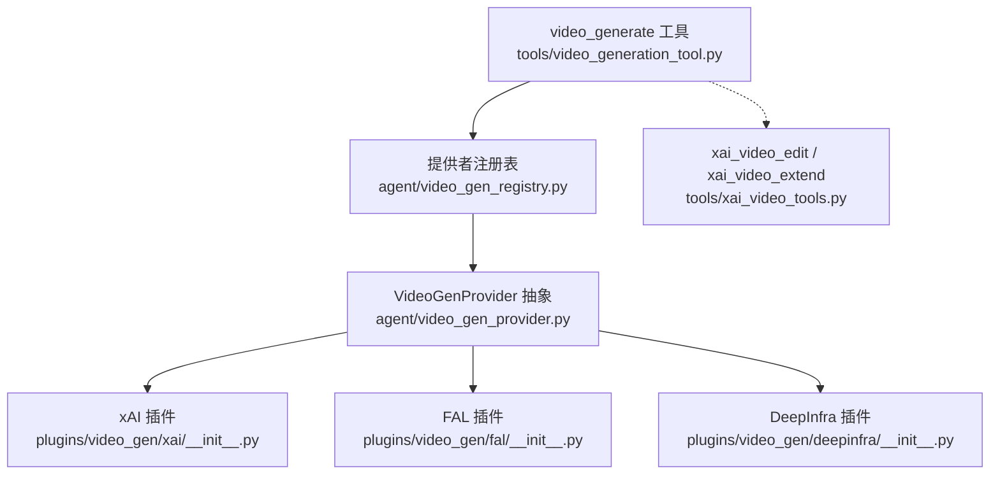
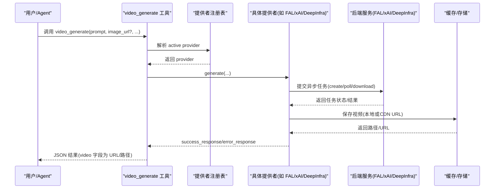
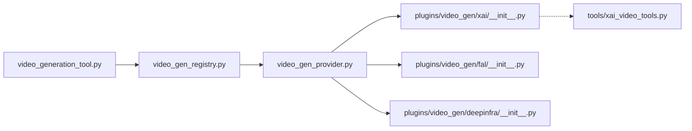

# 视频生成工具

<cite>
**本文引用的文件**
- [agent/video_gen_provider.py](file://agent/video_gen_provider.py)
- [agent/video_gen_registry.py](file://agent/video_gen_registry.py)
- [tools/video_generation_tool.py](file://tools/video_generation_tool.py)
- [plugins/video_gen/xai/__init__.py](file://plugins/video_gen/xai/__init__.py)
- [plugins/video_gen/fal/__init__.py](file://plugins/video_gen/fal/__init__.py)
- [plugins/video_gen/deepinfra/__init__.py](file://plugins/video_gen/deepinfra/__init__.py)
- [tools/xai_video_tools.py](file://tools/xai_video_tools.py)
</cite>

## 目录
1. [简介](#简介)
2. [项目结构](#项目结构)
3. [核心组件](#核心组件)
4. [架构总览](#架构总览)
5. [详细组件分析](#详细组件分析)
6. [依赖关系分析](#依赖关系分析)
7. [性能与质量](#性能与质量)
8. [故障排查指南](#故障排查指南)
9. [结论](#结论)
10. [附录：使用示例与最佳实践](#附录使用示例与最佳实践)

## 简介
本文件面向 Hermes Agent 的视频生成能力，系统性说明如何统一调用文本到视频、图像转视频、参考图引导生成，以及 xAI 专属的视频编辑/扩展。文档覆盖模型集成方式、参数配置、质量控制、输出格式、时长限制、分辨率与帧率控制、文件大小优化、批处理与进度跟踪、错误恢复等主题，帮助开发者与使用者高效、稳定地生产高质量视频内容。

## 项目结构
视频生成功能由“工具层 + 提供者抽象 + 插件实现”三层构成：
- 工具层：暴露统一的 video_generate 工具，屏蔽后端差异；同时提供 xAI 专用的编辑/扩展工具。
- 提供者抽象：定义 VideoGenProvider 接口与通用响应构造、缓存落盘、URL 下载等能力。
- 插件实现：xFAL（多模型族）、xAI（Grok Imagine）、DeepInfra（OpenAI 兼容）等具体后端。

图表来源
- [tools/video_generation_tool.py:62-160](file://tools/video_generation_tool.py#L62-L160)
- [agent/video_gen_registry.py:36-127](file://agent/video_gen_registry.py#L36-L127)
- [agent/video_gen_provider.py:75-196](file://agent/video_gen_provider.py#L75-L196)
- [plugins/video_gen/xai/__init__.py:366-453](file://plugins/video_gen/xai/__init__.py#L366-L453)
- [plugins/video_gen/fal/__init__.py:539-741](file://plugins/video_gen/fal/__init__.py#L539-L741)
- [plugins/video_gen/deepinfra/__init__.py:25-90](file://plugins/video_gen/deepinfra/__init__.py#L25-L90)
- [tools/xai_video_tools.py:70-209](file://tools/xai_video_tools.py#L70-L209)

章节来源
- [tools/video_generation_tool.py:1-587](file://tools/video_generation_tool.py#L1-L587)
- [agent/video_gen_provider.py:1-591](file://agent/video_gen_provider.py#L1-L591)
- [agent/video_gen_registry.py:1-134](file://agent/video_gen_registry.py#L1-L134)

## 核心组件
- 统一工具入口：video_generate 支持文本到视频、图像转视频、参考图引导生成；通过 image_url 的存在与否自动路由到对应端点。
- 提供者抽象：VideoGenProvider 定义 generate、capabilities、list_models 等；OpenAICompatibleVideoGenProvider 封装 OpenAI 兼容的异步任务创建、轮询、下载与本地缓存。
- 注册中心：根据配置或可用提供者选择当前生效的后端，并支持热插拔插件。
- 插件实现：
  - xAI：Grok Imagine 系列，支持文本/图像/参考图，并提供独立的编辑/扩展工具。
  - FAL：聚合多个模型族（如 Veo 3.1、Pixverse v6、Seedance、Kling 4K、Happy Horse 等），按模型族能力构建请求体。
  - DeepInfra：基于 OpenAI 兼容 API 的统一封装，动态拉取模型目录。

章节来源
- [tools/video_generation_tool.py:62-160](file://tools/video_generation_tool.py#L62-L160)
- [agent/video_gen_provider.py:75-196](file://agent/video_gen_provider.py#L75-L196)
- [agent/video_gen_registry.py:79-127](file://agent/video_gen_registry.py#L79-L127)
- [plugins/video_gen/xai/__init__.py:366-453](file://plugins/video_gen/xai/__init__.py#L366-L453)
- [plugins/video_gen/fal/__init__.py:539-741](file://plugins/video_gen/fal/__init__.py#L539-L741)
- [plugins/video_gen/deepinfra/__init__.py:25-90](file://plugins/video_gen/deepinfra/__init__.py#L25-L90)

## 架构总览
下图展示从工具调用到后端执行的完整流程，包括参数校验、提供者选择、请求构建、异步任务轮询与结果落盘。

图表来源
- [tools/video_generation_tool.py:310-410](file://tools/video_generation_tool.py#L310-L410)
- [agent/video_gen_registry.py:79-127](file://agent/video_gen_registry.py#L79-L127)
- [agent/video_gen_provider.py:319-371](file://agent/video_gen_provider.py#L319-L371)
- [plugins/video_gen/fal/__init__.py:608-741](file://plugins/video_gen/fal/__init__.py#L608-L741)
- [plugins/video_gen/xai/__init__.py:552-661](file://plugins/video_gen/xai/__init__.py#L552-L661)
- [agent/video_gen_provider.py:255-316](file://agent/video_gen_provider.py#L255-L316)

## 详细组件分析

### 统一工具：video_generate
- 功能：统一入口，支持文本到视频、图像转视频、参考图引导生成。
- 参数：prompt（必填）、image_url（可选，存在则走图像转视频）、reference_image_urls（可选列表）、duration、aspect_ratio、resolution、negative_prompt、audio、seed、model（可选覆盖）。
- 行为：对参数进行轻量校验；根据配置或可用提供者选择后端；将参数透传给 provider.generate；返回统一 JSON 结构。
- 动态描述：根据当前 provider 的 capabilities 和模型元数据，动态生成工具描述，提示支持的模态、分辨率、时长范围、音频/负向提示等。

章节来源
- [tools/video_generation_tool.py:62-160](file://tools/video_generation_tool.py#L62-L160)
- [tools/video_generation_tool.py:168-191](file://tools/video_generation_tool.py#L168-L191)
- [tools/video_generation_tool.py:199-265](file://tools/video_generation_tool.py#L199-L265)
- [tools/video_generation_tool.py:310-410](file://tools/video_generation_tool.py#L310-L410)
- [tools/video_generation_tool.py:430-568](file://tools/video_generation_tool.py#L430-L568)

### 提供者抽象：VideoGenProvider 与 OpenAI 兼容基类
- VideoGenProvider：定义 name、display_name、is_available、list_models、capabilities、generate 等；默认 capabilities 声明基础能力集。
- OpenAICompatibleVideoGenProvider：封装 OpenAI 兼容的 videos.create → poll → download_content 流程；内置轮询间隔与超时保护；支持将短链 CDN 地址下载到本地缓存，避免下游消费时失效。
- 辅助函数：success_response/error_response 统一响应结构；save_b64_video/save_bytes_video/save_url_video 安全落盘与大小限制。

章节来源
- [agent/video_gen_provider.py:75-196](file://agent/video_gen_provider.py#L75-L196)
- [agent/video_gen_provider.py:379-591](file://agent/video_gen_provider.py#L379-L591)
- [agent/video_gen_provider.py:204-316](file://agent/video_gen_provider.py#L204-L316)

### 注册中心：active provider 选择
- 读取配置 video_gen.provider；若未配置，回退到“唯一可用的提供者”。
- 线程安全注册表；支持重新注册与测试重置。

章节来源
- [agent/video_gen_registry.py:36-127](file://agent/video_gen_registry.py#L36-L127)

### 插件：xFAL（多模型族）
- 模型族：包含 LTX 2.3、Pixverse v6、Seedance 2.0/2.5 Mini、Veo 3.1、MiniMax H3、FLUX 3、Grok Imagine 1.5、Gemini Omni Flash、Kling v3 4K、Happy Horse 等。
- 路由：根据 image_url 是否存在选择 text-to-video 或 image-to-video 端点。
- 能力映射：每个模型族声明支持的 aspect_ratios、resolutions、durations、audio、negative_prompt 等；构建请求体时按能力裁剪参数。
- 认证：支持直接 FAL_KEY 或托管网关（Nous Subscription）。
- 输出：返回 HTTPS CDN URL，附带 file_size/content_type 等额外信息。

章节来源
- [plugins/video_gen/fal/__init__.py:72-276](file://plugins/video_gen/fal/__init__.py#L72-L276)
- [plugins/video_gen/fal/__init__.py:353-417](file://plugins/video_gen/fal/__init__.py#L353-L417)
- [plugins/video_gen/fal/__init__.py:492-531](file://plugins/video_gen/fal/__init__.py#L492-L531)
- [plugins/video_gen/fal/__init__.py:539-741](file://plugins/video_gen/fal/__init__.py#L539-L741)

### 插件：xAI（Grok Imagine）
- 模型：grok-imagine-video（文本/图像）、grok-imagine-video-1.5（图像为主）。
- 输入：支持 image_url、reference_image_urls（最多 7 张）、aspect_ratio、resolution、duration 等；参考图与 image_url 不可同时使用。
- 输出：优先返回 files-cdn 的 public HTTPS MP4 URL；若无存储则返回临时 URL。
- 编辑/扩展：提供 xai_video_edit、xai_video_extend 两个专用工具，要求传入公共 HTTPS MP4 URL。

章节来源
- [plugins/video_gen/xai/__init__.py:45-81](file://plugins/video_gen/xai/__init__.py#L45-L81)
- [plugins/video_gen/xai/__init__.py:146-176](file://plugins/video_gen/xai/__init__.py#L146-L176)
- [plugins/video_gen/xai/__init__.py:179-200](file://plugins/video_gen/xai/__init__.py#L179-L200)
- [plugins/video_gen/xai/__init__.py:249-303](file://plugins/video_gen/xai/__init__.py#L249-L303)
- [plugins/video_gen/xai/__init__.py:366-453](file://plugins/video_gen/xai/__init__.py#L366-L453)
- [plugins/video_gen/xai/__init__.py:552-661](file://plugins/video_gen/xai/__init__.py#L552-L661)
- [tools/xai_video_tools.py:70-209](file://tools/xai_video_tools.py#L70-L209)

### 插件：DeepInfra（OpenAI 兼容）
- 复用 OpenAICompatibleVideoGenProvider，动态拉取 DeepInfra 的 video-gen 标签模型。
- 能力：支持文本/图像、常见宽高比与分辨率、负向提示等。

章节来源
- [plugins/video_gen/deepinfra/__init__.py:25-90](file://plugins/video_gen/deepinfra/__init__.py#L25-L90)

## 依赖关系分析
- 工具层依赖注册中心以选择 active provider。
- 各插件实现 VideoGenProvider 接口，并通过 ctx.register_video_gen_provider 注入注册表。
- OpenAI 兼容基类依赖 openai SDK；xFAL 依赖 fal_client 或托管网关；xAI 依赖 httpx 与 xAI HTTP 工具。

图表来源
- [tools/video_generation_tool.py:576-586](file://tools/video_generation_tool.py#L576-L586)
- [agent/video_gen_registry.py:40-68](file://agent/video_gen_registry.py#L40-L68)
- [agent/video_gen_provider.py:75-196](file://agent/video_gen_provider.py#L75-L196)
- [plugins/video_gen/xai/__init__.py:366-453](file://plugins/video_gen/xai/__init__.py#L366-L453)
- [plugins/video_gen/fal/__init__.py:749-751](file://plugins/video_gen/fal/__init__.py#L749-L751)
- [plugins/video_gen/deepinfra/__init__.py:88-90](file://plugins/video_gen/deepinfra/__init__.py#L88-L90)
- [tools/xai_video_tools.py:189-209](file://tools/xai_video_tools.py#L189-L209)

章节来源
- [agent/video_gen_registry.py:40-127](file://agent/video_gen_registry.py#L40-L127)
- [tools/video_generation_tool.py:576-586](file://tools/video_generation_tool.py#L576-L586)

## 性能与质量
- 轮询与超时：OpenAI 兼容基类采用固定间隔轮询与硬截止时间，避免无限等待；xAI 插件同样有超时与状态终止集合。
- 输出稳定性：对于短链 CDN 地址，优先下载到本地缓存，避免下游访问过期链接。
- 参数裁剪：各模型族仅发送其声明支持的参数键，减少无效请求与失败概率。
- 文件大小控制：URL 下载设置最大字节上限，防止异常大文件占用资源。
- 分辨率与时长：provider 内部会 clamp 到支持范围；建议结合模型族能力选择合适分辨率与时长以平衡质量与成本。

章节来源
- [agent/video_gen_provider.py:402-441](file://agent/video_gen_provider.py#L402-L441)
- [agent/video_gen_provider.py:255-316](file://agent/video_gen_provider.py#L255-L316)
- [plugins/video_gen/fal/__init__.py:281-306](file://plugins/video_gen/fal/__init__.py#L281-L306)
- [plugins/video_gen/xai/__init__.py:267-281](file://plugins/video_gen/xai/__init__.py#L267-L281)

## 故障排查指南
- 无可用提供者：检查是否已启用插件并在 hermes tools 中选择；确认环境变量或托管网关配置正确。
- 认证失败：确保 xAI 凭据（OAuth 或 XAI_API_KEY）、FAL_KEY 或 DeepInfra 密钥已配置。
- 参数不合法：检查 image_url/reference_image_urls 是否为公开 HTTPS 或 data URI；注意 xAI 中二者不可同时使用。
- 模型不支持：某些模型族仅支持图像转视频或文本转视频；根据 capabilities 调整调用方式。
- 输出为空：检查后端返回是否包含 video URL；必要时查看 provider 日志定位问题。
- 超时/卡住：关注轮询超时与任务状态；必要时缩短 duration 或降低 resolution。

章节来源
- [tools/video_generation_tool.py:247-265](file://tools/video_generation_tool.py#L247-L265)
- [plugins/video_gen/xai/__init__.py:767-776](file://plugins/video_gen/xai/__init__.py#L767-L776)
- [plugins/video_gen/fal/__init__.py:623-643](file://plugins/video_gen/fal/__init__.py#L623-L643)
- [agent/video_gen_provider.py:464-489](file://agent/video_gen_provider.py#L464-L489)

## 结论
Hermes Agent 的视频生成体系通过统一工具与可插拔提供者，实现了跨后端的文本到视频、图像转视频与参考图引导生成，并提供 xAI 专属的视频编辑/扩展能力。借助能力声明与参数裁剪，系统在不同模型族间保持良好的一致性与可扩展性。配合轮询超时、本地缓存与大小限制，整体具备较好的稳定性与可控性。

## 附录：使用示例与最佳实践

### 基本调用流程
- 文本到视频：调用 video_generate，仅提供 prompt，按需设置 duration、aspect_ratio、resolution。
- 图像转视频：在 video_generate 中提供 image_url，其他参数同上。
- 参考图引导：提供 reference_image_urls（列表），注意不同后端的数量限制与约束。

章节来源
- [tools/video_generation_tool.py:62-160](file://tools/video_generation_tool.py#L62-L160)
- [plugins/video_gen/xai/__init__.py:552-661](file://plugins/video_gen/xai/__init__.py#L552-L661)
- [plugins/video_gen/fal/__init__.py:608-741](file://plugins/video_gen/fal/__init__.py#L608-L741)

### 提示词编写建议
- 明确主体、动作、风格、镜头运动、光照与背景；尽量简洁且具象。
- 指定时长与分辨率有助于控制质量与成本；参考模型族的能力声明。
- 使用 negative_prompt 排除不希望出现的元素（取决于后端支持）。

章节来源
- [tools/video_generation_tool.py:74-157](file://tools/video_generation_tool.py#L74-L157)
- [plugins/video_gen/fal/__init__.py:353-417](file://plugins/video_gen/fal/__init__.py#L353-L417)

### 分辨率、宽高比与时长控制
- 分辨率：common 枚举为 480p/540p/720p/1080p；各模型族可能另有别名或限定值（如 MiniMax H3 的 768P/2K/4K）。
- 宽高比：常见 16:9、9:16、1:1、4:3、3:4、3:2、2:3；部分模型族仅支持特定比例。
- 时长：provider 会 clamp 到支持范围；参考模型族 durations 声明（区间或枚举）。

章节来源
- [agent/video_gen_provider.py:60-67](file://agent/video_gen_provider.py#L60-L67)
- [plugins/video_gen/fal/__init__.py:72-276](file://plugins/video_gen/fal/__init__.py#L72-L276)
- [plugins/video_gen/xai/__init__.py:56-58](file://plugins/video_gen/xai/__init__.py#L56-L58)

### 帧率控制与文件大小优化
- 帧率：当前统一工具未暴露帧率参数；如需控制帧率，可在生成后使用外部工具（如 FFmpeg）进行重采样或转码。
- 文件大小优化：
  - 合理选择分辨率与时长，避免不必要的超高分辨率与超长时长。
  - 使用托管 CDN 直链或下载到本地后进行二次压缩（例如调整码率、编码格式）。
  - 利用 save_url_video 的大小上限保护，避免异常大文件。

章节来源
- [agent/video_gen_provider.py:255-316](file://agent/video_gen_provider.py#L255-L316)

### 批处理任务、进度跟踪与错误恢复
- 批处理：可通过脚本循环调用 video_generate，逐条提交任务；注意并发与速率限制。
- 进度跟踪：后端通常返回 request_id 或任务状态；插件内部会轮询直至终端状态（完成/失败/取消）。
- 错误恢复：捕获 provider 异常并记录 error_type；针对缺失凭据、模型不支持、空响应等情况给出明确提示；必要时重试或降级到其他模型族。

章节来源
- [plugins/video_gen/xai/__init__.py:306-358](file://plugins/video_gen/xai/__init__.py#L306-L358)
- [agent/video_gen_provider.py:419-441](file://agent/video_gen_provider.py#L419-L441)
- [tools/video_generation_tool.py:368-410](file://tools/video_generation_tool.py#L368-L410)

### xAI 视频编辑与扩展
- 编辑：使用 xai_video_edit，需提供 prompt 与公共 HTTPS MP4 URL（来自 prior Imagine 结果的 video/public_url）。
- 扩展：使用 xai_video_extend，可指定 duration；同样需要公共 HTTPS MP4 URL。
- 注意：这些是 provider-specific 工具，需将 video_gen.provider 配置为 xai。

章节来源
- [tools/xai_video_tools.py:70-209](file://tools/xai_video_tools.py#L70-L209)
- [plugins/video_gen/xai/__init__.py:664-764](file://plugins/video_gen/xai/__init__.py#L664-L764)