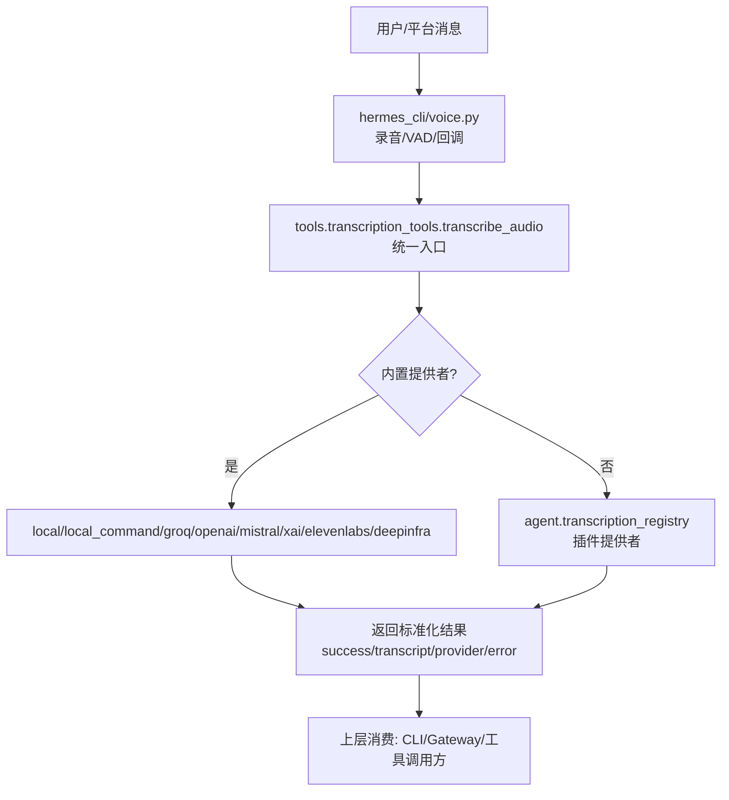
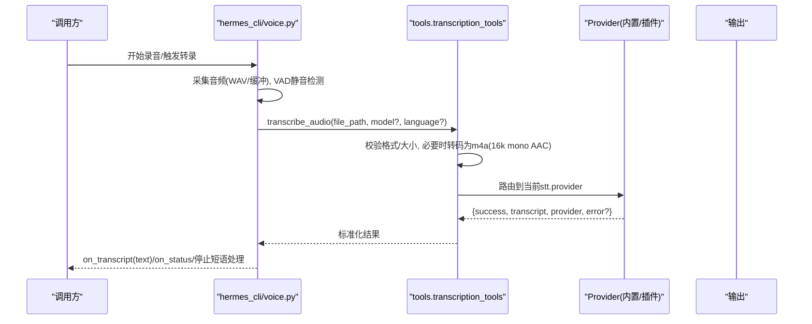
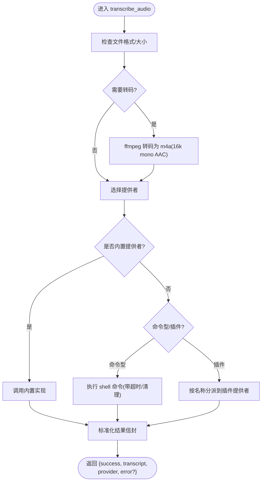
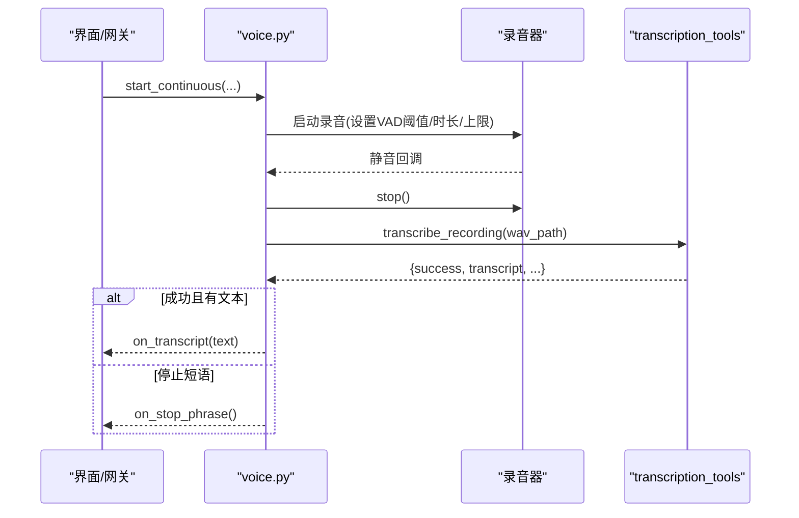
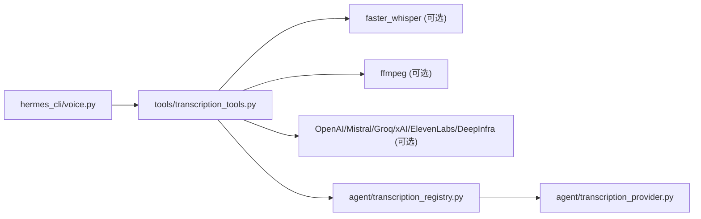

# 语音转文字工具

<cite>
**本文引用的文件**
- [tools/transcription_tools.py](file://tools/transcription_tools.py)
- [agent/transcription_provider.py](file://agent/transcription_provider.py)
- [agent/transcription_registry.py](file://agent/transcription_registry.py)
- [hermes_cli/voice.py](file://hermes_cli/voice.py)
- [cli.py](file://cli.py)
</cite>

## 目录
1. [简介](#简介)
2. [项目结构](#项目结构)
3. [核心组件](#核心组件)
4. [架构总览](#架构总览)
5. [详细组件分析](#详细组件分析)
6. [依赖关系分析](#依赖关系分析)
7. [性能与质量](#性能与质量)
8. [故障排查指南](#故障排查指南)
9. [结论](#结论)
10. [附录：使用示例与最佳实践](#附录使用示例与最佳实践)

## 简介
本文件面向 Hermes Agent 的“语音转文字”能力，系统性说明音频分析与转录的实现、支持的音频格式与编码、实时与批量转录流程、多语言支持、说话人分离现状、不同转录引擎的特点与选择建议、参数配置与结果后处理、以及质量控制、噪声处理与隐私保护方案。文档同时给出可操作的配置与调用路径，帮助开发者快速集成与调优。

## 项目结构
Hermes 的语音转文字由三层组成：
- 工具层：统一入口 transcribe_audio，内置多种 STT 后端（本地 faster-whisper、命令行封装、Groq、OpenAI、Mistral、xAI、ElevenLabs、DeepInfra），负责音频预处理、格式转换、超时控制、错误归一化。
- 抽象与注册层：TranscriptionProvider 抽象类与 Provider 注册表，用于插件扩展新的 STT 后端，且保证“内置优先”的策略。
- 交互层：CLI/TUI 语音模式（录音、VAD 静音检测、连续录制、停止短语）与 CLI 命令，驱动端到端的“录音→转录→回调”。

图表来源
- [hermes_cli/voice.py:361-415](file://hermes_cli/voice.py#L361-L415)
- [tools/transcription_tools.py:1-800](file://tools/transcription_tools.py#L1-L800)
- [agent/transcription_registry.py:56-118](file://agent/transcription_registry.py#L56-L118)

章节来源
- [tools/transcription_tools.py:1-800](file://tools/transcription_tools.py#L1-L800)
- [agent/transcription_provider.py:61-194](file://agent/transcription_provider.py#L61-L194)
- [agent/transcription_registry.py:1-125](file://agent/transcription_registry.py#L1-L125)
- [hermes_cli/voice.py:361-415](file://hermes_cli/voice.py#L361-L415)

## 核心组件
- 统一转录入口与内置提供者
  - 提供统一的 transcribe_audio 接口，内置 local、local_command、groq、openai、mistral、xai、elevenlabs、deepinfra 等提供者；自动音频转码为 m4a（16kHz 单声道 AAC）以提升兼容性；支持最大文件大小限制与超时控制。
- 插件提供者抽象与注册表
  - TranscriptionProvider 定义 name、transcribe、list_models、get_setup_schema 等扩展点；注册表拒绝与内置名称冲突的插件名，确保“内置优先”。
- 语音交互与实时识别
  - hermes_cli/voice.py 提供 push-to-talk 与 continuous(VAD) 两种模式，结合静音检测、停止短语、蜂鸣提示与后台清理，实现“录音→转录→回调”的闭环。

章节来源
- [tools/transcription_tools.py:1-800](file://tools/transcription_tools.py#L1-L800)
- [agent/transcription_provider.py:61-194](file://agent/transcription_provider.py#L61-L194)
- [agent/transcription_registry.py:56-118](file://agent/transcription_registry.py#L56-L118)
- [hermes_cli/voice.py:361-415](file://hermes_cli/voice.py#L361-L415)

## 架构总览
下图展示从输入到输出的完整链路，包括音频预处理、提供者路由、结果标准化与上层回调。

图表来源
- [hermes_cli/voice.py:361-415](file://hermes_cli/voice.py#L361-L415)
- [tools/transcription_tools.py:235-287](file://tools/transcription_tools.py#L235-L287)
- [tools/transcription_tools.py:373-414](file://tools/transcription_tools.py#L373-L414)
- [agent/transcription_registry.py:56-118](file://agent/transcription_registry.py#L56-L118)

## 详细组件分析

### 统一转录工具（tools/transcription_tools.py）
- 支持的音频格式
  - 输入容器/编码：mp3、mp4、mpeg、mpga、m4a、wav、webm、ogg、oga、opus、aac、flac、caf。
  - 本地原生偏好：wav、aiff、aif（避免额外转码）。
- 音频预处理与转码
  - 通过 ffmpeg 将任意输入统一转为 16kHz 单声道 AAC 的 .m4a，提升云端模型兼容性（如 OpenAI gpt-4o-transcribe 系列对 Ogg/Opus 的限制）。
  - 转码失败会记录错误并回退策略由调用方决定。
- 内置提供者与优先级
  - 内置提供者集合：local、local_command、groq、openai、mistral、xai、elevenlabs、deepinfra。
  - 解析顺序：内置 > 命令型提供者（stt.providers.<name>: type: command）> 插件提供者 > 无匹配。
- 语言与环境变量
  - 语言解析优先级：stt.<provider>.language → stt.language → HERMES_LOCAL_STT_LANGUAGE → None（让提供者自动检测）。
  - 密钥解析：通过共享 voice-key 解析器（config > env/.env > 凭证池）。
- 超时与进程管理（命令型提供者）
  - 默认超时 300s，支持按输出活动重置空闲超时；子进程树终止（Windows taskkill / Unix psutil）。
- 错误与结果规范
  - 所有提供者返回统一信封：{success, transcript, provider, error?}，不抛出异常给上层。

图表来源
- [tools/transcription_tools.py:126-128](file://tools/transcription_tools.py#L126-L128)
- [tools/transcription_tools.py:235-287](file://tools/transcription_tools.py#L235-L287)
- [tools/transcription_tools.py:373-414](file://tools/transcription_tools.py#L373-L414)
- [tools/transcription_tools.py:695-800](file://tools/transcription_tools.py#L695-L800)

章节来源
- [tools/transcription_tools.py:1-800](file://tools/transcription_tools.py#L1-L800)

### 插件提供者抽象（agent/transcription_provider.py）
- 扩展点
  - name/display_name：唯一标识与显示名。
  - is_available：可用性探测（例如 API Key 存在性、SDK 可导入）。
  - list_models/default_model：模型目录与默认模型。
  - get_setup_schema：为 UI 提供环境变量提示与元信息。
  - transcribe(file_path, model?, language?, **extra)：核心转录方法，必须返回标准信封。
- 约束
  - 不抛异常，错误以 envelope.error 形式返回，便于统一处理。

章节来源
- [agent/transcription_provider.py:61-194](file://agent/transcription_provider.py#L61-L194)

### 提供者注册表（agent/transcription_registry.py）
- 内置名称白名单保护：local、local_command、groq、openai、mistral、xai、elevenlabs、deepinfra 被保留，插件同名注册将被拒绝并告警。
- 线程安全注册与查询：提供 register_provider、list_providers、get_provider。
- 测试隔离：_reset_for_tests 清空注册表。

章节来源
- [agent/transcription_registry.py:1-125](file://agent/transcription_registry.py#L1-L125)

### 语音交互与实时识别（hermes_cli/voice.py）
- 两种模式
  - Push-to-talk：start_recording/stop_and_transcribe，单次捕获即转录。
  - Continuous(VAD)：start_continuous/stop_continuous，基于静音检测自动分段转录，支持停止短语与自动重启。
- 关键特性
  - 静音阈值/时长可调；最大录音时长限制；蜂鸣提示；TTS 播放时避免自激回路。
  - 转录结果过滤：剔除空文本与疑似幻觉；停止短语触发结束会话。
- 与转录工具的集成
  - 调用 transcribe_recording（内部委托至 tools.transcription_tools）获取标准化结果。

图表来源
- [hermes_cli/voice.py:421-519](file://hermes_cli/voice.py#L421-L519)
- [hermes_cli/voice.py:682-800](file://hermes_cli/voice.py#L682-L800)
- [hermes_cli/voice.py:361-415](file://hermes_cli/voice.py#L361-L415)

章节来源
- [hermes_cli/voice.py:361-415](file://hermes_cli/voice.py#L361-L415)
- [hermes_cli/voice.py:421-519](file://hermes_cli/voice.py#L421-L519)
- [hermes_cli/voice.py:682-800](file://hermes_cli/voice.py#L682-L800)

## 依赖关系分析
- 模块耦合
  - tools.transcription_tools 依赖 ffmpeg（可选）、faster_whisper（可选）、各云 SDK（按需导入）。
  - hermes_cli/voice.py 依赖 tools.voice_mode（录音/VAD）与 transcription_tools（转录）。
  - agent.* 提供抽象与注册，解耦具体实现。
- 外部依赖
  - ffmpeg：用于统一转码，缺失时会返回明确错误。
  - faster-whisper：本地离线 STT，首次使用可能下载模型。
  - 云平台 SDK：OpenAI、Mistral、Groq、xAI、ElevenLabs、DeepInfra（按需）。

图表来源
- [tools/transcription_tools.py:90-128](file://tools/transcription_tools.py#L90-L128)
- [agent/transcription_registry.py:56-118](file://agent/transcription_registry.py#L56-L118)
- [agent/transcription_provider.py:61-194](file://agent/transcription_provider.py#L61-L194)

章节来源
- [tools/transcription_tools.py:90-128](file://tools/transcription_tools.py#L90-L128)
- [agent/transcription_registry.py:56-118](file://agent/transcription_registry.py#L56-L118)

## 性能与质量
- 性能要点
  - 本地 faster-whisper 模型缓存与空闲卸载，降低长驻进程内存占用。
  - 统一转码为 m4a(16k mono AAC)，减少上传体积并提高云端兼容性。
  - 命令型提供者具备进程树管理与空闲超时，防止僵尸进程。
- 质量建议
  - 选择合适的提供者：高准确率场景优先 xAI/OpenAI/Mistral；低成本/离线首选 local。
  - 语言提示：显式传入 language 可提升识别精度（尤其非英语场景）。
  - 音频质量：尽量使用清晰语音，避免强背景噪声；必要时在应用层做降噪或增益调整。
- 指标参考
  - 文件大小限制：25MB（默认）。
  - 超时：命令型提供者默认 300s，可按需配置。
  - 采样率/编码：统一 16kHz 单声道 AAC（转码后）。

[本节为通用指导，不直接分析具体文件]

## 故障排查指南
- 无法转码
  - 现象：提示缺少 ffmpeg 或转码失败。
  - 处理：安装 ffmpeg 或改用本地原生格式（wav/aiff/aif）。
- 本地提供者不可用
  - 现象：faster_whisper 未安装或导入失败。
  - 处理：启用懒安装或手动安装依赖；检查权限与 venv 所有者。
- 云端提供者鉴权失败
  - 现象：API Key 缺失或无效。
  - 处理：通过 config/env/.env/凭证池配置密钥；确认 base_url 与模型名正确。
- 命令型提供者卡死
  - 现象：长时间无输出。
  - 处理：检查超时配置；查看 stderr；必要时缩短超时或优化命令。
- 语音模式无响应
  - 现象：continuous 模式不触发转录。
  - 处理：检查麦克风权限、VAD 阈值/时长、是否有 TTS 自激；查看日志中的 peak_rms 与状态回调。

章节来源
- [tools/transcription_tools.py:235-287](file://tools/transcription_tools.py#L235-L287)
- [tools/transcription_tools.py:337-370](file://tools/transcription_tools.py#L337-L370)
- [hermes_cli/voice.py:713-752](file://hermes_cli/voice.py#L713-L752)

## 结论
Hermes 的语音转文字采用“统一入口 + 内置提供者 + 插件扩展”的分层设计，兼顾易用性与可扩展性。通过统一的音频预处理、标准化的结果信封与健壮的超时/清理机制，能够在本地与云端之间灵活切换，满足实时与批量的多样化需求。对于更高阶能力（如说话人分离），可在插件提供者中扩展或通过上游服务集成。

[本节为总结，不直接分析具体文件]

## 附录：使用示例与最佳实践

- 音频预处理
  - 推荐：保持原始高质量录音；若为移动端语音消息（常见 Ogg/Opus），系统会自动转码为 m4a(16k mono AAC)。
  - 本地原生格式优先：wav/aiff/aif 可避免额外转码开销。
- 转录参数配置
  - 选择提供者：在配置中设置 stt.provider（如 openai、groq、local 等）。
  - 语言提示：设置 stt.<provider>.language 或全局 stt.language，或使用 HERMES_LOCAL_STT_LANGUAGE。
  - 模型选择：部分提供者支持 list_models/default_model；可通过配置或环境变量覆盖默认模型。
- 结果后处理与导出
  - 统一信封：读取 success/transcript/provider/error。
  - 命令型输出格式：支持 txt/json/srt/vtt（通过 stt.providers.<name>.format）。
- 实时语音识别
  - 使用 hermes_cli/voice.py 的 continuous 模式，设置合适的 silence_threshold/silence_duration/max_recording_seconds。
  - 监听 on_transcript/on_status/on_silent_limit/on_stop_phrase 完成交互闭环。
- 批量文件转录
  - 遍历文件列表，逐个调用 transcribe_audio；注意并发与磁盘 I/O；利用命令型输出格式批量导出 srt/vtt。
- 多语言支持
  - 显式传入 language 可提升准确率；不同提供者支持的语言范围由其模型决定。
- 说话人分离
  - 当前内置提供者未直接暴露说话人分离功能；如需该能力，可通过插件提供者对接支持 diarization 的上游服务（例如 xAI 标注了具备相关能力）。
- 质量控制与噪声处理
  - 在应用层进行降噪/增益/静音段裁剪；确保采样率与通道数合理；避免过短片段导致识别不稳定。
- 隐私保护
  - 命令型提供者默认清洗子进程环境变量，仅允许白名单透传；避免泄露敏感信息。
  - 本地提供者不上传数据；云端提供者请遵循各自隐私政策，必要时选择本地或私有部署。

章节来源
- [tools/transcription_tools.py:126-128](file://tools/transcription_tools.py#L126-L128)
- [tools/transcription_tools.py:181-210](file://tools/transcription_tools.py#L181-L210)
- [tools/transcription_tools.py:515-535](file://tools/transcription_tools.py#L515-L535)
- [tools/transcription_tools.py:695-800](file://tools/transcription_tools.py#L695-L800)
- [hermes_cli/voice.py:421-519](file://hermes_cli/voice.py#L421-L519)
- [cli.py:12466-12467](file://cli.py#L12466-L12467)
- [cli.py:12758-12759](file://cli.py#L12758-L12759)