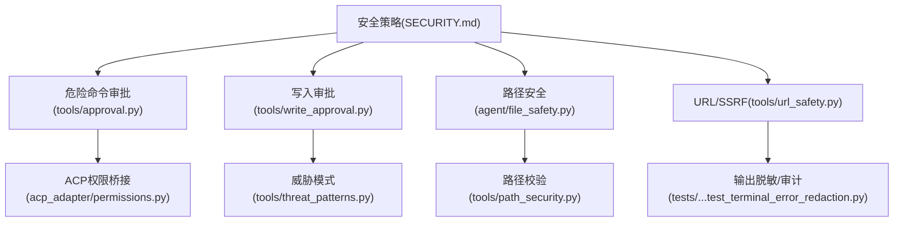
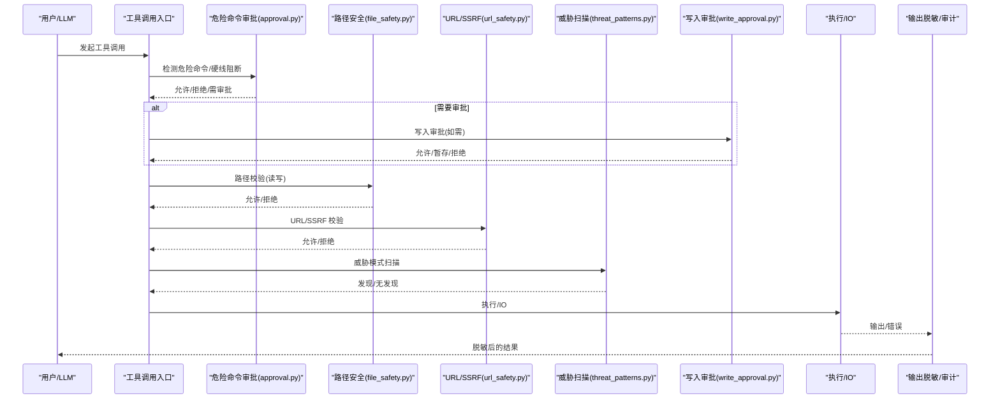
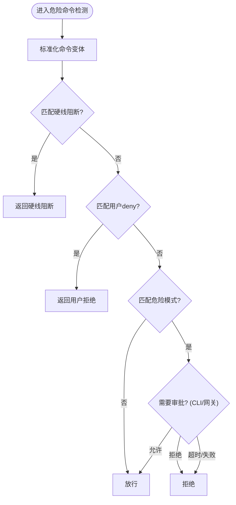
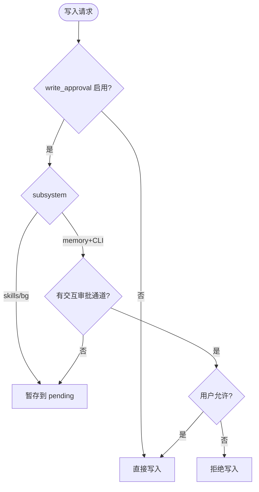
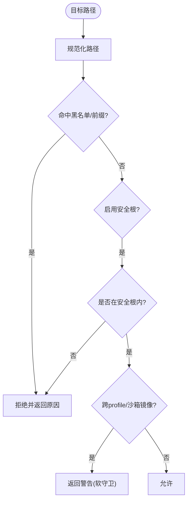
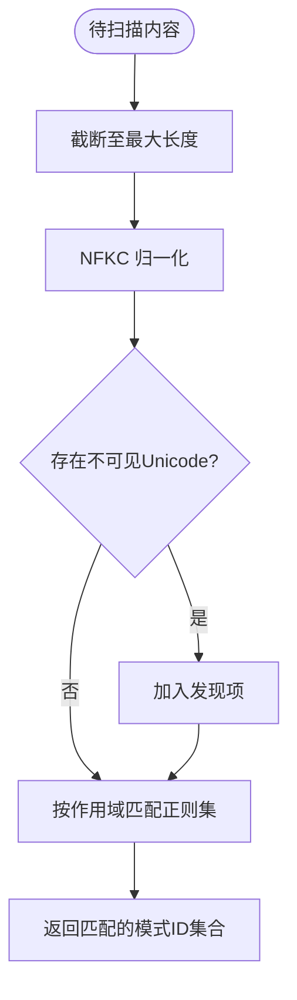
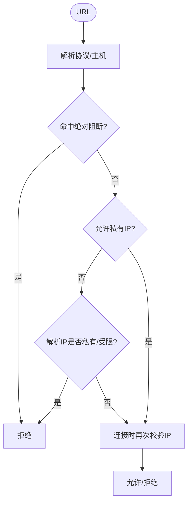
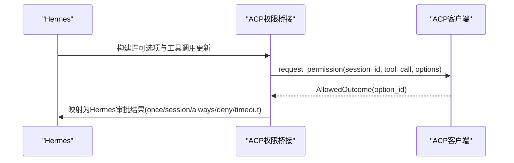
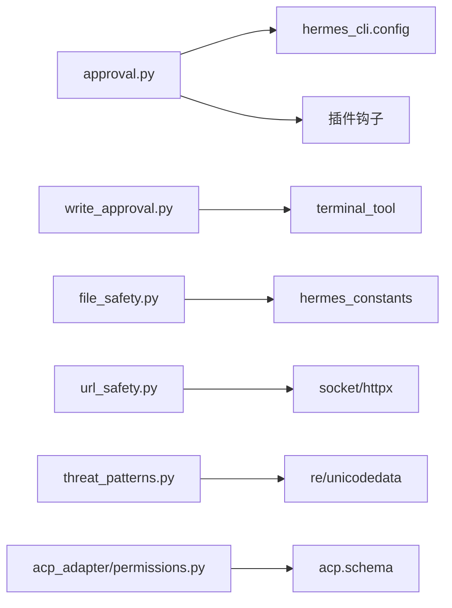

# 安全与权限

<cite>
**本文引用的文件**
- [SECURITY.md](file://SECURITY.md)
- [acp_adapter/permissions.py](file://acp_adapter/permissions.py)
- [tools/path_security.py](file://tools/path_security.py)
- [tools/threat_patterns.py](file://tools/threat_patterns.py)
- [tools/write_approval.py](file://tools/write_approval.py)
- [tools/approval.py](file://tools/approval.py)
- [agent/file_safety.py](file://agent/file_safety.py)
- [tools/url_safety.py](file://tools/url_safety.py)
- [tests/tools/test_terminal_error_redaction.py](file://tests/tools/test_terminal_error_redaction.py)
</cite>

## 目录
1. [简介](#简介)
2. [项目结构](#项目结构)
3. [核心组件](#核心组件)
4. [架构总览](#架构总览)
5. [详细组件分析](#详细组件分析)
6. [依赖关系分析](#依赖关系分析)
7. [性能与安全权衡](#性能与安全权衡)
8. [故障排查指南](#故障排查指南)
9. [结论](#结论)
10. [附录：配置示例与最佳实践](#附录配置示例与最佳实践)

## 简介
本文件系统性说明 Hermes Agent 的安全与权限体系，覆盖工具执行安全、路径安全验证、操作审批流程、威胁模式检测、权限模型、沙箱隔离、资源限制、输入验证与输出过滤，以及安全策略配置、审计日志、风险评估与合规性检查。文档同时提供常见威胁防护方法与应急响应流程，帮助运维与开发者在“进程内启发式”与“操作系统级隔离”之间做出正确部署决策。

## 项目结构
Hermes Agent 的安全能力由多个模块协同实现：
- 信任边界与部署加固策略：定义于安全策略文档中，明确 OS 级隔离是唯一承载的边界，并给出终端后端隔离与全进程包裹两种姿态。
- 危险命令审批与白名单：集中管理危险命令检测、用户自定义拒绝规则、硬线阻断（不可绕过）与审批上下文。
- 写入审批与暂存：对 memory/skills 等持久化写入进行审批门控，支持前台交互与后台暂存。
- 路径安全与写保护：统一的路径校验、敏感写目标黑名单、安全根目录白名单、跨 profile/沙箱镜像写保护提示。
- 威胁模式扫描：统一的注入、C2、外泄、持久化、隐藏字符等正则库，按作用域分级应用。
- URL/SSRF 防护：域名/IP 解析校验、云元数据地址绝对阻断、连接时二次校验与代理环境兼容。
- ACP 权限桥接：将 ACP 客户端的许可选项映射为 Hermes 审批语义，支持一次性/会话/永久允许或拒绝。
- 输出过滤与审计：错误与输出脱敏、审批钩子观测点、审计记录。

图表来源
- [SECURITY.md:58-119](file://SECURITY.md#L58-L119)
- [tools/approval.py:350-471](file://tools/approval.py#L350-L471)
- [tools/write_approval.py:230-312](file://tools/write_approval.py#L230-L312)
- [agent/file_safety.py:28-177](file://agent/file_safety.py#L28-L177)
- [tools/url_safety.py:311-519](file://tools/url_safety.py#L311-L519)
- [acp_adapter/permissions.py:110-182](file://acp_adapter/permissions.py#L110-L182)
- [tools/threat_patterns.py:207-255](file://tools/threat_patterns.py#L207-L255)
- [tools/path_security.py:15-43](file://tools/path_security.py#L15-L43)
- [tests/tools/test_terminal_error_redaction.py:47-153](file://tests/tools/test_terminal_error_redaction.py#L47-L153)

章节来源
- [SECURITY.md:32-119](file://SECURITY.md#L32-L119)

## 核心组件
- 危险命令审批系统：包含硬线阻断、危险模式匹配、用户 deny 列表、交互式/网关异步审批、智能辅助审批与审计钩子。
- 写入审批与暂存：memory/skills 写入前评估是否放行、阻塞或暂存；支持前台交互与后台暂存，并提供 diff/gist 审阅。
- 路径安全与写保护：统一路径校验、敏感写目标黑名单、安全根目录白名单、跨 profile/沙箱镜像写保护提示。
- 威胁模式扫描：按 all/context/strict 作用域组织正则，检测注入、C2、外泄、持久化、隐藏字符等。
- URL/SSRF 防护：域名/IP 解析校验、云元数据地址绝对阻断、连接时二次校验、代理环境兼容。
- ACP 权限桥接：将 ACP 许可选项映射为 Hermes 审批结果，支持超时与未知选项默认拒绝。
- 输出过滤与审计：错误与输出脱敏、审批前后钩子观测、审计记录。

章节来源
- [tools/approval.py:350-800](file://tools/approval.py#L350-L800)
- [tools/write_approval.py:74-312](file://tools/write_approval.py#L74-L312)
- [agent/file_safety.py:28-177](file://agent/file_safety.py#L28-L177)
- [tools/threat_patterns.py:43-255](file://tools/threat_patterns.py#L43-L255)
- [tools/url_safety.py:163-519](file://tools/url_safety.py#L163-L519)
- [acp_adapter/permissions.py:18-182](file://acp_adapter/permissions.py#L18-L182)
- [tests/tools/test_terminal_error_redaction.py:47-153](file://tests/tools/test_terminal_error_redaction.py#L47-L153)

## 架构总览
下图展示从“工具调用入口”到“安全控制点”的关键路径：命令进入后先经过危险命令检测与硬线阻断，再根据上下文选择审批流（CLI 交互或网关异步），随后通过路径/URL/威胁模式等多层校验，最终执行并在输出阶段进行脱敏与审计。

图表来源
- [tools/approval.py:350-800](file://tools/approval.py#L350-L800)
- [agent/file_safety.py:28-177](file://agent/file_safety.py#L28-L177)
- [tools/url_safety.py:311-519](file://tools/url_safety.py#L311-L519)
- [tools/threat_patterns.py:207-255](file://tools/threat_patterns.py#L207-L255)
- [tools/write_approval.py:230-312](file://tools/write_approval.py#L230-L312)

## 详细组件分析

### 危险命令审批与权限模型
- 硬线阻断：针对破坏性极强的命令（如递归删除系统目录、格式化磁盘、向块设备写入、重启/关机、fork bomb、sudo -S 密码猜测等）无条件阻止，即使 YOLO 模式也不放行。
- 危险模式匹配：覆盖 rm/chmod/chown/mkfs/dd/SQL DROP/TRUNCATE、远程脚本执行管道、tee/重定向写入敏感路径、find -exec/-delete、gateway/Docker 生命周期命令等。
- 用户 deny 列表：config.yaml 中 approvals.deny 可定义 fnmatch 规则，优先级高于 yolo 与 mode=off。
- 审批上下文：支持 CLI 交互审批与网关异步审批；使用 contextvar 绑定 session/turn/tool_call 关联 ID，便于审计追踪。
- 智能审批：可通过辅助 LLM 自动批准低风险命令，并通过 pre/post 钩子记录审计事件。

图表来源
- [tools/approval.py:350-800](file://tools/approval.py#L350-L800)

章节来源
- [tools/approval.py:350-800](file://tools/approval.py#L350-L800)

### 写入审批与暂存机制
- 子系统：memory 与 skills 两类持久化写入。
- 决策矩阵：关闭审批则直接放行；开启审批时，skills 一律暂存，memory 在前台 CLI 可交互审批，否则暂存。
- 暂存存储：以 JSON 文件形式保存在 HERMES_HOME/pending/{memory,skills}/，支持 /memory pending 与 /skills pending 审阅。
- 审阅体验：skills 提供 gist 与 unified diff；memory 显示摘要与详情。
- 背景写入：后台 review 分支无法交互，强制暂存。

图表来源
- [tools/write_approval.py:230-312](file://tools/write_approval.py#L230-L312)

章节来源
- [tools/write_approval.py:74-312](file://tools/write_approval.py#L74-L312)

### 路径安全验证与写保护
- 路径校验：统一 resolve + relative_to 校验，防止路径穿越；快速检测 .. 组件。
- 写保护黑名单：禁止写入 SSH 私钥/公钥、认证缓存、.env、mcp-tokens、配对信息、系统关键文件等；支持安全根目录白名单（HERMES_WRITE_SAFE_ROOT）。
- 读保护：禁止读取内部缓存、凭证文件、mcp-tokens、项目 .env 等，作为纵深防御（非安全边界）。
- 跨 profile/沙箱镜像写保护：识别写入目标属于其他 profile 或容器/沙箱镜像路径，返回警告提示，避免误写。

图表来源
- [agent/file_safety.py:28-177](file://agent/file_safety.py#L28-L177)
- [tools/path_security.py:15-43](file://tools/path_security.py#L15-L43)

章节来源
- [agent/file_safety.py:28-177](file://agent/file_safety.py#L28-L177)
- [tools/path_security.py:15-43](file://tools/path_security.py#L15-L43)

### 威胁模式检测
- 作用域分级：all（经典注入/外泄）、context（注入/C2/角色劫持）、strict（持久化/SSH后门/配置篡改/硬编码密钥）。
- 扫描优化：最大扫描长度限制、NFKC 归一化防混淆、不可见 Unicode 字符检测、预编译正则集。
- 用途：上下文装配、记忆写入、技能安装等路径进行告警或阻断（严格场景）。

图表来源
- [tools/threat_patterns.py:207-255](file://tools/threat_patterns.py#L207-L255)

章节来源
- [tools/threat_patterns.py:43-255](file://tools/threat_patterns.py#L43-L255)

### URL/SSRF 防护
- 绝对阻断：云元数据主机名与 IP（如 metadata.google.internal、169.254.169.254）始终拒绝。
- 私有网络拦截：默认阻止私有/环回/链路本地/组播/未指定/CGNAT 地址；可通过 security.allow_private_urls 或环境变量全局放开（仍不放过云元数据）。
- 连接时校验：HTTP 传输层在 TCP 连接前再次解析并校验 IP，缩小 DNS 重绑定窗口。
- 代理兼容：当检测到代理配置且 DNS 解析失败时，允许交由代理侧解析；直连 IP 仍走 fail-closed。

图表来源
- [tools/url_safety.py:311-519](file://tools/url_safety.py#L311-L519)

章节来源
- [tools/url_safety.py:163-519](file://tools/url_safety.py#L163-L519)

### ACP 权限桥接
- 选项映射：将 ACP 的 allow_once/allow_session/allow_always/deny/deny_always 映射为 Hermes 的 once/session/always/deny。
- 工具调用更新：为每次许可请求生成唯一的 tool_call_id，附带命令与描述，状态 pending。
- 超时与异常：超时或异常均视为拒绝；未知 option_id 记录告警并拒绝。

图表来源
- [acp_adapter/permissions.py:18-182](file://acp_adapter/permissions.py#L18-L182)

章节来源
- [acp_adapter/permissions.py:18-182](file://acp_adapter/permissions.py#L18-L182)

### 输出过滤与审计
- 输出脱敏：终端工具的错误与输出会进行脱敏，避免泄露密钥形状字符串；测试覆盖了异常路径与成功路径。
- 审计钩子：审批系统在 pre/post 阶段触发插件钩子，记录命令、描述、模式键、会话标识、决策来源等。

章节来源
- [tests/tools/test_terminal_error_redaction.py:47-153](file://tests/tools/test_terminal_error_redaction.py#L47-L153)
- [tools/approval.py:97-168](file://tools/approval.py#L97-L168)

## 依赖关系分析
- 危险命令审批依赖：配置加载、上下文变量、中断检测、正则匹配、插件钩子。
- 写入审批依赖：hermes_home、skill_provenance、terminal_tool 的审批回调。
- 路径安全依赖：hermes_constants（HERMES_HOME/root）、os 路径解析。
- URL/SSRF 依赖：socket/httpx、ipaddress、配置读取、代理环境变量。
- 威胁模式：re、unicodedata，按作用域预编译。
- ACP 权限桥接：acp.schema、asyncio、线程安全调度。

图表来源
- [tools/approval.py:97-168](file://tools/approval.py#L97-L168)
- [tools/write_approval.py:207-223](file://tools/write_approval.py#L207-L223)
- [agent/file_safety.py:10-25](file://agent/file_safety.py#L10-L25)
- [tools/url_safety.py:28-39](file://tools/url_safety.py#L28-L39)
- [tools/threat_patterns.py:43-63](file://tools/threat_patterns.py#L43-L63)
- [acp_adapter/permissions.py:11-15](file://acp_adapter/permissions.py#L11-L15)

章节来源
- [tools/approval.py:97-168](file://tools/approval.py#L97-L168)
- [tools/write_approval.py:207-223](file://tools/write_approval.py#L207-L223)
- [agent/file_safety.py:10-25](file://agent/file_safety.py#L10-L25)
- [tools/url_safety.py:28-39](file://tools/url_safety.py#L28-L39)
- [tools/threat_patterns.py:43-63](file://tools/threat_patterns.py#L43-L63)
- [acp_adapter/permissions.py:11-15](file://acp_adapter/permissions.py#L11-L15)

## 性能与安全权衡
- 正则扫描上限：威胁模式扫描限制最大扫描字符数，避免长文本导致的回溯爆炸与性能抖动。
- 预编译正则：危险命令与硬线阻断的正则在模块导入时预编译，减少首次调用冷启动开销。
- 连接时校验：URL/SSRF 在 TCP 连接前再次解析 IP，增加一次解析成本但显著降低 DNS 重绑定风险。
- 审批上下文：使用 contextvar 避免并发下的环境变量竞争，提升多会话安全性与稳定性。

[本节为通用指导，无需特定文件引用]

## 故障排查指南
- 终端错误泄露密钥：若终端工具报错或异常中包含密钥形状字符串，应确认输出脱敏已生效；参考测试用例验证错误与 traceback 字段是否被掩码。
- 审批超时：ACP 权限请求超时将被视为拒绝；检查 ACP 客户端响应与超时配置。
- 写入被暂存：若 memory/skills 写入未生效，检查 write_approval 配置与 pending 目录，使用 /memory pending 或 /skills pending 审阅。
- URL 被阻断：检查是否命中绝对阻断（云元数据）或私有网络拦截；必要时调整 security.allow_private_urls 或代理配置。
- 路径被拒绝：确认目标路径不在黑名单或安全根之外；若为跨 profile/沙箱镜像写，需显式授权。

章节来源
- [tests/tools/test_terminal_error_redaction.py:47-153](file://tests/tools/test_terminal_error_redaction.py#L47-L153)
- [acp_adapter/permissions.py:159-182](file://acp_adapter/permissions.py#L159-L182)
- [tools/write_approval.py:230-312](file://tools/write_approval.py#L230-L312)
- [tools/url_safety.py:311-519](file://tools/url_safety.py#L311-L519)
- [agent/file_safety.py:28-177](file://agent/file_safety.py#L28-L177)

## 结论
Hermes Agent 的安全体系以“OS 级隔离为唯一承载边界”，辅以多层进程内启发式防护：危险命令审批、写入审批与暂存、路径安全与写保护、威胁模式扫描、URL/SSRF 防护、ACP 权限桥接与输出脱敏。通过合理配置与部署（终端后端隔离或全进程包裹），可在保障可用性的同时有效抵御恶意 LLM 输出带来的风险。建议在生产环境中优先采用全进程包裹，并对所有网络暴露面实施严格的访问控制与审计。

[本节为总结性内容，无需特定文件引用]

## 附录：配置示例与最佳实践
- 隔离姿态选择
  - 终端后端隔离：适用于仅担心 shell/文件操作的场景；注意代码执行、MCP、插件等仍在进程内执行。
  - 全进程包裹：推荐用于生产或多租户场景；结合 OpenShell 或 Docker/Compose 限制文件系统、网络、进程与推理路由。
- 审批与拒绝
  - 启用 write_approval 对 memory/skills 写入进行审批；skills 一律暂存，memory 前台交互审批。
  - 配置 approvals.deny 添加用户级拒绝规则，优先级高于 yolo 与 mode=off。
- URL/SSRF
  - 默认阻止私有/受限网络；仅在确有必要时启用 security.allow_private_urls 或设置 HERMES_ALLOW_PRIVATE_URLS=true。
  - 云元数据地址永远阻断；确保 HTTP 传输使用 SSRF 安全传输。
- 路径安全
  - 使用 HERMES_WRITE_SAFE_ROOT 限定可写目录；避免写入敏感路径与系统关键文件。
  - 关注跨 profile/沙箱镜像写保护提示，避免误写。
- 审计与合规
  - 利用审批前后钩子记录审计事件；结合日志与监控进行合规检查。
  - 定期审查第三方技能与插件，遵循“安装前审阅”原则。
- 应急响应
  - 发现异常审批或写入：立即暂停相关会话，审查 pending 记录与审计日志；必要时切换审批模式为更严格。
  - 发现 SSRF 或路径逃逸：临时禁用相关网络出口或写权限，定位并修复配置或代码路径。

章节来源
- [SECURITY.md:58-119](file://SECURITY.md#L58-L119)
- [tools/write_approval.py:74-312](file://tools/write_approval.py#L74-L312)
- [tools/approval.py:542-586](file://tools/approval.py#L542-L586)
- [tools/url_safety.py:220-279](file://tools/url_safety.py#L220-L279)
- [agent/file_safety.py:83-177](file://agent/file_safety.py#L83-L177)