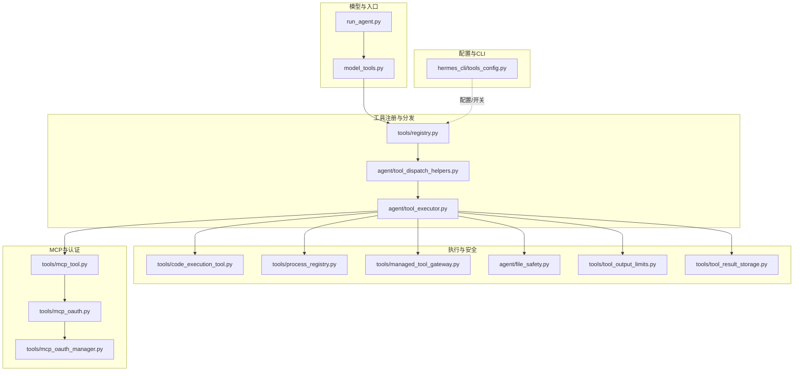
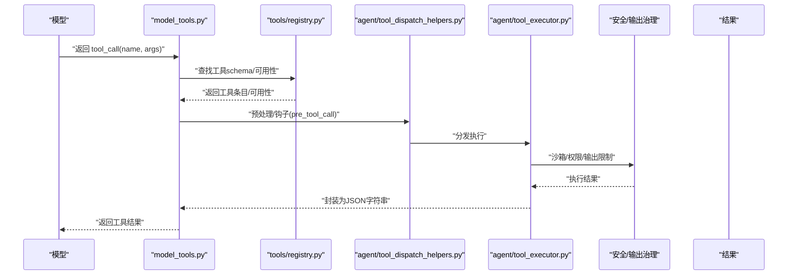
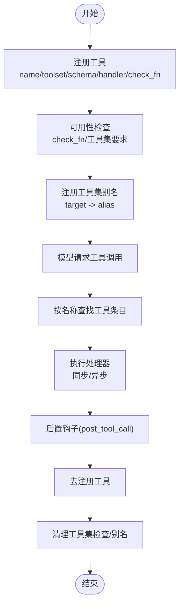
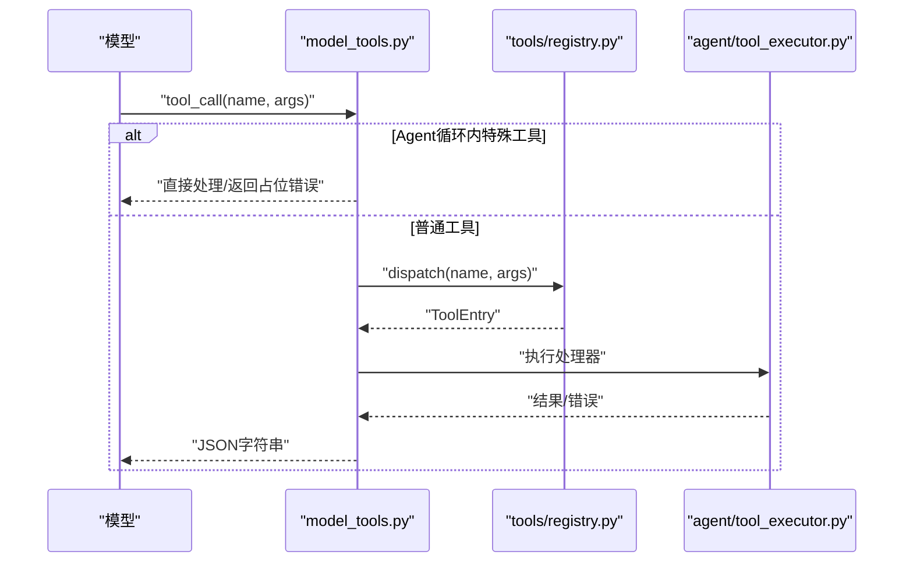
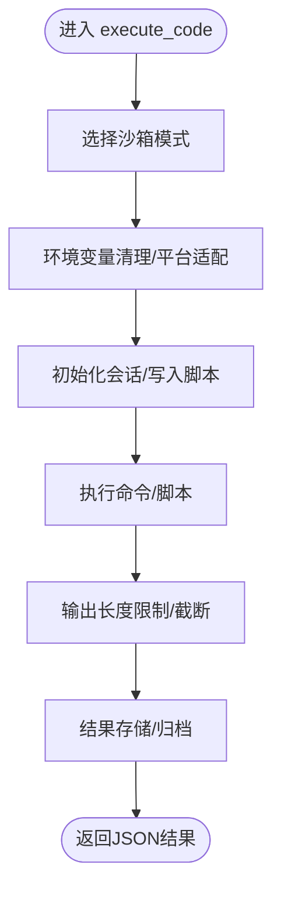
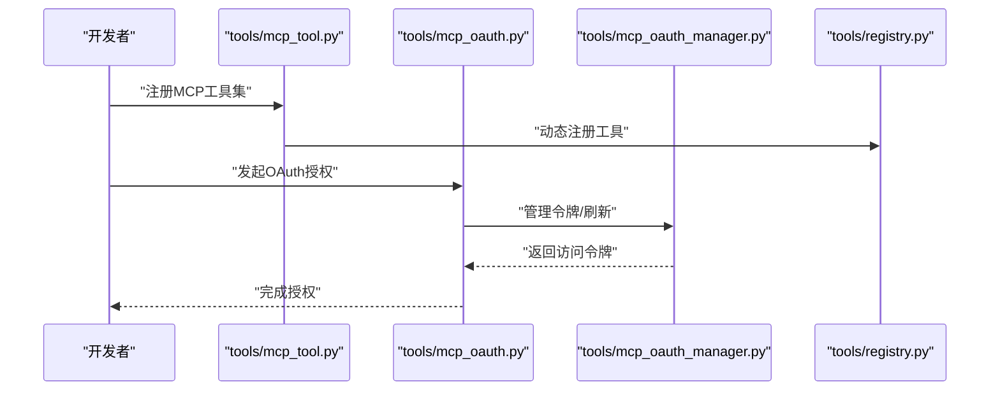
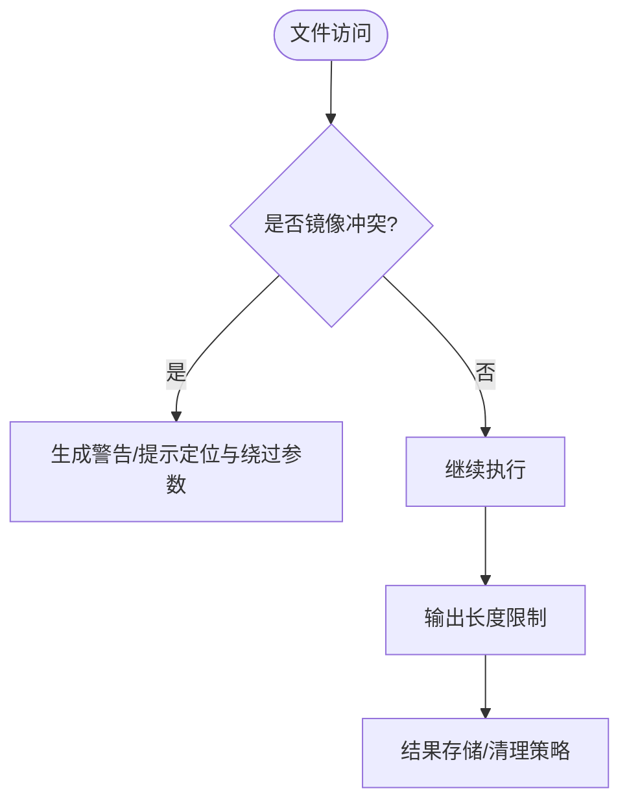
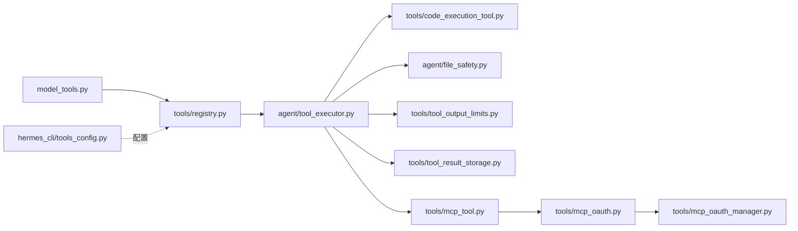

# 工具开发

<cite>
**本文引用的文件**
- [registry.py](file://tools/registry.py)
- [model_tools.py](file://model_tools.py)
- [tool_executor.py](file://agent/tool_executor.py)
- [tool_dispatch_helpers.py](file://agent/tool_dispatch_helpers.py)
- [code_execution_tool.py](file://tools/code_execution_tool.py)
- [process_registry.py](file://tools/process_registry.py)
- [managed_tool_gateway.py](file://tools/managed_tool_gateway.py)
- [mcp_tool.py](file://tools/mcp_tool.py)
- [mcp_oauth.py](file://tools/mcp_oauth.py)
- [mcp_oauth_manager.py](file://tools/mcp_oauth_manager.py)
- [file_safety.py](file://agent/file_safety.py)
- [tool_output_limits.py](file://tools/tool_output_limits.py)
- [tool_result_storage.py](file://tools/tool_result_storage.py)
- [tool_guardrails.py](file://agent/tool_guardrails.py)
- [tools_config.py](file://hermes_cli/tools_config.py)
- [tools_config.py](file://hermes_cli/tools_config.py)
- [tools_config.py](file://hermes_cli/tools_config.py)
- [tools_config.py](file://hermes_cli/tools_config.py)
- [tools_config.py](file://hermes_cli/tools_config.py)
- [tools_config.py](file://hermes_cli/tools_config.py)
- [tools_config.py](file://hermes_cli/tools_config.py)
- [tools_config.py](file://hermes_cli/tools_config.py)
- [tools_config.py](file://hermes_cli/tools_config.py)
- [tools_config.py](file://hermes_cli/tools_config.py)
- [tools_config.py](file://hermes_cli/tools_config.py)
- [tools_config.py](file://hermes_cli/tools_config.py)
- [tools_config.py](file://hermes_cli/tools_config.py)
- [tools_config.py](file://hermes_cli/tools_config.py)
- [tools_config.py](file://hermes_cli/tools_config.py)
- [tools_config.py](file://hermes_cli/tools_config.py)
- [tools_config.py](file://hermes_cli/tools_config.py)
- [tools_config.py](file://hermes_cli/tools_config.py)
- [tools_config.py](file://hermes_cli/tools_config.py)
- [tools_config.py](file://hermes_cli/tools_config.py)
- [tools_config.py](file://hermes_cli/tools_config.py)
- [tools_config.py](file://hermes_cli/tools_config.py)
- [tools_config.py](file://hermes_cli/tools_config.py)
- [tools_config.py](file://hermes_cli/tools_config.py)
- [tools_config.py](file://hermes_cli/tools_config.py)
- [tools_config.py](file://hermes_cli/tools_config.py)
- [tools_config.py](file://hermes_cli/tools_config.py)
- [tools_config.py](file://hermes_cli/tools_config.py)
- [tools_config.py](file://hermes_cli/tools_config.py)
- [tools_config.py](file://hermes_cli/tools_config.py)
- [tools_config.py](file://hermes_cli/tools_config.py)
- [tools_config.py](file://hermes_cli/tools_config.py)
- [tools_config.py](file://hermes_cli/tools_config.py)
- [tools_config.py](file://hermes_cli/tools_config.py)
- [tools_config.py](file://her......)
</cite>

## 目录
1. [简介](#简介)
2. [项目结构](#项目结构)
3. [核心组件](#核心组件)
4. [架构总览](#架构总览)
5. [详细组件分析](#详细组件分析)
6. [依赖关系分析](#依赖关系分析)
7. [性能考量](#性能考量)
8. [故障排查指南](#故障排查指南)
9. [结论](#结论)
10. [附录](#附录)

## 简介
本指南面向Hermes Agent的工具开发者，提供从设计到部署的完整开发流程。内容覆盖自定义工具的创建、注册、元数据定义、接口规范、测试与调试、性能评估、安全与权限控制、沙箱隔离、打包发布与版本管理、向后兼容策略等。文档同时给出可复用的模板与最佳实践，帮助你在保证安全与稳定性的前提下快速构建高质量工具。

## 项目结构
Hermes Agent的工具体系围绕“注册表-分发-执行-结果处理”展开，核心路径包括：
- 工具注册与发现：tools/registry.py
- 模型层工具调用桥接：model_tools.py
- Agent循环内的工具执行：agent/tool_executor.py
- 工具分发辅助逻辑：agent/tool_dispatch_helpers.py
- 代码执行与沙箱：tools/code_execution_tool.py
- 进程与环境管理：tools/process_registry.py、tools/managed_tool_gateway.py
- MCP工具与OAuth：tools/mcp_tool.py、tools/mcp_oauth.py、tools/mcp_oauth_manager.py
- 安全与输出限制：agent/file_safety.py、tools/tool_output_limits.py、tools/tool_result_storage.py
- 工具配置与CLI：hermes_cli/tools_config.py
- 工具守卫与分类：agent/tool_guardrails.py

**图表来源**
- [model_tools.py](file://model_tools.py)
- [tools/registry.py](file://tools/registry.py)
- [agent/tool_dispatch_helpers.py](file://agent/tool_dispatch_helpers.py)
- [agent/tool_executor.py](file://agent/tool_executor.py)
- [tools/code_execution_tool.py](file://tools/code_execution_tool.py)
- [tools/process_registry.py](file://tools/process_registry.py)
- [tools/managed_tool_gateway.py](file://tools/managed_tool_gateway.py)
- [agent/file_safety.py](file://agent/file_safety.py)
- [tools/tool_output_limits.py](file://tools/tool_output_limits.py)
- [tools/tool_result_storage.py](file://tools/tool_result_storage.py)
- [tools/mcp_tool.py](file://tools/mcp_tool.py)
- [tools/mcp_oauth.py](file://tools/mcp_oauth.py)
- [tools/mcp_oauth_manager.py](file://tools/mcp_oauth_manager.py)
- [hermes_cli/tools_config.py](file://hermes_cli/tools_config.py)

**章节来源**
- [model_tools.py](file://model_tools.py)
- [tools/registry.py](file://tools/registry.py)
- [agent/tool_executor.py](file://agent/tool_executor.py)
- [agent/tool_dispatch_helpers.py](file://agent/tool_dispatch_helpers.py)
- [tools/code_execution_tool.py](file://tools/code_execution_tool.py)
- [tools/process_registry.py](file://tools/process_registry.py)
- [tools/managed_tool_gateway.py](file://tools/managed_tool_gateway.py)
- [agent/file_safety.py](file://agent/file_safety.py)
- [tools/tool_output_limits.py](file://tools/tool_output_limits.py)
- [tools/tool_result_storage.py](file://tools/tool_result_storage.py)
- [tools/mcp_tool.py](file://tools/mcp_tool.py)
- [tools/mcp_oauth.py](file://tools/mcp_oauth.py)
- [tools/mcp_oauth_manager.py](file://tools/mcp_oauth_manager.py)
- [hermes_cli/tools_config.py](file://hermes_cli/tools_config.py)

## 核心组件
- 工具注册表：负责工具注册、去注册、可用性检查、别名映射、工具集聚合与校验。
- 模型工具桥接：将模型返回的tool_call转换为实际的工具调用。
- 工具分发与执行：根据名称解析工具条目，支持同步/异步处理器，执行前后钩子。
- 代码执行与沙箱：提供多模式沙箱（严格/项目/宽松），白名单工具、环境变量清理、进程隔离。
- MCP工具与OAuth：支持MCP服务器动态发现、OAuth授权与令牌管理。
- 安全与输出治理：文件访问镜像警告、输出长度限制、结果存储与归档。
- CLI与配置：通过CLI开关与配置文件控制工具启用、日志与行为。

**章节来源**
- [tools/registry.py](file://tools/registry.py)
- [model_tools.py](file://model_tools.py)
- [agent/tool_executor.py](file://agent/tool_executor.py)
- [agent/tool_dispatch_helpers.py](file://agent/tool_dispatch_helpers.py)
- [tools/code_execution_tool.py](file://tools/code_execution_tool.py)
- [tools/mcp_tool.py](file://tools/mcp_tool.py)
- [tools/mcp_oauth.py](file://tools/mcp_oauth.py)
- [tools/mcp_oauth_manager.py](file://tools/mcp_oauth_manager.py)
- [agent/file_safety.py](file://agent/file_safety.py)
- [tools/tool_output_limits.py](file://tools/tool_output_limits.py)
- [tools/tool_result_storage.py](file://tools/tool_result_storage.py)
- [hermes_cli/tools_config.py](file://hermes_cli/tools_config.py)

## 架构总览
工具从模型侧触发，经由模型桥接进入注册表分发，再由执行器选择处理器并执行，期间穿插安全与输出治理，最终返回结果给模型。

**图表来源**
- [model_tools.py](file://model_tools.py)
- [tools/registry.py](file://tools/registry.py)
- [agent/tool_dispatch_helpers.py](file://agent/tool_dispatch_helpers.py)
- [agent/tool_executor.py](file://agent/tool_executor.py)
- [agent/file_safety.py](file://agent/file_safety.py)
- [tools/tool_output_limits.py](file://tools/tool_output_limits.py)

## 详细组件分析

### 工具注册与生命周期
- 注册：提供名称、工具集、schema、处理器、可选检查函数。
- 去注册：移除工具，必要时清理工具集检查与别名。
- 可用性：基于check_fn与工具集要求进行判定。
- 别名：支持工具集别名映射，便于动态MCP场景。

**图表来源**
- [tools/registry.py](file://tools/registry.py)
- [agent/tool_dispatch_helpers.py](file://agent/tool_dispatch_helpers.py)
- [agent/tool_executor.py](file://agent/tool_executor.py)

**章节来源**
- [tools/registry.py](file://tools/registry.py)
- [tests/tools/test_registry.py](file://tests/tools/test_registry.py)
- [tests/tools/test_mcp_dynamic_discovery.py](file://tests/tools/test_mcp_dynamic_discovery.py)

### 模型桥接与工具调用
- 将模型返回的tool_call转换为内部调用，处理Agent循环内特殊工具（todo/memory/session_search/delegate_task）。
- 提供两级错误包装，确保模型侧始终收到格式化的JSON错误。

**图表来源**
- [model_tools.py](file://model_tools.py)
- [agent/tool_executor.py](file://agent/tool_executor.py)
- [website/docs/developer-guide/tools-runtime.md](file://website/docs/developer-guide/tools-runtime.md)
- [website/i18n/zh-Hans/docusaurus-plugin-content-docs/current/developer-guide/tools-runtime.md](file://website/i18n/zh-Hans/docusaurus-plugin-content-docs/current/developer-guide/tools-runtime.md)

**章节来源**
- [model_tools.py](file://model_tools.py)
- [website/docs/developer-guide/tools-runtime.md](file://website/docs/developer-guide/tools-runtime.md)
- [website/i18n/zh-Hans/docusaurus-plugin-content-docs/current/developer-guide/tools-runtime.md](file://website/i18n/zh-Hans/docusaurus-plugin-content-docs/current/developer-guide/tools-runtime.md)

### 代码执行与沙箱
- 支持多种沙箱模式（严格/项目/宽松），默认白名单工具集合。
- 环境变量清理与平台差异处理（Windows必需变量保留）。
- 执行前初始化会话、超时控制、输出截断与结果存储。

**图表来源**
- [tools/code_execution_tool.py](file://tools/code_execution_tool.py)
- [tests/tools/test_code_execution.py](file://tests/tools/test_code_execution.py)
- [tests/tools/test_code_execution_windows_env.py](file://tests/tools/test_code_execution_windows_env.py)
- [tests/tools/test_code_execution_modes.py](file://tests/tools/test_code_execution_modes.py)

**章节来源**
- [tools/code_execution_tool.py](file://tools/code_execution_tool.py)
- [tests/tools/test_code_execution.py](file://tests/tools/test_code_execution.py)
- [tests/tools/test_code_execution_windows_env.py](file://tests/tools/test_code_execution_windows_env.py)
- [tests/tools/test_code_execution_modes.py](file://tests/tools/test_code_execution_modes.py)

### MCP工具与OAuth
- 动态MCP服务器发现与工具注册，支持别名与工具集聚合。
- OAuth授权流程与令牌管理，保障第三方服务访问安全。

**图表来源**
- [tools/mcp_tool.py](file://tools/mcp_tool.py)
- [tools/mcp_oauth.py](file://tools/mcp_oauth.py)
- [tools/mcp_oauth_manager.py](file://tools/mcp_oauth_manager.py)
- [tools/registry.py](file://tools/registry.py)

**章节来源**
- [tools/mcp_tool.py](file://tools/mcp_tool.py)
- [tools/mcp_oauth.py](file://tools/mcp_oauth.py)
- [tools/mcp_oauth_manager.py](file://tools/mcp_oauth_manager.py)
- [tools/registry.py](file://tools/registry.py)

### 安全与权限控制
- 文件安全镜像警告：检测沙箱镜像目录与用户文件冲突，提示定位与绕过参数。
- 输出治理：限制工具输出长度，避免内存与带宽压力。
- 结果存储：对敏感结果进行归档与清理策略。

**图表来源**
- [agent/file_safety.py](file://agent/file_safety.py)
- [tests/agent/test_file_safety_sandbox_mirror.py](file://tests/agent/test_file_safety_sandbox_mirror.py)
- [tools/tool_output_limits.py](file://tools/tool_output_limits.py)
- [tools/tool_result_storage.py](file://tools/tool_result_storage.py)

**章节来源**
- [agent/file_safety.py](file://agent/file_safety.py)
- [tests/agent/test_file_safety_sandbox_mirror.py](file://tests/agent/test_file_safety_sandbox_mirror.py)
- [tools/tool_output_limits.py](file://tools/tool_output_limits.py)
- [tools/tool_result_storage.py](file://tools/tool_result_storage.py)

### 工具配置与CLI
- 通过CLI开关控制工具启用/禁用、日志级别、行为选项。
- 配置文件与运行时参数协同，支持工具集粒度的开启/关闭。

**章节来源**
- [hermes_cli/tools_config.py](file://hermes_cli/tools_config.py)

## 依赖关系分析
- 注册表与执行器：注册表提供工具条目，执行器负责调度与错误包装。
- 模型桥接：连接模型与注册表，处理Agent循环内特殊工具。
- 沙箱与安全：代码执行工具依赖安全模块与输出治理。
- MCP与OAuth：MCP工具依赖OAuth管理器实现第三方授权。
- CLI与配置：CLI作为入口，将配置注入运行时。

**图表来源**
- [model_tools.py](file://model_tools.py)
- [tools/registry.py](file://tools/registry.py)
- [agent/tool_executor.py](file://agent/tool_executor.py)
- [tools/code_execution_tool.py](file://tools/code_execution_tool.py)
- [agent/file_safety.py](file://agent/file_safety.py)
- [tools/tool_output_limits.py](file://tools/tool_output_limits.py)
- [tools/tool_result_storage.py](file://tools/tool_result_storage.py)
- [tools/mcp_tool.py](file://tools/mcp_tool.py)
- [tools/mcp_oauth.py](file://tools/mcp_oauth.py)
- [tools/mcp_oauth_manager.py](file://tools/mcp_oauth_manager.py)
- [hermes_cli/tools_config.py](file://hermes_cli/tools_config.py)

**章节来源**
- [model_tools.py](file://model_tools.py)
- [tools/registry.py](file://tools/registry.py)
- [agent/tool_executor.py](file://agent/tool_executor.py)
- [tools/code_execution_tool.py](file://tools/code_execution_tool.py)
- [agent/file_safety.py](file://agent/file_safety.py)
- [tools/tool_output_limits.py](file://tools/tool_output_limits.py)
- [tools/tool_result_storage.py](file://tools/tool_result_storage.py)
- [tools/mcp_tool.py](file://tools/mcp_tool.py)
- [tools/mcp_oauth.py](file://tools/mcp_oauth.py)
- [tools/mcp_oauth_manager.py](file://tools/mcp_oauth_manager.py)
- [hermes_cli/tools_config.py](file://hermes_cli/tools_config.py)

## 性能考量
- 工具执行并发与序列化：根据执行器策略选择并发或串行，减少资源争用。
- 输出治理：设置合理的输出长度上限，避免大体量结果拖慢模型吞吐。
- 沙箱模式选择：在严格模式下进行高风险操作，平衡安全性与性能。
- 进程与会话管理：合理初始化与清理会话，降低重复开销。

[本节为通用建议，无需特定文件引用]

## 故障排查指南
- 调试工具执行：利用CLI与日志级别，逐步定位注册表查找失败、处理器异常、沙箱初始化问题。
- 错误包装：两级错误包装确保模型侧获得一致的JSON错误格式，便于前端展示与重试。
- 沙箱问题：检查环境变量清理、平台差异（Windows必需变量）、脚本编码（UTF-8）。
- MCP/OAuth：确认MCP服务器可达、工具集动态发现成功、OAuth令牌有效与刷新流程正常。

**章节来源**
- [agent/tool_executor.py](file://agent/tool_executor.py)
- [website/docs/developer-guide/tools-runtime.md](file://website/docs/developer-guide/tools-runtime.md)
- [website/i18n/zh-Hans/docusaurus-plugin-content-docs/current/developer-guide/tools-runtime.md](file://website/i18n/zh-Hans/docusaurus-plugin-content-docs/current/developer-guide/tools-runtime.md)
- [tests/tools/test_code_execution_windows_env.py](file://tests/tools/test_code_execution_windows_env.py)
- [tests/tools/test_code_execution_modes.py](file://tests/tools/test_code_execution_modes.py)

## 结论
Hermes Agent的工具体系以注册表为核心，结合模型桥接、执行器与安全治理，形成从设计到部署的闭环。开发者应遵循统一的元数据与接口规范，重视安全与权限控制，善用沙箱与输出治理，并通过CLI与配置实现灵活的运行时控制。遵循本文的最佳实践与模板，可高效构建高质量、可维护、可扩展的工具。

[本节为总结，无需特定文件引用]

## 附录

### 开发流程与模板
- 设计阶段：明确工具职责、输入输出schema、异常场景与安全边界。
- 编码阶段：实现处理器函数，定义工具schema，注册到工具集，必要时实现check_fn。
- 测试阶段：单元测试覆盖正常/异常路径，集成测试验证沙箱与MCP/OAuth。
- 发布阶段：通过CLI开关控制启用，记录变更与兼容性，进行回归测试。

[本节为流程概述，无需特定文件引用]

### 接口规范与元数据
- 工具schema：包含名称、描述、参数定义与必填项。
- 处理器签名：接收标准化参数，返回字符串或JSON错误。
- 工具集与别名：通过工具集聚合与别名映射支持动态MCP场景。

**章节来源**
- [tools/registry.py](file://tools/registry.py)
- [agent/tool_dispatch_helpers.py](file://agent/tool_dispatch_helpers.py)
- [agent/tool_executor.py](file://agent/tool_executor.py)

### 安全与权限控制清单
- 沙箱模式选择：严格/项目/宽松，依据风险与合规要求。
- 环境变量清理：仅保留必要变量，避免泄露敏感信息。
- 文件访问：检测镜像冲突，提供警告与绕过参数说明。
- 输出治理：设置上限，防止内存与网络压力。

**章节来源**
- [tools/code_execution_tool.py](file://tools/code_execution_tool.py)
- [agent/file_safety.py](file://agent/file_safety.py)
- [tools/tool_output_limits.py](file://tools/tool_output_limits.py)

### 打包发布与版本管理
- 版本语义化：小版本用于功能新增，补丁修复bug，大版本引入破坏性变更。
- 兼容性：保持工具schema稳定，提供迁移指南与过渡期策略。
- 发布渠道：通过CLI与配置文件控制工具启用，记录变更日志。

**章节来源**
- [hermes_cli/tools_config.py](file://hermes_cli/tools_config.py)