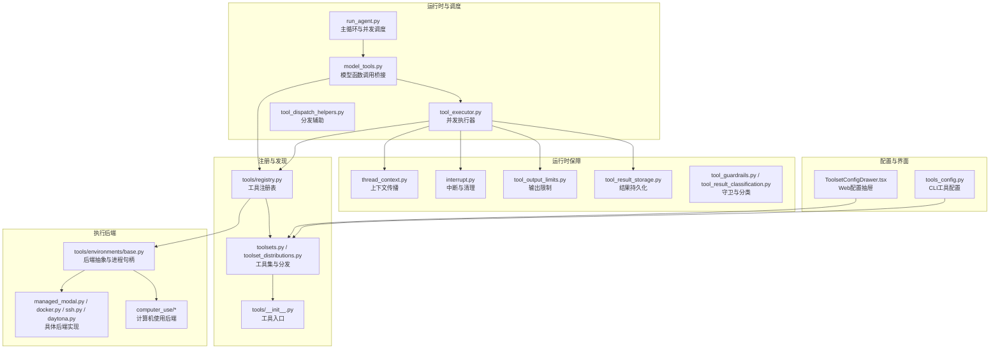
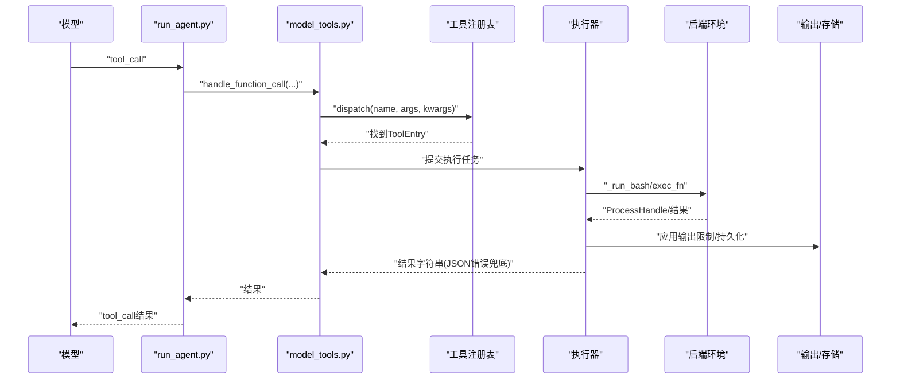
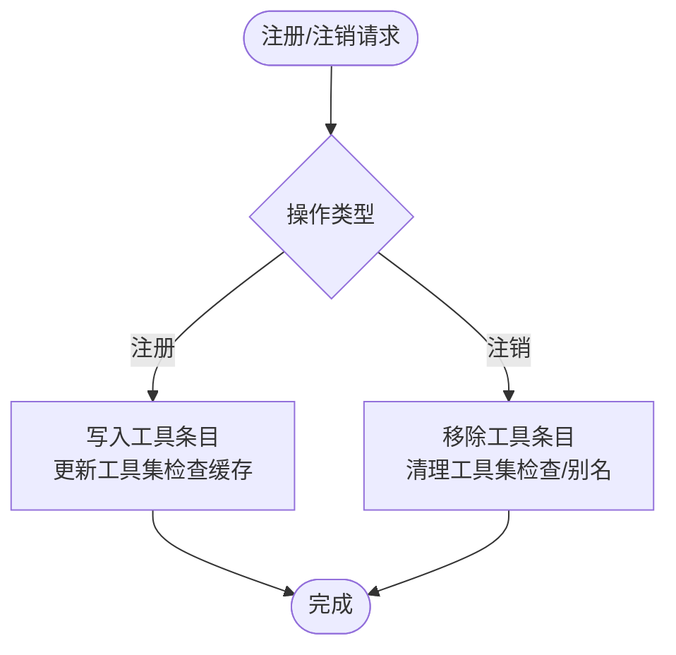
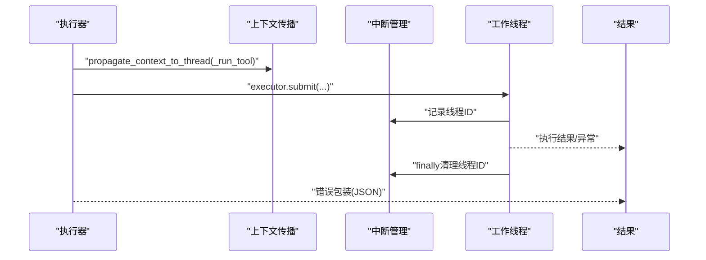
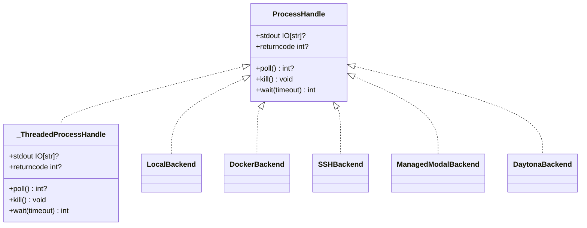
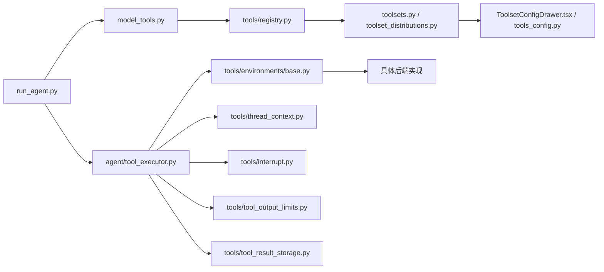

# 工具架构

<cite>
**本文引用的文件**
- [tool_executor.py](file://agent/tool_executor.py)
- [tool_dispatch_helpers.py](file://agent/tool_dispatch_helpers.py)
- [model_tools.py](file://model_tools.py)
- [run_agent.py](file://run_agent.py)
- [tool_backend_helpers.py](file://tools/tool_backend_helpers.py)
- [base.py](file://tools/environments/base.py)
- [managed_modal.py](file://tools/environments/managed_modal.py)
- [docker.py](file://tools/environments/docker.py)
- [ssh.py](file://tools/environments/ssh.py)
- [daytona.py](file://tools/environments/daytona.py)
- [computer_use/backend.py](file://tools/computer_use/backend.py)
- [computer_use/cua_backend.py](file://tools/computer_use/cua_backend.py)
- [process_registry.py](file://tools/process_registry.py)
- [thread_context.py](file://tools/thread_context.py)
- [interrupt.py](file://tools/interrupt.py)
- [tool_output_limits.py](file://tools/tool_output_limits.py)
- [tool_result_storage.py](file://tools/tool_result_storage.py)
- [tool_guardrails.py](file://agent/tool_guardrails.py)
- [tool_result_classification.py](file://agent/tool_result_classification.py)
- [toolset_distributions.py](file://toolset_distributions.py)
- [toolsets.py](file://toolsets.py)
- [ToolsetConfigDrawer.tsx](file://web/src/components/ToolsetConfigDrawer.tsx)
- [tools_config.py](file://hermes_cli/tools_config.py)
- [tools/__init__.py](file://tools/__init__.py)
- [tools/registry.py](file://tools/registry.py)
- [test_mcp_dynamic_discovery.py](file://tests/tools/test_mcp_dynamic_discovery.py)
- [test_tool_backend_helpers.py](file://tests/tools/test_tool_backend_helpers.py)
- [test_threaded_process_handle.py](file://tests/tools/test_threaded_process_handle.py)
- [test_tool_result_storage.py](file://tests/tools/test_tool_result_storage.py)
- [test_interrupt.py](file://tests/tools/test_interrupt.py)
- [test_tool_executor_contextvar_propagation.py](file://tests/run_agent/test_tool_executor_contextvar_propagation.py)
</cite>

## 目录
1. [引言](#引言)
2. [项目结构](#项目结构)
3. [核心组件](#核心组件)
4. [架构总览](#架构总览)
5. [详细组件分析](#详细组件分析)
6. [依赖关系分析](#依赖关系分析)
7. [性能考量](#性能考量)
8. [故障排查指南](#故障排查指南)
9. [结论](#结论)
10. [附录](#附录)

## 引言
本文件面向Hermes Agent的工具系统，系统性阐述工具架构的整体设计模式、核心组件与运行机制。重点覆盖工具注册与发现、工具生命周期管理、执行引擎与异步处理、错误恢复策略、后端抽象层与进程管理、资源隔离、配置与依赖注入、以及扩展点与插件接口。文档同时提供多类可视化图示，帮助读者从高层到代码级全面理解工具系统。

## 项目结构
工具系统围绕“注册表-执行器-后端环境”三层展开，配合运行时钩子、上下文传播、输出限制与存储、以及CLI/Web配置界面，形成可扩展、可观测、可隔离的工具执行平台。

图表来源
- [run_agent.py](file://run_agent.py)
- [model_tools.py](file://model_tools.py)
- [tool_executor.py](file://agent/tool_executor.py)
- [tool_dispatch_helpers.py](file://agent/tool_dispatch_helpers.py)
- [tools/registry.py](file://tools/registry.py)
- [tools/__init__.py](file://tools/__init__.py)
- [toolsets.py](file://toolsets.py)
- [toolset_distributions.py](file://toolset_distributions.py)
- [tools/environments/base.py](file://tools/environments/base.py)
- [tools/environments/managed_modal.py](file://tools/environments/managed_modal.py)
- [tools/environments/docker.py](file://tools/environments/docker.py)
- [tools/environments/ssh.py](file://tools/environments/ssh.py)
- [tools/environments/daytona.py](file://tools/environments/daytona.py)
- [tools/computer_use/backend.py](file://tools/computer_use/backend.py)
- [tools/computer_use/cua_backend.py](file://tools/computer_use/cua_backend.py)
- [thread_context.py](file://tools/thread_context.py)
- [interrupt.py](file://tools/interrupt.py)
- [tool_output_limits.py](file://tools/tool_output_limits.py)
- [tool_result_storage.py](file://tools/tool_result_storage.py)
- [tool_guardrails.py](file://agent/tool_guardrails.py)
- [tool_result_classification.py](file://agent/tool_result_classification.py)
- [ToolsetConfigDrawer.tsx](file://web/src/components/ToolsetConfigDrawer.tsx)
- [tools_config.py](file://hermes_cli/tools_config.py)

章节来源
- [run_agent.py](file://run_agent.py)
- [model_tools.py](file://model_tools.py)
- [tool_executor.py](file://agent/tool_executor.py)
- [tool_dispatch_helpers.py](file://agent/tool_dispatch_helpers.py)
- [tools/registry.py](file://tools/registry.py)
- [tools/__init__.py](file://tools/__init__.py)
- [toolsets.py](file://toolsets.py)
- [toolset_distributions.py](file://toolset_distributions.py)
- [tools/environments/base.py](file://tools/environments/base.py)
- [tools/environments/managed_modal.py](file://tools/environments/managed_modal.py)
- [tools/environments/docker.py](file://tools/environments/docker.py)
- [tools/environments/ssh.py](file://tools/environments/ssh.py)
- [tools/environments/daytona.py](file://tools/environments/daytona.py)
- [tools/computer_use/backend.py](file://tools/computer_use/backend.py)
- [tools/computer_use/cua_backend.py](file://tools/computer_use/cua_backend.py)
- [thread_context.py](file://tools/thread_context.py)
- [interrupt.py](file://tools/interrupt.py)
- [tool_output_limits.py](file://tools/tool_output_limits.py)
- [tool_result_storage.py](file://tools/tool_result_storage.py)
- [tool_guardrails.py](file://agent/tool_guardrails.py)
- [tool_result_classification.py](file://agent/tool_result_classification.py)
- [ToolsetConfigDrawer.tsx](file://web/src/components/ToolsetConfigDrawer.tsx)
- [tools_config.py](file://hermes_cli/tools_config.py)

## 核心组件
- 工具注册表与发现：集中管理工具定义、Schema、处理器与工具集别名，支持动态注册/注销与工具集检查缓存。
- 执行引擎：并发调度、上下文传播、超时与中断、输出限制与结果持久化。
- 后端抽象层：统一进程句柄协议，适配本地/容器/云沙箱等不同执行环境。
- 配置与分发：工具集配置、环境变量、后端模式选择、Web/CLI配置界面。
- 运行时保障：守卫与分类、错误包装、资源隔离与清理。

章节来源
- [tools/registry.py](file://tools/registry.py)
- [tool_executor.py](file://agent/tool_executor.py)
- [tools/environments/base.py](file://tools/environments/base.py)
- [tool_backend_helpers.py](file://tools/tool_backend_helpers.py)
- [toolsets.py](file://toolsets.py)
- [ToolsetConfigDrawer.tsx](file://web/src/components/ToolsetConfigDrawer.tsx)

## 架构总览
工具系统采用“模型驱动+注册表分发+后端执行”的分层架构。模型侧通过函数调用触发工具执行；注册表负责解析与路由；执行器负责并发与资源管理；后端抽象层屏蔽底层差异；配置与UI贯穿全链路。

图表来源
- [run_agent.py](file://run_agent.py)
- [model_tools.py](file://model_tools.py)
- [tool_dispatch_helpers.py](file://agent/tool_dispatch_helpers.py)
- [tools/registry.py](file://tools/registry.py)
- [tools/environments/base.py](file://tools/environments/base.py)
- [tool_output_limits.py](file://tools/tool_output_limits.py)
- [tool_result_storage.py](file://tools/tool_result_storage.py)

## 详细组件分析

### 工具注册与发现
- 注册表职责：维护工具名称到处理器的映射、工具集别名、工具集可用性检查缓存、动态注册/注销与去重。
- 工具集别名：支持将“srv”指向“mcp-srv”，并在最后工具移除时自动清理别名。
- 动态发现与清理：测试覆盖了注册/注销对工具集检查与别名的影响，确保一致性与资源回收。

图表来源
- [test_mcp_dynamic_discovery.py](file://tests/tools/test_mcp_dynamic_discovery.py)
- [tools/registry.py](file://tools/registry.py)

章节来源
- [test_mcp_dynamic_discovery.py](file://tests/tools/test_mcp_dynamic_discovery.py)
- [tools/registry.py](file://tools/registry.py)

### 执行引擎与并发调度
- 并发执行：通过线程池提交工具执行任务，保证高吞吐与快速失败收敛。
- 上下文传播：使用上下文传播工具确保线程内共享状态（如审批回调）正确传递。
- 中断与清理：捕获并清理中断线程ID，避免泄漏；对BaseException场景进行finally清理。
- 结果处理：统一JSON错误包装，保证模型侧始终得到格式化结果。

图表来源
- [tool_executor.py](file://agent/tool_executor.py)
- [thread_context.py](file://tools/thread_context.py)
- [interrupt.py](file://tools/interrupt.py)
- [test_interrupt.py](file://tests/tools/test_interrupt.py)
- [test_tool_executor_contextvar_propagation.py](file://tests/run_agent/test_tool_executor_contextvar_propagation.py)

章节来源
- [tool_executor.py](file://agent/tool_executor.py)
- [thread_context.py](file://tools/thread_context.py)
- [interrupt.py](file://tools/interrupt.py)
- [test_interrupt.py](file://tests/tools/test_interrupt.py)
- [test_tool_executor_contextvar_propagation.py](file://tests/run_agent/test_tool_executor_contextvar_propagation.py)

### 后端抽象层与进程管理
- 统一协议：ProcessHandle定义poll/kil/wait/stdout/returncode等能力，兼容真实子进程与SDK后端适配器。
- 适配器：_ThreadedProcessHandle将阻塞执行函数包装为异步句柄，支持可选取消回调。
- 具体后端：本地、Docker、SSH、Managed Modal、Daytona等，均实现后端抽象并暴露统一接口。
- 会话快照：部分后端支持初始化会话快照，减少登录shell开销。

图表来源
- [tools/environments/base.py](file://tools/environments/base.py)
- [tools/environments/local.py](file://tools/environments/local.py)
- [tools/environments/docker.py](file://tools/environments/docker.py)
- [tools/environments/ssh.py](file://tools/environments/ssh.py)
- [tools/environments/managed_modal.py](file://tools/environments/managed_modal.py)
- [tools/environments/daytona.py](file://tools/environments/daytona.py)

章节来源
- [tools/environments/base.py](file://tools/environments/base.py)
- [tools/environments/local.py](file://tools/environments/local.py)
- [tools/environments/docker.py](file://tools/environments/docker.py)
- [tools/environments/ssh.py](file://tools/environments/ssh.py)
- [tools/environments/managed_modal.py](file://tools/environments/managed_modal.py)
- [tools/environments/daytona.py](file://tools/environments/daytona.py)
- [test_threaded_process_handle.py](file://tests/tools/test_threaded_process_handle.py)

### 计算机使用工具后端
- 通用后端：封装跨平台计算机使用能力，统一输入输出与安全策略。
- CUA后端：针对特定控制单元的适配，提供更细粒度的交互与反馈。

章节来源
- [computer_use/backend.py](file://tools/computer_use/backend.py)
- [computer_use/cua_backend.py](file://tools/computer_use/cua_backend.py)

### 工具生命周期管理
- 生命周期阶段：注册/发现/调度/执行/结果处理/清理。
- 清理策略：线程池回收、会话快照、后端资源释放、中断集合清理。
- 可观测性：日志、计数、错误分类与持久化标记。

章节来源
- [process_registry.py](file://tools/process_registry.py)
- [interrupt.py](file://tools/interrupt.py)
- [tools/environments/base.py](file://tools/environments/base.py)

### 工具执行引擎设计理念
- 设计目标：高并发、低耦合、强健的错误恢复与可观测性。
- 异步处理：线程池+上下文传播，避免阻塞主线程。
- 错误恢复：两层错误包装，确保模型侧稳定接收JSON结果。
- 输出治理：输出长度限制与大结果优先持久化策略，降低内存压力。

章节来源
- [tool_executor.py](file://agent/tool_executor.py)
- [tool_output_limits.py](file://tools/tool_output_limits.py)
- [tool_result_storage.py](file://tools/tool_result_storage.py)
- [test_tool_result_storage.py](file://tests/tools/test_tool_result_storage.py)

### 工具后端抽象层与资源隔离
- 抽象层：统一ProcessHandle协议，屏蔽本地/容器/云后端差异。
- 资源隔离：后端各自实现cleanup与会话快照，避免相互污染。
- 安全与守卫：工具守卫与结果分类，防止滥用与敏感信息泄露。

章节来源
- [tools/environments/base.py](file://tools/environments/base.py)
- [tool_guardrails.py](file://agent/tool_guardrails.py)
- [tool_result_classification.py](file://agent/tool_result_classification.py)

### 工具配置系统、依赖注入与运行时环境
- 工具集配置：Web抽屉支持加载/保存环境变量、激活提供者、触发安装后动作并轮询日志。
- CLI配置：tools_config.py提供命令行工具配置入口。
- 依赖注入：通过工具集分发与注册表，将处理器与Schema注入到执行路径。
- 运行时环境：后端初始化会话快照，确保后续命令复用一致环境。

章节来源
- [ToolsetConfigDrawer.tsx](file://web/src/components/ToolsetConfigDrawer.tsx)
- [tools_config.py](file://hermes_cli/tools_config.py)
- [toolset_distributions.py](file://toolset_distributions.py)
- [tools/environments/base.py](file://tools/environments/base.py)

### 工具系统扩展点与插件接口
- 自定义工具：通过注册表注册新工具，提供Schema与处理器。
- 自定义后端：实现ProcessHandle协议，接入新执行环境。
- 插件接口：工具集分发与注册表为第三方工具提供标准扩展点。

章节来源
- [tools/registry.py](file://tools/registry.py)
- [tools/environments/base.py](file://tools/environments/base.py)
- [toolsets.py](file://toolsets.py)

## 依赖关系分析

图表来源
- [model_tools.py](file://model_tools.py)
- [tools/registry.py](file://tools/registry.py)
- [run_agent.py](file://run_agent.py)
- [agent/tool_executor.py](file://agent/tool_executor.py)
- [tools/environments/base.py](file://tools/environments/base.py)
- [tools/thread_context.py](file://tools/thread_context.py)
- [tools/interrupt.py](file://tools/interrupt.py)
- [tools/tool_output_limits.py](file://tools/tool_output_limits.py)
- [tools/tool_result_storage.py](file://tools/tool_result_storage.py)
- [toolsets.py](file://toolsets.py)
- [toolset_distributions.py](file://toolset_distributions.py)
- [ToolsetConfigDrawer.tsx](file://web/src/components/ToolsetConfigDrawer.tsx)
- [tools_config.py](file://hermes_cli/tools_config.py)

章节来源
- [model_tools.py](file://model_tools.py)
- [tools/registry.py](file://tools/registry.py)
- [run_agent.py](file://run_agent.py)
- [agent/tool_executor.py](file://agent/tool_executor.py)
- [tools/environments/base.py](file://tools/environments/base.py)
- [tools/thread_context.py](file://tools/thread_context.py)
- [tools/interrupt.py](file://tools/interrupt.py)
- [tools/tool_output_limits.py](file://tools/tool_output_limits.py)
- [tools/tool_result_storage.py](file://tools/tool_result_storage.py)
- [toolsets.py](file://toolsets.py)
- [toolset_distributions.py](file://toolset_distributions.py)
- [ToolsetConfigDrawer.tsx](file://web/src/components/ToolsetConfigDrawer.tsx)
- [tools_config.py](file://hermes_cli/tools_config.py)

## 性能考量
- 并发模型：线程池并发执行工具调用，结合上下文传播避免锁竞争。
- 输出治理：优先持久化大结果，降低内存峰值；限制输出长度，控制回传成本。
- 后端选择：根据可用性与就绪状态动态选择后端模式，避免无效尝试。
- 会话快照：减少登录shell与环境初始化开销，提升连续任务吞吐。

章节来源
- [tool_executor.py](file://agent/tool_executor.py)
- [tool_output_limits.py](file://tools/tool_output_limits.py)
- [tool_result_storage.py](file://tools/tool_result_storage.py)
- [tool_backend_helpers.py](file://tools/tool_backend_helpers.py)
- [tools/environments/base.py](file://tools/environments/base.py)

## 故障排查指南
- 调度失败：检查注册表是否包含目标工具名称，确认Schema与处理器已注册。
- 并发异常：关注线程池异常与BaseException传播，确保finally清理中断集合。
- 输出过大：启用结果持久化标记，检查持久化策略是否生效。
- 后端不可用：确认后端就绪状态与模式选择逻辑，必要时切换到其他后端。
- 配置问题：通过Web抽屉或CLI检查工具集配置与环境变量是否正确。

章节来源
- [tools/registry.py](file://tools/registry.py)
- [test_interrupt.py](file://tests/tools/test_interrupt.py)
- [test_tool_result_storage.py](file://tests/tools/test_tool_result_storage.py)
- [test_tool_backend_helpers.py](file://tests/tools/test_tool_backend_helpers.py)
- [ToolsetConfigDrawer.tsx](file://web/src/components/ToolsetConfigDrawer.tsx)
- [tools_config.py](file://hermes_cli/tools_config.py)

## 结论
Hermes Agent工具架构以注册表为核心、执行器为枢纽、后端抽象为边界，构建了高并发、可扩展、可观察且具备资源隔离能力的工具执行平台。通过清晰的生命周期管理、完善的错误恢复与输出治理、灵活的配置与分发机制，系统能够稳定支撑多样化的工具生态与复杂运行场景。

## 附录
- 关键流程参考：模型函数调用→注册表分发→并发执行→后端执行→结果持久化与输出限制→错误包装→返回模型。
- 扩展建议：新增工具时遵循注册表Schema规范；新增后端时实现ProcessHandle协议并完善清理逻辑；通过工具集分发与Web/CLI配置实现无缝集成。