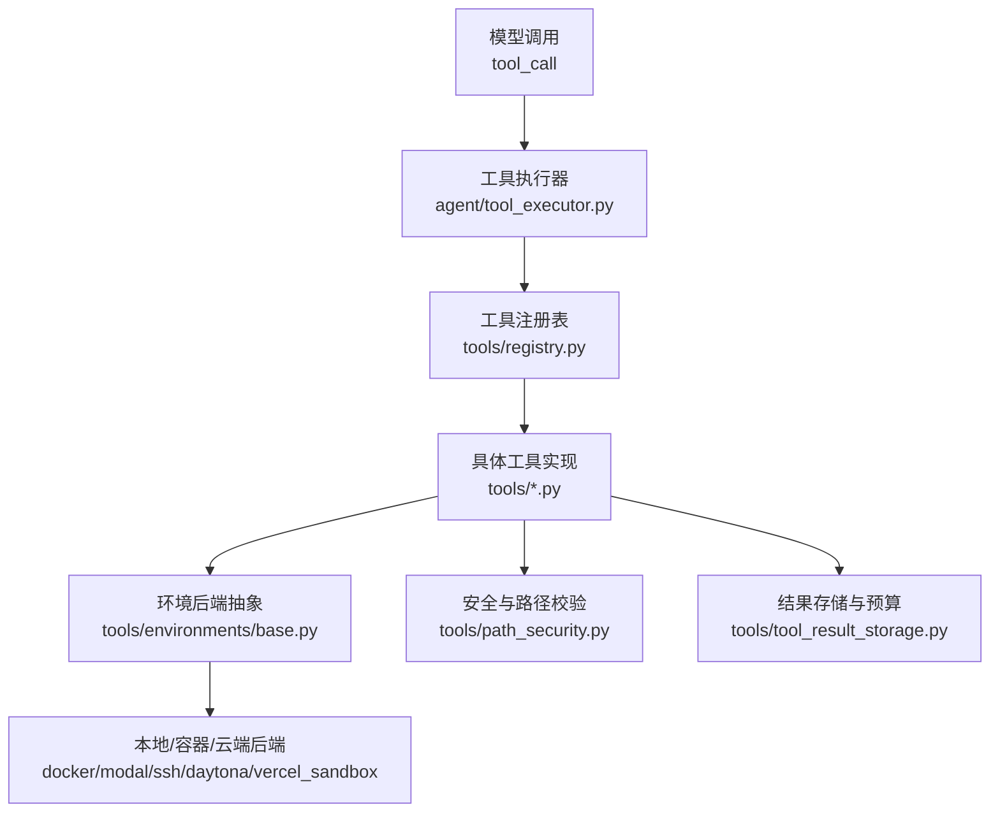
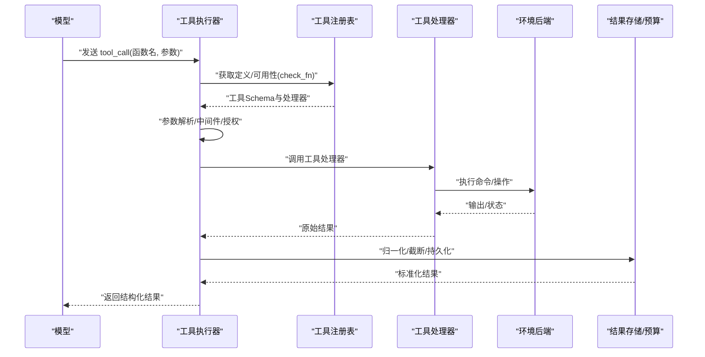
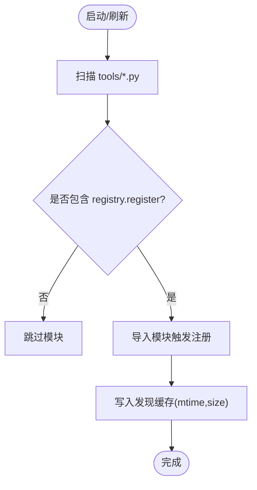
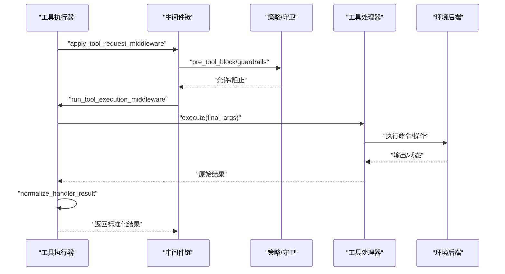
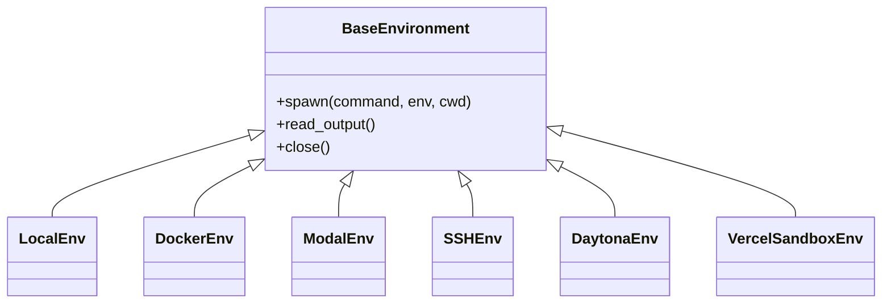
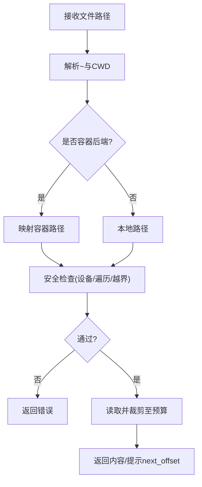
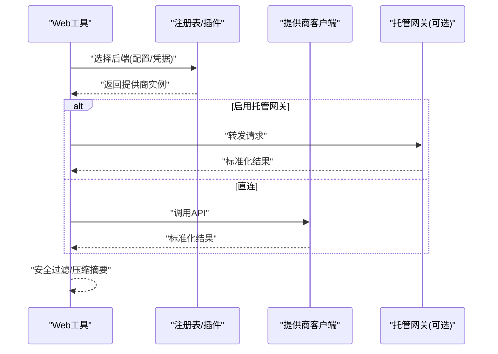
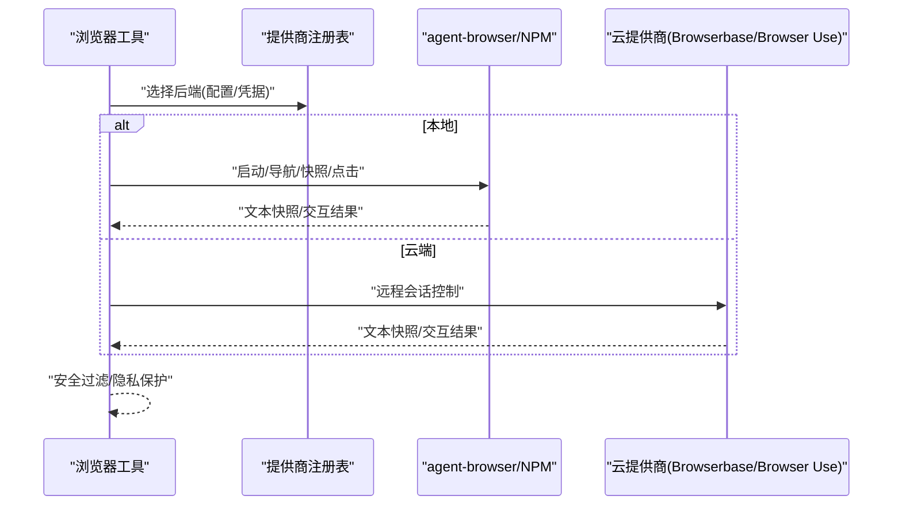
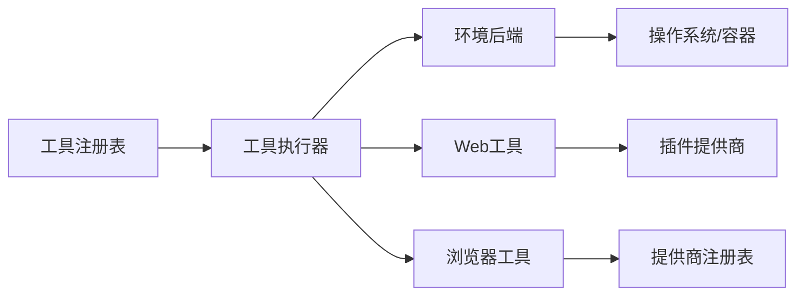

# 工具系统

<cite>
**本文引用的文件**
- [tools/registry.py](file://tools/registry.py)
- [agent/tool_executor.py](file://agent/tool_executor.py)
- [tools/tool_backend_helpers.py](file://tools/tool_backend_helpers.py)
- [tools/environments/__init__.py](file://tools/environments/__init__.py)
- [tools/environments/base.py](file://tools/environments/base.py)
- [tools/terminal_tool.py](file://tools/terminal_tool.py)
- [tools/file_tools.py](file://tools/file_tools.py)
- [tools/web_tools.py](file://tools/web_tools.py)
- [tools/browser_tool.py](file://tools/browser_tool.py)
- [tools/computer_use_tool.py](file://tools/computer_use_tool.py)
- [tools/path_security.py](file://tools/path_security.py)
</cite>

## 目录
1. [简介](#简介)
2. [项目结构](#项目结构)
3. [核心组件](#核心组件)
4. [架构总览](#架构总览)
5. [详细组件分析](#详细组件分析)
6. [依赖关系分析](#依赖关系分析)
7. [性能考虑](#性能考虑)
8. [故障排查指南](#故障排查指南)
9. [结论](#结论)
10. [附录](#附录)

## 简介
本文件为 Hermes Agent 工具系统的全面技术文档，覆盖内置与自定义工具的发现、注册、执行环境、安全机制、权限控制、参数验证与结果处理。重点说明终端执行、浏览器自动化、文件操作、网络请求等核心工具的功能与使用方法，并提供在不同后端（本地、Docker、SSH、Modal、Daytona、Vercel Sandbox）下的配置与使用指南。同时给出性能优化建议与最佳实践，帮助开发者扩展工具能力。

## 项目结构
Hermes 的工具系统围绕“注册表 + 执行器 + 环境后端”的三层架构组织：
- 注册表层：集中管理所有工具的元数据、Schema、可用性与动态覆盖。
- 执行器层：负责工具调度的并发、授权、预算、结果归一化与持久化。
- 环境后端层：统一抽象不同执行环境（本地、容器、云端沙箱），提供一致的命令执行接口。

图表来源
- [agent/tool_executor.py:1-120](file://agent/tool_executor.py#L1-L120)
- [tools/registry.py:108-159](file://tools/registry.py#L108-L159)
- [tools/environments/base.py:1-80](file://tools/environments/base.py#L1-L80)

章节来源
- [tools/environments/__init__.py:1-15](file://tools/environments/__init__.py#L1-L15)
- [tools/registry.py:108-159](file://tools/registry.py#L108-L159)
- [agent/tool_executor.py:1-120](file://agent/tool_executor.py#L1-L120)

## 核心组件
- 工具注册表（ToolRegistry）：维护工具名到 ToolEntry 的映射，支持按工具集分组、别名、动态 Schema 覆盖、check_fn 可用性探测与缓存。
- 工具执行器：解析参数、前置检查、中间件链、并发调度、结果归一化、预算控制、中断与取消、进度回调与持久化。
- 环境后端：统一的 BaseEnvironment 抽象，封装进程生命周期、输出收集、中断响应、CWD 同步与错误分类。
- 安全与路径校验：限制路径越界、设备读取、遍历攻击等风险。
- Web/浏览器工具：多后端选择（Exa/Firecrawl/Tavily/Parallel 等；Browserbase/Browser Use/Firecrawl/Camofox），凭据隔离与网关路由。

章节来源
- [tools/registry.py:201-230](file://tools/registry.py#L201-L230)
- [tools/registry.py:414-764](file://tools/registry.py#L414-L764)
- [agent/tool_executor.py:141-176](file://agent/tool_executor.py#L141-L176)
- [tools/environments/base.py:55-80](file://tools/environments/base.py#L55-L80)
- [tools/path_security.py:15-44](file://tools/path_security.py#L15-L44)
- [tools/web_tools.py:121-200](file://tools/web_tools.py#L121-L200)
- [tools/browser_tool.py:1-50](file://tools/browser_tool.py#L1-L50)

## 架构总览
下图展示从模型发起 tool_call 到工具执行、环境运行、结果返回的完整流程，包括授权、中间件、并发与结果归一化。

图表来源
- [agent/tool_executor.py:482-662](file://agent/tool_executor.py#L482-L662)
- [tools/registry.py:717-764](file://tools/registry.py#L717-L764)
- [tools/environments/base.py:81-200](file://tools/environments/base.py#L81-L200)

## 详细组件分析

### 工具注册与发现
- 自动发现：扫描 tools/*.py，通过 AST 检测顶层 registry.register 调用，避免误报并缓存结果。
- 注册项：包含名称、工具集、Schema、处理器、可用性检查、环境变量要求、异步标记、描述、表情、最大结果大小、动态 Schema 覆盖。
- 可用性探测：check_fn 带 TTL 与失败宽限窗口，避免瞬时抖动导致工具不可用。
- 动态 Schema：在 get_definitions 时合并运行时覆盖（如委托任务限制）。

图表来源
- [tools/registry.py:108-159](file://tools/registry.py#L108-L159)
- [tools/registry.py:162-199](file://tools/registry.py#L162-L199)

章节来源
- [tools/registry.py:108-159](file://tools/registry.py#L108-L159)
- [tools/registry.py:201-230](file://tools/registry.py#L201-L230)
- [tools/registry.py:233-380](file://tools/registry.py#L233-L380)
- [tools/registry.py:717-764](file://tools/registry.py#L717-L764)

### 工具执行器（并发、授权、预算、结果）
- 参数解析：严格 JSON 对象，非法则返回标准错误信封。
- 中间件链：请求级与执行级中间件，支持插件拦截、策略守卫、范围限制。
- 并发调度：线程池并行执行，图像生成等慢操作有独立并发上限。
- 授权门控：序列化审批提示，排除人类等待时间对批处理截止的影响。
- 结果归一化：仅允许字符串或多模态信封，其他类型转为错误消息。
- 预算与持久化：根据上下文窗口缩放结果预算，必要时落盘或截断。

图表来源
- [agent/tool_executor.py:482-662](file://agent/tool_executor.py#L482-L662)
- [agent/tool_executor.py:758-800](file://agent/tool_executor.py#L758-L800)
- [tools/registry.py:770-800](file://tools/registry.py#L770-L800)

章节来源
- [agent/tool_executor.py:141-176](file://agent/tool_executor.py#L141-L176)
- [agent/tool_executor.py:391-468](file://agent/tool_executor.py#L391-L468)
- [agent/tool_executor.py:482-662](file://agent/tool_executor.py#L482-L662)
- [agent/tool_executor.py:758-800](file://agent/tool_executor.py#L758-L800)

### 终端执行与环境后端
- 统一抽象：BaseEnvironment 提供 spawn-per-call 模型，捕获会话快照，CWD 持久化，流式输出头尾窗口与溢出转储。
- 后端选择：通过 TERMINAL_ENV 选择 local/docker/modal/vercel_sandbox 等；Modal 支持 direct/managed/auto。
- 安全与健壮性：连接类异常归类为 EnvironmentConnectionError，附带重试提示；中断事件可终止长进程。
- Vercel Sandbox：校验运行时版本、磁盘配置、认证方式（OIDC 或 Token+Project+Team）。

图表来源
- [tools/environments/base.py:1-80](file://tools/environments/base.py#L1-L80)
- [tools/terminal_tool.py:1-35](file://tools/terminal_tool.py#L1-L35)
- [tools/terminal_tool.py:141-196](file://tools/terminal_tool.py#L141-L196)

章节来源
- [tools/environments/base.py:55-80](file://tools/environments/base.py#L55-L80)
- [tools/environments/base.py:81-200](file://tools/environments/base.py#L81-L200)
- [tools/terminal_tool.py:1-35](file://tools/terminal_tool.py#L1-L35)
- [tools/terminal_tool.py:141-196](file://tools/terminal_tool.py#L141-L196)

### 文件操作与安全
- 路径解析：相对工作区根目录解析，支持 ~ 展开与容器后端差异。
- 读取预算：默认单读字符上限，超大文件按行裁剪并提示 next_offset。
- 设备保护：阻止读取 /dev/* 等可能阻塞或无限输出的设备。
- 路径安全：校验路径不越界、无遍历组件。

图表来源
- [tools/file_tools.py:30-50](file://tools/file_tools.py#L30-L50)
- [tools/file_tools.py:65-134](file://tools/file_tools.py#L65-L134)
- [tools/file_tools.py:152-200](file://tools/file_tools.py#L152-L200)
- [tools/path_security.py:15-44](file://tools/path_security.py#L15-L44)

章节来源
- [tools/file_tools.py:65-134](file://tools/file_tools.py#L65-L134)
- [tools/file_tools.py:152-200](file://tools/file_tools.py#L152-L200)
- [tools/path_security.py:15-44](file://tools/path_security.py#L15-L44)

### 网络请求与Web工具
- 后端选择：内置 Exa/Firecrawl/Tavily/Parallel/SearXNG/Brave-free/DDGS/xai 等，支持插件注册的新后端。
- 凭据与网关：支持 Nous 托管工具网关（订阅者），优先走 managed 模式，否则回退 direct。
- 安全：URL 白名单、敏感查询参数过滤、SSRF 防护。

图表来源
- [tools/web_tools.py:121-200](file://tools/web_tools.py#L121-L200)
- [tools/tool_backend_helpers.py:20-71](file://tools/tool_backend_helpers.py#L20-L71)
- [tools/tool_backend_helpers.py:278-312](file://tools/tool_backend_helpers.py#L278-L312)

章节来源
- [tools/web_tools.py:121-200](file://tools/web_tools.py#L121-L200)
- [tools/tool_backend_helpers.py:20-71](file://tools/tool_backend_helpers.py#L20-L71)
- [tools/tool_backend_helpers.py:278-312](file://tools/tool_backend_helpers.py#L278-L312)

### 浏览器自动化
- 后端：本地 Chromium（agent-browser）、Browserbase、Browser Use、Firecrawl、Camofox（可选）。
- 凭据隔离：子进程环境剥离非必要密钥，仅透传浏览器后端所需变量。
- 页面表示：基于无障碍树（ariaSnapshot）文本快照，便于无视觉模型的交互。
- 会话隔离：按 task_id 隔离浏览器会话，自动清理。

图表来源
- [tools/browser_tool.py:1-50](file://tools/browser_tool.py#L1-L50)
- [tools/browser_tool.py:125-141](file://tools/browser_tool.py#L125-L141)
- [tools/browser_tool.py:159-177](file://tools/browser_tool.py#L159-L177)

章节来源
- [tools/browser_tool.py:1-50](file://tools/browser_tool.py#L1-L50)
- [tools/browser_tool.py:125-141](file://tools/browser_tool.py#L125-L141)
- [tools/browser_tool.py:159-177](file://tools/browser_tool.py#L159-L177)

### 计算机使用（桌面控制）
- 功能：跨平台桌面控制（macOS/Windows/Linux），后台操作不抢占用户焦点。
- 注册：通过 shim 模块向注册表注册 computer_use 工具。

章节来源
- [tools/computer_use_tool.py:1-43](file://tools/computer_use_tool.py#L1-L43)

## 依赖关系分析
- 工具注册表依赖：AST 扫描、模块导入、缓存读写、check_fn 缓存与失效。
- 执行器依赖：显示层、中间件、批准系统、预算配置、结果存储、终端工具环境。
- 环境后端依赖：进程管理、信号/中断、CWD 同步、输出收集、错误分类。
- Web/浏览器依赖：插件提供商、托管网关、凭据池、URL 安全。

图表来源
- [tools/registry.py:108-159](file://tools/registry.py#L108-L159)
- [agent/tool_executor.py:482-662](file://agent/tool_executor.py#L482-L662)
- [tools/web_tools.py:121-200](file://tools/web_tools.py#L121-L200)
- [tools/browser_tool.py:159-177](file://tools/browser_tool.py#L159-L177)

章节来源
- [tools/registry.py:108-159](file://tools/registry.py#L108-L159)
- [agent/tool_executor.py:482-662](file://agent/tool_executor.py#L482-L662)
- [tools/web_tools.py:121-200](file://tools/web_tools.py#L121-L200)
- [tools/browser_tool.py:159-177](file://tools/browser_tool.py#L159-L177)

## 性能考虑
- 工具发现缓存：基于 mtime+size 的文件级缓存，减少 AST 扫描开销。
- check_fn 缓存：TTL 约 30 秒，失败宽限窗口避免瞬时抖动导致工具不可用。
- 并发控制：工具批处理最大工作线程数，图像生成单独限制。
- 输出收集：头尾窗口 + 溢出转储，防止大输出占用内存。
- 结果预算：按上下文窗口缩放，避免单次结果过大影响模型上下文。
- 懒加载：浏览器工具等模块延迟导入关键依赖，降低冷启动成本。

章节来源
- [tools/registry.py:108-159](file://tools/registry.py#L108-L159)
- [tools/registry.py:233-380](file://tools/registry.py#L233-L380)
- [agent/tool_executor.py:93-111](file://agent/tool_executor.py#L93-L111)
- [agent/tool_executor.py:209-246](file://agent/tool_executor.py#L209-L246)
- [tools/environments/base.py:81-200](file://tools/environments/base.py#L81-L200)
- [tools/browser_tool.py:78-98](file://tools/browser_tool.py#L78-L98)

## 故障排查指南
- 工具不可用：检查 check_fn 缓存与日志，确认外部依赖（Docker/Modal/Playwright）状态；必要时调用失效接口刷新。
- 终端执行失败：区分命令失败与基础设施失败（EnvironmentConnectionError），查看重试提示与后端可达性。
- 文件读取被拒绝：确认路径未越界、未访问受保护设备；检查工作区 CWD 与容器路径映射。
- Web/浏览器问题：验证凭据与网关可用性；检查 URL 安全策略与提供商健康状态。
- 并发超时：调整 HERMES_CONCURRENT_TOOL_TIMEOUT_S；关注审批门控锁超时与人类等待排除。

章节来源
- [tools/registry.py:233-380](file://tools/registry.py#L233-L380)
- [tools/environments/base.py:55-80](file://tools/environments/base.py#L55-L80)
- [tools/file_tools.py:65-134](file://tools/file_tools.py#L65-L134)
- [tools/web_tools.py:121-200](file://tools/web_tools.py#L121-L200)
- [agent/tool_executor.py:160-176](file://agent/tool_executor.py#L160-L176)

## 结论
Hermes 工具系统通过注册表、执行器与环境后端的清晰分层，实现了高内聚、可扩展且安全的工具生态。其自动发现、动态 Schema、并发调度、结果归一化与多后端支持，使得终端、文件、网络与浏览器等核心能力可在多种环境中稳定运行。结合严格的权限控制、路径安全与凭据隔离，以及性能优化的缓存与预算机制，为开发者提供了强大的扩展基础。

## 附录
- 自定义工具开发步骤
  - 定义工具 Schema 与处理器函数。
  - 在模块顶层调用 registry.register 进行注册，指定工具集、check_fn、requires_env、is_async、描述、表情、最大结果大小与动态 Schema 覆盖。
  - 如需替换内置工具，需显式 override=True 并通过 operator 策略授权。
  - 编写单元测试，覆盖参数校验、错误路径与后端可用性。
- 不同后端配置要点
  - 本地：无需额外依赖，注意 CWD 与权限。
  - Docker：确保 Docker 守护进程可用，合理设置容器磁盘与网络。
  - SSH：配置主机与凭据，确保网络连通。
  - Modal：direct 需要凭据，managed 需要 Nous 工具网关可用；auto 优先 managed。
  - Daytona/Vercel Sandbox：遵循各自运行时与认证要求。
- 最佳实践
  - 使用 check_fn 做轻量探测，避免重 IO。
  - 控制工具结果大小，利用分页与裁剪。
  - 谨慎传递环境变量，最小化凭据暴露面。
  - 利用中间件与守卫实现统一审计与策略。
  - 针对慢操作（图像/视频/网页抓取）设置合理并发与超时。