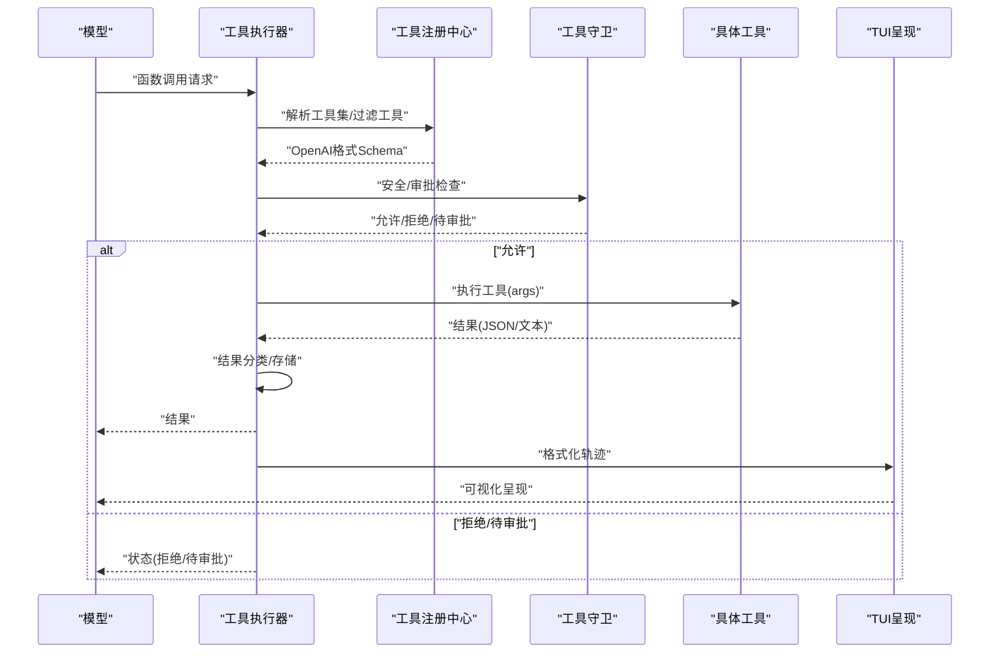
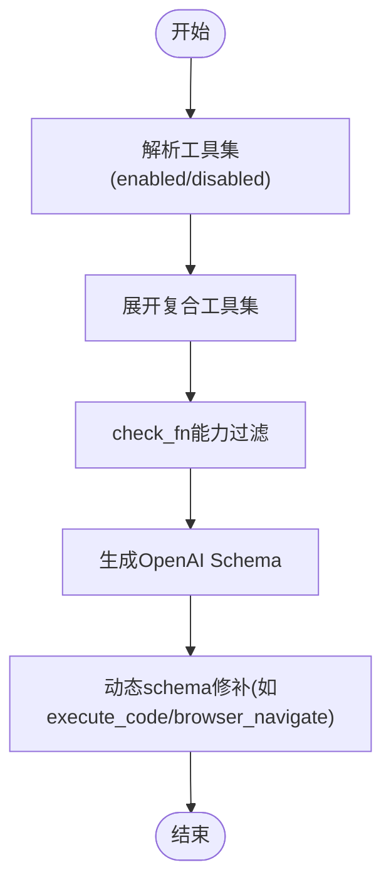
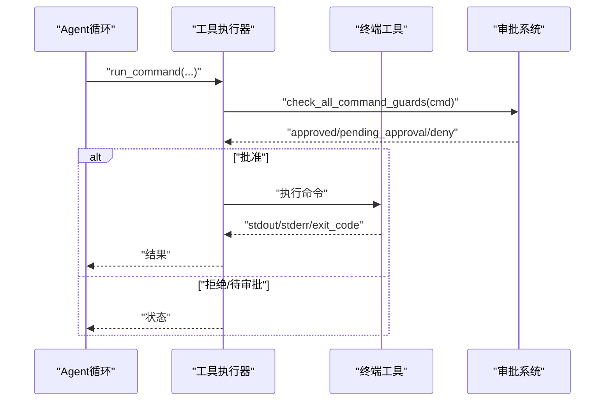
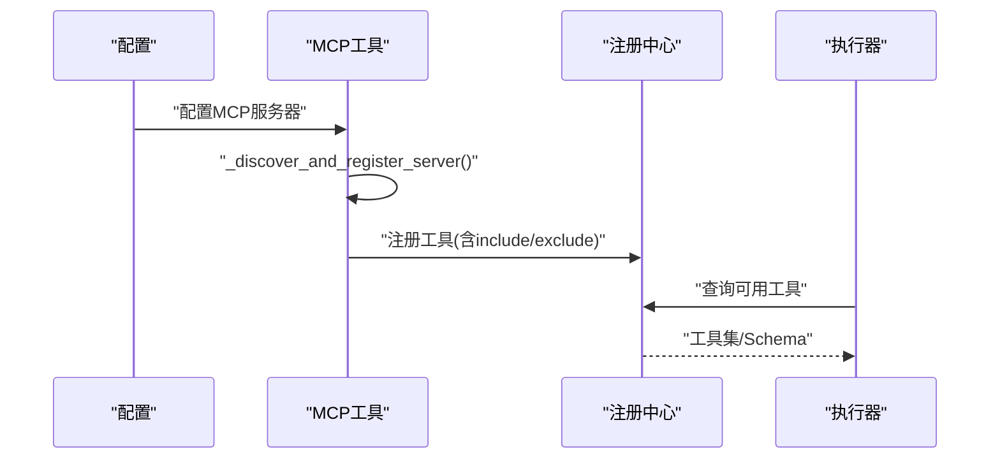
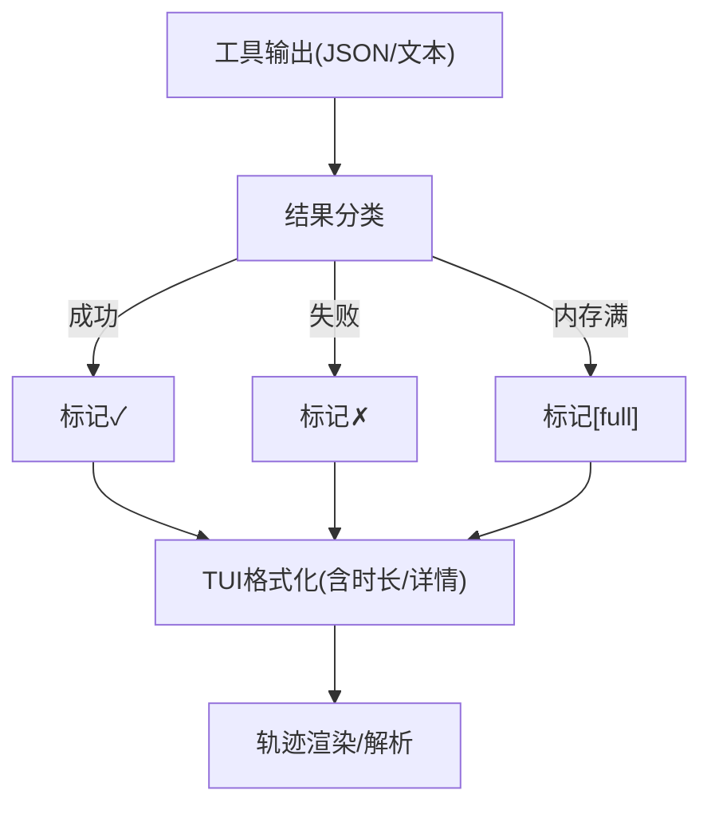
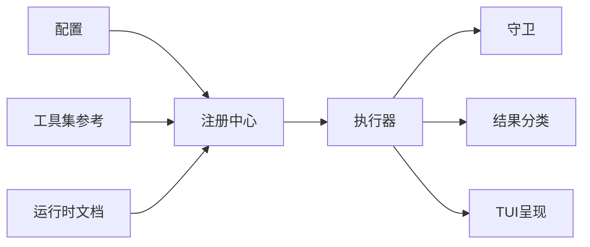

# 工具系统

<cite>
**本文档引用的文件**
- [tools/registry.py](file://tools/registry.py)
- [tools/terminal_tool.py](file://tools/terminal_tool.py)
- [tools/file_tools.py](file://tools/file_tools.py)
- [tools/browser_tool.py](file://tools/browser_tool.py)
- [tools/computer_use_tool.py](file://tools/computer_use_tool.py)
- [tools/code_execution_tool.py](file://tools/code_execution_tool.py)
- [tools/mcp_tool.py](file://tools/mcp_tool.py)
- [tools/skills_tool.py](file://tools/skills_tool.py)
- [tools/tool_search.py](file://tools/tool_search.py)
- [tools/approval.py](file://tools/approval.py)
- [agent/tool_executor.py](file://agent/tool_executor.py)
- [agent/tool_guardrails.py](file://agent/tool_guardrails.py)
- [agent/tool_result_classification.py](file://agent/tool_result_classification.py)
- [hermes_cli/tools_config.py](file://hermes_cli/tools_config.py)
- [website/docs/reference/toolsets-reference.md](file://website/docs/reference/toolsets-reference.md)
- [website/i18n/zh-Hans/docusaurus-plugin-content-docs/current/developer-guide/tools-runtime.md](file://website/i18n/zh-Hans/docusaurus-plugin-content-docs/current/developer-guide/tools-runtime.md)
- [tests/tools/test_tool_search.py](file://tests/tools/test_tool_search.py)
- [tests/tools/test_mcp_tool.py](file://tests/tools/test_mcp_tool.py)
- [tests/tools/test_registry.py](file://tests/tools/test_registry.py)
- [tests/run_agent/test_tool_executor_contextvar_propagation.py](file://tests/run_agent/test_tool_executor_contextvar_propagation.py)
- [tests/gateway/test_approve_deny_commands.py](file://tests/gateway/test_approve_deny_commands.py)
- [tests/plugins/test_security_guidance_plugin.py](file://tests/plugins/test_security_guidance_plugin.py)
- [ui-tui/src/lib/text.ts](file://ui-tui/src/lib/text.ts)
- [ui-tui/src/content/verbs.ts](file://ui-tui/src/content/verbs.ts)
- [ui-tui/src/components/thinking.tsx](file://ui-tui/src/components/thinking.tsx)
</cite>

## 目录
1. [简介](#简介)
2. [项目结构](#项目结构)
3. [核心组件](#核心组件)
4. [架构总览](#架构总览)
5. [详细组件分析](#详细组件分析)
6. [依赖关系分析](#依赖关系分析)
7. [性能考量](#性能考量)
8. [故障排查指南](#故障排查指南)
9. [结论](#结论)
10. [附录](#附录)

## 简介
本文件面向Hermes Agent工具系统的开发者与高级用户，系统性阐述工具架构、执行引擎设计与结果处理机制。内容覆盖核心工具类别（终端、文件操作、浏览器控制、计算机使用、代码执行、MCP工具、技能工具等），并提供工具开发指南、自定义工具创建流程、测试方法、配置选项、性能优化与安全考虑，以及扩展机制与第三方工具集成策略。

## 项目结构
工具系统主要分布在以下模块：
- 工具注册与发现：tools/registry.py
- 具体工具实现：tools/*.py（终端、文件、浏览器、计算机使用、代码执行、MCP工具、技能工具等）
- 执行与调度：agent/tool_executor.py、agent/tool_guardrails.py
- 结果分类与呈现：agent/tool_result_classification.py、ui-tui渲染逻辑
- 配置与工具集：hermes_cli/tools_config.py、website/docs/reference/toolsets-reference.md
- 文档与运行时说明：website/i18n/.../tools-runtime.md
- 测试与回归：tests/tools、tests/gateway、tests/run_agent、tests/plugins

```mermaid
graph TB
subgraph "工具层"
REG["工具注册中心<br/>tools/registry.py"]
TERM["终端工具<br/>tools/terminal_tool.py"]
FILE["文件工具<br/>tools/file_tools.py"]
BROWSE["浏览器工具<br/>tools/browser_tool.py"]
COMP["计算机使用工具<br/>tools/computer_use_tool.py"]
CODE["代码执行工具<br/>tools/code_execution_tool.py"]
MCP["MCP工具<br/>tools/mcp_tool.py"]
SKILL["技能工具<br/>tools/skills_tool.py"]
end
subgraph "执行与调度"
EXEC["工具执行器<br/>agent/tool_executor.py"]
GUARD["工具守卫<br/>agent/tool_guardrails.py"]
CLASS["结果分类<br/>agent/tool_result_classification.py"]
end
subgraph "配置与运行时"
CFG["工具配置<br/>hermes_cli/tools_config.py"]
DOC["工具集参考<br/>website/docs/reference/toolsets-reference.md"]
RT["运行时文档<br/>website/i18n/.../tools-runtime.md"]
end
subgraph "UI与测试"
TUI["TUI文本格式化<br/>ui-tui/src/lib/text.ts"]
VERB["动词映射<br/>ui-tui/src/content/verbs.ts"]
THINK["思考轨迹解析<br/>ui-tui/src/components/thinking.tsx"]
TEST["工具搜索测试<br/>tests/tools/test_tool_search.py"]
TESTMCP["MCP工具测试<br/>tests/tools/test_mcp_tool.py"]
TESTREG["注册表测试<br/>tests/tools/test_registry.py"]
TESTCTX["上下文传播测试<br/>tests/run_agent/test_tool_executor_contextvar_propagation.py"]
TESTAPPR["审批命令测试<br/>tests/gateway/test_approve_deny_commands.py"]
TESTSEC["安全插件测试<br/>tests/plugins/test_security_guidance_plugin.py"]
end
REG --> EXEC
EXEC --> TERM
EXEC --> FILE
EXEC --> BROWSE
EXEC --> COMP
EXEC --> CODE
EXEC --> MCP
EXEC --> SKILL
EXEC --> GUARD
EXEC --> CLASS
CFG --> REG
DOC --> REG
RT --> REG
TUI --> EXEC
VERB --> TUI
THINK --> TUI
TEST --> REG
TESTMCP --> MCP
TESTREG --> REG
TESTCTX --> EXEC
TESTAPPR --> EXEC
TESTSEC --> EXEC
```

**图表来源**
- [tools/registry.py](file://tools/registry.py)
- [agent/tool_executor.py](file://agent/tool_executor.py)
- [hermes_cli/tools_config.py](file://hermes_cli/tools_config.py)
- [website/docs/reference/toolsets-reference.md](file://website/docs/reference/toolsets-reference.md)
- [website/i18n/zh-Hans/docusaurus-plugin-content-docs/current/developer-guide/tools-runtime.md](file://website/i18n/zh-Hans/docusaurus-plugin-content-docs/current/developer-guide/tools-runtime.md)
- [ui-tui/src/lib/text.ts](file://ui-tui/src/lib/text.ts)
- [ui-tui/src/content/verbs.ts](file://ui-tui/src/content/verbs.ts)
- [ui-tui/src/components/thinking.tsx](file://ui-tui/src/components/thinking.tsx)
- [tests/tools/test_tool_search.py](file://tests/tools/test_tool_search.py)
- [tests/tools/test_mcp_tool.py](file://tests/tools/test_mcp_tool.py)
- [tests/tools/test_registry.py](file://tests/tools/test_registry.py)
- [tests/run_agent/test_tool_executor_contextvar_propagation.py](file://tests/run_agent/test_tool_executor_contextvar_propagation.py)
- [tests/gateway/test_approve_deny_commands.py](file://tests/gateway/test_approve_deny_commands.py)
- [tests/plugins/test_security_guidance_plugin.py](file://tests/plugins/test_security_guidance_plugin.py)

**章节来源**
- [tools/registry.py](file://tools/registry.py)
- [hermes_cli/tools_config.py](file://hermes_cli/tools_config.py)
- [website/docs/reference/toolsets-reference.md](file://website/docs/reference/toolsets-reference.md)
- [website/i18n/zh-Hans/docusaurus-plugin-content-docs/current/developer-guide/tools-runtime.md](file://website/i18n/zh-Hans/docusaurus-plugin-content-docs/current/developer-guide/tools-runtime.md)

## 核心组件
- 工具注册中心：负责工具注册、可用性检查、工具集解析与过滤、动态schema修补。
- 工具执行器：统一调度工具调用，处理并发、上下文传播、审批会话键、错误分类与结果存储。
- 工具守卫：对工具调用进行安全与合规检查，支持审批流与环境隔离。
- 结果分类：将工具输出归类为成功、失败、内存满等状态，辅助UI与日志呈现。
- UI与呈现：TUI侧对工具调用轨迹进行格式化、解析与可视化，支持时长显示与详情展开。
- 配置与工具集：集中管理工具集启用/禁用、平台工具、MCP服务器与插件工具集。

**章节来源**
- [agent/tool_executor.py](file://agent/tool_executor.py)
- [agent/tool_guardrails.py](file://agent/tool_guardrails.py)
- [agent/tool_result_classification.py](file://agent/tool_result_classification.py)
- [ui-tui/src/lib/text.ts](file://ui-tui/src/lib/text.ts)
- [ui-tui/src/components/thinking.tsx](file://ui-tui/src/components/thinking.tsx)

## 架构总览
工具系统采用“注册中心 + 执行器 + 守卫 + 分类”的分层架构。工具注册中心负责构建可调用工具目录；执行器负责按需调度与并发控制；守卫负责安全与审批；分类负责结果语义化；UI负责呈现与交互。

**图表来源**
- [agent/tool_executor.py](file://agent/tool_executor.py)
- [tools/registry.py](file://tools/registry.py)
- [agent/tool_guardrails.py](file://agent/tool_guardrails.py)
- [agent/tool_result_classification.py](file://agent/tool_result_classification.py)
- [ui-tui/src/lib/text.ts](file://ui-tui/src/lib/text.ts)

## 详细组件分析

### 工具注册中心（工具集与过滤）
- 工具集解析：支持内置、动态（MCP）、插件与自定义工具集，支持通配符与能力/工作流门控。
- 过滤策略：根据enabled/disabled工具集、check_fn能力检测、动态schema修补，确保模型仅看到可用工具。
- 旧版兼容：对带后缀的工具集名称进行映射，保证向后兼容。

**图表来源**
- [website/i18n/zh-Hans/docusaurus-plugin-content-docs/current/developer-guide/tools-runtime.md](file://website/i18n/zh-Hans/docusaurus-plugin-content-docs/current/developer-guide/tools-runtime.md)
- [website/docs/reference/toolsets-reference.md](file://website/docs/reference/toolsets-reference.md)
- [tests/tools/test_registry.py](file://tests/tools/test_registry.py)

**章节来源**
- [website/i18n/zh-Hans/docusaurus-plugin-content-docs/current/developer-guide/tools-runtime.md](file://website/i18n/zh-Hans/docusaurus-plugin-content-docs/current/developer-guide/tools-runtime.md)
- [website/docs/reference/toolsets-reference.md](file://website/docs/reference/toolsets-reference.md)
- [tests/tools/test_registry.py](file://tests/tools/test_registry.py)

### 终端工具（shell命令执行）
- 功能：在受控环境中执行命令，支持审批回调与会话键传播。
- 安全：通过守卫与审批机制限制高风险命令；支持HERMES_EXEC_ASK与HERMES_SESSION_KEY环境变量。
- 并发：在执行器线程池中运行，确保上下文变量正确传播。

**图表来源**
- [tools/terminal_tool.py](file://tools/terminal_tool.py)
- [agent/tool_executor.py](file://agent/tool_executor.py)
- [tests/run_agent/test_tool_executor_contextvar_propagation.py](file://tests/run_agent/test_tool_executor_contextvar_propagation.py)
- [tests/gateway/test_approve_deny_commands.py](file://tests/gateway/test_approve_deny_commands.py)

**章节来源**
- [tools/terminal_tool.py](file://tools/terminal_tool.py)
- [agent/tool_executor.py](file://agent/tool_executor.py)
- [tests/run_agent/test_tool_executor_contextvar_propagation.py](file://tests/run_agent/test_tool_executor_contextvar_propagation.py)
- [tests/gateway/test_approve_deny_commands.py](file://tests/gateway/test_approve_deny_commands.py)

### 文件操作工具（读写/搜索/补丁）
- 功能：读取/写入/追加/补丁文件，列出目录，支持路径安全检查。
- 安全：路径安全策略与文件类型白名单，避免越权访问。
- 结果：统一JSON结构，包含success/error/bytes_written等字段。

**章节来源**
- [tools/file_tools.py](file://tools/file_tools.py)
- [agent/tool_result_classification.py](file://agent/tool_result_classification.py)

### 浏览器控制工具（CDP/导航/对话框）
- 功能：基于CDP的页面自动化、截图、元素交互、对话框处理。
- 安全：需要浏览器工具集可用性前置条件；与审批/守卫协同。
- 体验：真实无头Chromium，适合Web自动化场景。

**章节来源**
- [tools/browser_tool.py](file://tools/browser_tool.py)
- [website/i18n/zh-Hans/docusaurus-plugin-content-docs/current/developer-guide/tools-runtime.md](file://website/i18n/zh-Hans/docusaurus-plugin-content-docs/current/developer-guide/tools-runtime.md)

### 计算机使用工具（Mac原生应用自动化）
- 功能：点击、输入、滚动、焦点切换等GUI级操作；支持审批回调。
- 安全：区分只读动作与破坏性动作；破坏性动作需审批。
- 使用建议：优先使用browser_*工具完成Web自动化；仅在需要原生应用时使用computer_use。

**章节来源**
- [tools/computer_use_tool.py](file://tools/computer_use_tool.py)
- [website/docs/user-guide/skills/bundled/apple/apple-macos-computer-use.md](file://website/docs/user-guide/skills/bundled/apple/apple-macos-computer-use.md)

### 代码执行工具（沙箱/限制）
- 功能：在受限环境中执行代码片段，支持超时与资源限制。
- 安全：与工具守卫配合，严格限制执行范围与副作用。
- 场景：调试、验证、小规模计算。

**章节来源**
- [tools/code_execution_tool.py](file://tools/code_execution_tool.py)
- [agent/tool_guardrails.py](file://agent/tool_guardrails.py)

### MCP工具（第三方服务桥接）
- 功能：连接外部MCP服务器，动态发现与注册工具，支持include/exclude策略。
- 运行时：按服务器生成工具集，支持自定义工具集与插件工具集。
- 测试：覆盖选择性加载、工具过滤与注册行为。

**图表来源**
- [tools/mcp_tool.py](file://tools/mcp_tool.py)
- [tests/tools/test_mcp_tool.py](file://tests/tools/test_mcp_tool.py)
- [website/docs/reference/toolsets-reference.md](file://website/docs/reference/toolsets-reference.md)

**章节来源**
- [tools/mcp_tool.py](file://tools/mcp_tool.py)
- [tests/tools/test_mcp_tool.py](file://tests/tools/test_mcp_tool.py)
- [website/docs/reference/toolsets-reference.md](file://website/docs/reference/toolsets-reference.md)

### 技能工具（技能Hub与子代理）
- 功能：封装复杂任务为可复用技能，支持子代理协作与工作流编排。
- 集成：与工具集系统无缝衔接，可被模型直接调用或作为工具链一部分。

**章节来源**
- [tools/skills_tool.py](file://tools/skills_tool.py)
- [hermes_cli/tools_config.py](file://hermes_cli/tools_config.py)

### 工具搜索与渐进披露
- 功能：在工具调用过程中逐步暴露可用工具，避免模型误用不可用工具。
- 行为：测试覆盖默认配置、冲突工具集、核心工具直接调用保护等。

**章节来源**
- [tools/tool_search.py](file://tools/tool_search.py)
- [tests/tools/test_tool_search.py](file://tests/tools/test_tool_search.py)

### 结果处理与呈现
- 结果分类：将工具输出归类为成功、失败、内存满等，便于UI与日志处理。
- UI格式化：TUI侧将工具调用格式化为带时长与详情的轨迹行，支持解析与可视化。
- 动词映射：将工具名映射为自然语言动词，提升可读性。

**图表来源**
- [agent/tool_result_classification.py](file://agent/tool_result_classification.py)
- [ui-tui/src/lib/text.ts](file://ui-tui/src/lib/text.ts)
- [ui-tui/src/components/thinking.tsx](file://ui-tui/src/components/thinking.tsx)
- [ui-tui/src/content/verbs.ts](file://ui-tui/src/content/verbs.ts)

**章节来源**
- [agent/tool_result_classification.py](file://agent/tool_result_classification.py)
- [ui-tui/src/lib/text.ts](file://ui-tui/src/lib/text.ts)
- [ui-tui/src/components/thinking.tsx](file://ui-tui/src/components/thinking.tsx)
- [ui-tui/src/content/verbs.ts](file://ui-tui/src/content/verbs.ts)

## 依赖关系分析
- 注册中心依赖：工具集解析、能力检测、动态schema修补。
- 执行器依赖：注册中心、审批系统、结果分类、上下文传播。
- 守卫依赖：环境变量、平台工具、MCP/插件工具集。
- UI依赖：TUI文本格式化与轨迹解析库。

**图表来源**
- [tools/registry.py](file://tools/registry.py)
- [agent/tool_executor.py](file://agent/tool_executor.py)
- [agent/tool_guardrails.py](file://agent/tool_guardrails.py)
- [agent/tool_result_classification.py](file://agent/tool_result_classification.py)
- [hermes_cli/tools_config.py](file://hermes_cli/tools_config.py)
- [website/docs/reference/toolsets-reference.md](file://website/docs/reference/toolsets-reference.md)
- [website/i18n/zh-Hans/docusaurus-plugin-content-docs/current/developer-guide/tools-runtime.md](file://website/i18n/zh-Hans/docusaurus-plugin-content-docs/current/developer-guide/tools-runtime.md)

**章节来源**
- [tools/registry.py](file://tools/registry.py)
- [agent/tool_executor.py](file://agent/tool_executor.py)
- [agent/tool_guardrails.py](file://agent/tool_guardrails.py)
- [agent/tool_result_classification.py](file://agent/tool_result_classification.py)
- [hermes_cli/tools_config.py](file://hermes_cli/tools_config.py)
- [website/docs/reference/toolsets-reference.md](file://website/docs/reference/toolsets-reference.md)
- [website/i18n/zh-Hans/docusaurus-plugin-content-docs/current/developer-guide/tools-runtime.md](file://website/i18n/zh-Hans/docusaurus-plugin-content-docs/current/developer-guide/tools-runtime.md)

## 性能考量
- 并发执行：执行器使用线程池并发调度工具调用，减少等待时间。
- 上下文传播：确保审批会话键在工作线程可见，避免重复审批与状态错乱。
- 工具集过滤：在注册阶段完成工具集解析与过滤，降低运行时开销。
- 结果缓存：对频繁调用的工具结果进行缓存与限制，避免重复计算。
- UI渲染：TUI侧延迟解析与按需渲染，减少主线程压力。

**章节来源**
- [agent/tool_executor.py](file://agent/tool_executor.py)
- [tests/run_agent/test_tool_executor_contextvar_propagation.py](file://tests/run_agent/test_tool_executor_contextvar_propagation.py)

## 故障排查指南
- 工具不可用：检查工具集是否启用、check_fn是否返回True、MCP服务器是否可达。
- 审批问题：确认HERMES_EXEC_ASK与HERMES_SESSION_KEY环境变量设置，查看审批状态。
- 结果异常：检查结果分类逻辑，确认是否为内存满、失败或结构化错误。
- 安全告警：关注安全插件对危险内容的提示，避免pickle等高危操作。
- UI显示异常：检查TUI文本格式化与轨迹解析逻辑，确认时长与详情字段。

**章节来源**
- [tests/gateway/test_approve_deny_commands.py](file://tests/gateway/test_approve_deny_commands.py)
- [agent/tool_result_classification.py](file://agent/tool_result_classification.py)
- [tests/plugins/test_security_guidance_plugin.py](file://tests/plugins/test_security_guidance_plugin.py)
- [ui-tui/src/lib/text.ts](file://ui-tui/src/lib/text.ts)
- [ui-tui/src/components/thinking.tsx](file://ui-tui/src/components/thinking.tsx)

## 结论
Hermes Agent工具系统通过清晰的分层架构与严格的执行与安全控制，实现了对多类工具的统一调度与高效执行。借助工具集过滤、动态schema修补与审批机制，系统在安全性与可用性之间取得平衡。结合TUI呈现与完善的测试体系，开发者可以快速扩展与集成新工具，并在生产环境中稳定运行。

## 附录

### 工具开发指南
- 新增工具：在tools目录下实现工具模块，注册到注册中心，提供OpenAI格式schema。
- 能力检测：通过check_fn声明前置条件，确保工具仅在满足条件时可用。
- 审批与安全：对破坏性操作实现审批回调，与守卫协同。
- 结果规范：统一返回JSON结构，包含success/error/bytes_written等字段。
- 测试：编写单元测试与集成测试，覆盖工具搜索、MCP加载、注册表行为等。

**章节来源**
- [tools/registry.py](file://tools/registry.py)
- [tests/tools/test_registry.py](file://tests/tools/test_registry.py)
- [tests/tools/test_tool_search.py](file://tests/tools/test_tool_search.py)
- [tests/tools/test_mcp_tool.py](file://tests/tools/test_mcp_tool.py)

### 自定义工具创建
- 定义工具集：在配置中新增自定义工具集，包含所需工具名称。
- 插件工具集：在插件初始化时通过注册接口添加工具集。
- MCP工具集：配置MCP服务器，系统自动生成对应工具集。

**章节来源**
- [hermes_cli/tools_config.py](file://hermes_cli/tools_config.py)
- [website/docs/reference/toolsets-reference.md](file://website/docs/reference/toolsets-reference.md)

### 工具测试方法
- 单元测试：针对工具搜索、注册表、MCP加载等场景编写测试。
- 集成测试：模拟工具调用、审批流程与结果分类。
- 回归测试：覆盖工具集作用域、核心工具直接调用保护等。

**章节来源**
- [tests/tools/test_tool_search.py](file://tests/tools/test_tool_search.py)
- [tests/tools/test_mcp_tool.py](file://tests/tools/test_mcp_tool.py)
- [tests/tools/test_registry.py](file://tests/tools/test_registry.py)
- [tests/run_agent/test_tool_executor_contextvar_propagation.py](file://tests/run_agent/test_tool_executor_contextvar_propagation.py)
- [tests/gateway/test_approve_deny_commands.py](file://tests/gateway/test_approve_deny_commands.py)
- [tests/plugins/test_security_guidance_plugin.py](file://tests/plugins/test_security_guidance_plugin.py)

### 工具配置选项
- 工具集启用/禁用：通过配置文件与平台配置控制。
- 环境变量：HERMES_EXEC_ASK、HERMES_SESSION_KEY等影响审批与执行行为。
- 动态工具集：MCP服务器与插件工具集自动注入。

**章节来源**
- [hermes_cli/tools_config.py](file://hermes_cli/tools_config.py)
- [website/docs/reference/toolsets-reference.md](file://website/docs/reference/toolsets-reference.md)

### 性能优化与安全考虑
- 性能：并发执行、结果缓存、UI延迟解析。
- 安全：审批与守卫、路径安全、危险内容告警、能力/工作流门控。

**章节来源**
- [agent/tool_guardrails.py](file://agent/tool_guardrails.py)
- [agent/tool_result_classification.py](file://agent/tool_result_classification.py)
- [tests/plugins/test_security_guidance_plugin.py](file://tests/plugins/test_security_guidance_plugin.py)

### 扩展机制与第三方集成
- 插件系统：通过插件初始化注册工具集与工具。
- MCP集成：按服务器动态发现工具，支持include/exclude策略。
- 工具集作用域：确保工具搜索与调用仅限于当前会话可用工具集。

**章节来源**
- [tools/mcp_tool.py](file://tools/mcp_tool.py)
- [tests/tools/test_tool_search.py](file://tests/tools/test_tool_search.py)
- [tests/tools/test_mcp_tool.py](file://tests/tools/test_mcp_tool.py)