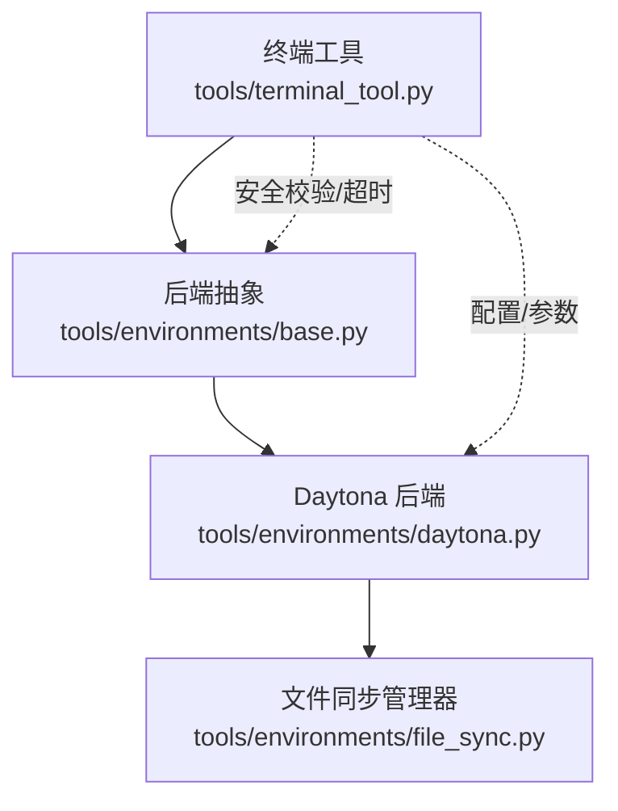
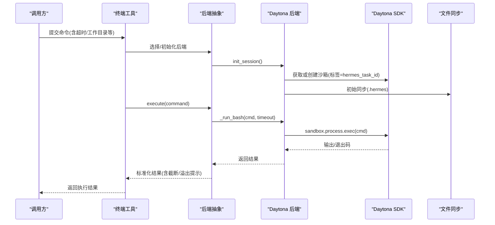
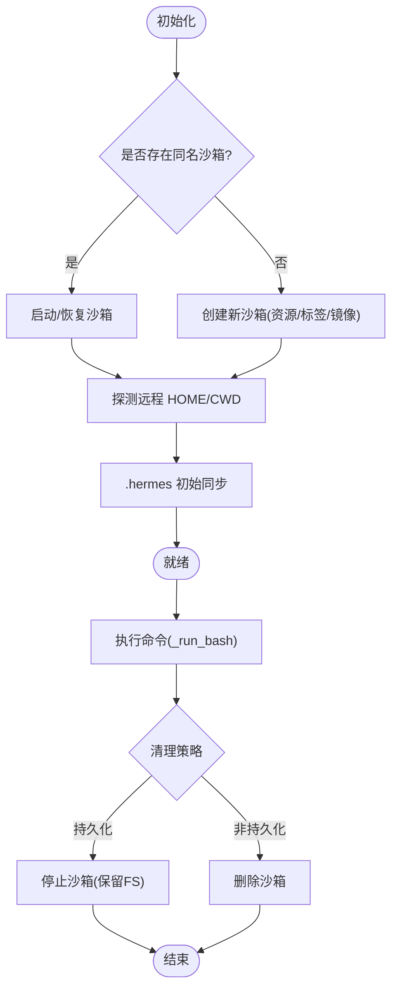
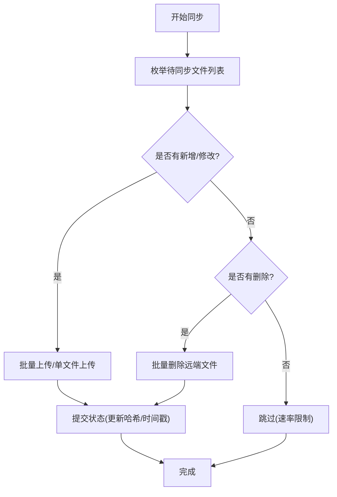
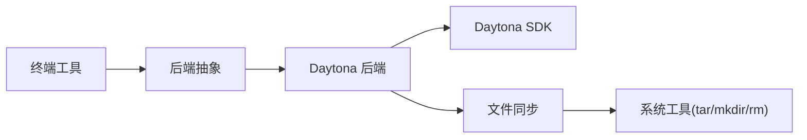

# Daytona 沙箱环境

<cite>
**本文引用的文件**
- [tools/terminal_tool.py](file://tools/terminal_tool.py)
- [tools/environments/daytona.py](file://tools/environments/daytona.py)
- [tools/environments/base.py](file://tools/environments/base.py)
- [tools/environments/file_sync.py](file://tools/environments/file_sync.py)
- [tests/tools/test_terminal_error_redaction.py](file://tests/tools/test_terminal_error_redaction.py)
</cite>

## 目录
1. [简介](#简介)
2. [项目结构](#项目结构)
3. [核心组件](#核心组件)
4. [架构总览](#架构总览)
5. [详细组件分析](#详细组件分析)
6. [依赖关系分析](#依赖关系分析)
7. [性能考虑](#性能考虑)
8. [故障诊断指南](#故障诊断指南)
9. [结论](#结论)
10. [附录：配置与部署要点](#附录配置与部署要点)

## 简介
本文件面向需要在 Hermes 中集成并运行 Daytona 云沙箱的工程师，系统性说明：
- 如何通过终端工具将命令执行路由到 Daytona 沙箱
- 沙箱实例的创建、恢复、停止与清理
- 资源隔离、工作目录与环境快照机制
- 沙箱间通信、数据共享与状态同步（基于 .hermes 目录的文件同步）
- 监控、日志与错误处理
- 扩缩容策略、成本优化与最佳实践
- 完整示例与部署注意事项

## 项目结构
围绕 Daytona 的关键代码位于 tools 目录下，采用“统一后端抽象 + 具体实现”的分层组织：
- 终端工具入口：tools/terminal_tool.py
- 后端抽象基类：tools/environments/base.py
- Daytona 后端实现：tools/environments/daytona.py
- 远程文件同步：tools/environments/file_sync.py
- 测试用例（含 Daytona 相关配置项）：tests/tools/test_terminal_error_redaction.py

**图示来源**
- [tools/terminal_tool.py:1-34](file://tools/terminal_tool.py#L1-L34)
- [tools/environments/base.py:553-619](file://tools/environments/base.py#L553-L619)
- [tools/environments/daytona.py:30-152](file://tools/environments/daytona.py#L30-L152)
- [tools/environments/file_sync.py:134-177](file://tools/environments/file_sync.py#L134-L177)

**章节来源**
- [tools/terminal_tool.py:1-34](file://tools/terminal_tool.py#L1-L34)
- [tools/environments/base.py:553-619](file://tools/environments/base.py#L553-L619)
- [tools/environments/daytona.py:30-152](file://tools/environments/daytona.py#L30-L152)
- [tools/environments/file_sync.py:134-177](file://tools/environments/file_sync.py#L134-L177)

## 核心组件
- 终端工具（Terminal Tool）
  - 负责选择执行后端（local/docker/modal/vercel_sandbox/daytona），统一封装命令执行、超时、中断、安全校验与结果输出。
  - 支持后台任务、自动清理、磁盘使用告警等。
- 后端抽象（BaseEnvironment）
  - 定义统一的 execute/init_session/_run_bash/cleanup 接口；提供会话快照、CWD 跟踪、中断与超时控制、输出收集与截断等通用能力。
- Daytona 后端（DaytonaEnvironment）
  - 通过 Daytona SDK 创建/恢复/停止/删除沙箱；按任务 ID 复用持久化沙箱；管理 CPU/内存/磁盘资源；维护 .hermes 目录的文件同步。
- 文件同步（FileSyncManager）
  - 基于 mtime+size 检测变更，批量上传/下载，删除远端多余文件；支持回滚、重试、锁与大小限制；在清理时把远端变化同步回主机。

**章节来源**
- [tools/terminal_tool.py:1-34](file://tools/terminal_tool.py#L1-L34)
- [tools/environments/base.py:553-619](file://tools/environments/base.py#L553-L619)
- [tools/environments/daytona.py:30-152](file://tools/environments/daytona.py#L30-L152)
- [tools/environments/file_sync.py:134-177](file://tools/environments/file_sync.py#L134-L177)

## 架构总览
Daytona 沙箱的执行路径如下：
- 调用方通过 terminal_tool 发起命令执行
- 根据配置选择后端为 Daytona
- BaseEnvironment 负责会话快照与 CWD 管理
- DaytonaEnvironment 负责沙箱生命周期与命令执行
- FileSyncManager 负责 .hermes 目录的双向同步

**图示来源**
- [tools/terminal_tool.py:1-34](file://tools/terminal_tool.py#L1-L34)
- [tools/environments/base.py:660-782](file://tools/environments/base.py#L660-L782)
- [tools/environments/daytona.py:89-152](file://tools/environments/daytona.py#L89-L152)
- [tools/environments/daytona.py:219-242](file://tools/environments/daytona.py#L219-L242)
- [tools/environments/file_sync.py:166-177](file://tools/environments/file_sync.py#L166-L177)

## 详细组件分析

### 终端工具与 Daytona 集成
- 环境变量与配置
  - TERMINAL_ENV 用于选择后端；当选择 daytona 时，会加载 Daytona 后端。
  - 测试用例展示了最小化配置包含 daytona_image 字段，表明可通过配置指定镜像。
- 执行流程
  - 命令进入 terminal_tool 后，解析配置并创建/复用对应后端实例。
  - 对 Daytona，每次执行前确保沙箱就绪并同步 .hermes 目录。
- 安全与健壮性
  - 危险命令审批、sudo 交互、输出脱敏、超时与中断处理均内置。

**章节来源**
- [tests/tools/test_terminal_error_redaction.py:13-24](file://tests/tools/test_terminal_error_redaction.py#L13-L24)
- [tools/terminal_tool.py:1-34](file://tools/terminal_tool.py#L1-L34)

### Daytona 后端：沙箱生命周期
- 创建与恢复
  - 优先尝试 resume 同名沙箱（名称 hermes-{task_id}，带标签 hermes_task_id）。
  - 若不存在则创建新沙箱，设置资源（CPU/内存/磁盘）与 auto_stop_interval。
  - 支持兼容旧版 list 分页方式以恢复历史沙箱。
- 资源隔离
  - 通过 SDK Resources 指定 CPU、内存、磁盘上限；磁盘超过平台限制会被裁剪并记录警告。
- 工作目录与环境
  - 自动探测远程 $HOME，并将默认 cwd 调整为远程 home 目录。
  - 通过 base 层的 init_session 捕获登录 shell 快照，后续命令 source 该快照，避免重复加载 profile。
- 执行与取消
  - 使用 bash -c/-l 包装命令，并通过 _ThreadedProcessHandle 适配阻塞 SDK 调用。
  - 取消时调用 sandbox.stop() 终止当前沙箱。
- 清理
  - 持久化模式：停止沙箱（保留文件系统）。
  - 非持久化模式：删除沙箱。
  - 清理前触发 sync_back，将远端 .hermes 变更回写主机。

**图示来源**
- [tools/environments/daytona.py:89-152](file://tools/environments/daytona.py#L89-L152)
- [tools/environments/daytona.py:206-242](file://tools/environments/daytona.py#L206-L242)
- [tools/environments/daytona.py:244-271](file://tools/environments/daytona.py#L244-L271)

**章节来源**
- [tools/environments/daytona.py:30-152](file://tools/environments/daytona.py#L30-L152)
- [tools/environments/daytona.py:206-271](file://tools/environments/daytona.py#L206-L271)

### 文件同步：数据共享与状态同步
- 同步范围
  - 凭证、技能与缓存文件统一映射到远端 /root/.hermes 或远端用户 home 下的 .hermes。
- 增量与事务
  - 基于 mtime+size 检测变更；批量上传/下载；删除远端多余文件。
  - 失败时回滚状态，保证下一次重试能重放全部操作。
- 速率限制与强制
  - 默认每 5 秒一次；可通过 HERMES_FORCE_FILE_SYNC=1 强制立即同步。
- 回写（sync_back）
  - 清理阶段将远端 .hermes 打包为 tar 下载，按 SHA-256 差异比对后覆盖回主机。
  - 受信号保护与文件锁串行化，防止并发冲突。
- 容量保护
  - 下载 tar 有最大体积限制，避免异常大文件导致 OOM/磁盘耗尽。

**图示来源**
- [tools/environments/file_sync.py:53-79](file://tools/environments/file_sync.py#L53-L79)
- [tools/environments/file_sync.py:166-250](file://tools/environments/file_sync.py#L166-L250)
- [tools/environments/file_sync.py:256-300](file://tools/environments/file_sync.py#L256-L300)

**章节来源**
- [tools/environments/file_sync.py:134-177](file://tools/environments/file_sync.py#L134-L177)
- [tools/environments/file_sync.py:256-300](file://tools/environments/file_sync.py#L256-L300)

### 会话快照与工作目录
- 会话快照
  - 首次执行前捕获登录 shell 的环境变量、函数、别名等，生成快照文件；后续命令直接 source 快照，提升启动速度。
  - 排除 per-session 桥接变量，避免跨会话泄漏。
- 工作目录
  - 通过内嵌标记在远端 stdout 中传递真实 CWD；本地通过临时文件保存。
  - 支持 Windows/Git-Bash 的路径转换与引用。

**章节来源**
- [tools/environments/base.py:660-782](file://tools/environments/base.py#L660-L782)

## 依赖关系分析
- 模块耦合
  - terminal_tool 依赖 base 抽象与具体后端；daytona 依赖 file_sync 与 Daytona SDK。
  - file_sync 依赖 credential/skill/cache 文件枚举与宿主路径映射。
- 外部依赖
  - Daytona SDK：用于沙箱创建/恢复/停止/删除、进程执行与文件传输。
  - 操作系统工具：tar、mkdir、rm 等用于文件同步与清理。
- 潜在循环与风险
  - 文件同步在清理阶段可能因网络/权限问题失败，已做重试与降级处理。
  - 快照构建失败会回退为非登录 shell，保障基本可用性。

**图示来源**
- [tools/terminal_tool.py:1-34](file://tools/terminal_tool.py#L1-L34)
- [tools/environments/base.py:553-619](file://tools/environments/base.py#L553-L619)
- [tools/environments/daytona.py:30-152](file://tools/environments/daytona.py#L30-L152)
- [tools/environments/file_sync.py:134-177](file://tools/environments/file_sync.py#L134-L177)

**章节来源**
- [tools/terminal_tool.py:1-34](file://tools/terminal_tool.py#L1-L34)
- [tools/environments/base.py:553-619](file://tools/environments/base.py#L553-L619)
- [tools/environments/daytona.py:30-152](file://tools/environments/daytona.py#L30-L152)
- [tools/environments/file_sync.py:134-177](file://tools/environments/file_sync.py#L134-L177)

## 性能考虑
- 冷启动与快照
  - 通过 init_session 一次性捕获 shell 环境，减少后续命令启动开销。
- 文件同步
  - 批量上传/下载显著降低 HTTP/TLS 开销；默认 5 秒节流避免频繁 IO。
  - 回写阶段对超大 tar 进行体积限制，防止极端情况拖垮系统。
- 资源限制
  - 磁盘超过平台限制会被裁剪并告警；建议按需配置 CPU/内存/磁盘。
- 输出缓冲
  - 基础层对长输出进行头尾窗口缓存，必要时落盘 spill，避免内存膨胀。

[本节为通用性能建议，不直接分析具体文件]

## 故障诊断指南
- 常见问题定位
  - 沙箱无法恢复：检查同名沙箱是否存在、标签是否匹配、SDK 版本兼容性。
  - 文件不同步：确认 .hermes 目录权限、网络连通性与 bulk 上传/下载回调是否可用。
  - 命令执行超时：调整 TERMINAL_MAX_FOREGROUND_TIMEOUT 或命令自身超时。
  - 磁盘告警：关注磁盘使用阈值，必要时清理无用文件或扩大配额。
- 日志与脱敏
  - 错误信息会自动脱敏，避免泄露敏感内容；可结合日志级别定位问题。
- 回滚与重试
  - 文件同步失败会回滚状态并等待下次周期重试；清理阶段的 sync_back 具备多次重试与指数退避。

**章节来源**
- [tools/environments/file_sync.py:256-300](file://tools/environments/file_sync.py#L256-L300)
- [tools/terminal_tool.py:118-133](file://tools/terminal_tool.py#L118-L133)
- [tests/tools/test_terminal_error_redaction.py:47-154](file://tests/tools/test_terminal_error_redaction.py#L47-L154)

## 结论
Daytona 后端在 Hermes 中提供了稳定、可恢复、可观测的云沙箱执行能力。通过统一的抽象层、完善的文件同步机制与健壮的错误处理，开发者可以专注于业务逻辑，而无需关心底层沙箱细节。合理配置资源、利用持久化与快照机制，并结合监控与日志，可获得高可用且成本可控的执行环境。

[本节为总结性内容，不直接分析具体文件]

## 附录：配置与部署要点
- 关键配置项
  - TERMINAL_ENV：选择 daytona 启用 Daytona 后端。
  - daytona_image：指定镜像（测试用例中可见该字段）。
  - 资源参数：CPU、内存、磁盘（由后端构造时传入，磁盘超限会被裁剪）。
  - 持久化：persistent_filesystem=True 时，清理阶段停止而非删除沙箱。
- 环境变量
  - HERMES_FORCE_FILE_SYNC：强制立即同步文件。
  - TERMINAL_MAX_FOREGROUND_TIMEOUT：前台命令最大超时。
  - DISK_USAGE_WARNING_THRESHOLD_GB：磁盘使用告警阈值。
- 最佳实践
  - 使用任务 ID 区分多租户/多会话，便于资源隔离与恢复。
  - 将需要跨会话共享的数据放入 .hermes 目录，借助文件同步保持一致性。
  - 合理设置超时与资源上限，避免资源浪费与雪崩。
  - 定期观察日志中的磁盘与同步告警，及时清理与扩容。

**章节来源**
- [tests/tools/test_terminal_error_redaction.py:13-24](file://tests/tools/test_terminal_error_redaction.py#L13-L24)
- [tools/environments/daytona.py:76-84](file://tools/environments/daytona.py#L76-L84)
- [tools/environments/file_sync.py:42-44](file://tools/environments/file_sync.py#L42-L44)
- [tools/terminal_tool.py:118-133](file://tools/terminal_tool.py#L118-L133)