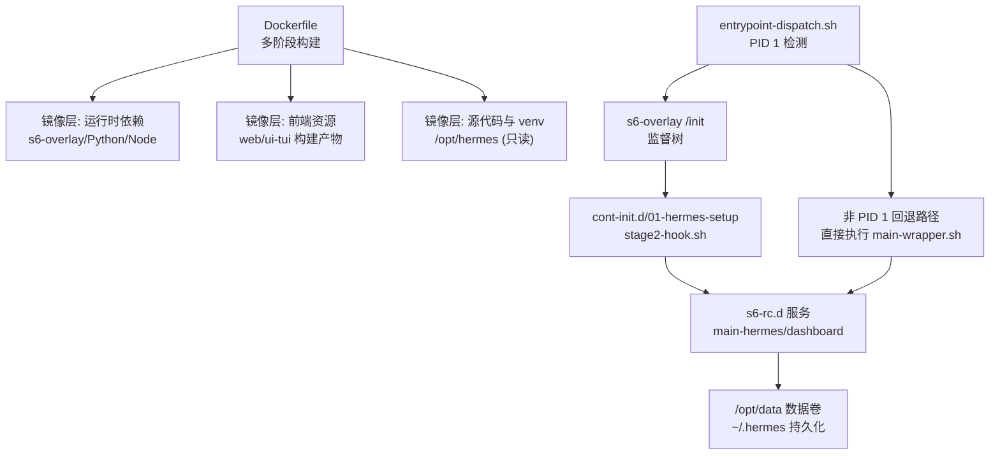
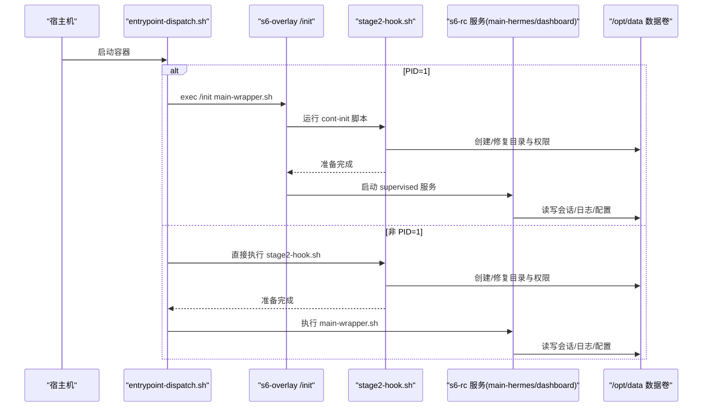
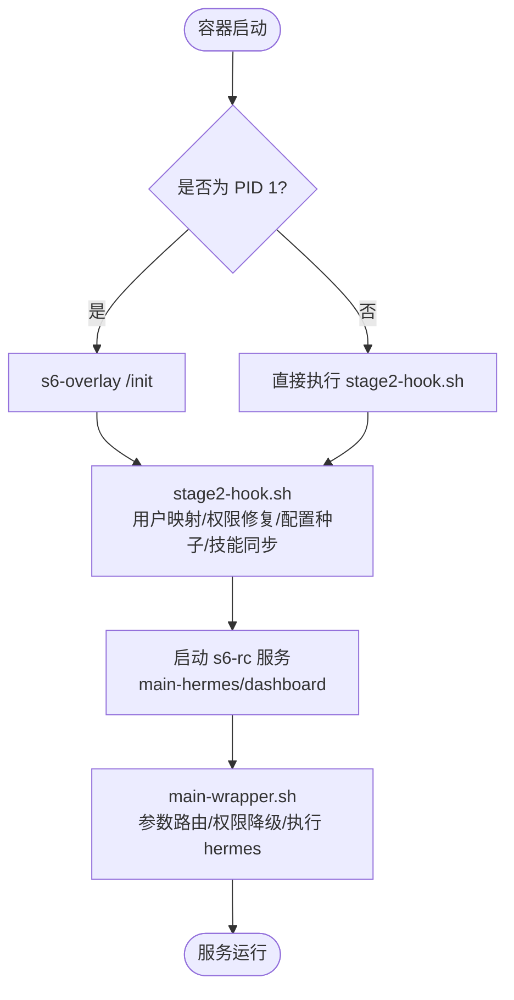
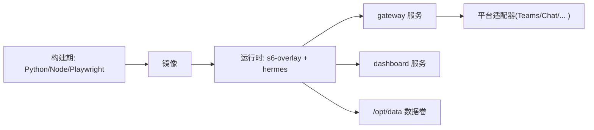

# Docker 容器环境

<cite>
**本文引用的文件**
- [Dockerfile](file://Dockerfile)
- [docker-compose.yml](file://docker-compose.yml)
- [docker-compose.windows.yml](file://docker-compose.windows.yml)
- [entrypoint-dispatch.sh](file://docker/entrypoint-dispatch.sh)
- [stage2-hook.sh](file://docker/stage2-hook.sh)
- [main-wrapper.sh](file://docker/main-wrapper.sh)
- [gateway_health.py](file://agent/monitoring/gateway_health.py)
- [cron_health.py](file://agent/monitoring/cron_health.py)
</cite>

## 目录
1. [简介](#简介)
2. [项目结构](#项目结构)
3. [核心组件](#核心组件)
4. [架构总览](#架构总览)
5. [详细组件分析](#详细组件分析)
6. [依赖关系分析](#依赖关系分析)
7. [性能考量](#性能考量)
8. [故障排查指南](#故障排查指南)
9. [结论](#结论)
10. [附录](#附录)

## 简介
本文件面向使用 Docker 部署 Hermes Agent 的运维与开发者，系统说明镜像构建策略、启动流程、数据持久化、网络暴露、服务间通信、监控与健康检查、以及编排与扩缩容的最佳实践。文档基于仓库中的 Dockerfile、Compose 配置与 s6-overlay 启动脚本，提供可操作的部署指引与排错建议。

## 项目结构
Hermes Agent 的容器化由以下关键部分组成：
- 镜像构建：通过多阶段构建安装 Python/Node 依赖、预编译前端资源、注入 s6-overlay 进程管理器，并固化只读代码层与可变数据卷分离。
- 启动流程：ENTRYPOINT 指向调度脚本，根据是否拥有 PID 1 选择 s6-overlay 监督模式或直启模式；随后执行初始化钩子（用户映射、权限修复、配置种子、技能同步等），再启动主程序。
- 数据与配置：所有可变状态位于 /opt/data（默认挂载到 ~/.hermes），代码与依赖位于只读的 /opt/hermes。
- 服务编排：提供 docker-compose.yml（Linux）与 docker-compose.windows.yml（Windows）两种编排示例，分别处理网络模式与端口映射差异。

图表来源
- [Dockerfile:52-458](file://Dockerfile#L52-L458)
- [entrypoint-dispatch.sh:1-26](file://docker/entrypoint-dispatch.sh#L1-L26)
- [stage2-hook.sh:1-592](file://docker/stage2-hook.sh#L1-L592)

章节来源
- [Dockerfile:52-458](file://Dockerfile#L52-L458)
- [docker-compose.yml:1-77](file://docker-compose.yml#L1-L77)
- [docker-compose.windows.yml:1-39](file://docker-compose.windows.yml#L1-L39)

## 核心组件
- 镜像构建与依赖管理
  - 固定基础镜像与工具链，预装 Python/Node/npm/uv，构建前端资源，安装 Playwright Chromium，并将可选后端依赖以“惰性安装”目标指向数据卷，保证代码层只读且可安全更新。
  - 引入 s6-overlay 作为进程监督器，替代 tini，提供更健壮的僵尸进程回收与服务生命周期管理。
- 启动与初始化
  - entrypoint-dispatch.sh 负责 PID 1 判断与分派；stage2-hook.sh 完成 UID/GID 重映射、数据卷权限修复、配置种子、技能同步、浏览器二进制发现等；main-wrapper.sh 负责参数路由、环境变量恢复与权限降级后执行 hermes 命令。
- 数据与配置
  - 所有可变状态在 /opt/data（默认绑定到 ~/.hermes），包括会话、日志、配置、凭据、计划、工作区等；代码与依赖在 /opt/hermes 只读。
- 编排与网络
  - Linux 使用 network_mode: host 直接暴露端口；Windows 使用显式端口映射；dashboard 默认仅监听本地回环，避免未认证暴露。

章节来源
- [Dockerfile:52-458](file://Dockerfile#L52-L458)
- [entrypoint-dispatch.sh:1-26](file://docker/entrypoint-dispatch.sh#L1-L26)
- [stage2-hook.sh:1-592](file://docker/stage2-hook.sh#L1-L592)
- [main-wrapper.sh:1-92](file://docker/main-wrapper.sh#L1-L92)
- [docker-compose.yml:1-77](file://docker-compose.yml#L1-L77)
- [docker-compose.windows.yml:1-39](file://docker-compose.windows.yml#L1-L39)

## 架构总览
下图展示了容器启动的关键路径与组件交互：入口调度 → s6-overlay 监督 → 初始化钩子 → 服务启动 → 数据卷挂载。

图表来源
- [entrypoint-dispatch.sh:1-26](file://docker/entrypoint-dispatch.sh#L1-L26)
- [stage2-hook.sh:1-592](file://docker/stage2-hook.sh#L1-L592)
- [main-wrapper.sh:1-92](file://docker/main-wrapper.sh#L1-L92)

## 详细组件分析

### 镜像构建与依赖策略
- 多阶段构建
  - 固定 SQLite 版本以规避已知漏洞；从上游 Node 镜像复制 Node/npm 二进制以保证工具链一致性；安装 s6-overlay 并校验完整性。
- 依赖分层缓存
  - 先拷贝 manifest（package.json、pyproject.toml、uv.lock）进行依赖解析与安装，再拷贝源码，最大化利用构建缓存。
- 前端资源预构建
  - 在镜像中构建 web 与 ui-tui 产物，避免运行时 npm install 带来的权限与竞态问题。
- 惰性安装隔离
  - 将可选后端 SDK 的安装目标重定向至 /opt/data/lazy-packages，追加到 sys.path 末尾，确保不会覆盖核心模块，同时保持代码层只读。

章节来源
- [Dockerfile:1-458](file://Dockerfile#L1-L458)

### 启动流程与权限模型
- PID 1 检测与分派
  - 若为 PID 1，则交由 s6-overlay /init 管理完整监督树；否则回退到直接执行初始化与主程序，保证在非 PID 1 平台仍可运行。
- 初始化钩子（stage2-hook.sh）
  - 拒绝不支持的 --user 方式启动，强制通过 HERMES_UID/HERMES_GID 或 PUID/PGID 进行用户映射。
  - 创建并修复 /opt/data 下各子目录与文件权限，确保 hermes 用户可写；自动识别并设置 Docker socket 组权限以便 dind 场景。
  - 首次启动时从镜像拷贝 .env/config.yaml/SOUL.md 等种子文件，执行配置迁移，必要时重新引导 Nous 会话。
  - 发现 Playwright 安装的 Chromium 二进制并导出给 agent-browser 使用。
- 主程序包装（main-wrapper.sh）
  - 恢复 with-contenv 环境变量，设置 HOME，激活 venv，按参数路由执行 hermes 或其子命令；对任意 --user 非 hermes 的情况给出明确错误提示。

图表来源
- [entrypoint-dispatch.sh:1-26](file://docker/entrypoint-dispatch.sh#L1-L26)
- [stage2-hook.sh:1-592](file://docker/stage2-hook.sh#L1-L592)
- [main-wrapper.sh:1-92](file://docker/main-wrapper.sh#L1-L92)

章节来源
- [entrypoint-dispatch.sh:1-26](file://docker/entrypoint-dispatch.sh#L1-L26)
- [stage2-hook.sh:1-592](file://docker/stage2-hook.sh#L1-L592)
- [main-wrapper.sh:1-92](file://docker/main-wrapper.sh#L1-L92)

### 网络配置与端口暴露
- Linux 编排
  - 使用 network_mode: host 直接复用宿主网络栈，无需额外端口映射。
- Windows 编排
  - 使用显式端口映射暴露 dashboard 到 127.0.0.1:9119，便于桌面端访问。
- 安全建议
  - dashboard 默认仅监听本地回环；如需远程访问，建议使用 SSH 隧道或反向代理并启用鉴权，避免直接暴露 0.0.0.0。

章节来源
- [docker-compose.yml:1-77](file://docker-compose.yml#L1-L77)
- [docker-compose.windows.yml:1-39](file://docker-compose.windows.yml#L1-L39)

### 卷挂载与数据持久化
- 数据卷
  - /opt/data 为唯一可变路径，默认绑定到 ~/.hermes，包含 sessions、logs、config.yaml、auth.json、plans、workspace、profiles 等。
- 权限修复
  - 启动时针对特定目录与文件进行 chown/chmod，确保 hermes 用户可读写；对 config.yaml 与 .env 进行最小权限限制。
- 惰性安装目标
  - 可选后端 SDK 安装到 /opt/data/lazy-packages，并通过环境变量重定向，避免破坏只读代码层。

章节来源
- [Dockerfile:378-422](file://Dockerfile#L378-L422)
- [stage2-hook.sh:174-396](file://docker/stage2-hook.sh#L174-L396)

### 容器间通信、服务发现与负载均衡
- 当前编排
  - gateway 与 dashboard 在同一 Compose 文件中，dashboard 依赖 gateway；Linux 使用 host 网络，Windows 使用端口映射。
- 服务发现
  - 由于使用 host 网络，服务间可通过 localhost 直接通信；如需跨主机或服务网格，可在上层编排（如 Kubernetes）中引入 Service/Ingress。
- 负载均衡
  - 单实例网关即可满足多数场景；高可用需结合外部负载均衡器或集群编排能力，对多个 gateway 实例进行流量分发与健康探测。

章节来源
- [docker-compose.yml:29-77](file://docker-compose.yml#L29-L77)
- [docker-compose.windows.yml:12-39](file://docker-compose.windows.yml#L12-L39)

### 监控、日志与健康检查
- 健康指标与事件
  - gateway 健康快照与平台状态变更事件，输出无内容敏感指标的度量与事件，便于接入 OTLP/日志系统。
- Cron 健康
  - 定时任务心跳、最近成功时间、积压次数、运行中任务数等指标，辅助评估调度健康度。
- 日志采集
  - 通过 s6-overlay 监督的服务日志可统一收集；建议将 /opt/data/logs 挂载到宿主机或日志聚合系统。
- 健康检查
  - 建议在编排层增加 HTTP 探针（如 dashboard 或网关健康端点），结合重启策略实现自愈。

章节来源
- [gateway_health.py:1-470](file://agent/monitoring/gateway_health.py#L1-L470)
- [cron_health.py:1-202](file://agent/monitoring/cron_health.py#L1-L202)

### 编排、扩缩容与故障恢复最佳实践
- 编排
  - 使用 docker compose 快速拉起 gateway 与 dashboard；生产环境建议配合 systemd 或容器编排平台管理生命周期。
- 扩缩容
  - 水平扩展多个 gateway 实例，配合外部负载均衡器与共享存储（如 NFS/云盘）实现会话与配置共享；注意幂等初始化与锁机制。
- 故障恢复
  - 利用 s6-overlay 监督服务重启；通过健康检查触发重启；对失败平台进行告警与自动重试；定期备份 /opt/data。

[本节为通用实践建议，不直接引用具体文件]

## 依赖关系分析
- 构建期依赖
  - Python 包通过 uv 安装，Node 依赖通过 npm 安装；Playwright Chromium 预装于镜像。
- 运行期依赖
  - s6-overlay 提供进程监督；hermes 主程序通过 main-wrapper.sh 启动；dashboard 依赖 gateway 运行。
- 外部集成
  - 支持 Teams、Google Chat 等平台网关，通过环境变量与密钥注入；可选后端 SDK 按需惰性安装。

图表来源
- [Dockerfile:171-277](file://Dockerfile#L171-L277)
- [docker-compose.yml:29-77](file://docker-compose.yml#L29-L77)

章节来源
- [Dockerfile:171-277](file://Dockerfile#L171-L277)
- [docker-compose.yml:29-77](file://docker-compose.yml#L29-L77)

## 性能考量
- 构建缓存优化
  - 依赖安装与源码拷贝分层，减少冷构建时间；前端资源独立构建，避免 Python 变更导致前端重建。
- 只读代码层
  - /opt/hermes 只读，防止运行时修改破坏依赖；惰性安装目标指向数据卷，避免重复下载与权限问题。
- 进程监督
  - s6-overlay 非阻塞回收僵尸进程，提升稳定性；服务级重启策略保障自愈。
- I/O 优化
  - 将频繁写入的日志与会话置于高性能存储；避免在镜像层写入可变数据。

[本节为通用性能建议，不直接引用具体文件]

## 故障排查指南
- 启动报错：非 PID 1 警告
  - 当容器未被授予 PID 1 时，会跳过 s6-overlay 监督并回退执行；确认编排是否包裹了自定义 init。
- 权限错误：EACCES
  - 检查是否使用了不支持的 --user 方式；应通过 HERMES_UID/HERMES_GID 或 PUID/PGID 进行用户映射；确认 /opt/data 已正确挂载。
- Docker socket 访问失败
  - 确认已挂载 /var/run/docker.sock 或 /run/docker.sock；初始化钩子会自动添加 hermes 到对应组。
- 浏览器工具不可用
  - 确认 Playwright 已安装 Chromium；初始化钩子会尝试发现二进制并导出环境变量。
- 配置未生效
  - 检查 /opt/data/config.yaml 与 .env 权限；首次启动会从镜像种子文件拷贝；必要时手动修正权限。

章节来源
- [entrypoint-dispatch.sh:15-26](file://docker/entrypoint-dispatch.sh#L15-L26)
- [stage2-hook.sh:26-74](file://docker/stage2-hook.sh#L26-L74)
- [stage2-hook.sh:118-172](file://docker/stage2-hook.sh#L118-L172)
- [stage2-hook.sh:543-589](file://docker/stage2-hook.sh#L543-L589)
- [main-wrapper.sh:33-59](file://docker/main-wrapper.sh#L33-L59)

## 结论
Hermes Agent 的容器化方案以 s6-overlay 为核心，实现了健壮的服务监督与生命周期管理；通过只读代码层与可变数据卷分离，保障了可维护性与安全性；提供 Linux 与 Windows 两套编排示例，适配不同运行环境；内置健康指标与事件输出，便于接入监控体系。遵循本文档的网络、卷与权限配置建议，可实现稳定可靠的部署与运维。

[本节为总结性内容，不直接引用具体文件]

## 附录

### Docker Compose 配置示例
- Linux（host 网络）
  - 使用 network_mode: host，将 ~/.hermes 挂载到 /opt/data，设置 HERMES_UID/HERMES_GID。
- Windows（端口映射）
  - 使用显式端口映射暴露 dashboard 到 127.0.0.1:9119，设置 HERMES_UID/HERMES_GID。

章节来源
- [docker-compose.yml:1-77](file://docker-compose.yml#L1-L77)
- [docker-compose.windows.yml:1-39](file://docker-compose.windows.yml#L1-L39)

### 部署脚本要点
- 首次启动
  - 确保 ~/.hermes 存在并可写；设置 HERMES_UID/HERMES_GID；启动 compose 服务。
- 更新镜像
  - 拉取新镜像后重启服务；数据卷保持不变，配置迁移会在启动时执行。
- 健康检查
  - 在编排层增加 HTTP 探针；结合 restart: unless-stopped 实现自愈。

[本节为通用部署建议，不直接引用具体文件]