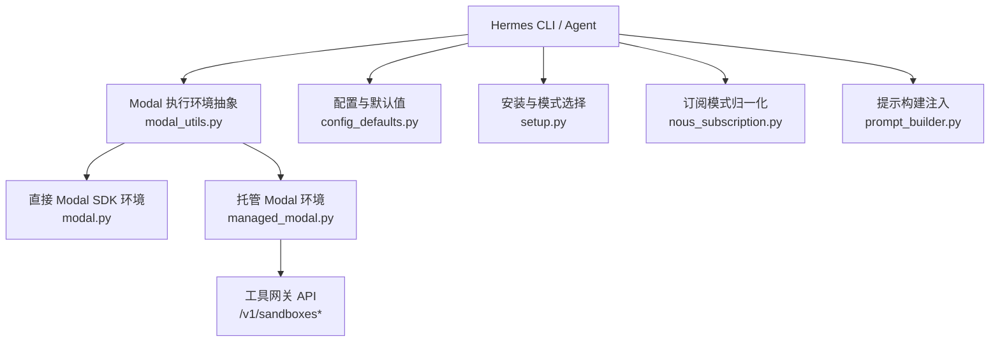
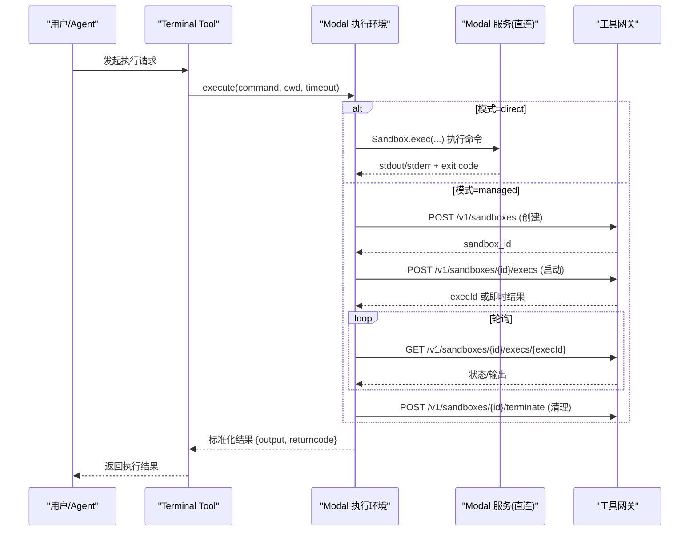
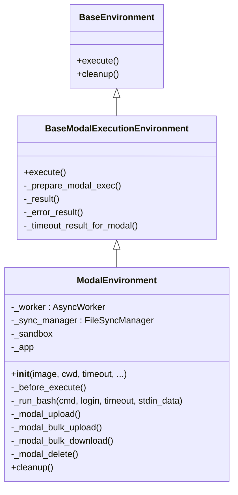
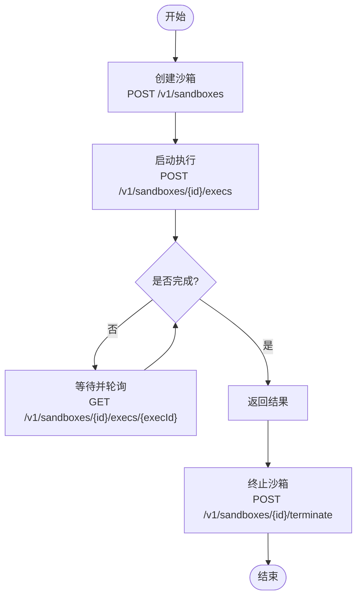
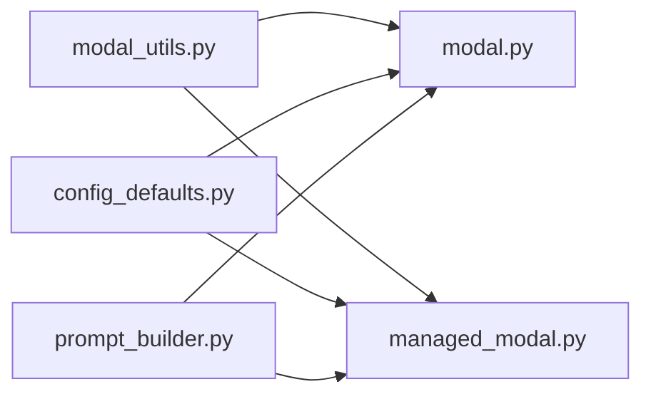

# Modal 云端环境

<cite>
**本文引用的文件**
- [tools/environments/modal.py](file://tools/environments/modal.py)
- [tools/environments/managed_modal.py](file://tools/environments/managed_modal.py)
- [tools/environments/modal_utils.py](file://tools/environments/modal_utils.py)
- [hermes_cli/config_defaults.py](file://hermes_cli/config_defaults.py)
- [hermes_cli/setup.py](file://hermes_cli/setup.py)
- [hermes_cli/nous_subscription.py](file://hermes_cli/nous_subscription.py)
- [agent/prompt_builder.py](file://agent/prompt_builder.py)
- [tests/integration/test_modal_terminal.py](file://tests/integration/test_modal_terminal.py)
- [optional-skills/mlops/modal/SKILL.md](file://optional-skills/mlops/modal/SKILL.md)
</cite>

## 目录
1. [简介](#简介)
2. [项目结构](#项目结构)
3. [核心组件](#核心组件)
4. [架构总览](#架构总览)
5. [详细组件分析](#详细组件分析)
6. [依赖关系分析](#依赖关系分析)
7. [性能与扩缩容](#性能与扩缩容)
8. [故障排查指南](#故障排查指南)
9. [结论](#结论)
10. [附录：部署流程与最佳实践](#附录：部署流程与最佳实践)

## 简介
本文件面向在 Hermes 中集成并运行 Modal 云端执行环境的开发者与运维人员，系统说明两种 Modal 接入方式（直接 SDK 模式与管理网关托管模式）、命令执行流程、资源与存储管理、调试与监控、版本管理与灰度回滚策略，以及成本优化与错误处理配置。文档同时提供端到端示例与部署步骤，帮助快速落地生产级 Modal 工作负载。

## 项目结构
与 Modal 相关的代码主要分布在以下位置：
- 直接 Modal SDK 执行环境：tools/environments/modal.py
- 托管式 Modal 执行环境（通过工具网关）：tools/environments/managed_modal.py
- Modal 通用执行流与数据模型：tools/environments/modal_utils.py
- 终端与环境配置默认值：hermes_cli/config_defaults.py
- 安装与模式选择引导：hermes_cli/setup.py
- 订阅与模式归一化：hermes_cli/nous_subscription.py
- 提示构建中的 Modal 图像与模式注入：agent/prompt_builder.py
- 集成测试与 .modal.toml 校验：tests/integration/test_modal_terminal.py
- Modal 使用指南与 GPU 配置参考：optional-skills/mlops/modal/SKILL.md

图表来源
- [tools/environments/modal_utils.py:58-211](file://tools/environments/modal_utils.py#L58-L211)
- [tools/environments/modal.py:164-479](file://tools/environments/modal.py#L164-L479)
- [tools/environments/managed_modal.py:36-283](file://tools/environments/managed_modal.py#L36-L283)
- [hermes_cli/config_defaults.py:279-396](file://hermes_cli/config_defaults.py#L279-L396)
- [hermes_cli/setup.py:1439-1494](file://hermes_cli/setup.py#L1439-L1494)
- [hermes_cli/nous_subscription.py:410-632](file://hermes_cli/nous_subscription.py#L410-L632)
- [agent/prompt_builder.py:1075-1098](file://agent/prompt_builder.py#L1075-L1098)

章节来源
- [tools/environments/modal_utils.py:58-211](file://tools/environments/modal_utils.py#L58-L211)
- [tools/environments/modal.py:164-479](file://tools/environments/modal.py#L164-L479)
- [tools/environments/managed_modal.py:36-283](file://tools/environments/managed_modal.py#L36-L283)
- [hermes_cli/config_defaults.py:279-396](file://hermes_cli/config_defaults.py#L279-L396)
- [hermes_cli/setup.py:1439-1494](file://hermes_cli/setup.py#L1439-L1494)
- [hermes_cli/nous_subscription.py:410-632](file://hermes_cli/nous_subscription.py#L410-L632)
- [agent/prompt_builder.py:1075-1098](file://agent/prompt_builder.py#L1075-L1098)

## 核心组件
- Modal 执行基类与数据模型
  - BaseModalExecutionEnvironment：统一 execute 流程、超时控制、中断处理、结果封装。
  - PreparedModalExec / ModalExecStart：标准化命令参数与启动响应。
- 直接 Modal SDK 环境
  - ModalEnvironment：基于 modal.Sandbox.create/exec 的云端沙箱，支持快照持久化、文件同步、批量上传下载、异步事件循环隔离。
- 托管 Modal 环境
  - ManagedModalEnvironment：通过工具网关创建和管理沙箱，调用 /v1/sandboxes 系列接口执行命令、轮询状态、终止清理。
- 配置与模式
  - terminal.modal_mode：auto/managed/direct，决定运行时选择哪种后端。
  - terminal.modal_image：容器镜像，支持本地镜像 ID 或远程镜像名。
  - container_*：CPU/内存/磁盘等容器资源限制。

章节来源
- [tools/environments/modal_utils.py:27-211](file://tools/environments/modal_utils.py#L27-L211)
- [tools/environments/modal.py:164-479](file://tools/environments/modal.py#L164-L479)
- [tools/environments/managed_modal.py:36-283](file://tools/environments/managed_modal.py#L36-L283)
- [hermes_cli/config_defaults.py:279-396](file://hermes_cli/config_defaults.py#L279-L396)

## 架构总览
Hermes 在执行终端或代码执行任务时，根据配置选择 Modal 后端：
- direct：直接使用 Modal SDK 创建 Sandbox 并执行命令，支持文件系统快照与文件同步。
- managed：通过工具网关的 REST API 创建/管理沙箱，适合集中管控与凭据治理。

图表来源
- [tools/environments/modal.py:164-479](file://tools/environments/modal.py#L164-L479)
- [tools/environments/managed_modal.py:72-212](file://tools/environments/managed_modal.py#L72-L212)
- [tools/environments/modal_utils.py:75-156](file://tools/environments/modal_utils.py#L75-L156)

## 详细组件分析

### 直接 Modal SDK 环境（ModalEnvironment）
- 生命周期
  - 初始化：解析镜像、恢复快照、创建 Sandbox、挂载凭据/技能/缓存文件、初始化文件同步器。
  - 执行：通过 _run_bash 包装为线程安全异步执行，支持 stdin/stdout/stderr 读取与退出码。
  - 清理：可选快照文件系统、终止 Sandbox、停止异步工作线程。
- 关键能力
  - 快照持久化：按 task_id 命名空间保存/恢复镜像快照，提升冷启动速度。
  - 文件同步：增量上传/下载 /root/.hermes，避免重复传输。
  - 大文件传输：base64 + tar.gz 管道，规避 SDK 参数长度限制。
  - 异步隔离：独立事件循环线程，避免阻塞主进程。

图表来源
- [tools/environments/modal_utils.py:58-211](file://tools/environments/modal_utils.py#L58-L211)
- [tools/environments/modal.py:164-479](file://tools/environments/modal.py#L164-L479)

章节来源
- [tools/environments/modal.py:164-479](file://tools/environments/modal.py#L164-L479)

### 托管 Modal 环境（ManagedModalEnvironment）
- 生命周期
  - 初始化：从工具网关解析 origin 与 token，创建沙箱（可设置 CPU/内存/磁盘/超时/逻辑键）。
  - 执行：POST /v1/sandboxes/{id}/execs 启动命令，GET 轮询状态直至完成/失败/取消/超时。
  - 清理：POST /v1/sandboxes/{id}/terminate 并可选择先快照。
- 安全与约束
  - 禁止宿主凭据文件透传；如需凭据进入沙箱，请使用 direct 模式或通过其他方式注入。
  - 所有网络请求均携带 Authorization 头，超时与错误信息规范化。

图表来源
- [tools/environments/managed_modal.py:172-212](file://tools/environments/managed_modal.py#L172-L212)
- [tools/environments/managed_modal.py:72-152](file://tools/environments/managed_modal.py#L72-L152)
- [tools/environments/managed_modal.py:154-170](file://tools/environments/managed_modal.py#L154-L170)

章节来源
- [tools/environments/managed_modal.py:36-283](file://tools/environments/managed_modal.py#L36-L283)

### 配置与模式选择
- terminal.modal_mode
  - auto：自动选择（通常优先 managed，若不可用则 fallback）。
  - managed：通过工具网关托管。
  - direct：直接 SDK 模式。
- terminal.modal_image
  - 支持镜像名或 Modal 镜像 ID（im-...），Direct 模式会尝试 add_python 兼容 ubuntu/debian 基础镜像。
- 容器资源限制
  - container_cpu/container_memory/container_disk：对 Docker/Singularity/Modal/Daytona/Vercel 生效。
- 环境变量映射
  - TERMINAL_MODAL_MODE / TERMINAL_MODAL_IMAGE 可覆盖默认值。

章节来源
- [hermes_cli/config_defaults.py:279-396](file://hermes_cli/config_defaults.py#L279-L396)
- [hermes_cli/setup.py:1439-1494](file://hermes_cli/setup.py#L1439-L1494)
- [hermes_cli/nous_subscription.py:410-632](file://hermes_cli/nous_subscription.py#L410-L632)
- [agent/prompt_builder.py:1075-1098](file://agent/prompt_builder.py#L1075-L1098)

## 依赖关系分析
- 模块耦合
  - modal_utils 提供统一执行流，被 direct 与 managed 实现复用。
  - modal.py 依赖 Modal SDK 与文件同步模块，负责快照与 IO。
  - managed_modal.py 依赖工具网关，负责远端沙箱生命周期。
  - 配置层将 modal_mode 与 modal_image 注入到执行上下文。
- 外部依赖
  - Modal SDK（direct 模式）
  - 工具网关 REST API（managed 模式）
  - 文件系统与 tar/base64 管道（大文件传输）

图表来源
- [tools/environments/modal_utils.py:58-211](file://tools/environments/modal_utils.py#L58-L211)
- [tools/environments/modal.py:164-479](file://tools/environments/modal.py#L164-L479)
- [tools/environments/managed_modal.py:36-283](file://tools/environments/managed_modal.py#L36-L283)
- [hermes_cli/config_defaults.py:279-396](file://hermes_cli/config_defaults.py#L279-L396)
- [agent/prompt_builder.py:1075-1098](file://agent/prompt_builder.py#L1075-L1098)

章节来源
- [tools/environments/modal_utils.py:58-211](file://tools/environments/modal_utils.py#L58-L211)
- [tools/environments/modal.py:164-479](file://tools/environments/modal.py#L164-L479)
- [tools/environments/managed_modal.py:36-283](file://tools/environments/managed_modal.py#L36-L283)
- [hermes_cli/config_defaults.py:279-396](file://hermes_cli/config_defaults.py#L279-L396)
- [agent/prompt_builder.py:1075-1098](file://agent/prompt_builder.py#L1075-L1098)

## 性能与扩缩容
- 冷启动优化
  - Direct 模式：启用文件系统快照，下次以快照镜像启动，显著降低冷启动时间。
  - Managed 模式：通过 idleTimeoutMs 与逻辑键复用沙箱，减少频繁创建开销。
- 并发与批处理
  - Direct 模式：每个命令一个 Sandbox 执行；可通过并行任务调度提高吞吐。
  - 参考 Modal 官方文档进行函数级并发与动态批处理（见 SKILL.md）。
- 资源限制
  - container_cpu/container_memory/container_disk：全局上限，避免资源争用。
  - Managed 模式：创建沙箱时可指定 cpu/memoryMiB/diskMiB，按需分配。
- GPU 分配
  - 通过 Modal 镜像与函数装饰器声明 GPU（如 A100/H100/B200），具体规格与用法参见 SKILL.md。
- 成本优化建议
  - 合理设置 scaledown_window/min_containers，平衡冷启动与常驻成本。
  - 使用 Volume 缓存模型权重，避免重复下载。
  - 利用重试与超时策略，减少无效计算。

章节来源
- [tools/environments/modal.py:194-293](file://tools/environments/modal.py#L194-L293)
- [tools/environments/managed_modal.py:172-212](file://tools/environments/managed_modal.py#L172-L212)
- [optional-skills/mlops/modal/SKILL.md:116-319](file://optional-skills/mlops/modal/SKILL.md#L116-L319)

## 故障排查指南
- 常见错误与定位
  - 凭据透传限制：Managed 模式禁止宿主凭据文件挂载，需切换 direct 或使用其他注入方式。
  - 网关连接失败：检查 x-idempotency-key、Authorization 头与超时配置。
  - 快照恢复失败：回退至基础镜像重建，记录日志并清理失效快照。
  - 大文件传输失败：确认 base64/tar 管道与写入分块大小。
- 诊断步骤
  - 查看 Modal 日志与网关响应体，提取 error/message/code。
  - 验证 .modal.toml 是否存在与正确配置（集成测试路径）。
  - 调整超时与重试参数，观察是否缓解。
- 安全与脱敏
  - 终端输出与错误信息会自动脱敏敏感字段，避免泄露密钥。

章节来源
- [tools/environments/managed_modal.py:214-227](file://tools/environments/managed_modal.py#L214-L227)
- [tools/environments/managed_modal.py:268-283](file://tools/environments/managed_modal.py#L268-L283)
- [tests/integration/test_modal_terminal.py:70-74](file://tests/integration/test_modal_terminal.py#L70-L74)

## 结论
本项目提供了两套 Modal 执行方案：直接 SDK 模式适合需要强控制与快照能力的场景；托管模式适合集中治理与凭据安全。通过统一的执行流、完善的错误处理与资源限制，可在保证稳定性的同时获得弹性扩展与成本可控的云端执行能力。结合 SKILL.md 的 GPU 与性能优化指南，可高效构建 ML 推理与训练工作负载。

## 附录：部署流程与最佳实践
- 开发模式
  - 本地调试：使用 local 或 docker 后端先行验证命令与脚本。
  - 切换到 Modal：设置 terminal.modal_mode=direct 或 managed，配置 terminal.modal_image。
- 部署流程
  - 准备镜像：确保包含必要依赖与 CUDA 驱动（GPU 场景）。
  - 配置凭据：Direct 模式可挂载凭据；Managed 模式通过网关注入。
  - 发布与版本：使用 Modal 镜像 ID 或版本号，配合快照机制快速回滚。
  - 灰度与回滚：先以小流量任务验证新镜像，再逐步放量；必要时切回旧快照。
- 监控与调优
  - 关注冷启动时间与内存占用，调整 scaledown_window 与 min_containers。
  - 使用 Volume 缓存模型，减少重复加载。
  - 设置合理的 timeout 与重试次数，避免长尾任务拖垮队列。

章节来源
- [hermes_cli/setup.py:1439-1494](file://hermes_cli/setup.py#L1439-L1494)
- [hermes_cli/config_defaults.py:279-396](file://hermes_cli/config_defaults.py#L279-L396)
- [optional-skills/mlops/modal/SKILL.md:256-319](file://optional-skills/mlops/modal/SKILL.md#L256-L319)
- [tools/environments/modal.py:194-293](file://tools/environments/modal.py#L194-L293)
- [tools/environments/managed_modal.py:172-212](file://tools/environments/managed_modal.py#L172-L212)