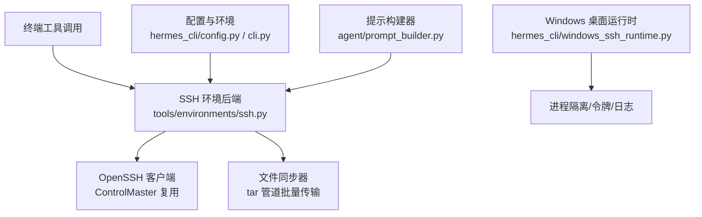
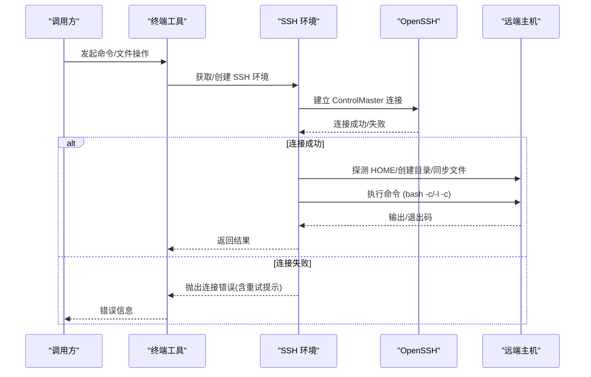
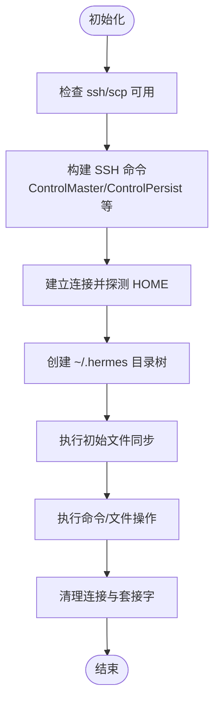
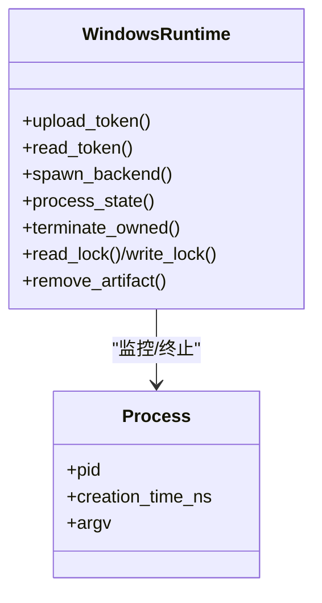
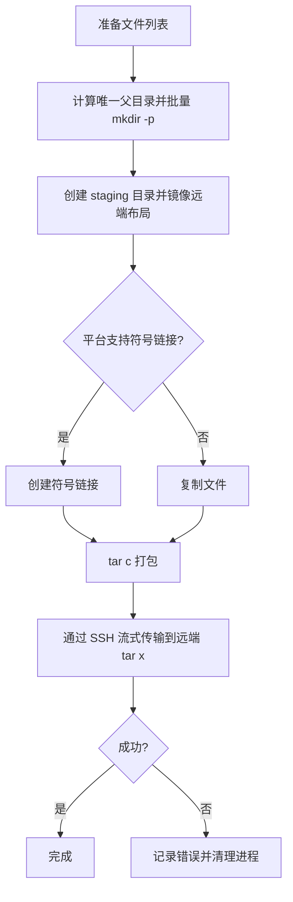
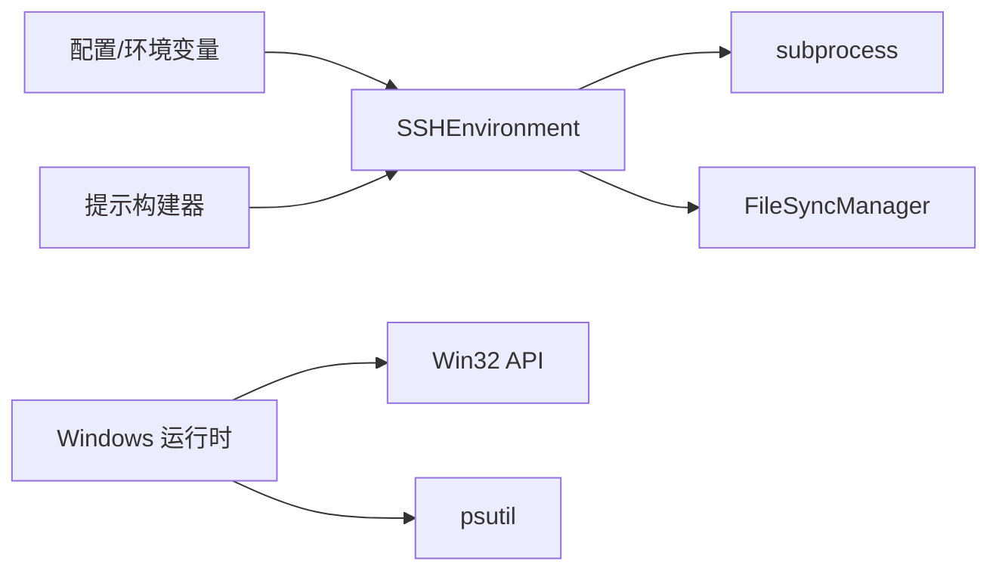

# SSH 远程环境

<cite>
**本文引用的文件**
- [tools/environments/ssh.py](file://tools/environments/ssh.py)
- [hermes_cli/windows_ssh_runtime.py](file://hermes_cli/windows_ssh_runtime.py)
- [tests/tools/test_ssh_environment.py](file://tests/tools/test_ssh_environment.py)
- [tests/tools/test_ssh_bulk_upload.py](file://tests/tools/test_ssh_bulk_upload.py)
- [agent/prompt_builder.py](file://agent/prompt_builder.py)
- [hermes_cli/config.py](file://hermes_cli/config.py)
- [hermes_cli/auth.py](file://hermes_cli/auth.py)
- [cli.py](file://cli.py)
</cite>

## 目录
1. [简介](#简介)
2. [项目结构](#项目结构)
3. [核心组件](#核心组件)
4. [架构总览](#架构总览)
5. [详细组件分析](#详细组件分析)
6. [依赖关系分析](#依赖关系分析)
7. [性能考虑](#性能考虑)
8. [故障排查指南](#故障排查指南)
9. [结论](#结论)
10. [附录](#附录)

## 简介
本文件面向在 Hermes Agent 中通过 SSH 进行远程命令执行、文件传输与会话管理的实现，覆盖连接建立、认证与安全配置、多主机管理、连接复用与超时重连、批量文件传输、Windows 桌面端安全隔离等主题。文档同时给出可操作的配置项、最佳实践与常见问题解决方案，帮助你在生产环境中稳定、安全地使用 SSH 远程执行能力。

## 项目结构
SSH 远程执行由以下关键部分构成：
- SSH 环境后端：基于 OpenSSH 的 ControlMaster 持久化连接，提供命令执行与文件同步。
- Windows 桌面端运行时：负责本地进程隔离、令牌与日志的安全读写、以及受控的后端生命周期管理。
- 配置与环境注入：通过环境变量与 CLI 配置将 SSH 目标、端口、密钥、持久化策略等传入后端。
- 测试与验证：覆盖控制套接字路径限制、批量上传管道、持久会话状态保持等关键行为。

图表来源
- [tools/environments/ssh.py:40-103](file://tools/environments/ssh.py#L40-L103)
- [hermes_cli/windows_ssh_runtime.py:388-436](file://hermes_cli/windows_ssh_runtime.py#L388-L436)
- [agent/prompt_builder.py:1080-1119](file://agent/prompt_builder.py#L1080-L1119)

章节来源
- [tools/environments/ssh.py:1-427](file://tools/environments/ssh.py#L1-L427)
- [hermes_cli/windows_ssh_runtime.py:1-509](file://hermes_cli/windows_ssh_runtime.py#L1-L509)
- [agent/prompt_builder.py:1080-1119](file://agent/prompt_builder.py#L1080-L1119)
- [hermes_cli/config.py:3196-3199](file://hermes_cli/config.py#L3196-L3199)
- [cli.py:673-676](file://cli.py#L673-L676)

## 核心组件
- SSHEnvironment（SSH 远程执行环境）
  - 使用 OpenSSH 的 ControlMaster/ControlPersist 建立并复用长连接，降低握手开销。
  - 通过 scp/tar 管道完成单文件与批量文件传输，支持上传、下载与删除。
  - 自动探测远端 HOME 并初始化 ~/.hermes 目录树，配合 FileSyncManager 做增量同步。
  - 提供 _run_bash 以登录或非登录模式执行命令，支持超时与标准输入数据。
- Windows 桌面端运行时
  - 在 Windows 上创建受限目录与令牌文件，确保只有当前用户与系统 SID 可访问。
  - 启动隔离的 hermes_cli 子进程，绑定到 127.0.0.1，并通过命令行参数传递会话令牌与所有者标识。
  - 提供锁文件、日志读取、进程状态检查与终止受管进程的能力。
- 配置与环境注入
  - 通过 TERMINAL_* 环境变量与配置文件注入 SSH 目标、端口、密钥、是否持久化等。
  - 提示构建器在远程环境下会探测并报告远端 OS、用户、HOME、CWD 等信息。

章节来源
- [tools/environments/ssh.py:40-103](file://tools/environments/ssh.py#L40-L103)
- [tools/environments/ssh.py:176-384](file://tools/environments/ssh.py#L176-L384)
- [hermes_cli/windows_ssh_runtime.py:179-223](file://hermes_cli/windows_ssh_runtime.py#L179-L223)
- [hermes_cli/windows_ssh_runtime.py:388-436](file://hermes_cli/windows_ssh_runtime.py#L388-L436)
- [agent/prompt_builder.py:1080-1119](file://agent/prompt_builder.py#L1080-L1119)
- [hermes_cli/config.py:3196-3199](file://hermes_cli/config.py#L3196-L3199)
- [cli.py:673-676](file://cli.py#L673-L676)

## 架构总览
SSH 远程执行的端到端流程如下：
- 上层终端工具根据配置选择 SSH 环境。
- 初始化时检测 OpenSSH 可用性，建立 ControlMaster 连接，探测远端 HOME，创建 ~/.hermes 目录树并执行初始同步。
- 每次执行前触发文件同步；执行命令通过 ssh bash -c 或 bash -l -c 运行。
- 批量文件传输采用 tar 管道，避免多次 scp 往返。
- Windows 桌面端通过独立运行时进程管理令牌、日志与进程生命周期，保证安全边界。

图表来源
- [tools/environments/ssh.py:28-133](file://tools/environments/ssh.py#L28-L133)
- [tools/environments/ssh.py:394-405](file://tools/environments/ssh.py#L394-L405)

章节来源
- [tools/environments/ssh.py:28-133](file://tools/environments/ssh.py#L28-L133)
- [tools/environments/ssh.py:394-405](file://tools/environments/ssh.py#L394-L405)

## 详细组件分析

### SSH 环境后端（SSHEnvironment）
- 连接建立与控制套接字
  - 使用 ControlMaster=auto、ControlPersist=300、BatchMode=yes、StrictHostKeyChecking=accept-new、ConnectTimeout=10 等选项建立快速、批处理友好的连接。
  - 控制套接字路径基于 user@host:port 的哈希值生成，避免 macOS 下 Unix Domain Socket 路径长度限制问题，并确保跨实例复用。
- 认证与安全
  - 支持通过 -i 指定私钥路径；默认启用 BatchMode 与 StrictHostKeyChecking=accept-new，首次连接接受新主机密钥。
  - 连接失败或超时会抛出带重试提示的连接异常，便于上层重试与告警。
- 文件传输
  - 单文件上传走 scp，批量上传走 tar 管道（本地 tar c 经 SSH 流式传输到远端 tar x），显著减少往返次数。
  - 批量上传前先批量 mkdir -p 创建父目录；下载通过 tar cf - 打包远端 .hermes 目录。
  - 删除操作通过一次性 rm 命令批量清理。
- 会话与状态
  - 支持登录与非登录模式执行命令；可通过环境变量控制是否持久化会话。
  - 初始化阶段创建 ~/.hermes/skills、credentials、cache 等目录，并执行一次全量同步。
- 清理
  - 清理时尝试通过 ControlPath 关闭 ControlMaster 连接并移除套接字文件。

图表来源
- [tools/environments/ssh.py:28-103](file://tools/environments/ssh.py#L28-L103)
- [tools/environments/ssh.py:160-173](file://tools/environments/ssh.py#L160-L173)
- [tools/environments/ssh.py:406-427](file://tools/environments/ssh.py#L406-L427)

章节来源
- [tools/environments/ssh.py:28-103](file://tools/environments/ssh.py#L28-L103)
- [tools/environments/ssh.py:160-173](file://tools/environments/ssh.py#L160-L173)
- [tools/environments/ssh.py:176-384](file://tools/environments/ssh.py#L176-L384)
- [tools/environments/ssh.py:394-427](file://tools/environments/ssh.py#L394-L427)

### Windows 桌面端 SSH 运行时
- 安全边界
  - 为每个所有权 ID 创建隔离目录，写入只读/可写令牌与日志文件，校验 DACL 与所有者 SID，拒绝重解析点与越权路径。
- 进程管理
  - 解析 venv 解释器并直接以 base interpreter 启动 hermes_cli.main，注入 sys.path，避免 PYTHONPATH 污染子进程。
  - 启动参数包含 --isolated、--host 127.0.0.1、--port 0、--ssh-session-token-file、--ssh-owner-nonce，确保仅本机访问且可审计。
- 生命周期
  - 提供进程状态查询、终止受管进程、锁文件读写、日志读取与清理等操作。

图表来源
- [hermes_cli/windows_ssh_runtime.py:179-223](file://hermes_cli/windows_ssh_runtime.py#L179-L223)
- [hermes_cli/windows_ssh_runtime.py:388-436](file://hermes_cli/windows_ssh_runtime.py#L388-L436)
- [hermes_cli/windows_ssh_runtime.py:291-348](file://hermes_cli/windows_ssh_runtime.py#L291-L348)

章节来源
- [hermes_cli/windows_ssh_runtime.py:179-223](file://hermes_cli/windows_ssh_runtime.py#L179-L223)
- [hermes_cli/windows_ssh_runtime.py:388-436](file://hermes_cli/windows_ssh_runtime.py#L388-L436)
- [hermes_cli/windows_ssh_runtime.py:291-348](file://hermes_cli/windows_ssh_runtime.py#L291-L348)

### 配置与环境注入
- 环境变量映射
  - TERMINAL_SSH_HOST、TERMINAL_SSH_USER、TERMINAL_SSH_PORT、TERMINAL_SSH_KEY 用于指定 SSH 目标与认证材料。
  - TERMINAL_PERSISTENT_SHELL 控制是否启用持久化会话（影响 SSH 持久化行为）。
- 提示构建
  - 当后端类型为 ssh 时，提示构建器会构造 ssh_config 并探测远端环境，向模型报告远端 OS、用户、HOME、CWD 等上下文。

章节来源
- [hermes_cli/config.py:3196-3199](file://hermes_cli/config.py#L3196-L3199)
- [cli.py:673-676](file://cli.py#L673-L676)
- [agent/prompt_builder.py:1080-1119](file://agent/prompt_builder.py#L1080-L1119)

### 批量文件传输（tar 管道）
- 设计要点
  - 将多个文件映射到临时 staging 目录，按相对路径创建符号链接（若不可用则回退到复制），然后一次性 tar c 并通过 SSH 流式传输到远端 tar x。
  - 先批量 mkdir -p 创建所有父目录，避免多次远程调用。
  - 下载时从远端打包 .hermes 目录，保留绝对路径以便与本地哈希键匹配。
- 健壮性
  - 对 tar/ssh 子进程设置超时，并在超时或异常时主动 kill 双方进程，避免僵尸进程。
  - 对 Windows 无权限创建符号链接的情况进行兼容处理。

图表来源
- [tools/environments/ssh.py:211-340](file://tools/environments/ssh.py#L211-L340)

章节来源
- [tools/environments/ssh.py:211-340](file://tools/environments/ssh.py#L211-L340)
- [tests/tools/test_ssh_bulk_upload.py:42-196](file://tests/tools/test_ssh_bulk_upload.py#L42-L196)

### 测试与验证
- 控制套接字路径限制
  - 验证在 macOS $TMPDIR 深度嵌套场景下，控制套接字路径加上 SSH 追加后缀后仍不超过 sun_path 限制。
  - 验证相同 (user, host, port) 三元组产生一致的控制套接字路径，不同目标产生不同路径。
- 终端工具配置
  - 验证 SSH 持久化默认开启，且可通过环境变量禁用。
- 预检与连通性
  - 验证缺少 ssh/scp 时抛出清晰错误；存在时能正常建立连接。
- 批量上传
  - 验证空文件列表不触发子进程；父目录批量创建；staging 布局正确；超时杀死双进程；Popen 失败时清理 tar。

章节来源
- [tests/tools/test_ssh_environment.py:61-127](file://tests/tools/test_ssh_environment.py#L61-L127)
- [tests/tools/test_ssh_environment.py:129-173](file://tests/tools/test_ssh_environment.py#L129-L173)
- [tests/tools/test_ssh_bulk_upload.py:42-196](file://tests/tools/test_ssh_bulk_upload.py#L42-L196)

## 依赖关系分析
- SSHEnvironment 依赖 OpenSSH 客户端（ssh/scp/tar），并通过 subprocess 调用。
- FileSyncManager 抽象了文件同步接口，SSH 环境为其提供上传、下载、删除与批量上传函数。
- Windows 运行时依赖 Windows API（win32api/win32file/win32security）与 psutil 进行进程管理与安全检查。
- 配置层通过环境变量与配置文件注入 SSH 参数，提示构建器在远程模式下探测并报告远端环境。

图表来源
- [tools/environments/ssh.py:12-23](file://tools/environments/ssh.py#L12-L23)
- [hermes_cli/windows_ssh_runtime.py:26-36](file://hermes_cli/windows_ssh_runtime.py#L26-L36)
- [agent/prompt_builder.py:1080-1119](file://agent/prompt_builder.py#L1080-L1119)

章节来源
- [tools/environments/ssh.py:12-23](file://tools/environments/ssh.py#L12-L23)
- [hermes_cli/windows_ssh_runtime.py:26-36](file://hermes_cli/windows_ssh_runtime.py#L26-L36)
- [agent/prompt_builder.py:1080-1119](file://agent/prompt_builder.py#L1080-L1119)

## 性能考虑
- 连接复用
  - 使用 ControlMaster+ControlPersist 复用 TCP 连接，减少握手与认证开销。
  - 控制套接字路径哈希化，避免重复创建与路径过长问题。
- 批量传输
  - 通过 tar 管道将 N 次 scp 合并为一次流式传输，显著降低网络往返与 CPU 开销。
  - 批量 mkdir -p 减少远端文件系统调用次数。
- 超时与资源释放
  - 连接与传输均设置合理超时，异常时主动终止子进程，避免资源泄漏。
  - 清理阶段显式关闭 ControlMaster 并移除套接字。

[本节为通用性能建议，无需特定文件引用]

## 故障排查指南
- 无法找到 ssh/scp
  - 现象：初始化时报错提示未安装或未在 PATH。
  - 处理：安装 OpenSSH 客户端并确保在 PATH 中。
- 连接失败或超时
  - 现象：连接阶段抛出连接错误，包含重试提示。
  - 处理：检查网络可达性、sshd 服务状态、密钥与代理配置；确认端口与用户正确。
- 控制套接字路径过长（macOS）
  - 现象：因 sun_path 限制导致连接失败。
  - 处理：代码已哈希化控制套接字路径；如仍失败，检查 $TMPDIR 深度与主机名长度。
- 批量上传超时或卡住
  - 现象：tar/ssh 管道长时间无响应。
  - 处理：检查远端磁盘空间与权限；确认 tar 可用；查看错误日志。
- Windows 运行时权限问题
  - 现象：无法写入令牌/日志或进程被拒绝。
  - 处理：确保以当前用户或系统 SID 运行；检查 DACL 与重解析点；确认路径在 desktop-ssh 目录下。

章节来源
- [tools/environments/ssh.py:28-133](file://tools/environments/ssh.py#L28-L133)
- [tools/environments/ssh.py:211-340](file://tools/environments/ssh.py#L211-L340)
- [hermes_cli/windows_ssh_runtime.py:179-223](file://hermes_cli/windows_ssh_runtime.py#L179-L223)

## 结论
Hermes 的 SSH 远程执行环境通过 ControlMaster 连接复用、tar 管道批量传输与严格的 Windows 安全边界，提供了高效、可靠且安全的远程命令执行与文件管理能力。结合环境变量与提示构建器的上下文注入，可在多种平台上稳定工作。建议在生产环境中关注连接超时、批量传输性能与权限配置，并结合测试用例持续验证关键路径。

[本节为总结性内容，无需特定文件引用]

## 附录

### 配置项速查
- SSH 目标与认证
  - TERMINAL_SSH_HOST：远端主机
  - TERMINAL_SSH_USER：远端用户
  - TERMINAL_SSH_PORT：SSH 端口（默认 22）
  - TERMINAL_SSH_KEY：私钥路径（可选）
- 会话与持久化
  - TERMINAL_PERSISTENT_SHELL：是否启用持久化会话（影响 SSH 持久化行为）
- 提示构建
  - 当 env_type=ssh 时，会构造 ssh_config 并探测远端环境，向模型报告 OS、用户、HOME、CWD 等。

章节来源
- [hermes_cli/config.py:3196-3199](file://hermes_cli/config.py#L3196-L3199)
- [cli.py:673-676](file://cli.py#L673-L676)
- [agent/prompt_builder.py:1080-1119](file://agent/prompt_builder.py#L1080-L1119)

### 安全最佳实践
- 使用最小权限账户与专用密钥，避免 root 登录。
- 启用 BatchMode 与 StrictHostKeyChecking=accept-new，避免交互式提示与未知主机风险。
- 在 Windows 上使用运行时提供的安全目录与令牌机制，禁止重解析点与越权路径。
- 定期轮换密钥与令牌，限制网络暴露面（仅 127.0.0.1 或内网）。

[本节为通用安全建议，无需特定文件引用]

### 常见问题与解决
- 连接建立慢
  - 原因：频繁握手与认证。
  - 解决：启用 ControlMaster/ControlPersist，复用连接。
- 大文件传输慢
  - 原因：多次 scp 往返。
  - 解决：使用批量上传（tar 管道）减少往返。
- 远端权限不足
  - 原因：~/.hermes 目录权限过严或 umask 不当。
  - 解决：确保目录权限符合 sshd StrictModes 要求。
- Windows 下符号链接失败
  - 原因：无管理员权限或开发者模式未启用。
  - 解决：代码已回退到复制；如需符号链接，提升权限或启用开发者模式。

章节来源
- [tools/environments/ssh.py:211-340](file://tools/environments/ssh.py#L211-L340)
- [tests/tools/test_ssh_bulk_upload.py:92-137](file://tests/tools/test_ssh_bulk_upload.py#L92-L137)