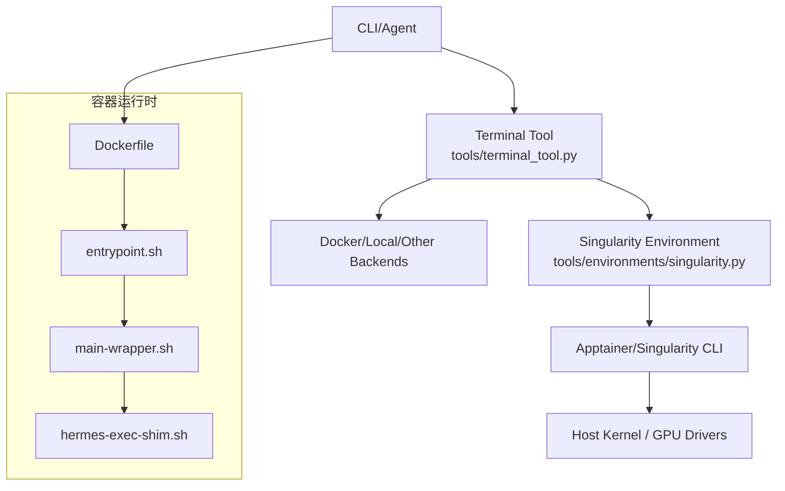
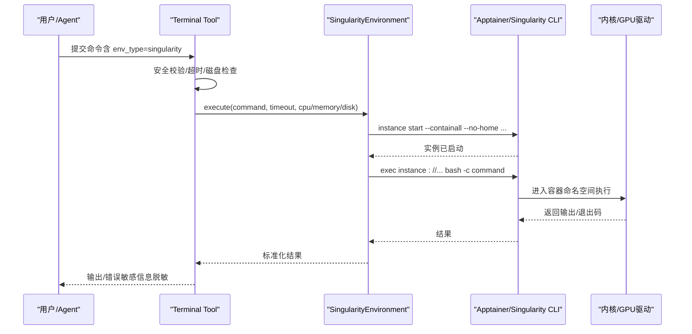
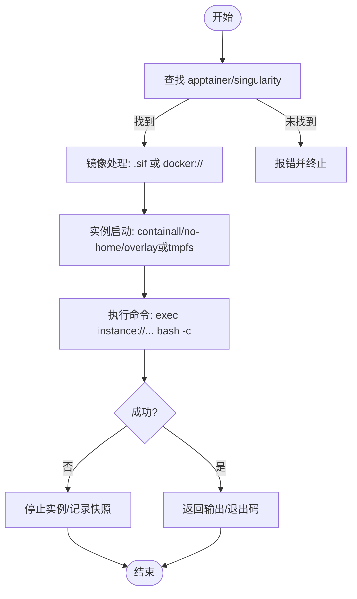
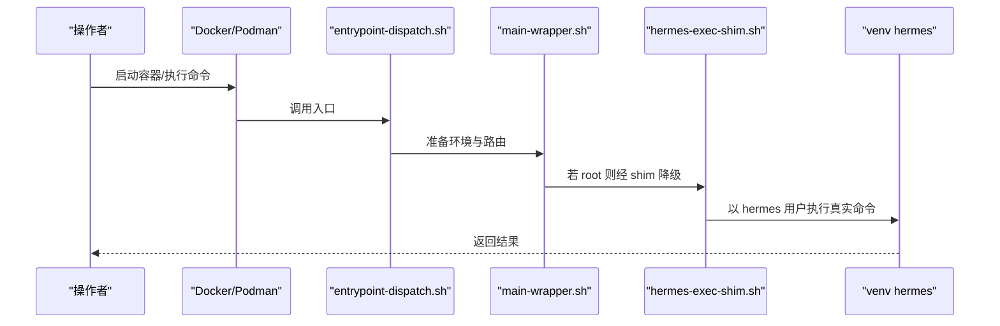
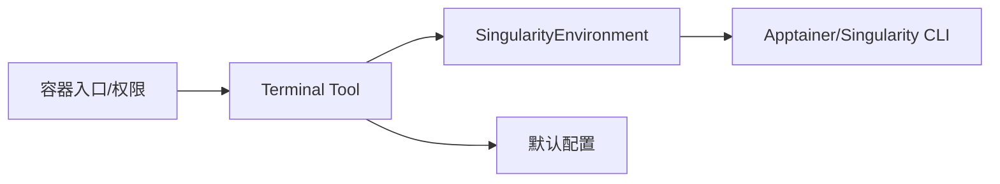

# Singularity 容器环境

<cite>
**本文引用的文件**
- [Dockerfile](file://Dockerfile)
- [docker/entrypoint.sh](file://docker/entrypoint.sh)
- [docker/main-wrapper.sh](file://docker/main-wrapper.sh)
- [docker/hermes-exec-shim.sh](file://docker/hermes-exec-shim.sh)
- [tools/environments/singularity.py](file://tools/environments/singularity.py)
- [tools/terminal_tool.py](file://tools/terminal_tool.py)
- [hermes_cli/config_defaults.py](file://hermes_cli/config_defaults.py)
- [agent/prompt_builder.py](file://agent/prompt_builder.py)
</cite>

## 目录
1. [简介](#简介)
2. [项目结构](#项目结构)
3. [核心组件](#核心组件)
4. [架构总览](#架构总览)
5. [详细组件分析](#详细组件分析)
6. [依赖关系分析](#依赖关系分析)
7. [性能考量](#性能考量)
8. [故障排查指南](#故障排查指南)
9. [结论](#结论)
10. [附录](#附录)

## 简介
本文件面向在高性能计算（HPC）环境中使用 Singularity/Apptainer 容器的用户与运维人员，结合代码库中的实现，系统说明：
- Singularity 容器的特点、与 Docker 的区别及适用场景
- HPC 环境下的容器部署、GPU 支持与文件系统访问策略
- Singularity 镜像的构建、管理与分发方法
- 高性能计算任务的容器化方案与优化策略
- 集群环境下的容器调度、资源管理与监控配置建议
- 完整的 HPC 工作流示例与部署指南

## 项目结构
仓库中与容器执行和 Singularity 相关的关键位置如下：
- 容器运行时入口与权限管理：Dockerfile、docker/entrypoint.sh、docker/main-wrapper.sh、docker/hermes-exec-shim.sh
- 终端工具与多后端执行：tools/terminal_tool.py
- Singularity 环境实现：tools/environments/singularity.py
- 默认配置与 CLI 集成：hermes_cli/config_defaults.py
- 提示词与环境选择逻辑：agent/prompt_builder.py

图表来源
- [tools/terminal_tool.py:1-800](file://tools/terminal_tool.py#L1-L800)
- [tools/environments/singularity.py:1-269](file://tools/environments/singularity.py#L1-L269)
- [Dockerfile:424-458](file://Dockerfile#L424-L458)
- [docker/entrypoint.sh:1-29](file://docker/entrypoint.sh#L1-L29)
- [docker/main-wrapper.sh:1-92](file://docker/main-wrapper.sh#L1-L92)
- [docker/hermes-exec-shim.sh:1-88](file://docker/hermes-exec-shim.sh#L1-L88)

章节来源
- [Dockerfile:424-458](file://Dockerfile#L424-L458)
- [docker/entrypoint.sh:1-29](file://docker/entrypoint.sh#L1-L29)
- [docker/main-wrapper.sh:1-92](file://docker/main-wrapper.sh#L1-L92)
- [docker/hermes-exec-shim.sh:1-88](file://docker/hermes-exec-shim.sh#L1-L88)
- [tools/terminal_tool.py:1-800](file://tools/terminal_tool.py#L1-L800)
- [tools/environments/singularity.py:1-269](file://tools/environments/singularity.py#L1-L269)
- [hermes_cli/config_defaults.py:340-396](file://hermes_cli/config_defaults.py#L340-L396)
- [agent/prompt_builder.py:1002-1092](file://agent/prompt_builder.py#L1002-L1092)

## 核心组件
- 终端工具（Terminal Tool）：统一封装本地、Docker、Modal、SSH、Singularity、Daytona、Vercel Sandbox 等多种执行后端，负责命令路由、安全校验、超时控制、清理等。
- Singularity 环境实现：提供安全的实例启动、SIF 镜像缓存与构建、可选持久化 overlay、资源限制（CPU/内存）、只读绑定凭据与技能目录等。
- 容器运行时入口：通过 s6-overlay 或兼容路径完成初始化、权限降级、服务编排与 CMD 路由。
- 配置与 CLI：集中定义默认镜像、资源限制、持久化开关、网络与卷挂载等；支持在 CLI 中切换后端为 Singularity。

章节来源
- [tools/terminal_tool.py:1-800](file://tools/terminal_tool.py#L1-L800)
- [tools/environments/singularity.py:1-269](file://tools/environments/singularity.py#L1-L269)
- [hermes_cli/config_defaults.py:340-396](file://hermes_cli/config_defaults.py#L340-L396)
- [agent/prompt_builder.py:1002-1092](file://agent/prompt_builder.py#L1002-L1092)

## 架构总览
下图展示了从 Agent/CLI 到终端工具再到 Singularity 后端的调用链，以及容器运行时的入口流程。

图表来源
- [tools/terminal_tool.py:1-800](file://tools/terminal_tool.py#L1-L800)
- [tools/environments/singularity.py:161-269](file://tools/environments/singularity.py#L161-L269)

## 详细组件分析

### 终端工具（Terminal Tool）
- 职责：统一抽象多种执行后端；对命令进行安全审查（危险命令审批、主机路径访问检测等）；管理超时、后台任务、清理；对输出进行敏感信息脱敏。
- 与 Singularity 的关系：当 env_type 为 singularity 时，构造并复用 SingularityEnvironment；支持 docker_image/singularity_image 等配置项；可配置 CPU/内存/磁盘/持久化等。
- 关键行为：
  - 导入并使用 tools.environments.singularity 提供的辅助函数（如 _get_scratch_dir）。
  - 将 singularity_image 作为后端镜像来源，支持 docker:// URL 自动转换为 SIF 缓存。
  - 对错误输出进行强制脱敏，避免泄露密钥。

章节来源
- [tools/terminal_tool.py:1-800](file://tools/terminal_tool.py#L1-L800)
- [tests/tools/test_terminal_error_redaction.py:13-24](file://tests/tools/test_terminal_error_redaction.py#L13-L24)

### Singularity 环境实现
- 实例生命周期：
  - 启动：apptainer/singularity instance start，启用 --containall、--no-home 强化隔离；可选 --overlay 持久化目录或 --writable-tmpfs 临时写层。
  - 执行：exec instance://... bash -c command，每次执行以子进程方式运行。
  - 清理：instance stop；若启用持久化，保存 overlay 路径以便后续复用。
- 镜像处理：
  - 优先使用本地 .sif；若为 docker:// 则尝试构建并缓存至 APPTAINER_CACHEDIR；失败时回退到直接使用 docker:// URL。
  - 构建过程继承宿主环境变量（保留认证信息），设置临时目录与缓存目录。
- 资源限制与安全：
  - 支持 --memory、--cpus 等参数限制资源。
  - 只读挂载凭据文件与技能目录，减少越权风险。
  - 自动选择 apptainer 或 singularity 二进制，并进行版本探测。
- 存储与缓存：
  - 支持自定义 TERMINAL_SCRATCH_DIR；否则优先使用 /scratch/<user>/hermes-agent，再回退到沙箱目录。
  - 快照记录保存在 hermes_home/singularity_snapshots.json。

图表来源
- [tools/environments/singularity.py:30-61](file://tools/environments/singularity.py#L30-L61)
- [tools/environments/singularity.py:72-103](file://tools/environments/singularity.py#L72-L103)
- [tools/environments/singularity.py:108-159](file://tools/environments/singularity.py#L108-L159)
- [tools/environments/singularity.py:161-269](file://tools/environments/singularity.py#L161-L269)

章节来源
- [tools/environments/singularity.py:1-269](file://tools/environments/singularity.py#L1-L269)

### 容器运行时入口与权限管理
- 入口点：
  - 默认 ENTRYPOINT 为 entrypoint-dispatch.sh，内部根据是否拥有 PID 1 决定走 s6-overlay 监督树或直接 fallback 到 stage2-hook + main-wrapper。
  - 兼容旧版 entrypoint.sh 作为 shim，仅执行 stage2 初始化并告警弃用。
- 主包装器：
  - main-wrapper.sh 负责激活 venv、恢复工作目录、按参数路由到 hermes 子命令或直接执行外部程序；非 root 时直接执行，root 时通过 s6-setuidgid 降级到 hermes 用户。
  - 拒绝使用任意非 hermes UID 启动（--user <uid>:<gid>），引导用户使用 HERMES_UID/PUID/PGID 进行映射。
- 特权降级 shim：
  - hermes-exec-shim.sh 拦截 root 下 docker exec 的执行，自动切换到 hermes 用户，避免写入文件归属问题；支持显式绕过环境变量。

图表来源
- [Dockerfile:424-458](file://Dockerfile#L424-L458)
- [docker/entrypoint.sh:1-29](file://docker/entrypoint.sh#L1-L29)
- [docker/main-wrapper.sh:1-92](file://docker/main-wrapper.sh#L1-L92)
- [docker/hermes-exec-shim.sh:1-88](file://docker/hermes-exec-shim.sh#L1-L88)

章节来源
- [Dockerfile:424-458](file://Dockerfile#L424-L458)
- [docker/entrypoint.sh:1-29](file://docker/entrypoint.sh#L1-L29)
- [docker/main-wrapper.sh:1-92](file://docker/main-wrapper.sh#L1-L92)
- [docker/hermes-exec-shim.sh:1-88](file://docker/hermes-exec-shim.sh#L1-L88)

### 配置与 CLI 集成
- 默认配置：
  - terminal.backend 可设为 singularity；默认镜像指向 docker://nikolaik/python-nodejs:python3.11-nodejs20。
  - 资源限制：container_cpu、container_memory、container_disk；persistent 开关用于跨会话持久化。
  - 其他：docker_volumes、docker_network、docker_shm_size、docker_run_as_host_user 等（对 singularity 部分参数由后端自行解析）。
- CLI 交互：
  - 安装/配置向导支持选择 Singularity/Apptainer 后端，并提示安装 apptainer/singularity。
  - 打印当前终端后端与镜像信息，便于确认。

章节来源
- [hermes_cli/config_defaults.py:340-396](file://hermes_cli/config_defaults.py#L340-L396)
- [agent/prompt_builder.py:1002-1092](file://agent/prompt_builder.py#L1002-L1092)

## 依赖关系分析
- Terminal Tool 依赖 SingularityEnvironment 实现具体执行；后者依赖宿主的 Apptainer/Singularity CLI。
- 容器运行时入口与权限管理独立于终端后端，但共同确保容器内进程以最小权限运行。
- 配置集中在 defaults，被 CLI 与运行时读取，影响后端选择与资源限制。

图表来源
- [tools/terminal_tool.py:1-800](file://tools/terminal_tool.py#L1-L800)
- [tools/environments/singularity.py:1-269](file://tools/environments/singularity.py#L1-L269)
- [hermes_cli/config_defaults.py:340-396](file://hermes_cli/config_defaults.py#L340-L396)
- [Dockerfile:424-458](file://Dockerfile#L424-L458)

章节来源
- [tools/terminal_tool.py:1-800](file://tools/terminal_tool.py#L1-L800)
- [tools/environments/singularity.py:1-269](file://tools/environments/singularity.py#L1-L269)
- [hermes_cli/config_defaults.py:340-396](file://hermes_cli/config_defaults.py#L340-L396)
- [Dockerfile:424-458](file://Dockerfile#L424-L458)

## 性能考量
- 镜像构建与缓存：
  - 首次使用 docker:// 镜像会构建 SIF 并缓存到 APPTAINER_CACHEDIR，后续复用显著降低冷启动开销。
  - 可通过 TERMINAL_SCRATCH_DIR 指定高速存储（如 /scratch）提升 I/O 性能。
- 实例与执行模型：
  - 每次 execute() 以 exec 方式在新进程中执行命令，避免状态污染；配合 persistent_filesystem 使用 overlay 实现跨调用数据持久化。
- 资源限制：
  - 通过 container_cpu/container_memory 限制 CPU 与内存，避免争用；磁盘配额通过 container_disk 在后端或调度层约束。
- 安全与隔离：
  - --containall、--no-home 减少攻击面；只读挂载凭据与技能目录，防止意外写入。
- 日志与监控：
  - 建议在集群侧采集 Apptainer/Singularity 事件与资源指标（CPU/内存/IO），并结合 Hermes 的 OTLP 导出能力进行统一观测。

[本节为通用指导，不直接分析特定文件]

## 故障排查指南
- 找不到 Apptainer/Singularity：
  - 现象：后端选择后无法执行，抛出未找到 CLI 的错误。
  - 处理：安装 Apptainer 或 Singularity，并确保 PATH 可找到对应二进制。
- 实例启动超时或失败：
  - 现象：instance start 超时或返回非零。
  - 处理：检查镜像可用性、缓存目录权限、宿主机资源；必要时清理缓存并重试。
- 权限问题导致文件归属异常：
  - 现象：docker exec 写入的文件属主为 root，导致后续服务不可读。
  - 处理：使用 hermes-exec-shim.sh 自动降级；或通过 HERMES_UID/PUID/PGID 映射宿主用户。
- 敏感信息泄露：
  - 现象：错误输出包含密钥片段。
  - 处理：Terminal Tool 会对错误输出强制脱敏；确保使用最新实现。

章节来源
- [tools/environments/singularity.py:30-61](file://tools/environments/singularity.py#L30-L61)
- [docker/hermes-exec-shim.sh:1-88](file://docker/hermes-exec-shim.sh#L1-L88)
- [tools/terminal_tool.py:57-62](file://tools/terminal_tool.py#L57-L62)

## 结论
本仓库提供了完善的终端工具与 Singularity 环境实现，能够在 HPC 场景中提供强隔离、可配置资源限制与可选持久化的容器执行能力。结合容器运行时入口与权限管理，可实现安全、稳定、可观测的容器化工作流。对于 GPU 与集群调度，可在后端与平台层扩展以实现更细粒度的资源编排与监控。

[本节为总结性内容，不直接分析特定文件]

## 附录

### HPC 工作流示例与部署指南
- 前置条件
  - 宿主机安装 Apptainer 或 Singularity，并具备访问所需镜像的能力（包括私有 registry）。
  - 如需 GPU，确保宿主机驱动与容器内运行时（如 CUDA）兼容。
- 配置步骤
  - 在 CLI 中选择 backend=singularity，并设置 singularity_image（支持 docker:// URL）。
  - 根据需要设置 container_cpu、container_memory、container_disk、persistent_filesystem。
  - 如需持久化，启用 persistent_filesystem，并将 TERMINAL_SCRATCH_DIR 指向高速存储。
- 执行任务
  - 通过终端工具提交命令；后端会自动处理镜像缓存、实例启动与执行。
  - 对于长任务，建议使用后台模式并合理设置超时。
- 监控与排障
  - 观察实例启动与执行日志；检查缓存目录与权限。
  - 结合集群监控采集 CPU/内存/IO 指标；必要时调整资源限制。

[本节为概念性指导，不直接分析特定文件]

### 与 Docker 的区别与适用场景
- 区别要点
  - 执行模型：Singularity/Apptainer 更强调无守护进程、按需实例化与强隔离；Docker 通常以守护进程为中心。
  - 权限模型：Singularity 默认以用户身份运行，适合 HPC 共享节点；Docker 常需额外配置以匹配宿主用户。
  - 镜像格式：Singularity 原生支持 SIF；也可从 Docker 镜像构建 SIF 并缓存。
- 适用场景
  - HPC 集群：Singularity/Apptainer 更适合共享节点与严格隔离需求。
  - 开发/CI：Docker 生态丰富，便于快速迭代与测试。

[本节为概念性指导，不直接分析特定文件]

### 集群调度、资源管理与监控配置建议
- 调度
  - 将 Singularity 实例作为作业单元提交至调度器（如 Slurm、PBS），并通过环境变量传递资源限制。
- 资源管理
  - 使用 container_cpu/container_memory 限制单实例资源；通过调度器限制并发与队列。
- 监控
  - 采集 Apptainer/Singularity 事件与系统指标；结合 Hermes OTLP 导出进行统一可视化。
  - 对磁盘使用进行阈值告警，避免缓存与 overlay 占用过大。

[本节为概念性指导，不直接分析特定文件]