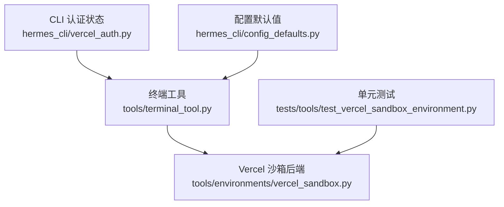
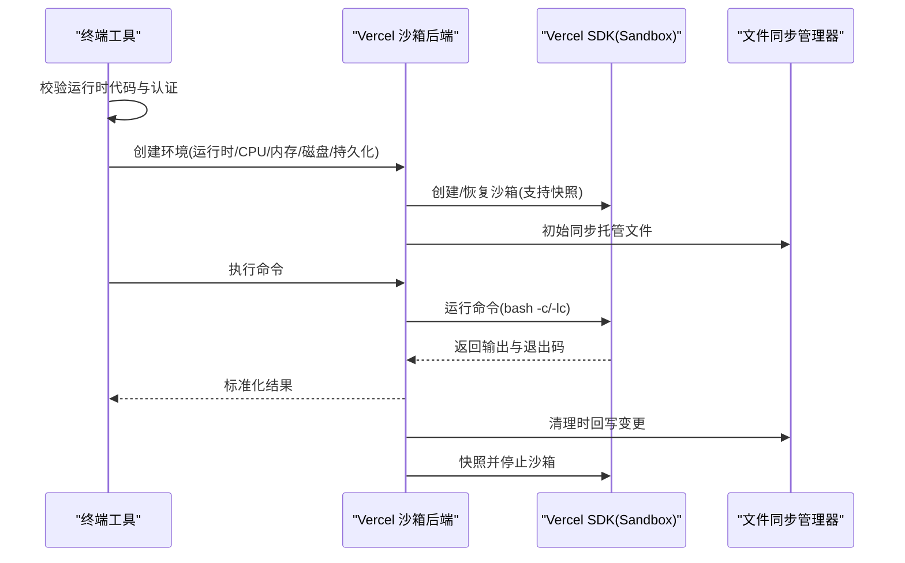
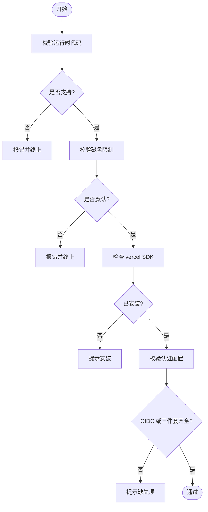
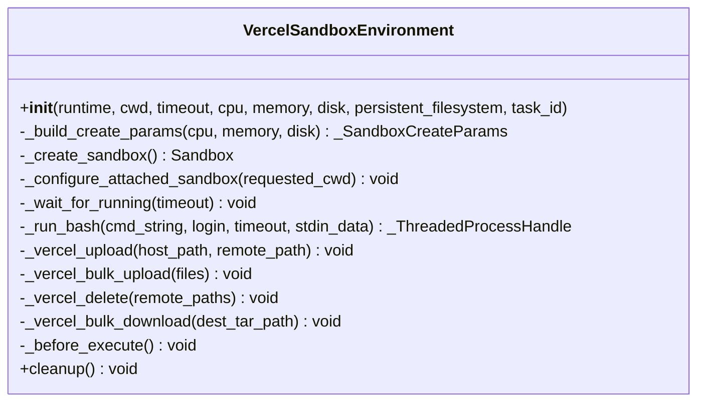
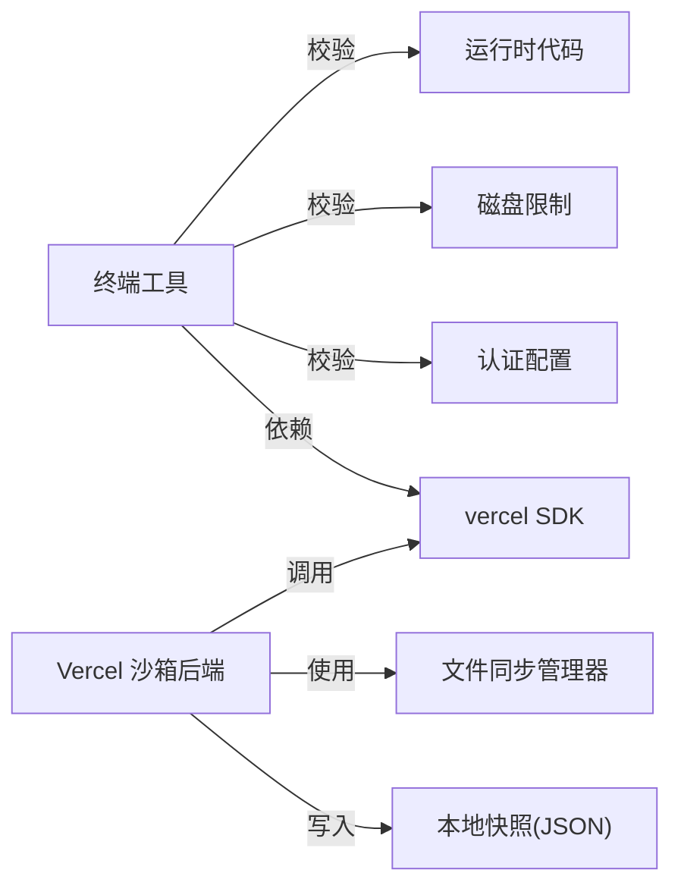
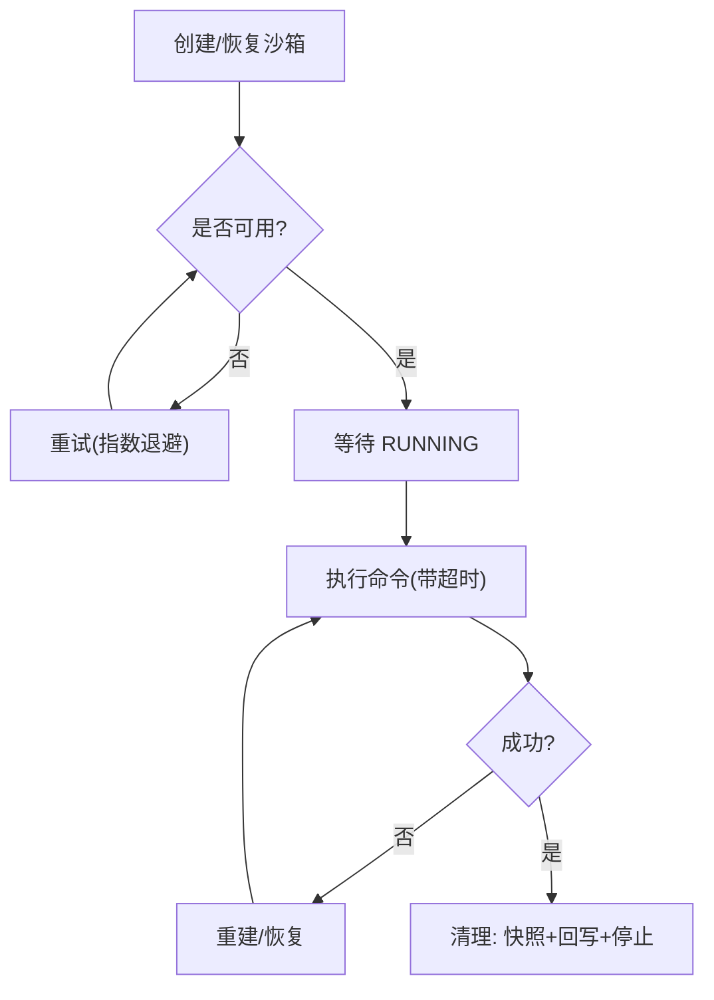

# Vercel 沙箱环境

<cite>
**本文引用的文件**
- [tools/environments/vercel_sandbox.py](file://tools/environments/vercel_sandbox.py)
- [hermes_cli/vercel_auth.py](file://hermes_cli/vercel_auth.py)
- [tools/terminal_tool.py](file://tools/terminal_tool.py)
- [hermes_cli/config_defaults.py](file://hermes_cli/config_defaults.py)
- [tests/tools/test_vercel_sandbox_environment.py](file://tests/tools/test_vercel_sandbox_environment.py)
</cite>

## 目录
1. [简介](#简介)
2. [项目结构](#项目结构)
3. [核心组件](#核心组件)
4. [架构总览](#架构总览)
5. [详细组件分析](#详细组件分析)
6. [依赖关系分析](#依赖关系分析)
7. [性能与冷启动优化](#性能与冷启动优化)
8. [环境变量、依赖安装与构建流程](#环境变量依赖安装与构建流程)
9. [部署策略、版本管理与监控](#部署策略版本管理与监控)
10. [调试与故障排除](#调试与故障排除)
11. [结论](#结论)
12. [附录：最佳实践与示例](#附录最佳实践与示例)

## 简介
本文件面向在 Hermes 中集成 Vercel 沙箱执行环境的开发者，系统性说明以下主题：
- Vercel 平台集成方式（认证、运行时选择、资源限制）
- 边缘计算与函数执行环境的映射（通过 Vercel SDK 的 Sandbox 抽象）
- 冷启动优化（快照恢复、重试与等待策略）
- 内存管理与执行超时配置
- 环境变量管理、依赖安装与构建流程
- 边缘函数的部署策略、版本管理与监控方案
- 性能优化技巧、调试方法与故障排除指南
- 完整应用示例与最佳实践

## 项目结构
围绕 Vercel 沙箱的关键代码集中在以下位置：
- 终端工具层：负责校验运行时代码、认证要求与默认工作目录等
- 沙箱后端实现：封装 Vercel SDK，提供创建、执行、同步、快照、清理等能力
- CLI 认证状态：描述 OIDC 或访问令牌模式，并输出诊断信息
- 配置默认值：定义支持的运行时、资源限制与持久化开关
- 单元测试：覆盖启动、文件同步、执行、快照恢复与清理等路径

**图表来源**
- [tools/terminal_tool.py:130-196](file://tools/terminal_tool.py#L130-L196)
- [tools/environments/vercel_sandbox.py:1-77](file://tools/environments/vercel_sandbox.py#L1-L77)
- [hermes_cli/vercel_auth.py:1-71](file://hermes_cli/vercel_auth.py#L1-L71)
- [hermes_cli/config_defaults.py:350-359](file://hermes_cli/config_defaults.py#L350-L359)
- [tests/tools/test_vercel_sandbox_environment.py:199-234](file://tests/tools/test_vercel_sandbox_environment.py#L199-L234)

**章节来源**
- [tools/terminal_tool.py:130-196](file://tools/terminal_tool.py#L130-L196)
- [tools/environments/vercel_sandbox.py:1-77](file://tools/environments/vercel_sandbox.py#L1-L77)
- [hermes_cli/vercel_auth.py:1-71](file://hermes_cli/vercel_auth.py#L1-L71)
- [hermes_cli/config_defaults.py:350-359](file://hermes_cli/config_defaults.py#L350-L359)
- [tests/tools/test_vercel_sandbox_environment.py:199-234](file://tests/tools/test_vercel_sandbox_environment.py#L199-L234)

## 核心组件
- 终端工具校验器：验证 Vercel 运行时代码、磁盘限制、SDK 依赖与认证配置
- Vercel 沙箱后端：基于 Vercel SDK 的 Sandbox 抽象，实现命令执行、文件同步、快照恢复与生命周期管理
- CLI 认证状态：以不暴露敏感信息的方式报告 OIDC 或访问令牌模式
- 配置默认值：定义支持的运行时、CPU/内存/磁盘限制与持久化选项
- 测试套件：覆盖启动、健康检查、文件同步、执行、快照恢复与清理等关键路径

**章节来源**
- [tools/terminal_tool.py:130-196](file://tools/terminal_tool.py#L130-L196)
- [tools/environments/vercel_sandbox.py:243-342](file://tools/environments/vercel_sandbox.py#L243-L342)
- [hermes_cli/vercel_auth.py:23-71](file://hermes_cli/vercel_auth.py#L23-L71)
- [hermes_cli/config_defaults.py:350-359](file://hermes_cli/config_defaults.py#L350-L359)
- [tests/tools/test_vercel_sandbox_environment.py:260-346](file://tests/tools/test_vercel_sandbox_environment.py#L260-L346)

## 架构总览
下图展示了从终端工具到 Vercel 沙箱后端的调用链，包括认证校验、运行时选择、资源限制、文件同步与快照恢复。

**图表来源**
- [tools/terminal_tool.py:130-196](file://tools/terminal_tool.py#L130-L196)
- [tools/environments/vercel_sandbox.py:243-342](file://tools/environments/vercel_sandbox.py#L243-L342)
- [tools/environments/vercel_sandbox.py:513-590](file://tools/environments/vercel_sandbox.py#L513-L590)
- [tests/tools/test_vercel_sandbox_environment.py:260-346](file://tests/tools/test_vercel_sandbox_environment.py#L260-L346)

## 详细组件分析

### 终端工具校验器（运行时代码与认证）
- 支持的 Vercel 运行时：node24、node22、python3.13
- 默认工作目录：/vercel/sandbox
- 磁盘限制：仅允许默认共享设置（51200 MB），不支持自定义
- 认证要求：
  - 开发模式：VERCEL_OIDC_TOKEN
  - 生产模式：VERCEL_TOKEN + VERCEL_PROJECT_ID + VERCEL_TEAM_ID 三者同时存在
- 依赖检查：确保 vercel SDK 已安装

**图表来源**
- [tools/terminal_tool.py:130-196](file://tools/terminal_tool.py#L130-L196)

**章节来源**
- [tools/terminal_tool.py:130-196](file://tools/terminal_tool.py#L130-L196)

### Vercel 沙箱后端（执行、同步、快照、清理）
- 初始化：
  - 构建创建参数（timeout、runtime、Resources）
  - 创建或恢复沙箱（优先使用快照）
  - 检测工作目录与远程 home，初始化文件同步
- 执行：
  - 通过 bash -c/-lc 运行命令
  - 使用线程句柄包装执行与取消（超时由基类控制）
- 文件同步：
  - 上传托管文件（凭据、技能、缓存）
  - 批量下载归档并在清理时回写
- 快照与清理：
  - 清理前尝试快照并记录任务 ID 到本地 JSON
  - 停止并关闭客户端，避免资源泄漏

**图表来源**
- [tools/environments/vercel_sandbox.py:243-342](file://tools/environments/vercel_sandbox.py#L243-L342)
- [tools/environments/vercel_sandbox.py:591-663](file://tools/environments/vercel_sandbox.py#L591-L663)

**章节来源**
- [tools/environments/vercel_sandbox.py:243-342](file://tools/environments/vercel_sandbox.py#L243-L342)
- [tools/environments/vercel_sandbox.py:513-590](file://tools/environments/vercel_sandbox.py#L513-L590)
- [tools/environments/vercel_sandbox.py:591-663](file://tools/environments/vercel_sandbox.py#L591-L663)

### CLI 认证状态（不泄露敏感信息）
- 支持两种模式：
  - OIDC：VERCEL_OIDC_TOKEN（开发专用）
  - 访问令牌：VERCEL_TOKEN + VERCEL_PROJECT_ID + VERCEL_TEAM_ID（生产推荐）
- 输出结构化状态，便于诊断与引导用户补齐缺失项

**章节来源**
- [hermes_cli/vercel_auth.py:23-71](file://hermes_cli/vercel_auth.py#L23-L71)

### 配置默认值（运行时与资源）
- 支持的运行时：node24、node22、python3.13
- 默认 CPU：1；默认内存：5120 MB；默认磁盘：51200 MB
- 持久化：默认开启（persistent_filesystem=True）

**章节来源**
- [hermes_cli/config_defaults.py:350-359](file://hermes_cli/config_defaults.py#L350-L359)

### 单元测试（关键路径覆盖）
- 启动与工作目录检测
- 文件同步（凭据挂载、增量同步）
- 执行健康检查与重建（异常恢复）
- 快照恢复与失败回退
- 清理幂等性与错误隔离

**章节来源**
- [tests/tools/test_vercel_sandbox_environment.py:260-346](file://tests/tools/test_vercel_sandbox_environment.py#L260-L346)
- [tests/tools/test_vercel_sandbox_environment.py:443-518](file://tests/tools/test_vercel_sandbox_environment.py#L443-L518)
- [tests/tools/test_vercel_sandbox_environment.py:520-605](file://tests/tools/test_vercel_sandbox_environment.py#L520-L605)

## 依赖关系分析
- 终端工具依赖：
  - 运行时代码白名单
  - 磁盘限制约束
  - vercel SDK 可用性
  - 认证环境变量（OIDC 或三件套）
- 沙箱后端依赖：
  - Vercel SDK 的 Sandbox、Resources、WriteFile、SandboxStatus
  - 文件同步管理器（上传/下载/删除）
  - 本地快照存储（JSON）

**图表来源**
- [tools/terminal_tool.py:130-196](file://tools/terminal_tool.py#L130-L196)
- [tools/environments/vercel_sandbox.py:243-342](file://tools/environments/vercel_sandbox.py#L243-L342)
- [tools/environments/vercel_sandbox.py:513-590](file://tools/environments/vercel_sandbox.py#L513-L590)

**章节来源**
- [tools/terminal_tool.py:130-196](file://tools/terminal_tool.py#L130-L196)
- [tools/environments/vercel_sandbox.py:243-342](file://tools/environments/vercel_sandbox.py#L243-L342)

## 性能与冷启动优化
- 冷启动优化
  - 快照恢复：优先从上次任务快照恢复沙箱，减少初始化时间
  - 重试机制：对创建与写入操作进行有限次重试，应对瞬时网络或服务波动
  - 等待策略：等待沙箱进入 RUNNING 状态，设置最小等待时间与轮询间隔
- 执行超时
  - 每执行调用由基类通过 kill_fn 强制超时，避免长时间占用
  - 沙箱级别的最小超时保护（不低于固定阈值）
- 内存与资源
  - 可配置 CPU 与内存（Resources），磁盘使用默认共享设置
  - 禁止自定义容器磁盘大小，避免与平台限制冲突
- 文件同步
  - 初始同步托管文件，执行前增量同步变更
  - 清理时回写变更，避免数据丢失

**图表来源**
- [tools/environments/vercel_sandbox.py:66-77](file://tools/environments/vercel_sandbox.py#L66-L77)
- [tools/environments/vercel_sandbox.py:114-135](file://tools/environments/vercel_sandbox.py#L114-L135)
- [tools/environments/vercel_sandbox.py:398-422](file://tools/environments/vercel_sandbox.py#L398-L422)
- [tools/environments/vercel_sandbox.py:591-663](file://tools/environments/vercel_sandbox.py#L591-L663)

## 环境变量、依赖安装与构建流程
- 环境变量
  - 运行时代码：TERMINAL_VERCEL_RUNTIME（支持 node24、node22、python3.13）
  - 认证：
    - 开发：VERCEL_OIDC_TOKEN
    - 生产：VERCEL_TOKEN、VERCEL_PROJECT_ID、VERCEL_TEAM_ID
  - 遥测：VERCEL_TELEMETRY_DISABLED（默认禁用，防止外发遥测）
- 依赖安装
  - 按需懒加载 vercel SDK（首次导入时触发）
  - 若未安装，终端工具会提示安装
- 构建流程
  - 初始化阶段：校验运行时代码、磁盘限制、SDK 与认证
  - 执行阶段：创建/恢复沙箱、同步文件、执行命令
  - 清理阶段：快照、回写、停止与关闭

**章节来源**
- [tools/terminal_tool.py:130-196](file://tools/terminal_tool.py#L130-L196)
- [tools/environments/vercel_sandbox.py:47-64](file://tools/environments/vercel_sandbox.py#L47-L64)
- [hermes_cli/config_defaults.py:350-359](file://hermes_cli/config_defaults.py#L350-L359)

## 部署策略、版本管理与监控
- 部署策略
  - 使用 Vercel 沙箱作为云执行环境，适合短生命周期任务与命令执行
  - 通过快照实现任务级状态复用，降低冷启动成本
- 版本管理
  - 运行时代码受白名单限制，升级需更新支持列表
  - 快照按任务 ID 维护，清理时记录最新快照 ID
- 监控方案
  - 日志：创建/恢复、重试、状态变化、快照与清理均记录日志
  - 诊断：CLI 认证状态输出帮助定位认证问题
  - 测试：单元测试覆盖关键路径，保障稳定性

**章节来源**
- [tools/environments/vercel_sandbox.py:114-135](file://tools/environments/vercel_sandbox.py#L114-L135)
- [tools/environments/vercel_sandbox.py:448-475](file://tools/environments/vercel_sandbox.py#L448-L475)
- [hermes_cli/vercel_auth.py:23-71](file://hermes_cli/vercel_auth.py#L23-L71)

## 调试与故障排除
- 常见问题
  - 运行时代码不支持：检查 TERMINAL_VERCEL_RUNTIME 是否为 node24/node22/python3.13
  - 磁盘限制错误：仅允许默认 51200 MB，不可自定义
  - 认证缺失：生产需三件套齐全；开发可使用 OIDC
  - SDK 未安装：提示安装 vercel
- 故障定位
  - 查看终端工具的错误日志（运行时、磁盘、SDK、认证）
  - 检查沙箱状态（RUNNING 等待、临时状态处理）
  - 确认文件同步是否成功（凭据挂载、增量同步）
  - 清理阶段快照与回写是否完成
- 建议步骤
  - 使用 CLI 认证状态输出快速识别认证模式
  - 启用最小超时与重试，观察是否因瞬时错误导致失败
  - 通过单元测试模拟沙箱行为，验证逻辑路径

**章节来源**
- [tools/terminal_tool.py:130-196](file://tools/terminal_tool.py#L130-L196)
- [tools/environments/vercel_sandbox.py:398-422](file://tools/environments/vercel_sandbox.py#L398-L422)
- [tests/tools/test_vercel_sandbox_environment.py:443-518](file://tests/tools/test_vercel_sandbox_environment.py#L443-L518)

## 结论
Hermes 对 Vercel 沙箱的集成提供了完整的生命周期管理：从认证校验、运行时代码白名单、资源限制，到命令执行、文件同步、快照恢复与清理。通过重试、等待与超时控制，提升了可靠性与用户体验。配合 CLI 认证状态与单元测试，便于部署、调试与维护。

## 附录：最佳实践与示例
- 最佳实践
  - 始终设置正确的运行时代码与认证
  - 使用快照提升重复任务效率
  - 合理配置 CPU/内存，避免超出平台限制
  - 利用文件同步管理凭据与缓存
- 示例流程
  - 初始化：校验运行时代码与认证，创建/恢复沙箱
  - 执行：执行命令并获取输出与退出码
  - 清理：快照、回写、停止与关闭

**章节来源**
- [tools/environments/vercel_sandbox.py:243-342](file://tools/environments/vercel_sandbox.py#L243-L342)
- [tools/environments/vercel_sandbox.py:591-663](file://tools/environments/vercel_sandbox.py#L591-L663)
- [tests/tools/test_vercel_sandbox_environment.py:260-346](file://tests/tools/test_vercel_sandbox_environment.py#L260-L346)