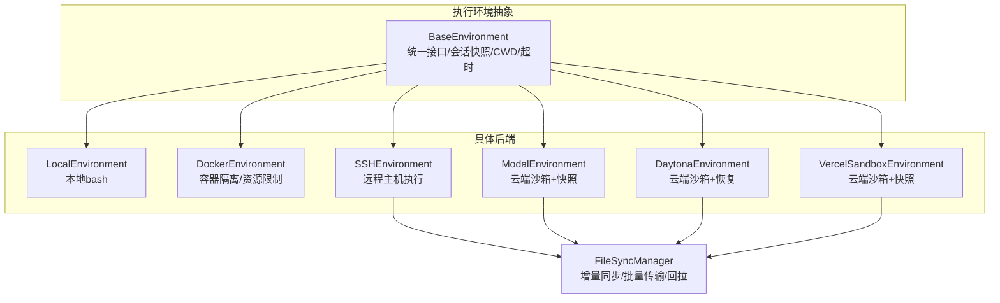
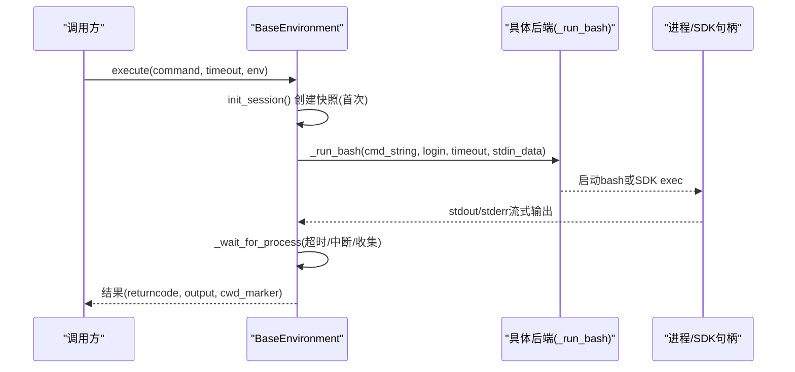
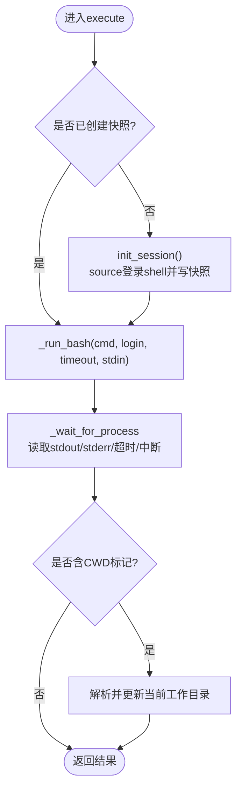
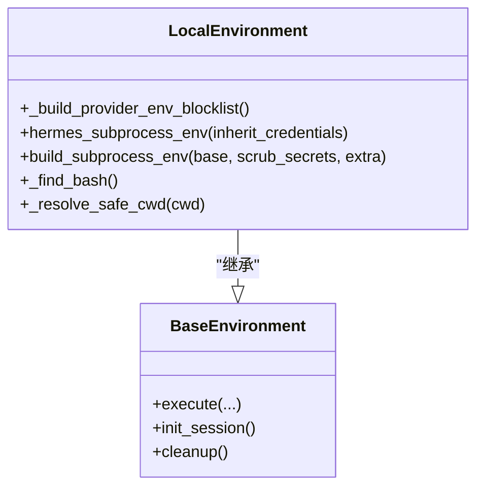
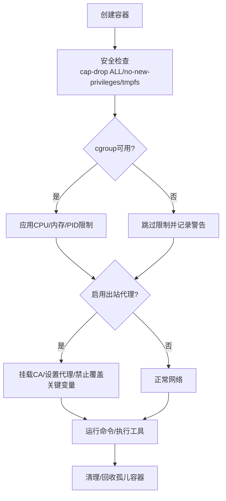
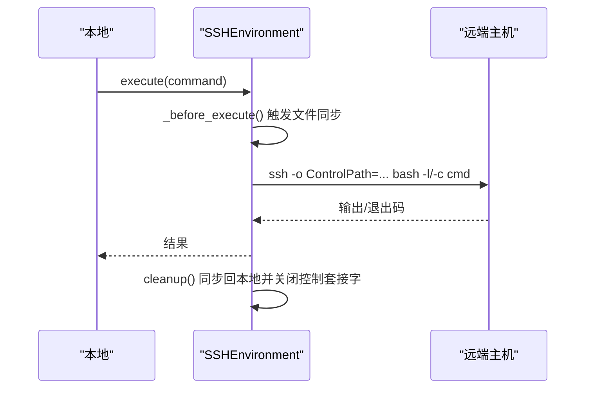
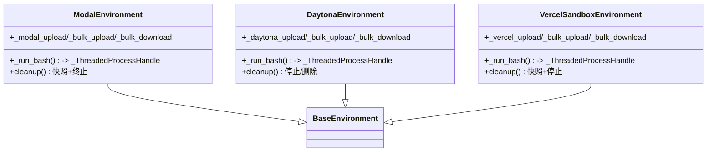
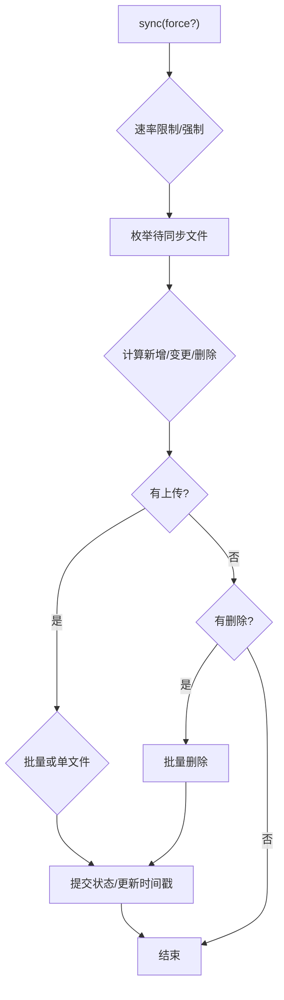
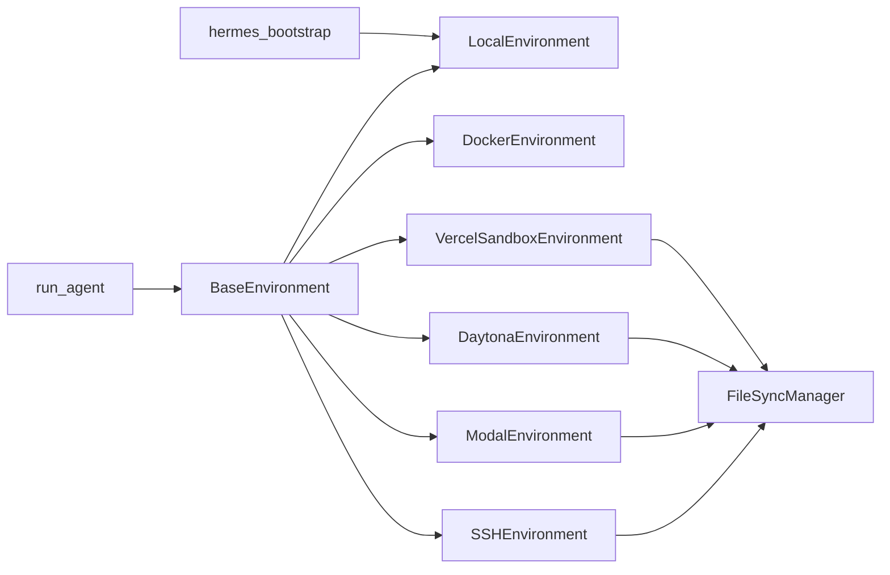

# 执行环境

<cite>
**本文引用的文件**
- [tools/environments/base.py](file://tools/environments/base.py)
- [tools/environments/local.py](file://tools/environments/local.py)
- [tools/environments/docker.py](file://tools/environments/docker.py)
- [tools/environments/ssh.py](file://tools/environments/ssh.py)
- [tools/environments/modal.py](file://tools/environments/modal.py)
- [tools/environments/daytona.py](file://tools/environments/daytona.py)
- [tools/environments/vercel_sandbox.py](file://tools/environments/vercel_sandbox.py)
- [tools/environments/file_sync.py](file://tools/environments/file_sync.py)
- [hermes_bootstrap.py](file://hermes_bootstrap.py)
- [run_agent.py](file://run_agent.py)
</cite>

## 目录
1. [简介](#简介)
2. [项目结构](#项目结构)
3. [核心组件](#核心组件)
4. [架构总览](#架构总览)
5. [详细组件分析](#详细组件分析)
6. [依赖关系分析](#依赖关系分析)
7. [性能考量](#性能考量)
8. [故障排查指南](#故障排查指南)
9. [结论](#结论)
10. [附录：配置与部署示例](#附录配置与部署示例)

## 简介
本文件系统性说明 Hermes Agent 的工具执行环境与后端管理机制，覆盖本地执行、容器化（Docker）、远程 SSH、云端沙箱（Modal、Daytona、Vercel Sandbox）等执行环境。重点解释进程管理、资源隔离、环境变量传递、文件同步机制，并给出环境选择策略、负载均衡与健康检查、故障转移的实践建议。同时提供不同环境的配置要点与部署指引，以及性能监控、调试技巧与故障诊断方法。

## 项目结构
执行环境相关代码集中在 tools/environments 目录下，采用“统一抽象 + 多实现”的分层设计：
- base.py：定义统一的执行接口与环境基类，封装会话快照、CWD 追踪、超时与中断处理、输出收集等通用逻辑。
- local.py：本地 bash 执行环境，负责路径与权限安全、环境变量清洗、Windows 兼容等。
- docker.py：基于 Docker/Podman 的容器化执行，提供安全加固、资源限制、出站代理与孤儿容器回收。
- ssh.py：通过 SSH 在远端主机执行命令，使用 ControlMaster 复用连接，集成文件同步。
- modal.py / daytona.py / vercel_sandbox.py：对接各云平台的 SDK，以持久化沙箱或镜像快照方式维持状态。
- file_sync.py：跨后端的文件同步管理器，支持增量上传、删除、批量传输与回拉。

图表来源
- [tools/environments/base.py:553-782](file://tools/environments/base.py#L553-L782)
- [tools/environments/local.py:1-200](file://tools/environments/local.py#L1-L200)
- [tools/environments/docker.py:1-120](file://tools/environments/docker.py#L1-L120)
- [tools/environments/ssh.py:40-86](file://tools/environments/ssh.py#L40-L86)
- [tools/environments/modal.py:164-293](file://tools/environments/modal.py#L164-L293)
- [tools/environments/daytona.py:30-152](file://tools/environments/daytona.py#L30-L152)
- [tools/environments/vercel_sandbox.py:243-376](file://tools/environments/vercel_sandbox.py#L243-L376)
- [tools/environments/file_sync.py:134-250](file://tools/environments/file_sync.py#L134-L250)

章节来源
- [tools/environments/base.py:553-782](file://tools/environments/base.py#L553-L782)
- [tools/environments/file_sync.py:134-250](file://tools/environments/file_sync.py#L134-L250)

## 核心组件
- BaseEnvironment：统一执行流程，包含 init_session（捕获登录 shell 环境到快照）、execute（包装命令、注入 CWD 标记、超时与中断）、_wait_for_process（等待进程并收集输出）。
- _ThreadedProcessHandle：将阻塞式 SDK 调用适配为进程句柄，便于统一等待与取消。
- FileSyncManager：对 SSH/Modal/Daytona/Vercel 等后端进行文件同步，支持增量检测、批量传输、事务性提交与失败回滚，以及 teardown 时的回拉。
- LocalEnvironment：本地 bash 执行，提供路径转换、权限校验、环境变量清洗（屏蔽敏感键、避免 venv 污染、跨会话泄漏防护）。
- DockerEnvironment：容器化执行，安全加固（能力最小化、no-new-privileges、tmpfs 限制）、资源限制（CPU/内存/PID，cgroup 探测）、出站代理（iron-proxy）与孤儿容器清理。
- SSHEnvironment：远程执行，ControlMaster 连接复用，批量 tar 管道传输，错误分类为基础设施连接错误。
- Modal/Daytona/Vercel：云端沙箱，支持持久化（快照/恢复）、资源参数、重试与临时状态码处理、清理时保存快照并停止实例。

章节来源
- [tools/environments/base.py:553-782](file://tools/environments/base.py#L553-L782)
- [tools/environments/local.py:200-720](file://tools/environments/local.py#L200-L720)
- [tools/environments/docker.py:322-770](file://tools/environments/docker.py#L322-L770)
- [tools/environments/ssh.py:40-155](file://tools/environments/ssh.py#L40-L155)
- [tools/environments/modal.py:164-293](file://tools/environments/modal.py#L164-L293)
- [tools/environments/daytona.py:30-152](file://tools/environments/daytona.py#L30-L152)
- [tools/environments/vercel_sandbox.py:243-376](file://tools/environments/vercel_sandbox.py#L243-L376)
- [tools/environments/file_sync.py:134-250](file://tools/environments/file_sync.py#L134-L250)

## 架构总览
Hermes 的执行环境遵循“每命令一次 spawn”的统一模型：每次执行都会启动一个独立的 bash -c 子进程（或通过 SDK 模拟），并在执行前 source 会话快照以保证环境变量、函数与别名一致；CWD 通过带外标记或临时文件在远程/容器内保持一致。

图表来源
- [tools/environments/base.py:660-782](file://tools/environments/base.py#L660-L782)
- [tools/environments/base.py:329-349](file://tools/environments/base.py#L329-L349)
- [tools/environments/modal.py:408-440](file://tools/environments/modal.py#L408-L440)
- [tools/environments/daytona.py:219-242](file://tools/environments/daytona.py#L219-L242)
- [tools/environments/vercel_sandbox.py:597-637](file://tools/environments/vercel_sandbox.py#L597-L637)

章节来源
- [tools/environments/base.py:660-782](file://tools/environments/base.py#L660-L782)

## 详细组件分析

### 基础执行框架（BaseEnvironment）
- 会话快照：init_session 捕获登录 shell 的环境变量、函数、别名与选项，原子写入快照文件，后续命令直接 source 快照，避免重复加载登录脚本。
- CWD 追踪：通过 in-band 标记 __HERMES_CWD_{session_id}__ 在远程/容器内保持工作目录一致性。
- 输出收集：内置有界输出收集器，支持溢出转储至 spill 文件，防止大输出占用内存。
- 中断与活动回调：支持周期性心跳上报，便于网关感知长任务活跃状态。
- 异常分类：基础设施连接问题统一抛出 EnvironmentConnectionError，便于上层降级与重试。

图表来源
- [tools/environments/base.py:660-782](file://tools/environments/base.py#L660-L782)
- [tools/environments/base.py:474-545](file://tools/environments/base.py#L474-L545)
- [tools/environments/base.py:81-231](file://tools/environments/base.py#L81-L231)

章节来源
- [tools/environments/base.py:81-231](file://tools/environments/base.py#L81-L231)
- [tools/environments/base.py:474-545](file://tools/environments/base.py#L474-L545)
- [tools/environments/base.py:660-782](file://tools/environments/base.py#L660-L782)

### 本地执行环境（LocalEnvironment）
- 路径与权限：MSYS/Git Bash 路径转换、可执行目录可用性检查、根目录不可用时的回退策略。
- 环境变量清洗：屏蔽提供商密钥、工具密钥、动态内部密钥（AUXILIARY_*、GATEWAY_RELAY_*）、Active venv 标记（VIRTUAL_ENV/CONDA_PREFIX），避免跨会话泄漏。
- Windows 兼容：UTF-8 引导、控制台窗口隐藏、Git Bash 自动发现与健壮性回退。
- 子进程环境构建：统一入口 hermes_subprocess_env/build_subprocess_env，确保所有非终端子进程继承一致的清洗策略。

图表来源
- [tools/environments/local.py:225-337](file://tools/environments/local.py#L225-L337)
- [tools/environments/local.py:574-720](file://tools/environments/local.py#L574-L720)
- [tools/environments/local.py:722-800](file://tools/environments/local.py#L722-L800)
- [tools/environments/base.py:553-620](file://tools/environments/base.py#L553-L620)

章节来源
- [tools/environments/local.py:225-337](file://tools/environments/local.py#L225-L337)
- [tools/environments/local.py:574-720](file://tools/environments/local.py#L574-L720)
- [tools/environments/local.py:722-800](file://tools/environments/local.py#L722-L800)

### 容器化执行（DockerEnvironment）
- 安全加固：默认丢弃全部能力，仅添加必要 DAC_OVERRIDE/CHOWN/FOWNER，启用 no-new-privileges，限制 tmpfs 大小。
- 资源限制：探测 cgroup 可用性，按需启用 --cpus/--memory/--pids-limit；/dev/shm 默认放大以避免共享内存不足。
- 出站代理：可选 iron-proxy 强制出站流量走代理，挂载 CA 证书，设置代理环境变量，阻止关键环境变量被覆盖。
- 孤儿容器回收：定期扫描并清理过期 exited 容器，避免资源泄露。

图表来源
- [tools/environments/docker.py:322-395](file://tools/environments/docker.py#L322-L395)
- [tools/environments/docker.py:397-556](file://tools/environments/docker.py#L397-L556)
- [tools/environments/docker.py:720-770](file://tools/environments/docker.py#L720-L770)
- [tools/environments/docker.py:148-240](file://tools/environments/docker.py#L148-L240)

章节来源
- [tools/environments/docker.py:322-395](file://tools/environments/docker.py#L322-L395)
- [tools/environments/docker.py:397-556](file://tools/environments/docker.py#L397-L556)
- [tools/environments/docker.py:720-770](file://tools/environments/docker.py#L720-L770)
- [tools/environments/docker.py:148-240](file://tools/environments/docker.py#L148-L240)

### 远程执行（SSHEnvironment）
- 连接复用：ControlMaster 保持长连接，减少握手开销。
- 文件同步：基于 FileSyncManager，支持单文件上传、批量 tar 管道上传/下载、删除与回拉。
- 错误分类：连接失败、超时、批量传输失败均归类为基础设施错误，附带重试提示。

图表来源
- [tools/environments/ssh.py:40-86](file://tools/environments/ssh.py#L40-L86)
- [tools/environments/ssh.py:87-155](file://tools/environments/ssh.py#L87-L155)
- [tools/environments/ssh.py:176-341](file://tools/environments/ssh.py#L176-L341)
- [tools/environments/ssh.py:386-427](file://tools/environments/ssh.py#L386-L427)

章节来源
- [tools/environments/ssh.py:40-86](file://tools/environments/ssh.py#L40-L86)
- [tools/environments/ssh.py:87-155](file://tools/environments/ssh.py#L87-L155)
- [tools/environments/ssh.py:176-341](file://tools/environments/ssh.py#L176-L341)
- [tools/environments/ssh.py:386-427](file://tools/environments/ssh.py#L386-L427)

### 云端沙箱（Modal、Daytona、Vercel Sandbox）
- Modal：通过原生 SDK 创建持久沙箱，支持镜像快照恢复；文件同步使用 base64/tar 管道；清理时保存文件系统快照并终止沙箱。
- Daytona：支持按 task_id 恢复已存在的沙箱，资源限制（CPU/内存/磁盘），批量上传优化；清理时可选择停止或删除。
- Vercel：沙箱创建/恢复带重试与临时状态码处理；支持快照存储与恢复；清理时停止并关闭客户端。

图表来源
- [tools/environments/modal.py:164-293](file://tools/environments/modal.py#L164-L293)
- [tools/environments/modal.py:295-479](file://tools/environments/modal.py#L295-L479)
- [tools/environments/daytona.py:30-152](file://tools/environments/daytona.py#L30-L152)
- [tools/environments/daytona.py:154-271](file://tools/environments/daytona.py#L154-L271)
- [tools/environments/vercel_sandbox.py:243-376](file://tools/environments/vercel_sandbox.py#L243-L376)
- [tools/environments/vercel_sandbox.py:513-663](file://tools/environments/vercel_sandbox.py#L513-L663)

章节来源
- [tools/environments/modal.py:164-293](file://tools/environments/modal.py#L164-L293)
- [tools/environments/modal.py:295-479](file://tools/environments/modal.py#L295-L479)
- [tools/environments/daytona.py:30-152](file://tools/environments/daytona.py#L30-L152)
- [tools/environments/daytona.py:154-271](file://tools/environments/daytona.py#L154-L271)
- [tools/environments/vercel_sandbox.py:243-376](file://tools/environments/vercel_sandbox.py#L243-L376)
- [tools/environments/vercel_sandbox.py:513-663](file://tools/environments/vercel_sandbox.py#L513-L663)

### 文件同步机制（FileSyncManager）
- 增量检测：基于 mtime+size 判断变更，维护已推送哈希，避免重复上传。
- 批量传输：优先使用 bulk upload/download，减少网络往返。
- 事务性：失败时回滚状态，保证下一次同步能重试全部操作。
- 回拉保护：主线程 SIGINT 延迟处理，文件锁串行化，最大 tar 大小限制，冲突时“最后写入者胜”。

图表来源
- [tools/environments/file_sync.py:134-250](file://tools/environments/file_sync.py#L134-L250)
- [tools/environments/file_sync.py:256-485](file://tools/environments/file_sync.py#L256-L485)

章节来源
- [tools/environments/file_sync.py:134-250](file://tools/environments/file_sync.py#L134-L250)
- [tools/environments/file_sync.py:256-485](file://tools/environments/file_sync.py#L256-L485)

## 依赖关系分析
- BaseEnvironment 是所有后端的共同基类，提供统一的 execute/init_session/cleanup 契约。
- 各后端通过 _run_bash 实现具体执行，并通过 _ThreadedProcessHandle 适配 SDK 阻塞调用。
- 文件同步由 FileSyncManager 统一管理，后端只需提供上传/删除/批量传输回调。
- 本地环境依赖 hermes_bootstrap 进行 UTF-8 引导与导入路径加固，确保跨平台稳定。
- run_agent 作为入口之一，加载 .env 并初始化 agent，间接依赖执行环境。

图表来源
- [tools/environments/base.py:553-620](file://tools/environments/base.py#L553-L620)
- [tools/environments/file_sync.py:134-250](file://tools/environments/file_sync.py#L134-L250)
- [hermes_bootstrap.py:1-240](file://hermes_bootstrap.py#L1-L240)
- [run_agent.py:121-147](file://run_agent.py#L121-L147)

章节来源
- [tools/environments/base.py:553-620](file://tools/environments/base.py#L553-L620)
- [tools/environments/file_sync.py:134-250](file://tools/environments/file_sync.py#L134-L250)
- [hermes_bootstrap.py:1-240](file://hermes_bootstrap.py#L1-L240)
- [run_agent.py:121-147](file://run_agent.py#L121-L147)

## 性能考量
- 会话快照：一次性捕获登录 shell 状态，后续命令直接 source，减少启动开销。
- 输出收集：有界缓冲 + 溢出转储，避免大输出导致内存膨胀。
- 文件同步：批量传输与增量检测显著降低网络开销；回拉时限制 tar 大小，避免极端情况。
- 容器资源：根据宿主能力探测 cgroup，按需启用 CPU/内存/PID 限制；放大 /dev/shm 提升共享内存密集型任务稳定性。
- 出站代理：iron-proxy 强制出站流量可控，避免绕过代理导致的不可观测风险。

[本节为通用指导，不直接分析具体文件]

## 故障排查指南
- 基础设施连接错误：SSH/Docker/云端 SDK 连接失败会抛出 EnvironmentConnectionError，包含 retry_hint 提示，建议检查网络、服务状态与凭据。
- 环境变量泄漏：本地环境屏蔽提供商密钥与动态内部密钥，若出现意外行为，检查 env_passthrough 配置与 _HERMES_FORCE_* 覆盖。
- 容器资源限制：cgroup 不可用时会自动降级并记录警告；必要时调整宿主 cgroup 委派或放宽限制。
- 出站代理：若代理未运行或 CA 缺失，enforce_on_docker=true 时会拒绝启动沙箱；可按需关闭强制模式并观察日志。
- 文件同步失败：FileSyncManager 会回滚状态并记录警告；可通过 HERMES_FORCE_FILE_SYNC=1 强制同步，或检查批量传输回调实现。

章节来源
- [tools/environments/base.py:55-79](file://tools/environments/base.py#L55-L79)
- [tools/environments/local.py:225-337](file://tools/environments/local.py#L225-L337)
- [tools/environments/docker.py:397-556](file://tools/environments/docker.py#L397-L556)
- [tools/environments/file_sync.py:178-250](file://tools/environments/file_sync.py#L178-L250)

## 结论
Hermes 的执行环境通过统一抽象与多后端实现，提供了从本地到云端的一致执行体验。其核心优势在于：
- 统一接口与生命周期管理，简化新后端接入。
- 强化的安全与隔离（环境变量清洗、容器能力最小化、出站代理）。
- 高效的文件同步与状态持久化（快照/恢复、增量同步、回拉）。
- 健壮的超时、中断与错误分类，便于上层治理与恢复。

[本节为总结，不直接分析具体文件]

## 附录：配置与部署示例
- 本地执行
  - 适用场景：开发调试、快速验证。
  - 关键点：确保 bash 可用；Windows 下依赖 hermes_bootstrap 进行 UTF-8 引导；注意路径与权限回退。
  - 参考实现：local.py 的路径转换与安全检查。

- Docker 容器化
  - 适用场景：需要强隔离与资源限制的任务。
  - 关键点：安装 Docker/Podman；如需出站代理，先完成 egress setup；根据宿主能力启用 cgroup 限制。
  - 参考实现：docker.py 的安全参数、资源探测与孤儿回收。

- 远程 SSH
  - 适用场景：已有远端主机且希望复用环境。
  - 关键点：确保 ssh/scp 可用；ControlMaster 复用连接；批量传输使用 tar 管道。
  - 参考实现：ssh.py 的连接建立与文件同步。

- 云端沙箱
  - Modal：适合需要镜像快照与持久化的任务；注意 SDK 懒加载与异步事件循环。
  - Daytona：适合需要资源配额与恢复的沙箱；注意磁盘上限与状态恢复。
  - Vercel：适合轻量任务；注意快照存储与临时状态码重试。
  - 参考实现：modal.py/daytona.py/vercel_sandbox.py 的生命周期与同步。

章节来源
- [tools/environments/local.py:722-800](file://tools/environments/local.py#L722-L800)
- [tools/environments/docker.py:277-320](file://tools/environments/docker.py#L277-L320)
- [tools/environments/docker.py:397-556](file://tools/environments/docker.py#L397-L556)
- [tools/environments/ssh.py:28-86](file://tools/environments/ssh.py#L28-L86)
- [tools/environments/modal.py:83-124](file://tools/environments/modal.py#L83-L124)
- [tools/environments/daytona.py:54-84](file://tools/environments/daytona.py#L54-L84)
- [tools/environments/vercel_sandbox.py:47-76](file://tools/environments/vercel_sandbox.py#L47-L76)