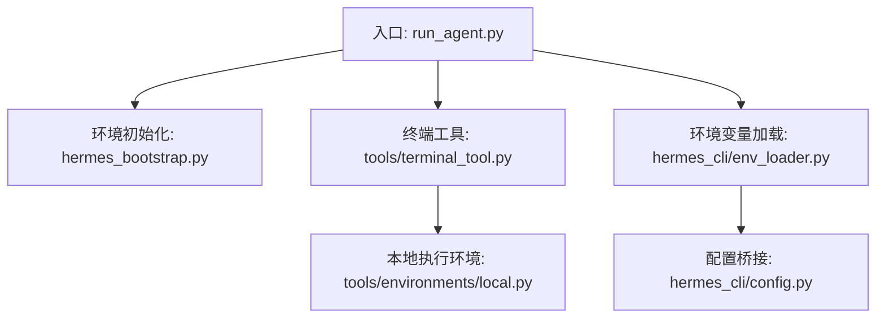
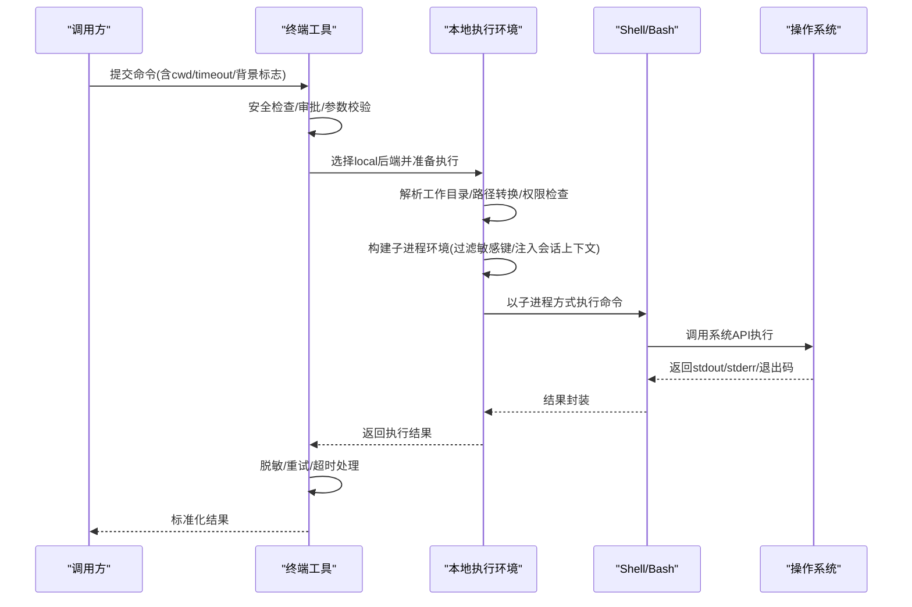
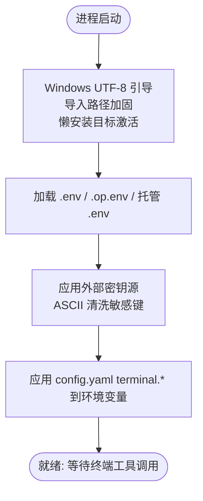
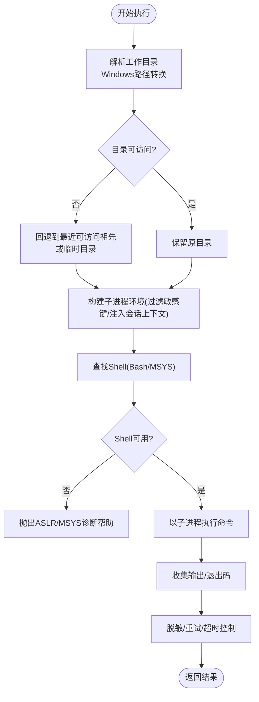
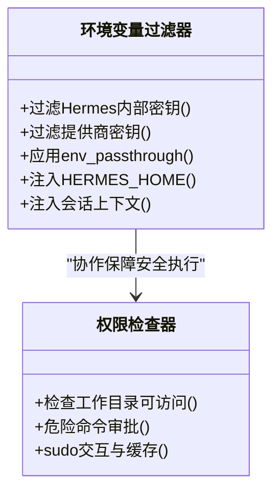
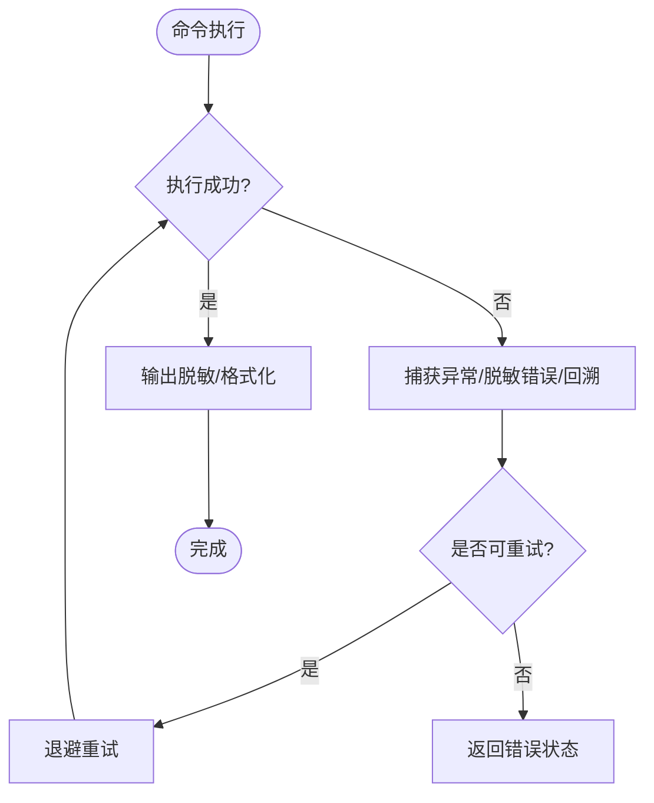
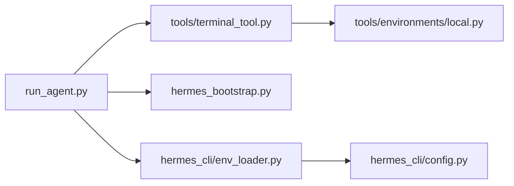

# 本地执行环境

<cite>
**本文引用的文件**
- [hermes_bootstrap.py](file://hermes_bootstrap.py)
- [run_agent.py](file://run_agent.py)
- [tools/terminal_tool.py](file://tools/terminal_tool.py)
- [tools/environments/local.py](file://tools/environments/local.py)
- [hermes_cli/env_loader.py](file://hermes_cli/env_loader.py)
- [hermes_cli/config.py](file://hermes_cli/config.py)
</cite>

## 目录
1. [简介](#简介)
2. [项目结构](#项目结构)
3. [核心组件](#核心组件)
4. [架构总览](#架构总览)
5. [详细组件分析](#详细组件分析)
6. [依赖关系分析](#依赖关系分析)
7. [性能考虑](#性能考虑)
8. [故障排除指南](#故障排除指南)
9. [结论](#结论)
10. [附录：配置示例与使用场景](#附录配置示例与使用场景)

## 简介
本文件面向“本地执行模式”的落地实现，系统性说明进程隔离机制、资源管理策略、环境变量传递、文件路径映射与权限控制；并给出启动流程、生命周期管理与错误处理机制。同时提供最佳实践、性能优化建议与故障排除指南，以及可操作的配置示例和使用场景。

## 项目结构
围绕本地执行的关键代码分布在以下模块：
- 入口与环境初始化：hermes_bootstrap.py、run_agent.py
- 终端工具与后端选择：tools/terminal_tool.py
- 本地执行环境实现：tools/environments/local.py
- 环境变量加载与清理：hermes_cli/env_loader.py
- 配置桥接与键白名单：hermes_cli/config.py

图表来源
- [run_agent.py:1-150](file://run_agent.py#L1-L150)
- [hermes_bootstrap.py:1-240](file://hermes_bootstrap.py#L1-L240)
- [tools/terminal_tool.py:1-120](file://tools/terminal_tool.py#L1-L120)
- [tools/environments/local.py:1-120](file://tools/environments/local.py#L1-L120)
- [hermes_cli/env_loader.py:462-529](file://hermes_cli/env_loader.py#L462-L529)
- [hermes_cli/config.py:1-200](file://hermes_cli/config.py#L1-L200)

章节来源
- [run_agent.py:1-150](file://run_agent.py#L1-L150)
- [hermes_bootstrap.py:1-240](file://hermes_bootstrap.py#L1-L240)
- [tools/terminal_tool.py:1-120](file://tools/terminal_tool.py#L1-L120)
- [tools/environments/local.py:1-120](file://tools/environments/local.py#L1-L120)
- [hermes_cli/env_loader.py:462-529](file://hermes_cli/env_loader.py#L462-L529)
- [hermes_cli/config.py:1-200](file://hermes_cli/config.py#L1-L200)

## 核心组件
- 入口与环境引导
  - Windows UTF-8 引导、导入路径加固、持久化懒安装目标激活等，确保跨平台一致性与子进程编码安全。
- 终端工具（Terminal Tool）
  - 统一命令执行入口，支持 local/docker/modal/vercel_sandbox 等多后端；在本地模式下通过 Bash/Shell 调用系统命令。
- 本地执行环境（Local Environment）
  - 每次调用派生子进程，基于工作目录、Shell 查找、路径转换、权限校验与安全过滤构建运行环境。
- 环境变量加载器（Env Loader）
  - 按优先级加载用户 .env、项目 .env、托管范围 .env，注入外部密钥源，并对敏感键进行 ASCII 清洗与覆盖控制。
- 配置桥接（Config Bridge）
  - 将 config.yaml 中的 terminal.* 显式键重新应用到环境变量，保证配置为最终权威来源；并提供写入保护的环境变量黑名单。

章节来源
- [hermes_bootstrap.py:59-122](file://hermes_bootstrap.py#L59-L122)
- [hermes_bootstrap.py:168-226](file://hermes_bootstrap.py#L168-L226)
- [tools/terminal_tool.py:1-120](file://tools/terminal_tool.py#L1-L120)
- [tools/environments/local.py:25-153](file://tools/environments/local.py#L25-L153)
- [hermes_cli/env_loader.py:462-529](file://hermes_cli/env_loader.py#L462-L529)
- [hermes_cli/config.py:157-200](file://hermes_cli/config.py#L157-L200)

## 架构总览
本地执行模式的总体流程如下：
- 进程启动时完成 UTF-8 与导入路径加固，加载 .env 与配置，建立会话上下文。
- 终端工具根据 TERMINAL_ENV 或配置选择 backend；local 模式进入本地执行环境。
- 本地执行环境解析工作目录、查找 Shell、构造子进程环境（严格过滤敏感键），并以子进程方式执行命令。
- 输出与错误经过脱敏与重试/超时控制后返回给上层。

图表来源
- [tools/terminal_tool.py:1-120](file://tools/terminal_tool.py#L1-L120)
- [tools/environments/local.py:25-153](file://tools/environments/local.py#L25-L153)
- [tools/environments/local.py:456-513](file://tools/environments/local.py#L456-L513)
- [hermes_cli/env_loader.py:462-529](file://hermes_cli/env_loader.py#L462-L529)

## 详细组件分析

### 启动流程与环境引导
- Windows UTF-8 引导：设置 PYTHONUTF8/PYTHONIOENCODING，重配 stdio，避免子进程编码崩溃。
- 导入路径加固：移除当前目录污染，强制将源码根置于 sys.path 首位，防止同名包遮蔽。
- 持久化懒安装目标：在不可变镜像中启用数据卷上的懒安装包路径，使后续导入可用。
- 环境变量加载：按顺序加载用户 .env、项目 .env、托管 .env，应用外部密钥源，并将 config.yaml 的 terminal.* 显式键覆盖回环境变量。

图表来源
- [hermes_bootstrap.py:59-122](file://hermes_bootstrap.py#L59-L122)
- [hermes_bootstrap.py:168-226](file://hermes_bootstrap.py#L168-L226)
- [hermes_cli/env_loader.py:462-529](file://hermes_cli/env_loader.py#L462-L529)

章节来源
- [hermes_bootstrap.py:59-122](file://hermes_bootstrap.py#L59-L122)
- [hermes_bootstrap.py:168-226](file://hermes_bootstrap.py#L168-L226)
- [hermes_cli/env_loader.py:462-529](file://hermes_cli/env_loader.py#L462-L529)

### 本地执行模式：进程隔离与资源管理
- 进程隔离
  - 每次命令执行以子进程方式运行，避免共享状态污染。
  - 子进程环境通过严格过滤器剔除 Hermes 内部密钥、提供商密钥、消息通道令牌等敏感信息。
  - 对并发多会话宿主，注入会话上下文 ContextVar 快照，并在未绑定时剥离全局镜像，防止跨会话泄漏。
- 工作目录与路径映射
  - 解析相对/绝对工作目录，Windows 下 MSYS/Git Bash 路径双向转换，确保 cd 与 Popen 一致。
  - 若配置的 cwd 不可用（权限/不存在），自动回退至最近的可访问祖先目录，极端情况回退到临时目录。
- Shell 查找与健壮性
  - 优先使用内置便携 Git Bash，其次 PATH 查找；失败时记录诊断信息并抛出明确帮助提示。
- 资源限制
  - 前台命令存在最大超时上限，可通过环境变量调整；磁盘使用告警周期性扫描并缓存结果。
- sudo 交互与缓存
  - 交互式 sudo 密码输入，带超时与缓存；认证失败时自动清除缓存，避免阻塞后续命令。

图表来源
- [tools/environments/local.py:25-153](file://tools/environments/local.py#L25-L153)
- [tools/environments/local.py:456-513](file://tools/environments/local.py#L456-L513)
- [tools/environments/local.py:722-800](file://tools/environments/local.py#L722-L800)
- [tools/terminal_tool.py:118-133](file://tools/terminal_tool.py#L118-L133)
- [tools/terminal_tool.py:486-609](file://tools/terminal_tool.py#L486-L609)

章节来源
- [tools/environments/local.py:25-153](file://tools/environments/local.py#L25-L153)
- [tools/environments/local.py:456-513](file://tools/environments/local.py#L456-L513)
- [tools/environments/local.py:722-800](file://tools/environments/local.py#L722-L800)
- [tools/terminal_tool.py:118-133](file://tools/terminal_tool.py#L118-L133)
- [tools/terminal_tool.py:486-609](file://tools/terminal_tool.py#L486-L609)

### 环境变量传递与权限控制
- 环境变量传递
  - 从 os.environ 快照构建子进程环境，剔除受保护的 Hermes 内部键与提供商密钥。
  - 支持 env_passthrough 技能级透传，允许特定键按需传入。
  - 注入 HERMES_HOME 覆盖与子进程 HOME 契约，确保配置与状态隔离。
  - 在多会话并发环境下，通过 ContextVar 注入会话标识，未绑定则剥离全局镜像，防止跨会话泄漏。
- 权限控制
  - 工作目录必须可执行访问；否则自动回退。
  - 危险命令审批与 sudo 交互，结合会话/回调作用域缓存密码，避免误用。
  - 写入保护的环境变量黑名单，禁止通过 Dashboard 等表面修改关键运行时变量。

图表来源
- [tools/environments/local.py:456-513](file://tools/environments/local.py#L456-L513)
- [tools/environments/local.py:574-656](file://tools/environments/local.py#L574-L656)
- [tools/terminal_tool.py:345-381](file://tools/terminal_tool.py#L345-L381)
- [tools/terminal_tool.py:486-609](file://tools/terminal_tool.py#L486-L609)
- [hermes_cli/config.py:157-200](file://hermes_cli/config.py#L157-L200)

章节来源
- [tools/environments/local.py:456-513](file://tools/environments/local.py#L456-L513)
- [tools/environments/local.py:574-656](file://tools/environments/local.py#L574-L656)
- [tools/terminal_tool.py:345-381](file://tools/terminal_tool.py#L345-L381)
- [tools/terminal_tool.py:486-609](file://tools/terminal_tool.py#L486-L609)
- [hermes_cli/config.py:157-200](file://hermes_cli/config.py#L157-L200)

### 生命周期管理与错误处理
- 生命周期
  - 前端命令默认前台执行，支持后台任务；后台任务通过进程注册表管理，具备独立生命周期。
  - 空闲清理线程维护环境活跃状态，避免僵尸进程。
- 错误处理
  - 所有异常输出与回溯均进行敏感信息脱敏，避免泄露密钥。
  - 超时控制：前台命令有硬上限，可通过环境变量调整。
  - 磁盘使用告警：周期性扫描并缓存结果，避免频繁 IO。
  - Shell 启动失败：诊断 ASLR/MSYS 问题并给出修复指引。

图表来源
- [tools/terminal_tool.py:118-133](file://tools/terminal_tool.py#L118-L133)
- [tools/terminal_tool.py:205-243](file://tools/terminal_tool.py#L205-L243)
- [tests/tools/test_terminal_error_redaction.py:47-154](file://tests/tools/test_terminal_error_redaction.py#L47-L154)

章节来源
- [tools/terminal_tool.py:118-133](file://tools/terminal_tool.py#L118-L133)
- [tools/terminal_tool.py:205-243](file://tools/terminal_tool.py#L205-L243)
- [tests/tools/test_terminal_error_redaction.py:47-154](file://tests/tools/test_terminal_error_redaction.py#L47-L154)

## 依赖关系分析
- 入口层
  - run_agent.py 负责整体编排，导入终端工具与环境引导模块。
- 环境层
  - hermes_bootstrap.py 提供跨平台一致性保障。
  - hermes_cli/env_loader.py 负责 .env 与外部密钥源加载。
  - hermes_cli/config.py 提供配置桥接与写入保护。
- 执行层
  - tools/terminal_tool.py 作为统一入口，调度具体后端。
  - tools/environments/local.py 实现本地执行细节。

图表来源
- [run_agent.py:1-150](file://run_agent.py#L1-L150)
- [hermes_bootstrap.py:1-240](file://hermes_bootstrap.py#L1-L240)
- [hermes_cli/env_loader.py:462-529](file://hermes_cli/env_loader.py#L462-L529)
- [hermes_cli/config.py:1-200](file://hermes_cli/config.py#L1-L200)
- [tools/terminal_tool.py:1-120](file://tools/terminal_tool.py#L1-L120)
- [tools/environments/local.py:1-120](file://tools/environments/local.py#L1-L120)

章节来源
- [run_agent.py:1-150](file://run_agent.py#L1-L150)
- [hermes_bootstrap.py:1-240](file://hermes_bootstrap.py#L1-L240)
- [hermes_cli/env_loader.py:462-529](file://hermes_cli/env_loader.py#L462-L529)
- [hermes_cli/config.py:1-200](file://hermes_cli/config.py#L1-L200)
- [tools/terminal_tool.py:1-120](file://tools/terminal_tool.py#L1-L120)
- [tools/environments/local.py:1-120](file://tools/environments/local.py#L1-L120)

## 性能考虑
- 子进程开销
  - 本地模式每次命令派生子进程，适合短任务；长驻服务建议使用后台任务或容器后端。
- 超时与重试
  - 合理设置前台超时上限，避免长时间阻塞；必要时启用重试与退避。
- 磁盘扫描
  - 磁盘使用告警采用缓存策略，减少频繁 IO；建议定期清理无用数据。
- Shell 查找
  - 优先使用便携 Git Bash，避免系统 Git 损坏导致启动失败；必要时自定义路径。
- 环境变量过滤
  - 严格过滤敏感键可减少不必要的网络请求与鉴权失败；按需开启 env_passthrough 提升灵活性。

[本节为通用指导，不直接分析具体文件]

## 故障排除指南
- 无法找到 Bash/Shell
  - 检查便携 Git Bash 是否存在，或设置 HERMES_GIT_BASH_PATH；确认 ASLR/MSYS 相关错误并参考诊断提示修复。
- 工作目录不可访问
  - 检查权限与路径有效性；系统会自动回退到可访问祖先目录或临时目录。
- 环境变量泄露或冲突
  - 确认 env_passthrough 配置；检查敏感键是否被正确过滤；避免在 .env 中残留过期值。
- sudo 交互失败
  - 检查缓存密码是否正确；认证失败会清空缓存；必要时重新输入或禁用 sudo。
- 输出包含敏感信息
  - 确认脱敏已启用；测试用例验证错误与回溯会被脱敏。

章节来源
- [tools/environments/local.py:722-800](file://tools/environments/local.py#L722-L800)
- [tools/environments/local.py:155-197](file://tools/environments/local.py#L155-L197)
- [tools/terminal_tool.py:486-609](file://tools/terminal_tool.py#L486-L609)
- [tests/tools/test_terminal_error_redaction.py:47-154](file://tests/tools/test_terminal_error_redaction.py#L47-L154)

## 结论
本地执行模式通过严格的进程隔离、环境变量过滤与工作目录回退机制，在保证安全性的前提下提供高效的命令执行能力。配合完善的错误处理、超时控制与磁盘监控，能够在多种环境中稳定运行。建议在生产场景中结合后台任务与容器后端，以获得更好的可扩展性与资源管理能力。

[本节为总结，不直接分析具体文件]

## 附录：配置示例与使用场景
- 基本本地执行
  - 设置 TERMINAL_ENV=local（或通过 config.yaml terminal.backend），指定工作目录与超时。
- 后台任务
  - 使用 background=True 启动长驻服务，并通过进程注册表管理生命周期。
- 安全透传
  - 通过 env_passthrough 技能允许特定环境变量传入子进程，满足工具链需求。
- 多会话隔离
  - 在网关或多会话环境中，确保会话上下文正确注入，避免跨会话泄漏。
- 权限与 sudo
  - 配置 sudo 交互与密码缓存，提高自动化脚本成功率；注意认证失败时的缓存清理。

章节来源
- [tools/terminal_tool.py:1-120](file://tools/terminal_tool.py#L1-L120)
- [tools/environments/local.py:456-513](file://tools/environments/local.py#L456-L513)
- [hermes_cli/env_loader.py:462-529](file://hermes_cli/env_loader.py#L462-L529)
- [hermes_cli/config.py:157-200](file://hermes_cli/config.py#L157-L200)