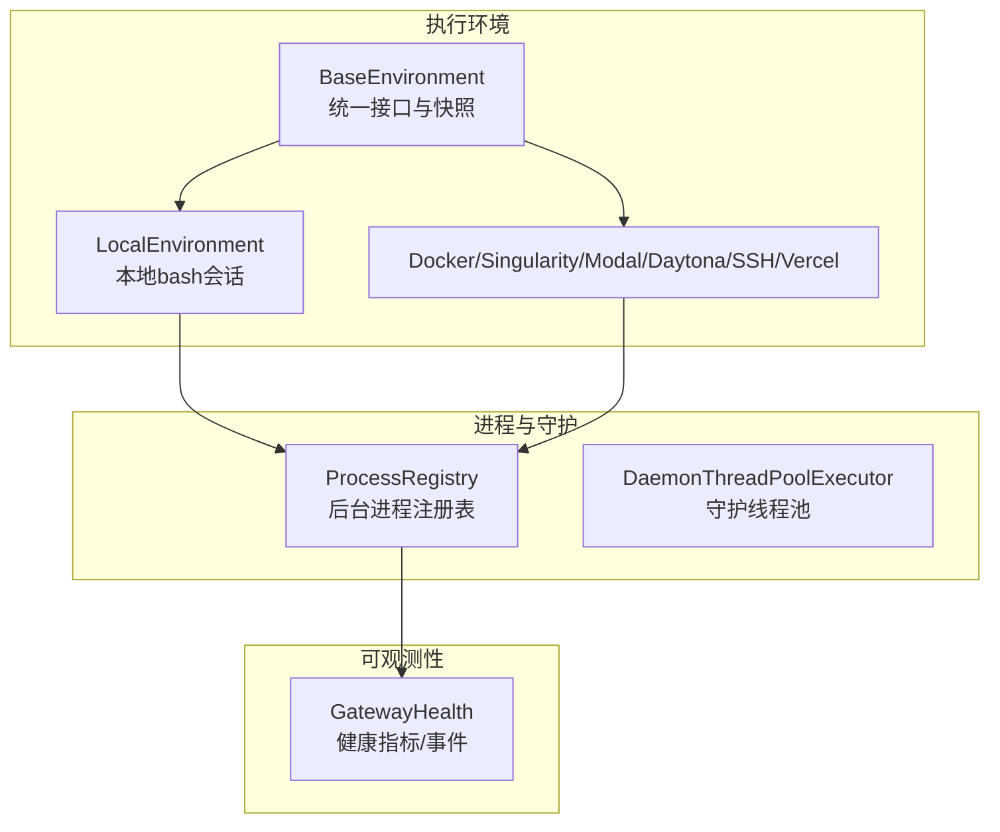
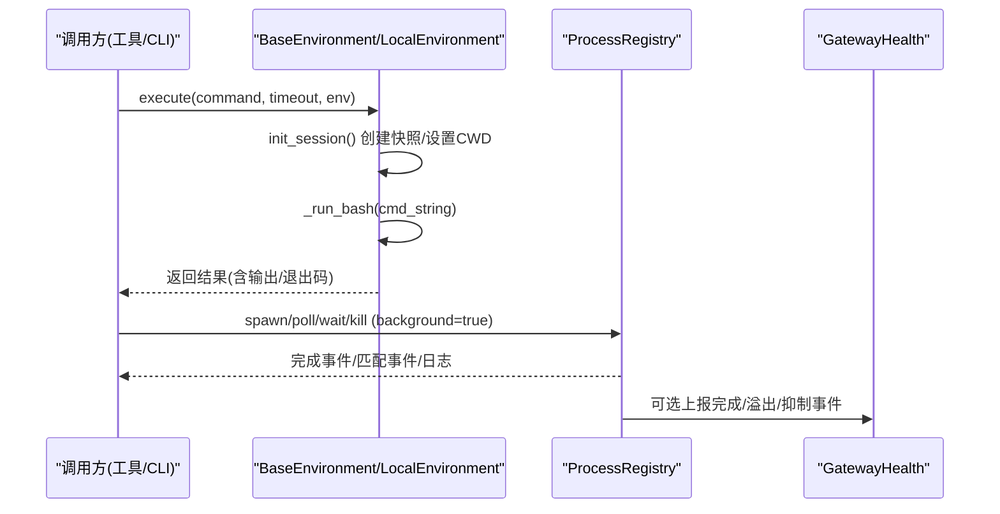
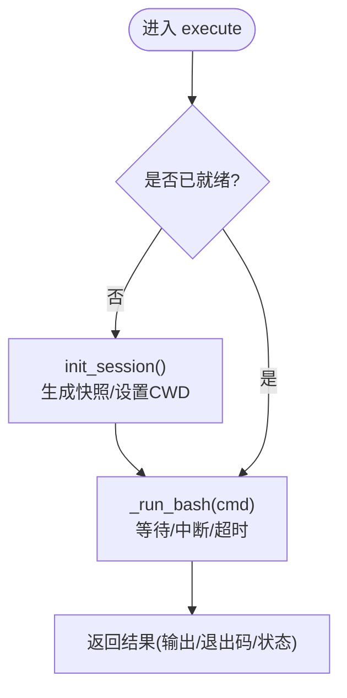
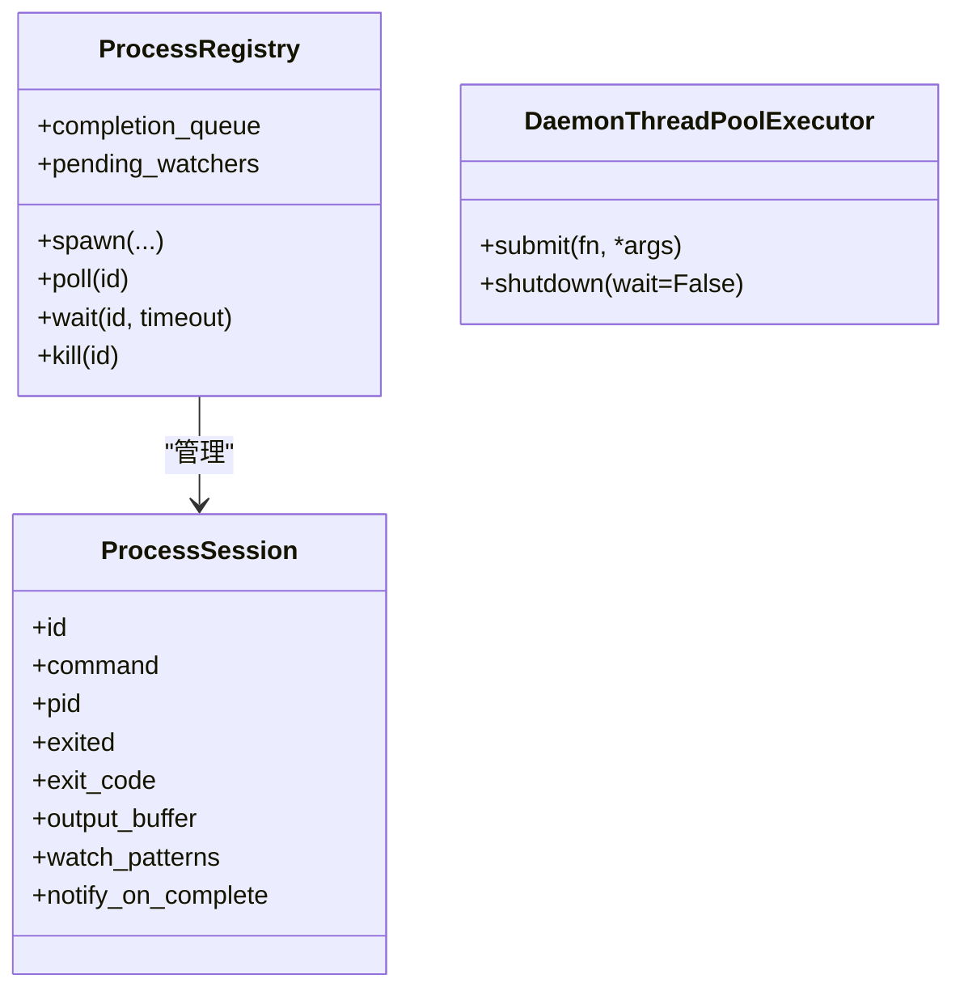
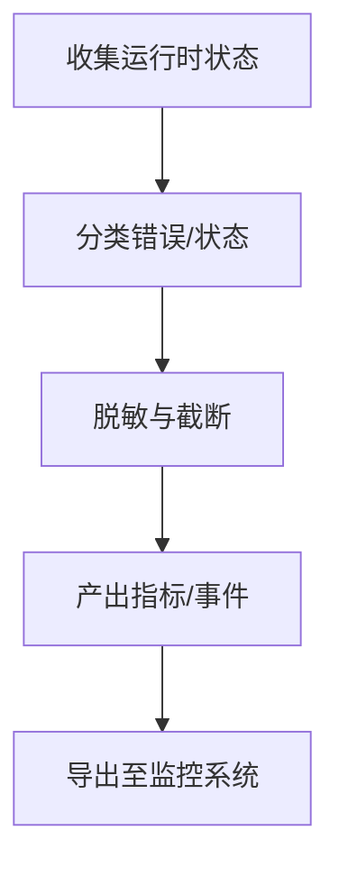
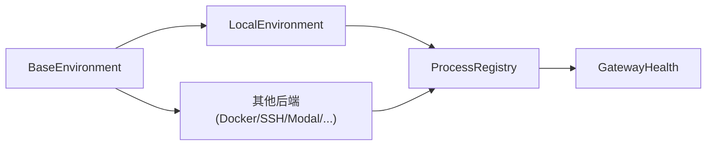

# 环境管理与选择

<cite>
**本文引用的文件**
- [tools/environments/base.py](file://tools/environments/base.py)
- [tools/environments/local.py](file://tools/environments/local.py)
- [tools/process_registry.py](file://tools/process_registry.py)
- [tools/daemon_pool.py](file://tools/daemon_pool.py)
- [agent/monitoring/gateway_health.py](file://agent/monitoring/gateway_health.py)
- [tests/tools/test_terminal_error_redaction.py](file://tests/tools/test_terminal_error_redaction.py)
</cite>

## 目录
1. [简介](#简介)
2. [项目结构](#项目结构)
3. [核心组件](#核心组件)
4. [架构总览](#架构总览)
5. [详细组件分析](#详细组件分析)
6. [依赖关系分析](#依赖关系分析)
7. [性能考量](#性能考量)
8. [故障排除指南](#故障排除指南)
9. [结论](#结论)
10. [附录](#附录)

## 简介
本文件聚焦于 Hermes Agent 的执行环境管理与选择，覆盖以下主题：
- 环境选择策略与动态切换（本地、容器化、远程等）
- 负载均衡与健康检查机制
- 进程注册表管理、守护进程池维护与资源监控
- 环境切换的动态配置、热重载与无缝迁移
- 环境健康状态的实时监控、告警通知与自动恢复
- 性能基准测试、瓶颈分析与优化建议
- 最佳实践与故障排除

## 项目结构
围绕执行环境的关键代码主要分布在如下模块：
- 环境抽象与实现：tools/environments/*（base、local、docker、ssh、modal、daytona、singularity、vercel_sandbox 等）
- 进程注册与后台任务：tools/process_registry.py
- 守护线程池：tools/daemon_pool.py
- 网关健康与诊断：agent/monitoring/gateway_health.py
- 终端工具错误脱敏与行为验证：tests/tools/test_terminal_error_redaction.py

**图示来源**
- [tools/environments/base.py:553-780](file://tools/environments/base.py#L553-L780)
- [tools/environments/local.py:1-200](file://tools/environments/local.py#L1-L200)
- [tools/process_registry.py:341-467](file://tools/process_registry.py#L341-L467)
- [tools/daemon_pool.py:1-65](file://tools/daemon_pool.py#L1-L65)
- [agent/monitoring/gateway_health.py:20-200](file://agent/monitoring/gateway_health.py#L20-L200)

**章节来源**
- [tools/environments/base.py:553-780](file://tools/environments/base.py#L553-L780)
- [tools/environments/local.py:1-200](file://tools/environments/local.py#L1-L200)
- [tools/process_registry.py:341-467](file://tools/process_registry.py#L341-L467)
- [tools/daemon_pool.py:1-65](file://tools/daemon_pool.py#L1-L65)
- [agent/monitoring/gateway_health.py:20-200](file://agent/monitoring/gateway_health.py#L20-L200)

## 核心组件
- BaseEnvironment：定义统一的“每次调用派生一个 bash -c”执行模型，负责会话快照、CWD 跟踪、中断处理与超时控制。提供 init_session、execute 流程与 _run_bash 抽象。
- LocalEnvironment：在宿主机上通过 bash 执行命令，处理路径转换、安全 CWD 回退、环境变量注入与快照生成。
- ProcessRegistry：内存级后台进程注册表，提供输出缓冲、状态轮询、阻塞等待、进程终止、崩溃恢复、watch 模式与全局防抖。
- DaemonThreadPoolExecutor：基于标准库 ThreadPoolExecutor 的守护线程变体，避免非守护线程导致解释器退出阻塞。
- GatewayHealth：网关健康与诊断信号生产者，对指标和事件进行脱敏与分类，用于导出与告警。

**章节来源**
- [tools/environments/base.py:553-780](file://tools/environments/base.py#L553-L780)
- [tools/environments/local.py:1-200](file://tools/environments/local.py#L1-L200)
- [tools/process_registry.py:341-467](file://tools/process_registry.py#L341-L467)
- [tools/daemon_pool.py:1-65](file://tools/daemon_pool.py#L1-L65)
- [agent/monitoring/gateway_health.py:20-200](file://agent/monitoring/gateway_health.py#L20-L200)

## 架构总览
下图展示了从工具调用到环境执行、后台进程管理与健康监控的整体流程。

**图示来源**
- [tools/environments/base.py:660-780](file://tools/environments/base.py#L660-L780)
- [tools/process_registry.py:412-467](file://tools/process_registry.py#L412-L467)
- [agent/monitoring/gateway_health.py:20-200](file://agent/monitoring/gateway_health.py#L20-L200)

## 详细组件分析

### 环境抽象与本地实现
- 统一执行模型：每次调用启动新的 bash -c 子进程；首次初始化时捕获登录 shell 的环境快照（变量、函数、别名），后续命令 source 该快照以保持一致性。
- CWD 持久化：通过带内标记或临时文件记录工作目录，确保跨命令一致。
- 快照隔离：排除每会话桥接变量，防止跨会话泄漏；使用原子写入避免并发读取损坏。
- 失败回退：当 login bash 不可用时，自动降级为非登录 bash -c，保证基本 PATH/工具可用。
- 本地路径与安全 CWD：Windows/MSYS/Git Bash 路径转换、权限检查与回退到可访问目录。

**图示来源**
- [tools/environments/base.py:660-780](file://tools/environments/base.py#L660-L780)
- [tools/environments/local.py:1-200](file://tools/environments/local.py#L1-L200)

**章节来源**
- [tools/environments/base.py:660-780](file://tools/environments/base.py#L660-L780)
- [tools/environments/local.py:1-200](file://tools/environments/local.py#L1-L200)

### 进程注册表与守护进程池
- 进程注册表职责：
  - 后台进程生命周期管理（spawn/poll/wait/kill）
  - 滚动输出缓冲（限制大小，避免内存膨胀）
  - watch 模式与速率限制（单会话冷却、全局熔断）
  - 崩溃恢复（checkpoint 文件重建）
  - 会话重置保护（session_key）
- 守护线程池：
  - 使用守护线程避免解释器退出被挂起
  - 适用于工具并发执行、后台同步、目录扫描等“尽力而为”的任务

**图示来源**
- [tools/process_registry.py:341-467](file://tools/process_registry.py#L341-L467)
- [tools/daemon_pool.py:37-65](file://tools/daemon_pool.py#L37-L65)

**章节来源**
- [tools/process_registry.py:341-467](file://tools/process_registry.py#L341-L467)
- [tools/daemon_pool.py:1-65](file://tools/daemon_pool.py#L1-L65)

### 健康检查、监控与告警
- 健康快照与指标：
  - 将网关运行状态、平台状态、活跃代理数等转化为指标与事件
  - 对自由文本进行脱敏与长度限制，仅导出操作所需的最小信息
- 事件分类：
  - 认证失败、限流、超时、网络错误、配置无效、启动失败、致命错误等
- 导出与集成：
  - 通过 OTLP 或其他导出通道上报，供监控系统消费并触发告警

**图示来源**
- [agent/monitoring/gateway_health.py:20-200](file://agent/monitoring/gateway_health.py#L20-L200)

**章节来源**
- [agent/monitoring/gateway_health.py:20-200](file://agent/monitoring/gateway_health.py#L20-L200)

### 环境切换、热重载与无缝迁移
- 动态配置：
  - 通过终端工具的配置项（如 env_type、cwd、超时、镜像等）决定目标环境
  - 支持本地、Docker、Singularity、Modal、Daytona、SSH、Vercel Sandbox 等多种后端
- 热重载与无缝迁移：
  - 会话快照机制使新命令复用已加载的环境状态，减少冷启动开销
  - 当后端不可达时抛出基础设施异常，上层将其转为结构化“降级”结果，便于重试与恢复
  - 进程注册表支持崩溃恢复与 watch 模式降级为“完成即通知”，保障可用性

**章节来源**
- [tests/tools/test_terminal_error_redaction.py:13-39](file://tests/tools/test_terminal_error_redaction.py#L13-L39)
- [tools/environments/base.py:55-79](file://tools/environments/base.py#L55-L79)
- [tools/process_registry.py:487-700](file://tools/process_registry.py#L487-L700)

## 依赖关系分析
- 环境层依赖：
  - BaseEnvironment 被各具体后端（local/docker/ssh/modal 等）继承实现
  - LocalEnvironment 依赖系统 bash、路径解析与权限检查
- 进程层依赖：
  - ProcessRegistry 依赖系统进程能力（psutil、systemd-run 探测）、队列与锁
  - DaemonThreadPoolExecutor 依赖标准库线程池并修改线程守护属性
- 监控层依赖：
  - GatewayHealth 依赖网关状态与脱敏工具，产出标准化指标/事件

**图示来源**
- [tools/environments/base.py:553-780](file://tools/environments/base.py#L553-L780)
- [tools/process_registry.py:341-467](file://tools/process_registry.py#L341-L467)
- [agent/monitoring/gateway_health.py:20-200](file://agent/monitoring/gateway_health.py#L20-L200)

**章节来源**
- [tools/environments/base.py:553-780](file://tools/environments/base.py#L553-L780)
- [tools/process_registry.py:341-467](file://tools/process_registry.py#L341-L467)
- [agent/monitoring/gateway_health.py:20-200](file://agent/monitoring/gateway_health.py#L20-L200)

## 性能考量
- 输出缓冲与溢出转储：
  - 前端保留头部与尾部窗口，避免大输出撑爆内存；溢出时写 spill 文件以便回溯
- 快照与 CWD：
  - 原子写入快照避免并发读取损坏；排除每会话变量，避免快照污染
- 后台进程资源：
  - 滚动输出缓冲限制大小；watch 模式具备会话级冷却与全局熔断，防止消息风暴
  - systemd cgroup 隔离与内存上限，避免单个 worker OOM 拖垮网关
- 线程池：
  - 守护线程避免解释器退出阻塞；适合“尽力而为”的后台任务

[本节为通用性能讨论，不直接分析具体文件]

## 故障排除指南
- 常见错误与定位：
  - 后端不可达（SSH/Docker/远程服务）：会抛出基础设施异常，上层转为“降级”结果，检查网络/凭据/服务状态后重试
  - 快照初始化失败：自动降级为非登录 bash，检查 bash 环境与 Windows Git Bash 路径问题
  - 后台进程无法停止：优先尝试 systemd scope 停止；若不可用则回退到 PID 树杀
  - watch 模式频繁触发：会话级冷却与全局熔断会自动抑制；必要时降级为“完成即通知”
- 调试建议：
  - 开启中断调试开关以观察心跳与活动回调
  - 检查进程注册表的 completion_queue 与 pending_watchers 获取完成/匹配事件
  - 使用网关健康导出查看指标与事件，确认服务状态与平台连接情况

**章节来源**
- [tools/environments/base.py:55-79](file://tools/environments/base.py#L55-L79)
- [tools/process_registry.py:487-700](file://tools/process_registry.py#L487-L700)
- [agent/monitoring/gateway_health.py:70-134](file://agent/monitoring/gateway_health.py#L70-L134)

## 结论
Hermes Agent 在执行环境管理与选择方面提供了统一抽象、多后端支持与健壮的进程管理能力。通过会话快照、原子写入、CWD 持久化、后台进程注册表与守护线程池，系统在可用性、稳定性与可观测性上具备良好基础。结合健康检查、指标与事件导出，可实现实时监控、告警与自动恢复。建议在部署中合理配置 watch 模式阈值、cgroup 内存上限与快照超时，以获得更优的性能与可靠性。

[本节为总结性内容，不直接分析具体文件]

## 附录
- 关键流程参考：
  - 环境初始化与命令执行：见 BaseEnvironment 的 init_session 与 execute 流程
  - 后台进程生命周期：见 ProcessRegistry 的 spawn/poll/wait/kill 与 completion_queue
  - 健康指标与事件：见 GatewayHealth 的指标采集、分类与导出

[本节为补充说明，不直接分析具体文件]