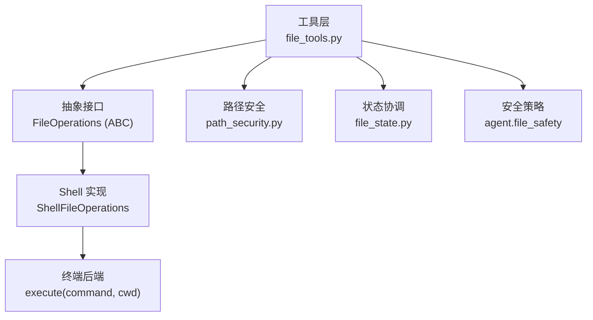
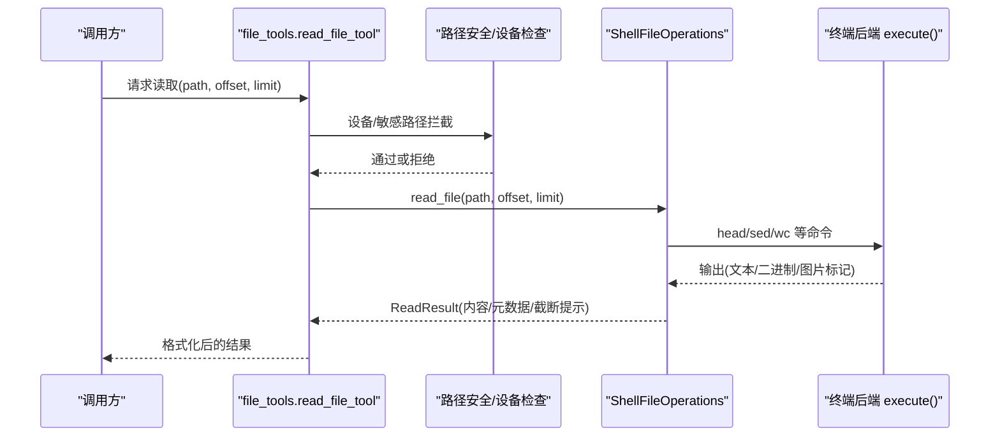
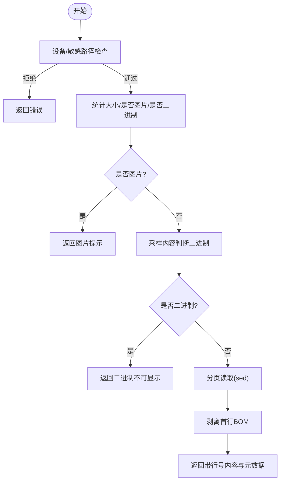
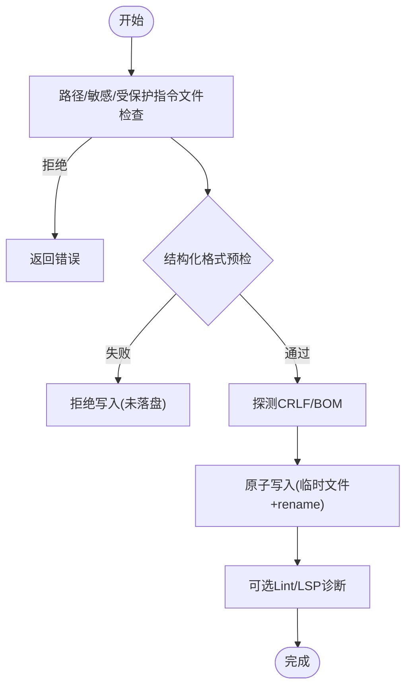
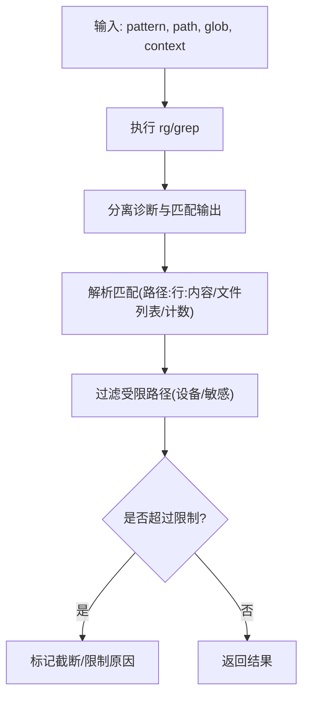
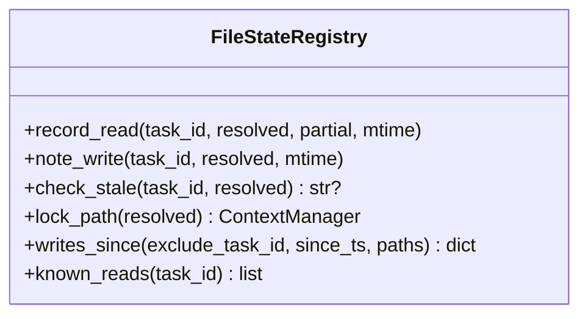
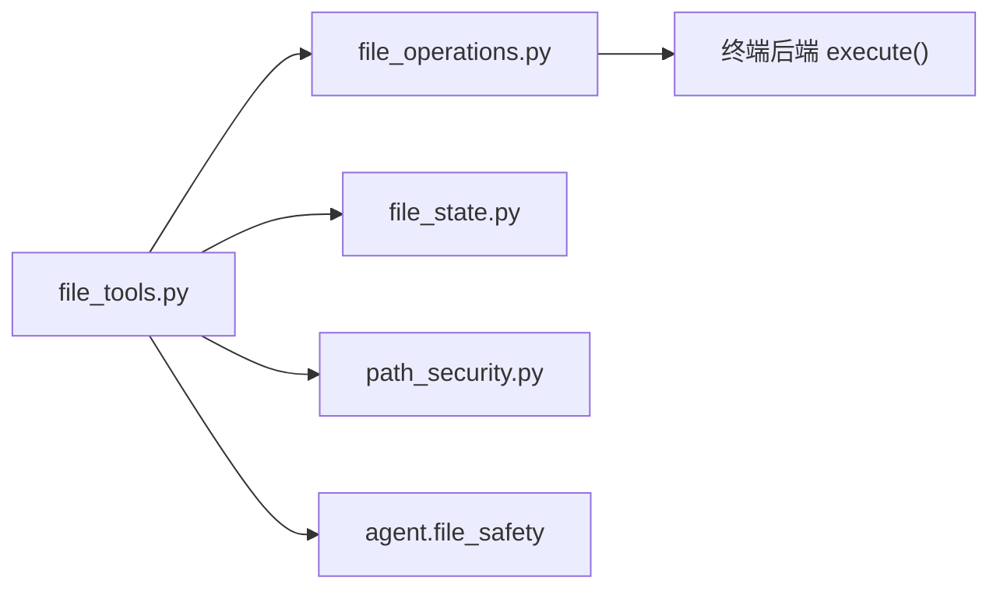

# 文件操作工具

<cite>
**本文引用的文件**
- [tools/file_operations.py](file://tools/file_operations.py)
- [tools/file_tools.py](file://tools/file_tools.py)
- [tools/file_state.py](file://tools/file_state.py)
- [tools/path_security.py](file://tools/path_security.py)
</cite>

## 目录
1. [简介](#简介)
2. [项目结构](#项目结构)
3. [核心组件](#核心组件)
4. [架构总览](#架构总览)
5. [详细组件分析](#详细组件分析)
6. [依赖关系分析](#依赖关系分析)
7. [性能考量](#性能考量)
8. [故障排查指南](#故障排查指南)
9. [结论](#结论)
10. [附录](#附录)

## 简介
本文件面向 Hermes Agent 的文件系统访问与管理能力，系统性说明文件读写、目录与路径安全、搜索、批量操作、格式校验与转换、压缩/解压（通过终端命令）、状态监控与变更检测、权限控制与沙箱隔离等。文档同时提供大文件处理、内存优化与错误恢复的最佳实践，并给出备份、同步、迁移等常见任务的实用示例思路。

## 项目结构
Hermes 的文件操作由“工具层 + 实现层 + 状态与安全”三部分构成：
- 工具层：对外暴露统一 API（read/write/patch/search/delete/move 等），负责参数归一化、路径解析、安全校验、结果格式化与提示。
- 实现层：基于 ShellFileOperations 将操作转换为跨后端的 shell 命令（local/docker/ssh/modal/daytona 等）。
- 状态与安全：进程内文件状态协调（防并发覆盖）、路径安全校验（越界/设备/敏感路径）、写保护指令文件审批等。

图表来源
- [tools/file_tools.py:1517-1599](file://tools/file_tools.py#L1517-L1599)
- [tools/file_operations.py:450-514](file://tools/file_operations.py#L450-L514)
- [tools/file_operations.py:808-881](file://tools/file_operations.py#L808-L881)
- [tools/path_security.py:15-44](file://tools/path_security.py#L15-L44)
- [tools/file_state.py:59-91](file://tools/file_state.py#L59-L91)

章节来源
- [tools/file_tools.py:1517-1599](file://tools/file_tools.py#L1517-L1599)
- [tools/file_operations.py:450-514](file://tools/file_operations.py#L450-L514)
- [tools/file_operations.py:808-881](file://tools/file_operations.py#L808-L881)
- [tools/path_security.py:15-44](file://tools/path_security.py#L15-L44)
- [tools/file_state.py:59-91](file://tools/file_state.py#L59-L91)

## 核心组件
- FileOperations（抽象接口）：定义 read_file/read_file_raw/write_file/patch_replace/patch_v4a/delete_file/move_file/search 等统一方法，屏蔽后端差异。
- ShellFileOperations（Shell 实现）：通过 execute(command, cwd) 调用底层终端环境执行 shell 命令，完成读、写、删、移、搜等。
- file_tools 工具层：封装路径解析、大小限制、BOM/CRLF 保留、结构化文档提取、设备/敏感路径拦截、受保护指令文件审批、读去重与外部变更检测等。
- file_state 状态协调：记录每任务读/写时间戳与最后写入者，提供 per-path 锁，避免子代理并发覆盖。
- path_security 路径校验：确保目标在允许根目录下，快速检测 .. 穿越。

章节来源
- [tools/file_operations.py:450-514](file://tools/file_operations.py#L450-L514)
- [tools/file_operations.py:808-881](file://tools/file_operations.py#L808-L881)
- [tools/file_tools.py:1517-1599](file://tools/file_tools.py#L1517-L1599)
- [tools/file_state.py:59-91](file://tools/file_state.py#L59-L91)
- [tools/path_security.py:15-44](file://tools/path_security.py#L15-L44)

## 架构总览
下图展示一次典型“读取文件”的端到端流程，包括路径解析、安全检查、分页读取、二进制/图片识别、BOM/CRLF 处理与结果返回。

图表来源
- [tools/file_tools.py:1517-1599](file://tools/file_tools.py#L1517-L1599)
- [tools/file_operations.py:1148-1243](file://tools/file_operations.py#L1148-L1243)
- [tools/file_operations.py:808-881](file://tools/file_operations.py#L808-L881)

## 详细组件分析

### 文件读取（分页、二进制/图片、BOM/CRLF 保留）
- 分页与行号：read_file 支持 offset/limit，自动添加紧凑行号前缀，便于模型定位；超大文件会提示继续读取。
- 二进制/图片：优先按扩展名判断，再采样内容；图片走专用视觉工具提示；二进制以只读方式返回。
- BOM/CRLF：读取时剥离首字节 BOM，写入时探测原文件并恢复；CRLF 文件写入时保持换行风格。
- 结构化文档：对可提取文档类型先尝试二进制转文本，失败则回退到普通路径。

图表来源
- [tools/file_operations.py:1148-1243](file://tools/file_operations.py#L1148-L1243)
- [tools/file_operations.py:79-147](file://tools/file_operations.py#L79-L147)
- [tools/file_tools.py:1517-1599](file://tools/file_tools.py#L1517-L1599)

章节来源
- [tools/file_operations.py:1148-1243](file://tools/file_operations.py#L1148-L1243)
- [tools/file_operations.py:79-147](file://tools/file_operations.py#L79-L147)
- [tools/file_tools.py:1517-1599](file://tools/file_tools.py#L1517-L1599)

### 文件写入（原子写、预检语法门、Lint/LSP 集成）
- 原子写：通过临时文件+同盘 rename 保证写入原子性，失败清理临时文件，不污染源文件。
- 预检语法门：JSON/YAML/TOML 等结构化格式在写入前进行本地解析校验，失败直接拒绝，不落地。
- Lint/LSP：可选运行 shell linter 或 LSP 诊断，仅报告本次引入的新问题，减少噪音。
- 行尾/BOM：写入前探测原文件 CRLF/BOM，必要时转换/恢复，避免隐式破坏。

图表来源
- [tools/file_operations.py:1449-1599](file://tools/file_operations.py#L1449-L1599)
- [tools/file_operations.py:1004-1090](file://tools/file_operations.py#L1004-L1090)
- [tools/file_tools.py:835-955](file://tools/file_tools.py#L835-L955)

章节来源
- [tools/file_operations.py:1449-1599](file://tools/file_operations.py#L1449-L1599)
- [tools/file_operations.py:1004-1090](file://tools/file_operations.py#L1004-L1090)
- [tools/file_tools.py:835-955](file://tools/file_tools.py#L835-L955)

### 补丁与替换（模糊匹配、V4A 补丁、多文件）
- patch_replace：基于旧字符串替换为新字符串，支持全部替换。
- patch_v4a：应用 V4A 格式补丁，支持多文件更新/新增/删除/移动，并在宿主路径下重写头路径以避免工作树分歧。
- 失败追踪：同一文件的连续失败会被计数并升级提示，帮助模型修正上下文。

章节来源
- [tools/file_operations.py:478-487](file://tools/file_operations.py#L478-L487)
- [tools/file_tools.py:460-513](file://tools/file_tools.py#L460-L513)
- [tools/file_tools.py:1082-1128](file://tools/file_tools.py#L1082-L1128)

### 搜索（内容/文件名/上下文/超时与诊断分离）
- 支持内容搜索与文件列表搜索，支持 glob 过滤、上下文行数、分页偏移与限制。
- 输出清洗：将 rg/grep 的诊断信息与真实匹配结果分离，避免误解析。
- 超时与警告：当正则包含换行符但处于单行模式时给出提示；搜索超时会标注原因。

图表来源
- [tools/file_operations.py:357-418](file://tools/file_operations.py#L357-L418)
- [tools/file_operations.py:769-805](file://tools/file_operations.py#L769-L805)
- [tools/file_tools.py:592-638](file://tools/file_tools.py#L592-L638)

章节来源
- [tools/file_operations.py:357-418](file://tools/file_operations.py#L357-L418)
- [tools/file_operations.py:769-805](file://tools/file_operations.py#L769-L805)
- [tools/file_tools.py:592-638](file://tools/file_tools.py#L592-L638)

### 删除与移动（跨平台兼容）
- 删除：优先使用 Python 片段在终端环境中执行，兼容 Windows cmd/PowerShell；支持递归删除目录树。
- 移动：mv 命令封装，路径展开与权限检查。

章节来源
- [tools/file_operations.py:1368-1443](file://tools/file_operations.py#L1368-L1443)

### 路径验证与安全机制
- 工作区基目录解析：根据会话/任务的工作目录、环境变量与容器路径规则解析相对路径，防止工作树分歧。
- 设备/敏感路径拦截：阻止读取 /dev/*、/proc/* 等可能挂起或泄露信息的特殊路径。
- 写保护指令文件：AGENTS.md/CLAUDE.md/SOUL.md/.cursorrules 等影响后续行为的文件，必须人工审批且不可绕过。
- 跨配置/沙箱镜像防护：软告警写入其他 profile 或沙箱镜像目录，防止误改非权威副本。

章节来源
- [tools/file_tools.py:307-438](file://tools/file_tools.py#L307-L438)
- [tools/file_tools.py:516-589](file://tools/file_tools.py#L516-L589)
- [tools/file_tools.py:676-703](file://tools/file_tools.py#L676-L703)
- [tools/file_tools.py:728-832](file://tools/file_tools.py#L728-L832)
- [tools/file_tools.py:992-1049](file://tools/file_tools.py#L992-L1049)
- [tools/path_security.py:15-44](file://tools/path_security.py#L15-L44)

### 文件状态监控与变更检测
- 读/写时间戳记录：记录每个任务对某文件的最近读取时间与最后写入者，用于检测外部修改与并发冲突。
- 并发锁：per-path 线程锁，串行化同一文件的读→改→写，避免子代理互相覆盖。
- 过期检测：写入前检查 mtime 变化、部分读取场景、未知写入者，给出明确提示要求重新读取。

图表来源
- [tools/file_state.py:59-91](file://tools/file_state.py#L59-L91)
- [tools/file_state.py:93-215](file://tools/file_state.py#L93-L215)

章节来源
- [tools/file_state.py:59-215](file://tools/file_state.py#L59-L215)

### 权限控制与沙箱隔离
- 写拒绝清单：构建并复用 agent.file_safety 的写拒绝路径与前缀，阻止写入敏感系统位置。
- 终端后端隔离：所有文件操作通过终端后端 execute() 在指定 cwd 中执行，天然隔离于宿主进程。
- 容器路径规范化：容器环境下避免主机符号链接导致的解析漂移，保证沙箱内路径语义一致。

章节来源
- [tools/file_operations.py:39-55](file://tools/file_operations.py#L39-L55)
- [tools/file_operations.py:808-881](file://tools/file_operations.py#L808-L881)
- [tools/file_tools.py:216-224](file://tools/file_tools.py#L216-L224)

## 依赖关系分析
- file_tools 依赖 file_operations 提供的统一接口与 Shell 实现，以及 file_state 的状态协调和 path_security 的路径校验。
- ShellFileOperations 依赖终端后端 execute()，从而适配多种运行环境（本地、Docker、SSH、Modal、Daytona 等）。
- 安全策略来自 agent.file_safety，提供写拒绝清单与错误信息生成。

图表来源
- [tools/file_tools.py:15-22](file://tools/file_tools.py#L15-L22)
- [tools/file_operations.py:39-44](file://tools/file_operations.py#L39-L44)
- [tools/file_operations.py:808-881](file://tools/file_operations.py#L808-L881)

章节来源
- [tools/file_tools.py:15-22](file://tools/file_tools.py#L15-L22)
- [tools/file_operations.py:39-44](file://tools/file_operations.py#L39-L44)
- [tools/file_operations.py:808-881](file://tools/file_operations.py#L808-L881)

## 性能考量
- 大文件读取：默认分页限制与字符预算裁剪，避免一次性加载导致上下文爆炸；对超大文件建议分段读取。
- 二进制与图片：优先按扩展名快速判定，减少不必要的 I/O；图片走视觉工具而非文本渲染。
- 原子写与最小 I/O：写入前尽量复用已有 pre_content，减少重复 cat；BOM/CRLF 探测仅采样头部。
- 搜索优化：分离诊断与匹配输出，避免错误信息干扰解析；对缺失路径缓存短 TTL，降低重复开销。
- 并发与锁：per-path 锁避免并发写竞争；读/写时间戳用于外部变更检测，减少无效重试。

[本节为通用指导，无需特定文件引用]

## 故障排查指南
- 读取被拒：检查是否为设备路径（/dev/*、/proc/*）或敏感路径；确认工作区基目录是否正确解析。
- 写入失败：查看结构化格式预检错误（JSON/YAML/TOML）；确认是否命中写拒绝清单或受保护指令文件。
- 补丁失败：关注连续失败计数与提示，通常由上下文过时或 old_string 不唯一引起；建议重新读取后再试。
- 搜索无结果：注意正则是否包含换行符但处于单行模式；检查 glob 与路径范围；留意超时与诊断信息。
- 并发覆盖：若出现意外覆盖，检查是否跳过 re-read；利用 check_stale 提示重新读取。

章节来源
- [tools/file_tools.py:516-589](file://tools/file_tools.py#L516-L589)
- [tools/file_tools.py:676-703](file://tools/file_tools.py#L676-L703)
- [tools/file_tools.py:835-955](file://tools/file_tools.py#L835-L955)
- [tools/file_operations.py:769-805](file://tools/file_operations.py#L769-L805)
- [tools/file_state.py:142-215](file://tools/file_state.py#L142-L215)

## 结论
Hermes 的文件操作工具通过统一的抽象接口与 Shell 实现，结合严格的路径安全、写保护指令文件审批、原子写与结构化预检、以及进程内状态协调，提供了安全、可靠且高效的跨环境文件管理能力。配合分页读取、BOM/CRLF 保留、搜索诊断分离与大文件策略，可在复杂工作流中稳定支撑编辑、搜索、批处理与协作场景。

[本节为总结，无需特定文件引用]

## 附录

### 常见任务实用示例（思路）
- 备份：遍历目标目录，使用 move_file 或 shell 命令 cp/tar 创建归档；对大目录建议增量备份（比较 mtime）。
- 同步：对比源/目的目录结构与 mtime，选择性复制；对冲突采用“以源为准”或“合并补丁”。
- 迁移：批量重命名/移动文件，使用 V4A 补丁统一更新引用；迁移后执行 lint/LSP 校验。
- 批量操作：search 获取匹配集合，循环执行 write/patch；对失败项记录并重试。
- 格式转换：通过终端命令（如 pandoc、tsc、go vet）进行转换；对结构化文件启用预检语法门。
- 压缩解压：使用 tar/zip 等命令打包/解包；对超大文件分卷处理。

[本节为概念性指导，无需特定文件引用]