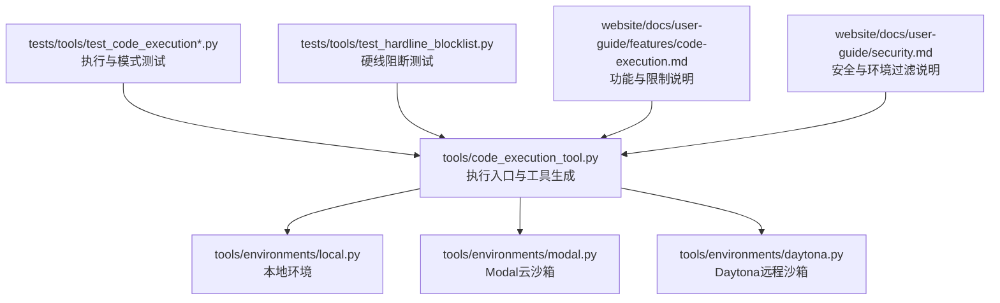
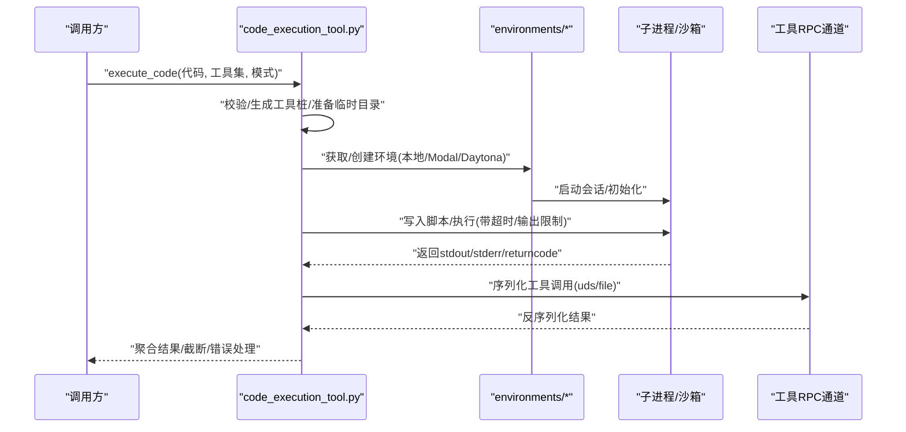
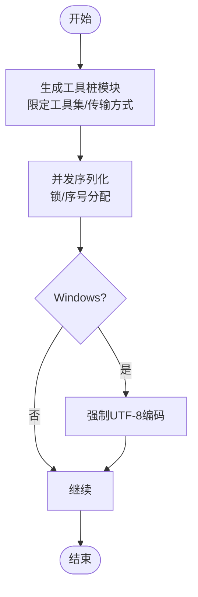
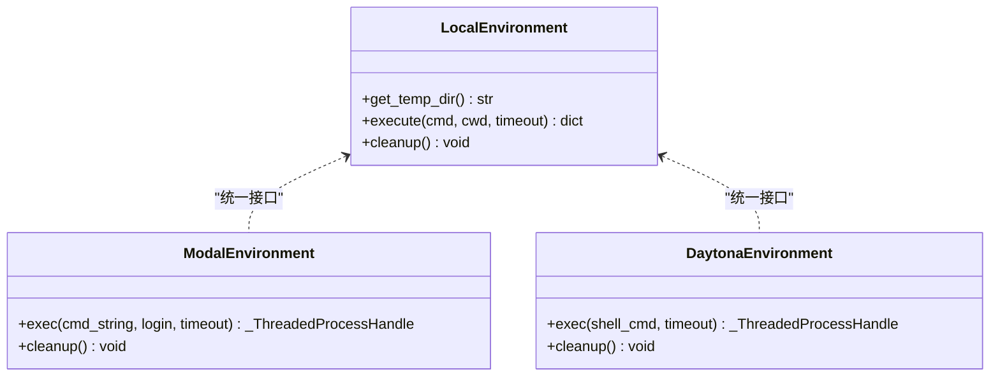
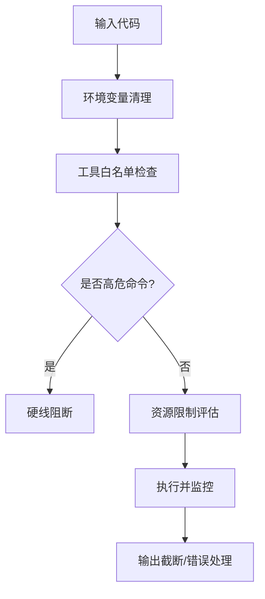
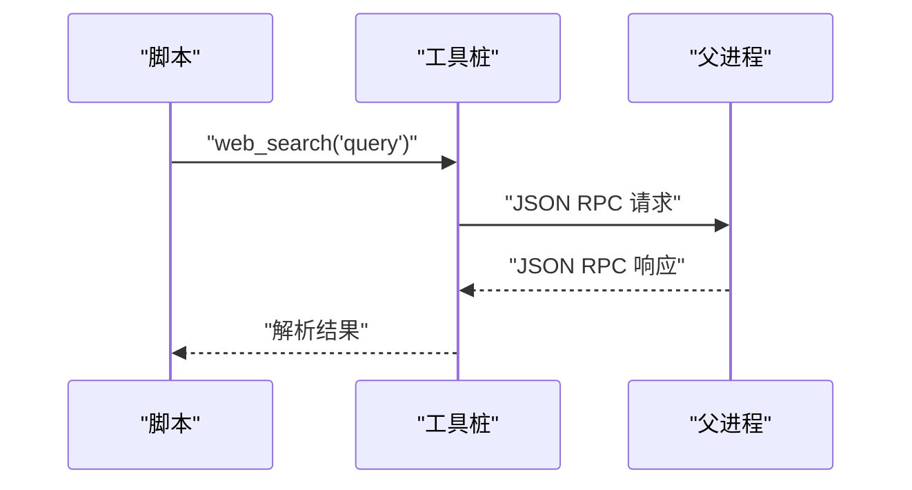
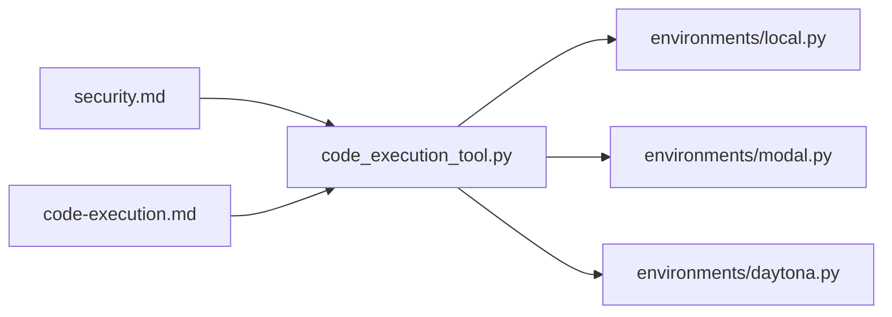

# 代码执行工具

<cite>
**本文引用的文件**   
- [tools/code_execution_tool.py](file://tools/code_execution_tool.py)
- [tests/tools/test_code_execution.py](file://tests/tools/test_code_execution.py)
- [tests/tools/test_code_execution_modes.py](file://tests/tools/test_code_execution_modes.py)
- [tests/tools/test_code_execution_windows_env.py](file://tests/tools/test_code_execution_windows_env.py)
- [tools/environments/local.py](file://tools/environments/local.py)
- [tools/environments/modal.py](file://tools/environments/modal.py)
- [tools/environments/daytona.py](file://tools/environments/daytona.py)
- [website/docs/user-guide/features/code-execution.md](file://website/docs/user-guide/features/code-execution.md)
- [website/docs/user-guide/security.md](file://website/docs/user-guide/security.md)
- [tests/tools/test_hardline_blocklist.py](file://tests/tools/test_hardline_blocklist.py)
- [tests/tools/test_execute_code_approval_cluster.py](file://tests/tools/test_execute_code_approval_cluster.py)
- [tests/tools/test_code_execution_windows_env.py](file://tests/tools/test_code_execution_windows_env.py)
- [tests/tools/test_code_execution.py](file://tests/tools/test_code_execution.py)
- [tests/tools/test_code_execution_modes.py](file://tests/tools/test_code_execution_modes.py)
</cite>

## 目录
1. [简介](#简介)
2. [项目结构](#项目结构)
3. [核心组件](#核心组件)
4. [架构总览](#架构总览)
5. [详细组件分析](#详细组件分析)
6. [依赖关系分析](#依赖关系分析)
7. [性能考虑](#性能考虑)
8. [故障排查指南](#故障排查指南)
9. [结论](#结论)
10. [附录](#附录)

## 简介
本文件面向Hermes Agent的“代码执行工具”，系统性阐述其多语言支持、编译与运行流程、结果处理、安全机制（沙箱隔离、资源限制、恶意代码防护）、环境管理（依赖安装与版本控制）、配置项（语言选择、编译参数、运行时设置），并提供Python、JavaScript、Shell等语言的实际使用示例与性能优化、并发处理策略。

## 项目结构
围绕代码执行的核心代码位于tools目录下，测试用例位于tests/tools中，用户文档位于website/docs。关键模块包括：
- 执行入口与工具生成：tools/code_execution_tool.py
- 环境适配层：tools/environments/local.py、tools/environments/modal.py、tools/environments/daytona.py
- 用户文档：website/docs/user-guide/features/code-execution.md、website/docs/user-guide/security.md
- 测试覆盖：多语言/模式/安全/并发/Windows环境等

**图表来源**
- [tools/code_execution_tool.py](file://tools/code_execution_tool.py)
- [tools/environments/local.py](file://tools/environments/local.py)
- [tools/environments/modal.py](file://tools/environments/modal.py)
- [tools/environments/daytona.py](file://tools/environments/daytona.py)
- [tests/tools/test_code_execution.py](file://tests/tools/test_code_execution.py)
- [tests/tools/test_code_execution_modes.py](file://tests/tools/test_code_execution_modes.py)
- [tests/tools/test_hardline_blocklist.py](file://tests/tools/test_hardline_blocklist.py)
- [website/docs/user-guide/features/code-execution.md](file://website/docs/user-guide/features/code-execution.md)
- [website/docs/user-guide/security.md](file://website/docs/user-guide/security.md)

**章节来源**
- [tools/code_execution_tool.py](file://tools/code_execution_tool.py)
- [tools/environments/local.py](file://tools/environments/local.py)
- [tools/environments/modal.py](file://tools/environments/modal.py)
- [tools/environments/daytona.py](file://tools/environments/daytona.py)
- [website/docs/user-guide/features/code-execution.md](file://website/docs/user-guide/features/code-execution.md)
- [website/docs/user-guide/security.md](file://website/docs/user-guide/security.md)

## 核心组件
- 代码执行入口与工具生成
  - 动态生成可在沙箱内调用的工具桩（如terminal、web_search等），通过Unix域套接字或文件传输进行RPC调用。
  - 支持不同传输方式（uds/file），并在并发场景下对序列号与锁进行串行化。
- 环境适配层
  - local：本地执行，支持临时目录选择、会话初始化、超时与清理。
  - modal：Modal云沙箱，异步执行、超时控制、持久化快照与同步。
  - daytona：Daytona远程沙箱，同步执行、文件同步回传、持久化/删除策略。
- 安全与限制
  - 环境变量清理（敏感前缀剔除）、工具白名单（禁止递归execute_code等）、资源限制（超时、输出大小、工具调用次数）。
  - 硬线阻断（如rm -rf /等高危命令）。
- 配置与模式
  - 支持project与strict两种模式，资源限制可通过config.yaml调整。
  - Windows环境下的UTF-8编码保障与子进程I/O编码设置。

**章节来源**
- [tools/code_execution_tool.py](file://tools/code_execution_tool.py)
- [tools/environments/local.py](file://tools/environments/local.py)
- [tools/environments/modal.py](file://tools/environments/modal.py)
- [tools/environments/daytona.py](file://tools/environments/daytona.py)
- [website/docs/user-guide/features/code-execution.md](file://website/docs/user-guide/features/code-execution.md)
- [website/docs/user-guide/security.md](file://website/docs/user-guide/security.md)

## 架构总览
代码执行从“请求进入”到“结果返回”的整体流程如下：

**图表来源**
- [tools/code_execution_tool.py](file://tools/code_execution_tool.py)
- [tools/environments/local.py](file://tools/environments/local.py)
- [tools/environments/modal.py](file://tools/environments/modal.py)
- [tools/environments/daytona.py](file://tools/environments/daytona.py)

## 详细组件分析

### 组件A：代码执行入口与工具生成
- 功能要点
  - 动态生成工具桩模块，限定允许的工具集合（如terminal、web_search等），避免递归调用execute_code。
  - 选择传输方式（uds/file），并发场景下对序列号与锁进行串行化，防止响应错乱。
  - 生成的工具桩在Windows上使用UTF-8编码写入/读取，确保非ASCII字符正确传递。
- 关键行为
  - 生成的工具桩包含并发锁与序列号分配逻辑，保证多线程安全。
  - Windows环境下强制UTF-8编码，避免默认编码导致的非ASCII内容损坏。
- 使用建议
  - 在需要跨语言/跨平台时，优先使用uds传输以降低文件系统依赖。
  - 对于长任务或远程执行，结合环境层的超时与清理策略。

**图表来源**
- [tools/code_execution_tool.py](file://tools/code_execution_tool.py)
- [tests/tools/test_code_execution.py](file://tests/tools/test_code_execution.py)
- [tests/tools/test_code_execution_windows_env.py](file://tests/tools/test_code_execution_windows_env.py)

**章节来源**
- [tools/code_execution_tool.py](file://tools/code_execution_tool.py)
- [tests/tools/test_code_execution.py](file://tests/tools/test_code_execution.py)
- [tests/tools/test_code_execution_windows_env.py](file://tests/tools/test_code_execution_windows_env.py)

### 组件B：环境适配层（本地/Modal/Daytona）
- 本地环境（local）
  - 选择安全的临时目录（POSIX/Termux/Windows专用路径），初始化会话，执行命令并清理。
  - 支持自定义TMPDIR等环境变量，避免空格路径导致的shell插值问题。
- Modal云沙箱（modal）
  - 异步执行，支持登录shell与非登录shell两种命令形式，统一超时与输出合并。
  - 支持持久化快照与文件同步回传，清理阶段根据状态决定stop/delete。
- Daytona远程沙箱（daytona）
  - 同步执行，执行后回传变更，清理阶段进行幂等与异常吞没，支持持久化保留与删除。

**图表来源**
- [tools/environments/local.py](file://tools/environments/local.py)
- [tools/environments/modal.py](file://tools/environments/modal.py)
- [tools/environments/daytona.py](file://tools/environments/daytona.py)

**章节来源**
- [tools/environments/local.py](file://tools/environments/local.py)
- [tools/environments/modal.py](file://tools/environments/modal.py)
- [tools/environments/daytona.py](file://tools/environments/daytona.py)

### 组件C：安全机制与资源限制
- 环境变量清理
  - 默认过滤包含KEY/TOKEN/SECRET/PASSWORD/CREDENTIAL/PASSWD/AUTH等关键词的变量名。
  - 可通过passthrough白名单放行，但MCP环境需单独配置env。
- 工具白名单
  - 禁止脚本递归调用execute_code、delegate_task、MCP工具等。
- 资源限制
  - 超时（默认5分钟）、stdout上限（默认50KB）、stderr上限（默认10KB）、工具调用上限（默认50次/执行）。
- 硬线阻断
  - 对高危命令（如rm -rf /）直接拒绝，不受yolo/session级豁免影响。
- 审批与智能模式
  - 支持smart/deny/approve/escalate审批链路，结合网关会话级别yolo开关。

**图表来源**
- [website/docs/user-guide/security.md](file://website/docs/user-guide/security.md)
- [tests/tools/test_hardline_blocklist.py](file://tests/tools/test_hardline_blocklist.py)
- [tests/tools/test_execute_code_approval_cluster.py](file://tests/tools/test_execute_code_approval_cluster.py)

**章节来源**
- [website/docs/user-guide/security.md](file://website/docs/user-guide/security.md)
- [tests/tools/test_hardline_blocklist.py](file://tests/tools/test_hardline_blocklist.py)
- [tests/tools/test_execute_code_approval_cluster.py](file://tests/tools/test_execute_code_approval_cluster.py)

### 组件D：配置选项与模式
- 模式
  - project：默认模式，优先使用项目虚拟环境（如VENV/Conda），否则回退至系统解释器。
  - strict：严格模式，进一步收紧工具与环境边界。
- 资源限制
  - 可通过~/.hermes/config.yaml调整timeout、max_tool_calls等。
- 传输与并发
  - uds/file传输的选择与并发锁/序列号分配已在工具桩中内置。

**章节来源**
- [website/docs/user-guide/features/code-execution.md](file://website/docs/user-guide/features/code-execution.md)
- [tools/code_execution_tool.py](file://tools/code_execution_tool.py)

### 实际使用示例（概念性说明）
- Python
  - 在project模式下，脚本可调用工具桩（如web_search）并通过Unix域套接字与父进程通信。
- JavaScript
  - 通过工具桩生成的JS兼容调用（如terminal），在Modal/Daytona环境中执行并回传结果。
- Shell
  - 在本地或远程环境中执行shell命令，受超时与输出大小限制。

**图表来源**
- [tools/code_execution_tool.py](file://tools/code_execution_tool.py)
- [website/docs/user-guide/features/code-execution.md](file://website/docs/user-guide/features/code-execution.md)

## 依赖关系分析
- 组件耦合
  - code_execution_tool.py依赖environments/*实现具体执行后端。
  - 安全与限制策略由文档与测试共同约束，工具层负责落地。
- 外部依赖
  - Modal/Daytona SDK、Unix域套接字、文件系统（uds/file传输）。
- 潜在循环依赖
  - 工具桩生成与执行解耦，避免循环导入；环境层通过统一接口暴露。

**图表来源**
- [tools/code_execution_tool.py](file://tools/code_execution_tool.py)
- [tools/environments/local.py](file://tools/environments/local.py)
- [tools/environments/modal.py](file://tools/environments/modal.py)
- [tools/environments/daytona.py](file://tools/environments/daytona.py)
- [website/docs/user-guide/security.md](file://website/docs/user-guide/security.md)
- [website/docs/user-guide/features/code-execution.md](file://website/docs/user-guide/features/code-execution.md)

**章节来源**
- [tools/code_execution_tool.py](file://tools/code_execution_tool.py)
- [website/docs/user-guide/features/code-execution.md](file://website/docs/user-guide/features/code-execution.md)
- [website/docs/user-guide/security.md](file://website/docs/user-guide/security.md)

## 性能考虑
- 并发与锁
  - 工具桩在uds/file传输下内置并发锁与序列号分配，避免竞争条件。
- 传输选择
  - uds适合本地/同机IPC，file适合跨主机或无套接字环境。
- 超时与输出截断
  - 合理设置timeout与max_tool_calls，避免长时间占用与内存膨胀。
- 临时目录与清理
  - 本地环境优先使用安全且无空格的临时目录，减少shell插值开销；执行后及时清理。

**章节来源**
- [tests/tools/test_code_execution.py](file://tests/tools/test_code_execution.py)
- [tools/environments/local.py](file://tools/environments/local.py)

## 故障排查指南
- Windows UTF-8问题
  - 若出现非ASCII字符损坏，确认工具桩生成与文件RPC传输均使用UTF-8编码。
- 并发响应错乱
  - 检查uds/file传输是否启用并发锁与序列号分配。
- 超时与输出截断
  - 调整config.yaml中的timeout与max_tool_calls；关注stdout/stderr上限。
- 高危命令被拒
  - 硬线阻断不可绕过，需在安全范围内调整命令或审批策略。
- 远程环境清理失败
  - Modal/Daytona清理阶段会吞没异常并幂等执行，确认persistent状态与同步回传是否成功。

**章节来源**
- [tests/tools/test_code_execution_windows_env.py](file://tests/tools/test_code_execution_windows_env.py)
- [tests/tools/test_code_execution.py](file://tests/tools/test_code_execution.py)
- [tests/tools/test_hardline_blocklist.py](file://tests/tools/test_hardline_blocklist.py)
- [tools/environments/modal.py](file://tools/environments/modal.py)
- [tools/environments/daytona.py](file://tools/environments/daytona.py)

## 结论
Hermes Agent的代码执行工具通过“动态工具桩+多环境适配+强安全与资源限制”实现了跨语言、跨平台、可审计的代码执行能力。配合合理的配置与并发策略，可在保证安全的前提下高效完成自动化任务。

## 附录
- 配置参考
  - 模式与资源限制：见用户文档对应章节。
- 测试参考
  - 执行与模式测试、Windows环境测试、硬线阻断测试、审批链路测试等，可作为集成验证的依据。

**章节来源**
- [website/docs/user-guide/features/code-execution.md](file://website/docs/user-guide/features/code-execution.md)
- [website/docs/user-guide/security.md](file://website/docs/user-guide/security.md)
- [tests/tools/test_code_execution.py](file://tests/tools/test_code_execution.py)
- [tests/tools/test_code_execution_modes.py](file://tests/tools/test_code_execution_modes.py)
- [tests/tools/test_code_execution_windows_env.py](file://tests/tools/test_code_execution_windows_env.py)
- [tests/tools/test_hardline_blocklist.py](file://tests/tools/test_hardline_blocklist.py)
- [tests/tools/test_execute_code_approval_cluster.py](file://tests/tools/test_execute_code_approval_cluster.py)