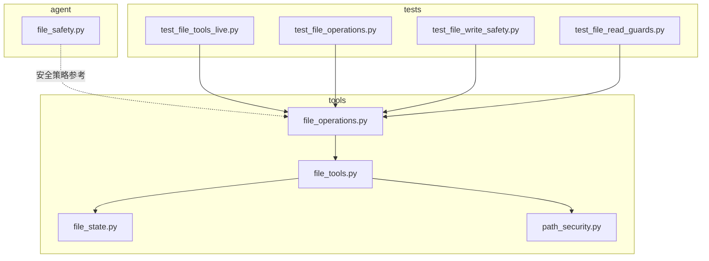
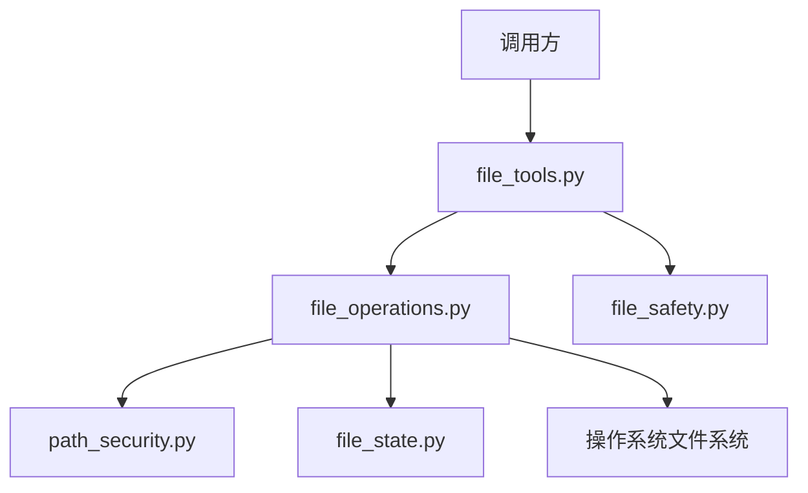
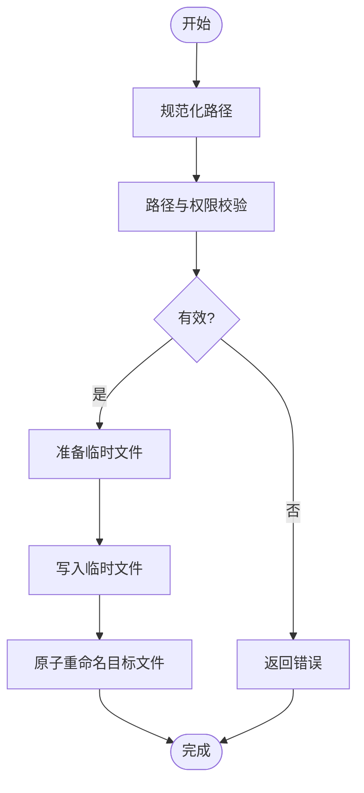
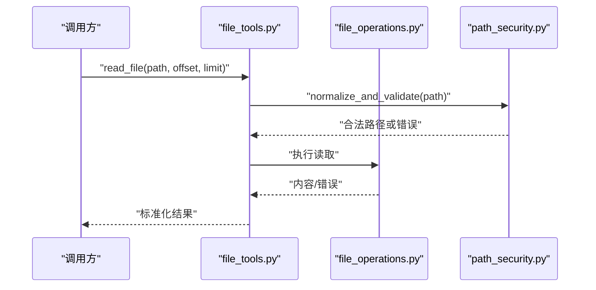
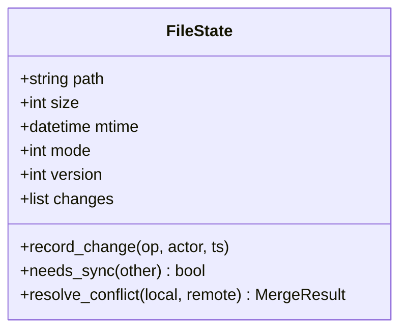
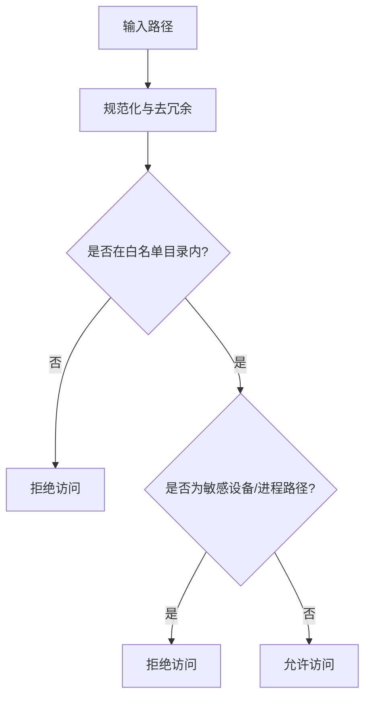
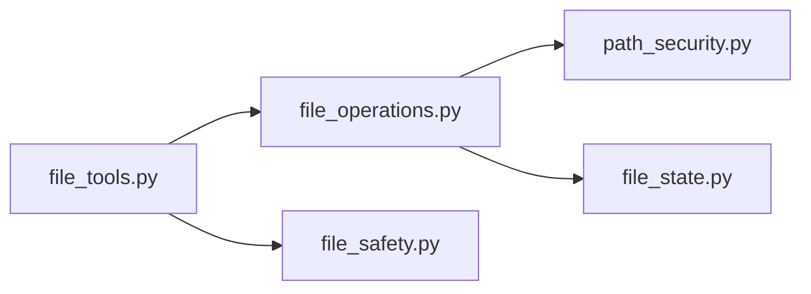

# 文件操作工具

<cite>
**本文引用的文件**
- [file_operations.py](file://tools/file_operations.py)
- [file_tools.py](file://tools/file_tools.py)
- [file_state.py](file://tools/file_state.py)
- [path_security.py](file://tools/path_security.py)
- [file_safety.py](file://agent/file_safety.py)
- [test_file_tools_live.py](file://tests/tools/test_file_tools_live.py)
- [test_file_operations.py](file://tests/tools/test_file_operations.py)
- [test_file_write_safety.py](file://tests/tools/test_file_write_safety.py)
- [test_file_read_guards.py](file://tests/tools/test_file_read_guards.py)
</cite>

## 目录
1. [简介](#简介)
2. [项目结构](#项目结构)
3. [核心组件](#核心组件)
4. [架构总览](#架构总览)
5. [详细组件分析](#详细组件分析)
6. [依赖关系分析](#依赖关系分析)
7. [性能考虑](#性能考虑)
8. [故障排查指南](#故障排查指南)
9. [结论](#结论)
10. [附录](#附录)

## 简介
本文件操作工具是 Hermes Agent 的核心能力之一，提供安全、可靠且高性能的文件读写、状态管理、同步与监控能力。其设计重点在于：
- 安全性：路径验证、权限检查、恶意路径防护
- 可靠性：原子写入、失败回滚、一致性保障
- 性能：批量处理、并发控制、流式读写
- 可运维性：错误处理、恢复机制、增量同步与冲突解决

## 项目结构
文件操作相关代码主要位于 tools 目录下，并辅以 agent 层面的安全策略与测试用例。

图表来源
- [file_operations.py](file://tools/file_operations.py)
- [file_tools.py](file://tools/file_tools.py)
- [file_state.py](file://tools/file_state.py)
- [path_security.py](file://tools/path_security.py)
- [file_safety.py](file://agent/file_safety.py)
- [test_file_tools_live.py](file://tests/tools/test_file_tools_live.py)
- [test_file_operations.py](file://tests/tools/test_file_operations.py)
- [test_file_write_safety.py](file://tests/tools/test_file_write_safety.py)
- [test_file_read_guards.py](file://tests/tools/test_file_read_guards.py)

章节来源
- [file_operations.py](file://tools/file_operations.py)
- [file_tools.py](file://tools/file_tools.py)
- [file_state.py](file://tools/file_state.py)
- [path_security.py](file://tools/path_security.py)
- [file_safety.py](file://agent/file_safety.py)
- [test_file_tools_live.py](file://tests/tools/test_file_tools_live.py)
- [test_file_operations.py](file://tests/tools/test_file_operations.py)
- [test_file_write_safety.py](file://tests/tools/test_file_write_safety.py)
- [test_file_read_guards.py](file://tests/tools/test_file_read_guards.py)

## 核心组件
- 文件操作实现（file_operations.py）：提供读取、写入、追加、补丁替换、移动、复制、删除、搜索等基础能力；支持大文件与流式处理；内置安全校验与错误处理。
- 文件工具集（file_tools.py）：封装常用文件操作的高层接口，统一错误返回与结果格式；协调状态管理与路径安全模块。
- 文件状态管理（file_state.py）：维护文件元数据、变更历史、版本信息，支撑增量同步与冲突检测。
- 路径安全（path_security.py）：提供路径规范化、白名单过滤、设备/进程路径阻断、权限边界检查等。
- 安全策略（file_safety.py）：在 Agent 运行时层面定义文件访问策略、沙箱镜像隔离、跨配置文件访问限制等。
- 测试用例：覆盖读写、权限拒绝、原子写入、设备路径阻断等关键场景。

章节来源
- [file_operations.py](file://tools/file_operations.py)
- [file_tools.py](file://tools/file_tools.py)
- [file_state.py](file://tools/file_state.py)
- [path_security.py](file://tools/path_security.py)
- [file_safety.py](file://agent/file_safety.py)

## 架构总览
文件操作工具采用分层架构：
- 接口层：file_tools.py 提供统一调用入口
- 实现层：file_operations.py 执行具体 I/O 操作
- 安全层：path_security.py 与 file_safety.py 在进入 I/O 前进行路径与权限校验
- 状态层：file_state.py 记录文件状态，支持增量同步与冲突解决

图表来源
- [file_tools.py](file://tools/file_tools.py)
- [file_operations.py](file://tools/file_operations.py)
- [path_security.py](file://tools/path_security.py)
- [file_state.py](file://tools/file_state.py)
- [file_safety.py](file://agent/file_safety.py)

## 详细组件分析

### 文件操作实现（file_operations.py）
职责与特性：
- 基础操作：读取、写入、追加、补丁替换、移动、复制、删除、搜索
- 大文件与流式：支持按块读取、stdin 输入、超大内容处理
- 原子写入：通过临时文件+重命名实现，避免部分写入与竞态
- 错误处理：统一返回结构，区分系统错误、权限错误、路径错误
- 并发控制：内部串行化关键路径，必要时提供外部锁参数

典型流程（写入文件）：

图表来源
- [file_operations.py](file://tools/file_operations.py)

章节来源
- [file_operations.py](file://tools/file_operations.py)

### 文件工具集（file_tools.py）
职责与特性：
- 统一接口：对上层屏蔽底层差异，提供一致的返回结构
- 结果包装：将底层操作结果转换为标准格式，包含错误码、字节数、目录创建标记等
- 协调状态：在写入后更新文件状态，触发增量同步
- 路径安全：前置调用 path_security 模块进行路径清理与校验

典型序列（读取文件）：

图表来源
- [file_tools.py](file://tools/file_tools.py)
- [file_operations.py](file://tools/file_operations.py)
- [path_security.py](file://tools/path_security.py)

章节来源
- [file_tools.py](file://tools/file_tools.py)

### 文件状态管理（file_state.py）
职责与特性：
- 元数据记录：文件大小、修改时间、权限模式、版本号
- 变更追踪：记录每次变更的上下文（操作者、时间戳、来源）
- 增量同步：基于哈希或时间戳判断是否需要同步
- 冲突检测：当同一文件被多源修改时，提供合并策略建议

类关系示意：

图表来源
- [file_state.py](file://tools/file_state.py)

章节来源
- [file_state.py](file://tools/file_state.py)

### 路径安全（path_security.py）
职责与特性：
- 路径规范化：去除多余分隔符、解析相对路径、剥离“..”逃逸
- 白名单过滤：仅允许预定义安全目录（如工作区根、用户家目录子树）
- 设备/进程路径阻断：阻断 /dev/*、/proc/*、/sys/* 等敏感路径
- 权限边界：禁止越权访问系统关键文件（如 ~/.ssh/*）

流程图（路径校验）：

图表来源
- [path_security.py](file://tools/path_security.py)

章节来源
- [path_security.py](file://tools/path_security.py)

### 安全策略（file_safety.py）
职责与特性：
- 配置隔离：不同配置文件之间禁止直接访问对方的私有文件
- 沙箱镜像：在容器/沙箱环境中启用只读挂载与受限目录
- 凭据保护：禁止读取/写入凭据文件，除非显式授权
- 运行时审计：记录所有文件访问事件，便于事后追溯

章节来源
- [file_safety.py](file://agent/file_safety.py)

## 依赖关系分析
- file_tools.py 依赖 file_operations.py 与 path_security.py，并可选依赖 file_safety.py
- file_operations.py 依赖 path_security.py 与 file_state.py
- 测试用例覆盖上述模块的关键行为与边界条件

图表来源
- [file_tools.py](file://tools/file_tools.py)
- [file_operations.py](file://tools/file_operations.py)
- [path_security.py](file://tools/path_security.py)
- [file_state.py](file://tools/file_state.py)
- [file_safety.py](file://agent/file_safety.py)

章节来源
- [file_tools.py](file://tools/file_tools.py)
- [file_operations.py](file://tools/file_operations.py)
- [path_security.py](file://tools/path_security.py)
- [file_state.py](file://tools/file_state.py)
- [file_safety.py](file://agent/file_safety.py)

## 性能考虑
- 大文件处理
  - 使用分块读取与流式写入，避免一次性加载到内存
  - 对超大文件优先使用追加写或管道输入
- 并发控制
  - 写入操作采用原子重命名，避免并发读取到中间态
  - 对热点文件提供外部锁参数，防止竞争
- 批量处理
  - 批量写入时合并小文件写入请求，减少系统调用次数
  - 批量搜索使用系统命令（如 find/grep），减少 Python 循环开销
- 增量同步
  - 基于文件大小与修改时间快速判断是否需要同步
  - 对二进制文件采用哈希对比，确保准确性

## 故障排查指南
常见问题与定位方法：
- 权限错误
  - 现象：写入/删除被拒
  - 排查：确认目标路径是否在白名单内；检查父目录权限；查看安全策略是否限制该路径
- 路径无效
  - 现象：路径被拒绝或报错
  - 排查：确认路径是否包含 “..” 或指向系统敏感目录；使用路径安全模块进行规范化
- 原子写入失败
  - 现象：原文件未被覆盖且无临时文件残留
  - 排查：检查磁盘空间、父目录权限；确认写入前的临时文件创建是否成功
- 设备/进程路径阻断
  - 现象：访问 /dev/*、/proc/*、/sys/* 报错
  - 排查：确认业务逻辑是否误用系统设备文件；替换为真实文件路径

章节来源
- [test_file_operations.py](file://tests/tools/test_file_operations.py)
- [test_file_write_safety.py](file://tests/tools/test_file_write_safety.py)
- [test_file_read_guards.py](file://tests/tools/test_file_read_guards.py)

## 结论
本文件操作工具通过严格的路径安全、原子写入与状态管理，实现了高安全性与高可靠性的文件操作能力。结合增量同步与冲突解决策略，能够满足复杂场景下的文件管理需求。配合完善的测试用例与错误处理机制，具备良好的可运维性与扩展性。

## 附录

### 使用示例（操作指引）
以下示例展示常见文件操作的调用方式（以路径与参数形式描述）：
- 上传（写入）：调用写入接口，传入目标路径与内容；若父目录不存在则自动创建
- 下载（读取）：调用读取接口，指定起始偏移与长度；支持流式读取大文件
- 复制：调用复制接口，传入源路径与目标路径；自动处理跨分区与权限
- 移动：调用移动接口，传入源路径与目标路径；保证原子性
- 删除：调用删除接口，传入目标路径；对目录递归删除需谨慎
- 搜索：调用搜索接口，传入模式与根目录；支持限制数量与偏移

章节来源
- [file_tools.py](file://tools/file_tools.py)
- [file_operations.py](file://tools/file_operations.py)