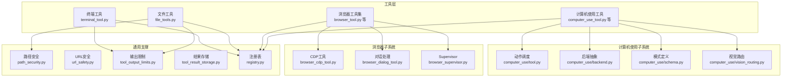
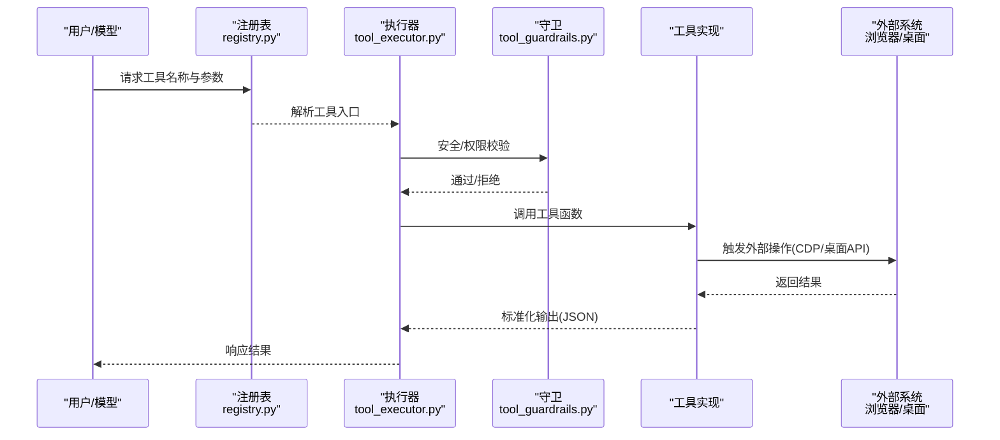
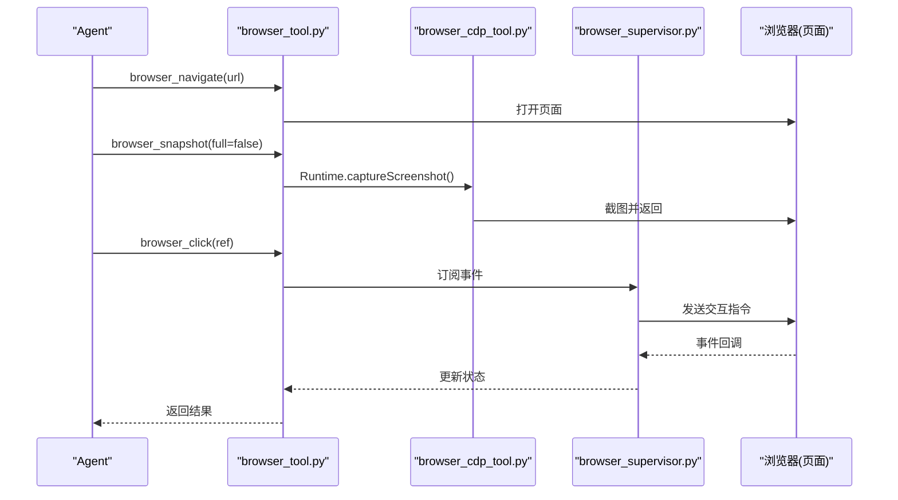
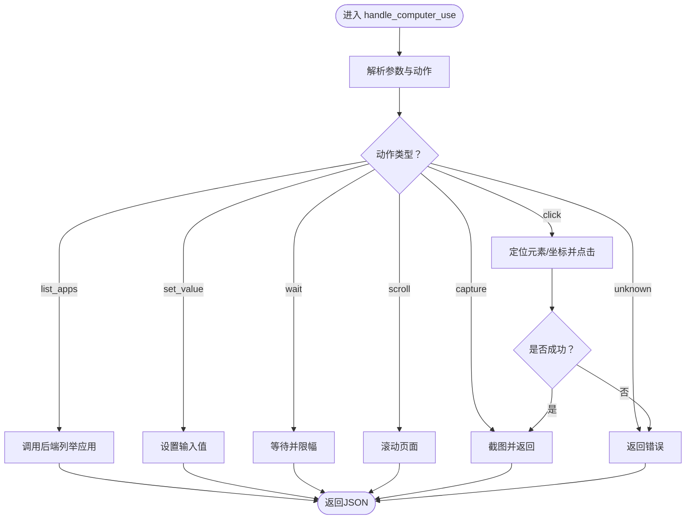
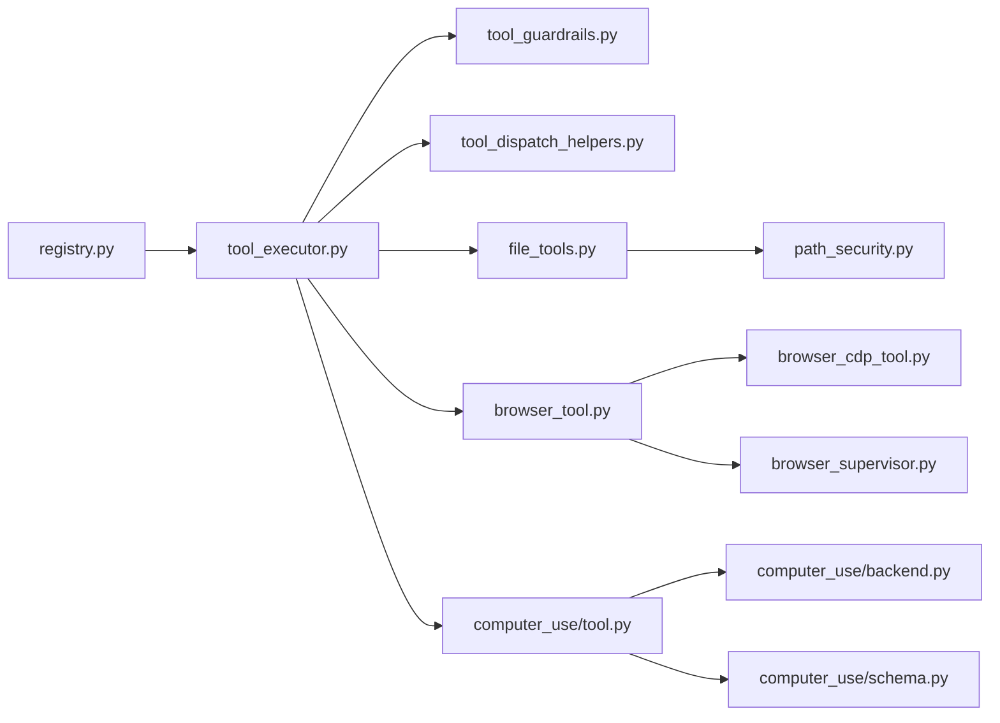

# 核心工具

<cite>
**本文引用的文件**
- [tools/terminal_tool.py](file://tools/terminal_tool.py)
- [tools/file_tools.py](file://tools/file_tools.py)
- [tools/browser_tool.py](file://tools/browser_tool.py)
- [tools/computer_use_tool.py](file://tools/computer_use_tool.py)
- [tools/computer_use/tool.py](file://tools/computer_use/tool.py)
- [tools/computer_use/backend.py](file://tools/computer_use/backend.py)
- [tools/computer_use/schema.py](file://tools/computer_use/schema.py)
- [tools/computer_use/vision_routing.py](file://tools/computer_use/vision_routing.py)
- [tools/browser_cdp_tool.py](file://tools/browser_cdp_tool.py)
- [tools/browser_dialog_tool.py](file://tools/browser_dialog_tool.py)
- [tools/browser_supervisor.py](file://tools/browser_supervisor.py)
- [tools/file_operations.py](file://tools/file_operations.py)
- [tools/path_security.py](file://tools/path_security.py)
- [tools/url_safety.py](file://tools/url_safety.py)
- [tools/file_state.py](file://tools/file_state.py)
- [tools/tool_output_limits.py](file://tools/tool_output_limits.py)
- [tools/tool_result_storage.py](file://tools/tool_result_storage.py)
- [tools/registry.py](file://tools/registry.py)
- [agent/tool_guardrails.py](file://agent/tool_guardrails.py)
- [agent/tool_dispatch_helpers.py](file://agent/tool_dispatch_helpers.py)
- [agent/tool_executor.py](file://agent/tool_executor.py)
- [tests/tools/test_terminal_tool.py](file://tests/tools/test_terminal_tool.py)
- [tests/tools/test_file_tools.py](file://tests/tools/test_file_tools.py)
- [tests/tools/test_browser_console.py](file://tests/tools/test_browser_console.py)
- [tests/tools/test_computer_use.py](file://tests/tools/test_computer_use.py)
- [website/docs/user-guide/features/browser.md](file://website/docs/user-guide/features/browser.md)
- [website/docs/user-guide/features/computer-use.md](file://website/docs/user-guide/features/computer-use.md)
- [website/i18n/zh-Hans/docusaurus-plugin-content-docs/current/reference/tools-reference.md](file://website/i18n/zh-Hans/docusaurus-plugin-content-docs/current/reference/tools-reference.md)
</cite>

## 目录
1. [简介](#简介)
2. [项目结构](#项目结构)
3. [核心组件](#核心组件)
4. [架构总览](#架构总览)
5. [详细组件分析](#详细组件分析)
6. [依赖分析](#依赖分析)
7. [性能考虑](#性能考虑)
8. [故障排查指南](#故障排查指南)
9. [结论](#结论)
10. [附录](#附录)

## 简介
本文件面向Hermes Agent的核心工具体系，系统性梳理终端工具、文件操作工具、浏览器控制工具与计算机使用工具的设计与实现，覆盖功能特性、使用场景、配置选项、安全机制、权限控制、沙箱隔离、调用示例、参数配置、返回值处理、性能优化、并发与资源管理、工具间协作与数据流转，并提供面向使用者与开发者的实用操作指南与最佳实践。

## 项目结构
核心工具主要位于tools目录，围绕四大类工具展开：
- 终端工具：封装命令执行、前台/后台任务、超时与输出限制等能力
- 文件操作工具：提供读写、路径安全校验、状态管理与输出限制
- 浏览器工具：基于CDP与Supervisor的页面导航、快照、交互、对话处理与运行时评估
- 计算机使用工具：跨平台桌面自动化（macOS为主），支持应用列表、点击、输入、截图与视觉路由

图表来源
- [tools/terminal_tool.py](file://tools/terminal_tool.py)
- [tools/file_tools.py](file://tools/file_tools.py)
- [tools/browser_tool.py](file://tools/browser_tool.py)
- [tools/computer_use_tool.py](file://tools/computer_use_tool.py)
- [tools/computer_use/tool.py](file://tools/computer_use/tool.py)
- [tools/computer_use/backend.py](file://tools/computer_use/backend.py)
- [tools/computer_use/schema.py](file://tools/computer_use/schema.py)
- [tools/computer_use/vision_routing.py](file://tools/computer_use/vision_routing.py)
- [tools/browser_cdp_tool.py](file://tools/browser_cdp_tool.py)
- [tools/browser_dialog_tool.py](file://tools/browser_dialog_tool.py)
- [tools/browser_supervisor.py](file://tools/browser_supervisor.py)
- [tools/path_security.py](file://tools/path_security.py)
- [tools/url_safety.py](file://tools/url_safety.py)
- [tools/tool_output_limits.py](file://tools/tool_output_limits.py)
- [tools/tool_result_storage.py](file://tools/tool_result_storage.py)
- [tools/registry.py](file://tools/registry.py)

章节来源
- [tools/terminal_tool.py](file://tools/terminal_tool.py)
- [tools/file_tools.py](file://tools/file_tools.py)
- [tools/browser_tool.py](file://tools/browser_tool.py)
- [tools/computer_use_tool.py](file://tools/computer_use_tool.py)
- [tools/registry.py](file://tools/registry.py)

## 核心组件
- 终端工具：封装命令执行、前台/后台任务、超时与输出限制、工作目录与环境同步、退出语义与中断处理
- 文件工具：提供读/写/追加、偏移与行数限制、路径白名单与安全检查、错误归一化与状态持久化
- 浏览器工具：导航、快照、点击/输入/滚动、控制台与JS错误采集、对话处理、CDP运行时评估、Supervisor事件订阅
- 计算机使用工具：统一schema与动作分发、后端抽象与平台适配、元素定位与坐标选择、截图与视觉路由、结果捕获与校验

章节来源
- [tools/terminal_tool.py](file://tools/terminal_tool.py)
- [tools/file_tools.py](file://tools/file_tools.py)
- [tools/browser_tool.py](file://tools/browser_tool.py)
- [tools/computer_use/tool.py](file://tools/computer_use/tool.py)
- [tools/computer_use/schema.py](file://tools/computer_use/schema.py)

## 架构总览
工具调用链路从注册表解析工具名，经执行器与守卫进行权限与安全校验，再路由到具体工具实现；部分工具通过Supervisor或后端驱动外部系统（浏览器/桌面），并在必要时进行结果捕获与可视化。

图表来源
- [tools/registry.py](file://tools/registry.py)
- [agent/tool_executor.py](file://agent/tool_executor.py)
- [agent/tool_guardrails.py](file://agent/tool_guardrails.py)
- [tools/browser_tool.py](file://tools/browser_tool.py)
- [tools/computer_use/tool.py](file://tools/computer_use/tool.py)

## 详细组件分析

### 终端工具
- 功能特性
  - 支持前台与后台命令执行，具备超时控制与输出截断
  - 自动同步环境变量与工作目录，确保可复现性
  - 提供退出语义与中断处理，避免僵尸进程
  - 输出限制与钩子扩展，便于日志与审计
- 使用场景
  - 需要执行shell命令、脚本或二进制程序
  - 需要在受限时间内完成任务，防止阻塞
- 配置选项
  - 命令字符串、工作目录、环境变量、前台/后台标志、超时阈值、输出大小限制
- 安全机制
  - 与工具守卫协同，对命令与参数进行白名单/黑名单过滤
  - 输出限制与钩子可配合审计策略
- 性能与并发
  - 前台任务受超时与输出限制约束；后台任务可并行但需注意I/O竞争
  - 建议批量任务合并与限流
- 调用示例与返回值
  - 典型调用：传入命令与参数，返回包含状态、输出片段与耗时的JSON对象
  - 失败时返回标准化错误对象，包含错误类型与描述

章节来源
- [tools/terminal_tool.py](file://tools/terminal_tool.py)
- [agent/tool_guardrails.py](file://agent/tool_guardrails.py)
- [agent/tool_executor.py](file://agent/tool_executor.py)
- [tests/tools/test_terminal_tool.py](file://tests/tools/test_terminal_tool.py)

### 文件操作工具
- 功能特性
  - 读取指定偏移与行数范围的内容，支持大文件分段读取
  - 写入/追加内容，返回写入字节数与目标路径
  - 路径安全校验，避免越权访问
  - 输出限制与错误归一化，区分权限错误与其他异常
- 使用场景
  - 日志读取、配置文件修改、临时文件生成与清理
- 配置选项
  - 文件路径、偏移量、行数限制、写入模式（覆盖/追加）
- 安全机制
  - 路径安全模块对路径进行规范化与白名单校验
  - 权限不足时返回明确错误，不暴露内部堆栈
- 性能与并发
  - 分段读取降低内存占用；并发写入需注意锁与原子替换
  - 建议使用状态持久化减少重复IO
- 调用示例与返回值
  - 读取：返回内容与总行数；写入：返回状态、路径与字节数
  - 异常：返回包含错误字段的JSON对象

章节来源
- [tools/file_tools.py](file://tools/file_tools.py)
- [tools/file_operations.py](file://tools/file_operations.py)
- [tools/path_security.py](file://tools/path_security.py)
- [tools/tool_output_limits.py](file://tools/tool_output_limits.py)
- [tools/file_state.py](file://tools/file_state.py)
- [tests/tools/test_file_tools.py](file://tests/tools/test_file_tools.py)

### 浏览器控制工具
- 功能特性
  - 导航、快照、点击、输入、滚动、键盘按键、控制台与JS错误采集
  - 对话处理（alert/confirm/prompt/beforeunload）显式响应
  - CDP运行时评估，支持跨域iframe（OOPIF）定向路由
  - Supervisor持续订阅Page/Runtime/Target事件，自动检测阻塞对话
- 使用场景
  - 网页信息提取、交互式表单填写、动态内容抓取、调试与诊断
- 配置选项
  - 导航URL、快照模式（紧凑/完整）、元素ref ID、按键序列、滚动方向与步长、控制台清空标志
- 安全机制
  - URL安全模块对目标站点进行白名单/黑名单校验
  - 通过Supervisor与CDP工具隔离页面上下文，避免跨站干扰
- 性能与并发
  - 快照与截图成本较高，建议按需触发；CDP调用批量化
  - 对话处理与运行时评估需避免死锁，采用超时与重试
- 调用示例与返回值
  - 导航：返回会话状态；快照：返回元素ref与frame_tree；控制台：返回消息与错误统计
  - 失败：返回包含错误字段的JSON对象

图表来源
- [tools/browser_tool.py](file://tools/browser_tool.py)
- [tools/browser_cdp_tool.py](file://tools/browser_cdp_tool.py)
- [tools/browser_supervisor.py](file://tools/browser_supervisor.py)
- [website/docs/user-guide/features/browser.md](file://website/docs/user-guide/features/browser.md)

章节来源
- [tools/browser_tool.py](file://tools/browser_tool.py)
- [tools/browser_cdp_tool.py](file://tools/browser_cdp_tool.py)
- [tools/browser_dialog_tool.py](file://tools/browser_dialog_tool.py)
- [tools/browser_supervisor.py](file://tools/browser_supervisor.py)
- [tools/url_safety.py](file://tools/url_safety.py)
- [tests/tools/test_browser_console.py](file://tests/tools/test_browser_console.py)
- [website/i18n/zh-Hans/docusaurus-plugin-content-docs/current/reference/tools-reference.md](file://website/i18n/zh-Hans/docusaurus-plugin-content-docs/current/reference/tools-reference.md)

### 计算机使用工具
- 功能特性
  - 统一OpenAI函数格式schema，支持动作：列举应用、点击、输入、等待、滚动、截图、视觉路由等
  - 元素定位支持ref ID与坐标两种方式，最大元素数量可配置
  - 后端抽象屏蔽平台差异，提供结果捕获与类型推断
- 使用场景
  - 桌面自动化、UI交互、应用启动与切换、表单填写、截图标注
- 配置选项
  - 动作类型、目标元素/坐标、输入值、等待秒数、截图区域、最大元素数
- 安全机制
  - 平台检查与能力开关，非macOS环境下禁用或降级
  - 动作路由严格校验参数，失败时不进行后续截图
- 性能与并发
  - 等待与滚动有上限保护；截图与视觉路由成本高，建议按需触发
  - 后端调用批量化，避免频繁上下文切换
- 调用示例与返回值
  - 列举应用：返回应用清单与计数；点击/输入：返回成功与否与动作类型
  - 失败：返回包含错误字段的JSON对象

图表来源
- [tools/computer_use/tool.py](file://tools/computer_use/tool.py)
- [tools/computer_use/backend.py](file://tools/computer_use/backend.py)
- [tools/computer_use/schema.py](file://tools/computer_use/schema.py)
- [tests/tools/test_computer_use.py](file://tests/tools/test_computer_use.py)

章节来源
- [tools/computer_use/tool.py](file://tools/computer_use/tool.py)
- [tools/computer_use/backend.py](file://tools/computer_use/backend.py)
- [tools/computer_use/schema.py](file://tools/computer_use/schema.py)
- [tools/computer_use/vision_routing.py](file://tools/computer_use/vision_routing.py)
- [tests/tools/test_computer_use.py](file://tests/tools/test_computer_use.py)
- [website/docs/user-guide/features/computer-use.md](file://website/docs/user-guide/features/computer-use.md)

## 依赖分析
- 注册表与执行器
  - 工具通过注册表统一注册与解析，执行器负责调度与生命周期管理
- 守卫与调度辅助
  - 守卫在执行前进行权限与策略校验；调度辅助提供上下文与前置条件检查
- 外部系统耦合
  - 浏览器工具依赖CDP与Supervisor；计算机使用工具依赖后端抽象与平台能力
- 数据与状态
  - 文件工具与状态模块协同维护文件元数据；输出限制与结果存储保障可观测性

图表来源
- [tools/registry.py](file://tools/registry.py)
- [agent/tool_executor.py](file://agent/tool_executor.py)
- [agent/tool_guardrails.py](file://agent/tool_guardrails.py)
- [agent/tool_dispatch_helpers.py](file://agent/tool_dispatch_helpers.py)
- [tools/file_tools.py](file://tools/file_tools.py)
- [tools/browser_tool.py](file://tools/browser_tool.py)
- [tools/computer_use/tool.py](file://tools/computer_use/tool.py)
- [tools/computer_use/backend.py](file://tools/computer_use/backend.py)
- [tools/computer_use/schema.py](file://tools/computer_use/schema.py)
- [tools/browser_cdp_tool.py](file://tools/browser_cdp_tool.py)
- [tools/browser_supervisor.py](file://tools/browser_supervisor.py)
- [tools/path_security.py](file://tools/path_security.py)

章节来源
- [tools/registry.py](file://tools/registry.py)
- [agent/tool_executor.py](file://agent/tool_executor.py)
- [agent/tool_guardrails.py](file://agent/tool_guardrails.py)
- [agent/tool_dispatch_helpers.py](file://agent/tool_dispatch_helpers.py)

## 性能考虑
- 终端工具
  - 设置合理超时与输出限制，避免长时间阻塞；前台任务优先级高于后台
- 文件工具
  - 大文件分段读取；写入使用原子替换与状态持久化；并发写入加锁
- 浏览器工具
  - 快照与截图成本高，建议按需触发；CDP批量化调用；对话处理避免死锁
- 计算机使用工具
  - 等待与滚动有上限保护；截图与视觉路由按需触发；后端调用批量化

## 故障排查指南
- 终端工具
  - 常见问题：命令不存在、权限不足、超时、输出过大；建议检查环境变量与工作目录、调整超时与输出限制
- 文件工具
  - 常见问题：路径越权、只读文件系统、权限错误；建议启用路径安全校验、检查权限与磁盘空间
- 浏览器工具
  - 常见问题：页面未加载、元素不可见、JS错误、对话阻塞；建议先导航再快照，处理pending_dialogs后再继续
- 计算机使用工具
  - 常见问题：动作失败不截图、平台不支持；建议检查平台能力、参数合法性与动作顺序

章节来源
- [tests/tools/test_terminal_tool.py](file://tests/tools/test_terminal_tool.py)
- [tests/tools/test_file_tools.py](file://tests/tools/test_file_tools.py)
- [tests/tools/test_browser_console.py](file://tests/tools/test_browser_console.py)
- [tests/tools/test_computer_use.py](file://tests/tools/test_computer_use.py)

## 结论
Hermes Agent的核心工具以“安全、可控、可观测”为目标，通过注册表与执行器统一调度，结合守卫与安全模块实现权限与策略控制；终端、文件、浏览器与计算机使用工具分别针对不同场景提供完备的能力与最佳实践。建议在生产环境中启用输出限制、路径与URL安全校验、超时与重试策略，并根据业务需求对工具进行组合与编排。

## 附录
- 工具调用示例与参数说明可参考各工具测试用例与文档：
  - [终端工具测试](file://tests/tools/test_terminal_tool.py)
  - [文件工具测试](file://tests/tools/test_file_tools.py)
  - [浏览器控制测试](file://tests/tools/test_browser_console.py)
  - [计算机使用测试](file://tests/tools/test_computer_use.py)
  - [浏览器工具参考](file://website/i18n/zh-Hans/docusaurus-plugin-content-docs/current/reference/tools-reference.md)
  - [浏览器功能文档](file://website/docs/user-guide/features/browser.md)
  - [计算机使用功能文档](file://website/docs/user-guide/features/computer-use.md)