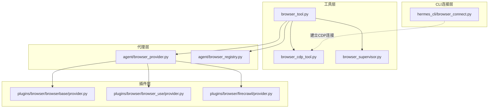
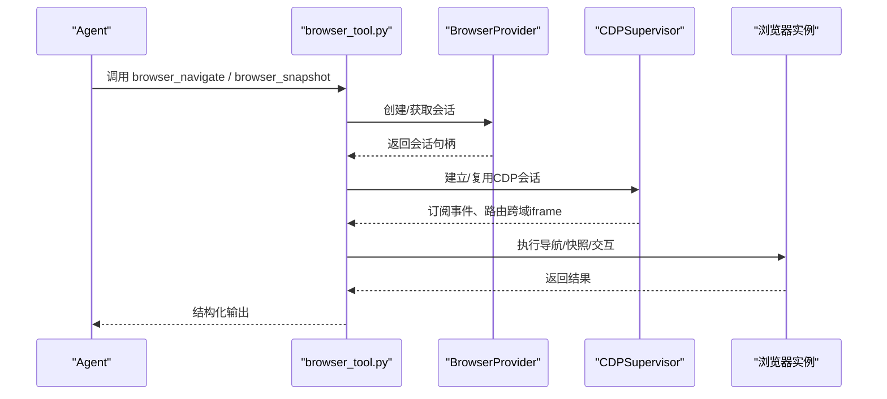
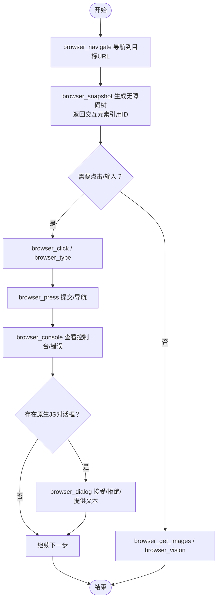
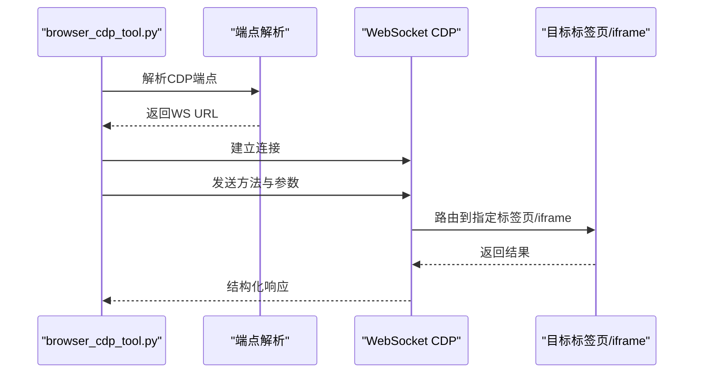
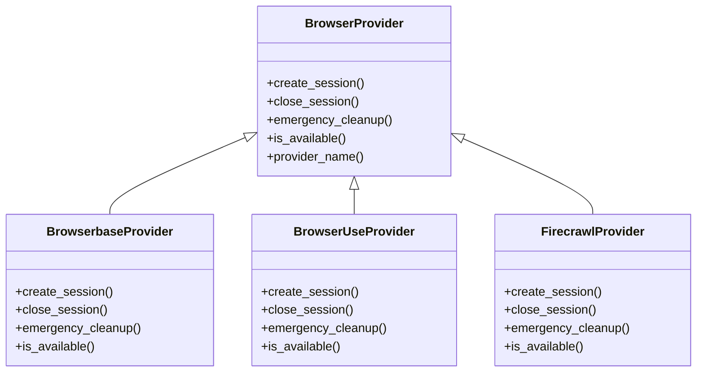
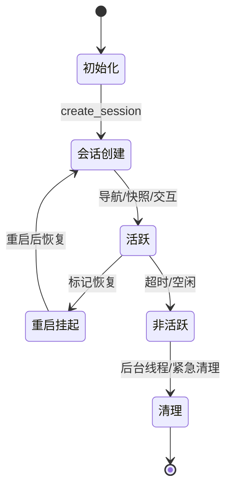
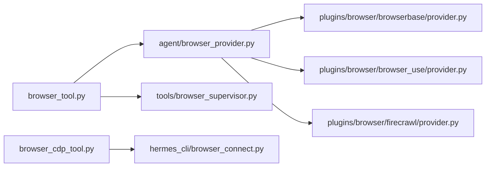

# 浏览器控制工具

<cite>
**本文档引用的文件**
- [browser.md](file://website/docs/user-guide/features/browser.md)
- [browser.md](file://website/i18n/zh-Hans/docusaurus-plugin-content-docs/current/user-guide/features/browser.md)
- [tools-reference.md](file://website/i18n/zh-Hans/docusaurus-plugin-content-docs/current/reference/tools-reference.md)
- [browser_tool.py](file://tools/browser_tool.py)
- [browser_cdp_tool.py](file://tools/browser_cdp_tool.py)
- [browser_supervisor.py](file://tools/browser_supervisor.py)
- [browser_provider.py](file://agent/browser_provider.py)
- [browser_registry.py](file://agent/browser_registry.py)
- [browser_connect.py](file://hermes_cli/browser_connect.py)
- [provider.py](file://plugins/browser/browserbase/provider.py)
- [provider.py](file://plugins/browser/browser_use/provider.py)
- [provider.py](file://plugins/browser/firecrawl/provider.py)
- [test_browser_cdp_tool.py](file://tests/tools/test_browser_cdp_tool.py)
- [test_browser_provider_plugins.py](file://tests/plugins/browser/test_browser_provider_plugins.py)
- [test_managed_browserbase_and_modal.py](file://tests/tools/test_managed_browserbase_and_modal.py)
- [test_browser_eval_supervisor_path.py](file://tests/tools/test_browser_eval_supervisor_path.py)
- [test_browser_cdp_override.py](file://tests/tools/test_browser_cdp_override.py)
- [test_browser_orphan_reaper.py](file://tests/tools/test_browser_orphan_reaper.py)
- [test_session_reset_notify.py](file://tests/gateway/test_session_reset_notify.py)
- [benchmark_browser_eval.py](file://scripts/benchmark_browser_eval.py)
</cite>

## 目录
1. [简介](#简介)
2. [项目结构](#项目结构)
3. [核心组件](#核心组件)
4. [架构总览](#架构总览)
5. [详细组件分析](#详细组件分析)
6. [依赖关系分析](#依赖关系分析)
7. [性能考量](#性能考量)
8. [故障排查指南](#故障排查指南)
9. [结论](#结论)
10. [附录](#附录)

## 简介
本文件面向Hermes Agent的浏览器控制工具，系统性阐述浏览器自动化能力（页面导航、元素交互、表单填写、数据提取）、安全机制（沙箱隔离、内容安全策略、跨域防护）、会话管理（状态保持与恢复）、配置选项（浏览器选择、用户代理与视口）、典型使用场景（截图、PDF生成、数据抓取、自动化测试）以及性能优化与并发控制策略。文档同时提供代码级架构图与流程图，帮助读者快速定位实现位置与调用路径。

## 项目结构
浏览器控制工具由“工具层”“代理层”“插件层”“CLI连接层”构成，覆盖本地浏览器（Camofox/Chromium）与云浏览器（Browserbase/Browser Use/Firecrawl）两种模式，并通过CDP监督器实现稳定的状态管理与跨域iframe路由。

图表来源
- [browser_tool.py](file://tools/browser_tool.py)
- [browser_cdp_tool.py](file://tools/browser_cdp_tool.py)
- [browser_supervisor.py](file://tools/browser_supervisor.py)
- [browser_provider.py](file://agent/browser_provider.py)
- [browser_registry.py](file://agent/browser_registry.py)
- [browser_connect.py](file://hermes_cli/browser_connect.py)
- [provider.py](file://plugins/browser/browserbase/provider.py)
- [provider.py](file://plugins/browser/browser_use/provider.py)
- [provider.py](file://plugins/browser/firecrawl/provider.py)

章节来源
- [browser.md](file://website/docs/user-guide/features/browser.md)
- [browser.md](file://website/i18n/zh-Hans/docusaurus-plugin-content-docs/current/user-guide/features/browser.md)

## 核心组件
- 工具集与命令
  - 导航与快照：browser_navigate、browser_snapshot
  - 交互操作：browser_click、browser_type、browser_scroll、browser_press、browser_back
  - 图像与视觉：browser_get_images、browser_vision
  - 控制台与对话框：browser_console、browser_dialog
  - CDP直通：browser_cdp
- 会话与生命周期
  - 本地模式（Camofox/Chromium）与云模式（Browserbase/Browser Use/Firecrawl）
  - 会话超时与清理、重启恢复标记
- 安全与隔离
  - 沙箱与CSP、跨域iframe路由、原生JS对话框处理

章节来源
- [tools-reference.md](file://website/i18n/zh-Hans/docusaurus-plugin-content-docs/current/reference/tools-reference.md)
- [browser.md](file://website/docs/user-guide/features/browser.md)
- [browser.md](file://website/i18n/zh-Hans/docusaurus-plugin-content-docs/current/user-guide/features/browser.md)

## 架构总览
浏览器控制工具通过统一的工具接口对接底层浏览器提供者，支持本地与云两种模式。本地模式通常通过CDP监督器维持长连接，实现稳定的事件订阅与跨域iframe路由；云模式通过各提供商的会话管理与API完成生命周期控制。

图表来源
- [browser_tool.py](file://tools/browser_tool.py)
- [browser_provider.py](file://agent/browser_provider.py)
- [browser_supervisor.py](file://tools/browser_supervisor.py)

## 详细组件分析

### 组件A：浏览器工具集（browser_tool.py）
- 功能职责
  - 统一入口：封装导航、快照、交互、控制台、对话框等命令
  - 会话编排：根据配置选择本地或云提供商，管理会话生命周期
  - CDP集成：通过监督器实现跨域iframe路由与事件订阅
- 关键流程
  - 导航与快照：browser_navigate -> browser_snapshot -> 生成无障碍树与交互元素引用ID
  - 表单填写：browser_snapshot 获取输入框引用ID -> browser_type 清空并输入 -> browser_press 提交
  - 图像与视觉：browser_get_images 列举图片 -> browser_vision 截图并AI分析
  - 会话恢复：通过会话存储标记与清理策略，保障重启后状态延续

图表来源
- [browser_tool.py](file://tools/browser_tool.py)
- [browser.md](file://website/docs/user-guide/features/browser.md)

章节来源
- [browser_tool.py](file://tools/browser_tool.py)
- [browser.md](file://website/docs/user-guide/features/browser.md)

### 组件B：CDP工具与监督器（browser_cdp_tool.py、browser_supervisor.py）
- CDP工具
  - 输入校验：方法名必填、参数为字典、端点为WebSocket
  - 端点解析：支持完整WS URL、HTTP发现端点、主机:端口自动解析
  - 严格检查：browser_cdp独立于主工具集，仅在具备可达CDP端点时可用
- 监督器
  - 事件订阅：持久WebSocket订阅Page/Runtime/Target事件
  - 跨域路由：通过frame_id将CDP调用路由至对应iframe会话
  - 响应整形：对协议错误进行可操作性提示，避免泄露内部细节

图表来源
- [browser_cdp_tool.py](file://tools/browser_cdp_tool.py)
- [test_browser_cdp_tool.py](file://tests/tools/test_browser_cdp_tool.py)
- [test_browser_cdp_override.py](file://tests/tools/test_browser_cdp_override.py)

章节来源
- [browser_cdp_tool.py](file://tools/browser_cdp_tool.py)
- [test_browser_cdp_tool.py](file://tests/tools/test_browser_cdp_tool.py)
- [test_browser_cdp_override.py](file://tests/tools/test_browser_cdp_override.py)
- [browser.md](file://website/i18n/zh-Hans/docusaurus-plugin-content-docs/current/user-guide/features/browser.md)

### 组件C：浏览器提供者与注册（agent/browser_provider.py、agent/browser_registry.py）
- 提供者抽象
  - 生命周期：create_session / close_session / emergency_cleanup
  - 可用性：is_available 根据环境变量判定
  - 名称：provider_name/display_name 用于UI与日志
- 注册与解析
  - 优先级：browser-use > browserbase（在可用时）
  - 显式配置：未知名称回退到传统探测逻辑
  - 后置安装：云浏览器插件选择后自动安装CLI

图表来源
- [browser_provider.py](file://agent/browser_provider.py)
- [provider.py](file://plugins/browser/browserbase/provider.py)
- [provider.py](file://plugins/browser/browser_use/provider.py)
- [provider.py](file://plugins/browser/firecrawl/provider.py)
- [test_browser_provider_plugins.py](file://tests/plugins/browser/test_browser_provider_plugins.py)

章节来源
- [browser_provider.py](file://agent/browser_provider.py)
- [browser_registry.py](file://agent/browser_registry.py)
- [test_browser_provider_plugins.py](file://tests/plugins/browser/test_browser_provider_plugins.py)

### 组件D：CLI连接与本地浏览器（hermes_cli/browser_connect.py）
- 作用
  - 通过 /browser connect 命令将Hermes与本地运行的浏览器（Chrome/Edge/Chromium/Brave）建立CDP连接
  - 为browser_cdp工具提供WebSocket端点，实现原生浏览器的完全控制
- 场景
  - 本地调试、无云费用、可控环境

章节来源
- [browser_connect.py](file://hermes_cli/browser_connect.py)
- [browser.md](file://website/docs/user-guide/features/browser.md)

### 组件E：会话管理与恢复（工具与网关）
- 本地Camofix持久化
  - 通过稳定的userId跨任务复用Firefox profile，保留Cookie与登录态
  - 需要服务端实现基于userId的profile持久化映射
- 云提供商
  - 每个任务独立会话，非活跃会话按策略清理
  - 支持请求释放（REQUEST_RELEASE）与后台清理线程
- 网关重启恢复
  - 会话存储支持标记“重启挂起/原因/时间戳”，重启后恢复
  - 自动重置策略（如空闲）持久化并在重启后生效

图表来源
- [browser.md](file://website/i18n/zh-Hans/docusaurus-plugin-content-docs/current/user-guide/features/browser.md)
- [test_session_reset_notify.py](file://tests/gateway/test_session_reset_notify.py)
- [test_browser_orphan_reaper.py](file://tests/tools/test_browser_orphan_reaper.py)

章节来源
- [browser.md](file://website/i18n/zh-Hans/docusaurus-plugin-content-docs/current/user-guide/features/browser.md)
- [test_session_reset_notify.py](file://tests/gateway/test_session_reset_notify.py)
- [test_browser_orphan_reaper.py](file://tests/tools/test_browser_orphan_reaper.py)

### 组件F：安全机制与跨域防护
- 沙箱与CSP
  - 本地浏览器遵循浏览器默认沙箱与CSP策略
  - 云提供商在会话层面实施访问控制与资源隔离
- 跨域iframe
  - 通过CDP监督器的frame_tree识别跨域（OOPIF）iframe
  - 使用frame_id路由CDP调用，避免签名URL过期导致的无状态调用失败
- 原生JS对话框
  - 监督器自动检测并暴露pending_dialogs
  - 通过browser_dialog显式接受/拒绝/prompt，恢复页面JS线程

章节来源
- [browser.md](file://website/i18n/zh-Hans/docusaurus-plugin-content-docs/current/user-guide/features/browser.md)
- [browser.md](file://website/docs/user-guide/features/browser.md)

### 组件G：配置选项与使用示例
- 浏览器选择
  - 本地：/browser connect + 本地Chromium/Chrome/Edge/Brave
  - 云：Browserbase/Browser Use/Firecrawl（按可用性与环境变量自动选择）
- 用户代理与视口
  - 通过浏览器启动参数与CSP策略影响UA与视口，具体参数由所选提供者决定
- 实际使用示例
  - 网页截图：browser_snapshot后结合browser_vision进行视觉分析
  - PDF生成：通过CDP或云提供商能力（如Browserbase）生成PDF（依据具体提供商API）
  - 数据抓取：browser_snapshot提取结构化元素，browser_get_images列举图片URL
  - 自动化测试：browser_navigate -> browser_click -> browser_press -> browser_console校验

章节来源
- [browser.md](file://website/docs/user-guide/features/browser.md)
- [browser.md](file://website/i18n/zh-Hans/docusaurus-plugin-content-docs/current/user-guide/features/browser.md)

## 依赖关系分析
- 组件耦合
  - browser_tool.py 依赖 agent/browser_provider.py 与 tools/browser_supervisor.py
  - 云提供商插件实现 BrowserProvider 抽象，注册中心负责解析与优先级
  - browser_cdp_tool.py 与 hermes_cli/browser_connect.py 共同支撑CDP端点可达性
- 外部依赖
  - 云提供商API（Browserbase/Browser Use/Firecrawl）
  - 浏览器CDP协议与WebSocket库
- 循环依赖
  - 通过模块导入顺序与延迟初始化避免循环

图表来源
- [browser_tool.py](file://tools/browser_tool.py)
- [browser_provider.py](file://agent/browser_provider.py)
- [browser_supervisor.py](file://tools/browser_supervisor.py)
- [browser_cdp_tool.py](file://tools/browser_cdp_tool.py)
- [browser_connect.py](file://hermes_cli/browser_connect.py)
- [provider.py](file://plugins/browser/browserbase/provider.py)
- [provider.py](file://plugins/browser/browser_use/provider.py)
- [provider.py](file://plugins/browser/firecrawl/provider.py)

章节来源
- [browser_tool.py](file://tools/browser_tool.py)
- [browser_provider.py](file://agent/browser_provider.py)
- [browser_supervisor.py](file://tools/browser_supervisor.py)
- [browser_cdp_tool.py](file://tools/browser_cdp_tool.py)
- [browser_connect.py](file://hermes_cli/browser_connect.py)
- [provider.py](file://plugins/browser/browserbase/provider.py)
- [provider.py](file://plugins/browser/browser_use/provider.py)
- [provider.py](file://plugins/browser/firecrawl/provider.py)

## 性能考量
- 并发控制
  - 云提供商会话按任务隔离，避免共享状态竞争
  - 本地模式通过CDP监督器串行化高冲突操作，降低竞态风险
- 评估与基准
  - 提供基准脚本用于评估浏览器相关操作的性能瓶颈
- 优化建议
  - 减少不必要的快照与滚动，合并交互批次
  - 使用browser_cdp进行批量低延迟操作（在端点可达前提下）

章节来源
- [benchmark_browser_eval.py](file://scripts/benchmark_browser_eval.py)
- [browser.md](file://website/docs/user-guide/features/browser.md)

## 故障排查指南
- CDP端点不可达
  - 确认 /browser connect 是否成功建立WebSocket
  - 检查端点解析（完整WS URL、HTTP发现、主机:端口）
- 云提供商会话冲突
  - 某些提供商在会话创建时可能出现并发冲突，需重试或幂等键处理
- 会话清理与重启
  - 确认网关重启后会话存储标记是否正确恢复
  - 观察后台清理线程是否按预期执行
- 评估路径差异
  - 当CDP监督器未就绪时，评估走子进程路径，注意错误消息的可操作性提示

章节来源
- [test_browser_cdp_tool.py](file://tests/tools/test_browser_cdp_tool.py)
- [test_browser_cdp_override.py](file://tests/tools/test_browser_cdp_override.py)
- [test_managed_browserbase_and_modal.py](file://tests/tools/test_managed_browserbase_and_modal.py)
- [test_browser_eval_supervisor_path.py](file://tests/tools/test_browser_eval_supervisor_path.py)
- [test_session_reset_notify.py](file://tests/gateway/test_session_reset_notify.py)
- [test_browser_orphan_reaper.py](file://tests/tools/test_browser_orphan_reaper.py)

## 结论
Hermes Agent的浏览器控制工具通过统一的工具集与抽象提供者，兼容本地与云两种模式，并借助CDP监督器实现稳定的事件订阅与跨域iframe路由。配合严格的输入校验、会话恢复与清理策略，能够在保证安全性的同时提供强大的自动化能力。建议在生产环境中优先使用本地模式以降低成本，必要时启用云提供商以获得更广泛的站点兼容性与稳定性。

## 附录
- 常用命令参考
  - browser_navigate、browser_snapshot、browser_click、browser_type、browser_scroll、browser_press、browser_back、browser_get_images、browser_vision、browser_console、browser_dialog、browser_cdp
- 配置要点
  - 本地：/browser connect 建立CDP端点
  - 云：设置相应环境变量，按优先级自动选择提供者
- 安全建议
  - 严格限制UA与视口设置，避免指纹暴露
  - 使用CDP监督器处理跨域iframe与原生JS对话框
  - 定期清理非活跃会话，防止资源泄漏