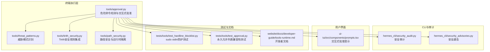
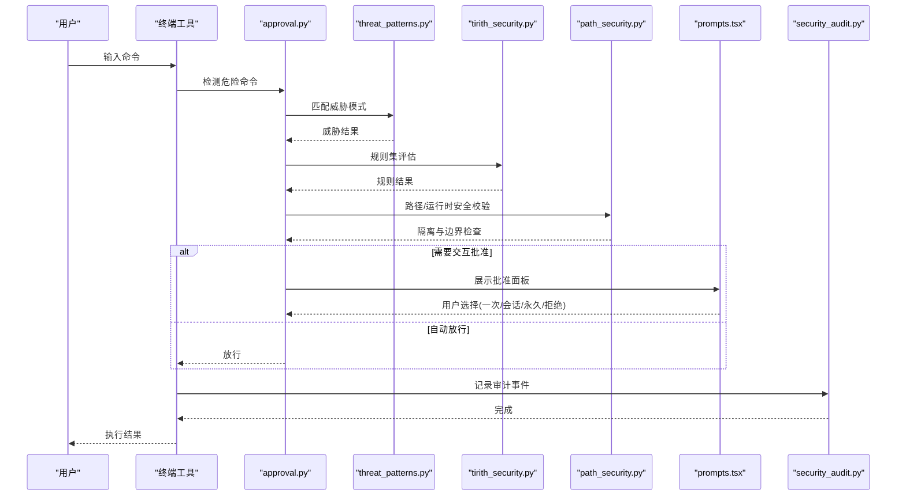
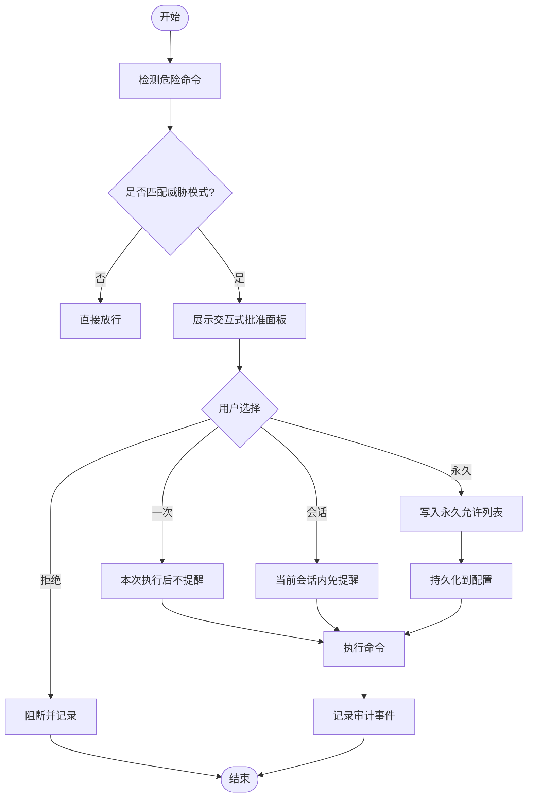
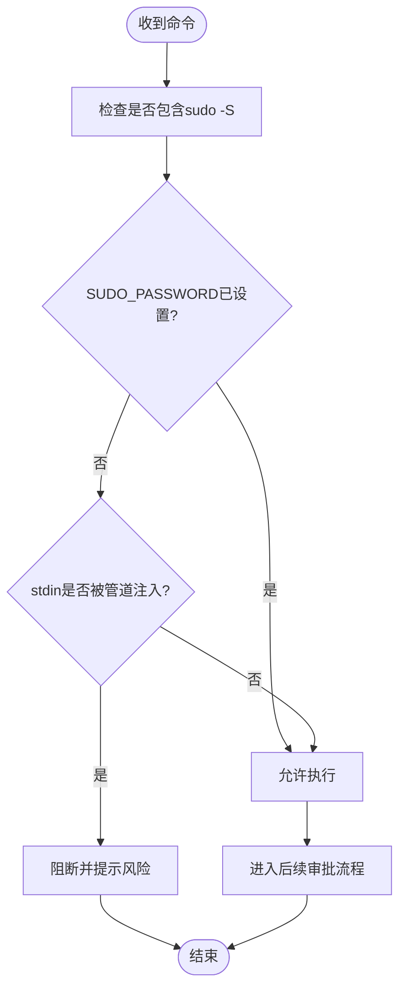
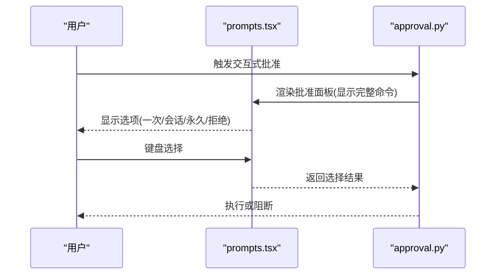
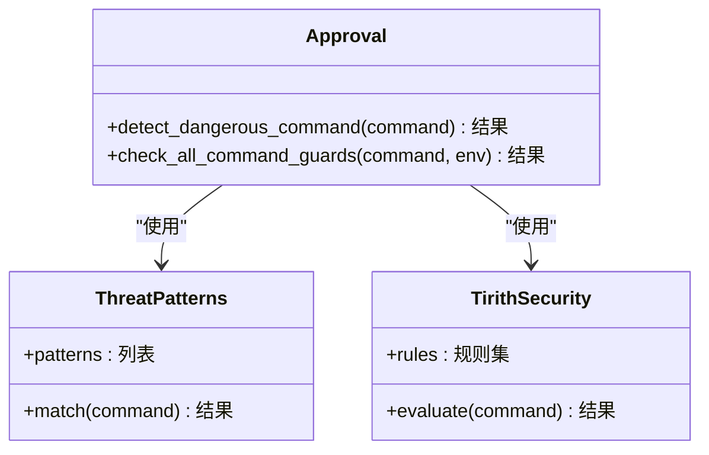
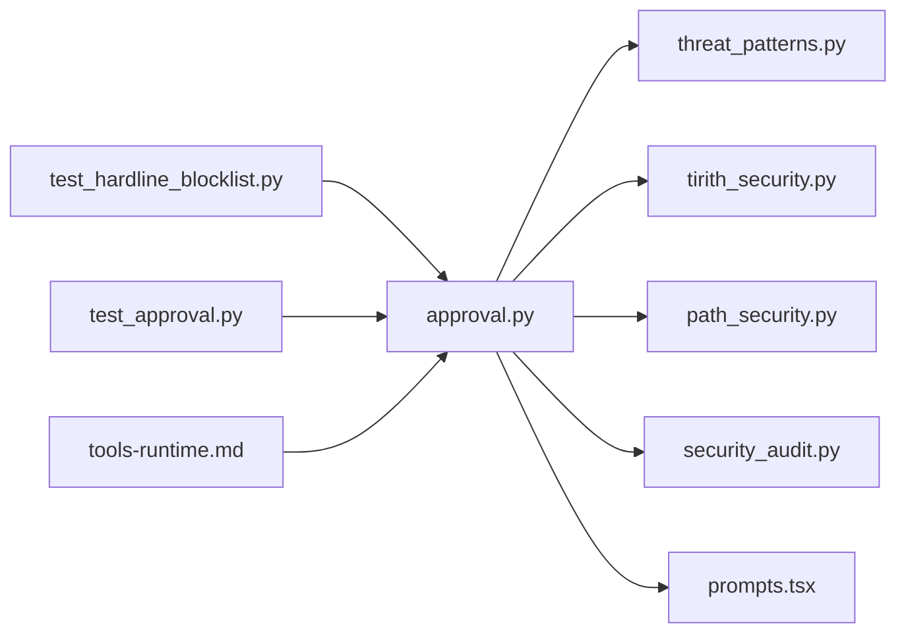

# 安全机制

<cite>
**本文引用的文件**
- [tools/approval.py](file://tools/approval.py)
- [tools/threat_patterns.py](file://tools/threat_patterns.py)
- [hermes_cli/security_audit.py](file://hermes_cli/security_audit.py)
- [hermes_cli/security_advisories.py](file://hermes_cli/security_advisories.py)
- [tools/path_security.py](file://tools/path_security.py)
- [tools/tirith_security.py](file://tools/tirith_security.py)
- [tests/tools/test_hardline_blocklist.py](file://tests/tools/test_hardline_blocklist.py)
- [tests/tools/test_approval.py](file://tests/tools/test_approval.py)
- [website/docs/developer-guide/tools-runtime.md](file://website/docs/developer-guide/tools-runtime.md)
- [ui-tui/src/components/prompts.tsx](file://ui-tui/src/components/prompts.tsx)
</cite>

## 目录
1. [简介](#简介)
2. [项目结构](#项目结构)
3. [核心组件](#核心组件)
4. [架构总览](#架构总览)
5. [详细组件分析](#详细组件分析)
6. [依赖关系分析](#依赖关系分析)
7. [性能考量](#性能考量)
8. [故障排查指南](#故障排查指南)
9. [结论](#结论)
10. [附录](#附录)

## 简介
本文件面向终端工具的安全机制，围绕“危险命令检测系统”“sudo密码缓存与stdin注入防护”“交互式批准流程”“威胁模式识别”展开，系统性阐述安全策略（命令白名单、路径验证、环境变量过滤）、安全配置选项、权限控制与审计日志记录，并提供安全最佳实践、常见问题与修复方案、安全测试方法与漏洞防护策略。同时，重点说明sudo密码缓存的作用域管理、线程安全机制与会话隔离策略。

## 项目结构
安全相关能力主要分布在以下模块：
- 危险命令检测与交互式批准：tools/approval.py
- 威胁模式识别与硬线阻断：tools/threat_patterns.py、tools/tirith_security.py
- 路径安全与运行时隔离：tools/path_security.py
- CLI安全审计与告警：hermes_cli/security_audit.py、hermes_cli/security_advisories.py
- TUI交互式批准界面：ui-tui/src/components/prompts.tsx
- 测试用例覆盖sudo stdin防护、永久允许列表兼容性等：tests/tools/test_hardline_blocklist.py、tests/tools/test_approval.py
- 开发者文档对危险命令审批流程的说明：website/docs/developer-guide/tools-runtime.md

图表来源
- [tools/approval.py](file://tools/approval.py)
- [tools/threat_patterns.py](file://tools/threat_patterns.py)
- [tools/tirith_security.py](file://tools/tirith_security.py)
- [tools/path_security.py](file://tools/path_security.py)
- [hermes_cli/security_audit.py](file://hermes_cli/security_audit.py)
- [hermes_cli/security_advisories.py](file://hermes_cli/security_advisories.py)
- [ui-tui/src/components/prompts.tsx](file://ui-tui/src/components/prompts.tsx)
- [tests/tools/test_hardline_blocklist.py](file://tests/tools/test_hardline_blocklist.py)
- [tests/tools/test_approval.py](file://tests/tools/test_approval.py)
- [website/docs/developer-guide/tools-runtime.md](file://website/docs/developer-guide/tools-runtime.md)

章节来源
- [tools/approval.py](file://tools/approval.py)
- [tools/threat_patterns.py](file://tools/threat_patterns.py)
- [tools/tirith_security.py](file://tools/tirith_security.py)
- [tools/path_security.py](file://tools/path_security.py)
- [hermes_cli/security_audit.py](file://hermes_cli/security_audit.py)
- [hermes_cli/security_advisories.py](file://hermes_cli/security_advisories.py)
- [ui-tui/src/components/prompts.tsx](file://ui-tui/src/components/prompts.tsx)
- [tests/tools/test_hardline_blocklist.py](file://tests/tools/test_hardline_blocklist.py)
- [tests/tools/test_approval.py](file://tests/tools/test_approval.py)
- [website/docs/developer-guide/tools-runtime.md](file://website/docs/developer-guide/tools-runtime.md)

## 核心组件
- 危险命令检测与交互式批准：在执行前对命令进行模式匹配与风险评估，触发交互式批准或自动放行；支持“本次会话”“永久允许”等策略，并持久化到配置。
- sudo密码缓存与stdin注入防护：通过专用检查器识别sudo -S管道输入场景，结合SUDO_PASSWORD环境变量决定是否阻断或放行。
- 威胁模式识别：基于正则与规则集识别高危操作（如递归删除、格式化、远程执行、服务控制等），并可与智能审批联动。
- 路径安全与运行时隔离：限制工作目录、进程边界与资源访问范围，降低横向移动与越权风险。
- 审计与告警：记录审批事件、阻断原因与策略变更，支持外部安全平台集成。
- 用户界面：TUI交互式批准面板，支持键盘选择与快速确认。

章节来源
- [tools/approval.py](file://tools/approval.py)
- [tools/threat_patterns.py](file://tools/threat_patterns.py)
- [tools/tirith_security.py](file://tools/tirith_security.py)
- [tools/path_security.py](file://tools/path_security.py)
- [hermes_cli/security_audit.py](file://hermes_cli/security_audit.py)
- [hermes_cli/security_advisories.py](file://hermes_cli/security_advisories.py)
- [ui-tui/src/components/prompts.tsx](file://ui-tui/src/components/prompts.tsx)

## 架构总览
下图展示从命令进入终端到执行的关键安全路径：检测—评估—批准—执行—审计。

图表来源
- [tools/approval.py](file://tools/approval.py)
- [tools/threat_patterns.py](file://tools/threat_patterns.py)
- [tools/tirith_security.py](file://tools/tirith_security.py)
- [tools/path_security.py](file://tools/path_security.py)
- [ui-tui/src/components/prompts.tsx](file://ui-tui/src/components/prompts.tsx)
- [hermes_cli/security_audit.py](file://hermes_cli/security_audit.py)

## 详细组件分析

### 危险命令检测系统
- 模式库与描述：维护一组正则与描述元组，覆盖破坏性操作（递归删除、格式化、SQL无条件删除、系统配置覆盖、服务控制、远程执行、进程/炸弹类等）。
- 检测流程：在执行前调用检测函数，返回匹配结果与描述；若命中高危模式，进入交互式批准。
- 交互式批准：CLI模式下显示完整命令（无截断），提供“一次”“会话内”“永久允许”“拒绝”选项；网关模式下通过异步回调发送至消息平台；可选智能审批辅助低风险放行。
- 会话状态：按会话跟踪批准状态；一旦某会话批准了“递归删除”，后续同类命令不再重复弹窗。
- 永久允许列表：支持将模式写入配置文件的命令白名单，实现跨会话持久化。

图表来源
- [tools/approval.py](file://tools/approval.py)
- [website/docs/developer-guide/tools-runtime.md](file://website/docs/developer-guide/tools-runtime.md)
- [ui-tui/src/components/prompts.tsx](file://ui-tui/src/components/prompts.tsx)

章节来源
- [tools/approval.py](file://tools/approval.py)
- [website/docs/developer-guide/tools-runtime.md](file://website/docs/developer-guide/tools-runtime.md)
- [ui-tui/src/components/prompts.tsx](file://ui-tui/src/components/prompts.tsx)

### sudo密码缓存与stdin注入防护
- sudo -S场景：当命令包含sudo -S且未设置SUDO_PASSWORD时，视为高风险stdin注入，应阻断。
- 环境变量驱动：若已配置SUDO_PASSWORD，则sudo -S被视作合法（由转换逻辑注入密码），不再阻断。
- 集成点：该检查作为命令守卫的一部分，参与整体批准决策；阻断时不标记为“硬线阻断”（与通用黑名单不同）。
- 测试覆盖：包含阻断清单、良性命令白名单与环境变量生效的回归测试。

图表来源
- [tests/tools/test_hardline_blocklist.py](file://tests/tools/test_hardline_blocklist.py)
- [tools/approval.py](file://tools/approval.py)

章节来源
- [tests/tools/test_hardline_blocklist.py](file://tests/tools/test_hardline_blocklist.py)
- [tools/approval.py](file://tools/approval.py)

### 交互式批准流程
- 全命令展示：批准提示中始终展示完整命令（无截断），避免误判。
- 选项设计：支持“一次”“会话内”“永久允许”“拒绝”，便于用户在安全与效率间平衡。
- TUI键位：支持方向键、回车、数字键与Esc等键位，Esc对应拒绝，保证与全局Ctrl+C处理一致。
- 会话隔离：不同会话的批准状态相互独立，避免跨会话的误授权。

图表来源
- [ui-tui/src/components/prompts.tsx](file://ui-tui/src/components/prompts.tsx)
- [tests/tools/test_approval.py](file://tests/tools/test_approval.py)
- [website/docs/developer-guide/tools-runtime.md](file://website/docs/developer-guide/tools-runtime.md)

章节来源
- [ui-tui/src/components/prompts.tsx](file://ui-tui/src/components/prompts.tsx)
- [tests/tools/test_approval.py](file://tests/tools/test_approval.py)
- [website/docs/developer-guide/tools-runtime.md](file://website/docs/developer-guide/tools-runtime.md)

### 威胁模式识别
- 威胁模式库：集中维护高危操作的正则与描述，用于快速识别破坏性命令。
- 规则扩展：可与Tirith安全规则集成，提升复杂场景下的识别能力。
- 与批准系统协同：威胁模式命中后进入交互式审批；对于低风险但匹配的模式，可结合智能审批自动放行。

图表来源
- [tools/threat_patterns.py](file://tools/threat_patterns.py)
- [tools/tirith_security.py](file://tools/tirith_security.py)
- [tools/approval.py](file://tools/approval.py)

章节来源
- [tools/threat_patterns.py](file://tools/threat_patterns.py)
- [tools/tirith_security.py](file://tools/tirith_security.py)
- [tools/approval.py](file://tools/approval.py)

### 路径安全与运行时隔离
- 工作目录隔离：支持按任务覆盖工作目录，限制命令在受限路径内执行。
- 进程边界：后台进程管理与PTY模式配合，减少命令逃逸与横向移动风险。
- 环境变量过滤：根据平台差异与敏感性过滤环境变量，避免凭据泄露。

章节来源
- [tools/path_security.py](file://tools/path_security.py)
- [website/docs/developer-guide/tools-runtime.md](file://website/docs/developer-guide/tools-runtime.md)

### 审计日志与安全通告
- 审计事件：记录命令、审批人、选择、阻断原因、时间戳等，便于事后追溯。
- 安全通告：发布安全公告与建议，帮助用户及时更新策略与补丁。

章节来源
- [hermes_cli/security_audit.py](file://hermes_cli/security_audit.py)
- [hermes_cli/security_advisories.py](file://hermes_cli/security_advisories.py)

## 依赖关系分析
- approval.py依赖threat_patterns.py与tirith_security.py进行威胁识别；与path_security.py协作完成运行时隔离；与UI组件配合提供交互体验；与安全审计模块对接记录事件。
- TUI prompts.tsx依赖approval.py提供的上下文与选项集合。
- 测试用例覆盖sudo stdin防护与永久允许列表兼容性，确保策略正确落地。

图表来源
- [tools/approval.py](file://tools/approval.py)
- [tools/threat_patterns.py](file://tools/threat_patterns.py)
- [tools/tirith_security.py](file://tools/tirith_security.py)
- [tools/path_security.py](file://tools/path_security.py)
- [hermes_cli/security_audit.py](file://hermes_cli/security_audit.py)
- [ui-tui/src/components/prompts.tsx](file://ui-tui/src/components/prompts.tsx)
- [tests/tools/test_hardline_blocklist.py](file://tests/tools/test_hardline_blocklist.py)
- [tests/tools/test_approval.py](file://tests/tools/test_approval.py)
- [website/docs/developer-guide/tools-runtime.md](file://website/docs/developer-guide/tools-runtime.md)

章节来源
- [tools/approval.py](file://tools/approval.py)
- [tests/tools/test_hardline_blocklist.py](file://tests/tools/test_hardline_blocklist.py)
- [tests/tools/test_approval.py](file://tests/tools/test_approval.py)
- [website/docs/developer-guide/tools-runtime.md](file://website/docs/developer-guide/tools-runtime.md)

## 性能考量
- 检测开销：威胁模式匹配与规则评估应尽量保持正则简洁与规则数量可控，避免长命令导致的延迟。
- 交互成本：交互式批准仅在命中高危模式时触发，减少对常规命令的影响。
- 缓存与持久化：永久允许列表与会话状态应采用高效数据结构，降低I/O与查找成本。
- 并发与隔离：多任务并发执行时，确保会话状态与批准缓存的线程安全与隔离。

## 故障排查指南
- sudo -S被阻断
  - 现象：命令包含sudo -S且未设置SUDO_PASSWORD时被阻断。
  - 排查：确认SUDO_PASSWORD环境变量是否正确注入；若为合法场景，考虑通过配置或脚本注入密码。
  - 参考：[tests/tools/test_hardline_blocklist.py](file://tests/tools/test_hardline_blocklist.py)
- 永久允许列表不生效
  - 现象：用户选择了“永久允许”，但后续仍被阻断。
  - 排查：检查配置文件中的命令白名单是否正确写入；确认会话隔离与策略优先级。
  - 参考：[tests/tools/test_approval.py](file://tests/tools/test_approval.py)
- 批准提示未显示完整命令
  - 现象：批准面板显示截断命令，影响判断。
  - 排查：确认前端是否正确传递完整命令；检查UI渲染逻辑。
  - 参考：[website/docs/developer-guide/tools-runtime.md](file://website/docs/developer-guide/tools-runtime.md)
- 审计日志缺失
  - 现象：执行后未产生审计事件。
  - 排查：检查安全审计模块初始化与事件上报；确认异常捕获与降级策略。

章节来源
- [tests/tools/test_hardline_blocklist.py](file://tests/tools/test_hardline_blocklist.py)
- [tests/tools/test_approval.py](file://tests/tools/test_approval.py)
- [website/docs/developer-guide/tools-runtime.md](file://website/docs/developer-guide/tools-runtime.md)
- [hermes_cli/security_audit.py](file://hermes_cli/security_audit.py)

## 结论
本安全机制以“检测—评估—批准—执行—审计”为主线，结合威胁模式识别、sudo stdin注入防护、交互式批准与运行时隔离，形成多层次的终端安全防线。通过命令白名单、路径验证与环境变量过滤，进一步降低风险面。建议在生产环境中启用审计与告警、定期审查永久允许列表、强化凭据管理与会话隔离策略。

## 附录

### sudo密码缓存的作用域管理、线程安全与会话隔离
- 作用域管理
  - SUDO_PASSWORD应在受控范围内注入（例如仅在sudo -S场景），避免全局污染。
  - 注入时机与生命周期需明确，防止跨命令复用。
- 线程安全
  - 在多线程/多任务并发场景下，确保SUDO_PASSWORD的读取与清理原子化，避免竞态。
- 会话隔离
  - sudo -S的批准状态与密码缓存应与用户会话绑定，避免跨会话继承。

章节来源
- [tests/tools/test_hardline_blocklist.py](file://tests/tools/test_hardline_blocklist.py)
- [tools/approval.py](file://tools/approval.py)

### 安全配置选项与最佳实践
- 命令白名单
  - 将低风险但可能被误判的命令加入永久允许列表，减少误报。
- 路径验证
  - 使用path_security限制工作目录与可访问路径，避免越权。
- 环境变量过滤
  - 根据平台差异过滤敏感变量，避免凭据泄露。
- 权限控制
  - 最小权限原则：尽量避免使用sudo；必要时限定用户与命令范围。
- 审计日志
  - 启用并定期审查审计事件，建立告警与溯源机制。

章节来源
- [tools/path_security.py](file://tools/path_security.py)
- [hermes_cli/security_audit.py](file://hermes_cli/security_audit.py)
- [hermes_cli/security_advisories.py](file://hermes_cli/security_advisories.py)

### 安全测试方法与漏洞防护
- 单元测试
  - sudo stdin防护：覆盖阻断清单、良性命令与环境变量生效场景。
  - 永久允许列表：验证旧键兼容与会话隔离。
- 集成测试
  - 审批流程端到端验证：命令进入—检测—批准—执行—审计。
- 漏洞防护
  - 严控sudo -S：默认阻断，除非明确注入密码。
  - 限制破坏性模式：递归删除、格式化、远程执行等高危操作必须人工批准。
  - 强化凭据管理：避免在命令行与环境变量中明文暴露敏感信息。

章节来源
- [tests/tools/test_hardline_blocklist.py](file://tests/tools/test_hardline_blocklist.py)
- [tests/tools/test_approval.py](file://tests/tools/test_approval.py)
- [tools/approval.py](file://tools/approval.py)