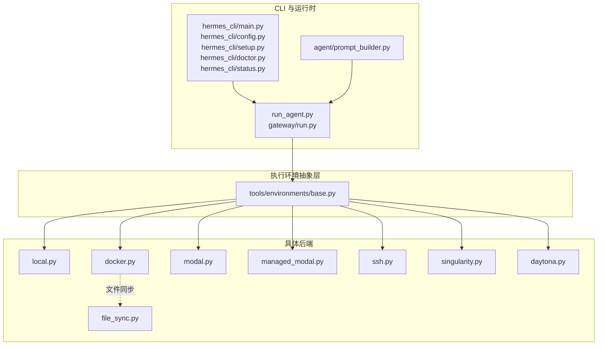
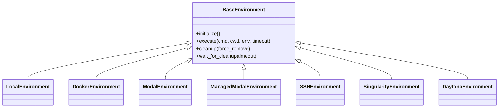
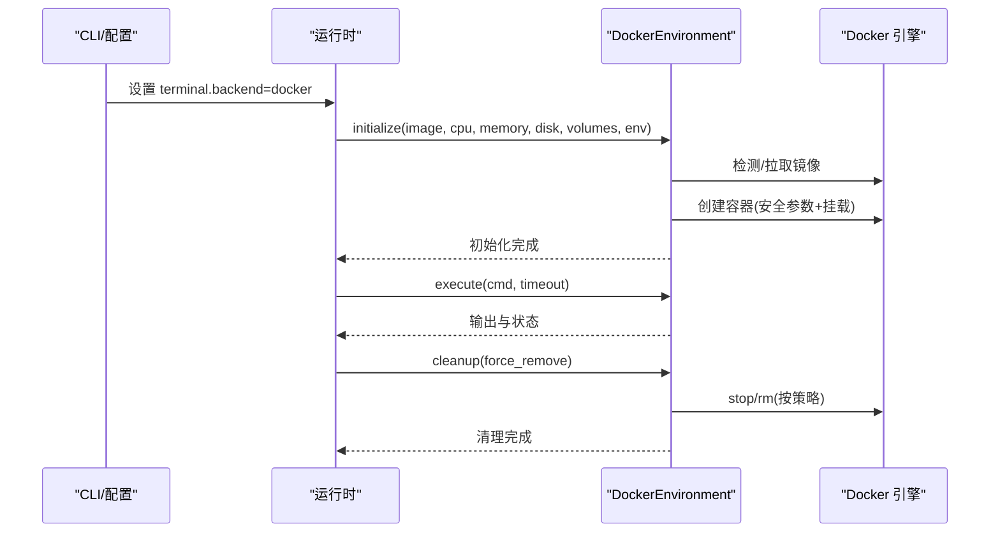
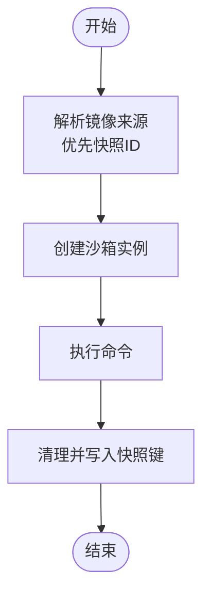
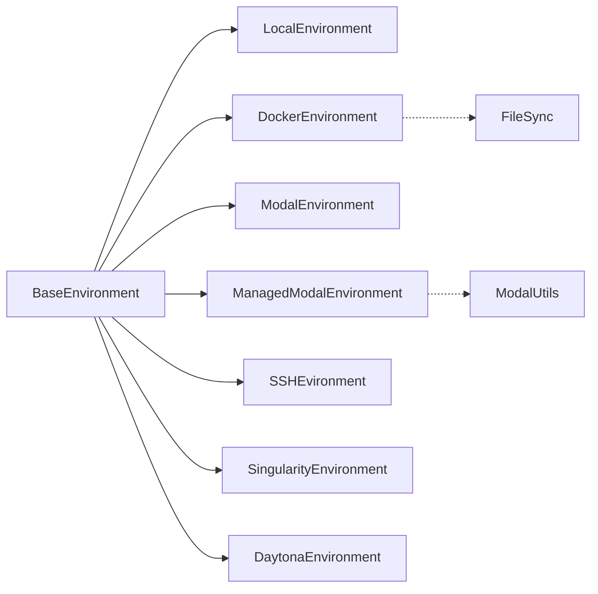
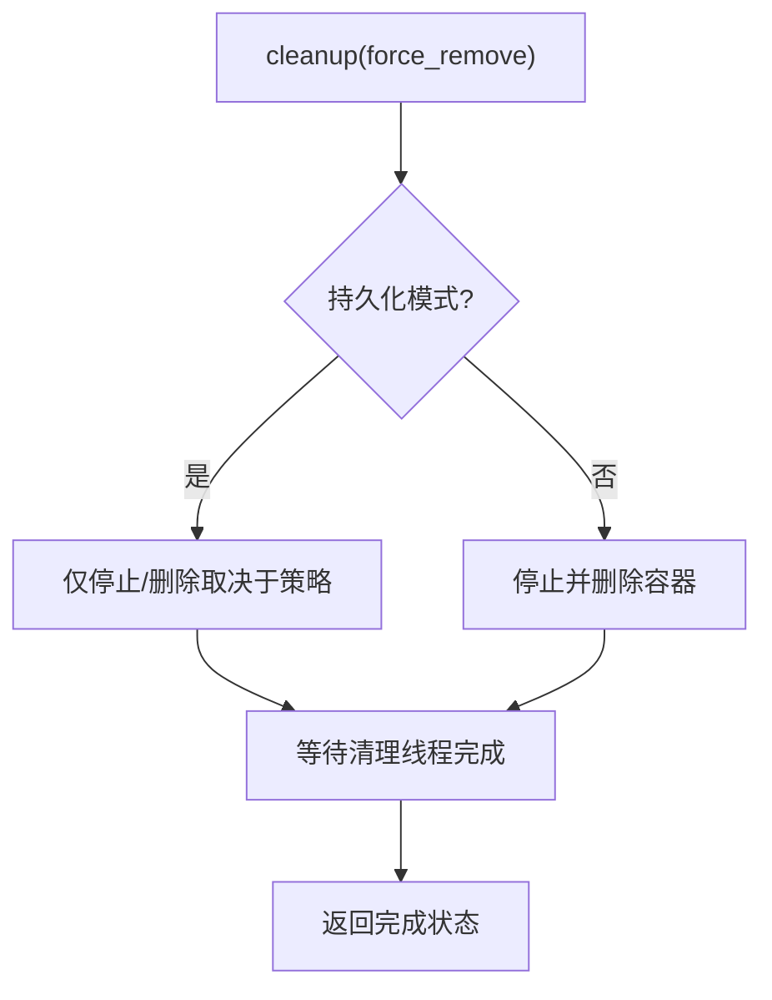

# 执行环境

<cite>
**本文引用的文件**
- [tools/environments/__init__.py](file://tools/environments/__init__.py)
- [tools/environments/base.py](file://tools/environments/base.py)
- [tools/environments/local.py](file://tools/environments/local.py)
- [tools/environments/docker.py](file://tools/environments/docker.py)
- [tools/environments/modal.py](file://tools/environments/modal.py)
- [tools/environments/managed_modal.py](file://tools/environments/managed_modal.py)
- [tools/environments/modal_utils.py](file://tools/environments/modal_utils.py)
- [tools/environments/ssh.py](file://tools/environments/ssh.py)
- [tools/environments/singularity.py](file://tools/environments/singularity.py)
- [tools/environments/daytona.py](file://tools/environments/daytona.py)
- [tools/environments/file_sync.py](file://tools/environments/file_sync.py)
- [hermes_cli/main.py](file://hermes_cli/main.py)
- [hermes_cli/config.py](file://hermes_cli/config.py)
- [hermes_cli/setup.py](file://hermes_cli/setup.py)
- [hermes_cli/doctor.py](file://hermes_cli/doctor.py)
- [hermes_cli/status.py](file://hermes_cli/status.py)
- [run_agent.py](file://run_agent.py)
- [gateway/run.py](file://gateway/run.py)
- [agent/prompt_builder.py](file://agent/prompt_builder.py)
- [website/docs/user-guide/features/tools.md](file://website/docs/user-guide/features/tools.md)
- [website/docs/user-guide/configuration.md](file://website/docs/user-guide/configuration.md)
- [website/docs/user-guide/security.md](file://website/docs/user-guide/security.md)
- [tests/tools/test_docker_environment.py](file://tests/tools/test_docker_environment.py)
- [tests/tools/test_modal_snapshot_isolation.py](file://tests/tools/test_modal_snapshot_isolation.py)
- [tests/tools/test_local_interrupt_cleanup.py](file://tests/tools/test_local_interrupt_cleanup.py)
- [tests/tools/test_file_tools_container_config.py](file://tests/tools/test_file_tools_container_config.py)
</cite>

## 目录
1. [简介](#简介)
2. [项目结构](#项目结构)
3. [核心组件](#核心组件)
4. [架构总览](#架构总览)
5. [详细组件分析](#详细组件分析)
6. [依赖关系分析](#依赖关系分析)
7. [性能与资源特性](#性能与资源特性)
8. [配置与网络设置](#配置与网络设置)
9. [安全与隔离](#安全与隔离)
10. [生命周期管理与资源清理](#生命周期管理与资源清理)
11. [使用示例与最佳实践](#使用示例与最佳实践)
12. [故障排查指南](#故障排查指南)
13. [结论](#结论)

## 简介
本文件系统性梳理终端工具的执行环境体系，覆盖本地、Docker 容器、Modal 云沙箱、SSH 远程、Singularity 容器、Daytona 云工作区等六类后端。内容包括：各环境的适用场景、性能与限制、初始化流程、生命周期管理、资源清理、配置参数、网络与安全隔离、切换机制、监控与恢复策略，并提供可操作的使用示例与最佳实践。

## 项目结构
执行环境由统一抽象接口定义，具体后端实现位于 tools/environments 下，CLI 与运行时通过环境变量或配置选择后端；文档与用户指南提供使用示例与安全建议。

图示来源
- [tools/environments/base.py:287-400](file://tools/environments/base.py#L287-L400)
- [tools/environments/local.py:436-520](file://tools/environments/local.py#L436-L520)
- [tools/environments/docker.py:496-534](file://tools/environments/docker.py#L496-L534)
- [tools/environments/modal.py:163-220](file://tools/environments/modal.py#L163-L220)
- [tools/environments/managed_modal.py:35-80](file://tools/environments/managed_modal.py#L35-L80)
- [tools/environments/ssh.py:35-80](file://tools/environments/ssh.py#L35-L80)
- [tools/environments/singularity.py:155-220](file://tools/environments/singularity.py#L155-L220)
- [tools/environments/daytona.py:29-80](file://tools/environments/daytona.py#L29-L80)
- [tools/environments/file_sync.py:1-200](file://tools/environments/file_sync.py#L1-L200)
- [hermes_cli/main.py:1-200](file://hermes_cli/main.py#L1-L200)
- [hermes_cli/config.py:5900-6060](file://hermes_cli/config.py#L5900-L6060)
- [hermes_cli/setup.py:1400-1450](file://hermes_cli/setup.py#L1400-L1450)
- [hermes_cli/doctor.py:1260-1370](file://hermes_cli/doctor.py#L1260-L1370)
- [hermes_cli/status.py:390-410](file://hermes_cli/status.py#L390-L410)
- [run_agent.py:70-85](file://run_agent.py#L70-L85)
- [gateway/run.py:900-940](file://gateway/run.py#L900-L940)
- [agent/prompt_builder.py:820-850](file://agent/prompt_builder.py#L820-L850)

章节来源
- [tools/environments/__init__.py:1-14](file://tools/environments/__init__.py#L1-L14)
- [tools/environments/base.py:287-400](file://tools/environments/base.py#L287-L400)

## 核心组件
- 抽象基类：统一生命周期（初始化、执行、清理）、错误处理与资源管理契约。
- 具体后端：按平台/沙箱能力实现，提供隔离级别、网络与持久化选项。
- CLI/运行时：负责解析配置、选择后端、传递环境变量与资源参数。

章节来源
- [tools/environments/base.py:287-400](file://tools/environments/base.py#L287-L400)
- [tools/environments/local.py:436-520](file://tools/environments/local.py#L436-L520)
- [tools/environments/docker.py:496-534](file://tools/environments/docker.py#L496-L534)
- [tools/environments/modal.py:163-220](file://tools/environments/modal.py#L163-L220)
- [tools/environments/managed_modal.py:35-80](file://tools/environments/managed_modal.py#L35-L80)
- [tools/environments/ssh.py:35-80](file://tools/environments/ssh.py#L35-L80)
- [tools/environments/singularity.py:155-220](file://tools/environments/singularity.py#L155-L220)
- [tools/environments/daytona.py:29-80](file://tools/environments/daytona.py#L29-L80)

## 架构总览
统一抽象接口定义了所有后端的一致行为，CLI 与运行时通过环境变量或配置项选择后端类型；不同后端在初始化阶段注入资源参数、网络与安全策略，执行阶段提供命令执行与输出捕获，清理阶段负责回收资源与持久化。

图示来源
- [tools/environments/base.py:287-400](file://tools/environments/base.py#L287-L400)
- [tools/environments/local.py:436-520](file://tools/environments/local.py#L436-L520)
- [tools/environments/docker.py:496-534](file://tools/environments/docker.py#L496-L534)
- [tools/environments/modal.py:163-220](file://tools/environments/modal.py#L163-L220)
- [tools/environments/managed_modal.py:35-80](file://tools/environments/managed_modal.py#L35-L80)
- [tools/environments/ssh.py:35-80](file://tools/environments/ssh.py#L35-L80)
- [tools/environments/singularity.py:155-220](file://tools/environments/singularity.py#L155-L220)
- [tools/environments/daytona.py:29-80](file://tools/environments/daytona.py#L29-L80)

## 详细组件分析

### 本地环境（Local）
- 特性：直接在宿主机执行命令，无隔离边界；适合开发调试与可信环境。
- 资源与限制：受宿主系统限制；默认不进行危险命令检查（可通过策略启用）。
- 初始化：解析当前工作目录、超时、环境变量；支持中断信号传播。
- 生命周期：执行完成后立即返回；清理主要处理进程组与孤儿进程问题。
- 适用场景：本地开发、快速验证、受限资源测试。

章节来源
- [tools/environments/local.py:436-520](file://tools/environments/local.py#L436-L520)
- [tests/tools/test_local_interrupt_cleanup.py:186-201](file://tests/tools/test_local_interrupt_cleanup.py#L186-L201)

### Docker 容器环境（Docker）
- 特性：容器化隔离、能力降级、PID 限制、tmpfs 挂载、只读根文件系统；支持持久化卷与临时文件系统两种工作区模式。
- 资源与限制：CPU、内存、磁盘配额；默认持久化开启；支持挂载与环境变量转发。
- 初始化：检测 Docker 可用性、拉取镜像、创建容器、挂载卷、设置网络与安全参数。
- 生命周期：支持“长驻”共享容器与“按会话”销毁；清理阶段确保 stop/rm 有序完成，避免泄漏。
- 适用场景：生产网关、需要强隔离与可重复性的任务。

图示来源
- [tools/environments/docker.py:496-534](file://tools/environments/docker.py#L496-L534)
- [tests/tools/test_docker_environment.py:1043-1212](file://tests/tools/test_docker_environment.py#L1043-L1212)

章节来源
- [tools/environments/docker.py:496-534](file://tools/environments/docker.py#L496-L534)
- [website/docs/user-guide/features/tools.md:106-151](file://website/docs/user-guide/features/tools.md#L106-L151)
- [website/docs/user-guide/configuration.md:201-209](file://website/docs/user-guide/configuration.md#L201-L209)
- [website/docs/user-guide/security.md:350-460](file://website/docs/user-guide/security.md#L350-L460)
- [tests/tools/test_docker_environment.py:1043-1212](file://tests/tools/test_docker_environment.py#L1043-L1212)

### Modal 云沙箱环境（Modal）
- 特性：无服务器云沙箱，按需分配资源；支持快照复用与注册表回退；支持直接模式与托管模式。
- 资源与限制：按任务动态分配；快照存储与清理策略；镜像优先从快照加载，失败则回退到注册表镜像。
- 初始化：解析镜像来源（快照 ID 或注册表），创建沙箱实例，准备工作区。
- 生命周期：清理阶段写入命名空间化的快照键值，便于后续任务复用。
- 适用场景：弹性扩展、多租户隔离、减少冷启动开销。

图示来源
- [tools/environments/modal.py:163-220](file://tools/environments/modal.py#L163-L220)
- [tools/environments/modal_utils.py:57-120](file://tools/environments/modal_utils.py#L57-L120)
- [tests/tools/test_modal_snapshot_isolation.py:200-248](file://tests/tools/test_modal_snapshot_isolation.py#L200-L248)

章节来源
- [tools/environments/modal.py:163-220](file://tools/environments/modal.py#L163-L220)
- [tools/environments/managed_modal.py:35-80](file://tools/environments/managed_modal.py#L35-L80)
- [tools/environments/modal_utils.py:57-120](file://tools/environments/modal_utils.py#L57-L120)
- [tests/tools/test_modal_snapshot_isolation.py:200-248](file://tests/tools/test_modal_snapshot_isolation.py#L200-L248)

### SSH 远程环境（SSH）
- 特性：在远端机器上执行命令，适合跨主机协作与专用硬件资源。
- 资源与限制：受限于远端系统配置；网络延迟与带宽影响交互体验。
- 初始化：建立 SSH 连接、协商工作目录与环境变量；处理密钥与端口配置。
- 生命周期：连接保持与断开；清理阶段确保会话终止与资源回收。
- 适用场景：独立服务器、HPC 集群、专用设备。

章节来源
- [tools/environments/ssh.py:35-80](file://tools/environments/ssh.py#L35-L80)
- [hermes_cli/doctor.py:1340-1360](file://hermes_cli/doctor.py#L1340-L1360)

### Singularity 容器环境（Apptainer）
- 特性：面向 HPC 的容器方案，支持从 Docker 注册表或本地 SIF 镜像运行。
- 资源与限制：与容器后端类似的安全与隔离策略；镜像构建与分发需遵循 Apptainer 生态。
- 初始化：解析镜像路径（本地 SIF 或 docker://），准备运行时参数。
- 生命周期：与容器后端一致的执行与清理流程。
- 适用场景：高性能计算、受限集群环境。

章节来源
- [tools/environments/singularity.py:155-220](file://tools/environments/singularity.py#L155-L220)
- [website/docs/user-guide/features/tools.md:106-116](file://website/docs/user-guide/features/tools.md#L106-L116)

### Daytona 云工作区环境
- 牙买加工作区：提供持久化的云端开发环境，适合长期迭代与团队协作。
- 资源与限制：按工作区规格分配；支持持久卷与 IDE/终端集成。
- 初始化：连接工作区、准备工作目录与环境变量。
- 生命周期：随工作区生命周期管理；清理策略与工作区关闭逻辑一致。
- 适用场景：云端开发、持续集成/部署、团队共享环境。

章节来源
- [tools/environments/daytona.py:29-80](file://tools/environments/daytona.py#L29-L80)
- [hermes_cli/doctor.py:1355-1365](file://hermes_cli/doctor.py#L1355-L1365)

## 依赖关系分析
- 后端均继承自统一抽象，保证调用一致性。
- CLI 与运行时通过环境变量或配置桥接选择后端。
- Docker 后端可选文件同步模块以支持工作区同步。
- Modal 系列后端共享基础沙箱工具类。

图示来源
- [tools/environments/base.py:287-400](file://tools/environments/base.py#L287-L400)
- [tools/environments/docker.py:496-534](file://tools/environments/docker.py#L496-L534)
- [tools/environments/modal_utils.py:57-120](file://tools/environments/modal_utils.py#L57-L120)
- [tools/environments/file_sync.py:1-200](file://tools/environments/file_sync.py#L1-L200)

章节来源
- [tools/environments/base.py:287-400](file://tools/environments/base.py#L287-L400)
- [tools/environments/docker.py:496-534](file://tools/environments/docker.py#L496-L534)
- [tools/environments/modal_utils.py:57-120](file://tools/environments/modal_utils.py#L57-L120)
- [tools/environments/file_sync.py:1-200](file://tools/environments/file_sync.py#L1-L200)

## 性能与资源特性
- CPU/内存/磁盘配额：容器后端统一支持；Modal 按任务动态分配；SSH/HPC 后端受远端资源限制。
- 持久化与临时文件系统：容器后端可选持久卷或 tmpfs；Modal/Daytona 提供持久工作区。
- 并发与隔离：容器/沙箱作为安全边界；并发子代理共享容器时需注意路径冲突与隔离策略。
- 网络：容器默认启用网络；Modal/Daytona 受平台网络策略约束；SSH 受远端网络可达性影响。

章节来源
- [website/docs/user-guide/features/tools.md:125-151](file://website/docs/user-guide/features/tools.md#L125-L151)
- [website/docs/user-guide/configuration.md:201-209](file://website/docs/user-guide/configuration.md#L201-L209)
- [website/docs/user-guide/security.md:363-373](file://website/docs/user-guide/security.md#L363-L373)

## 配置与网络设置
- 后端选择：TERMINAL_ENV 控制后端类型；CLI 提供配置命令与安装指引。
- 容器资源：container_cpu、container_memory、container_disk、container_persistent。
- 环境变量转发：docker_forward_env（容器后端）；Modal/Daytona 支持凭证文件挂载与同步。
- 网络：容器默认网络可用；Modal/Daytona 受平台网络策略；SSH 需正确配置密钥与端口。

章节来源
- [hermes_cli/config.py:5980-6060](file://hermes_cli/config.py#L5980-L6060)
- [hermes_cli/setup.py:1420-1430](file://hermes_cli/setup.py#L1420-L1430)
- [hermes_cli/doctor.py:1260-1370](file://hermes_cli/doctor.py#L1260-L1370)
- [hermes_cli/status.py:390-410](file://hermes_cli/status.py#L390-L410)
- [website/docs/user-guide/features/tools.md:106-151](file://website/docs/user-guide/features/tools.md#L106-L151)
- [website/docs/user-guide/security.md:440-460](file://website/docs/user-guide/security.md#L440-L460)

## 安全与隔离
- 本地/SSH：无容器/沙箱隔离，需启用危险命令检查与最小权限原则。
- Docker：能力降级、只读根文件系统、PID 限制、tmpfs 限制、持久卷隔离。
- Modal/Daytona：云沙箱隔离，快照与镜像策略保障一致性。
- 环境变量：容器后端可显式转发；Modal/Daytona 使用只读挂载与同步；敏感变量默认过滤。

章节来源
- [website/docs/user-guide/security.md:350-460](file://website/docs/user-guide/security.md#L350-L460)
- [website/docs/user-guide/features/tools.md:140-151](file://website/docs/user-guide/features/tools.md#L140-L151)

## 生命周期管理与资源清理
- 统一契约：initialize/exec/cleanup/wait_for_cleanup。
- Docker：默认持久模式不主动停止/删除容器；显式强制清理时执行 stop/rm；避免容器泄漏。
- Modal：清理阶段写入命名空间化的快照键，便于后续复用与清理。
- 中断与孤儿进程：本地后端确保 KeyboardInterrupt 正确传播与进程组清理。

图示来源
- [tests/tools/test_docker_environment.py:1120-1196](file://tests/tools/test_docker_environment.py#L1120-L1196)
- [tests/tools/test_modal_snapshot_isolation.py:236-245](file://tests/tools/test_modal_snapshot_isolation.py#L236-L245)

章节来源
- [tests/tools/test_docker_environment.py:1043-1212](file://tests/tools/test_docker_environment.py#L1043-L1212)
- [tests/tools/test_modal_snapshot_isolation.py:200-248](file://tests/tools/test_modal_snapshot_isolation.py#L200-L248)
- [tests/tools/test_local_interrupt_cleanup.py:186-201](file://tests/tools/test_local_interrupt_cleanup.py#L186-L201)

## 使用示例与最佳实践
- 切换后端：通过 CLI 设置 terminal.backend；Docker 需要安装并可用；Modal 需要安装与认证；SSH 需配置密钥与端口；Singularity 需预构建 SIF；Daytona 需可用工作区。
- 容器资源配置：统一设置 CPU/内存/磁盘与持久化；持久化模式适合需要缓存与依赖复用的任务。
- 环境变量与凭证：谨慎使用转发列表；优先使用只读挂载与同步；避免将基础设施密钥加入 passthrough。
- 并发与隔离：共享容器时为子任务注册独立镜像覆盖，避免路径与状态冲突。

章节来源
- [website/docs/user-guide/features/tools.md:106-151](file://website/docs/user-guide/features/tools.md#L106-L151)
- [website/docs/user-guide/security.md:440-460](file://website/docs/user-guide/security.md#L440-L460)
- [tests/tools/test_file_tools_container_config.py:7-37](file://tests/tools/test_file_tools_container_config.py#L7-L37)

## 故障排查指南
- Docker 后端
  - 症状：默认持久模式不清理容器导致泄漏。
  - 处理：显式传入 force_remove 触发 stop/rm；确认 subprocess.run 调用而非 Popen。
- Modal 后端
  - 症状：快照过期或不可用。
  - 处理：清理旧快照并回退到注册表镜像；检查清理阶段是否写入命名空间键。
- 本地后端
  - 症状：键盘中断后出现孤儿进程或静默失败。
  - 处理：确保 wait_for_cleanup 返回成功；检查进程组与信号传播。
- SSH 后端
  - 症状：无法连接或认证失败。
  - 处理：确认密钥、端口与远端可达性；检查 doctor 命令提示。

章节来源
- [tests/tools/test_docker_environment.py:1160-1196](file://tests/tools/test_docker_environment.py#L1160-L1196)
- [tests/tools/test_modal_snapshot_isolation.py:217-245](file://tests/tools/test_modal_snapshot_isolation.py#L217-L245)
- [tests/tools/test_local_interrupt_cleanup.py:186-201](file://tests/tools/test_local_interrupt_cleanup.py#L186-L201)
- [hermes_cli/doctor.py:1340-1365](file://hermes_cli/doctor.py#L1340-L1365)

## 结论
该执行环境体系以统一抽象为核心，结合多种后端满足从本地开发到云端生产的多样化需求。通过明确的生命周期管理、资源清理策略与安全隔离措施，可在不同场景下平衡性能、隔离与易用性。建议根据任务特性选择合适后端，合理配置资源与网络，严格控制环境变量与凭证暴露，并在并发场景中加强隔离与状态隔离。