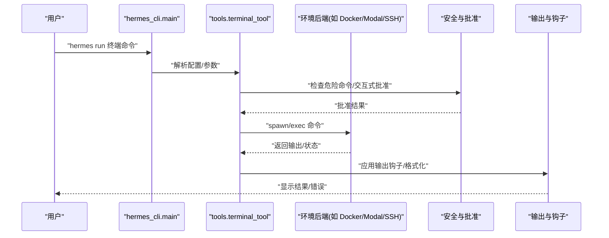
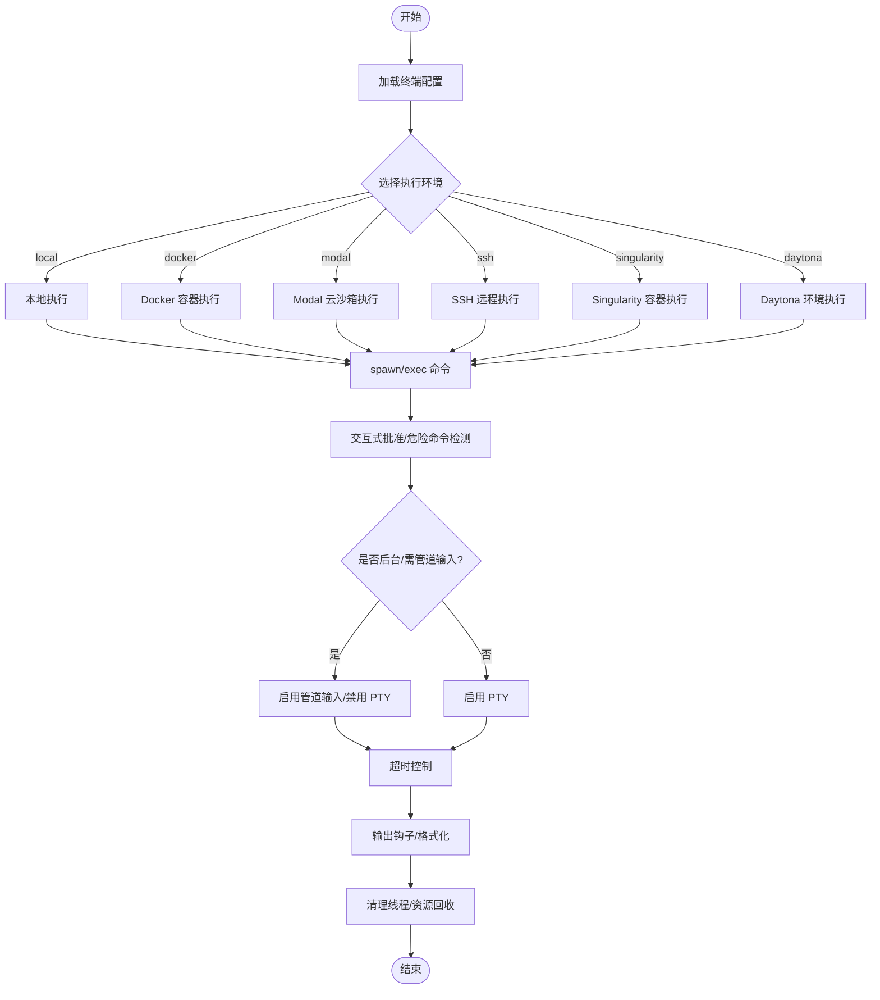
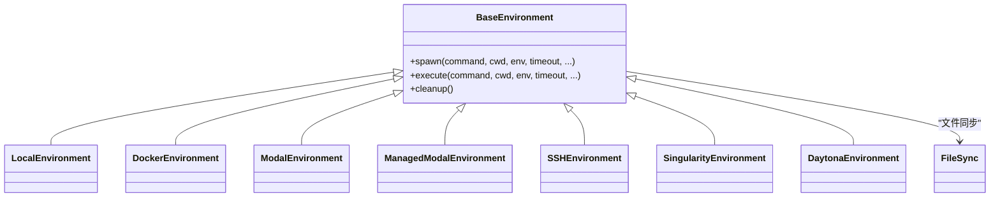
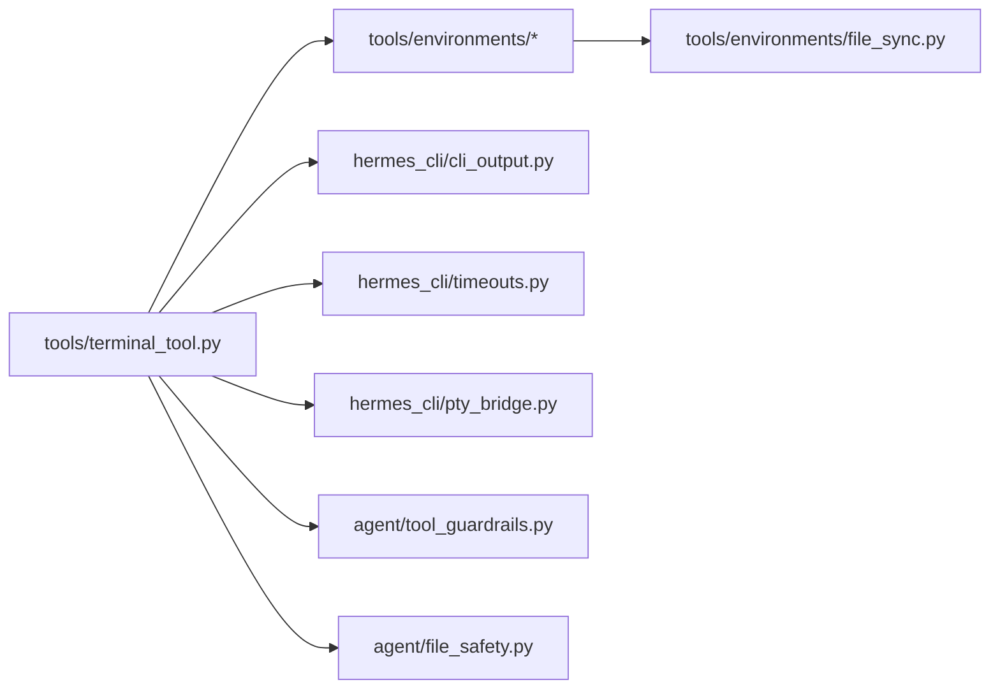

# 终端工具

<cite>
**本文引用的文件**
- [tools/terminal_tool.py](file://tools/terminal_tool.py)
- [tools/environments/base.py](file://tools/environments/base.py)
- [tools/environments/local.py](file://tools/environments/local.py)
- [tools/environments/docker.py](file://tools/environments/docker.py)
- [tools/environments/ssh.py](file://tools/environments/ssh.py)
- [tools/environments/singularity.py](file://tools/environments/singularity.py)
- [tools/environments/modal.py](file://tools/environments/modal.py)
- [tools/environments/managed_modal.py](file://tools/environments/managed_modal.py)
- [tools/environments/daytona.py](file://tools/environments/daytona.py)
- [tools/environments/file_sync.py](file://tools/environments/file_sync.py)
- [tools/environments/__init__.py](file://tools/environments/__init__.py)
- [hermes_cli/main.py](file://hermes_cli/main.py)
- [hermes_cli/cli_output.py](file://hermes_cli/cli_output.py)
- [hermes_cli/timeouts.py](file://hermes_cli/timeouts.py)
- [hermes_cli/stdio.py](file://hermes_cli/stdio.py)
- [hermes_cli/pty_bridge.py](file://hermes_cli/pty_bridge.py)
- [hermes_cli/runtime_provider.py](file://hermes_cli/runtime_provider.py)
- [hermes_cli/container_boot.py](file://hermes_cli/container_boot.py)
- [hermes_cli/env_loader.py](file://hermes_cli/env_loader.py)
- [hermes_cli/middleware.py](file://hermes_cli/middleware.py)
- [hermes_cli/tools_config.py](file://hermes_cli/tools_config.py)
- [hermes_cli/_subprocess_compat.py](file://hermes_cli/_subprocess_compat.py)
- [agent/tool_guardrails.py](file://agent/tool_guardrails.py)
- [agent/file_safety.py](file://agent/file_safety.py)
- [agent/background_review.py](file://agent/background_review.py)
- [acp_adapter/server.py](file://acp_adapter/server.py)
- [acp_adapter/session.py](file://acp_adapter/session.py)
- [website/docs/user-guide/configuration.md](file://website/docs/user-guide/configuration.md)
- [website/docs/user-guide/features/tools.md](file://website/docs/user-guide/features/tools.md)
- [tests/tools/test_terminal_tool.py](file://tests/tools/test_terminal_tool.py)
- [tests/tools/test_terminal_output_transform_hook.py](file://tests/tools/test_terminal_output_transform_hook.py)
- [tests/tools/test_terminal_tool_pty_fallback.py](file://tests/tools/test_terminal_tool_pty_fallback.py)
- [tests/integration/test_modal_terminal.py](file://tests/integration/test_modal_terminal.py)
- [tests/integration/test_daytona_terminal.py](file://tests/integration/test_daytona_terminal.py)
- [docker/hermes-exec-shim.sh](file://docker/hermes-exec-shim.sh)
- [docker/main-wrapper.sh](file://docker/main-wrapper.sh)
- [docker/stage2-hook.sh](file://docker/stage2-hook.sh)
- [docker/entrypoint.sh](file://docker/entrypoint.sh)
- [docker/SOUL.md](file://docker/SOUL.md)
- [docs/security/network-egress-isolation.md](file://docs/security/network-egress-isolation.md)
</cite>

## 目录
1. [简介](#简介)
2. [项目结构](#项目结构)
3. [核心组件](#核心组件)
4. [架构总览](#架构总览)
5. [详细组件分析](#详细组件分析)
6. [依赖关系分析](#依赖关系分析)
7. [性能考量](#性能考量)
8. [故障排查指南](#故障排查指南)
9. [结论](#结论)
10. [附录](#附录)

## 简介
本文件为 Hermes Agent 终端工具的技术文档，聚焦于其多环境执行能力（本地、Docker、Modal 云沙箱、SSH 远程、Singularity 容器、Daytona 环境）与安全机制（危险命令检测、sudo 密码缓存、交互式批准、沙箱隔离）、环境变量管理、超时控制、后台任务支持与资源清理策略，并提供配置项说明与使用示例，帮助用户在不同执行环境中安全高效地运行命令。

## 项目结构
终端工具由“工具层”和“环境后端层”组成：
- 工具层：负责命令解析、交互式批准、PTY/管道选择、输出钩子、超时与清理等横切逻辑
- 环境后端层：统一抽象不同执行环境（本地、Docker、Modal、SSH、Singularity、Daytona），实现相同接口以替换执行上下文

```mermaid
graph TB
subgraph "工具层"
TT["tools/terminal_tool.py"]
CLIOut["hermes_cli/cli_output.py"]
Timeouts["hermes_cli/timeouts.py"]
Stdio["hermes_cli/stdio.py"]
PTY["hermes_cli/pty_bridge.py"]
EnvLoader["hermes_cli/env_loader.py"]
ToolsCfg["hermes_cli/tools_config.py"]
end
subgraph "环境后端层"
Base["tools/environments/base.py"]
Local["tools/environments/local.py"]
Docker["tools/environments/docker.py"]
Modal["tools/environments/modal.py"]
ManagedModal["tools/environments/managed_modal.py"]
SSH["tools/environments/ssh.py"]
Sing["tools/environments/singularity.py"]
Daytona["tools/environments/daytona.py"]
Sync["tools/environments/file_sync.py"]
end
TT --> Base
TT --> Local
TT --> Docker
TT --> Modal
TT --> ManagedModal
TT --> SSH
TT --> Sing
TT --> Daytona
TT --> Sync
TT --> CLIOut
TT --> Timeouts
TT --> Stdio
TT --> PTY
TT --> EnvLoader
TT --> ToolsCfg
```

图表来源
- [tools/terminal_tool.py](file://tools/terminal_tool.py)
- [tools/environments/base.py](file://tools/environments/base.py)
- [tools/environments/local.py](file://tools/environments/local.py)
- [tools/environments/docker.py](file://tools/environments/docker.py)
- [tools/environments/modal.py](file://tools/environments/modal.py)
- [tools/environments/managed_modal.py](file://tools/environments/managed_modal.py)
- [tools/environments/ssh.py](file://tools/environments/ssh.py)
- [tools/environments/singularity.py](file://tools/environments/singularity.py)
- [tools/environments/daytona.py](file://tools/environments/daytona.py)
- [tools/environments/file_sync.py](file://tools/environments/file_sync.py)
- [hermes_cli/cli_output.py](file://hermes_cli/cli_output.py)
- [hermes_cli/timeouts.py](file://hermes_cli/timeouts.py)
- [hermes_cli/stdio.py](file://hermes_cli/stdio.py)
- [hermes_cli/pty_bridge.py](file://hermes_cli/pty_bridge.py)
- [hermes_cli/env_loader.py](file://hermes_cli/env_loader.py)
- [hermes_cli/tools_config.py](file://hermes_cli/tools_config.py)

章节来源
- [tools/environments/__init__.py](file://tools/environments/__init__.py)
- [website/docs/user-guide/configuration.md](file://website/docs/user-guide/configuration.md)

## 核心组件
- 终端工具入口与工厂
  - 工厂函数根据配置选择具体环境后端，封装统一的执行接口
  - 支持交互式批准回调注册、PTYSpawn/管道选择、输出钩子、超时与清理线程
- 环境后端抽象
  - 所有后端实现同一接口，屏蔽差异；当前实现包括本地、Docker、Modal（含直连与托管模式）、SSH、Singularity、Daytona
- 安全与隔离
  - 危险命令检测与拦截、sudo 密码缓存、交互式批准系统、容器/云沙箱隔离策略
- 配置与运行时
  - CLI 配置、环境变量同步、超时参数、容器资源与持久化、Docker 入口脚本与引导

章节来源
- [tools/terminal_tool.py](file://tools/terminal_tool.py)
- [tools/environments/base.py](file://tools/environments/base.py)
- [hermes_cli/main.py](file://hermes_cli/main.py)
- [hermes_cli/tools_config.py](file://hermes_cli/tools_config.py)
- [hermes_cli/env_loader.py](file://hermes_cli/env_loader.py)
- [hermes_cli/timeouts.py](file://hermes_cli/timeouts.py)

## 架构总览
终端工具通过“配置驱动”的工厂选择执行环境，结合安全与运行时特性，完成跨环境的一致性执行体验。

图表来源
- [tools/terminal_tool.py](file://tools/terminal_tool.py)
- [hermes_cli/main.py](file://hermes_cli/main.py)
- [agent/tool_guardrails.py](file://agent/tool_guardrails.py)

## 详细组件分析

### 终端工具主流程与工厂
- 工厂选择逻辑
  - 根据配置选择后端（local/docker/modal/ssh/singularity/daytona）
  - 支持 modal 的 auto/直连/托管模式
- 执行流程
  - 交互式批准回调注册与恢复
  - PTY/管道自动选择（如需要管道输入或后台任务）
  - 超时控制与清理线程
  - 输出钩子与 CLI 输出格式化
- 关键行为
  - 后台任务禁用 PTY，避免阻塞
  - 对特定命令（如带令牌登录）强制管道输入
  - 持久化环境标识与清理策略

图表来源
- [tools/terminal_tool.py](file://tools/terminal_tool.py)
- [hermes_cli/pty_bridge.py](file://hermes_cli/pty_bridge.py)
- [hermes_cli/timeouts.py](file://hermes_cli/timeouts.py)
- [hermes_cli/cli_output.py](file://hermes_cli/cli_output.py)

章节来源
- [tools/terminal_tool.py](file://tools/terminal_tool.py)
- [tests/tools/test_terminal_tool_pty_fallback.py](file://tests/tools/test_terminal_tool_pty_fallback.py)
- [tests/tools/test_terminal_output_transform_hook.py](file://tests/tools/test_terminal_output_transform_hook.py)

### 环境后端抽象与实现
- 抽象基类
  - 定义统一接口（如 spawn/exec/cleanup 等），确保各后端一致性
- 具体后端
  - 本地：直接在宿主机执行，无隔离
  - Docker：容器执行，支持只读根文件系统、能力降级、PID 限制、命名空间隔离、持久卷
  - Modal：Modal 云沙箱，支持 auto/直连/托管模式
  - SSH：远程服务器执行，网络边界隔离
  - Singularity：HPC/共享机器场景，namespace 隔离
  - Daytona：云端容器开发环境
- 文件同步
  - 提供工作区文件同步与变更感知，保障跨环境一致性

图表来源
- [tools/environments/base.py](file://tools/environments/base.py)
- [tools/environments/local.py](file://tools/environments/local.py)
- [tools/environments/docker.py](file://tools/environments/docker.py)
- [tools/environments/modal.py](file://tools/environments/modal.py)
- [tools/environments/managed_modal.py](file://tools/environments/managed_modal.py)
- [tools/environments/ssh.py](file://tools/environments/ssh.py)
- [tools/environments/singularity.py](file://tools/environments/singularity.py)
- [tools/environments/daytona.py](file://tools/environments/daytona.py)
- [tools/environments/file_sync.py](file://tools/environments/file_sync.py)

章节来源
- [tools/environments/base.py](file://tools/environments/base.py)
- [tools/environments/local.py](file://tools/environments/local.py)
- [tools/environments/docker.py](file://tools/environments/docker.py)
- [tools/environments/modal.py](file://tools/environments/modal.py)
- [tools/environments/managed_modal.py](file://tools/environments/managed_modal.py)
- [tools/environments/ssh.py](file://tools/environments/ssh.py)
- [tools/environments/singularity.py](file://tools/environments/singularity.py)
- [tools/environments/daytona.py](file://tools/environments/daytona.py)
- [tools/environments/file_sync.py](file://tools/environments/file_sync.py)

### 安全机制与隔离
- 危险命令检测
  - 在执行前进行命令与参数扫描，阻止高危操作
- sudo 密码缓存
  - 在交互式会话中缓存 sudo 凭据，减少重复输入
- 交互式批准系统
  - 通过回调注册与恢复，确保关键动作需要人工确认
- 沙箱与隔离
  - Docker：只读根、丢弃能力、无提权、PID 限制、命名空间隔离、持久卷
  - Modal/Daytona：云 VM/容器隔离
  - SSH：网络边界隔离
- 防御性安全说明
  - 本地后端不提供 OS 级隔离，建议配合工具禁用与容器后端使用

章节来源
- [agent/tool_guardrails.py](file://agent/tool_guardrails.py)
- [agent/file_safety.py](file://agent/file_safety.py)
- [acp_adapter/server.py](file://acp_adapter/server.py)
- [acp_adapter/session.py](file://acp_adapter/session.py)
- [website/docs/user-guide/features/tools.md](file://website/docs/user-guide/features/tools.md)

### 环境变量管理与超时控制
- 环境变量
  - 支持从宿主加载并同步到容器/远端环境
  - Docker 可选显式允许列表转发变量
- 超时控制
  - 前台命令可被超时上限限制
  - 后台任务与 PTY 行为受 PTY/管道选择影响
- 容器资源
  - CPU、内存、磁盘、持久化可通过配置启用

章节来源
- [hermes_cli/env_loader.py](file://hermes_cli/env_loader.py)
- [hermes_cli/timeouts.py](file://hermes_cli/timeouts.py)
- [website/docs/user-guide/configuration.md](file://website/docs/user-guide/configuration.md)
- [website/docs/user-guide/features/tools.md](file://website/docs/user-guide/features/tools.md)

### 后台任务支持与资源清理
- 后台任务
  - 自动禁用 PTY，避免阻塞；必要时启用管道输入
- 清理策略
  - 清理线程定期回收闲置环境
  - 容器/云环境按会话或持久化策略清理
- Docker 引导脚本
  - 入口脚本与包装器确保容器内正确初始化与权限

章节来源
- [tests/tools/test_terminal_tool_pty_fallback.py](file://tests/tools/test_terminal_tool_pty_fallback.py)
- [hermes_cli/pty_bridge.py](file://hermes_cli/pty_bridge.py)
- [docker/entrypoint.sh](file://docker/entrypoint.sh)
- [docker/main-wrapper.sh](file://docker/main-wrapper.sh)
- [docker/hermes-exec-shim.sh](file://docker/hermes-exec-shim.sh)
- [docker/stage2-hook.sh](file://docker/stage2-hook.sh)
- [docker/SOUL.md](file://docker/SOUL.md)

### 配置选项说明
- 后端选择与模式
  - local、docker、ssh、modal、singularity、daytona
  - modal_mode: auto/直连/托管
- 容器资源与安全
  - container_cpu、container_memory、container_disk、container_persistent
  - 容器安全硬核：只读根、丢弃能力、无提权、PID 限制、命名空间隔离、持久卷
- 环境变量与转发
  - docker_forward_env（可选显式允许列表）
- 示例与最佳实践
  - Singularity 预构建 SIF 并设置镜像路径
  - Modal 安装依赖并初始化

章节来源
- [website/docs/user-guide/configuration.md](file://website/docs/user-guide/configuration.md)
- [website/docs/user-guide/features/tools.md](file://website/docs/user-guide/features/tools.md)

### 实际使用示例
- 本地执行
  - 默认后端，无需额外设置
- Docker 执行
  - 设置 backend=docker，必要时指定镜像与资源
- Modal 云沙箱
  - 安装 modal 并初始化，设置 backend=modal
- SSH 远程执行
  - 配置 SSH 主机与凭据，设置 backend=ssh
- Singularity 容器
  - 预构建 SIF 并设置镜像路径
- Daytona 环境
  - 使用云端容器开发环境

章节来源
- [website/docs/user-guide/features/tools.md](file://website/docs/user-guide/features/tools.md)
- [tests/integration/test_modal_terminal.py](file://tests/integration/test_modal_terminal.py)
- [tests/integration/test_daytona_terminal.py](file://tests/integration/test_daytona_terminal.py)

## 依赖关系分析
- 组件耦合
  - 终端工具对环境后端采用组合而非继承，降低耦合度
  - 安全与批准系统通过回调注入，便于在不同执行上下文中复用
- 外部依赖
  - Docker/Modal/SSH/Singularity/Daytona 的运行时与 SDK
  - CLI 输出与超时模块
- 潜在循环依赖
  - 通过模块导入顺序与接口抽象避免循环

图表来源
- [tools/terminal_tool.py](file://tools/terminal_tool.py)
- [tools/environments/base.py](file://tools/environments/base.py)
- [hermes_cli/cli_output.py](file://hermes_cli/cli_output.py)
- [hermes_cli/timeouts.py](file://hermes_cli/timeouts.py)
- [hermes_cli/pty_bridge.py](file://hermes_cli/pty_bridge.py)
- [agent/tool_guardrails.py](file://agent/tool_guardrails.py)
- [agent/file_safety.py](file://agent/file_safety.py)
- [tools/environments/file_sync.py](file://tools/environments/file_sync.py)

章节来源
- [tools/terminal_tool.py](file://tools/terminal_tool.py)
- [tools/environments/base.py](file://tools/environments/base.py)

## 性能考量
- 并发与后台任务
  - 后台任务禁用 PTY，减少阻塞；管道输入用于需要 stdin 的场景
- 资源配额
  - 容器资源（CPU/内存/磁盘）限制与持久化可提升稳定性
- 超时与清理
  - 前台命令超时上限与清理线程降低资源占用
- 网络出站隔离
  - 文档提供网络出站隔离策略，有助于控制外部访问

章节来源
- [hermes_cli/timeouts.py](file://hermes_cli/timeouts.py)
- [hermes_cli/pty_bridge.py](file://hermes_cli/pty_bridge.py)
- [website/docs/user-guide/features/tools.md](file://website/docs/user-guide/features/tools.md)
- [docs/security/network-egress-isolation.md](file://docs/security/network-egress-isolation.md)

## 故障排查指南
- 常见问题定位
  - 后台任务无输出：检查是否禁用了 PTY 或未启用管道输入
  - Docker 权限/镜像问题：确认镜像可用、入口脚本与包装器正常
  - Modal/Daytona 认证失败：检查密钥与初始化步骤
  - 危险命令被拦截：调整命令或通过交互式批准流程
- 调试建议
  - 开启详细日志与输出钩子
  - 使用本地后端验证命令语法
  - 分别测试不同后端的资源与隔离效果

章节来源
- [tests/tools/test_terminal_tool_pty_fallback.py](file://tests/tools/test_terminal_tool_pty_fallback.py)
- [tests/integration/test_modal_terminal.py](file://tests/integration/test_modal_terminal.py)
- [tests/integration/test_daytona_terminal.py](file://tests/integration/test_daytona_terminal.py)
- [docker/entrypoint.sh](file://docker/entrypoint.sh)
- [docker/main-wrapper.sh](file://docker/main-wrapper.sh)

## 结论
Hermes 终端工具通过统一的工厂与抽象后端，实现了在本地、Docker、Modal、SSH、Singularity、Daytona 等多环境的一致执行体验。结合危险命令检测、sudo 密码缓存、交互式批准与容器/云沙箱隔离，既保证了安全性，也兼顾了易用性与性能。建议在生产环境中优先选用容器或云沙箱后端，并合理配置资源与超时策略。

## 附录
- 相关测试与集成验证
  - 终端工具单元测试与输出钩子测试
  - Modal 与 Daytona 集成测试
- Docker 引导脚本与文档
  - 入口脚本、包装器与阶段钩子
  - 安全隔离与网络出站策略文档

章节来源
- [tests/tools/test_terminal_tool.py](file://tests/tools/test_terminal_tool.py)
- [tests/tools/test_terminal_output_transform_hook.py](file://tests/tools/test_terminal_output_transform_hook.py)
- [tests/integration/test_modal_terminal.py](file://tests/integration/test_modal_terminal.py)
- [tests/integration/test_daytona_terminal.py](file://tests/integration/test_daytona_terminal.py)
- [docker/entrypoint.sh](file://docker/entrypoint.sh)
- [docker/main-wrapper.sh](file://docker/main-wrapper.sh)
- [docker/hermes-exec-shim.sh](file://docker/hermes-exec-shim.sh)
- [docker/stage2-hook.sh](file://docker/stage2-hook.sh)
- [docker/SOUL.md](file://docker/SOUL.md)
- [docs/security/network-egress-isolation.md](file://docs/security/network-egress-isolation.md)