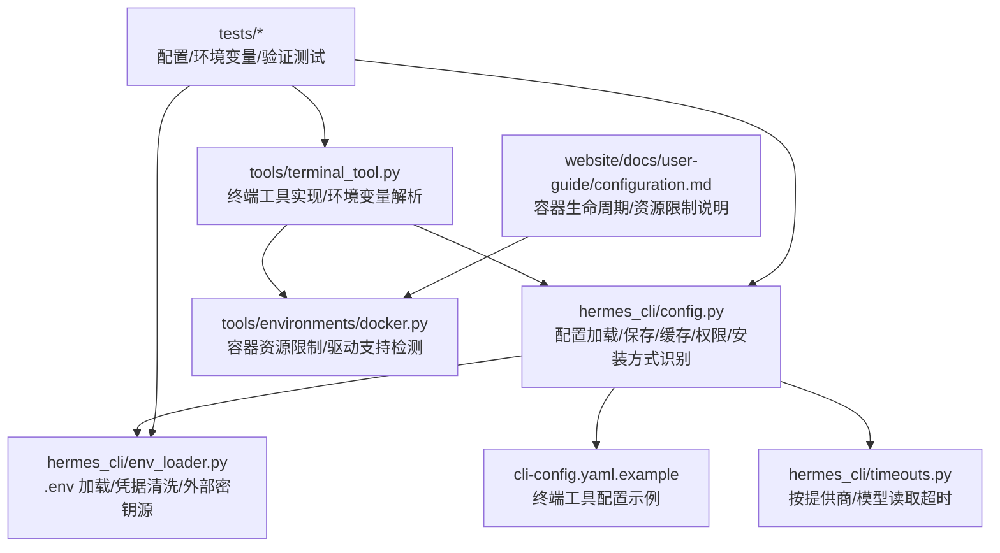
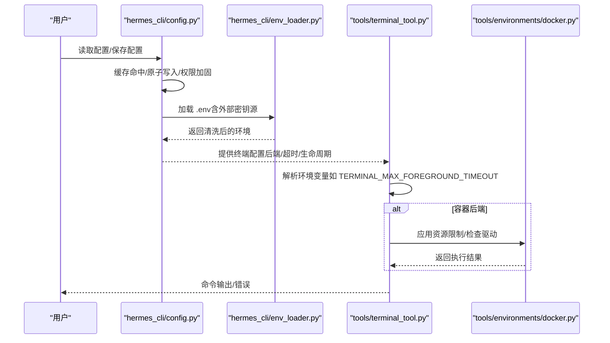
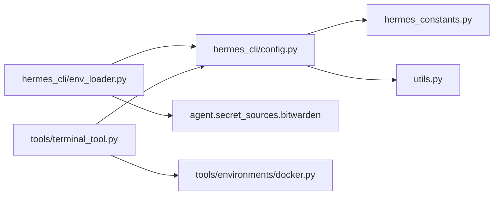

# 配置管理

<cite>
**本文引用的文件**
- [hermes_cli/config.py](file://hermes_cli/config.py)
- [hermes_cli/env_loader.py](file://hermes_cli/env_loader.py)
- [cli-config.yaml.example](file://cli-config.yaml.example)
- [tools/terminal_tool.py](file://tools/terminal_tool.py)
- [hermes_cli/timeouts.py](file://hermes_cli/timeouts.py)
- [tools/environments/docker.py](file://tools/environments/docker.py)
- [website/docs/user-guide/configuration.md](file://website/docs/user-guide/configuration.md)
- [tests/tools/test_parse_env_var.py](file://tests/tools/test_parse_env_var.py)
- [tests/hermes_cli/test_config.py](file://tests/hermes_cli/test_config.py)
- [tests/hermes_cli/test_env_loader.py](file://tests/hermes_cli/test_env_loader.py)
- [tests/hermes_cli/test_set_config_value.py](file://tests/hermes_cli/test_set_config_value.py)
- [tests/hermes_cli/test_config_validation.py](file://tests/hermes_cli/test_config_validation.py)
- [tests/gateway/test_runtime_config_env_expansion.py](file://tests/gateway/test_runtime_config_env_expansion.py)
- [tests/gateway/test_runtime_env_reload_config_authority.py](file://tests/gateway/test_runtime_env_reload_config_authority.py)
- [tests/tools/test_code_execution_windows_env.py](file://tests/tools/test_code_execution_windows_env.py)
</cite>

## 目录
1. [简介](#简介)
2. [项目结构](#项目结构)
3. [核心组件](#核心组件)
4. [架构总览](#架构总览)
5. [详细组件分析](#详细组件分析)
6. [依赖关系分析](#依赖关系分析)
7. [性能考量](#性能考量)
8. [故障排除指南](#故障排除指南)
9. [结论](#结论)
10. [附录](#附录)

## 简介
本文件系统化梳理终端工具的配置管理，覆盖环境变量配置、超时参数设置、资源限制与性能调优、配置文件格式、动态配置更新与验证机制，并结合不同执行环境（本地、Docker、Modal、SSH、Singularity、Daytona）给出优化策略。同时提供关键参数如 TERMINAL_MAX_FOREGROUND_TIMEOUT、TERMINAL_DISK_WARNING_GB 的作用与调优方法，以及配置安全性与最佳实践。

## 项目结构
围绕配置管理的关键模块与文件如下：
- 配置加载与持久化：hermes_cli/config.py
- 环境变量加载与安全处理：hermes_cli/env_loader.py
- 终端工具配置示例与后端选择：cli-config.yaml.example、website/docs/user-guide/configuration.md
- 终端工具实现与关键环境变量解析：tools/terminal_tool.py
- 超时配置读取：hermes_cli/timeouts.py
- 容器资源限制与驱动检测：tools/environments/docker.py
- 测试用例：覆盖配置解析、环境变量加载、键值路由到 .env、配置验证、运行时环境扩展等

图表来源
- [hermes_cli/config.py:1-800](file://hermes_cli/config.py#L1-L800)
- [hermes_cli/env_loader.py:1-345](file://hermes_cli/env_loader.py#L1-L345)
- [cli-config.yaml.example:1-800](file://cli-config.yaml.example#L1-L800)
- [tools/terminal_tool.py:1-800](file://tools/terminal_tool.py#L1-L800)
- [hermes_cli/timeouts.py:1-83](file://hermes_cli/timeouts.py#L1-L83)
- [tools/environments/docker.py:1060-1092](file://tools/environments/docker.py#L1060-L1092)
- [website/docs/user-guide/configuration.md:133-167](file://website/docs/user-guide/configuration.md#L133-L167)

章节来源
- [hermes_cli/config.py:1-800](file://hermes_cli/config.py#L1-L800)
- [hermes_cli/env_loader.py:1-345](file://hermes_cli/env_loader.py#L1-L345)
- [cli-config.yaml.example:1-800](file://cli-config.yaml.example#L1-L800)
- [tools/terminal_tool.py:1-800](file://tools/terminal_tool.py#L1-L800)
- [hermes_cli/timeouts.py:1-83](file://hermes_cli/timeouts.py#L1-L83)
- [tools/environments/docker.py:1060-1092](file://tools/environments/docker.py#L1060-L1092)
- [website/docs/user-guide/configuration.md:133-167](file://website/docs/user-guide/configuration.md#L133-L167)

## 核心组件
- 配置文件与路径
  - 主配置：~/.hermes/config.yaml
  - 秘钥与机密：~/.hermes/.env
  - 示例配置：cli-config.yaml.example
- 配置加载与缓存
  - 原子写入、缓存命中、线程安全锁、解析失败回退与备份
- 环境变量加载与安全
  - .env 清洗（非 ASCII 凭据字符剥离）、外部密钥源注入（Bitwarden）、禁止写入高风险变量名
- 终端工具配置
  - 后端选择（local/ssh/docker/modal/singularity/daytona）、工作目录、超时、生命周期、sudo 支持
- 超时与稳定性
  - 按提供商/模型粒度读取请求超时与“陈旧”超时
- 资源限制与容器能力
  - CPU/内存/磁盘配额、跨进程容器复用、驱动支持探测

章节来源
- [hermes_cli/config.py:594-796](file://hermes_cli/config.py#L594-L796)
- [hermes_cli/env_loader.py:212-247](file://hermes_cli/env_loader.py#L212-L247)
- [cli-config.yaml.example:155-310](file://cli-config.yaml.example#L155-L310)
- [hermes_cli/timeouts.py:14-83](file://hermes_cli/timeouts.py#L14-L83)
- [tools/environments/docker.py:1060-1092](file://tools/environments/docker.py#L1060-L1092)

## 架构总览
配置管理由“配置文件 + 环境变量 + 运行时加载器”三层构成，终端工具在执行命令前读取配置并应用到不同后端。

图表来源
- [hermes_cli/config.py:594-796](file://hermes_cli/config.py#L594-L796)
- [hermes_cli/env_loader.py:212-247](file://hermes_cli/env_loader.py#L212-L247)
- [tools/terminal_tool.py:106-121](file://tools/terminal_tool.py#L106-L121)
- [tools/environments/docker.py:1060-1092](file://tools/environments/docker.py#L1060-L1092)

## 详细组件分析

### 配置文件与路径管理
- 主配置与 .env 的职责分离：config.yaml 存放功能开关与行为配置；.env 存放机密与环境变量。
- 安全权限与容器模式：确保 ~/.hermes 及其子目录仅当前用户可访问；容器内跳过严格权限以兼容多 UID 场景。
- 安装方式识别与升级路径：支持 NixOS/Homebrew/Docker/Git/Pip 等安装方式，提供对应升级建议。
- 配置缓存与并发安全：通过 RLock 串行化读写，避免 libyaml 并发问题；缓存命中跳过解析与合并。

章节来源
- [hermes_cli/config.py:594-796](file://hermes_cli/config.py#L594-L796)
- [hermes_cli/config.py:225-237](file://hermes_cli/config.py#L225-L237)

### 环境变量加载与安全
- .env 清洗：对包含 _API_KEY/_TOKEN/_SECRET 等后缀的变量进行非 ASCII 字符剥离，并打印警告提示。
- 外部密钥源：支持从 Bitwarden 注入密钥，注入后再次清洗，记录来源以便用户理解。
- 写入安全：禁止写入影响子进程执行或运行时位置的变量名（如 LD_PRELOAD、PATH、EDITOR 等），已存在的 .env 条目不受影响。

章节来源
- [hermes_cli/env_loader.py:102-157](file://hermes_cli/env_loader.py#L102-L157)
- [hermes_cli/env_loader.py:250-324](file://hermes_cli/env_loader.py#L250-L324)
- [hermes_cli/config.py:180-216](file://hermes_cli/config.py#L180-L216)

### 终端工具配置与后端
- 后端选择：local/ssh/docker/modal/singularity/daytona，分别控制工作目录、超时、生命周期、sudo 密码等。
- 资源限制：容器后端支持 CPU/内存/磁盘配额，持久化文件系统与跨进程复用。
- 执行安全：sudo 自动改写为 -S 输入；交互式密码提示与缓存；危险命令审批流程。

章节来源
- [cli-config.yaml.example:155-310](file://cli-config.yaml.example#L155-L310)
- [website/docs/user-guide/configuration.md:133-167](file://website/docs/user-guide/configuration.md#L133-L167)
- [tools/terminal_tool.py:561-585](file://tools/terminal_tool.py#L561-L585)
- [tools/terminal_tool.py:752-800](file://tools/terminal_tool.py#L752-L800)

### 关键环境变量解析与默认值
- 终端前台最大超时：TERMINAL_MAX_FOREGROUND_TIMEOUT，默认 600 秒，非法值回退到默认。
- 磁盘使用告警阈值：TERMINAL_DISK_WARNING_GB，默认 500.0 GB，非法值回退到默认。
- 解析失败日志与回退：模块级解析失败不中断导入，记录警告并采用默认值。

章节来源
- [tools/terminal_tool.py:106-121](file://tools/terminal_tool.py#L106-L121)
- [tests/tools/test_parse_env_var.py:92-107](file://tests/tools/test_parse_env_var.py#L92-L107)

### 超时参数设置与优先级
- 提供商/模型粒度超时：按 providers.<id>.request_timeout_seconds 或 providers.<id>.models.<model>.timeout_seconds 读取。
- 非流式“陈旧”超时：按 stale_timeout_seconds 控制长时间无响应的检测。
- 回退策略：未配置时回退到遗留环境变量（如 HERMES_API_TIMEOUT、HERMES_API_CALL_STALE_TIMEOUT）。

章节来源
- [hermes_cli/timeouts.py:14-83](file://hermes_cli/timeouts.py#L14-L83)
- [cli-config.yaml.example:75-105](file://cli-config.yaml.example#L75-L105)

### 资源限制与容器能力
- 容器磁盘配额：仅在 overlay2 + XFS + pquota 下支持 --storage-opt size=。
- CPU/内存/磁盘：容器后端统一配置项，持久化与跨进程复用。
- 驱动探测：快速探测存储驱动是否支持 per-container quota，避免无效配置。

章节来源
- [tools/environments/docker.py:1060-1092](file://tools/environments/docker.py#L1060-L1092)
- [website/docs/user-guide/configuration.md:153-167](file://website/docs/user-guide/configuration.md#L153-L167)

### 动态配置更新与验证机制
- 运行时环境扩展：支持在配置中使用 ${ENV_VAR} 形式的模板，启动时展开。
- 配置权威性：当配置中省略某键时，保留 .env 中的值，避免被临时覆盖。
- 配置校验：解析失败自动备份并记录警告；重复加载同一文件不再重复告警；语法错误检测（如冲突标记）。

章节来源
- [tests/gateway/test_runtime_config_env_expansion.py:106-120](file://tests/gateway/test_runtime_config_env_expansion.py#L106-L120)
- [tests/gateway/test_runtime_env_reload_config_authority.py:40-53](file://tests/gateway/test_runtime_env_reload_config_authority.py#L40-L53)
- [tests/hermes_cli/test_config.py:125-157](file://tests/hermes_cli/test_config.py#L125-L157)
- [tests/hermes_cli/test_config_validation.py:189-207](file://tests/hermes_cli/test_config_validation.py#L189-L207)

### 不同执行环境的特定配置与优化
- 本地（local）：直接在宿主机执行，sudo 密码可通过 SUDO_PASSWORD 或交互式输入；适合低延迟场景。
- SSH：远程执行，需配置 ssh_host/ssh_user/ssh_port/ssh_key；sudo 通过远程 sudo -S。
- Docker：隔离与可复现性强，建议开启持久化与合适的 CPU/内存/磁盘配额；注意磁盘配额驱动要求。
- Modal/Singularity/Daytona：云沙盒/高性能计算环境，注意镜像大小与网络策略；必要时启用持久化文件系统。

章节来源
- [cli-config.yaml.example:167-295](file://cli-config.yaml.example#L167-L295)
- [website/docs/user-guide/configuration.md:133-167](file://website/docs/user-guide/configuration.md#L133-L167)

### 配置安全性与最佳实践
- 将机密放入 .env，避免硬编码到 config.yaml；仅允许以 _API_KEY/_TOKEN 结尾的键进入 .env。
- 禁止写入高风险变量名（如 LD_PRELOAD、PATH、EDITOR 等），已存在 .env 条目不受影响。
- 使用外部密钥源（如 Bitwarden）时，注意凭据清洗与来源标注。
- 在容器环境中谨慎转发环境变量，避免泄露敏感信息。

章节来源
- [hermes_cli/config.py:240-289](file://hermes_cli/config.py#L240-L289)
- [hermes_cli/env_loader.py:13-17](file://hermes_cli/env_loader.py#L13-L17)
- [tests/hermes_cli/test_set_config_value.py:43-79](file://tests/hermes_cli/test_set_config_value.py#L43-L79)
- [tests/tools/test_code_execution_windows_env.py:267-287](file://tests/tools/test_code_execution_windows_env.py#L267-L287)

## 依赖关系分析
- 配置模块依赖
  - hermes_cli/config.py 依赖 hermes_constants 获取 HOME 路径，依赖 utils.atomic_replace 实现原子写入。
  - hermes_cli/env_loader.py 依赖 hermes_cli/config 的环境清洗逻辑，依赖 agent.secret_sources.bitwarden 注入密钥。
- 终端工具依赖
  - tools/terminal_tool.py 依赖 hermes_cli/config 的只读配置读取接口，解析环境变量并应用到不同后端。
  - tools/environments/docker.py 依赖 find_docker 探测与驱动信息，用于磁盘配额能力判断。

图表来源
- [hermes_cli/config.py:591-592](file://hermes_cli/config.py#L591-L592)
- [hermes_cli/env_loader.py:282-284](file://hermes_cli/env_loader.py#L282-L284)
- [tools/terminal_tool.py:70-76](file://tools/terminal_tool.py#L70-L76)
- [tools/environments/docker.py:1080-1086](file://tools/environments/docker.py#L1080-L1086)

章节来源
- [hermes_cli/config.py:591-592](file://hermes_cli/config.py#L591-L592)
- [hermes_cli/env_loader.py:282-284](file://hermes_cli/env_loader.py#L282-L284)
- [tools/terminal_tool.py:70-76](file://tools/terminal_tool.py#L70-L76)
- [tools/environments/docker.py:1080-1086](file://tools/environments/docker.py#L1080-L1086)

## 性能考量
- 配置缓存与并发
  - 通过 _LOAD_CONFIG_CACHE/_RAW_CONFIG_CACHE 与 _CONFIG_LOCK，避免频繁解析与线程竞争。
- 超时与重试
  - 按提供商/模型设置合理的 request_timeout 与 stale_timeout，减少长尾等待。
- 容器资源
  - 合理设置 container_cpu/container_memory/container_disk，避免过度分配导致调度压力或不足。
- TUI 堆内存
  - 在容器中根据 cgroup 限制动态调整 Node.js 堆上限，避免被 cgroup 杀死。

章节来源
- [hermes_cli/config.py:225-237](file://hermes_cli/config.py#L225-L237)
- [hermes_cli/timeouts.py:14-83](file://hermes_cli/timeouts.py#L14-L83)
- [tests/hermes_cli/test_tui_heap_sizing.py:72-112](file://tests/hermes_cli/test_tui_heap_sizing.py#L72-L112)

## 故障排除指南
- 配置解析失败
  - 现象：config.yaml 解析错误，系统回退到默认配置且忽略用户覆盖。
  - 处理：查看日志中的警告与备份文件路径，修复 YAML 语法后重启。
- 环境变量加载异常
  - 现象：非 ASCII 凭据被剥离并提示复制粘贴污染。
  - 处理：从官方仪表板重新复制密钥，避免富文本编辑器引入近似字符。
- 键值路由到 .env
  - 现象：以 _API_KEY/_TOKEN 结尾的键被写入 .env 而非 config.yaml。
  - 处理：确认密钥类型与路由规则，必要时手动编辑 .env。
- 运行时环境扩展
  - 现象：配置中 ${ENV_VAR} 未正确展开。
  - 处理：确认环境变量存在且加载顺序正确（.env 优先于 shell）。
- 容器磁盘配额无效
  - 现象：设置 container_disk 未生效。
  - 处理：确认存储驱动为 overlay2 且挂载文件系统为 XFS 并启用 pquota。

章节来源
- [hermes_cli/config.py:95-138](file://hermes_cli/config.py#L95-L138)
- [hermes_cli/env_loader.py:102-157](file://hermes_cli/env_loader.py#L102-L157)
- [tests/hermes_cli/test_set_config_value.py:43-79](file://tests/hermes_cli/test_set_config_value.py#L43-L79)
- [tests/gateway/test_runtime_config_env_expansion.py:106-120](file://tests/gateway/test_runtime_config_env_expansion.py#L106-L120)
- [tools/environments/docker.py:1060-1092](file://tools/environments/docker.py#L1060-L1092)

## 结论
本配置管理体系通过“配置文件 + 环境变量 + 运行时加载器”的分层设计，实现了安全、可维护、可扩展的终端工具配置。针对不同执行环境提供了明确的参数与优化策略，结合超时与资源限制，可在保证安全的前提下提升性能与稳定性。建议在生产环境优先使用 .env 存放机密，合理设置超时与资源配额，并定期审查配置与日志。

## 附录

### 关键参数说明与调优
- TERMINAL_MAX_FOREGROUND_TIMEOUT
  - 作用：限制前台命令的最大执行时间，防止长时间阻塞。
  - 默认：600 秒；非法值回退到默认。
  - 调优：根据任务复杂度与资源情况适当提高，但需关注整体超时策略。
- TERMINAL_DISK_WARNING_GB
  - 作用：磁盘使用超过阈值时发出警告，便于及时清理。
  - 默认：500.0 GB；非法值回退到默认。
  - 调优：结合容器持久化与宿主机磁盘容量设定，避免空间耗尽。

章节来源
- [tools/terminal_tool.py:106-121](file://tools/terminal_tool.py#L106-L121)
- [tests/tools/test_parse_env_var.py:92-107](file://tests/tools/test_parse_env_var.py#L92-L107)