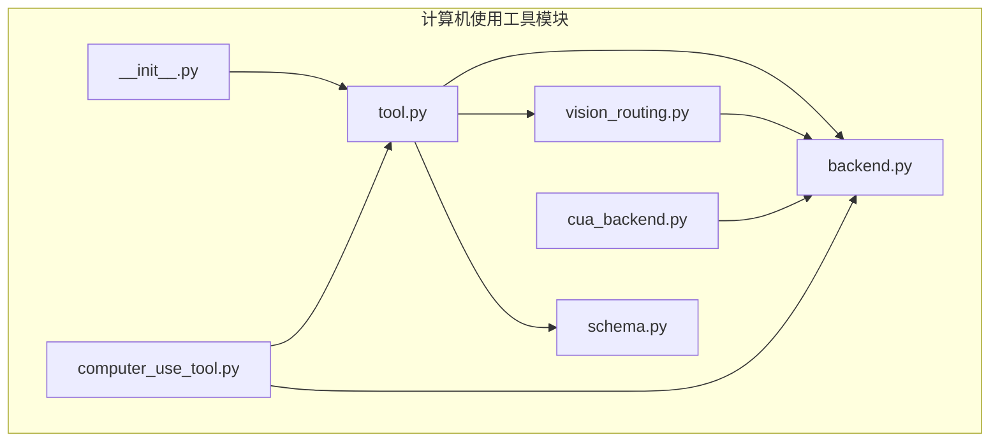
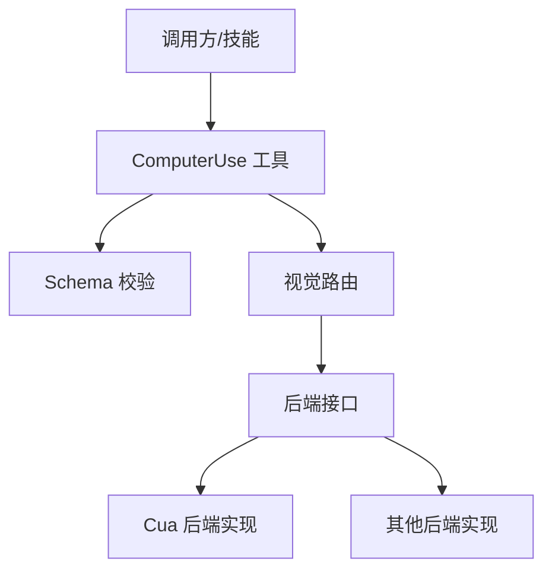
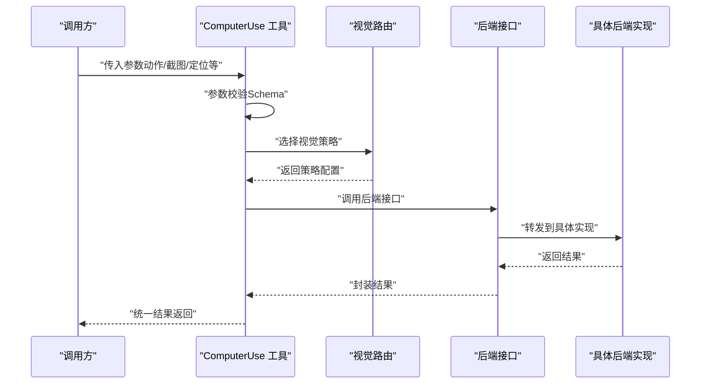
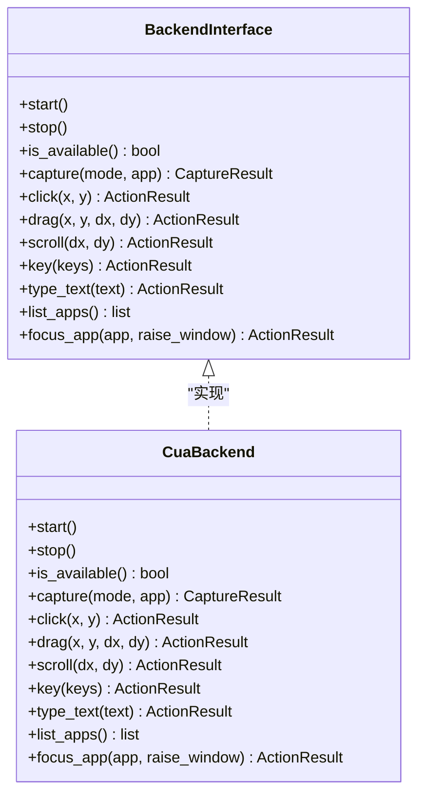
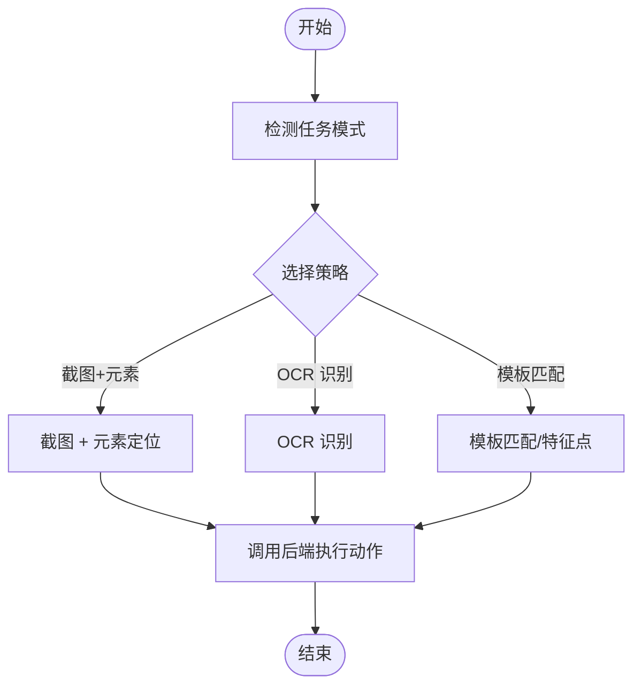
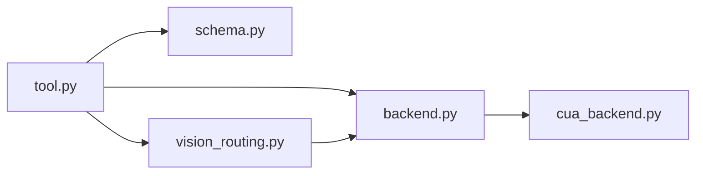

# 计算机使用工具

<cite>
**本文档引用的文件**
- [tools/computer_use/__init__.py](file://tools/computer_use/__init__.py)
- [tools/computer_use/backend.py](file://tools/computer_use/backend.py)
- [tools/computer_use/cua_backend.py](file://tools/computer_use/cua_backend.py)
- [tools/computer_use/schema.py](file://tools/computer_use/schema.py)
- [tools/computer_use/tool.py](file://tools/computer_use/tool.py)
- [tools/computer_use/vision_routing.py](file://tools/computer_use/vision_routing.py)
- [tools/computer_use_tool.py](file://tools/computer_use_tool.py)
- [tests/tools/test_computer_use.py](file://tests/tools/test_computer_use.py)
- [tests/tools/test_computer_use_capture_routing.py](file://tests/tools/test_computer_use_capture_routing.py)
- [tests/tools/test_computer_use_vision_routing.py](file://tests/tools/test_computer_use_vision_routing.py)
</cite>

## 目录
1. [简介](#简介)
2. [项目结构](#项目结构)
3. [核心组件](#核心组件)
4. [架构总览](#架构总览)
5. [详细组件分析](#详细组件分析)
6. [依赖关系分析](#依赖关系分析)
7. [性能考虑](#性能考虑)
8. [故障排除指南](#故障排除指南)
9. [结论](#结论)
10. [附录](#附录)

## 简介
本文件为 Hermes Agent 计算机使用工具的技术文档，聚焦于计算机控制与视觉识别能力，覆盖以下方面：
- 计算机控制：屏幕捕获、鼠标操作、键盘输入、应用程序控制
- 视觉识别：图像处理、OCR 识别、目标定位
- 安全机制：权限管理、访问控制、操作审计
- 配置选项：分辨率设置、帧率控制、精度调节
- 实际用例：自动化操作、屏幕录制、交互式控制
- 性能优化与实时性保障策略

该工具通过统一的后端抽象与多平台适配层实现跨平台的屏幕捕获与人机交互，并提供面向视觉理解的路由与识别能力。

## 项目结构
计算机使用工具位于 tools/computer_use 目录，核心文件包括：
- 后端接口与实现：backend.py、cua_backend.py
- 工具入口与封装：tool.py、computer_use_tool.py
- 视觉路由与模式：vision_routing.py
- 数据结构与模式定义：schema.py
- 初始化与导出：__init__.py

图表来源
- [tools/computer_use/__init__.py](file://tools/computer_use/__init__.py)
- [tools/computer_use/tool.py](file://tools/computer_use/tool.py)
- [tools/computer_use/computer_use_tool.py](file://tools/computer_use_tool.py)
- [tools/computer_use/schema.py](file://tools/computer_use/schema.py)
- [tools/computer_use/backend.py](file://tools/computer_use/backend.py)
- [tools/computer_use/cua_backend.py](file://tools/computer_use/cua_backend.py)
- [tools/computer_use/vision_routing.py](file://tools/computer_use/vision_routing.py)

章节来源
- [tools/computer_use/__init__.py](file://tools/computer_use/__init__.py)
- [tools/computer_use/tool.py](file://tools/computer_use/tool.py)
- [tools/computer_use/computer_use_tool.py](file://tools/computer_use_tool.py)
- [tools/computer_use/schema.py](file://tools/computer_use/schema.py)
- [tools/computer_use/backend.py](file://tools/computer_use/backend.py)
- [tools/computer_use/cua_backend.py](file://tools/computer_use/cua_backend.py)
- [tools/computer_use/vision_routing.py](file://tools/computer_use/vision_routing.py)

## 核心组件
- 工具入口与封装
  - tool.py：对外暴露的工具类，负责参数解析、调用后端执行、结果封装
  - computer_use_tool.py：工具注册与调用桥接
- 后端抽象与实现
  - backend.py：定义通用的屏幕捕获、点击、拖拽、滚动、按键、文本输入、应用列表与焦点控制等接口
  - cua_backend.py：具体平台实现（如 macOS Computer Use API）的适配层
- 视觉路由与识别
  - vision_routing.py：根据任务需求选择合适的视觉识别与目标定位策略
- 数据结构与模式
  - schema.py：定义工具输入输出的数据结构、枚举与校验规则
- 初始化与导出
  - __init__.py：模块初始化与导出

章节来源
- [tools/computer_use/tool.py](file://tools/computer_use/tool.py)
- [tools/computer_use/computer_use_tool.py](file://tools/computer_use_tool.py)
- [tools/computer_use/backend.py](file://tools/computer_use/backend.py)
- [tools/computer_use/cua_backend.py](file://tools/computer_use/cua_backend.py)
- [tools/computer_use/vision_routing.py](file://tools/computer_use/vision_routing.py)
- [tools/computer_use/schema.py](file://tools/computer_use/schema.py)
- [tools/computer_use/__init__.py](file://tools/computer_use/__init__.py)

## 架构总览
整体架构采用“工具层 → 路由层 → 后端层”的分层设计：
- 工具层：统一的 API 接口，负责参数校验、调用路由与结果封装
- 路由层：根据任务类型与上下文选择合适的视觉识别与定位策略
- 后端层：抽象统一的屏幕捕获与人机交互接口，具体平台实现通过适配层接入

图表来源
- [tools/computer_use/tool.py](file://tools/computer_use/tool.py)
- [tools/computer_use/vision_routing.py](file://tools/computer_use/vision_routing.py)
- [tools/computer_use/backend.py](file://tools/computer_use/backend.py)
- [tools/computer_use/cua_backend.py](file://tools/computer_use/cua_backend.py)
- [tools/computer_use/schema.py](file://tools/computer_use/schema.py)

## 详细组件分析

### 工具层（tool.py）
职责与特性：
- 参数解析与校验：基于 schema 对输入进行严格校验
- 动态路由：根据任务类型选择视觉识别策略
- 结果封装：将后端返回的原始结果转换为统一格式
- 上下文保持：维护最近一次应用信息，支持“在上次应用上继续捕获”的语义

关键流程示意：

图表来源
- [tools/computer_use/tool.py](file://tools/computer_use/tool.py)
- [tools/computer_use/vision_routing.py](file://tools/computer_use/vision_routing.py)
- [tools/computer_use/backend.py](file://tools/computer_use/backend.py)
- [tools/computer_use/cua_backend.py](file://tools/computer_use/cua_backend.py)

章节来源
- [tools/computer_use/tool.py](file://tools/computer_use/tool.py)

### 后端接口与实现（backend.py、cua_backend.py）
职责与特性：
- 统一接口：capture、click、drag、scroll、key、type_text、list_apps、focus_app
- 可用性检测：is_available 判断环境是否满足
- 平台适配：cua_backend 提供 macOS Computer Use API 的适配
- 结果模型：CaptureResult、ActionResult 等数据结构

类关系示意：

图表来源
- [tools/computer_use/backend.py](file://tools/computer_use/backend.py)
- [tools/computer_use/cua_backend.py](file://tools/computer_use/cua_backend.py)

章节来源
- [tools/computer_use/backend.py](file://tools/computer_use/backend.py)
- [tools/computer_use/cua_backend.py](file://tools/computer_use/cua_backend.py)

### 视觉路由（vision_routing.py）
职责与特性：
- 根据任务类型与上下文选择合适的视觉识别策略
- 支持“屏幕截图+元素定位”、“OCR 识别”、“模板匹配/特征点”等策略组合
- 与后端接口解耦，便于扩展新的识别算法

流程示意：

图表来源
- [tools/computer_use/vision_routing.py](file://tools/computer_use/vision_routing.py)
- [tools/computer_use/backend.py](file://tools/computer_use/backend.py)

章节来源
- [tools/computer_use/vision_routing.py](file://tools/computer_use/vision_routing.py)

### 数据结构与模式（schema.py）
职责与特性：
- 定义工具输入输出的数据结构、字段含义与约束
- 包含枚举值（如截图模式）、必填字段、默认值等
- 用于工具层参数校验与测试断言

章节来源
- [tools/computer_use/schema.py](file://tools/computer_use/schema.py)

### 工具注册与桥接（computer_use_tool.py）
职责与特性：
- 将 ComputerUse 工具注册为可被技能系统调用的工具
- 提供统一的入口与参数桥接

章节来源
- [tools/computer_use_tool.py](file://tools/computer_use_tool.py)

## 依赖关系分析
- 模块内聚与耦合
  - 工具层与路由层通过接口解耦，便于替换识别策略
  - 路由层与后端层通过统一接口解耦，便于新增平台实现
  - 后端层与具体实现通过适配器模式隔离平台差异
- 外部依赖
  - macOS Computer Use API（通过 cua_backend 适配）
  - 图像处理与 OCR 识别（由视觉路由层选择性集成）

图表来源
- [tools/computer_use/tool.py](file://tools/computer_use/tool.py)
- [tools/computer_use/schema.py](file://tools/computer_use/schema.py)
- [tools/computer_use/vision_routing.py](file://tools/computer_use/vision_routing.py)
- [tools/computer_use/backend.py](file://tools/computer_use/backend.py)
- [tools/computer_use/cua_backend.py](file://tools/computer_use/cua_backend.py)

章节来源
- [tools/computer_use/tool.py](file://tools/computer_use/tool.py)
- [tools/computer_use/backend.py](file://tools/computer_use/backend.py)
- [tools/computer_use/cua_backend.py](file://tools/computer_use/cua_backend.py)
- [tools/computer_use/vision_routing.py](file://tools/computer_use/vision_routing.py)
- [tools/computer_use/schema.py](file://tools/computer_use/schema.py)

## 性能考虑
- 截图与识别
  - 优先使用平台原生的 Computer Use API，减少跨语言/跨进程开销
  - 在高频操作场景中，尽量复用最近的应用上下文，避免重复切换窗口
- 帧率与分辨率
  - 通过截图模式与分辨率参数平衡质量与性能
  - 对于长流程任务，建议降低帧率或分辨率以提升实时性
- 执行策略
  - 使用“先定位再操作”的策略，减少无效移动与点击
  - 对于 OCR 识别，尽量限定识别区域，减少计算量
- 缓存与复用
  - 复用已有的截图与元素信息，避免重复抓取
  - 对于频繁出现的 UI 元素，建立轻量缓存

## 故障排除指南
常见问题与排查要点：
- 截图失败或无响应
  - 检查后端可用性与权限（macOS 需要辅助功能权限）
  - 确认截图模式与分辨率参数合理
- 点击/拖拽不生效
  - 校验坐标系与缩放比例，确保与当前分辨率一致
  - 确认目标元素可见且未被遮挡
- OCR 识别不准
  - 调整识别区域与对比度
  - 选择更合适的识别策略或增加重试次数
- 应用切换异常
  - 使用 focus_app 显式指定应用，避免前台窗口变化导致的上下文丢失
  - 对于需要在上次应用上继续的任务，确保正确传递应用上下文

章节来源
- [tests/tools/test_computer_use.py](file://tests/tools/test_computer_use.py)
- [tests/tools/test_computer_use_capture_routing.py](file://tests/tools/test_computer_use_capture_routing.py)
- [tests/tools/test_computer_use_vision_routing.py](file://tests/tools/test_computer_use_vision_routing.py)

## 结论
计算机使用工具通过清晰的分层架构与统一的后端接口，实现了跨平台的人机交互与视觉识别能力。其模块化设计便于扩展新的识别策略与平台实现；严格的参数校验与结果封装提升了工具的稳定性与易用性。结合合理的性能优化策略与完善的故障排查方法，可在复杂桌面环境中实现高效、可靠的自动化操作。

## 附录
- 配置选项（示例）
  - 分辨率设置：通过截图模式与分辨率参数控制
  - 帧率控制：在连续操作场景中降低帧率以提升实时性
  - 精度调节：通过识别策略与区域裁剪提升定位精度
- 实际用例
  - 自动化操作：登录、填写表单、点击按钮等
  - 屏幕录制：按需截图并拼接为视频序列
  - 交互式控制：基于 OCR 与元素定位的动态交互