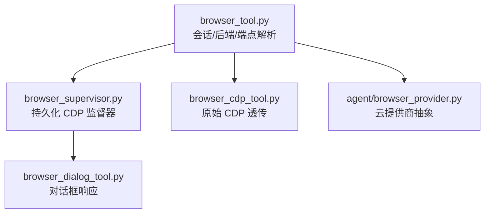
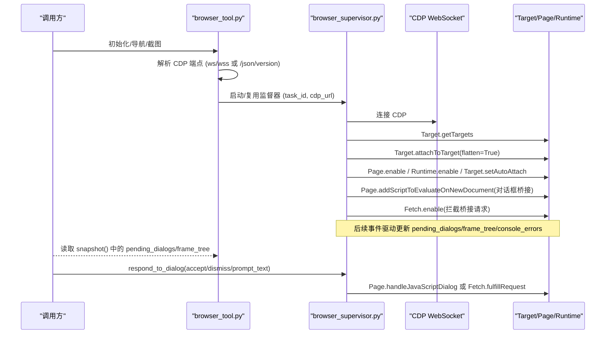
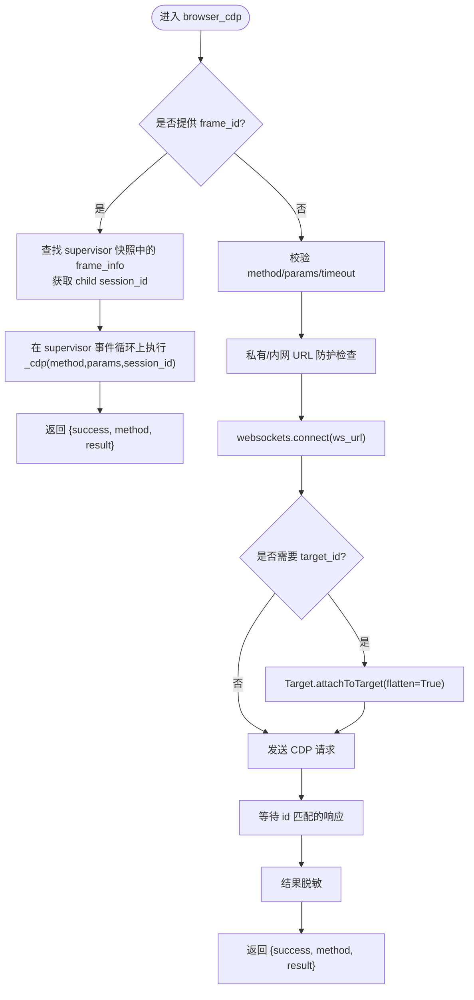
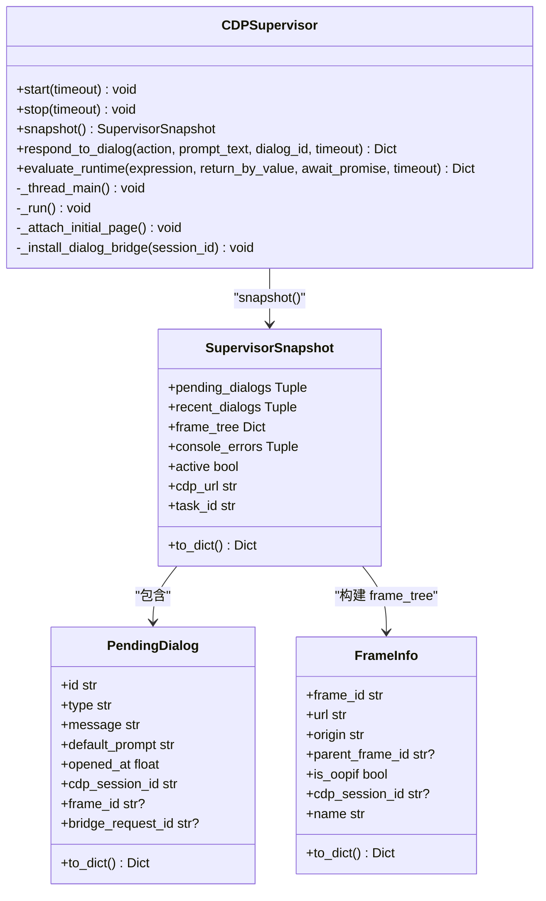
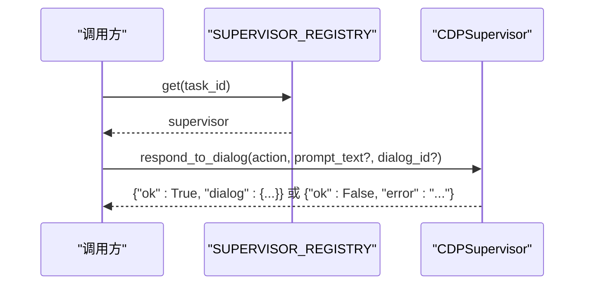
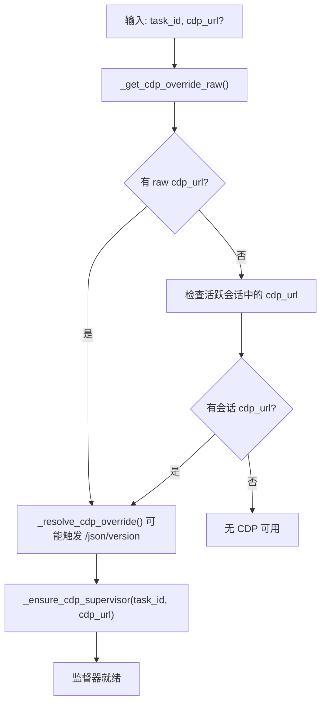
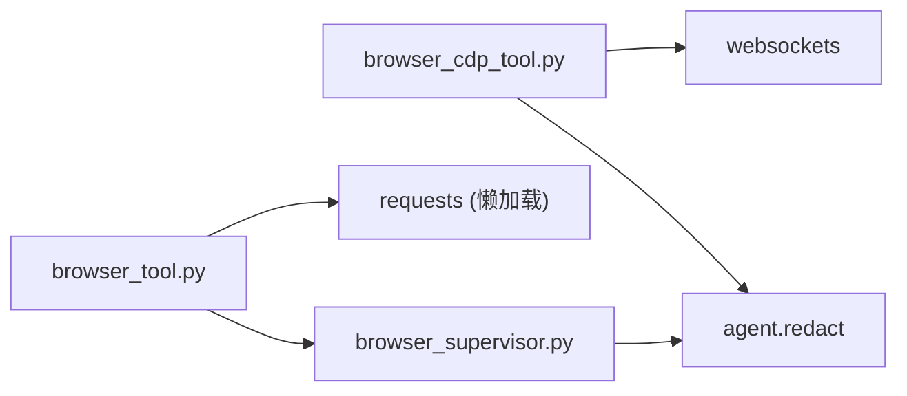

# CDP 浏览器控制

<cite>
**本文引用的文件**
- [tools/browser_cdp_tool.py](file://tools/browser_cdp_tool.py)
- [tools/browser_supervisor.py](file://tools/browser_supervisor.py)
- [tools/browser_dialog_tool.py](file://tools/browser_dialog_tool.py)
- [tools/browser_tool.py](file://tools/browser_tool.py)
- [agent/browser_provider.py](file://agent/browser_provider.py)
</cite>

## 目录
1. [简介](#简介)
2. [项目结构](#项目结构)
3. [核心组件](#核心组件)
4. [架构总览](#架构总览)
5. [详细组件分析](#详细组件分析)
6. [依赖关系分析](#依赖关系分析)
7. [性能与超时](#性能与超时)
8. [故障排查指南](#故障排查指南)
9. [结论](#结论)
10. [附录：常用 CDP 操作示例路径](#附录：常用-cdp-操作示例路径)

## 简介
本文件面向希望直接通过 Chrome DevTools Protocol（CDP）控制 Chrome/Chromium 浏览器的开发者，系统性说明如何在当前代码库中完成连接管理、页面导航、元素操作、事件监听、多标签页管理与资源监控。文档同时覆盖错误处理、超时配置、安全边界以及与 agent-browser CLI 的集成方式，并提供可落地的实践指引和图示。

## 项目结构
围绕 CDP 的核心实现分布在以下模块：
- 原始 CDP 透传工具：提供对任意 CDP 方法的调用能力，并内置私有网络/内网地址防护。
- 持久化 CDP 监督器：维护一个长连接 WebSocket，自动附加到页面与子目标，收集对话框、帧树、控制台事件等状态。
- 对话框响应工具：在检测到原生 JS 对话框时，允许代理接受或拒绝。
- 浏览器工具层：统一封装本地/云后端选择、会话生命周期、CDP 端点解析与监督器启动。
- 云提供商抽象：定义统一的浏览器后端接口，便于扩展更多云端浏览器服务。

**图表来源**
- [tools/browser_tool.py:434-556](file://tools/browser_tool.py#L434-L556)
- [tools/browser_supervisor.py:289-344](file://tools/browser_supervisor.py#L289-L344)
- [tools/browser_cdp_tool.py:188-277](file://tools/browser_cdp_tool.py#L188-L277)
- [tools/browser_dialog_tool.py:82-117](file://tools/browser_dialog_tool.py#L82-L117)
- [agent/browser_provider.py:50-127](file://agent/browser_provider.py#L50-L127)

**章节来源**
- [tools/browser_tool.py:1-120](file://tools/browser_tool.py#L1-L120)
- [tools/browser_cdp_tool.py:1-115](file://tools/browser_cdp_tool.py#L1-L115)
- [tools/browser_supervisor.py:1-97](file://tools/browser_supervisor.py#L1-L97)
- [tools/browser_dialog_tool.py:1-47](file://tools/browser_dialog_tool.py#L1-L47)
- [agent/browser_provider.py:1-37](file://agent/browser_provider.py#L1-L37)

## 核心组件
- 原始 CDP 透传工具（browser_cdp）
  - 支持按方法名与参数发送任意 CDP 命令；可选择 target_id 以附着到具体标签页；支持 frame_id 路由到跨源 iframe 的 CDP 会话。
  - 内置私有/内网 URL 防护，防止通过 Runtime.evaluate 或 Page.navigate 访问受限地址。
  - 输出结果会进行敏感信息脱敏。
- 持久化 CDP 监督器（CDPSupervisor）
  - 为每个任务维护一个长连接 WebSocket，自动附加到页面与子目标，启用 Page/Runtime/Target/Fetch 等域。
  - 维护 pending_dialogs、frame_tree、recent_dialogs、console_errors 等快照，供上层工具读取。
  - 支持对话框桥接：注入脚本拦截 alert/confirm/prompt，并通过 Fetch 拦截将请求转为“待处理对话框”，由代理决定接受或拒绝。
- 对话框响应工具（browser_dialog）
  - 从 supervisor 快照读取 pending_dialogs，然后调用 accept/dismiss 或带 prompt_text 的 prompt 响应。
- 浏览器工具层（browser_tool）
  - 负责 CDP 端点解析（支持 ws/wss、HTTP 发现 /json/version）、会话创建与清理、监督器启动策略、云提供商选择与缓存。
- 云提供商抽象（BrowserProvider）
  - 定义 create_session/close_session/emergency_cleanup 等生命周期方法，返回包含 cdp_url 的会话元数据，便于统一接入不同云服务。

**章节来源**
- [tools/browser_cdp_tool.py:188-277](file://tools/browser_cdp_tool.py#L188-L277)
- [tools/browser_cdp_tool.py:394-531](file://tools/browser_cdp_tool.py#L394-L531)
- [tools/browser_supervisor.py:289-344](file://tools/browser_supervisor.py#L289-L344)
- [tools/browser_supervisor.py:427-505](file://tools/browser_supervisor.py#L427-L505)
- [tools/browser_dialog_tool.py:82-117](file://tools/browser_dialog_tool.py#L82-L117)
- [tools/browser_tool.py:434-556](file://tools/browser_tool.py#L434-L556)
- [agent/browser_provider.py:50-127](file://agent/browser_provider.py#L50-L127)

## 架构总览
下图展示了从高层工具到 CDP 连接的完整调用链，包括会话建立、目标附着、事件订阅与对话框桥接。

**图表来源**
- [tools/browser_tool.py:434-556](file://tools/browser_tool.py#L434-L556)
- [tools/browser_supervisor.py:741-768](file://tools/browser_supervisor.py#L741-L768)
- [tools/browser_supervisor.py:770-800](file://tools/browser_supervisor.py#L770-L800)
- [tools/browser_dialog_tool.py:82-117](file://tools/browser_dialog_tool.py#L82-L117)

## 详细组件分析

### 原始 CDP 透传工具（browser_cdp）
- 功能要点
  - 支持 method + params 的任意 CDP 调用；可选 target_id 指定标签页；可选 frame_id 路由到跨源 iframe 的 CDP 会话。
  - 私有/内网 URL 防护：对 Page.navigate 与 Runtime.evaluate 表达式进行安全检查，阻止访问内部地址。
  - 超时控制：默认 30 秒，最小 1 秒，最大 300 秒；WebSocket 打开与响应均受限时保护。
  - 结果脱敏：返回前对字符串、列表、字典进行递归脱敏，避免泄露敏感内容。
- 关键流程
  - 若提供 frame_id：先查找 supervisor 快照中的 frame_info，获取 child session_id，再调度到 supervisor 的事件循环执行。
  - 否则：直接通过 websockets.connect 建立新连接，必要时先 Target.attachToTarget，再发送方法并等待对应 id 的响应。

**图表来源**
- [tools/browser_cdp_tool.py:188-277](file://tools/browser_cdp_tool.py#L188-L277)
- [tools/browser_cdp_tool.py:284-391](file://tools/browser_cdp_tool.py#L284-L391)
- [tools/browser_cdp_tool.py:394-531](file://tools/browser_cdp_tool.py#L394-L531)

**章节来源**
- [tools/browser_cdp_tool.py:188-277](file://tools/browser_cdp_tool.py#L188-L277)
- [tools/browser_cdp_tool.py:284-391](file://tools/browser_cdp_tool.py#L284-L391)
- [tools/browser_cdp_tool.py:394-531](file://tools/browser_cdp_tool.py#L394-L531)

### 持久化 CDP 监督器（CDPSupervisor）
- 功能要点
  - 单任务单实例：每个 task_id 对应一个独立的事件循环线程，持有唯一 WebSocket 连接。
  - 自动附加：首次连接后查找 page 目标，attachToTarget 并启用 Page/Runtime/Target/Fetch 域；设置 AutoAttach 以自动捕获子目标。
  - 对话框桥接：注入脚本替换 alert/confirm/prompt，通过 XHR 发送到特殊 host，再由 Fetch 拦截转为 pending_dialogs；代理可通过 respond_to_dialog 接受或拒绝。
  - 快照模型：提供 SupervisorSnapshot，包含 pending_dialogs、recent_dialogs、frame_tree、console_errors、active、cdp_url、task_id。
- 关键流程
  - start()：启动后台线程与事件循环，连接 CDP，附加初始页面，标记 active。
  - snapshot()：线程安全地返回只读快照。
  - respond_to_dialog()：同步桥接到事件循环，调用 _handle_dialog_cdp 完成对话响应。
  - evaluate_runtime()：在页面 Runtime 上下文执行表达式，支持 returnByValue 与 awaitPromise，并对非序列化对象做降级处理。

**图表来源**
- [tools/browser_supervisor.py:289-344](file://tools/browser_supervisor.py#L289-L344)
- [tools/browser_supervisor.py:427-505](file://tools/browser_supervisor.py#L427-L505)
- [tools/browser_supervisor.py:507-609](file://tools/browser_supervisor.py#L507-L609)
- [tools/browser_supervisor.py:741-768](file://tools/browser_supervisor.py#L741-L768)
- [tools/browser_supervisor.py:770-800](file://tools/browser_supervisor.py#L770-L800)

**章节来源**
- [tools/browser_supervisor.py:289-344](file://tools/browser_supervisor.py#L289-L344)
- [tools/browser_supervisor.py:427-505](file://tools/browser_supervisor.py#L427-L505)
- [tools/browser_supervisor.py:507-609](file://tools/browser_supervisor.py#L507-L609)
- [tools/browser_supervisor.py:741-768](file://tools/browser_supervisor.py#L741-L768)
- [tools/browser_supervisor.py:770-800](file://tools/browser_supervisor.py#L770-L800)

### 对话框响应工具（browser_dialog）
- 功能要点
  - 仅当 CDP 可达时暴露（与 browser_cdp 相同的可用性检查）。
  - 工作流程：先调用 browser_snapshot 查看 pending_dialogs，再调用 browser_dialog 接受或拒绝；prompt 类型可传入 prompt_text。
  - 多对话框场景：需指定 dialog_id 以消歧。
- 关键流程
  - 通过 SUPERVISOR_REGISTRY 获取当前任务的 supervisor，调用 respond_to_dialog。
  - 成功时返回包含 dialog 信息的 JSON；失败时返回错误原因。

**图表来源**
- [tools/browser_dialog_tool.py:82-117](file://tools/browser_dialog_tool.py#L82-L117)

**章节来源**
- [tools/browser_dialog_tool.py:82-117](file://tools/browser_dialog_tool.py#L82-L117)

### 浏览器工具层（browser_tool）
- 功能要点
  - CDP 端点解析：支持 ws/wss 直连或 HTTP 发现 /json/version，返回 webSocketDebuggerUrl。
  - 会话与监督器：根据 task_id 与 cdp_url 启动或复用监督器；支持从云提供商会话元数据中获取 cdp_url。
  - 云提供商选择：通过注册表选择 Browserbase/Browser Use/Firecrawl 等后端；支持显式 local 模式禁用云。
  - 环境变量与环境隔离：为 agent-browser 子进程剥离非必要密钥，仅传递必要的浏览器后端密钥。
- 关键流程
  - _get_cdp_override_raw/_get_cdp_override：优先使用 BROWSER_CDP_URL，其次 config.yaml 的 browser.cdp_url；后者可能触发 HTTP 发现。
  - _ensure_cdp_supervisor：按优先级解析 cdp_url，启动或复用监督器；异常被吞掉以避免破坏浏览器会话。

**图表来源**
- [tools/browser_tool.py:434-556](file://tools/browser_tool.py#L434-L556)
- [tools/browser_tool.py:594-649](file://tools/browser_tool.py#L594-L649)

**章节来源**
- [tools/browser_tool.py:434-556](file://tools/browser_tool.py#L434-L556)
- [tools/browser_tool.py:594-649](file://tools/browser_tool.py#L594-L649)

### 云提供商抽象（BrowserProvider）
- 功能要点
  - 统一接口：name、display_name、is_available、create_session、close_session、emergency_cleanup。
  - 会话元数据：包含 session_name、bb_session_id、cdp_url、expires_at、features 等，便于上层统一管理。
  - 向后兼容：保留 is_configured/provider_name 别名，降低迁移成本。
- 使用方式
  - 通过 tools.browser_tool 的注册表选择具体后端；create_session 返回的 cdp_url 可用于启动 CDP 监督器。

**章节来源**
- [agent/browser_provider.py:50-127](file://agent/browser_provider.py#L50-L127)

## 依赖关系分析
- 模块耦合
  - browser_cdp_tool 依赖 websockets 包进行 CDP 通信；若不可用则返回明确错误。
  - browser_cdp_tool 与 browser_supervisor 共享私有/内网 URL 防护逻辑，确保即使绕过高层工具也不会访问受限地址。
  - browser_tool 作为编排层，协调云提供商、会话生命周期与 CDP 监督器。
- 外部依赖
  - websockets：用于 CDP WebSocket 通信。
  - requests：用于 HTTP 发现 /json/version（仅在需要时导入）。
  - agent.redact：用于敏感信息脱敏（URL、文本）。
- 潜在风险
  - 若 CDP 端点配置错误或不可达，会导致连接失败；建议通过 /json/version 发现与日志记录定位问题。
  - 大响应（如 DOM.getDocument）需增大 max_size，避免截断。

**图表来源**
- [tools/browser_cdp_tool.py:62-70](file://tools/browser_cdp_tool.py#L62-L70)
- [tools/browser_tool.py:466-479](file://tools/browser_tool.py#L466-L479)
- [tools/browser_supervisor.py:41-64](file://tools/browser_supervisor.py#L41-L64)

**章节来源**
- [tools/browser_cdp_tool.py:62-70](file://tools/browser_cdp_tool.py#L62-L70)
- [tools/browser_tool.py:466-479](file://tools/browser_tool.py#L466-L479)
- [tools/browser_supervisor.py:41-64](file://tools/browser_supervisor.py#L41-L64)

## 性能与超时
- 超时策略
  - 原始 CDP 调用：默认 30 秒，最小 1 秒，最大 300 秒；WebSocket 打开与响应均受限时保护。
  - 监督器连接：首次连接尝试 10 秒超时；重连采用指数退避，上限 10 秒。
  - 对话框响应：默认 10 秒超时；可调整。
- 内存与大小限制
  - CDP 响应最大尺寸：监督器连接使用 50MB 上限；原始 CDP 调用不限制（max_size=None），适合大型 DOM 抓取。
  - 帧树快照限制：最多 30 条目、OOPIF 深度最多 2，避免广告页导致负载过大。
  - 控制台历史：最多 50 条，环形缓冲。
- 优化建议
  - 优先使用 supervisor 的 evaluate_runtime 而非每次新建连接，减少开销。
  - 对频繁调用的 CDP 方法，尽量复用已有 session_id（target_id 或 frame_id）。
  - 合理设置 command_timeout 与 open 超时，避免冷启动被误杀。

**章节来源**
- [tools/browser_cdp_tool.py:492-508](file://tools/browser_cdp_tool.py#L492-L508)
- [tools/browser_supervisor.py:657-676](file://tools/browser_supervisor.py#L657-L676)
- [tools/browser_supervisor.py:80-90](file://tools/browser_supervisor.py#L80-L90)
- [tools/browser_tool.py:259-277](file://tools/browser_tool.py#L259-L277)

## 故障排查指南
- 常见问题与定位
  - 无 CDP 端点：确认已运行 /browser connect 或配置了 browser.cdp_url；检查 BROWSER_CDP_URL 环境变量。
  - 连接失败：查看 /json/version 是否可达；确认端口与协议（ws/wss）正确；检查防火墙与代理。
  - 超时：适当提高 timeout；检查页面加载耗时与网络状况；考虑使用 supervisor 的 evaluate_runtime。
  - 对话框未出现：确认已安装对话框桥接脚本；检查 Fetch 拦截是否生效；查看 recent_dialogs。
  - 私有/内网 URL 被阻断：Page.navigate 或 Runtime.evaluate 表达式命中防护；请改用白名单或调整策略。
- 日志与脱敏
  - 所有 CDP 相关错误消息会通过 redact_cdp_url 脱敏，避免泄露 token 或 userinfo。
  - 监督器启动失败会抛出 RuntimeError，但不会中断浏览器会话；可在日志中搜索 “CDP supervisor failed to start”。

**章节来源**
- [tools/browser_cdp_tool.py:460-476](file://tools/browser_cdp_tool.py#L460-L476)
- [tools/browser_supervisor.py:41-64](file://tools/browser_supervisor.py#L41-L64)
- [tools/browser_supervisor.py:372-393](file://tools/browser_supervisor.py#L372-L393)

## 结论
该代码库提供了完整的 CDP 浏览器控制能力：从原始 CDP 透传到持久化监督器、对话框桥接、多标签页与跨源 iframe 路由，再到云提供商抽象与统一会话管理。通过合理的超时与大小限制、严格的私有/内网 URL 防护以及全面的错误脱敏，能够在保证安全与稳定的前提下实现高效的网页自动化。结合 agent-browser CLI 与 /browser connect，可以快速搭建本地或云端浏览器自动化工作流。

## 附录：常用 CDP 操作示例路径
以下为常见 CDP 操作的参考路径（不包含具体代码内容）：
- 列出标签页：method='Target.getTargets'
  - 参考：[tools/browser_cdp_tool.py:556-562](file://tools/browser_cdp_tool.py#L556-L562)
- 处理原生 JS 对话框：method='Page.handleJavaScriptDialog'
  - 参考：[tools/browser_cdp_tool.py:556-562](file://tools/browser_cdp_tool.py#L556-L562)
- 获取所有 Cookie：method='Network.getAllCookies'
  - 参考：[tools/browser_cdp_tool.py:556-562](file://tools/browser_cdp_tool.py#L556-L562)
- 在特定标签页执行 JS：method='Runtime.evaluate'，params={'expression': '...'}
  - 参考：[tools/browser_cdp_tool.py:556-562](file://tools/browser_cdp_tool.py#L556-L562)
- 设置视口：method='Emulation.setDeviceMetricsOverride'
  - 参考：[tools/browser_cdp_tool.py:556-562](file://tools/browser_cdp_tool.py#L556-L562)
- 跨源 iframe 执行 JS：使用 frame_id 路由到 supervisor 的 child session
  - 参考：[tools/browser_cdp_tool.py:429-446](file://tools/browser_cdp_tool.py#L429-L446)
  - 参考：[tools/browser_cdp_tool.py:284-391](file://tools/browser_cdp_tool.py#L284-L391)