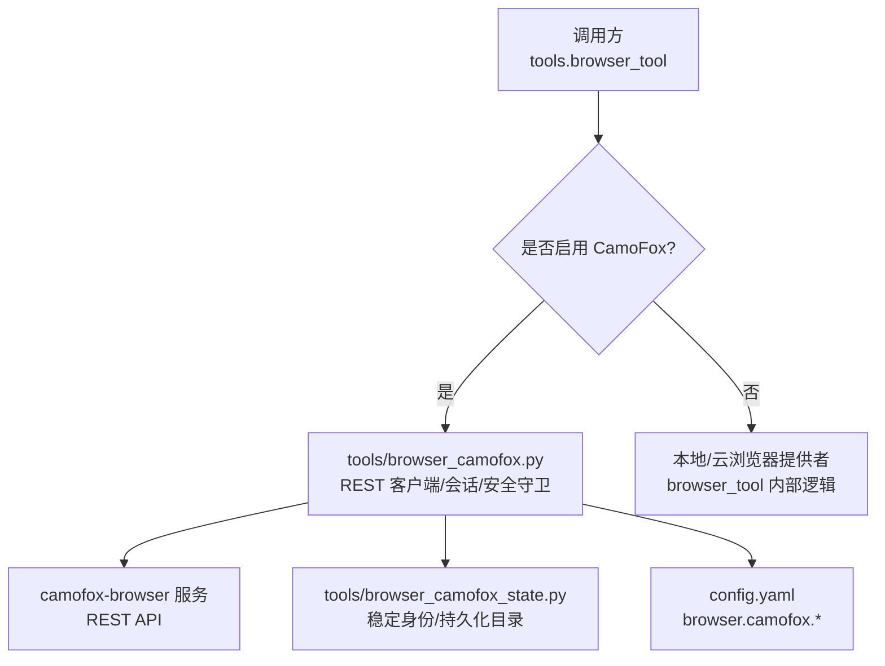
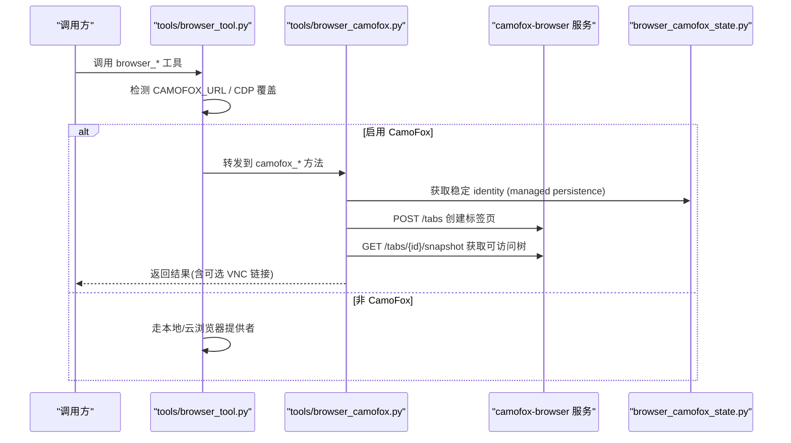
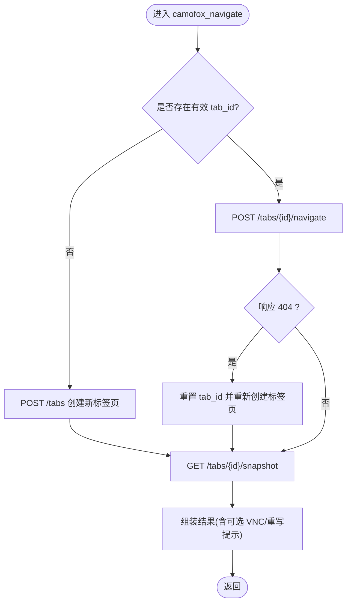
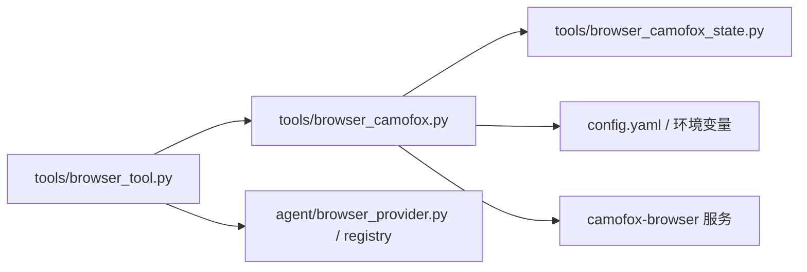

# CamoFox 集成

<cite>
**本文引用的文件**
- [tools/browser_camofox.py](file://tools/browser_camofox.py)
- [tools/browser_camofox_state.py](file://tools/browser_camofox_state.py)
- [hermes_cli/config_defaults.py](file://hermes_cli/config_defaults.py)
- [hermes_cli/tools_config.py](file://hermes_cli/tools_config.py)
- [tools/browser_tool.py](file://tools/browser_tool.py)
- [agent/browser_provider.py](file://agent/browser_provider.py)
- [agent/browser_registry.py](file://agent/browser_registry.py)
</cite>

## 目录
1. [简介](#简介)
2. [项目结构](#项目结构)
3. [核心组件](#核心组件)
4. [架构总览](#架构总览)
5. [详细组件分析](#详细组件分析)
6. [依赖关系分析](#依赖关系分析)
7. [性能考量](#性能考量)
8. [故障排查指南](#故障排查指南)
9. [结论](#结论)
10. [附录](#附录)

## 简介
本文件面向需要在 Hermes Agent 中启用并配置 CamoFox 反检测浏览器后端的用户与开发者。CamoFox 通过一个本地或容器化的 Node.js 服务（camofox-browser）暴露 REST API，将浏览器操作映射为与标准浏览器工具一致的接口，从而在不直接启动本地 Chromium 的情况下完成页面导航、快照、点击、输入、滚动、截图与视觉分析等任务。该方案特别适用于需要指纹伪装、行为模拟与反检测能力的场景。

## 项目结构
围绕 CamoFox 的集成主要涉及以下模块：
- 后端适配层：tools/browser_camofox.py 实现与 camofox-browser 服务的 HTTP 交互、会话管理、URL 重写与安全守卫。
- 持久化身份：tools/browser_camofox_state.py 提供基于 Hermes Profile 的稳定 userId/sessionKey 生成，用于跨重启保持浏览器配置文件。
- 配置与引导：hermes_cli/config_defaults.py 定义 browser.camofox 默认配置项；hermes_cli/tools_config.py 提供“反检测浏览器”选项与环境变量提示。
- 路由与模式切换：tools/browser_tool.py 在检测到 CAMOFOX_URL 时自动切换到 CamoFox 路径；同时保留云/本地浏览器提供者选择逻辑。
- 云浏览器抽象：agent/browser_provider.py 与 agent/browser_registry.py 负责云浏览器提供者的注册与选择（与 CamoFox 并行存在，互不冲突）。

图表来源
- [tools/browser_camofox.py:115-131](file://tools/browser_camofox.py#L115-L131)
- [tools/browser_tool.py:178-184](file://tools/browser_tool.py#L178-L184)
- [hermes_cli/config_defaults.py:428-444](file://hermes_cli/config_defaults.py#L428-L444)

章节来源
- [tools/browser_camofox.py:1-24](file://tools/browser_camofox.py#L1-L24)
- [tools/browser_camofox_state.py:1-48](file://tools/browser_camofox_state.py#L1-L48)
- [hermes_cli/config_defaults.py:428-444](file://hermes_cli/config_defaults.py#L428-L444)
- [hermes_cli/tools_config.py:650-657](file://hermes_cli/tools_config.py#L650-L657)
- [tools/browser_tool.py:178-184](file://tools/browser_tool.py#L178-L184)

## 核心组件
- CamoFox 适配器（tools/browser_camofox.py）
  - 提供 navigate/snapshot/click/type/scroll/back/press/close/get_images/vision/console 等工具函数，统一封装对 camofox-browser 的 HTTP 调用。
  - 维护进程内会话缓存（task_id -> {user_id, tab_id, session_key, managed, adopt_existing_tab}），支持“接管已有标签页”和“受管持久化”。
  - 内置安全守卫：当 SSRF 防护生效且当前页面为私有/内网地址时，阻止读取快照、截图、点击等操作。
  - Docker 友好：可重写 localhost/127.0.0.1/::1 类回环 URL 到 host.docker.internal 等别名，便于容器内打开宿主服务。
- 身份与持久化（tools/browser_camofox_state.py）
  - 基于 Hermes Home 下的固定目录生成稳定的 user_id 与 session_key，使 CamoFox 服务端能映射到同一 Firefox 配置文件，实现跨重启登录态与数据持久化。
- 配置与引导（hermes_cli/config_defaults.py, hermes_cli/tools_config.py）
  - 提供 browser.camofox.managed_persistence、user_id、session_key、adopt_existing_tab、rewrite_loopback_urls、loopback_host_alias 等开关。
  - 在“工具集”中选择“反检测浏览器（Firefox/Camoufox）”，自动提示设置 CAMOFOX_URL，并可执行 post_setup 钩子安装/运行 camofox-browser。
- 模式切换（tools/browser_tool.py）
  - 若环境变量 CAMOFOX_URL 存在且未启用 CDP 覆盖（BROWSER_CDP_URL 或 config 中的 browser.cdp_url），则所有浏览器工具调用走 CamoFox 路径。
  - 云浏览器提供者（Browserbase/Browser Use/Firecrawl）由独立的 provider/registry 机制处理，与 CamoFox 并存但互斥。

章节来源
- [tools/browser_camofox.py:46-131](file://tools/browser_camofox.py#L46-L131)
- [tools/browser_camofox.py:313-446](file://tools/browser_camofox.py#L313-L446)
- [tools/browser_camofox.py:496-786](file://tools/browser_camofox.py#L496-L786)
- [tools/browser_camofox_state.py:22-48](file://tools/browser_camofox_state.py#L22-L48)
- [hermes_cli/config_defaults.py:428-444](file://hermes_cli/config_defaults.py#L428-L444)
- [hermes_cli/tools_config.py:650-657](file://hermes_cli/tools_config.py#L650-L657)
- [tools/browser_tool.py:178-184](file://tools/browser_tool.py#L178-L184)

## 架构总览
CamoxFox 作为“本地反检测浏览器后端”，通过 REST API 与 Hermes 通信。Hermes 侧的 tools/browser_tool.py 根据环境变量与配置决定路由到 CamoFox 还是其他后端。CamoFox 自身基于 Camoufox（Firefox 分支 + C++ 指纹伪装）提供服务，暴露 /tabs、/sessions 等端点。

图表来源
- [tools/browser_tool.py:178-184](file://tools/browser_tool.py#L178-L184)
- [tools/browser_camofox.py:115-131](file://tools/browser_camofox.py#L115-L131)
- [tools/browser_camofox.py:359-421](file://tools/browser_camofox.py#L359-L421)
- [tools/browser_camofox_state.py:27-48](file://tools/browser_camofox_state.py#L27-L48)

## 详细组件分析

### CamoFox 适配器（tools/browser_camofox.py）
- 工作模式判定
  - is_camofox_mode()：当存在 CAMOFOX_URL 且无 CDP 覆盖（环境变量 BROWSER_CDP_URL 或配置 browser.cdp_url）时启用 CamoFox。
- 健康检查与 VNC
  - check_camofox_available() 探测 /health，并缓存 vncPort，以便后续返回 VNC 观看链接。
- 会话管理
  - _get_session(task_id)：按 task_id 维护进程内会话，支持“接管已有标签页”（adopt_existing_tab）与“受管持久化”（managed_persistence）。
  - _ensure_tab(task_id, url)：按需创建标签页，携带 userId 与 listItemId（session_key）。
  - camofox_soft_cleanup(task_id)：仅释放本地跟踪，保留服务端上下文（受管持久化场景）。
- 工具实现
  - navigate：创建/复用标签页，必要时恢复 404 的过期标签；自动抓取快照并摘要；支持回环 URL 重写。
  - snapshot/click/type/scroll/back/press：均先校验私有页面守卫，再调用对应端点。
  - get_images：从快照文本解析 img 元素及其 URL。
  - vision：截图并调用辅助 LLM 进行视觉问答；对可访问树片段做敏感信息脱敏。
  - console：CamoFox 不支持控制台日志捕获，返回空结果与说明。
- 安全与隐私
  - _camofox_private_page_block()：当 SSRF 防护生效且当前页面为私有/内网地址时，阻止读取快照、截图、点击、按键等操作，防止泄露内网内容。
- Docker 回环 URL 重写
  - _rewrite_loopback_url_for_camofox()：将 http(s)://localhost|127.0.0.x|::1 等重写为配置的 loopback_host_alias（默认 host.docker.internal），避免容器内无法访问宿主机服务。

图表来源
- [tools/browser_camofox.py:496-574](file://tools/browser_camofox.py#L496-L574)

章节来源
- [tools/browser_camofox.py:84-131](file://tools/browser_camofox.py#L84-L131)
- [tools/browser_camofox.py:166-255](file://tools/browser_camofox.py#L166-L255)
- [tools/browser_camofox.py:313-446](file://tools/browser_camofox.py#L313-L446)
- [tools/browser_camofox.py:496-786](file://tools/browser_camofox.py#L496-L786)
- [tools/browser_camofox.py:788-954](file://tools/browser_camofox.py#L788-L954)

### 身份与持久化（tools/browser_camofox_state.py）
- 作用：为 Hermes Profile 生成稳定的 user_id 与 session_key，使 CamoFox 服务端能将不同进程/重启的会话映射到同一 Firefox 配置文件，从而实现 Cookie、登录态等持久化。
- 关键点：
  - get_camofox_identity(task_id)：基于 UUIDv5 派生稳定标识，区分 profile 级 user_id 与逻辑任务级 session_key。
  - get_camofox_state_dir()：返回 ~/.hermes/browser_auth/camofox 目录，供外部持久化使用。

章节来源
- [tools/browser_camofox_state.py:1-48](file://tools/browser_camofox_state.py#L1-L48)

### 配置与引导（hermes_cli/config_defaults.py, hermes_cli/tools_config.py）
- 默认配置（browser.camofox）
  - managed_persistence：是否启用受管持久化（默认关闭）。
  - user_id/session_key：外部托管浏览器的共享身份（可选）。
  - adopt_existing_tab：是否尝试复用已存在的标签页（进程重启后可恢复）。
  - rewrite_loopback_urls：是否重写回环 URL（Docker 场景常用）。
  - loopback_host_alias：重写目标主机别名（默认 host.docker.internal）。
- 工具集引导
  - 在“浏览器自动化”类别下提供“反检测浏览器（Firefox/Camoufox）”选项，提示设置 CAMOFOX_URL，并支持 post_setup 钩子安装/运行 camofox-browser。

章节来源
- [hermes_cli/config_defaults.py:428-444](file://hermes_cli/config_defaults.py#L428-L444)
- [hermes_cli/tools_config.py:650-657](file://hermes_cli/tools_config.py#L650-L657)

### 模式切换与路由（tools/browser_tool.py）
- 当 CAMOFOX_URL 存在且未启用 CDP 覆盖时，浏览器工具调用会路由到 CamoFox 路径。
- 云浏览器提供者（Browserbase/Browser Use/Firecrawl）由独立的 provider/registry 机制管理，与 CamoFox 并存但不互相干扰。

章节来源
- [tools/browser_tool.py:178-184](file://tools/browser_tool.py#L178-L184)
- [agent/browser_provider.py:50-178](file://agent/browser_provider.py#L50-L178)
- [agent/browser_registry.py:1-193](file://agent/browser_registry.py#L1-L193)

## 依赖关系分析
- 运行时依赖
  - requests：HTTP 客户端，用于与 camofox-browser 服务通信。
  - 可选：VNC 查看器（由服务暴露端口，Hermes 仅拼接 URL）。
  - 可选：辅助视觉模型（vision 功能调用 call_llm）。
- 配置依赖
  - 环境变量：CAMOFOX_URL（必需）、CAMOFOX_API_KEY（可选鉴权）、CAMOFOX_REWRITE_LOOPBACK_URLS、CAMOFOX_ADOPT_EXISTING_TAB、CAMOFOX_USER_ID、CAMOFOX_SESSION_KEY、CAMOFOX_LOOPBACK_HOST_ALIAS。
  - 配置文件：browser.camofox.* 各项开关。
- 与其他模块耦合
  - tools/browser_tool.py：模式切换入口。
  - tools/browser_camofox_state.py：持久化身份。
  - agent/browser_provider.py / agent/browser_registry.py：云浏览器提供者（与 CamoFox 并存）。

图表来源
- [tools/browser_tool.py:178-184](file://tools/browser_tool.py#L178-L184)
- [tools/browser_camofox.py:115-131](file://tools/browser_camofox.py#L115-L131)
- [tools/browser_camofox_state.py:27-48](file://tools/browser_camofox_state.py#L27-L48)
- [agent/browser_provider.py:50-178](file://agent/browser_provider.py#L50-L178)
- [agent/browser_registry.py:1-193](file://agent/browser_registry.py#L1-L193)

章节来源
- [tools/browser_camofox.py:28-44](file://tools/browser_camofox.py#L28-L44)
- [tools/browser_camofox.py:115-131](file://tools/browser_camofox.py#L115-L131)
- [tools/browser_camofox.py:166-255](file://tools/browser_camofox.py#L166-L255)
- [tools/browser_tool.py:178-184](file://tools/browser_tool.py#L178-L184)
- [agent/browser_provider.py:50-178](file://agent/browser_provider.py#L50-L178)
- [agent/browser_registry.py:1-193](file://agent/browser_registry.py#L1-L193)

## 性能考量
- 网络开销
  - 每次导航/快照/截图都会产生一次 HTTP 往返。建议合理复用标签页（避免频繁创建/销毁），并在大页面时使用快照摘要阈值以减少传输与处理成本。
- 超时控制
  - 命令超时来自 browser.command_timeout（默认 30s，最小 5s），可通过配置调整以匹配慢速站点或容器环境。
- 快照大小限制
  - 快照超过一定字符数时会触发摘要/截断，避免上下文过大影响模型处理。
- 视觉分析延迟
  - vision 功能需截图并调用辅助 LLM，耗时取决于图片大小与模型响应时间，可通过配置 timeout/temperature 调节。
- 资源占用
  - CamoFox 基于 Firefox/Camoufox，内存与 CPU 占用高于 headless Chromium；在高并发或多会话场景下需评估资源配额。

[本节为通用指导，不直接分析具体文件]

## 故障排查指南
- 无法连接 CamoFox 服务
  - 现象：navigate 报错“Cannot connect to Camofox at ...”。
  - 排查：确认 camofox-browser 已启动；检查 CAMOFOX_URL；必要时开启 CAMOFOX_REWRITE_LOOPBACK_URLS（Docker 场景）。
- 标签页失效（404）
  - 现象：navigate 过程中出现 404。
  - 处理：适配器会自动重建标签页；如频繁发生，检查服务端稳定性或减少会话复用。
- 私有/内网页面被阻止
  - 现象：snapshot/click/type/press/vision 返回“Blocked: page URL targets a private or internal address...”。
  - 原因：SSRF 防护生效且当前页面为内网地址。
  - 处理：如需允许，请调整相关策略；或在本地模式下操作。
- 无法看到浏览器画面
  - 现象：无 VNC 链接。
  - 处理：确保 camofox-browser 暴露 vncPort；或通过 /health 检查服务状态。
- 控制台日志不可用
  - 现象：console 返回空消息与说明。
  - 处理：改用 snapshot 或 vision 观察页面状态。

章节来源
- [tools/browser_camofox.py:496-574](file://tools/browser_camofox.py#L496-L574)
- [tools/browser_camofox.py:577-608](file://tools/browser_camofox.py#L577-L608)
- [tools/browser_camofox.py:611-786](file://tools/browser_camofox.py#L611-L786)
- [tools/browser_camofox.py:936-950](file://tools/browser_camofox.py#L936-L950)

## 结论
CamoFox 集成提供了无需本地 Chromium 的反检测浏览器能力，适合需要指纹伪装与行为模拟的场景。通过环境变量与配置项，可在不同部署形态（本地/容器）下灵活启用；结合受管持久化可实现跨重启的登录态保持。对于高并发或资源受限环境，应关注超时、快照大小与视觉分析的性能影响。

[本节为总结性内容，不直接分析具体文件]

## 附录

### 环境变量与配置清单
- 必需
  - CAMOFOX_URL：CamoFox 服务地址（例如 http://localhost:9377）。
- 可选
  - CAMOFOX_API_KEY：API 鉴权密钥（Bearer Token）。
  - CAMOFOX_REWRITE_LOOPBACK_URLS：是否重写回环 URL（true/false）。
  - CAMOFOX_ADOPT_EXISTING_TAB：是否接管已有标签页（true/false）。
  - CAMOFOX_USER_ID / CAMOFOX_SESSION_KEY：外部托管浏览器的共享身份。
  - CAMOFOX_LOOPBACK_HOST_ALIAS：回环 URL 重写目标主机别名（默认 host.docker.internal）。
  - browser.command_timeout：命令超时（秒），最小 5s。
  - browser.camofox.managed_persistence：启用受管持久化。
  - browser.cdp_url：CDP 覆盖（启用后会优先走 CDP，禁用 CamoFox）。

章节来源
- [tools/browser_camofox.py:84-131](file://tools/browser_camofox.py#L84-L131)
- [tools/browser_camofox.py:166-255](file://tools/browser_camofox.py#L166-L255)
- [hermes_cli/config_defaults.py:428-444](file://hermes_cli/config_defaults.py#L428-L444)
- [hermes_cli/tools_config.py:650-657](file://hermes_cli/tools_config.py#L650-L657)

### 与标准浏览器工具的集成示例
- 启用 CamoFox
  - 设置 CAMOFOX_URL=http://localhost:9377（或容器映射端口）。
  - 可选：设置 CAMOFOX_API_KEY 以启用鉴权。
  - Docker 场景：设置 CAMOFOX_REWRITE_LOOPBACK_URLS=true 与 CAMOFOX_LOOPBACK_HOST_ALIAS=host.docker.internal。
- 基本流程
  - 调用 browser_navigate 打开目标页面。
  - 调用 browser_snapshot 获取可访问树快照。
  - 使用 @ref 进行 click/type/press/scroll 等操作。
  - 使用 browser_vision 截图并进行视觉问答。
  - 使用 browser_close 关闭会话（或 camofox_soft_cleanup 仅释放本地跟踪）。
- 切换后端
  - 设置 BROWSER_CDP_URL 或配置 browser.cdp_url 将优先走 CDP（本地/远程 Chrome）。
  - 未设置上述覆盖且存在 CAMOFOX_URL 时，自动走 CamoFox。
  - 云浏览器提供者（Browserbase/Browser Use/Firecrawl）通过 provider/registry 选择，与 CamoFox 并存。

章节来源
- [tools/browser_tool.py:178-184](file://tools/browser_tool.py#L178-L184)
- [tools/browser_camofox.py:496-786](file://tools/browser_camofox.py#L496-L786)
- [agent/browser_provider.py:50-178](file://agent/browser_provider.py#L50-L178)
- [agent/browser_registry.py:1-193](file://agent/browser_registry.py#L1-L193)

### 适用场景与最佳实践
- 适用场景
  - 需要反检测与指纹伪装的自动化任务（如数据采集、表单填写、多账号隔离）。
  - 容器化部署，希望集中管理浏览器实例与可视化调试（VNC）。
  - 需要跨重启保持登录态（启用 managed_persistence）。
- 最佳实践
  - 合理设置 command_timeout，避免长页面加载阻塞。
  - 在大页面场景下利用快照摘要与截断，降低上下文压力。
  - 在 Docker 环境中启用回环 URL 重写，避免容器内无法访问宿主服务。
  - 谨慎使用 vision 功能，注意图片大小与模型响应时间。
  - 在 SSRF 防护生效时，避免对私有/内网页面进行快照/截图/交互。

[本节为通用指导，不直接分析具体文件]