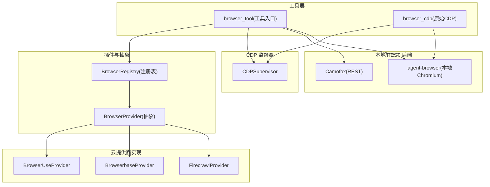
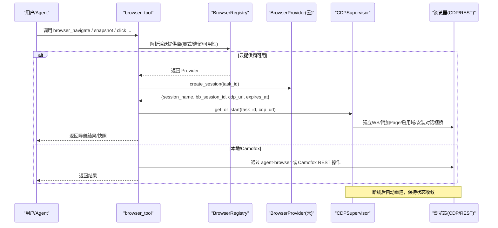
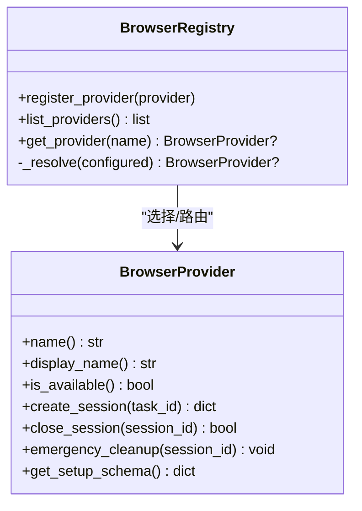
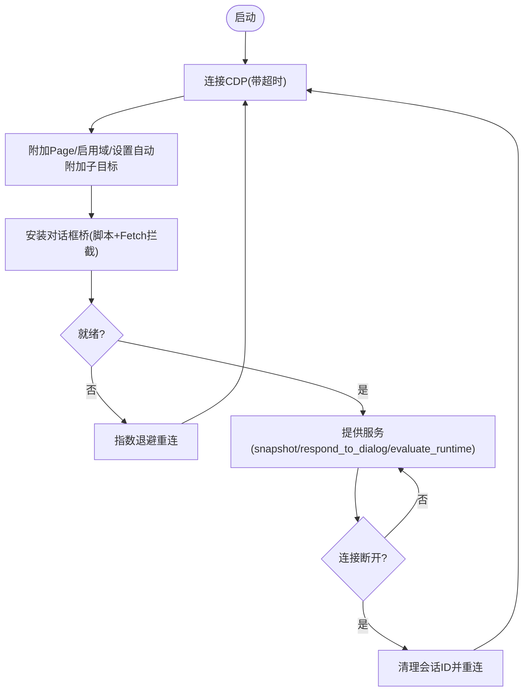
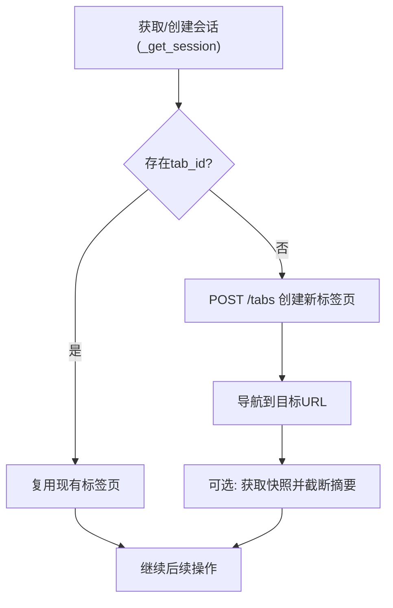
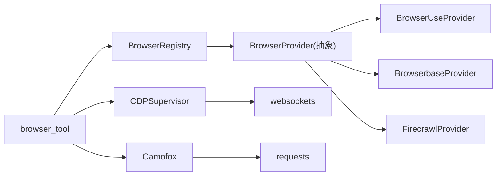

# 浏览器会话管理

<cite>
**本文引用的文件**
- [browser_provider.py](file://agent/browser_provider.py)
- [browser_registry.py](file://agent/browser_registry.py)
- [browser_supervisor.py](file://tools/browser_supervisor.py)
- [browser_cdp_tool.py](file://tools/browser_cdp_tool.py)
- [browser_camofox.py](file://tools/browser_camofox.py)
- [browser_camofox_state.py](file://tools/browser_camofox_state.py)
- [browser_tool.py](file://tools/browser_tool.py)
</cite>

## 目录
1. [简介](#简介)
2. [项目结构](#项目结构)
3. [核心组件](#核心组件)
4. [架构总览](#架构总览)
5. [详细组件分析](#详细组件分析)
6. [依赖关系分析](#依赖关系分析)
7. [性能与内存优化](#性能与内存优化)
8. [故障诊断与排错](#故障诊断与排错)
9. [结论](#结论)
10. [附录：使用模式与实践](#附录使用模式与实践)

## 简介
本文件系统性说明 Hermes Agent 的浏览器会话管理，覆盖生命周期、会话隔离、资源清理、超时处理与错误恢复；并阐述多任务并发、会话池管理与内存优化策略。同时提供监控、调试与故障诊断方法，以及长时间运行自动化、批量网页处理与分布式浏览器实例管理的实践建议。

## 项目结构
Hermes 的浏览器能力由“云提供商抽象 + 注册表 + CDP 监督器 + 本地/REST 后端”组成：
- 云提供商抽象与注册：定义统一的会话创建/关闭/紧急清理接口，并按配置自动选择可用后端。
- CDP 监督器：为每个任务维护一个持久化的 CDP 连接，统一处理对话框、帧树、控制台事件等。
- 本地/REST 后端：Camofox（REST）与通过 agent-browser CLI 的本地 Chromium 路径。
- 工具层：对外暴露 browser_* 工具集，内部路由到具体后端或 CDP 监督器。



图表来源
- [browser_provider.py:50-178](file://agent/browser_provider.py#L50-L178)
- [browser_registry.py:48-186](file://agent/browser_registry.py#L48-L186)
- [browser_supervisor.py:289-350](file://tools/browser_supervisor.py#L289-L350)
- [browser_camofox.py:115-132](file://tools/browser_camofox.py#L115-L132)
- [browser_tool.py:159-184](file://tools/browser_tool.py#L159-L184)

章节来源
- [browser_provider.py:50-178](file://agent/browser_provider.py#L50-L178)
- [browser_registry.py:48-186](file://agent/browser_registry.py#L48-L186)
- [browser_supervisor.py:289-350](file://tools/browser_supervisor.py#L289-L350)
- [browser_camofox.py:115-132](file://tools/browser_camofox.py#L115-L132)
- [browser_tool.py:159-184](file://tools/browser_tool.py#L159-L184)

## 核心组件
- BrowserProvider（抽象）：定义 name、is_available、create_session、close_session、emergency_cleanup、get_setup_schema 等统一接口，保证不同云后端一致的生命周期契约。
- BrowserRegistry（注册表）：集中管理已注册的云提供商，按配置优先级解析出“活跃提供商”，支持显式配置、遗留偏好顺序与可用性过滤。
- CDPSupervisor（CDP 监督器）：单任务单例，维护持久 CDP WebSocket，订阅 Page/Runtime/Target 事件，提供线程安全的快照、对话框响应、运行时表达式执行等。
- Camofox（REST 后端）：通过 REST API 管理标签页与会话，支持托管持久化、循环地址重写、VNC 可视化等。
- browser_tool（工具入口）：统一封装 navigate/snapshot/click/type 等操作，自动选择后端，注入安全守卫与快照摘要。
- browser_cdp（原始 CDP）：透传任意 CDP 命令，支持跨进程 iframe（OOPIF）路由至监督器，具备私有页面防护。

章节来源
- [browser_provider.py:50-178](file://agent/browser_provider.py#L50-L178)
- [browser_registry.py:48-186](file://agent/browser_registry.py#L48-L186)
- [browser_supervisor.py:289-350](file://tools/browser_supervisor.py#L289-L350)
- [browser_camofox.py:313-445](file://tools/browser_camofox.py#L313-L445)
- [browser_tool.py:159-184](file://tools/browser_tool.py#L159-L184)
- [browser_cdp_tool.py:394-531](file://tools/browser_cdp_tool.py#L394-L531)

## 架构总览
下图展示从工具调用到后端执行的完整流程，包括云提供商选择、CDP 监督器复用、对话框桥接与错误恢复。



图表来源
- [browser_registry.py:113-186](file://agent/browser_registry.py#L113-L186)
- [browser_provider.py:90-127](file://agent/browser_provider.py#L90-L127)
- [browser_supervisor.py:644-740](file://tools/browser_supervisor.py#L644-L740)
- [browser_tool.py:159-184](file://tools/browser_tool.py#L159-L184)

## 详细组件分析

### 云提供商抽象与注册
- 抽象接口：统一会话创建/关闭/紧急清理，确保工具层无需感知后端差异。
- 注册与选择：支持显式配置优先、遗留偏好顺序（browser-use → browserbase）、可用性过滤；显式配置即使不可用也返回，以便下游给出精确错误提示。
- 扩展点：get_setup_schema 用于在工具选择界面展示环境变量与引导安装。



图表来源
- [browser_provider.py:50-178](file://agent/browser_provider.py#L50-L178)
- [browser_registry.py:48-186](file://agent/browser_registry.py#L48-L186)

章节来源
- [browser_provider.py:50-178](file://agent/browser_provider.py#L50-L178)
- [browser_registry.py:48-186](file://agent/browser_registry.py#L48-L186)

### CDP 监督器（会话与状态中枢）
- 单任务单例：以 task_id 为单位持有唯一 CDP 连接，避免重复握手成本。
- 事件驱动：订阅 Page/Runtime/Target，维护待处理对话框、最近对话框历史、帧树与控制台事件环形缓冲。
- 对话框桥接：注入脚本拦截 alert/confirm/prompt，并通过 Fetch 拦截将请求转为“待处理对话框”，供上层决策。
- 超时与重试：启动超时、连接指数退避重连、对话自动处置策略与超时。
- 线程安全：对外提供同步快照与对话框响应，内部通过独立事件循环调度。



图表来源
- [browser_supervisor.py:353-443](file://tools/browser_supervisor.py#L353-L443)
- [browser_supervisor.py:644-740](file://tools/browser_supervisor.py#L644-L740)
- [browser_supervisor.py:741-800](file://tools/browser_supervisor.py#L741-L800)

章节来源
- [browser_supervisor.py:289-350](file://tools/browser_supervisor.py#L289-L350)
- [browser_supervisor.py:353-443](file://tools/browser_supervisor.py#L353-L443)
- [browser_supervisor.py:644-740](file://tools/browser_supervisor.py#L644-L740)
- [browser_supervisor.py:741-800](file://tools/browser_supervisor.py#L741-L800)

### 原始 CDP 工具与安全边界
- 透传任意 CDP 方法，支持 target_id 与 frame_id 路由；当指定 frame_id 时，通过监督器的现有连接转发，避免频繁重连与签名 URL 过期问题。
- 私有页面防护：对当前处于私有/内网页面的场景，限制敏感 CDP 方法，防止泄露页面内容。
- 输出脱敏：对 CDP 返回内容进行敏感信息脱敏。

```mermaid
sequenceDiagram
participant A as "Agent"
participant T as "browser_cdp"
participant G as "私有页面防护"
participant S as "CDPSupervisor"
participant B as "浏览器"
A->>T : method + params (+frame_id?)
T->>G : 校验是否允许(私有页面/SSRF)
alt 允许
opt 有frame_id
T->>S : 查找frame对应child session
S-->>T : child session id
T->>S : 通过监督器执行CDP
else 无frame_id
T->>B : 直接建立CDP连接执行
end
T-->>A : 成功结果(已脱敏)
else 拒绝
T-->>A : 错误(包含原因)
end
```

图表来源
- [browser_cdp_tool.py:127-180](file://tools/browser_cdp_tool.py#L127-L180)
- [browser_cdp_tool.py:284-391](file://tools/browser_cdp_tool.py#L284-L391)
- [browser_cdp_tool.py:394-531](file://tools/browser_cdp_tool.py#L394-L531)

章节来源
- [browser_cdp_tool.py:127-180](file://tools/browser_cdp_tool.py#L127-L180)
- [browser_cdp_tool.py:284-391](file://tools/browser_cdp_tool.py#L284-L391)
- [browser_cdp_tool.py:394-531](file://tools/browser_cdp_tool.py#L394-L531)

### Camofox 后端（REST 会话管理）
- 会话模型：task_id -> {user_id, tab_id, session_key, managed, adopt_existing_tab}，支持接管已有标签页。
- 托管持久化：基于 profile 生成稳定 user_id/session_key，使浏览器配置文件跨重启可复用。
- 循环地址重写：Docker 环境下将 localhost 映射为 host.docker.internal，便于容器内访问宿主机服务。
- 生命周期：按需创建标签页，导航失败时重建；软清理仅释放本地跟踪，保留服务端上下文（托管模式下）。



图表来源
- [browser_camofox.py:313-445](file://tools/browser_camofox.py#L313-L445)
- [browser_camofox.py:496-575](file://tools/browser_camofox.py#L496-L575)
- [browser_camofox_state.py:22-47](file://tools/browser_camofox_state.py#L22-L47)

章节来源
- [browser_camofox.py:313-445](file://tools/browser_camofox.py#L313-L445)
- [browser_camofox.py:496-575](file://tools/browser_camofox.py#L496-L575)
- [browser_camofox_state.py:22-47](file://tools/browser_camofox_state.py#L22-L47)

### 工具入口与后端路由
- 自动选择：根据配置与可用性选择云提供商或本地/Camofox 路径。
- 安全与摘要：对快照进行任务相关摘要与截断，降低上下文体积；对私有页面访问进行阻断。
- 环境隔离：向 agent-browser 子进程传递最小必要的环境变量，避免密钥泄露。

章节来源
- [browser_tool.py:159-184](file://tools/browser_tool.py#L159-L184)
- [browser_tool.py:125-140](file://tools/browser_tool.py#L125-L140)

## 依赖关系分析
- 低耦合：工具层不直接依赖具体云提供商实现，仅通过注册表与抽象接口交互。
- 高内聚：CDP 监督器集中处理连接、事件与状态；Camofox 模块封装 REST 会话细节。
- 外部依赖：websockets（CDP）、requests（HTTP）、agent-browser（本地 Chromium）。



图表来源
- [browser_tool.py:159-184](file://tools/browser_tool.py#L159-L184)
- [browser_registry.py:48-186](file://agent/browser_registry.py#L48-L186)
- [browser_supervisor.py:644-740](file://tools/browser_supervisor.py#L644-L740)
- [browser_camofox.py:452-489](file://tools/browser_camofox.py#L452-L489)

章节来源
- [browser_tool.py:159-184](file://tools/browser_tool.py#L159-L184)
- [browser_registry.py:48-186](file://agent/browser_registry.py#L48-L186)
- [browser_supervisor.py:644-740](file://tools/browser_supervisor.py#L644-L740)
- [browser_camofox.py:452-489](file://tools/browser_camofox.py#L452-L489)

## 性能与内存优化
- 会话复用：CDP 监督器维持长连接，避免每次操作的握手开销；对 OOPIF 通过 frame_id 复用同一连接。
- 快照裁剪：对大页面快照进行摘要与截断，减少上下文大小与传输成本。
- 延迟加载：关键依赖（如 websockets、LLM 调用）按需导入，缩短冷启动时间。
- 资源上限：帧树条目与深度限制、控制台事件环形缓冲、最近对话框数量限制，控制内存占用。
- 超时控制：连接、CDP 调用、对话框响应均设超时，避免阻塞。
- 子进程隔离：向 agent-browser 传递最小环境变量，降低安全风险与启动负担。

章节来源
- [browser_supervisor.py:80-96](file://tools/browser_supervisor.py#L80-L96)
- [browser_supervisor.py:507-609](file://tools/browser_supervisor.py#L507-L609)
- [browser_tool.py:78-98](file://tools/browser_tool.py#L78-L98)
- [browser_tool.py:125-140](file://tools/browser_tool.py#L125-L140)

## 故障诊断与排错
- 连接失败：CDP 监督器会指数退避重连；若首次连接失败，start() 抛出明确错误。检查 CDP URL 与网络可达性。
- 对话框未响应：确认 dialog_policy 与超时；查看 pending_dialogs 与 recent_dialogs；必要时使用 browser_cdp 的 handleJavaScriptDialog。
- 私有页面被拒：检查当前页面是否为私有/内网地址；如需访问，调整 allow_private_urls 或使用本地模式。
- Camofox 不可达：检查 CAMOFOX_URL 与服务健康端点；Docker 下确认端口映射与循环地址重写。
- 云提供商鉴权：确认 BROWSER_USE_API_KEY 或托管网关配置；显式配置时即使不可用也会返回，便于定位具体错误。
- 日志与脱敏：所有含 CDP URL 的错误消息会被脱敏；可通过日志级别提升观察重连与事件流。

章节来源
- [browser_supervisor.py:353-393](file://tools/browser_supervisor.py#L353-L393)
- [browser_supervisor.py:644-740](file://tools/browser_supervisor.py#L644-L740)
- [browser_cdp_tool.py:127-180](file://tools/browser_cdp_tool.py#L127-L180)
- [browser_camofox.py:134-163](file://tools/browser_camofox.py#L134-L163)
- [browser_registry.py:113-186](file://agent/browser_registry.py#L113-L186)

## 结论
Hermes 的浏览器会话管理通过“抽象 + 注册表 + 监督器 + 多后端”实现了高内聚、低耦合的架构。它以任务为粒度隔离会话，利用 CDP 长连接与事件驱动机制保障稳定性，结合严格的超时、错误恢复与内存限制策略，满足长时间运行、批量处理与分布式实例的管理需求。配合私有页面防护与输出脱敏，兼顾安全性与可观测性。

## 附录：使用模式与实践
- 长时间运行的自动化任务
  - 使用 CDP 监督器维持长连接，合理设置对话框策略与超时。
  - 定期采集 snapshot 与 console_errors，监控页面健康。
  - 遇到断线自动重连，关注 reattach 日志。
- 批量网页处理
  - 为每个任务分配独立 task_id，确保会话隔离。
  - 对大页面快照启用摘要与截断，控制上下文大小。
  - 使用 frame_id 在 OOPIF 中执行 Runtime.evaluate，避免频繁重连。
- 分布式浏览器实例管理
  - 云提供商：通过 provider.create_session 获取 cdp_url，交由监督器复用。
  - Camofox：启用托管持久化以获得稳定的 user_id/session_key，跨重启复用浏览器配置。
  - 本地模式：通过 agent-browser 启动 headless Chromium，注意 PATH 与依赖。
- 监控与调试
  - 使用 browser_snapshot 获取 pending_dialogs、frame_tree、recent_dialogs。
  - 使用 browser_cdp 直接执行 Target.getTargets、Runtime.evaluate 等底层命令。
  - 开启更高等级日志，观察重连、事件订阅与错误脱敏后的堆栈。

章节来源
- [browser_supervisor.py:289-350](file://tools/browser_supervisor.py#L289-L350)
- [browser_supervisor.py:507-609](file://tools/browser_supervisor.py#L507-L609)
- [browser_cdp_tool.py:394-531](file://tools/browser_cdp_tool.py#L394-L531)
- [browser_camofox.py:176-208](file://tools/browser_camofox.py#L176-L208)
- [browser_tool.py:125-140](file://tools/browser_tool.py#L125-L140)